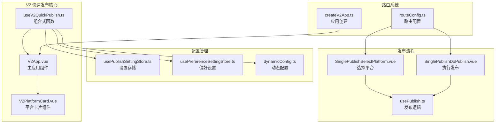
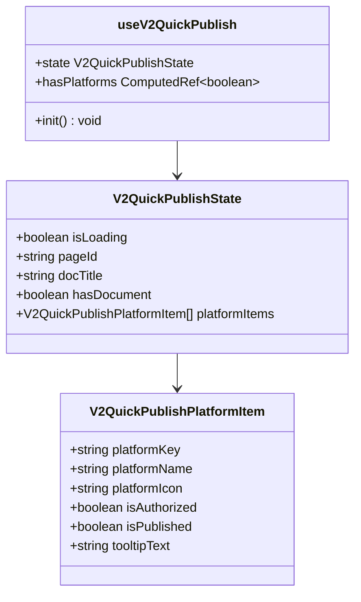
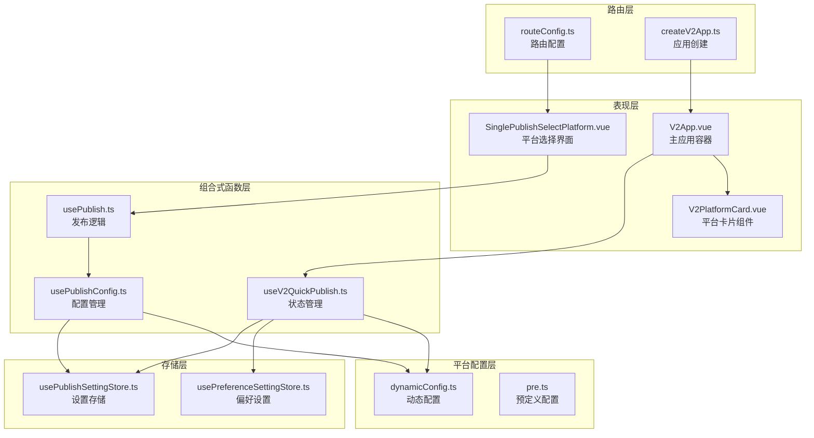
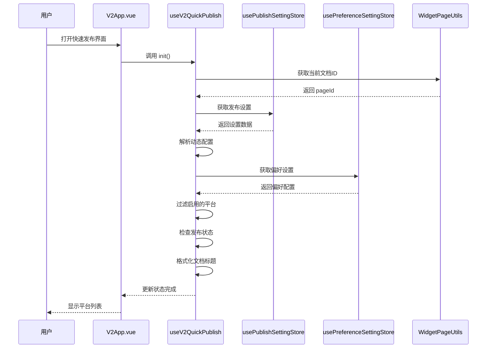
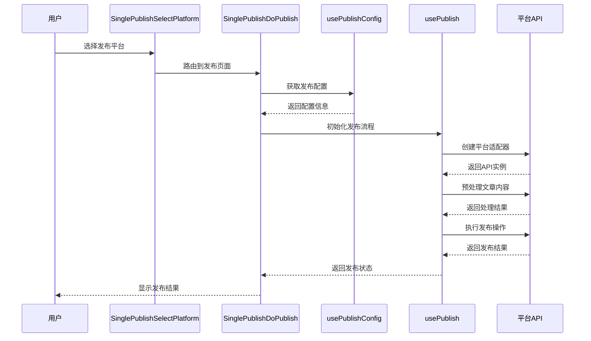
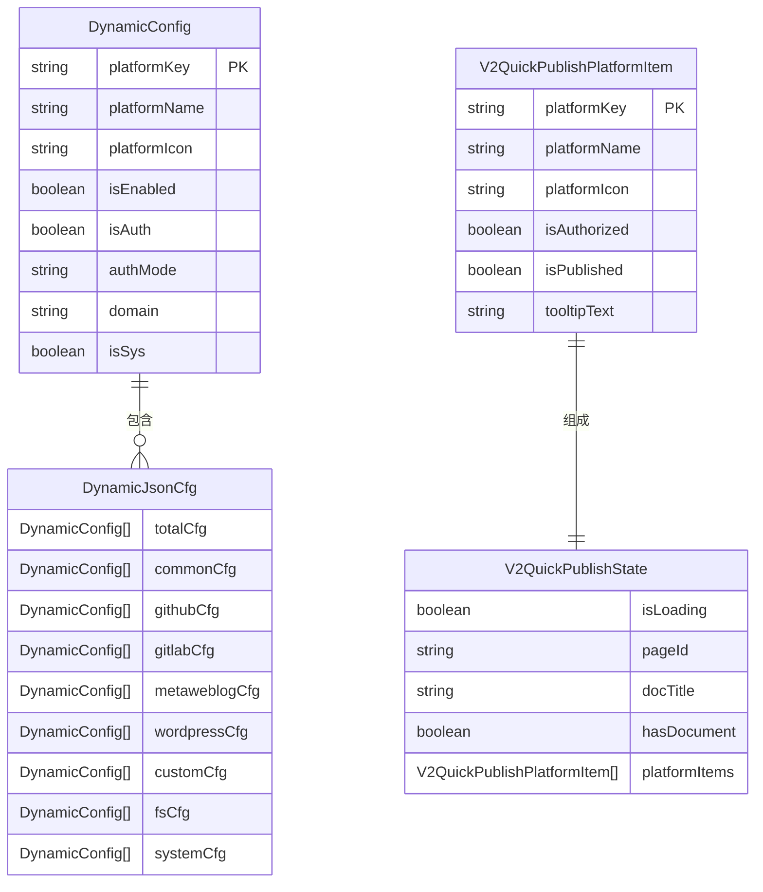
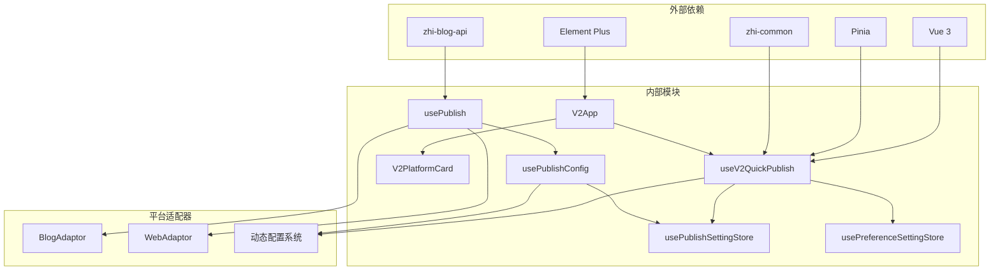

# V2 快速发布组合式函数

<cite>
**本文档引用的文件**
- [useV2QuickPublish.ts](file://src/composables/v2/useV2QuickPublish.ts)
- [V2PlatformCard.vue](file://src/components/v2/publish/V2PlatformCard.vue)
- [V2App.vue](file://src/components/v2/V2App.vue)
- [createV2App.ts](file://src/v2/createV2App.ts)
- [SinglePublishSelectPlatform.vue](file://src/components/publish/SinglePublishSelectPlatform.vue)
- [SinglePublishDoPublish.vue](file://src/components/publish/SinglePublishDoPublish.vue)
- [dynamicConfig.ts](file://src/platforms/dynamicConfig.ts)
- [usePublishSettingStore.ts](file://src/stores/usePublishSettingStore.ts)
- [usePreferenceSettingStore.ts](file://src/stores/usePreferenceSettingStore.ts)
- [routeConfig.ts](file://src/routes/routeConfig.ts)
- [constants.ts](file://src/utils/constants.ts)
- [usePublish.ts](file://src/composables/usePublish.ts)
- [usePublishConfig.ts](file://src/composables/usePublishConfig.ts)
- [pre.ts](file://src/platforms/pre.ts)
</cite>

## 目录
1. [简介](#简介)
2. [项目结构](#项目结构)
3. [核心组件](#核心组件)
4. [架构概览](#架构概览)
5. [详细组件分析](#详细组件分析)
6. [依赖关系分析](#依赖关系分析)
7. [性能考虑](#性能考虑)
8. [故障排除指南](#故障排除指南)
9. [结论](#结论)

## 简介

V2 快速发布组合式函数是思源笔记发布插件中的一个核心功能模块，旨在为用户提供简洁高效的多平台文章发布体验。该功能通过组合式函数模式实现了状态管理和业务逻辑的封装，支持一键发布到多个已配置的平台。

该模块采用现代化的 Vue 3 组合式 API 设计，结合 Pinia 状态管理、Element Plus UI 组件库和 zhi-blog-api 生态系统，为用户提供了直观的发布界面和强大的后台支持。

## 项目结构

基于仓库分析，V2 快速发布功能主要分布在以下目录结构中：



**图表来源**
- [useV2QuickPublish.ts:19-80](file://src/composables/v2/useV2QuickPublish.ts#L19-L80)
- [V2App.vue:104-144](file://src/components/v2/V2App.vue#L104-L144)
- [routeConfig.ts:42-49](file://src/routes/routeConfig.ts#L42-L49)

**章节来源**
- [useV2QuickPublish.ts:1-81](file://src/composables/v2/useV2QuickPublish.ts#L1-L81)
- [V2App.vue:1-276](file://src/components/v2/V2App.vue#L1-L276)
- [routeConfig.ts:1-151](file://src/routes/routeConfig.ts#L1-L151)

## 核心组件

### useV2QuickPublish 组合式函数

`useV2QuickPublish` 是 V2 快速发布功能的核心组合式函数，负责管理发布状态和平台数据。

**主要功能特性：**
- **状态管理**：维护加载状态、文档信息、平台列表等状态
- **数据初始化**：从设置存储中获取动态配置，过滤启用的平台
- **平台状态判断**：根据授权状态和发布状态生成平台卡片数据
- **文档标题处理**：支持标题格式化和偏好设置应用

**核心数据结构：**



**图表来源**
- [useV2QuickPublish.ts:10-30](file://src/composables/v2/useV2QuickPublish.ts#L10-L30)
- [useV2QuickPublish.ts:19-80](file://src/composables/v2/useV2QuickPublish.ts#L19-L80)

**章节来源**
- [useV2QuickPublish.ts:19-80](file://src/composables/v2/useV2QuickPublish.ts#L19-L80)

### V2PlatformCard 平台卡片组件

`V2PlatformCard` 是用于显示单个发布平台状态的 Vue 组件，提供直观的视觉反馈。

**设计特点：**
- **状态指示**：通过颜色和图标显示平台的授权状态和发布状态
- **响应式设计**：支持不同屏幕尺寸的适配
- **无障碍支持**：包含适当的 ARIA 属性和标题提示
- **样式系统**：使用 Stylus 预处理器实现灵活的主题定制

**状态显示逻辑：**

```mermaid
flowchart TD
A[平台卡片渲染] --> B{isAuthorized?}
B --> |是| C[显示"可快速发布"]
B --> |否| D[显示"未授权"]
C --> E{isPublished?}
D --> F[显示tooltip提示]
E --> |是| G[显示"已发布"]
E --> |否| H[显示"未发布"]
G --> I[应用绿色样式]
H --> I
F --> J[应用灰色样式]
```

**图表来源**
- [V2PlatformCard.vue:1-103](file://src/components/v2/publish/V2PlatformCard.vue#L1-L103)

**章节来源**
- [V2PlatformCard.vue:1-103](file://src/components/v2/publish/V2PlatformCard.vue#L1-L103)

## 架构概览

V2 快速发布功能采用分层架构设计，各层职责明确，耦合度低。



**图表来源**
- [V2App.vue:104-144](file://src/components/v2/V2App.vue#L104-L144)
- [useV2QuickPublish.ts:19-80](file://src/composables/v2/useV2QuickPublish.ts#L19-L80)
- [routeConfig.ts:42-49](file://src/routes/routeConfig.ts#L42-L49)

**章节来源**
- [V2App.vue:104-144](file://src/components/v2/V2App.vue#L104-L144)
- [useV2QuickPublish.ts:19-80](file://src/composables/v2/useV2QuickPublish.ts#L19-L80)
- [routeConfig.ts:42-49](file://src/routes/routeConfig.ts#L42-L49)

## 详细组件分析

### 初始化流程分析

V2 快速发布功能的初始化流程涉及多个组件和存储的协调工作。



**图表来源**
- [useV2QuickPublish.ts:34-71](file://src/composables/v2/useV2QuickPublish.ts#L34-L71)
- [V2App.vue:129-131](file://src/components/v2/V2App.vue#L129-L131)

### 发布流程详细分析

完整的发布流程包括平台选择、配置加载、内容处理和实际发布等步骤。



**图表来源**
- [SinglePublishSelectPlatform.vue:62-77](file://src/components/publish/SinglePublishSelectPlatform.vue#L62-L77)
- [SinglePublishDoPublish.vue:104-147](file://src/components/publish/SinglePublishDoPublish.vue#L104-L147)
- [usePublish.ts:70-212](file://src/composables/usePublish.ts#L70-L212)

**章节来源**
- [SinglePublishSelectPlatform.vue:62-77](file://src/components/publish/SinglePublishSelectPlatform.vue#L62-L77)
- [SinglePublishDoPublish.vue:104-147](file://src/components/publish/SinglePublishDoPublish.vue#L104-L147)
- [usePublish.ts:70-212](file://src/composables/usePublish.ts#L70-L212)

### 数据模型分析

V2 快速发布功能涉及多个重要的数据模型和配置结构。



**图表来源**
- [dynamicConfig.ts:13-113](file://src/platforms/dynamicConfig.ts#L13-L113)
- [dynamicConfig.ts:247-257](file://src/platforms/dynamicConfig.ts#L247-L257)
- [useV2QuickPublish.ts:10-30](file://src/composables/v2/useV2QuickPublish.ts#L10-L30)

**章节来源**
- [dynamicConfig.ts:13-113](file://src/platforms/dynamicConfig.ts#L13-L113)
- [dynamicConfig.ts:247-257](file://src/platforms/dynamicConfig.ts#L247-L257)
- [useV2QuickPublish.ts:10-30](file://src/composables/v2/useV2QuickPublish.ts#L10-L30)

## 依赖关系分析

V2 快速发布功能的依赖关系呈现清晰的层次化结构。



**图表来源**
- [useV2QuickPublish.ts:1-8](file://src/composables/v2/useV2QuickPublish.ts#L1-L8)
- [usePublish.ts:13-35](file://src/composables/usePublish.ts#L13-L35)
- [usePublishConfig.ts:10-18](file://src/composables/usePublishConfig.ts#L10-L18)

**章节来源**
- [useV2QuickPublish.ts:1-8](file://src/composables/v2/useV2QuickPublish.ts#L1-L8)
- [usePublish.ts:13-35](file://src/composables/usePublish.ts#L13-L35)
- [usePublishConfig.ts:10-18](file://src/composables/usePublishConfig.ts#L10-L18)

## 性能考虑

V2 快速发布功能在设计时充分考虑了性能优化：

### 状态管理优化
- **响应式状态**：使用 Vue 3 的响应式系统，确保状态变更的高效更新
- **计算属性缓存**：利用 `computed` 属性避免不必要的重新计算
- **懒加载机制**：平台数据按需加载，减少初始渲染负担

### 异步操作处理
- **并发请求**：合理安排异步操作的执行顺序，避免阻塞主线程
- **错误边界**：完善的错误处理机制，确保单个平台失败不影响整体功能
- **超时控制**：为网络请求设置合理的超时时间

### 内存管理
- **组件卸载清理**：及时清理事件监听器和定时器
- **数据结构优化**：使用合适的数据结构减少内存占用
- **图片资源优化**：平台图标采用 SVG 格式，减小文件体积

## 故障排除指南

### 常见问题及解决方案

**问题1：平台列表为空**
- **症状**：快速发布界面显示"暂无已启用的平台"
- **原因**：未配置任何发布平台或平台未启用
- **解决**：进入设置界面添加并启用平台

**问题2：平台显示"未授权"**
- **症状**：平台卡片显示"未授权"状态
- **原因**：平台认证信息缺失或认证失败
- **解决**：通过设置界面完成平台授权

**问题3：文档标题显示异常**
- **症状**：文档标题包含数字前缀或扩展名
- **原因**：标题格式化设置未正确配置
- **解决**：检查偏好设置中的标题处理选项

**问题4：发布失败**
- **症状**：发布过程中出现错误提示
- **原因**：网络连接问题、平台API限制或配置错误
- **解决**：检查网络连接、平台状态和配置信息

**章节来源**
- [useV2QuickPublish.ts:34-71](file://src/composables/v2/useV2QuickPublish.ts#L34-L71)
- [SinglePublishDoPublish.vue:139-146](file://src/components/publish/SinglePublishDoPublish.vue#L139-L146)

## 结论

V2 快速发布组合式函数通过精心设计的架构和实现，为用户提供了高效、直观的多平台发布体验。该功能的主要优势包括：

**技术优势：**
- **模块化设计**：清晰的组件分离和职责划分
- **响应式架构**：充分利用 Vue 3 的现代特性
- **类型安全**：完整的 TypeScript 类型定义
- **可扩展性**：支持新平台的便捷集成

**用户体验优势：**
- **简洁界面**：专注于核心发布功能
- **即时反馈**：清晰的状态指示和操作反馈
- **错误处理**：友好的错误提示和恢复机制
- **性能优化**：流畅的交互体验

**未来发展方向：**
- **平台扩展**：持续增加新的支持平台
- **功能增强**：添加更多发布前的预处理功能
- **性能优化**：进一步提升加载速度和响应性能
- **用户体验**：改进界面设计和交互流程

该模块为思源笔记发布插件奠定了坚实的技术基础，为用户提供了专业级的发布工具体验。