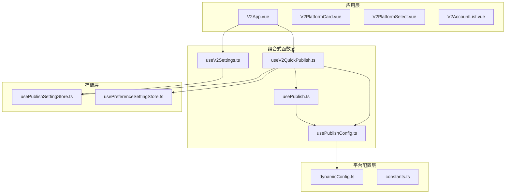
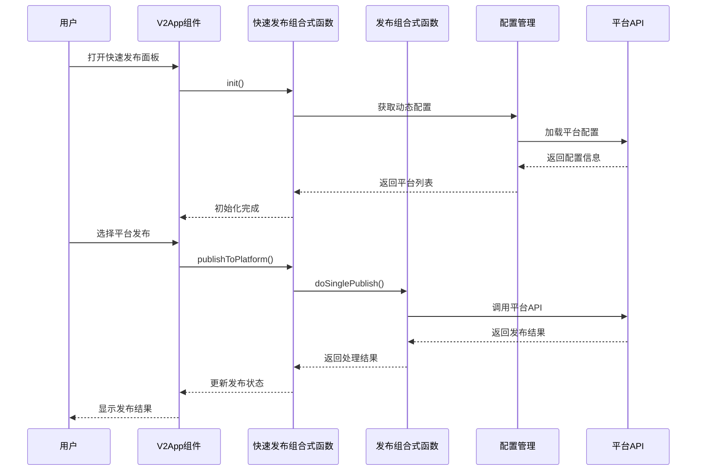
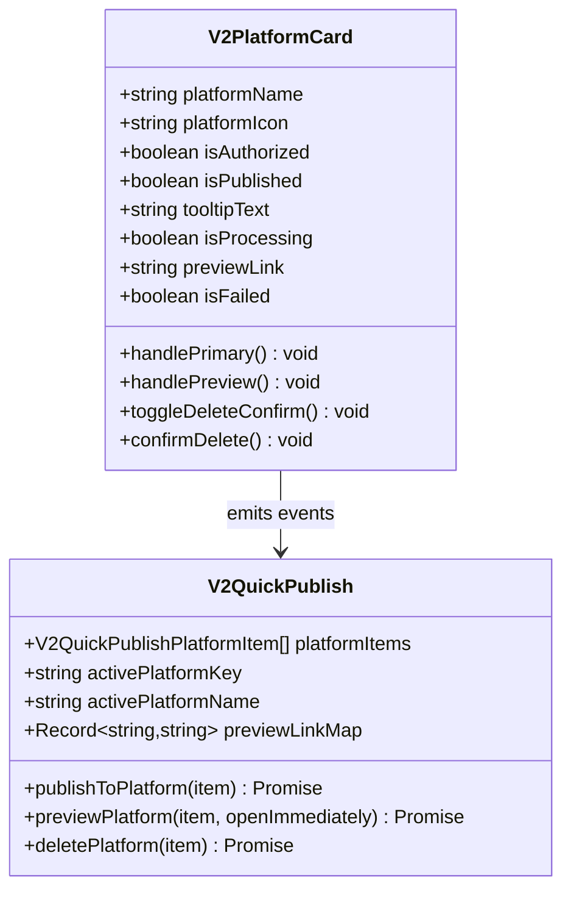
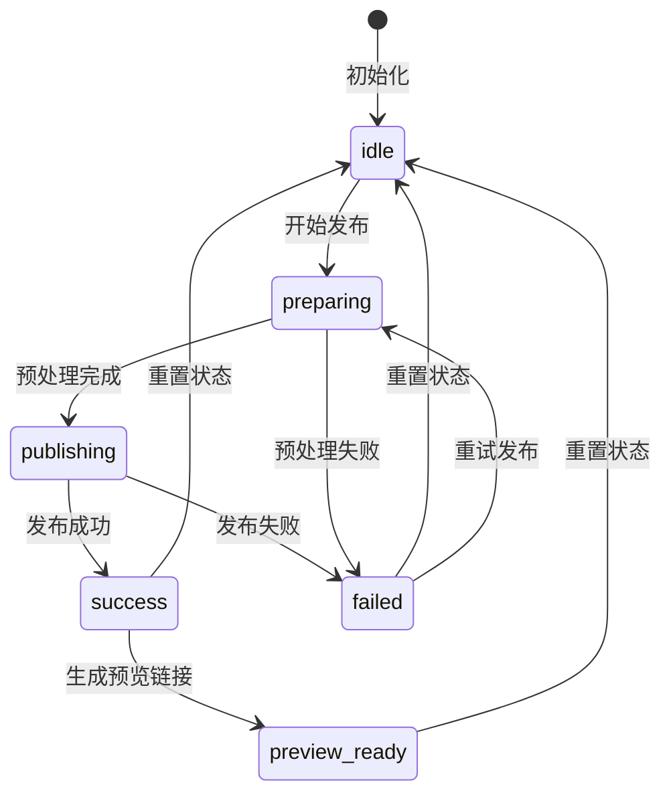
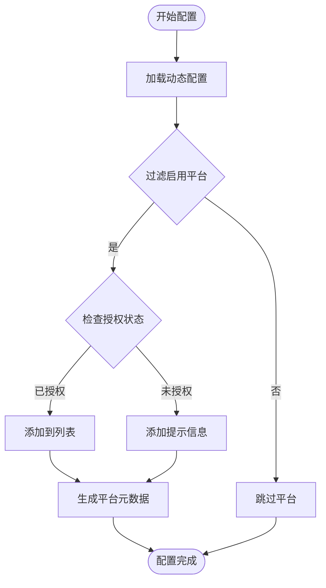
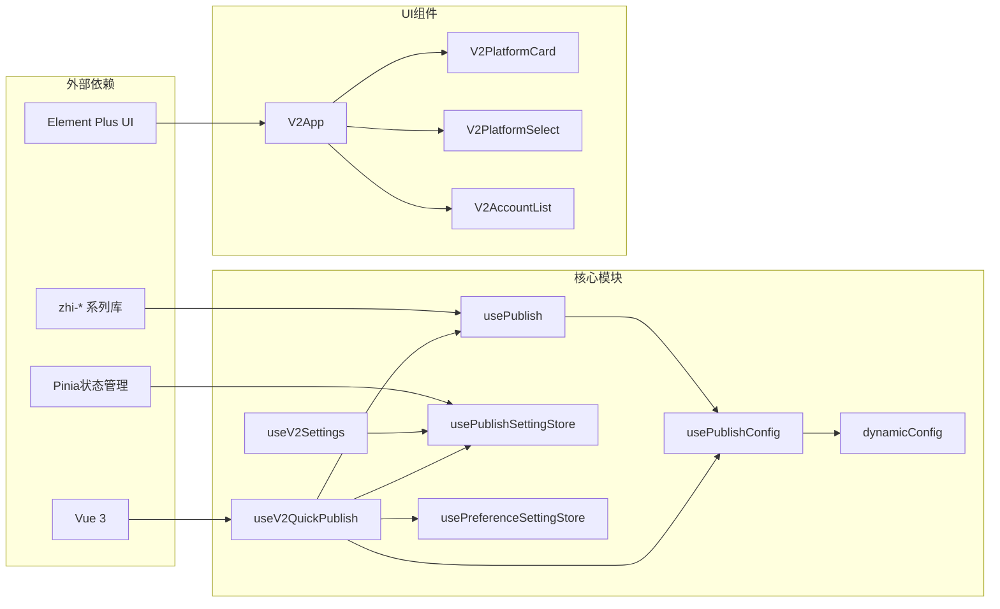

# V2 快速发布组合式函数

<cite>
**本文档引用的文件**
- [useV2QuickPublish.ts](file://src/composables/v2/useV2QuickPublish.ts)
- [useV2Settings.ts](file://src/composables/v2/useV2Settings.ts)
- [V2PlatformCard.vue](file://src/components/v2/publish/V2PlatformCard.vue)
- [V2PlatformSelect.vue](file://src/components/v2/settings/V2PlatformSelect.vue)
- [usePublish.ts](file://src/composables/usePublish.ts)
- [usePublishConfig.ts](file://src/composables/usePublishConfig.ts)
- [usePublishSettingStore.ts](file://src/stores/usePublishSettingStore.ts)
- [usePreferenceSettingStore.ts](file://src/stores/usePreferenceSettingStore.ts)
- [dynamicConfig.ts](file://src/platforms/dynamicConfig.ts)
- [constants.ts](file://src/utils/constants.ts)
- [V2App.vue](file://src/components/v2/V2App.vue)
- [V2AccountList.vue](file://src/components/v2/settings/V2AccountList.vue)
- [package.json](file://package.json)
</cite>

## 目录
1. [简介](#简介)
2. [项目结构](#项目结构)
3. [核心组件](#核心组件)
4. [架构概览](#架构概览)
5. [详细组件分析](#详细组件分析)
6. [依赖关系分析](#依赖关系分析)
7. [性能考虑](#性能考虑)
8. [故障排除指南](#故障排除指南)
9. [结论](#结论)

## 简介

V2 快速发布组合式函数是思源笔记插件发布工具的核心功能模块，为用户提供了一个简洁高效的跨平台文章发布解决方案。该系统基于 Vue 3 Composition API 设计，支持多种内容平台的快速发布、预览和管理功能。

主要特性包括：
- 实时文档上下文感知
- 多平台一键发布
- 发布状态实时跟踪
- 平台授权管理
- 预览链接生成
- 错误处理和重试机制

## 项目结构

该项目采用模块化架构设计，主要分为以下几个核心层次：

**图表来源**
- [V2App.vue:154-301](file://src/components/v2/V2App.vue#L154-L301)
- [useV2QuickPublish.ts:25-310](file://src/composables/v2/useV2QuickPublish.ts#L25-L310)
- [useV2Settings.ts:40-205](file://src/composables/v2/useV2Settings.ts#L40-L205)

**章节来源**
- [V2App.vue:1-489](file://src/components/v2/V2App.vue#L1-L489)
- [package.json:1-102](file://package.json#L1-L102)

## 核心组件

### 快速发布组合式函数

`useV2QuickPublish` 是整个快速发布系统的核心组合式函数，负责管理发布流程的状态和逻辑。

**主要功能**：
- 文档上下文初始化和验证
- 平台列表动态加载和过滤
- 发布状态管理和错误处理
- 预览链接生成和管理
- 发布、更新、删除操作协调

**状态管理**：
- `isLoading`: 页面加载状态
- `pageId`: 当前文档ID
- `docTitle`: 文档标题
- `platformItems`: 可用平台列表
- `activePlatformKey`: 当前激活平台
- `previewLinkMap`: 预览链接映射表
- `publishState`: 发布状态对象

**章节来源**
- [useV2QuickPublish.ts:13-51](file://src/composables/v2/useV2QuickPublish.ts#L13-L51)
- [useV2QuickPublish.ts:99-140](file://src/composables/v2/useV2QuickPublish.ts#L99-L140)

### 设置管理组合式函数

`useV2Settings` 负责管理平台设置和账户配置。

**核心功能**：
- 平台选择和配置
- 账户状态管理
- 设置视图切换
- 动态配置管理

**设置类型**：
- `account`: 账号设置
- `picbed`: 图床设置
- `preference`: 偏好设置

**章节来源**
- [useV2Settings.ts:16-54](file://src/composables/v2/useV2Settings.ts#L16-L54)
- [useV2Settings.ts:75-96](file://src/composables/v2/useV2Settings.ts#L75-L96)

## 架构概览

系统采用分层架构设计，确保各层职责清晰分离：

**图表来源**
- [V2App.vue:265-296](file://src/components/v2/V2App.vue#L265-L296)
- [useV2QuickPublish.ts:145-198](file://src/composables/v2/useV2QuickPublish.ts#L145-L198)
- [usePublish.ts:70-212](file://src/composables/usePublish.ts#L70-L212)

## 详细组件分析

### 快速发布平台卡片组件

`V2PlatformCard` 是用户界面中的核心交互组件，提供直观的平台发布操作界面。

**图表来源**
- [V2PlatformCard.vue:71-115](file://src/components/v2/publish/V2PlatformCard.vue#L71-L115)
- [useV2QuickPublish.ts:145-198](file://src/composables/v2/useV2QuickPublish.ts#L145-L198)

**组件特性**：
- 支持发布、更新、删除三种操作
- 实时状态显示和反馈
- 错误状态高亮显示
- 预览链接一键访问
- 删除操作确认机制

**章节来源**
- [V2PlatformCard.vue:1-278](file://src/components/v2/publish/V2PlatformCard.vue#L1-L278)

### 发布状态管理流程

系统实现了完整的发布状态管理机制，确保用户能够清楚了解发布过程的每个阶段。

**状态定义**：
- `idle`: 空闲状态，等待用户操作
- `preparing`: 预处理阶段，准备发布数据
- `publishing`: 正在发布中
- `success`: 发布成功
- `failed`: 发布失败
- `preview_ready`: 预览链接已生成

**章节来源**
- [useV2QuickPublish.ts:22-50](file://src/composables/v2/useV2QuickPublish.ts#L22-L50)
- [useV2QuickPublish.ts:150-198](file://src/composables/v2/useV2QuickPublish.ts#L150-L198)

### 平台配置管理系统

系统支持动态平台配置，通过 `dynamicConfig` 模块实现灵活的平台管理。

**图表来源**
- [dynamicConfig.ts:13-113](file://src/platforms/dynamicConfig.ts#L13-L113)
- [useV2QuickPublish.ts:112-129](file://src/composables/v2/useV2QuickPublish.ts#L112-L129)

**平台类型支持**：
- Common: 通用平台（语雀、Notion等）
- Metaweblog: 博客园、Typecho等
- WordPress: WordPress及其衍生平台
- GitHub/GitLab: 静态站点生成器
- Custom: 自定义平台（知乎、CSDN等）
- File System: 文件系统平台

**章节来源**
- [dynamicConfig.ts:126-242](file://src/platforms/dynamicConfig.ts#L126-L242)

## 依赖关系分析

系统依赖关系清晰，各模块职责明确：

**图表来源**
- [package.json:32-68](file://package.json#L32-L68)
- [useV2QuickPublish.ts:1-12](file://src/composables/v2/useV2QuickPublish.ts#L1-L12)

**核心依赖说明**：
- **Vue 3**: 提供响应式数据绑定和组件系统
- **Pinia**: 状态管理，替代 Vuex
- **Element Plus**: UI 组件库
- **zhi-blog-api**: 博客平台 API 封装
- **zhi-siyuan-api**: 思源笔记 API 封装

**章节来源**
- [package.json:1-102](file://package.json#L1-L102)

## 性能考虑

系统在设计时充分考虑了性能优化：

### 异步加载策略
- 平台配置采用异步加载，避免阻塞主界面
- 发布操作使用防抖机制，防止重复提交
- 图标资源按需加载，减少初始包体积

### 缓存机制
- 设置配置缓存在内存中，减少磁盘访问
- 发布状态持久化，支持断点续传
- 预览链接缓存，避免重复请求

### 内存管理
- 使用 `reactive` 和 `computed` 优化响应式更新
- 及时清理事件监听器和定时器
- 合理使用 `ref` 和 `reactive` 避免过度包装

## 故障排除指南

### 常见问题及解决方案

**问题1: 平台未授权**
- **症状**: 平台卡片显示"未授权"
- **原因**: 未完成平台授权或授权过期
- **解决**: 点击平台卡片上的"授权入口"按钮，按照平台指引完成授权

**问题2: 发布失败**
- **症状**: 发布状态显示"发布失败"
- **原因**: 网络连接、平台配置或权限问题
- **解决**: 
  1. 检查网络连接
  2. 重新授权平台
  3. 查看错误详情，根据具体错误信息处理

**问题3: 预览链接无法打开**
- **症状**: 点击"查看文章"无响应
- **原因**: 平台返回的预览链接格式不正确
- **解决**: 
  1. 检查平台配置中的 home 地址
  2. 确认平台 API 返回的链接格式

**问题4: 平台列表为空**
- **症状**: 显示"暂无已启用的平台"
- **原因**: 未添加任何平台或所有平台都被禁用
- **解决**: 
  1. 点击"添加账号"
  2. 选择平台类型并完成配置
  3. 启用平台

**章节来源**
- [useV2QuickPublish.ts:55-60](file://src/composables/v2/useV2QuickPublish.ts#L55-L60)
- [useV2QuickPublish.ts:190-197](file://src/composables/v2/useV2QuickPublish.ts#L190-L197)

## 结论

V2 快速发布组合式函数是一个设计精良、功能完善的跨平台发布解决方案。其核心优势包括：

1. **模块化设计**: 采用组合式函数模式，职责清晰，易于维护和扩展
2. **用户体验**: 简洁直观的界面设计，支持一键发布和状态实时反馈
3. **平台兼容性**: 支持多种主流内容平台，配置灵活
4. **错误处理**: 完善的错误处理和重试机制，提升系统稳定性
5. **性能优化**: 合理的异步加载和缓存策略，确保流畅的用户体验

该系统为思源笔记用户提供了强大的内容发布能力，支持多平台同步发布，大大提升了内容创作和分享的效率。随着平台生态的不断完善，该系统将继续扩展支持更多的内容平台和服务。