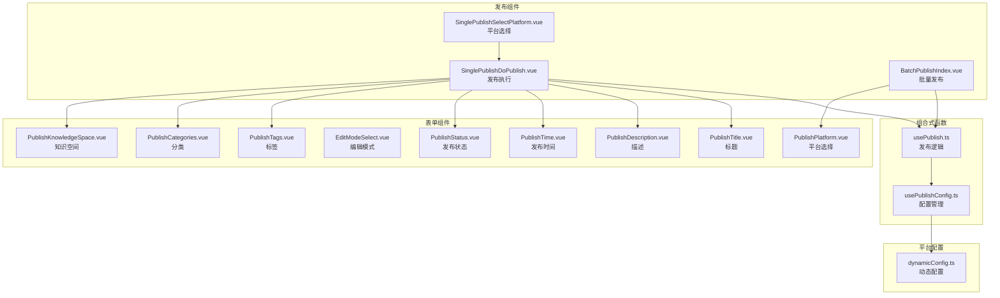
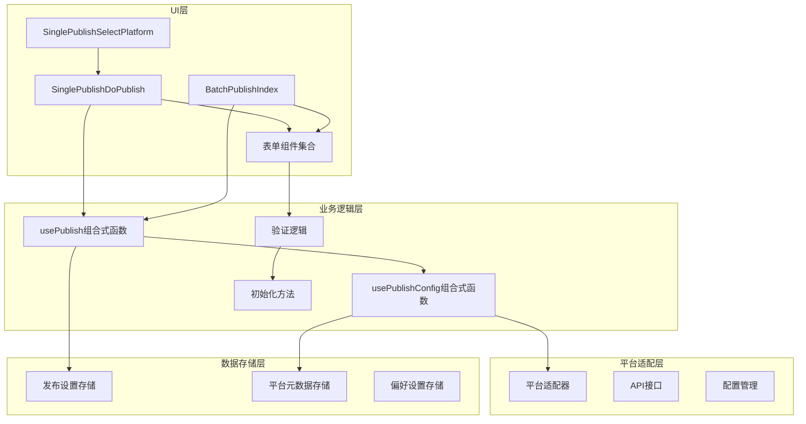
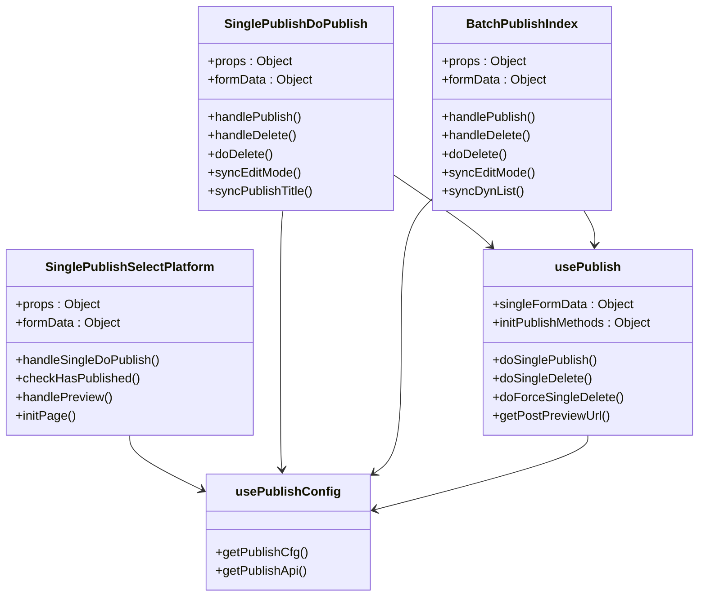
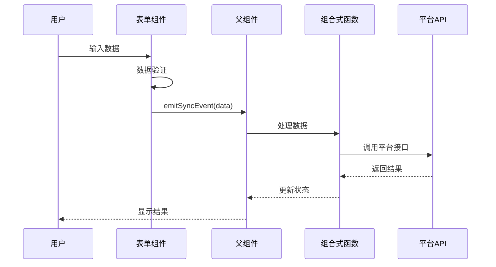
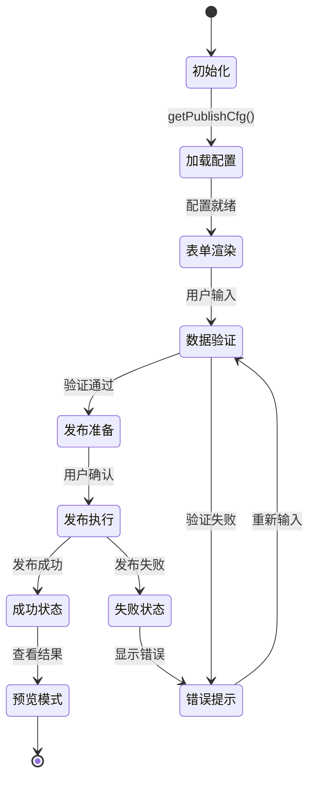
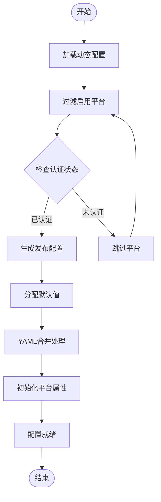
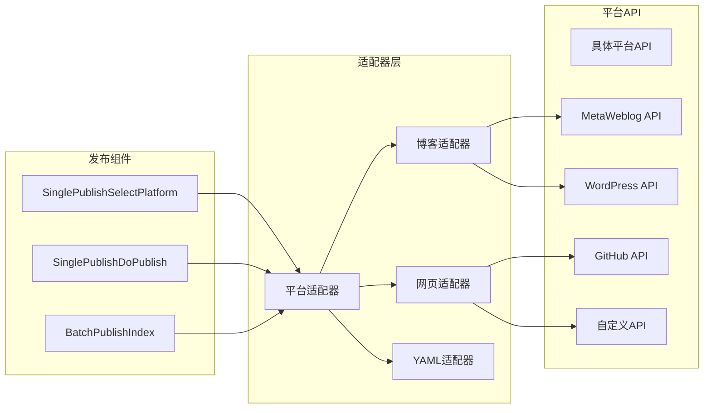
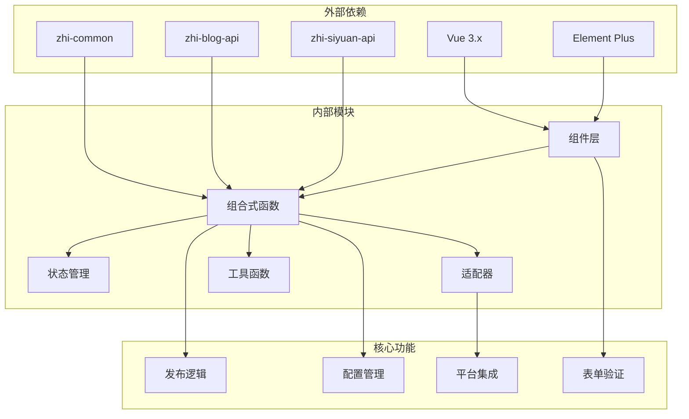

# 发布功能组件

<cite>
**本文档引用的文件**
- [SinglePublishSelectPlatform.vue](file://src/components/publish/SinglePublishSelectPlatform.vue)
- [SinglePublishDoPublish.vue](file://src/components/publish/SinglePublishDoPublish.vue)
- [BatchPublishIndex.vue](file://src/components/publish/BatchPublishIndex.vue)
- [usePublish.ts](file://src/composables/usePublish.ts)
- [usePublishConfig.ts](file://src/composables/usePublishConfig.ts)
- [PublishTitle.vue](file://src/components/publish/form/PublishTitle.vue)
- [PublishDescription.vue](file://src/components/publish/form/PublishDescription.vue)
- [PublishPlatform.vue](file://src/components/publish/form/PublishPlatform.vue)
- [EditModeSelect.vue](file://src/components/publish/form/EditModeSelect.vue)
- [PublishTime.vue](file://src/components/publish/form/PublishTime.vue)
- [PublishStatus.vue](file://src/components/publish/form/PublishStatus.vue)
- [PublishTags.vue](file://src/components/publish/form/PublishTags.vue)
- [PublishCategories.vue](file://src/components/publish/form/PublishCategories.vue)
- [PublishKnowledgeSpace.vue](file://src/components/publish/form/PublishKnowledgeSpace.vue)
- [dynamicConfig.ts](file://src/platforms/dynamicConfig.ts)
</cite>

## 目录
1. [简介](#简介)
2. [项目结构](#项目结构)
3. [核心组件](#核心组件)
4. [架构概览](#架构概览)
5. [详细组件分析](#详细组件分析)
6. [依赖关系分析](#依赖关系分析)
7. [性能考虑](#性能考虑)
8. [故障排除指南](#故障排除指南)
9. [结论](#结论)
10. [附录](#附录)

## 简介

思源笔记发布器插件是一个功能完整的多平台内容发布解决方案。该插件提供了灵活的发布组件系统，支持单个文章发布、批量分发发布以及平台选择等多种发布模式。

发布功能组件系统采用模块化设计，包含以下核心组件：
- SinglePublishSelectPlatform：单个文章发布平台选择组件
- SinglePublishDoPublish：单个文章发布执行组件  
- BatchPublishIndex：批量发布索引组件

同时，系统提供了完整的发布表单组件套件，包括标题、描述、标签、分类、时间、状态等表单控件，以及动态配置管理和状态管理模式。

## 项目结构

发布功能组件位于 `src/components/publish/` 目录下，采用按功能域组织的结构：

**图表来源**
- [SinglePublishSelectPlatform.vue:1-272](file://src/components/publish/SinglePublishSelectPlatform.vue#L1-272)
- [SinglePublishDoPublish.vue:1-690](file://src/components/publish/SinglePublishDoPublish.vue#L1-690)
- [BatchPublishIndex.vue:1-586](file://src/components/publish/BatchPublishIndex.vue#L1-586)

**章节来源**
- [SinglePublishSelectPlatform.vue:1-272](file://src/components/publish/SinglePublishSelectPlatform.vue#L1-L272)
- [SinglePublishDoPublish.vue:1-690](file://src/components/publish/SinglePublishDoPublish.vue#L1-L690)
- [BatchPublishIndex.vue:1-586](file://src/components/publish/BatchPublishIndex.vue#L1-L586)

## 核心组件

### SinglePublishSelectPlatform 组件

SinglePublishSelectPlatform 是单个文章发布的核心入口组件，负责平台选择和导航。

**主要功能：**
- 动态加载启用的发布平台配置
- 支持一键预览所有已发布平台的文章
- 提供平台图标和状态显示
- 实现平台发布流程导航

**核心特性：**
- 基于动态配置系统，自动识别可用平台
- 支持预览功能，检查文章是否已发布
- 使用 Element Plus 组件库构建用户界面
- 集成加载计时器，提升用户体验

**章节来源**
- [SinglePublishSelectPlatform.vue:62-138](file://src/components/publish/SinglePublishSelectPlatform.vue#L62-L138)

### SinglePublishDoPublish 组件

SinglePublishDoPublish 是单个文章发布的主要执行组件，提供完整的发布表单和操作功能。

**主要功能：**
- 支持三种编辑模式：简单、复杂、源码模式
- 集成 AI 智能生成功能
- 提供发布、更新、删除操作
- 支持属性同步到思源笔记

**核心特性：**
- 动态表单生成，根据平台类型显示相应字段
- 支持多种发布状态和密码保护
- 集成预览功能，发布后可直接查看效果
- 完善的错误处理和状态反馈

**章节来源**
- [SinglePublishDoPublish.vue:104-225](file://src/components/publish/SinglePublishDoPublish.vue#L104-L225)

### BatchPublishIndex 组件

BatchPublishIndex 提供批量发布功能，支持多平台同时发布。

**主要功能：**
- 多平台选择和配置
- 支持覆盖和合并两种分发模式
- 批量发布进度跟踪
- 统一的错误处理和结果展示

**核心特性：**
- 支持覆盖模式和合并模式
- 实时显示发布结果
- 提供强制删除功能
- 集成 AI 智能生成功能

**章节来源**
- [BatchPublishIndex.vue:104-177](file://src/components/publish/BatchPublishIndex.vue#L104-L177)

## 架构概览

发布功能组件系统采用分层架构设计，确保了良好的可维护性和扩展性：

**图表来源**
- [usePublish.ts:44-557](file://src/composables/usePublish.ts#L44-L557)
- [usePublishConfig.ts:26-95](file://src/composables/usePublishConfig.ts#L26-L95)

**章节来源**
- [usePublish.ts:37-560](file://src/composables/usePublish.ts#L37-L560)
- [usePublishConfig.ts:20-99](file://src/composables/usePublishConfig.ts#L20-L99)

## 详细组件分析

### 发布组件系统架构

发布组件系统采用组合式函数模式，实现了逻辑复用和状态管理：

**图表来源**
- [SinglePublishSelectPlatform.vue:10-150](file://src/components/publish/SinglePublishSelectPlatform.vue#L10-L150)
- [SinglePublishDoPublish.vue:10-462](file://src/components/publish/SinglePublishDoPublish.vue#L10-L462)
- [BatchPublishIndex.vue:10-355](file://src/components/publish/BatchPublishIndex.vue#L10-L355)
- [usePublish.ts:44-557](file://src/composables/usePublish.ts#L44-L557)
- [usePublishConfig.ts:26-95](file://src/composables/usePublishConfig.ts#L26-L95)

### 发布表单组件设计模式

发布表单组件采用统一的设计模式，确保一致的用户体验和功能实现：

**图表来源**
- [PublishTitle.vue:77-115](file://src/components/publish/form/PublishTitle.vue#L77-L115)
- [PublishDescription.vue:77-149](file://src/components/publish/form/PublishDescription.vue#L77-L149)
- [PublishTags.vue:84-179](file://src/components/publish/form/PublishTags.vue#L84-L179)

#### 标题表单组件 (PublishTitle)

PublishTitle 组件提供智能标题生成功能：

**核心功能：**
- 基础标题输入
- AI 智能标题生成
- 实时数据同步
- 错误处理和提示

**设计特点：**
- 支持 AI 功能开关
- 集成 ChatGPT API
- 实时预览生成结果
- 完善的异常处理

**章节来源**
- [PublishTitle.vue:79-115](file://src/components/publish/form/PublishTitle.vue#L79-L115)

#### 描述表单组件 (PublishDescription)

PublishDescription 组件提供智能摘要生成功能：

**核心功能：**
- 摘要文本输入
- 流式 AI 摘要生成
- 实时进度显示
- 多种生成模式

**设计特点：**
- 支持流式和非流式两种模式
- 实时进度反馈
- 智能内容提取
- 错误恢复机制

**章节来源**
- [PublishDescription.vue:79-145](file://src/components/publish/form/PublishDescription.vue#L79-L145)

#### 标签表单组件 (PublishTags)

PublishTags 组件提供智能标签生成功能：

**核心功能：**
- 多种标签输入方式
- 平台标签同步
- AI 智能标签提取
- 实时标签管理

**设计特点：**
- 支持手动输入和平台选择
- 实时标签同步
- AI 智能推荐
- 完整的标签管理功能

**章节来源**
- [PublishTags.vue:86-179](file://src/components/publish/form/PublishTags.vue#L86-L179)

### 发布流程状态管理

发布流程采用集中式状态管理，确保操作的一致性和可靠性：

**图表来源**
- [usePublish.ts:70-212](file://src/composables/usePublish.ts#L70-L212)
- [SinglePublishDoPublish.vue:104-147](file://src/components/publish/SinglePublishDoPublish.vue#L104-L147)

**章节来源**
- [usePublish.ts:55-60](file://src/composables/usePublish.ts#L55-L60)
- [SinglePublishDoPublish.vue:61-102](file://src/components/publish/SinglePublishDoPublish.vue#L61-L102)

### 发布配置动态生成

发布配置采用动态生成机制，支持运行时配置和平台适配：

**图表来源**
- [usePublishConfig.ts:36-64](file://src/composables/usePublishConfig.ts#L36-L64)
- [usePublish.ts:377-429](file://src/composables/usePublish.ts#L377-L429)

**章节来源**
- [usePublishConfig.ts:36-64](file://src/composables/usePublishConfig.ts#L36-L64)
- [dynamicConfig.ts:504-515](file://src/platforms/dynamicConfig.ts#L504-L515)

### 发布组件与平台适配器集成

发布组件通过适配器模式与不同平台集成，实现了高度的可扩展性：

**图表来源**
- [usePublishConfig.ts:73-78](file://src/composables/usePublishConfig.ts#L73-L78)
- [dynamicConfig.ts:126-166](file://src/platforms/dynamicConfig.ts#L126-L166)

**章节来源**
- [usePublishConfig.ts:73-78](file://src/composables/usePublishConfig.ts#L73-L78)
- [dynamicConfig.ts:126-238](file://src/platforms/dynamicConfig.ts#L126-L238)

## 依赖关系分析

发布组件系统具有清晰的依赖层次结构：

**图表来源**
- [SinglePublishSelectPlatform.vue:11-28](file://src/components/publish/SinglePublishSelectPlatform.vue#L11-L28)
- [SinglePublishDoPublish.vue:11-40](file://src/components/publish/SinglePublishDoPublish.vue#L11-L40)
- [BatchPublishIndex.vue:11-35](file://src/components/publish/BatchPublishIndex.vue#L11-L35)

**章节来源**
- [SinglePublishSelectPlatform.vue:11-28](file://src/components/publish/SinglePublishSelectPlatform.vue#L11-L28)
- [SinglePublishDoPublish.vue:11-40](file://src/components/publish/SinglePublishDoPublish.vue#L11-L40)
- [BatchPublishIndex.vue:11-35](file://src/components/publish/BatchPublishIndex.vue#L11-L35)

## 性能考虑

发布组件系统在设计时充分考虑了性能优化：

### 异步处理优化
- 使用 Vue 3 的响应式系统减少不必要的重渲染
- 实现懒加载机制，只在需要时加载平台配置
- 采用防抖和节流技术处理高频用户操作

### 内存管理
- 合理使用 `markRaw` 和 `toRaw` 处理大型对象
- 及时清理事件监听器和定时器
- 优化大数组的处理逻辑

### 网络请求优化
- 实现请求缓存机制
- 支持并发请求限制
- 提供请求取消功能

## 故障排除指南

### 常见问题及解决方案

**发布失败问题**
1. 检查平台认证状态
2. 验证网络连接
3. 确认平台 API 可用性
4. 查看错误日志获取详细信息

**配置加载失败**
1. 检查动态配置 JSON 格式
2. 验证平台密钥和凭据
3. 确认配置权限设置
4. 重启应用重试

**表单验证错误**
1. 检查必填字段是否完整
2. 验证数据格式正确性
3. 确认平台特定要求
4. 查看实时验证提示

**章节来源**
- [usePublish.ts:195-203](file://src/composables/usePublish.ts#L195-L203)
- [SinglePublishDoPublish.vue:139-146](file://src/components/publish/SinglePublishDoPublish.vue#L139-L146)

## 结论

思源笔记发布器插件的发布功能组件系统展现了优秀的软件架构设计：

**主要优势：**
- 模块化设计，职责分离清晰
- 组合式函数模式，提高代码复用性
- 适配器模式，支持广泛的平台集成
- 完善的状态管理和错误处理机制
- 用户友好的表单设计和交互体验

**技术特色：**
- 响应式数据绑定，实时状态更新
- AI 集成，智能内容生成
- 批量处理能力，提高发布效率
- 动态配置系统，灵活的平台管理
- 完整的生命周期管理，确保数据一致性

该系统为思源笔记用户提供了强大而灵活的内容发布解决方案，支持多种平台和发布场景，是现代前端应用架构的优秀实践案例。

## 附录

### 开发指南

**扩展新平台支持：**
1. 在动态配置中添加新平台定义
2. 创建相应的适配器类
3. 实现平台特定的 API 接口
4. 添加配置表单组件
5. 测试集成和发布流程

**自定义表单组件：**
1. 继承基础表单组件模式
2. 实现数据同步机制
3. 添加验证逻辑
4. 集成 AI 功能（可选）
5. 测试组件集成

**性能优化建议：**
- 使用虚拟滚动处理大量数据
- 实现数据缓存策略
- 优化图片和资源加载
- 减少不必要的计算和渲染
- 实施合理的错误边界处理