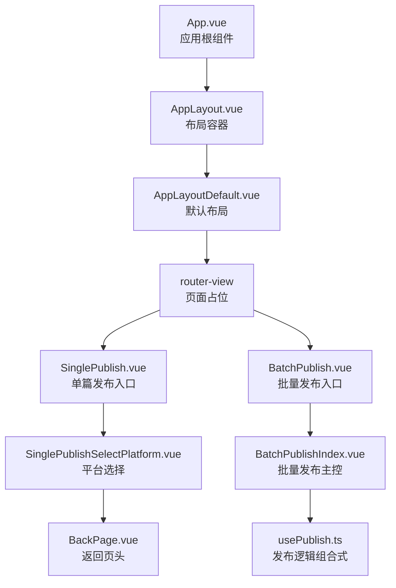
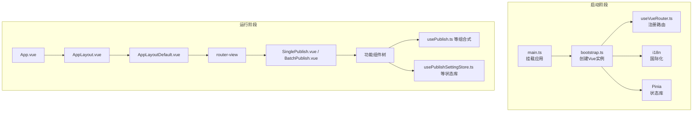
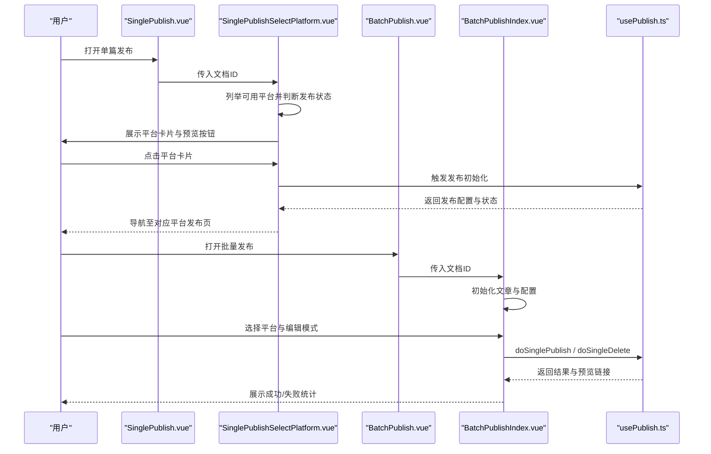
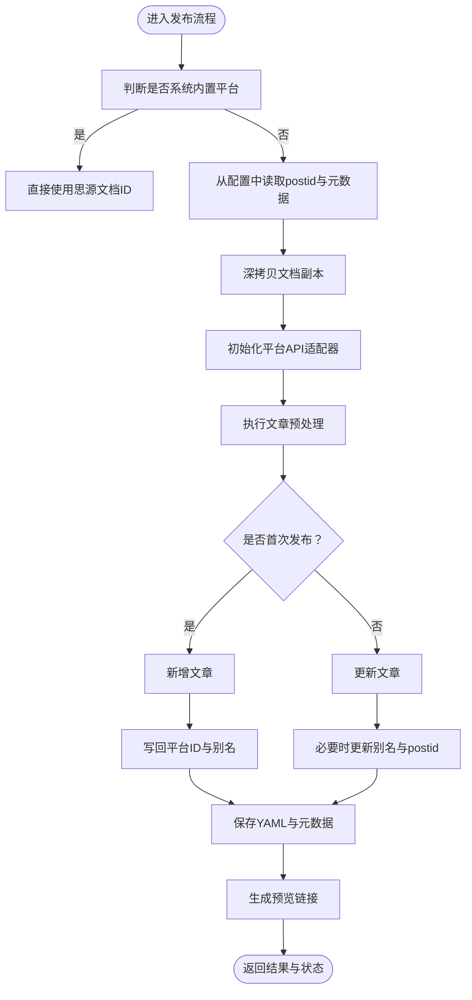
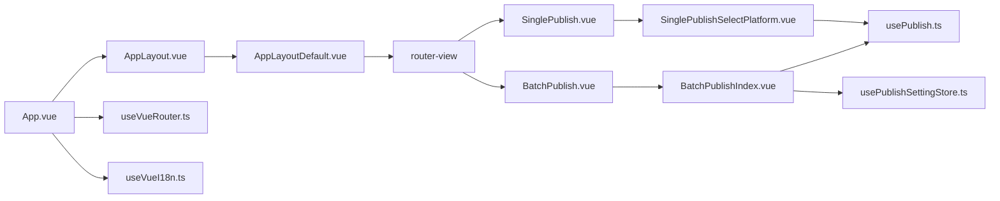

# 组件架构设计

<cite>
**本文引用的文件**
- [src/App.vue](file://src/App.vue)
- [src/main.ts](file://src/main.ts)
- [src/bootstrap.ts](file://src/bootstrap.ts)
- [src/layouts/AppLayout.vue](file://src/layouts/AppLayout.vue)
- [src/layouts/default/AppLayoutDefault.vue](file://src/layouts/default/AppLayoutDefault.vue)
- [src/pages/SinglePublish.vue](file://src/pages/SinglePublish.vue)
- [src/pages/BatchPublish.vue](file://src/pages/BatchPublish.vue)
- [src/components/common/BackPage.vue](file://src/components/common/BackPage.vue)
- [src/components/publish/SinglePublishSelectPlatform.vue](file://src/components/publish/SinglePublishSelectPlatform.vue)
- [src/components/publish/BatchPublishIndex.vue](file://src/components/publish/BatchPublishIndex.vue)
- [src/composables/usePublish.ts](file://src/composables/usePublish.ts)
- [src/composables/useVueRouter.ts](file://src/composables/useVueRouter.ts)
- [src/routes/routeConfig.ts](file://src/routes/routeConfig.ts)
- [src/stores/usePublishSettingStore.ts](file://src/stores/usePublishSettingStore.ts)
- [src/composables/useVueI18n.ts](file://src/composables/useVueI18n.ts)
</cite>

## 目录
1. [引言](#引言)
2. [项目结构](#项目结构)
3. [核心组件](#核心组件)
4. [架构总览](#架构总览)
5. [组件详解](#组件详解)
6. [依赖关系分析](#依赖关系分析)
7. [性能考量](#性能考量)
8. [故障排查指南](#故障排查指南)
9. [结论](#结论)
10. [附录](#附录)

## 引言
本设计文档面向“思源笔记发布器插件”的前端组件架构，聚焦Vue 3组件化理念与Composition API实践，系统阐述页面组件、功能组件与工具组件的职责划分；梳理从根组件App.vue到具体业务组件的层次结构；总结props传递、事件发射、provide/inject等通信机制；明确生命周期管理与状态绑定策略；给出组件设计原则、命名规范与文件组织建议，并通过关键组件的实现路径与最佳实践帮助开发者快速理解与扩展。

## 项目结构
项目采用“页面-功能-工具”三层组件划分与路由驱动的页面组织方式：
- 页面组件：承载单一业务入口，负责参数解析与子组件编排，如单篇发布页、批量发布页。
- 功能组件：封装特定业务能力，如平台选择、表单控件、提示与预览等。
- 工具组件：通用UI与交互辅助，如返回页头、抽屉桥、加载计时器等。
- 布局层：统一页面骨架与头部尾部，支持主题样式注入与插槽扩展。
- 路由层：集中声明页面路由，驱动页面组件渲染与导航。

图表来源
- [src/App.vue:18-22](file://src/App.vue#L18-L22)
- [src/layouts/AppLayout.vue:10-16](file://src/layouts/AppLayout.vue#L10-L16)
- [src/layouts/default/AppLayoutDefault.vue:10-17](file://src/layouts/default/AppLayoutDefault.vue#L10-L17)
- [src/pages/SinglePublish.vue:19-21](file://src/pages/SinglePublish.vue#L19-L21)
- [src/pages/BatchPublish.vue:19-21](file://src/pages/BatchPublish.vue#L19-L21)
- [src/components/publish/SinglePublishSelectPlatform.vue:10-16](file://src/components/publish/SinglePublishSelectPlatform.vue#L10-L16)
- [src/components/publish/BatchPublishIndex.vue:10-27](file://src/components/publish/BatchPublishIndex.vue#L10-L27)
- [src/components/common/BackPage.vue:10-16](file://src/components/common/BackPage.vue#L10-L16)

章节来源
- [src/App.vue:10-24](file://src/App.vue#L10-L24)
- [src/layouts/AppLayout.vue:10-23](file://src/layouts/AppLayout.vue#L10-L23)
- [src/layouts/default/AppLayoutDefault.vue:10-32](file://src/layouts/default/AppLayoutDefault.vue#L10-L32)
- [src/pages/SinglePublish.vue:10-21](file://src/pages/SinglePublish.vue#L10-L21)
- [src/pages/BatchPublish.vue:10-21](file://src/pages/BatchPublish.vue#L10-L21)

## 核心组件
- 应用根组件：负责全局样式注入与布局包裹，将页面组件交由router-view渲染。
- 布局组件：通过动态组件切换默认布局，提供头部、主内容区与底部的统一结构。
- 页面组件：解析路由参数（如文档ID），向下传递给功能组件，承担入口职责。
- 功能组件：封装发布流程、平台选择、表单编辑、预览与删除等业务能力。
- 组合式API：将可复用逻辑抽取为独立模块，如usePublish、useVueRouter、usePublishSettingStore等，提升可测试性与可维护性。
- 通信机制：props向下传递，事件向上发射，路由与状态库作为跨组件共享通道。

章节来源
- [src/App.vue:10-24](file://src/App.vue#L10-L24)
- [src/layouts/AppLayout.vue:18-23](file://src/layouts/AppLayout.vue#L18-L23)
- [src/layouts/default/AppLayoutDefault.vue:20-22](file://src/layouts/default/AppLayoutDefault.vue#L20-L22)
- [src/pages/SinglePublish.vue:10-16](file://src/pages/SinglePublish.vue#L10-L16)
- [src/pages/BatchPublish.vue:10-16](file://src/pages/BatchPublish.vue#L10-L16)
- [src/components/publish/SinglePublishSelectPlatform.vue:10-35](file://src/components/publish/SinglePublishSelectPlatform.vue#L10-L35)
- [src/components/publish/BatchPublishIndex.vue:10-53](file://src/components/publish/BatchPublishIndex.vue#L10-L53)
- [src/composables/usePublish.ts:44-557](file://src/composables/usePublish.ts#L44-L557)
- [src/composables/useVueRouter.ts:13-18](file://src/composables/useVueRouter.ts#L13-L18)
- [src/stores/usePublishSettingStore.ts:21-94](file://src/stores/usePublishSettingStore.ts#L21-L94)

## 架构总览
整体采用“根组件-布局-页面-功能-组合式”的分层架构，配合路由与状态库实现跨组件协作。应用启动时通过bootstrap创建Vue实例，挂载国际化、路由、状态库与指令，再由App.vue统一渲染。

图表来源
- [src/main.ts:15-21](file://src/main.ts#L15-L21)
- [src/bootstrap.ts:25-50](file://src/bootstrap.ts#L25-L50)
- [src/composables/useVueRouter.ts:13-18](file://src/composables/useVueRouter.ts#L13-L18)
- [src/App.vue:10-24](file://src/App.vue#L10-L24)
- [src/layouts/AppLayout.vue:18-23](file://src/layouts/AppLayout.vue#L18-L23)
- [src/layouts/default/AppLayoutDefault.vue:20-22](file://src/layouts/default/AppLayoutDefault.vue#L20-L22)

## 组件详解

### 页面组件：SinglePublish 与 BatchPublish
- SinglePublish：解析路由查询参数或小部件ID，将文档ID传入平台选择组件，作为单篇发布的入口。
- BatchPublish：同上，但进入批量发布主控组件，负责多平台分发、删除与结果汇总。

章节来源
- [src/pages/SinglePublish.vue:10-21](file://src/pages/SinglePublish.vue#L10-L21)
- [src/pages/BatchPublish.vue:10-21](file://src/pages/BatchPublish.vue#L10-L21)

### 功能组件：平台选择与批量发布主控
- SinglePublishSelectPlatform：列举启用并已授权的平台，判断是否已发布并提供预览；根据发布状态决定进入新增或编辑流程。
- BatchPublishIndex：聚合编辑模式、标题、摘要、标签、分类、发布时间等字段；支持覆盖/合并两种分发模式；统一调度发布与删除流程，并汇总结果。

图表来源
- [src/pages/SinglePublish.vue:10-21](file://src/pages/SinglePublish.vue#L10-L21)
- [src/components/publish/SinglePublishSelectPlatform.vue:62-138](file://src/components/publish/SinglePublishSelectPlatform.vue#L62-L138)
- [src/pages/BatchPublish.vue:10-21](file://src/pages/BatchPublish.vue#L10-L21)
- [src/components/publish/BatchPublishIndex.vue:104-177](file://src/components/publish/BatchPublishIndex.vue#L104-L177)
- [src/composables/usePublish.ts:70-280](file://src/composables/usePublish.ts#L70-L280)

章节来源
- [src/components/publish/SinglePublishSelectPlatform.vue:10-149](file://src/components/publish/SinglePublishSelectPlatform.vue#L10-L149)
- [src/components/publish/BatchPublishIndex.vue:10-354](file://src/components/publish/BatchPublishIndex.vue#L10-L354)

### 工具组件：BackPage
- 提供可选返回按钮、帮助链接与插槽内容；支持通过事件回退或路由回退，增强页面一致性与可访问性。

章节来源
- [src/components/common/BackPage.vue:10-71](file://src/components/common/BackPage.vue#L10-L71)

### 组合式API：usePublish
- 职责：封装统一的发布、删除与初始化逻辑；协调平台适配器、配置存储与思源API；提供预览链接生成与元数据更新。
- 设计要点：将可复用逻辑抽取为独立模块，避免在组件中重复实现；通过store与i18n注入解耦；对外暴露简洁方法与响应式状态。

图表来源
- [src/composables/usePublish.ts:70-212](file://src/composables/usePublish.ts#L70-L212)
- [src/composables/usePublish.ts:221-331](file://src/composables/usePublish.ts#L221-L331)
- [src/composables/usePublish.ts:333-343](file://src/composables/usePublish.ts#L333-L343)
- [src/composables/usePublish.ts:352-495](file://src/composables/usePublish.ts#L352-L495)

章节来源
- [src/composables/usePublish.ts:44-557](file://src/composables/usePublish.ts#L44-L557)

### 路由与导航：routeConfig 与 useVueRouter
- routeConfig：集中声明所有页面路由，包含极速发布、常规发布、批量发布、设置、关于等。
- useVueRouter：基于createRouter与createWebHashHistory创建路由实例并注入应用。

章节来源
- [src/routes/routeConfig.ts:42-150](file://src/routes/routeConfig.ts#L42-L150)
- [src/composables/useVueRouter.ts:13-18](file://src/composables/useVueRouter.ts#L13-L18)

### 状态管理：usePublishSettingStore
- 职责：封装发布配置的读取、更新与持久化；提供缓存与异步存储抽象；支持键存在性检查与删除。
- 设计要点：基于Pinia与通用存储工具，确保配置在SSR/客户端场景下的稳定读写。

章节来源
- [src/stores/usePublishSettingStore.ts:21-94](file://src/stores/usePublishSettingStore.ts#L21-L94)

### 国际化：useVueI18n
- 职责：在CSP限制下提供简化的翻译函数，避免内联脚本；通过useI18n导出t与locale。

章节来源
- [src/composables/useVueI18n.ts:16-25](file://src/composables/useVueI18n.ts#L16-L25)

## 依赖关系分析
- 组件依赖：页面组件依赖功能组件；功能组件依赖组合式API与状态库；布局组件依赖页面组件并通过router-view渲染。
- 路由依赖：页面组件通过路由参数驱动功能组件；功能组件通过路由跳转进入平台发布页。
- 状态依赖：发布流程依赖配置存储；国际化与多语言消息通过组合式API提供。
- 外部依赖：Element Plus样式、Pinia状态库、Vue Router路由。

图表来源
- [src/App.vue:10-24](file://src/App.vue#L10-L24)
- [src/layouts/AppLayout.vue:18-23](file://src/layouts/AppLayout.vue#L18-L23)
- [src/layouts/default/AppLayoutDefault.vue:20-22](file://src/layouts/default/AppLayoutDefault.vue#L20-L22)
- [src/pages/SinglePublish.vue:10-21](file://src/pages/SinglePublish.vue#L10-L21)
- [src/pages/BatchPublish.vue:10-21](file://src/pages/BatchPublish.vue#L10-L21)
- [src/components/publish/SinglePublishSelectPlatform.vue:10-35](file://src/components/publish/SinglePublishSelectPlatform.vue#L10-L35)
- [src/components/publish/BatchPublishIndex.vue:10-53](file://src/components/publish/BatchPublishIndex.vue#L10-L53)
- [src/composables/usePublish.ts:44-557](file://src/composables/usePublish.ts#L44-L557)
- [src/stores/usePublishSettingStore.ts:21-94](file://src/stores/usePublishSettingStore.ts#L21-L94)
- [src/composables/useVueRouter.ts:13-18](file://src/composables/useVueRouter.ts#L13-L18)
- [src/composables/useVueI18n.ts:16-25](file://src/composables/useVueI18n.ts#L16-L25)

章节来源
- [src/routes/routeConfig.ts:42-150](file://src/routes/routeConfig.ts#L42-L150)
- [src/composables/useVueRouter.ts:13-18](file://src/composables/useVueRouter.ts#L13-L18)
- [src/stores/usePublishSettingStore.ts:21-94](file://src/stores/usePublishSettingStore.ts#L21-L94)

## 性能考量
- 组件懒加载：对大型平台适配器与第三方库按需加载，减少首屏体积。
- 状态缓存：Pinia与通用存储结合，避免重复读取配置；对高频计算使用computed缓存。
- 路由切换：使用keep-alive与合理的路由守卫，减少重复渲染。
- 图标与样式：Element Plus按需引入，避免全量样式注入。
- 发布流程：批量发布时避免重复初始化，统一调度API调用，减少网络请求次数。

## 故障排查指南
- 发布异常：usePublish捕获错误并推送消息，检查平台配置、认证状态与网络连接。
- 预览链接：getPostPreviewUrl统一拼接绝对/相对URL，若为空检查平台API返回与博客首页配置。
- 配置读写：usePublishSettingStore提供更新与缓存，若出现数据不同步，检查存储键与更新时机。
- 国际化：useVueI18n在CSP限制下提供翻译函数，若文案未生效，检查消息键与本地化资源。

章节来源
- [src/composables/usePublish.ts:195-203](file://src/composables/usePublish.ts#L195-L203)
- [src/composables/usePublish.ts:333-343](file://src/composables/usePublish.ts#L333-L343)
- [src/stores/usePublishSettingStore.ts:55-59](file://src/stores/usePublishSettingStore.ts#L55-L59)
- [src/composables/useVueI18n.ts:19-22](file://src/composables/useVueI18n.ts#L19-L22)

## 结论
该架构以页面组件为入口、功能组件为核心、工具组件为支撑，借助Composition API与Pinia实现高内聚低耦合；通过路由与状态库解耦组件间通信；在发布流程中统一抽象，提升可维护性与可扩展性。遵循本文的设计原则与命名规范，可确保团队协作的一致性与长期演进的稳定性。

## 附录

### 组件设计原则与命名规范
- 命名规范
  - 页面组件：以动词短语命名，如SinglePublish、BatchPublish。
  - 功能组件：以名词短语命名，如SinglePublishSelectPlatform、BatchPublishIndex。
  - 工具组件：以通用UI命名，如BackPage。
- 文件组织
  - 页面组件置于pages目录，功能组件置于components/<领域>/，工具组件置于components/common。
  - 组合式API置于composables目录，状态库置于stores目录，路由配置置于routes目录。
- 代码结构
  - 组件内部优先使用setup语法糖与Composition API；props仅承载输入，事件仅承载输出。
  - 将跨组件共享的状态与逻辑抽取到组合式API与Pinia store中，避免在组件中直接操作外部状态。

### 生命周期与状态绑定策略
- 生命周期
  - 页面组件：在onBeforeMount/onMounted中完成初始化与数据拉取。
  - 功能组件：在onBeforeMount/onMounted中完成平台列表与配置初始化。
- 状态绑定
  - 双向绑定：使用v-model与事件同步表单字段；复杂场景使用emitSync回调。
  - 响应式数据：通过reactive/refs与computed管理局部状态；通过store管理跨组件状态。

### 关键实现路径参考
- 应用启动与挂载：[src/main.ts:15-21](file://src/main.ts#L15-L21)，[src/bootstrap.ts:25-50](file://src/bootstrap.ts#L25-L50)
- 页面与布局：[src/App.vue:18-22](file://src/App.vue#L18-L22)，[src/layouts/AppLayout.vue:10-16](file://src/layouts/AppLayout.vue#L10-L16)，[src/layouts/default/AppLayoutDefault.vue:10-17](file://src/layouts/default/AppLayoutDefault.vue#L10-L17)
- 页面入口与参数：[src/pages/SinglePublish.vue:15-16](file://src/pages/SinglePublish.vue#L15-L16)，[src/pages/BatchPublish.vue:15-16](file://src/pages/BatchPublish.vue#L15-L16)
- 平台选择与预览：[src/components/publish/SinglePublishSelectPlatform.vue:62-138](file://src/components/publish/SinglePublishSelectPlatform.vue#L62-L138)
- 批量发布主控：[src/components/publish/BatchPublishIndex.vue:104-177](file://src/components/publish/BatchPublishIndex.vue#L104-L177)
- 发布流程核心：[src/composables/usePublish.ts:70-280](file://src/composables/usePublish.ts#L70-L280)
- 路由配置与注入：[src/routes/routeConfig.ts:42-150](file://src/routes/routeConfig.ts#L42-L150)，[src/composables/useVueRouter.ts:13-18](file://src/composables/useVueRouter.ts#L13-L18)
- 配置存储：[src/stores/usePublishSettingStore.ts:21-94](file://src/stores/usePublishSettingStore.ts#L21-L94)
- 国际化封装：[src/composables/useVueI18n.ts:16-25](file://src/composables/useVueI18n.ts#L16-L25)