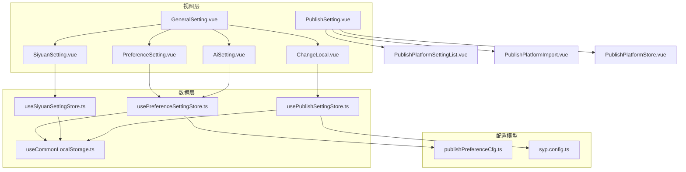
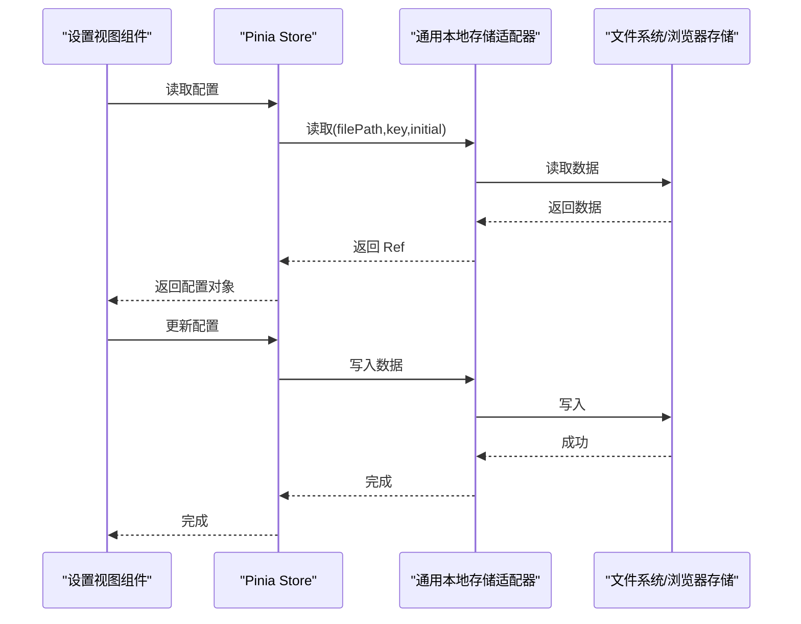
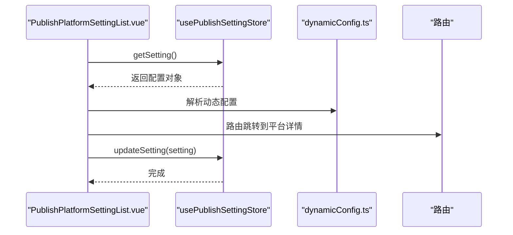
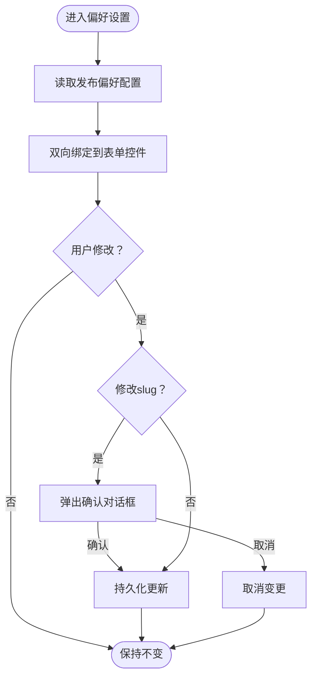
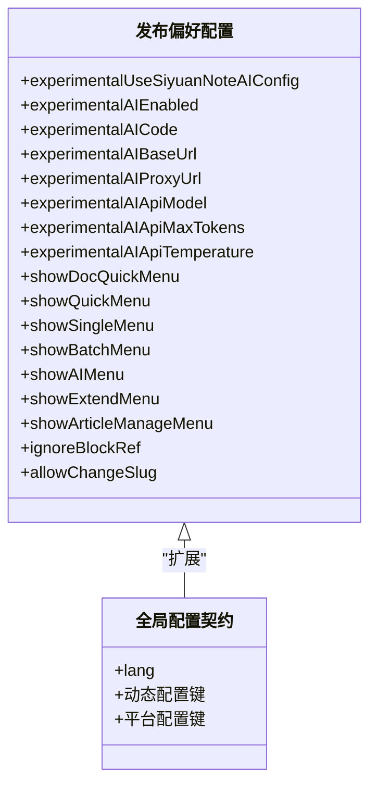

# 设置功能组件

<cite>
**本文引用的文件**   
- [GeneralSetting.vue](file://src/components/set/GeneralSetting.vue)
- [PublishSetting.vue](file://src/components/set/PublishSetting.vue)
- [PreferenceSetting.vue](file://src/components/set/preference/PreferenceSetting.vue)
- [AiSetting.vue](file://src/components/set/preference/AiSetting.vue)
- [ChangeLocal.vue](file://src/components/set/preference/ChangeLocal.vue)
- [SiyuanSetting.vue](file://src/components/set/SiyuanSetting.vue)
- [usePreferenceSettingStore.ts](file://src/stores/usePreferenceSettingStore.ts)
- [usePublishSettingStore.ts](file://src/stores/usePublishSettingStore.ts)
- [useSiyuanSettingStore.ts](file://src/stores/useSiyuanSettingStore.ts)
- [useCommonLocalStorage.ts](file://src/stores/common/useCommonLocalStorage.ts)
- [publishPreferenceCfg.ts](file://src/models/publishPreferenceCfg.ts)
- [PublishPlatformSettingList.vue](file://src/components/set/publish/platform/PublishPlatformSettingList.vue)
- [PublishPlatformImport.vue](file://src/components/set/publish/platform/PublishPlatformImport.vue)
- [PublishPlatformStore.vue](file://src/components/set/publish/platform/PublishPlatformStore.vue)
- [syp.config.ts](file://syp.config.ts)
</cite>

## 目录
1. [简介](#简介)
2. [项目结构](#项目结构)
3. [核心组件](#核心组件)
4. [架构总览](#架构总览)
5. [组件详解](#组件详解)
6. [依赖关系分析](#依赖关系分析)
7. [性能考量](#性能考量)
8. [故障排查指南](#故障排查指南)
9. [结论](#结论)
10. [附录](#附录)

## 简介
本文件面向“思源笔记发布器插件”的设置功能组件，系统性梳理常规设置（GeneralSetting）、发布设置（PublishSetting）与偏好设置（PreferenceSetting）等核心模块的职责边界、数据流与状态同步机制；阐释平台设置组件的统一接口与差异化实现；说明偏好设置中的 AI 设置与本地配置管理；并给出与配置管理系统的集成方式、开发规范与用户体验设计原则。

## 项目结构
设置功能主要由三层构成：
- 视图层：各设置页组件（常规、发布、偏好、思源设置）
- 数据层：Pinia Store 与通用本地存储适配器
- 配置模型：发布偏好配置模型与全局配置契约

图表来源
- [GeneralSetting.vue:1-43](file://src/components/set/GeneralSetting.vue#L1-L43)
- [PublishSetting.vue:1-70](file://src/components/set/PublishSetting.vue#L1-L70)
- [PreferenceSetting.vue:1-114](file://src/components/set/preference/PreferenceSetting.vue#L1-L114)
- [AiSetting.vue:1-121](file://src/components/set/preference/AiSetting.vue#L1-L121)
- [ChangeLocal.vue:1-60](file://src/components/set/preference/ChangeLocal.vue#L1-L60)
- [SiyuanSetting.vue:1-40](file://src/components/set/SiyuanSetting.vue#L1-L40)
- [usePreferenceSettingStore.ts:1-90](file://src/stores/usePreferenceSettingStore.ts#L1-L90)
- [usePublishSettingStore.ts:1-95](file://src/stores/usePublishSettingStore.ts#L1-L95)
- [useSiyuanSettingStore.ts:1-81](file://src/stores/useSiyuanSettingStore.ts#L1-L81)
- [useCommonLocalStorage.ts:1-58](file://src/stores/common/useCommonLocalStorage.ts#L1-L58)
- [publishPreferenceCfg.ts:1-101](file://src/models/publishPreferenceCfg.ts#L1-L101)
- [syp.config.ts:1-52](file://syp.config.ts#L1-L52)

章节来源
- [GeneralSetting.vue:1-43](file://src/components/set/GeneralSetting.vue#L1-L43)
- [PublishSetting.vue:1-70](file://src/components/set/PublishSetting.vue#L1-L70)
- [usePreferenceSettingStore.ts:1-90](file://src/stores/usePreferenceSettingStore.ts#L1-L90)
- [usePublishSettingStore.ts:1-95](file://src/stores/usePublishSettingStore.ts#L1-L95)
- [useSiyuanSettingStore.ts:1-81](file://src/stores/useSiyuanSettingStore.ts#L1-L81)
- [useCommonLocalStorage.ts:1-58](file://src/stores/common/useCommonLocalStorage.ts#L1-L58)
- [publishPreferenceCfg.ts:1-101](file://src/models/publishPreferenceCfg.ts#L1-L101)
- [syp.config.ts:1-52](file://syp.config.ts#L1-L52)

## 核心组件
- 常规设置（GeneralSetting）
  - 负责聚合“偏好设置”“AI 设置”“思源设置”“语言切换”“文章绑定”等入口，采用左右布局的标签页组织。
- 发布设置（PublishSetting）
  - 负责平台管理的三大场景：平台列表、平台导入、平台商店（快速添加）。
- 偏好设置（PreferenceSetting）
  - 管理发布行为偏好与 UI 快捷菜单开关，支持变更前确认提示。
- AI 设置（AiSetting）
  - 管理外部 AI 的密钥、基础地址、代理、模型、最大 Token、温度等参数；支持“使用思源笔记 AI 配置”联动禁用编辑。
- 语言切换（ChangeLocal）
  - 读取/写入全局配置的语言字段，即时生效并持久化。
- 思源设置（SiyuanSetting）
  - 管理思源 API 地址与密码等连接参数。

章节来源
- [GeneralSetting.vue:17-37](file://src/components/set/GeneralSetting.vue#L17-L37)
- [PublishSetting.vue:25-62](file://src/components/set/PublishSetting.vue#L25-L62)
- [PreferenceSetting.vue:51-107](file://src/components/set/preference/PreferenceSetting.vue#L51-L107)
- [AiSetting.vue:20-98](file://src/components/set/preference/AiSetting.vue#L20-L98)
- [ChangeLocal.vue:30-45](file://src/components/set/preference/ChangeLocal.vue#L30-L45)
- [SiyuanSetting.vue:20-39](file://src/components/set/SiyuanSetting.vue#L20-L39)

## 架构总览
设置组件通过 Pinia Store 与通用本地存储适配器实现数据持久化与跨组件共享；平台设置组件遵循统一的动态配置契约，按平台类型差异化实现各自的配置表单与授权流程。

图表来源
- [usePublishSettingStore.ts:21-59](file://src/stores/usePublishSettingStore.ts#L21-L59)
- [usePreferenceSettingStore.ts:34-67](file://src/stores/usePreferenceSettingStore.ts#L34-L67)
- [useSiyuanSettingStore.ts:36-62](file://src/stores/useSiyuanSettingStore.ts#L36-L62)
- [useCommonLocalStorage.ts:27-55](file://src/stores/common/useCommonLocalStorage.ts#L27-L55)

## 组件详解

### 常规设置（GeneralSetting）
- 功能职责
  - 聚合“偏好设置”“AI 设置”“思源设置”“语言切换”“文章绑定”等入口，统一以标签页组织。
- 用户交互
  - 左侧标签页导航，右侧内容区渲染对应子组件。
- 与其他组件的关系
  - 作为入口容器，不直接持久化配置，仅承载子组件。

章节来源
- [GeneralSetting.vue:17-37](file://src/components/set/GeneralSetting.vue#L17-L37)

### 发布设置（PublishSetting）
- 功能职责
  - 提供平台管理的三大场景：平台列表（启用/禁用、授权、验证、删除）、平台导入（一键/自定义/旧版挂件导入）、平台商店（按分类快速添加）。
- 控制流
  - 列表页：读取动态配置，支持启用/禁用、授权（网页授权或 Cookie 设置）、验证、删除。
  - 导入页：批量导入内置平台，或自定义选择平台导入。
  - 商店页：按平台类型筛选，快速添加平台。

图表来源
- [PublishPlatformSettingList.vue:451-488](file://src/components/set/publish/platform/PublishPlatformSettingList.vue#L451-L488)
- [usePublishSettingStore.ts:38-59](file://src/stores/usePublishSettingStore.ts#L38-L59)

章节来源
- [PublishSetting.vue:25-62](file://src/components/set/PublishSetting.vue#L25-L62)
- [PublishPlatformSettingList.vue:69-119](file://src/components/set/publish/platform/PublishPlatformSettingList.vue#L69-L119)
- [PublishPlatformImport.vue:94-139](file://src/components/set/publish/platform/PublishPlatformImport.vue#L94-L139)
- [PublishPlatformStore.vue:37-56](file://src/components/set/publish/platform/PublishPlatformStore.vue#L37-L56)

### 偏好设置（PreferenceSetting）
- 功能职责
  - 管理发布偏好（标题处理、首 H1 移除、小工具标签移除、菜单显示控制、是否允许修改 slug 等）。
  - 在特定运行环境下（如思源插件/挂件）显示专属菜单项。
- 数据绑定与状态同步
  - 通过 store 返回的可移除引用（RemovableRef）双向绑定至表单，变更即持久化。
  - 允许修改 slug 前触发确认对话框，避免误操作。
- 与 AI 设置联动
  - 通过 store 自动注入“使用思源笔记 AI 配置”的开关，影响 AI 设置表单的可用性。

图表来源
- [PreferenceSetting.vue:30-48](file://src/components/set/preference/PreferenceSetting.vue#L30-L48)
- [usePreferenceSettingStore.ts:34-67](file://src/stores/usePreferenceSettingStore.ts#L34-L67)

章节来源
- [PreferenceSetting.vue:51-107](file://src/components/set/preference/PreferenceSetting.vue#L51-L107)
- [usePreferenceSettingStore.ts:34-67](file://src/stores/usePreferenceSettingStore.ts#L34-L67)

### AI 设置（AiSetting）
- 功能职责
  - 管理外部 AI 的密钥、基础地址、代理、模型、最大 Token、温度等参数。
  - 当启用“使用思源笔记 AI 配置”时，禁用手动编辑，避免冲突。
- 数据绑定与状态同步
  - 与偏好设置共享同一 store，表单值直接写入偏好配置对象并持久化。

章节来源
- [AiSetting.vue:20-98](file://src/components/set/preference/AiSetting.vue#L20-L98)
- [usePreferenceSettingStore.ts:40-57](file://src/stores/usePreferenceSettingStore.ts#L40-L57)

### 语言切换（ChangeLocal）
- 功能职责
  - 读取全局配置中的语言字段，提供下拉选择，变更后立即更新 i18n 语言并持久化。
- 数据绑定与状态同步
  - 通过 store 的异步读取与更新方法实现配置持久化。

章节来源
- [ChangeLocal.vue:30-45](file://src/components/set/preference/ChangeLocal.vue#L30-L45)
- [usePublishSettingStore.ts:38-59](file://src/stores/usePublishSettingStore.ts#L38-L59)

### 思源设置（SiyuanSetting）
- 功能职责
  - 管理思源 API 地址与密码等连接参数，用于后续与思源内核通信。
- 数据绑定与状态同步
  - 通过专用 store 返回的可移除引用进行双向绑定与持久化。

章节来源
- [SiyuanSetting.vue:20-39](file://src/components/set/SiyuanSetting.vue#L20-L39)
- [useSiyuanSettingStore.ts:36-62](file://src/stores/useSiyuanSettingStore.ts#L36-L62)

### 平台设置组件（统一接口与差异化实现）
- 统一接口
  - 所有平台设置组件均基于统一的动态配置契约（动态 JSON 配置、平台键、启用状态、授权模式等），通过 store 的 getSetting/updateSetting 实现读写。
- 差异化实现
  - 不同平台类型（博客 API、GitHub/GitLab、Web 网站、本地文件系统等）在表单字段、授权方式（API 密钥/网页授权/Cookie）上存在差异，但统一收敛在“平台列表/导入/商店”三页中。
- 授权与验证
  - 网页授权：打开外部登录页，自动抓取 Cookie 并验证元数据；支持过期提示与登出引导。
  - API 授权：直接在平台设置页填写密钥等参数。

章节来源
- [PublishPlatformSettingList.vue:123-295](file://src/components/set/publish/platform/PublishPlatformSettingList.vue#L123-L295)
- [PublishPlatformImport.vue:71-139](file://src/components/set/publish/platform/PublishPlatformImport.vue#L71-L139)
- [PublishPlatformStore.vue:37-56](file://src/components/set/publish/platform/PublishPlatformStore.vue#L37-L56)

## 依赖关系分析
- 组件与 Store 的耦合
  - 视图组件通过组合式函数（如 usePreferenceSettingStore、usePublishSettingStore、useSiyuanSettingStore）获取配置引用，实现低耦合高内聚。
- 存储适配器
  - 通用本地存储适配器根据运行环境（思源插件/挂件 vs 浏览器）自动选择 JsonStorage 或浏览器 localStorage，保证数据一致性。
- 配置模型
  - 发布偏好配置继承自通用偏好配置基类，扩展 AI 与菜单相关字段；全局配置契约定义了动态配置键与平台配置键的命名规范。

图表来源
- [publishPreferenceCfg.ts:19-97](file://src/models/publishPreferenceCfg.ts#L19-L97)
- [syp.config.ts:28-49](file://syp.config.ts#L28-L49)

章节来源
- [usePreferenceSettingStore.ts:34-67](file://src/stores/usePreferenceSettingStore.ts#L34-L67)
- [usePublishSettingStore.ts:21-59](file://src/stores/usePublishSettingStore.ts#L21-L59)
- [useSiyuanSettingStore.ts:36-62](file://src/stores/useSiyuanSettingStore.ts#L36-L62)
- [useCommonLocalStorage.ts:43-55](file://src/stores/common/useCommonLocalStorage.ts#L43-L55)

## 性能考量
- 异步初始化与缓存
  - 发布设置 store 在首次访问时才从存储读取并缓存，避免不必要的 IO。
- 只读引用
  - 偏好与思源设置 store 提供只读引用，降低意外修改风险，提升稳定性。
- 条件渲染与懒加载
  - 平台列表按启用状态与授权模式动态渲染操作按钮，减少 DOM 体积。
- 存储适配器优化
  - 在思源环境中使用 JsonStorage，避免浏览器存储限制带来的性能损耗。

章节来源
- [usePublishSettingStore.ts:28-48](file://src/stores/usePublishSettingStore.ts#L28-L48)
- [usePreferenceSettingStore.ts:77-81](file://src/stores/usePreferenceSettingStore.ts#L77-L81)
- [useCommonLocalStorage.ts:43-55](file://src/stores/common/useCommonLocalStorage.ts#L43-L55)

## 故障排查指南
- 平台授权失败
  - 网页授权：检查是否正确返回 Cookie，验证元数据；若失败，按提示执行登出清理并重新授权。
  - API 授权：确认密钥、基础地址、代理、模型等参数是否正确。
- 语言切换无效
  - 确认全局配置中的语言字段已更新并持久化；检查 i18n 实例是否同步。
- AI 设置不可编辑
  - 若启用“使用思源笔记 AI 配置”，则外部 AI 参数会被禁用；关闭该开关后方可编辑。
- 配置未生效
  - 确认 store 的 getSetting/updateSetting 是否被调用；检查存储适配器是否正确选择（JsonStorage vs localStorage）。

章节来源
- [PublishPlatformSettingList.vue:283-427](file://src/components/set/publish/platform/PublishPlatformSettingList.vue#L283-L427)
- [AiSetting.vue:91-94](file://src/components/set/preference/AiSetting.vue#L91-L94)
- [ChangeLocal.vue:32-37](file://src/components/set/preference/ChangeLocal.vue#L32-L37)
- [useCommonLocalStorage.ts:43-55](file://src/stores/common/useCommonLocalStorage.ts#L43-L55)

## 结论
设置功能组件围绕“统一接口 + 差异化实现”的设计，实现了常规设置、发布设置与偏好设置的清晰分层；通过 Pinia Store 与通用本地存储适配器，确保配置在不同运行环境下的稳定持久化；平台设置组件以动态配置契约为基础，兼顾易用性与扩展性。建议在后续迭代中进一步完善平台导入的默认策略与错误回滚机制，增强用户体验与健壮性。

## 附录
- 开发规范
  - 组件职责单一，尽量通过组合式函数访问 store，避免直接引入底层存储。
  - 表单字段与 store 字段一一对应，变更即持久化，避免离线缓存导致的状态漂移。
  - 对关键操作（如删除平台、修改 slug）增加二次确认。
- 用户体验设计原则
  - 明确状态反馈（启用/禁用、已授权/未授权、验证中/成功/失败）。
  - 提供一键导入与默认策略，降低用户学习成本。
  - 在受限编辑场景（如使用思源 AI 配置）明确提示原因与恢复路径。