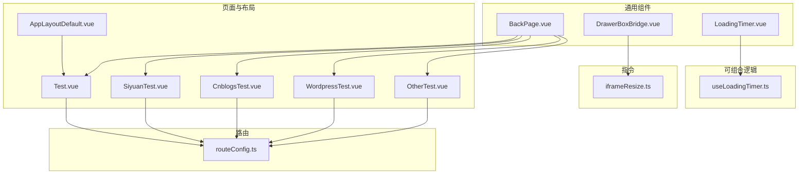
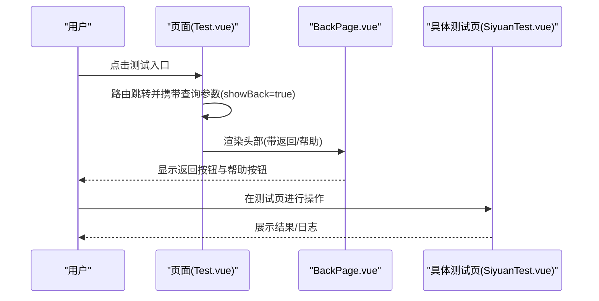
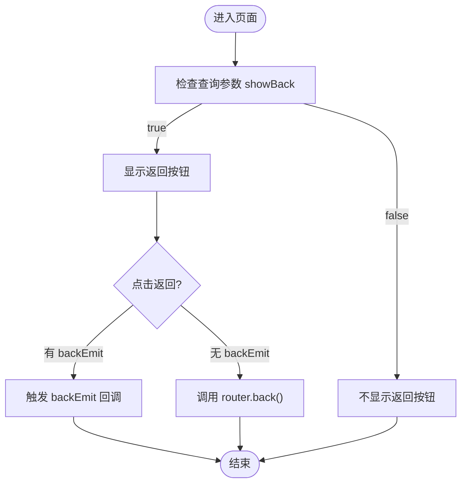
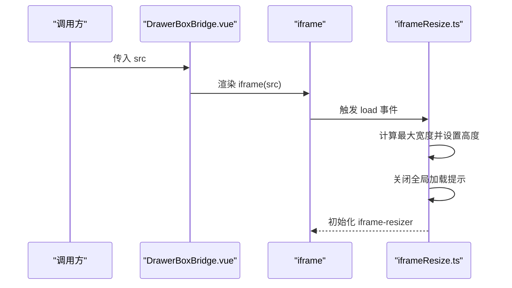
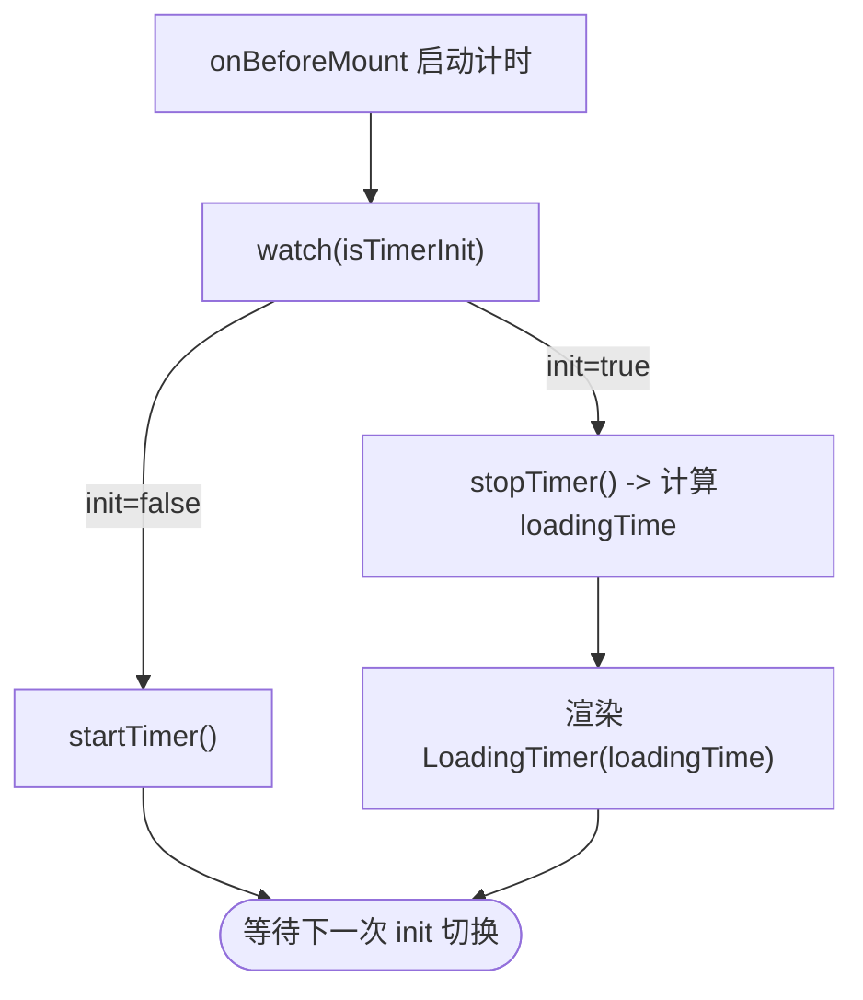
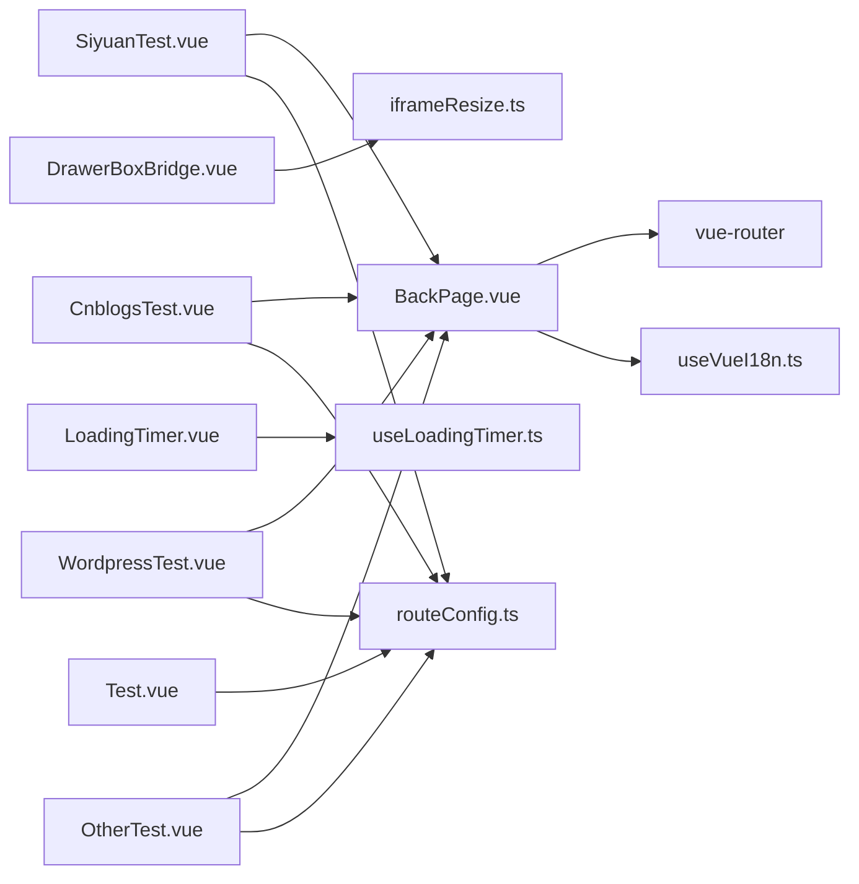

# 通用组件库

<cite>
**本文引用的文件**   
- [BackPage.vue](file://src/components/common/BackPage.vue)
- [DrawerBoxBridge.vue](file://src/components/common/DrawerBoxBridge.vue)
- [LoadingTimer.vue](file://src/components/common/LoadingTimer.vue)
- [useLoadingTimer.ts](file://src/composables/useLoadingTimer.ts)
- [iframeResize.ts](file://src/utils/directives/iframeResize.ts)
- [Test.vue](file://src/pages/Test.vue)
- [SiyuanTest.vue](file://src/components/test/SiyuanTest.vue)
- [CnblogsTest.vue](file://src/components/test/CnblogsTest.vue)
- [WordpressTest.vue](file://src/components/test/WordpressTest.vue)
- [OtherTest.vue](file://src/components/test/OtherTest.vue)
- [routeConfig.ts](file://src/routes/routeConfig.ts)
- [style.css](file://src/assets/style.css)
- [style.dark.css](file://src/assets/style.dark.css)
- [AppLayoutDefault.vue](file://src/layouts/default/AppLayoutDefault.vue)
</cite>

## 目录
1. [引言](#引言)
2. [项目结构](#项目结构)
3. [核心组件](#核心组件)
4. [架构总览](#架构总览)
5. [组件详解](#组件详解)
6. [依赖关系分析](#依赖关系分析)
7. [性能与懒加载](#性能与懒加载)
8. [测试与调试](#测试与调试)
9. [样式与主题适配](#样式与主题适配)
10. [开发规范与扩展指南](#开发规范与扩展指南)
11. [结论](#结论)

## 引言
本文件面向“思源笔记发布器插件”的通用组件库，系统化梳理 BackPage、DrawerBoxBridge、LoadingTimer 等基础组件的设计理念、复用策略与使用场景；解释这些组件在不同页面中的参数传递与组合方式；阐述样式与主题适配策略；总结测试组件的开发与调试方法；并给出性能优化与懒加载建议以及通用组件的开发规范与扩展指南。

## 项目结构
通用组件主要位于 src/components/common，配套的可复用逻辑位于 src/composables，页面级测试组件位于 src/components/test，路由配置集中于 src/routes/routeConfig.ts，全局样式位于 src/assets/style.css 与 src/assets/style.dark.css，页面布局位于 src/layouts/default/AppLayoutDefault.vue。

图示来源
- [BackPage.vue:1-114](file://src/components/common/BackPage.vue#L1-L114)
- [DrawerBoxBridge.vue:1-35](file://src/components/common/DrawerBoxBridge.vue#L1-L35)
- [LoadingTimer.vue:1-35](file://src/components/common/LoadingTimer.vue#L1-L35)
- [useLoadingTimer.ts:1-56](file://src/composables/useLoadingTimer.ts#L1-L56)
- [iframeResize.ts:1-71](file://src/utils/directives/iframeResize.ts#L1-L71)
- [Test.vue:1-90](file://src/pages/Test.vue#L1-L90)
- [SiyuanTest.vue:1-351](file://src/components/test/SiyuanTest.vue#L1-L351)
- [CnblogsTest.vue:1-425](file://src/components/test/CnblogsTest.vue#L1-L425)
- [WordpressTest.vue:1-306](file://src/components/test/WordpressTest.vue#L1-L306)
- [OtherTest.vue:1-59](file://src/components/test/OtherTest.vue#L1-L59)
- [routeConfig.ts:1-151](file://src/routes/routeConfig.ts#L1-L151)
- [AppLayoutDefault.vue:1-33](file://src/layouts/default/AppLayoutDefault.vue#L1-L33)

章节来源
- [routeConfig.ts:1-151](file://src/routes/routeConfig.ts#L1-L151)
- [style.css:1-166](file://src/assets/style.css#L1-L166)
- [style.dark.css:1-95](file://src/assets/style.dark.css#L1-L95)

## 核心组件
- BackPage：提供统一的页面头部（含返回按钮与帮助入口），支持通过查询参数控制是否显示返回按钮，并支持回退事件透传或默认回退行为。
- DrawerBoxBridge：封装 iframe 桥接容器，内置自适应高度与加载提示，便于在抽屉/弹窗中嵌入外部页面。
- LoadingTimer：展示页面加载耗时统计，配合 useLoadingTimer 可在生命周期内自动计算耗时并渲染表情反馈。

章节来源
- [BackPage.vue:1-114](file://src/components/common/BackPage.vue#L1-L114)
- [DrawerBoxBridge.vue:1-35](file://src/components/common/DrawerBoxBridge.vue#L1-L35)
- [LoadingTimer.vue:1-35](file://src/components/common/LoadingTimer.vue#L1-L35)
- [useLoadingTimer.ts:1-56](file://src/composables/useLoadingTimer.ts#L1-L56)

## 架构总览
通用组件以“页面级复用 + 可组合逻辑 + 指令增强”为核心设计思路：
- 页面级组件负责 UI 结构与交互（如 BackPage）。
- 可组合逻辑提供跨页面的状态与生命周期管理（如 useLoadingTimer）。
- 指令对 DOM 进行增强（如 iframeResize 对 iframe 的自适应与加载体验）。
- 测试组件作为“页面级组件”的典型使用者，演示参数传递、事件处理与帮助集成。

图示来源
- [Test.vue:1-90](file://src/pages/Test.vue#L1-L90)
- [BackPage.vue:1-114](file://src/components/common/BackPage.vue#L1-L114)
- [SiyuanTest.vue:1-351](file://src/components/test/SiyuanTest.vue#L1-L351)
- [routeConfig.ts:1-151](file://src/routes/routeConfig.ts#L1-L151)

## 组件详解

### BackPage 组件
- 功能要点
  - 支持通过 props.title 设置页面标题。
  - 通过查询参数 query.showBack 控制是否显示返回按钮。
  - 支持 hasBackEmit 事件，若提供则优先触发回退事件，否则使用路由回退。
  - 提供帮助入口，根据 helpKey 打开对应帮助链接，未配置时回退到默认帮助索引。
- 复用模式
  - 所有测试页均包裹 BackPage，形成一致的导航与帮助体验。
  - 参数通过路由 query 传递，保证页面间一致性。
- 交互流程

图示来源
- [BackPage.vue:1-114](file://src/components/common/BackPage.vue#L1-L114)

章节来源
- [BackPage.vue:1-114](file://src/components/common/BackPage.vue#L1-L114)
- [Test.vue:1-90](file://src/pages/Test.vue#L1-L90)

### DrawerBoxBridge 组件
- 功能要点
  - 通过 props.src 注入 iframe 地址。
  - 使用 v-resize 指令实现 iframe 自适应高度与加载提示。
- 适用场景
  - 在抽屉/弹窗中嵌入外部页面或第三方表单。
- 指令增强
  - iframeResize 指令负责监听加载完成、计算最大宽度并设置高度，同时关闭全局加载提示。

图示来源
- [DrawerBoxBridge.vue:1-35](file://src/components/common/DrawerBoxBridge.vue#L1-L35)
- [iframeResize.ts:1-71](file://src/utils/directives/iframeResize.ts#L1-L71)

章节来源
- [DrawerBoxBridge.vue:1-35](file://src/components/common/DrawerBoxBridge.vue#L1-L35)
- [iframeResize.ts:1-71](file://src/utils/directives/iframeResize.ts#L1-L71)

### LoadingTimer 组件
- 功能要点
  - 接收 loadingTime 并展示耗时与表情反馈。
- 配套逻辑 useLoadingTimer
  - 在 onBeforeMount 启动计时，在 isTimerInit 变化时切换 start/stop，最终输出 loadingTime。
- 复用模式
  - 在页面初始化阶段启动计时，在关键操作完成时停止计时，将 loadingTime 传给 LoadingTimer 渲染。

图示来源
- [useLoadingTimer.ts:1-56](file://src/composables/useLoadingTimer.ts#L1-L56)
- [LoadingTimer.vue:1-35](file://src/components/common/LoadingTimer.vue#L1-L35)

章节来源
- [useLoadingTimer.ts:1-56](file://src/composables/useLoadingTimer.ts#L1-L56)
- [LoadingTimer.vue:1-35](file://src/components/common/LoadingTimer.vue#L1-L35)

## 依赖关系分析
- 组件依赖
  - BackPage 依赖路由与国际化能力，提供帮助链接与回退事件。
  - DrawerBoxBridge 依赖 iframeResize 指令，实现 iframe 的自适应与加载体验。
  - LoadingTimer 依赖 useLoadingTimer 提供的计时数据。
- 页面依赖
  - 测试页面（SiyuanTest、CnblogsTest、WordpressTest、OtherTest）均包裹 BackPage，统一导航与帮助。
  - 路由配置集中管理测试页面路径，便于统一跳转与参数传递。

图示来源
- [BackPage.vue:1-114](file://src/components/common/BackPage.vue#L1-L114)
- [DrawerBoxBridge.vue:1-35](file://src/components/common/DrawerBoxBridge.vue#L1-L35)
- [LoadingTimer.vue:1-35](file://src/components/common/LoadingTimer.vue#L1-L35)
- [useLoadingTimer.ts:1-56](file://src/composables/useLoadingTimer.ts#L1-L56)
- [iframeResize.ts:1-71](file://src/utils/directives/iframeResize.ts#L1-L71)
- [Test.vue:1-90](file://src/pages/Test.vue#L1-L90)
- [SiyuanTest.vue:1-351](file://src/components/test/SiyuanTest.vue#L1-L351)
- [CnblogsTest.vue:1-425](file://src/components/test/CnblogsTest.vue#L1-L425)
- [WordpressTest.vue:1-306](file://src/components/test/WordpressTest.vue#L1-L306)
- [OtherTest.vue:1-59](file://src/components/test/OtherTest.vue#L1-L59)
- [routeConfig.ts:1-151](file://src/routes/routeConfig.ts#L1-L151)

章节来源
- [routeConfig.ts:1-151](file://src/routes/routeConfig.ts#L1-L151)

## 性能与懒加载
- LoadingTimer 与 useLoadingTimer
  - 仅在需要时启动计时，避免不必要的性能消耗。
  - 将计时结果作为只读属性传递给 LoadingTimer，减少重复计算。
- DrawerBoxBridge 与 iframeResize
  - 仅在 iframe 加载完成后进行自适应与高度设置，避免阻塞首屏。
  - 通过全局加载提示与警告超时参数控制用户体验与性能边界。
- 页面级测试组件
  - 通过路由按需加载，避免一次性加载所有测试页面。
  - 在测试页内部再按需发起 API 请求，减少全局资源占用。

章节来源
- [useLoadingTimer.ts:1-56](file://src/composables/useLoadingTimer.ts#L1-L56)
- [LoadingTimer.vue:1-35](file://src/components/common/LoadingTimer.vue#L1-L35)
- [DrawerBoxBridge.vue:1-35](file://src/components/common/DrawerBoxBridge.vue#L1-L35)
- [iframeResize.ts:1-71](file://src/utils/directives/iframeResize.ts#L1-L71)
- [Test.vue:1-90](file://src/pages/Test.vue#L1-L90)

## 测试与调试
- 测试页面统一模式
  - 选择方法 -> 输入参数 -> 选择文件(可选) -> 触发请求 -> 查看日志。
  - BackPage 提供统一的返回与帮助入口，便于快速定位问题。
- 典型测试组件
  - SiyuanTest：演示与本地思源内核通信、媒体对象上传等。
  - CnblogsTest：演示 metaWeblog 协议下的常用操作。
  - WordpressTest：演示 WordPress 媒体对象上传等。
  - OtherTest：演示第三方转换器（如 Notion Markdown）的使用。
- 调试建议
  - 使用浏览器开发者工具观察网络请求与 iframe 加载状态。
  - 在 BackPage 中点击帮助按钮打开官方文档，辅助定位问题。
  - 在 LoadingTimer 中查看耗时，结合 useLoadingTimer 的计时点判断性能瓶颈。

章节来源
- [SiyuanTest.vue:1-351](file://src/components/test/SiyuanTest.vue#L1-L351)
- [CnblogsTest.vue:1-425](file://src/components/test/CnblogsTest.vue#L1-L425)
- [WordpressTest.vue:1-306](file://src/components/test/WordpressTest.vue#L1-L306)
- [OtherTest.vue:1-59](file://src/components/test/OtherTest.vue#L1-L59)
- [BackPage.vue:1-114](file://src/components/common/BackPage.vue#L1-L114)
- [LoadingTimer.vue:1-35](file://src/components/common/LoadingTimer.vue#L1-L35)

## 样式与主题适配
- 全局样式
  - 定义变量 --custom-app-color 与 --custom-app-bg-color，用于统一应用主色与背景色。
  - 为 Element Plus 组件的尺寸、间距、对话框等提供统一规范。
- 深色主题
  - 在 html.dark 下重置关键颜色变量，确保深色模式下表格、代码高亮、标题等元素的可读性。
- 组件样式
  - BackPage 内部按钮与帮助按钮采用过渡动画，提升交互体验。
  - 测试页面统一外边距与按钮布局，保证在不同分辨率下的可用性。

章节来源
- [style.css:1-166](file://src/assets/style.css#L1-L166)
- [style.dark.css:1-95](file://src/assets/style.dark.css#L1-L95)
- [BackPage.vue:101-114](file://src/components/common/BackPage.vue#L101-L114)

## 开发规范与扩展指南
- 组件命名与职责
  - 通用组件应保持单一职责，UI 结构与交互逻辑清晰分离。
  - 通过 props 与 emits 明确对外接口，避免隐式依赖。
- 参数传递与路由
  - 使用 query 传递轻量配置（如 showBack），复杂状态通过 store 或 props 传递。
  - 路由配置集中管理，新增测试页面需同步更新 routeConfig.ts。
- 指令与可组合逻辑
  - 指令仅做 DOM 增强，不包含业务逻辑；可组合逻辑提供跨页面共享的状态与生命周期。
- 样式与主题
  - 使用 CSS 变量统一风格，遵循 style.css 与 style.dark.css 的约定。
  - 组件内部样式尽量局部作用域化，避免污染全局。
- 性能与懒加载
  - 对重型资源按需加载；对计时与加载体验使用 LoadingTimer 与 useLoadingTimer 管理。
  - iframe 场景使用 DrawerBoxBridge + iframeResize，确保加载与自适应体验。
- 可扩展性
  - 新增测试组件时，遵循现有模板：方法选择 -> 参数输入 -> 文件选择(可选) -> 日志输出 -> 包裹 BackPage。
  - 如需帮助入口，统一在 help.ts 中维护键值映射，BackPage 通过 helpKey 自动打开对应链接。

章节来源
- [routeConfig.ts:1-151](file://src/routes/routeConfig.ts#L1-L151)
- [BackPage.vue:1-114](file://src/components/common/BackPage.vue#L1-L114)
- [DrawerBoxBridge.vue:1-35](file://src/components/common/DrawerBoxBridge.vue#L1-L35)
- [LoadingTimer.vue:1-35](file://src/components/common/LoadingTimer.vue#L1-L35)
- [useLoadingTimer.ts:1-56](file://src/composables/useLoadingTimer.ts#L1-L56)
- [iframeResize.ts:1-71](file://src/utils/directives/iframeResize.ts#L1-L71)
- [style.css:1-166](file://src/assets/style.css#L1-L166)
- [style.dark.css:1-95](file://src/assets/style.dark.css#L1-L95)

## 结论
通用组件库通过 BackPage、DrawerBoxBridge、LoadingTimer 与 useLoadingTimer、iframeResize 等模块，实现了页面级复用、可组合逻辑与指令增强的协同。测试组件作为典型用例，展示了参数传递、事件处理与帮助集成的最佳实践。配合统一的样式与主题适配策略，以及明确的开发规范与扩展指南，通用组件库能够稳定支撑多平台发布与调试场景，并具备良好的可维护性与可扩展性。