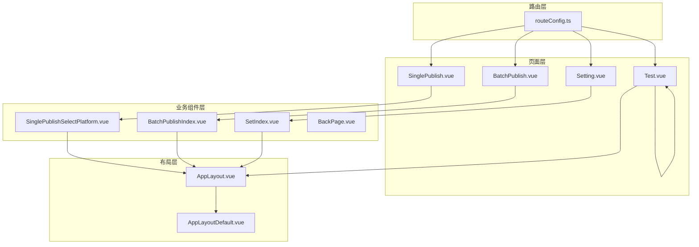
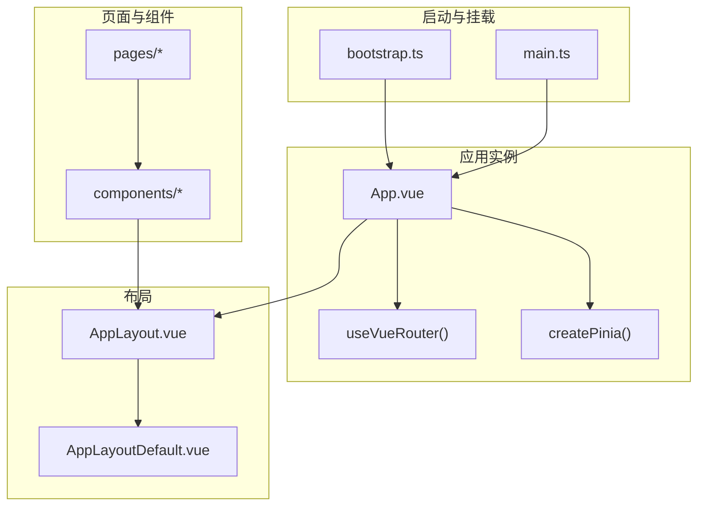
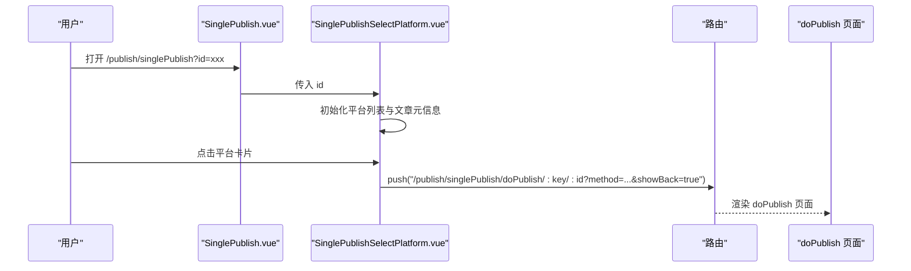
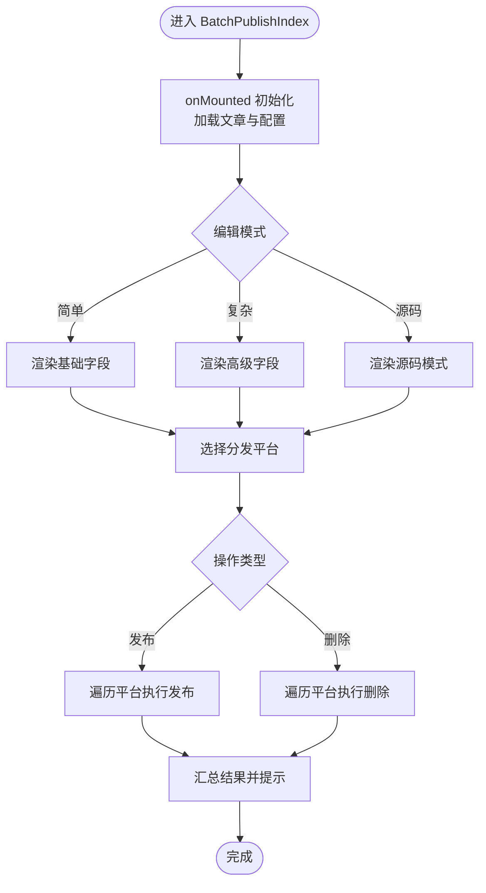
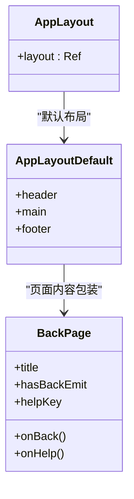
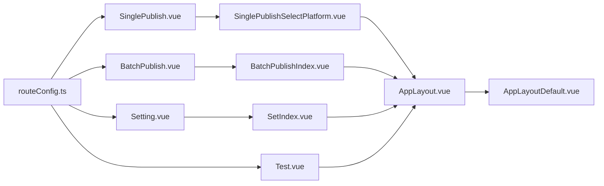

# 页面组件架构

<cite>
**本文档引用的文件**
- [src/pages/SinglePublish.vue](file://src/pages/SinglePublish.vue)
- [src/pages/BatchPublish.vue](file://src/pages/BatchPublish.vue)
- [src/pages/Setting.vue](file://src/pages/Setting.vue)
- [src/pages/Test.vue](file://src/pages/Test.vue)
- [src/routes/routeConfig.ts](file://src/routes/routeConfig.ts)
- [src/layouts/AppLayout.vue](file://src/layouts/AppLayout.vue)
- [src/layouts/default/AppLayoutDefault.vue](file://src/layouts/default/AppLayoutDefault.vue)
- [src/components/publish/SinglePublishSelectPlatform.vue](file://src/components/publish/SinglePublishSelectPlatform.vue)
- [src/components/publish/BatchPublishIndex.vue](file://src/components/publish/BatchPublishIndex.vue)
- [src/components/set/SetIndex.vue](file://src/components/set/SetIndex.vue)
- [src/components/common/BackPage.vue](file://src/components/common/BackPage.vue)
- [src/stores/usePublishSettingStore.ts](file://src/stores/usePublishSettingStore.ts)
- [src/stores/usePreferenceSettingStore.ts](file://src/stores/usePreferenceSettingStore.ts)
- [src/bootstrap.ts](file://src/bootstrap.ts)
- [src/main.ts](file://src/main.ts)
</cite>

## 目录
1. [简介](#简介)
2. [项目结构](#项目结构)
3. [核心组件](#核心组件)
4. [架构总览](#架构总览)
5. [详细组件分析](#详细组件分析)
6. [依赖关系分析](#依赖关系分析)
7. [性能考量](#性能考量)
8. [故障排查指南](#故障排查指南)
9. [结论](#结论)
10. [附录](#附录)

## 简介
本文件面向“思源笔记发布器插件”的前端页面组件架构，系统性阐述页面组件设计理念与实现模式，重点覆盖以下内容：
- 核心页面组件：SinglePublish（常规单篇发布）、BatchPublish（批量分发）、Setting（设置入口）、Test（组件测试）的功能职责与交互边界
- 页面路由系统：路由配置、页面导航与页面间数据传递（如 id 参数、查询参数）
- 布局组件系统：从 AppLayout 到 default 布局的设计模式与复用策略
- 页面与状态管理集成：Pinia Store 的使用、数据绑定策略与跨组件共享
- 页面生命周期与异步数据加载：onBeforeMount/onMounted 的使用、加载计时器与骨架屏
- 最佳实践与性能优化建议：组件拆分、懒加载、缓存与防抖、错误处理与可访问性

## 项目结构
页面组件位于 src/pages 目录，采用“页面即容器”模式，每个页面仅负责接收路由参数、注入通用布局，并将具体业务逻辑委托给对应的组件模块。路由配置集中于 src/routes/routeConfig.ts，统一声明路径与组件映射。

图表来源
- [src/pages/SinglePublish.vue:1-22](file://src/pages/SinglePublish.vue#L1-L22)
- [src/pages/BatchPublish.vue:1-22](file://src/pages/BatchPublish.vue#L1-L22)
- [src/pages/Setting.vue:1-17](file://src/pages/Setting.vue#L1-L17)
- [src/pages/Test.vue:1-90](file://src/pages/Test.vue#L1-L90)
- [src/routes/routeConfig.ts:42-150](file://src/routes/routeConfig.ts#L42-L150)
- [src/layouts/AppLayout.vue:1-24](file://src/layouts/AppLayout.vue#L1-L24)
- [src/layouts/default/AppLayoutDefault.vue:1-33](file://src/layouts/default/AppLayoutDefault.vue#L1-L33)
- [src/components/publish/SinglePublishSelectPlatform.vue:1-272](file://src/components/publish/SinglePublishSelectPlatform.vue#L1-L272)
- [src/components/publish/BatchPublishIndex.vue:1-586](file://src/components/publish/BatchPublishIndex.vue#L1-L586)
- [src/components/set/SetIndex.vue:1-17](file://src/components/set/SetIndex.vue#L1-L17)
- [src/components/common/BackPage.vue:1-114](file://src/components/common/BackPage.vue#L1-L114)

章节来源
- [src/pages/SinglePublish.vue:1-22](file://src/pages/SinglePublish.vue#L1-L22)
- [src/pages/BatchPublish.vue:1-22](file://src/pages/BatchPublish.vue#L1-L22)
- [src/pages/Setting.vue:1-17](file://src/pages/Setting.vue#L1-L17)
- [src/pages/Test.vue:1-90](file://src/pages/Test.vue#L1-L90)
- [src/routes/routeConfig.ts:42-150](file://src/routes/routeConfig.ts#L42-L150)
- [src/layouts/AppLayout.vue:1-24](file://src/layouts/AppLayout.vue#L1-L24)
- [src/layouts/default/AppLayoutDefault.vue:1-33](file://src/layouts/default/AppLayoutDefault.vue#L1-L33)
- [src/components/publish/SinglePublishSelectPlatform.vue:1-272](file://src/components/publish/SinglePublishSelectPlatform.vue#L1-L272)
- [src/components/publish/BatchPublishIndex.vue:1-586](file://src/components/publish/BatchPublishIndex.vue#L1-L586)
- [src/components/set/SetIndex.vue:1-17](file://src/components/set/SetIndex.vue#L1-L17)
- [src/components/common/BackPage.vue:1-114](file://src/components/common/BackPage.vue#L1-L114)

## 核心组件
- SinglePublish 页面：作为常规单篇发布的入口，接收 id 查询参数或通过工具函数解析当前 widget id，渲染 SinglePublishSelectPlatform 以展示可用平台并支持一键预览。
- BatchPublish 页面：作为批量分发入口，同样接收 id 参数，渲染 BatchPublishIndex 完成多平台分发、删除、属性同步等操作。
- Setting 页面：设置入口，渲染 SetIndex，进一步承载发布设置、平台设置等子页面。
- Test 页面：测试页面，提供一组测试入口按钮，统一跳转至各平台测试组件，携带 showBack 查询参数以便返回。

章节来源
- [src/pages/SinglePublish.vue:10-21](file://src/pages/SinglePublish.vue#L10-L21)
- [src/pages/BatchPublish.vue:10-21](file://src/pages/BatchPublish.vue#L10-L21)
- [src/pages/Setting.vue:10-16](file://src/pages/Setting.vue#L10-L16)
- [src/pages/Test.vue:10-74](file://src/pages/Test.vue#L10-L74)

## 架构总览
整体采用“页面容器 + 业务组件 + 布局 + 路由 + 状态管理”的分层架构：
- 页面容器：负责参数接收与布局包裹
- 业务组件：封装复杂交互与数据流
- 布局系统：AppLayout 动态切换 default 布局，统一头部、主内容区与页脚
- 路由系统：集中配置页面路径与组件映射，支持查询参数传递
- 状态管理：Pinia Store 提供持久化与响应式配置读取

图表来源
- [src/bootstrap.ts:25-50](file://src/bootstrap.ts#L25-L50)
- [src/main.ts:15-21](file://src/main.ts#L15-L21)
- [src/layouts/AppLayout.vue:18-23](file://src/layouts/AppLayout.vue#L18-L23)
- [src/layouts/default/AppLayoutDefault.vue:10-17](file://src/layouts/default/AppLayoutDefault.vue#L10-L17)

## 详细组件分析

### SinglePublish 页面与 SinglePublishSelectPlatform 组件
- SinglePublish 页面：接收 id 参数（来自 query 或 widget），将 id 传入 SinglePublishSelectPlatform，用于后续平台选择与发布流程。
- SinglePublishSelectPlatform 组件：
  - 通过 Pinia Store 读取动态配置，筛选启用且已授权的平台列表
  - 通过 Kernel API 获取文章元信息与正文，结合偏好设置决定标题显示策略
  - 支持“一键预览”与逐个平台预览；根据是否已发布决定按钮状态
  - 将发布动作路由到 doPublish 页面，携带 method（新增/编辑）与 showBack 参数

图表来源
- [src/pages/SinglePublish.vue:10-21](file://src/pages/SinglePublish.vue#L10-L21)
- [src/components/publish/SinglePublishSelectPlatform.vue:62-77](file://src/components/publish/SinglePublishSelectPlatform.vue#L62-L77)
- [src/routes/routeConfig.ts:48-49](file://src/routes/routeConfig.ts#L48-L49)

章节来源
- [src/pages/SinglePublish.vue:10-21](file://src/pages/SinglePublish.vue#L10-L21)
- [src/components/publish/SinglePublishSelectPlatform.vue:37-149](file://src/components/publish/SinglePublishSelectPlatform.vue#L37-L149)
- [src/routes/routeConfig.ts:48-49](file://src/routes/routeConfig.ts#L48-L49)

### BatchPublish 页面与 BatchPublishIndex 组件
- BatchPublish 页面：接收 id 参数，渲染 BatchPublishIndex。
- BatchPublishIndex 组件：
  - 在 mounted 生命周期中初始化文章数据与发布配置
  - 支持多种编辑模式（简单/复杂/源码），动态表单联动
  - 支持分发模式（覆盖/合并），对不同平台进行差异化属性处理
  - 提供批量发布、批量删除、强制解除关联、同步到思源等功能
  - 使用加载计时器与骨架屏提升用户体验

图表来源
- [src/pages/BatchPublish.vue:10-21](file://src/pages/BatchPublish.vue#L10-L21)
- [src/components/publish/BatchPublishIndex.vue:333-354](file://src/components/publish/BatchPublishIndex.vue#L333-L354)
- [src/components/publish/BatchPublishIndex.vue:104-177](file://src/components/publish/BatchPublishIndex.vue#L104-L177)
- [src/components/publish/BatchPublishIndex.vue:179-241](file://src/components/publish/BatchPublishIndex.vue#L179-L241)

章节来源
- [src/pages/BatchPublish.vue:10-21](file://src/pages/BatchPublish.vue#L10-L21)
- [src/components/publish/BatchPublishIndex.vue:55-102](file://src/components/publish/BatchPublishIndex.vue#L55-L102)
- [src/components/publish/BatchPublishIndex.vue:104-241](file://src/components/publish/BatchPublishIndex.vue#L104-L241)
- [src/components/publish/BatchPublishIndex.vue:333-354](file://src/components/publish/BatchPublishIndex.vue#L333-L354)

### Setting 页面与 SetIndex 组件
- Setting 页面：渲染 SetIndex，作为设置模块的入口容器。
- SetIndex 组件：当前直接渲染发布设置组件，便于后续扩展更多设置项。

章节来源
- [src/pages/Setting.vue:10-16](file://src/pages/Setting.vue#L10-L16)
- [src/components/set/SetIndex.vue:10-16](file://src/components/set/SetIndex.vue#L10-L16)

### Test 页面与测试组件导航
- Test 页面：提供一组测试入口按钮，统一跳转至各平台测试组件，并携带 showBack 查询参数，确保返回行为一致。
- 测试组件：分布在 components/test 目录下，Test 页面负责导航与参数传递。

章节来源
- [src/pages/Test.vue:10-74](file://src/pages/Test.vue#L10-L74)

### 布局系统：AppLayout 与 default 布局
- AppLayout：通过浅响应式引用动态切换布局组件，默认指向 AppLayoutDefault。
- AppLayoutDefault：包含默认头部、主内容区与底部，主内容区通过插槽承载页面内容。
- BackPage：通用返回与帮助按钮组件，支持根据查询参数控制返回行为与帮助链接。

图表来源
- [src/layouts/AppLayout.vue:18-23](file://src/layouts/AppLayout.vue#L18-L23)
- [src/layouts/default/AppLayoutDefault.vue:10-17](file://src/layouts/default/AppLayoutDefault.vue#L10-L17)
- [src/components/common/BackPage.vue:26-71](file://src/components/common/BackPage.vue#L26-L71)

章节来源
- [src/layouts/AppLayout.vue:18-23](file://src/layouts/AppLayout.vue#L18-L23)
- [src/layouts/default/AppLayoutDefault.vue:10-17](file://src/layouts/default/AppLayoutDefault.vue#L10-L17)
- [src/components/common/BackPage.vue:26-71](file://src/components/common/BackPage.vue#L26-L71)

## 依赖关系分析
- 页面到组件：SinglePublish -> SinglePublishSelectPlatform；BatchPublish -> BatchPublishIndex；Setting -> SetIndex；Test -> 各测试组件
- 路由到页面：routeConfig.ts 统一注册路径与组件映射，支持嵌套路由与命名路由
- 布局到页面：AppLayout -> AppLayoutDefault -> 各页面组件
- 状态到组件：usePublishSettingStore 与 usePreferenceSettingStore 为组件提供配置读取与更新能力

图表来源
- [src/routes/routeConfig.ts:42-150](file://src/routes/routeConfig.ts#L42-L150)
- [src/pages/SinglePublish.vue:10-21](file://src/pages/SinglePublish.vue#L10-L21)
- [src/pages/BatchPublish.vue:10-21](file://src/pages/BatchPublish.vue#L10-L21)
- [src/pages/Setting.vue:10-16](file://src/pages/Setting.vue#L10-L16)
- [src/pages/Test.vue:10-74](file://src/pages/Test.vue#L10-L74)
- [src/layouts/AppLayout.vue:18-23](file://src/layouts/AppLayout.vue#L18-L23)
- [src/layouts/default/AppLayoutDefault.vue:10-17](file://src/layouts/default/AppLayoutDefault.vue#L10-L17)

章节来源
- [src/routes/routeConfig.ts:42-150](file://src/routes/routeConfig.ts#L42-L150)

## 性能考量
- 异步初始化与骨架屏：SinglePublishSelectPlatform 与 BatchPublishIndex 在初始化阶段使用骨架屏与加载计时器，避免白屏与闪烁
- 数据缓存与懒加载：Pinia Store 对配置进行缓存，首次访问后走本地缓存；路由组件按需加载，减少首屏体积
- 事件冒泡与防抖：平台卡片点击与预览操作阻止事件冒泡，避免不必要的重渲染
- 大列表渲染优化：平台卡片使用响应式布局与占位符，减少 DOM 重排
- 资源按需引入：Element Plus 按需引入，降低包体大小

## 故障排查指南
- 页面无法返回：BackPage 组件优先触发 backEmit，否则回退到 router.back()；若无返回，检查路由栈或 hasBackEmit 是否正确传递
- 发布/删除失败：BatchPublishIndex 在异常时推送错误消息并记录日志；检查平台配置、网络与权限
- 预览不可用：SinglePublishSelectPlatform 在未发布平台时提示错误并重置计数；确认平台是否已发布
- 配置读取失败：usePublishSettingStore 与 usePreferenceSettingStore 提供缓存与远程加载能力；检查存储键与初始值

章节来源
- [src/components/common/BackPage.vue:48-56](file://src/components/common/BackPage.vue#L48-L56)
- [src/components/publish/BatchPublishIndex.vue:166-177](file://src/components/publish/BatchPublishIndex.vue#L166-L177)
- [src/components/publish/SinglePublishSelectPlatform.vue:114-122](file://src/components/publish/SinglePublishSelectPlatform.vue#L114-L122)
- [src/stores/usePublishSettingStore.ts:38-48](file://src/stores/usePublishSettingStore.ts#L38-L48)
- [src/stores/usePreferenceSettingStore.ts:34-67](file://src/stores/usePreferenceSettingStore.ts#L34-L67)

## 结论
该页面组件架构以“页面容器 + 业务组件 + 布局 + 路由 + 状态管理”为核心，实现了清晰的职责分离与良好的可扩展性。通过统一的路由配置与布局系统，页面间的数据传递与导航体验得到保障；借助 Pinia Store 与生命周期钩子，异步数据加载与状态管理得以高效协同。建议在后续迭代中持续优化大列表渲染、错误处理与国际化支持，以进一步提升性能与可维护性。

## 附录
- 页面路由配置要点
  - 常规发布：/publish/singlePublish（入口），/publish/singlePublish/doPublish/:key/:id（发布/编辑）
  - 批量分发：/publish/batchPublish（入口）
  - 设置：/setting（入口），/setting/publish（发布设置），/setting/platform/*（平台设置）
  - 测试：/test（入口），/test/:platform（各平台测试）
- 页面间数据传递
  - 通过 query 参数传递 id、method、showBack 等
  - 通过 Pinia Store 共享全局配置与偏好设置
- 状态管理最佳实践
  - 使用只读引用暴露偏好设置，避免意外修改
  - 对远程配置进行缓存，减少重复请求
  - 在组件内通过组合式 API 访问 Store，保持解耦