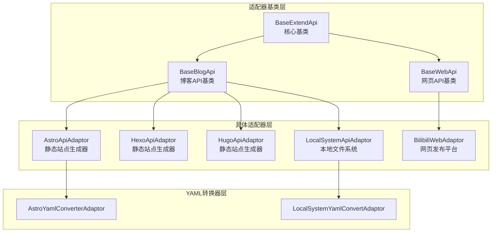
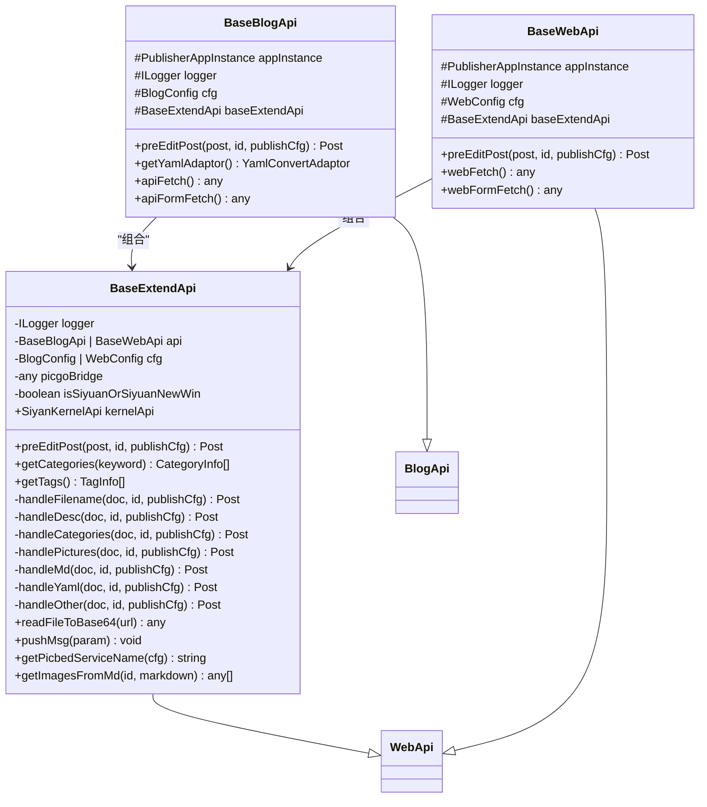
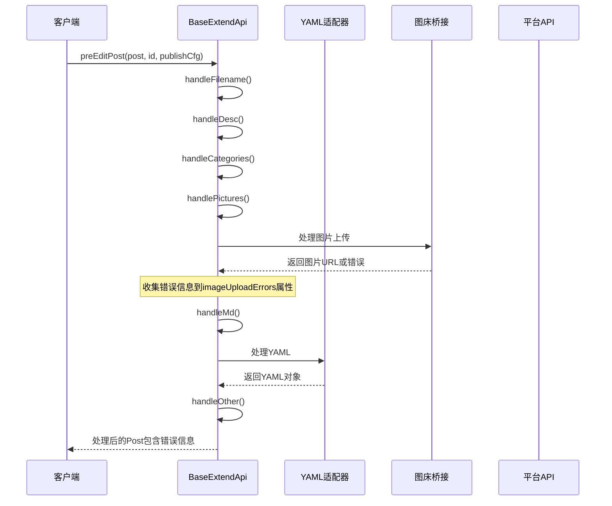
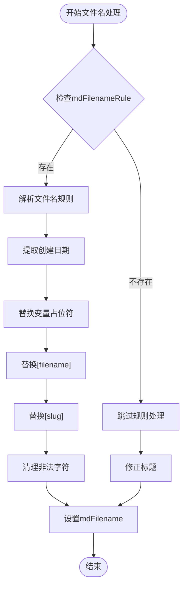
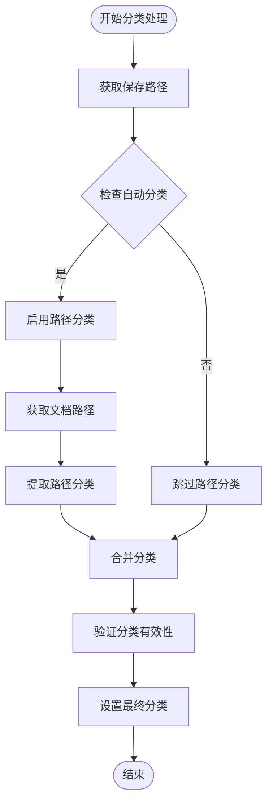
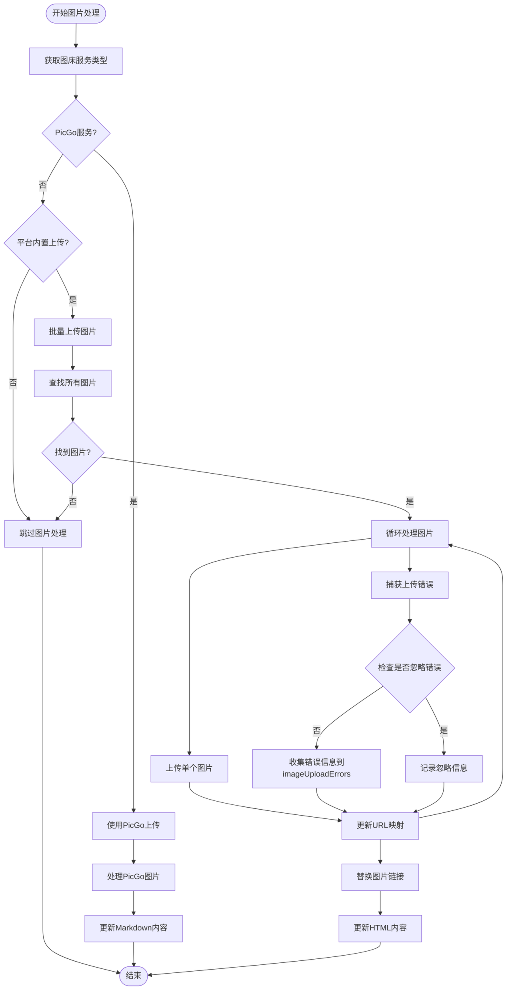
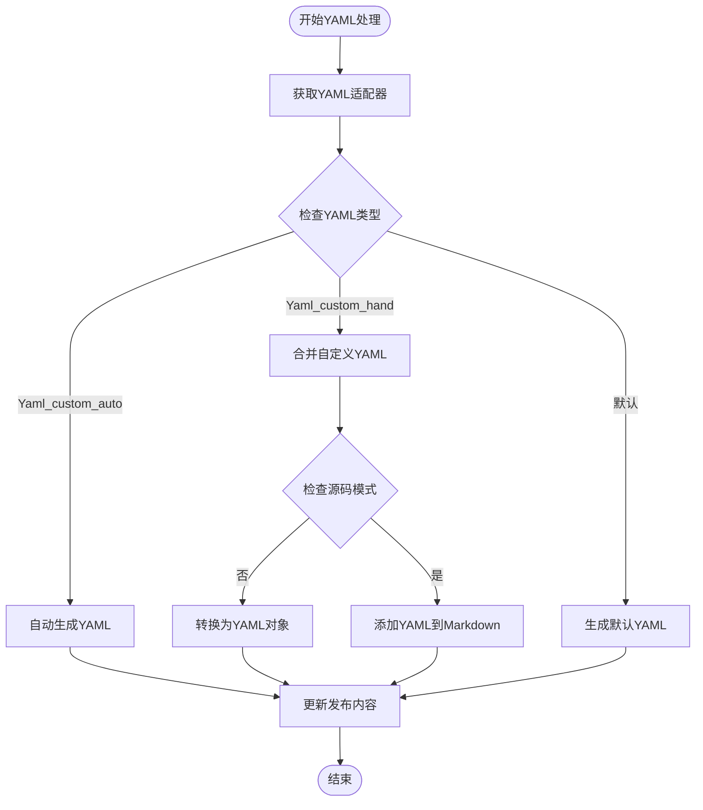
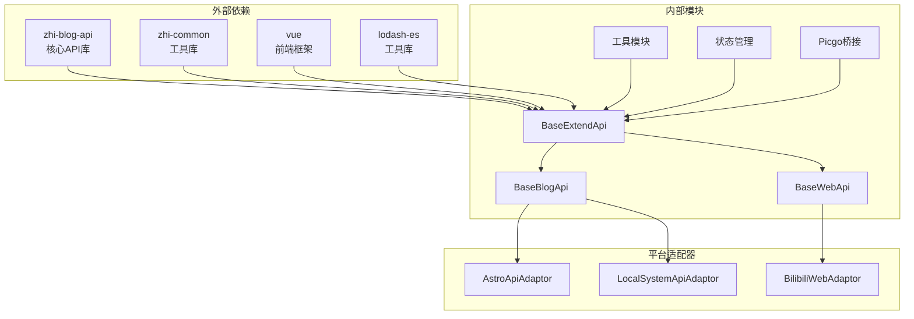

# BaseExtendApi基类设计

<cite>
**本文档引用的文件**
- [baseExtendApi.ts](file://src/adaptors/base/baseExtendApi.ts)
- [baseBlogApi.ts](file://src/adaptors/api/base/baseBlogApi.ts)
- [baseWebApi.ts](file://src/adaptors/web/base/baseWebApi.ts)
- [astroApiAdaptor.ts](file://src/adaptors/api/astro/astroApiAdaptor.ts)
- [astroYamlConverterAdaptor.ts](file://src/adaptors/api/astro/astroYamlConverterAdaptor.ts)
- [LocalSystemApiAdaptor.ts](file://src/adaptors/fs/LocalSystem/LocalSystemApiAdaptor.ts)
- [LocalSystemYamlConvertAdaptor.ts](file://src/adaptors/fs/LocalSystem/LocalSystemYamlConvertAdaptor.ts)
- [bilibiliWebAdaptor.ts](file://src/adaptors/web/bilibili/bilibiliWebAdaptor.ts)
- [hexoApiAdaptor.ts](file://src/adaptors/api/hexo/hexoApiAdaptor.ts)
- [hugoApiAdaptor.ts](file://src/adaptors/api/hugo/hugoApiAdaptor.ts)
- [BaseErrors.ts](file://src/utils/BaseErrors.ts)
- [usePicgoBridge.ts](file://src/composables/usePicgoBridge.ts)
</cite>

## 更新摘要
**变更内容**
- 增强了图片上传错误处理机制，支持错误收集而不中断发布流程
- 新增imageUploadErrors属性用于存储图片上传错误信息
- 添加getPicbedServiceName()辅助方法提供人类可读的服务名称
- 改进了图片处理过程中的错误处理和日志记录

## 目录
1. [简介](#简介)
2. [项目结构](#项目结构)
3. [核心组件](#核心组件)
4. [架构概览](#架构概览)
5. [详细组件分析](#详细组件分析)
6. [依赖关系分析](#依赖关系分析)
7. [性能考虑](#性能考虑)
8. [故障排除指南](#故障排除指南)
9. [结论](#结论)

## 简介

BaseExtendApi是该发布器系统的核心基类，为各种发布模式提供了统一的扩展框架。该基类实现了BlogAdaptor、WebAdaptor和YamlConvertAdaptor接口的统一抽象，通过预处理机制为不同平台提供一致的发布体验。

该基类的设计理念是"统一入口，平台特化"，通过继承机制让具体适配器专注于平台特定功能的实现，同时共享通用的预处理逻辑和基础设施。最新的更新增强了图片上传错误处理能力，使发布流程更加健壮和用户友好。

## 项目结构

发布器系统的适配器架构采用分层设计：



**图表来源**
- [baseExtendApi.ts:55-80](file://src/adaptors/base/baseExtendApi.ts#L55-L80)
- [baseBlogApi.ts:27-54](file://src/adaptors/api/base/baseBlogApi.ts#L27-L54)
- [baseWebApi.ts:36-63](file://src/adaptors/web/base/baseWebApi.ts#L36-L63)

**章节来源**
- [baseExtendApi.ts:1-741](file://src/adaptors/base/baseExtendApi.ts#L1-L741)
- [baseBlogApi.ts:1-205](file://src/adaptors/api/base/baseBlogApi.ts#L1-L205)
- [baseWebApi.ts:1-256](file://src/adaptors/web/base/baseWebApi.ts#L1-L256)

## 核心组件

### BaseExtendApi基类架构

BaseExtendApi作为核心基类，实现了以下关键特性：

1. **统一接口实现**：同时实现IBlogApi和IWebApi接口
2. **预处理流水线**：提供完整的文章预处理流程
3. **平台无关逻辑**：封装通用的处理逻辑
4. **扩展点设计**：为子类提供清晰的扩展接口
5. **增强的错误处理**：支持图片上传错误的收集和报告

### 核心数据结构



**图表来源**
- [baseExtendApi.ts:55-80](file://src/adaptors/base/baseExtendApi.ts#L55-L80)
- [baseBlogApi.ts:27-54](file://src/adaptors/api/base/baseBlogApi.ts#L27-L54)
- [baseWebApi.ts:36-63](file://src/adaptors/web/base/baseWebApi.ts#L36-L63)

**章节来源**
- [baseExtendApi.ts:49-80](file://src/adaptors/base/baseExtendApi.ts#L49-L80)
- [baseBlogApi.ts:27-54](file://src/adaptors/api/base/baseBlogApi.ts#L27-L54)
- [baseWebApi.ts:36-63](file://src/adaptors/web/base/baseWebApi.ts#L36-L63)

## 架构概览

### 预处理流水线架构

BaseExtendApi实现了完整的文章预处理流水线，确保所有平台都能获得一致的发布内容：



**图表来源**
- [baseExtendApi.ts:90-106](file://src/adaptors/base/baseExtendApi.ts#L90-L106)
- [baseExtendApi.ts:466-596](file://src/adaptors/base/baseExtendApi.ts#L466-L596)

### 统一抽象设计

BaseExtendApi通过以下方式实现统一抽象：

1. **接口统一**：同时实现IBlogApi和IWebApi接口
2. **配置统一**：支持BlogConfig和WebConfig两种配置类型
3. **处理流程统一**：标准化的预处理步骤
4. **错误处理统一**：一致的日志记录和错误处理机制

**章节来源**
- [baseExtendApi.ts:55-106](file://src/adaptors/base/baseExtendApi.ts#L55-L106)
- [baseExtendApi.ts:360-456](file://src/adaptors/base/baseExtendApi.ts#L360-L456)

## 详细组件分析

### 预处理流水线详解

#### 文件名处理 (handleFilename)

文件名处理是发布流程的第一步，负责根据配置规则生成合适的文件名：



**图表来源**
- [baseExtendApi.ts:150-211](file://src/adaptors/base/baseExtendApi.ts#L150-L211)

#### 分类处理 (handleCategories)

分类处理结合了路径分类和手动分类，确保内容组织的一致性：



**图表来源**
- [baseExtendApi.ts:239-281](file://src/adaptors/base/baseExtendApi.ts#L239-L281)

#### 图片处理 (handlePictures)

**更新** 图片处理是最复杂的预处理步骤，现在具备了增强的错误处理能力：



**新增功能**：
- **错误收集机制**：使用`imageUploadErrors`属性收集所有上传失败的图片信息
- **智能错误处理**：区分可忽略的错误（如宏模式下的页面ID缺失）和需要报告的错误
- **人类可读服务名称**：通过`getPicbedServiceName()`方法提供友好的服务名称显示

**图表来源**
- [baseExtendApi.ts:466-596](file://src/adaptors/base/baseExtendApi.ts#L466-L596)
- [baseExtendApi.ts:530-545](file://src/adaptors/base/baseExtendApi.ts#L530-L545)
- [baseExtendApi.ts:588-598](file://src/adaptors/base/baseExtendApi.ts#L588-L598)

**章节来源**
- [baseExtendApi.ts:150-211](file://src/adaptors/base/baseExtendApi.ts#L150-L211)
- [baseExtendApi.ts:239-281](file://src/adaptors/base/baseExtendApi.ts#L239-L281)
- [baseExtendApi.ts:466-596](file://src/adaptors/base/baseExtendApi.ts#L466-L596)

### YAML处理机制

BaseExtendApi提供了灵活的YAML处理机制，支持三种不同的处理策略：



**图表来源**
- [baseExtendApi.ts:360-456](file://src/adaptors/base/baseExtendApi.ts#L360-L456)

**章节来源**
- [baseExtendApi.ts:360-456](file://src/adaptors/base/baseExtendApi.ts#L360-L456)

### 增强的错误处理和日志记录

**更新** BaseExtendApi实现了完善的错误处理和日志记录机制，现在具备了更强大的图片上传错误处理能力：

| 错误类型 | 处理策略 | 日志级别 | 新增功能 |
|---------|---------|---------|---------|
| 图片上传失败 | 收集错误信息到imageUploadErrors属性 | ERROR | 错误信息持久化 |
| 外链引用未发布 | 抛出异常并提供解决方案 | ERROR | 异常传播 |
| YAML适配器缺失 | 使用默认YAML生成 | WARN | 默认回退 |
| 图床服务未配置 | 跳过图片处理并通知 | INFO | 优雅降级 |
| 宏模式页面ID缺失 | 智能忽略此错误 | INFO | 错误分类处理 |

**新增功能**：
- **imageUploadErrors属性**：存储所有图片上传失败的详细信息
- **getPicbedServiceName()方法**：提供人类可读的图床服务名称
- **智能错误分类**：区分可忽略和需要报告的错误类型

**章节来源**
- [baseExtendApi.ts:530-545](file://src/adaptors/base/baseExtendApi.ts#L530-L545)
- [baseExtendApi.ts:588-598](file://src/adaptors/base/baseExtendApi.ts#L588-L598)
- [BaseErrors.ts:13-18](file://src/utils/BaseErrors.ts#L13-L18)

## 依赖关系分析

### 组件依赖图



**图表来源**
- [baseExtendApi.ts:10-47](file://src/adaptors/base/baseExtendApi.ts#L10-L47)
- [baseBlogApi.ts:10-18](file://src/adaptors/api/base/baseBlogApi.ts#L10-L18)
- [baseWebApi.ts:9-27](file://src/adaptors/web/base/baseWebApi.ts#L9-L27)

### 关键依赖关系

1. **API依赖**：依赖zhi-blog-api提供统一的API接口
2. **工具依赖**：依赖zhi-common提供常用工具函数
3. **状态管理**：依赖Vue的响应式系统
4. **平台集成**：通过适配器模式集成各种发布平台
5. **错误处理**：依赖BaseError枚举提供标准错误标识

**章节来源**
- [baseExtendApi.ts:10-47](file://src/adaptors/base/baseExtendApi.ts#L10-L47)
- [baseBlogApi.ts:10-18](file://src/adaptors/api/base/baseBlogApi.ts#L10-L18)
- [baseWebApi.ts:9-27](file://src/adaptors/web/base/baseWebApi.ts#L9-L27)

## 性能考虑

### 预处理性能优化

BaseExtendApi在设计时充分考虑了性能因素：

1. **异步处理**：所有网络操作都采用异步方式，避免阻塞主线程
2. **缓存机制**：合理使用缓存减少重复计算
3. **批量操作**：图片上传采用批量处理提高效率
4. **条件判断**：通过条件判断避免不必要的处理步骤
5. **错误处理优化**：智能错误分类减少无效重试

### 内存管理

1. **深拷贝策略**：使用深拷贝避免修改原始数据
2. **资源释放**：及时释放临时资源和内存
3. **流式处理**：对于大文件采用流式处理方式
4. **错误信息管理**：合理管理imageUploadErrors属性的内存占用

## 故障排除指南

### 常见问题及解决方案

#### 图片上传失败

**更新** **问题描述**：图片无法上传到目标平台
**可能原因**：
- 网络连接问题
- 平台API限制
- 图片格式不支持
- 图床服务配置错误

**解决步骤**：
1. 检查网络连接状态
2. 验证平台API配置
3. 确认图片格式兼容性
4. 查看imageUploadErrors属性获取详细错误信息

#### 外链引用错误

**问题描述**：发布包含外链引用的文章时报错
**解决方法**：
```javascript
// 在配置中启用忽略外链
preferenceSetting.ignoreBlockRef = true;
```

#### YAML处理异常

**问题描述**：YAML格式处理出现错误
**排查步骤**：
1. 检查YAML适配器配置
2. 验证YAML格式正确性
3. 查看日志获取详细错误信息

#### 图片上传错误收集

**新增功能**：如何处理imageUploadErrors属性
```javascript
// 检查是否有图片上传错误
if (post.imageUploadErrors && post.imageUploadErrors.length > 0) {
  console.log('发现图片上传错误:', post.imageUploadErrors);
  // 可以向用户展示这些错误信息
  post.imageUploadErrors.forEach(error => {
    console.error('图片上传失败:', error);
  });
}
```

**章节来源**
- [baseExtendApi.ts:530-545](file://src/adaptors/base/baseExtendApi.ts#L530-L545)
- [baseExtendApi.ts:686-713](file://src/adaptors/base/baseExtendApi.ts#L686-L713)

## 结论

BaseExtendApi基类通过其精心设计的架构，成功实现了以下目标：

1. **统一抽象**：为不同类型的发布平台提供统一的抽象接口
2. **可扩展性**：通过继承机制支持新平台的快速集成
3. **一致性**：确保所有平台都遵循相同的预处理流程
4. **可靠性**：完善的错误处理和日志记录机制
5. **用户友好**：增强的错误处理提供更好的用户体验

**更新亮点**：
- **增强的错误处理**：通过imageUploadErrors属性提供详细的错误信息
- **智能错误分类**：区分可忽略和需要报告的错误类型
- **人类可读服务名称**：通过getPicbedServiceName()方法提升用户体验
- **优雅降级**：即使部分图片上传失败，发布流程仍能继续进行

该基类在整个适配器体系中扮演着核心角色，是实现多平台发布支持的关键基础设施。通过合理的架构设计和丰富的扩展点，它为系统的长期发展奠定了坚实的基础。