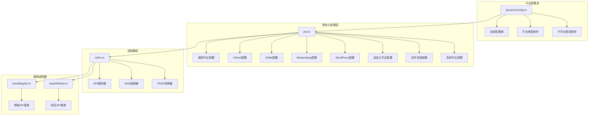
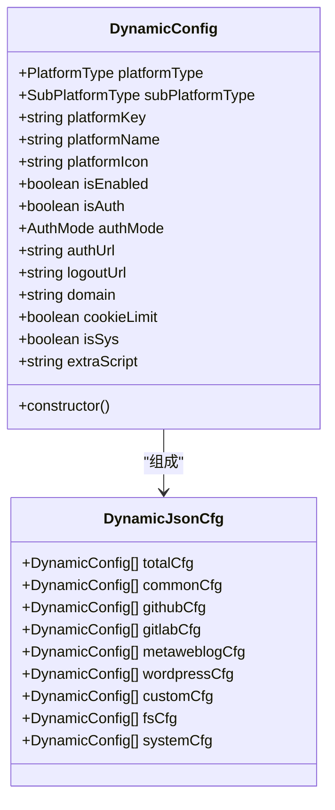
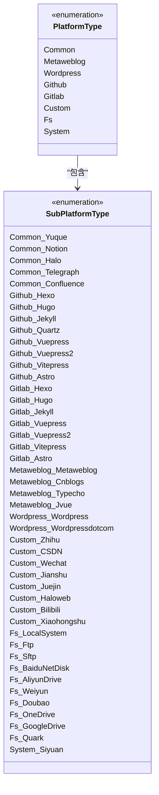
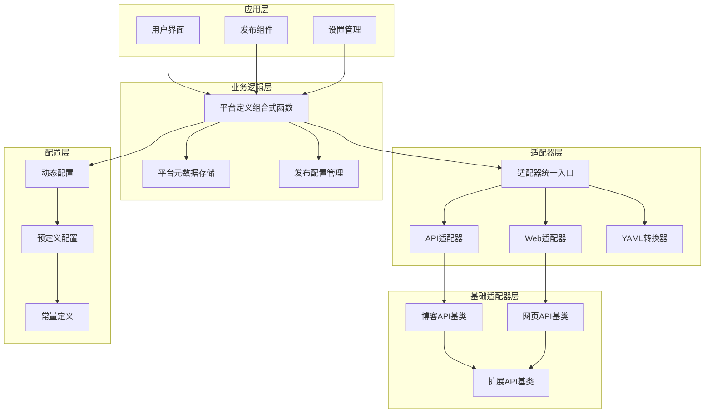
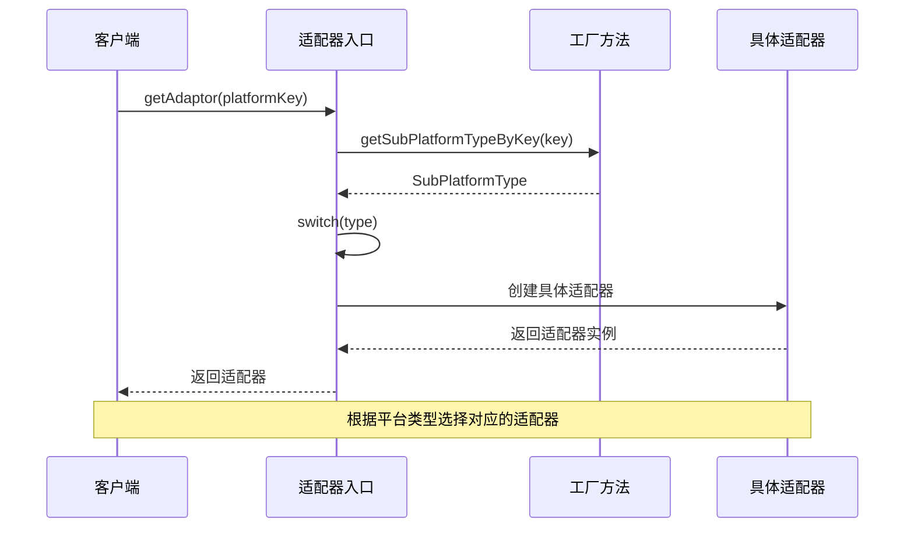
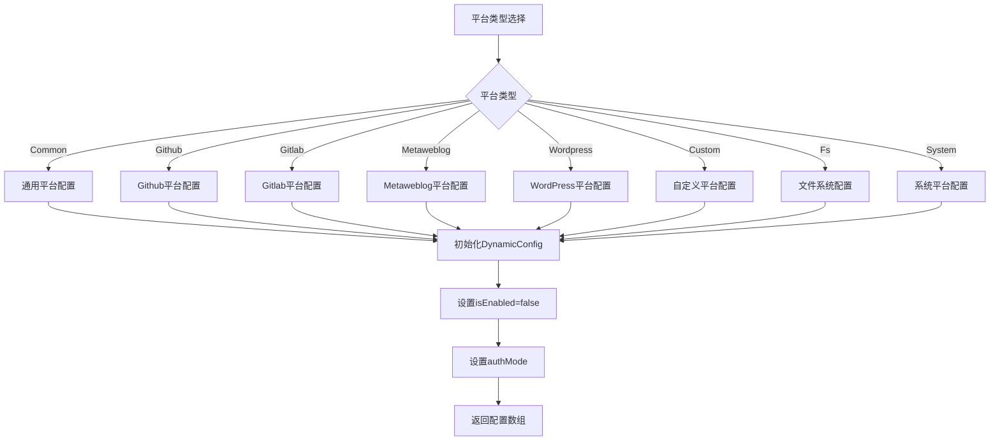
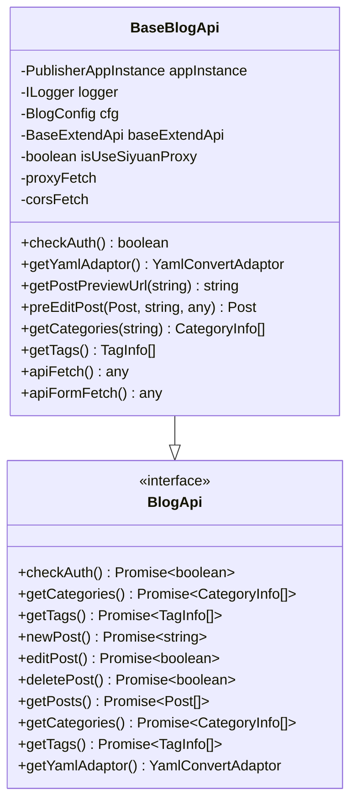
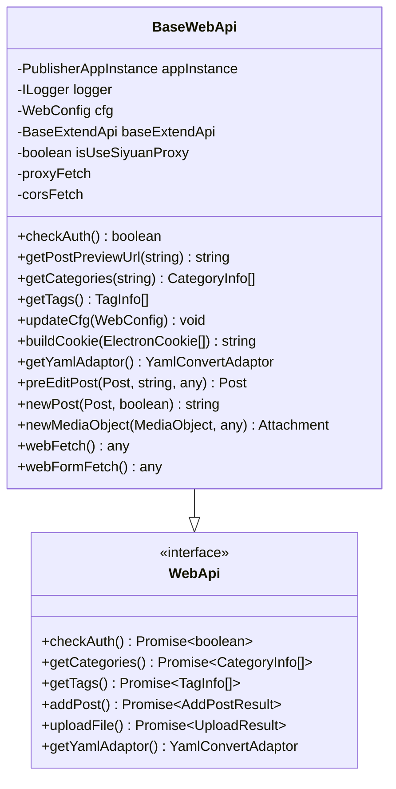
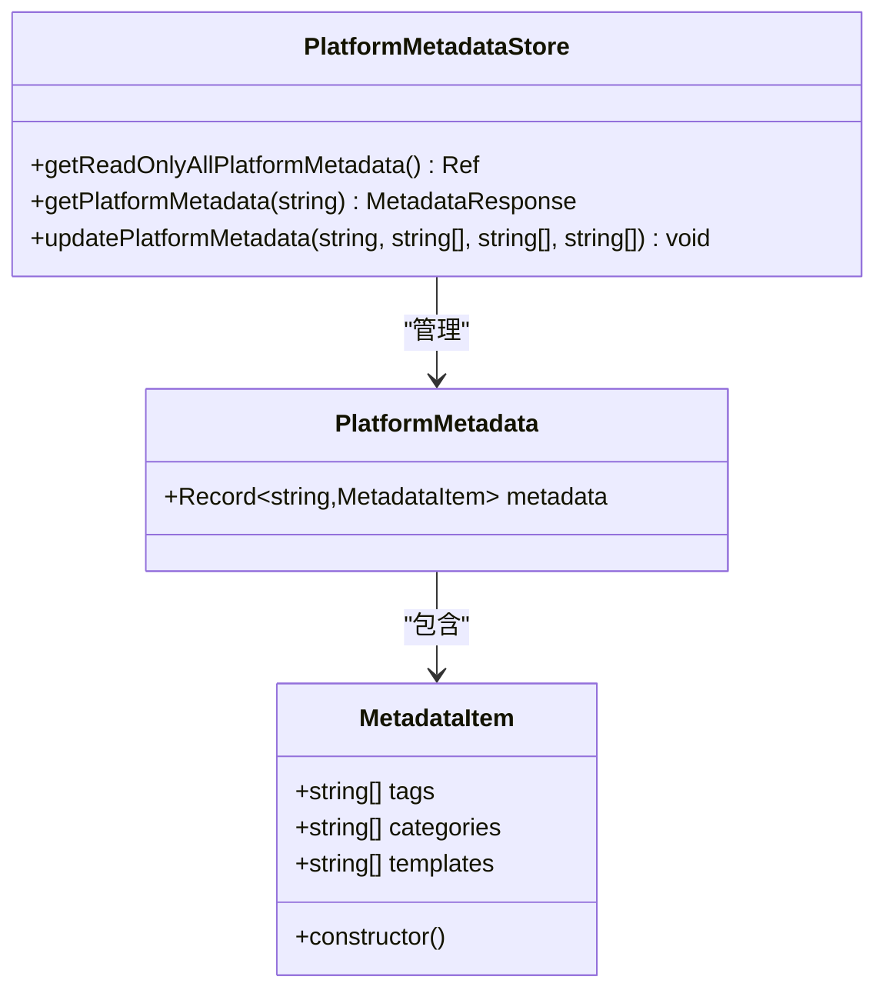
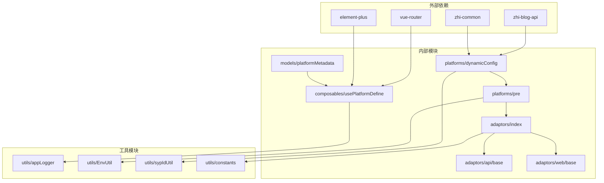

# 平台类型系统

<cite>
**本文档引用的文件**
- [dynamicConfig.ts](file://src/platforms/dynamicConfig.ts)
- [pre.ts](file://src/platforms/pre.ts)
- [PreConstants.ts](file://src/platforms/PreConstants.ts)
- [index.ts](file://src/adaptors/index.ts)
- [baseBlogApi.ts](file://src/adaptors/api/base/baseBlogApi.ts)
- [baseWebApi.ts](file://src/adaptors/web/base/baseWebApi.ts)
- [platformMetadata.ts](file://src/models/platformMetadata.ts)
- [usePlatformDefine.ts](file://src/composables/usePlatformDefine.ts)
- [dynamicConfig.spec.ts](file://src/platforms/dynamicConfig.spec.ts)
</cite>

## 目录
1. [简介](#简介)
2. [项目结构](#项目结构)
3. [核心组件](#核心组件)
4. [架构概览](#架构概览)
5. [详细组件分析](#详细组件分析)
6. [依赖分析](#依赖分析)
7. [性能考虑](#性能考虑)
8. [故障排除指南](#故障排除指南)
9. [结论](#结论)
10. [附录](#附录)

## 简介

平台类型系统是该插件的核心架构组件，负责管理和组织各种内容发布平台的抽象化接口。该系统采用分层设计，通过动态配置机制实现了高度可扩展的平台支持体系，涵盖了博客平台、静态站点平台、内容平台、Web平台和文件系统等多种类型。

系统的核心目标是为不同类型的发布平台提供统一的抽象接口，使得开发者可以轻松地添加新的平台支持，同时保持代码的可维护性和扩展性。

## 项目结构

平台类型系统主要分布在以下目录结构中：

**图表来源**
- [dynamicConfig.ts:1-534](file://src/platforms/dynamicConfig.ts#L1-L534)
- [pre.ts:1-463](file://src/platforms/pre.ts#L1-L463)
- [index.ts:1-573](file://src/adaptors/index.ts#L1-L573)

**章节来源**
- [dynamicConfig.ts:1-534](file://src/platforms/dynamicConfig.ts#L1-L534)
- [pre.ts:1-463](file://src/platforms/pre.ts#L1-L463)
- [index.ts:1-573](file://src/adaptors/index.ts#L1-L573)

## 核心组件

### 动态配置系统

动态配置系统是平台类型系统的核心，它提供了灵活的配置管理机制：

**图表来源**
- [dynamicConfig.ts:13-113](file://src/platforms/dynamicConfig.ts#L13-L113)
- [dynamicConfig.ts:243-253](file://src/platforms/dynamicConfig.ts#L243-L253)

### 平台类型枚举体系

系统定义了完整的平台类型枚举体系，涵盖所有支持的平台类别：

**图表来源**
- [dynamicConfig.ts:126-238](file://src/platforms/dynamicConfig.ts#L126-L238)

**章节来源**
- [dynamicConfig.ts:126-238](file://src/platforms/dynamicConfig.ts#L126-L238)

## 架构概览

平台类型系统采用分层架构设计，确保了良好的可扩展性和维护性：

**图表来源**
- [usePlatformDefine.ts:1-82](file://src/composables/usePlatformDefine.ts#L1-L82)
- [index.ts:56-573](file://src/adaptors/index.ts#L56-L573)
- [baseBlogApi.ts:27-205](file://src/adaptors/api/base/baseBlogApi.ts#L27-L205)
- [baseWebApi.ts:36-256](file://src/adaptors/web/base/baseWebApi.ts#L36-L256)

## 详细组件分析

### 平台类型分类体系

#### 通用平台 (Common)
通用平台类型用于支持标准化的内容管理系统，具有统一的API接口：
- **特点**: 支持标准的博客API接口
- **适用场景**: 语雀、Notion、Halo、Telegraph、Confluence等
- **认证模式**: API认证为主
- **配置特性**: 支持统一的元数据管理

#### GitHub平台 (Github)
GitHub平台专门用于支持基于GitHub的静态站点生成器：
- **特点**: 支持多种静态站点生成器
- **适用场景**: Hugo、Hexo、Jekyll、VuePress、VitePress、Astro等
- **认证模式**: API认证
- **配置特性**: 支持GitHub仓库集成

#### GitLab平台 (Gitlab)
GitLab平台用于支持基于GitLab的静态站点生成器：
- **特点**: 与GitLab CI/CD集成
- **适用场景**: GitLab Pages支持的各种静态站点
- **认证模式**: API认证
- **配置特性**: 支持GitLab项目配置

#### Metaweblog平台 (Metaweblog)
Metaweblog协议平台用于支持XML-RPC协议的博客系统：
- **特点**: 遵循Metaweblog协议标准
- **适用场景**: 博客园、Typecho、Jvue等
- **认证模式**: API认证
- **配置特性**: 支持XML-RPC接口

#### WordPress平台 (Wordpress)
WordPress平台用于支持WordPress博客系统：
- **特点**: 支持WordPress REST API
- **适用场景**: WordPress博客、WordPress.com
- **认证模式**: API认证
- **配置特性**: 支持WordPress特定功能

#### 自定义平台 (Custom)
自定义平台用于支持需要网页授权的平台：
- **特点**: 需要浏览器会话和Cookie
- **适用场景**: 知乎、CSDN、微信公众号、简书、掘金等
- **认证模式**: 网页授权
- **配置特性**: 支持Cookie管理和UA设置

#### 文件系统平台 (Fs)
文件系统平台用于支持本地文件系统操作：
- **特点**: 直接文件系统访问
- **适用场景**: 本地系统、FTP、SFTP等
- **认证模式**: API认证
- **配置特性**: 支持多种文件传输协议

#### 系统平台 (System)
系统平台用于内部系统集成：
- **特点**: 仅内部使用
- **适用场景**: 思源笔记集成
- **认证模式**: API认证
- **配置特性**: 不对外公开

**章节来源**
- [dynamicConfig.ts:126-166](file://src/platforms/dynamicConfig.ts#L126-L166)
- [pre.ts:50-96](file://src/platforms/pre.ts#L50-L96)

### 适配器映射机制

适配器系统根据平台类型动态选择相应的适配器实现：

**图表来源**
- [index.ts:65-263](file://src/adaptors/index.ts#L65-L263)
- [dynamicConfig.ts:397-418](file://src/platforms/dynamicConfig.ts#L397-L418)

### 预定义配置管理

预定义配置系统提供了平台的初始配置模板：

**图表来源**
- [pre.ts:101-462](file://src/platforms/pre.ts#L101-L462)

**章节来源**
- [pre.ts:101-462](file://src/platforms/pre.ts#L101-L462)

### 基础适配器架构

系统提供了两套基础适配器来支持不同的认证模式：

#### 博客API基类 (BaseBlogApi)
博客API基类支持标准的API认证模式：

**图表来源**
- [baseBlogApi.ts:27-205](file://src/adaptors/api/base/baseBlogApi.ts#L27-L205)

#### 网页API基类 (BaseWebApi)
网页API基类支持网页授权模式：

**图表来源**
- [baseWebApi.ts:36-256](file://src/adaptors/web/base/baseWebApi.ts#L36-L256)

**章节来源**
- [baseBlogApi.ts:27-205](file://src/adaptors/api/base/baseBlogApi.ts#L27-L205)
- [baseWebApi.ts:36-256](file://src/adaptors/web/base/baseWebApi.ts#L36-L256)

### 平台元数据管理

平台元数据系统提供了统一的元数据管理机制：

**图表来源**
- [platformMetadata.ts:16-49](file://src/models/platformMetadata.ts#L16-L49)

**章节来源**
- [platformMetadata.ts:16-49](file://src/models/platformMetadata.ts#L16-L49)

## 依赖分析

平台类型系统的依赖关系呈现清晰的层次结构：

**图表来源**
- [dynamicConfig.ts:10-11](file://src/platforms/dynamicConfig.ts#L10-L11)
- [pre.ts:10-13](file://src/platforms/pre.ts#L10-L13)
- [index.ts:10-18](file://src/adaptors/index.ts#L10-L18)

**章节来源**
- [dynamicConfig.ts:10-11](file://src/platforms/dynamicConfig.ts#L10-L11)
- [pre.ts:10-13](file://src/platforms/pre.ts#L10-L13)
- [index.ts:10-18](file://src/adaptors/index.ts#L10-L18)

## 性能考虑

平台类型系统在设计时充分考虑了性能优化：

### 缓存策略
- **平台配置缓存**: 预定义平台配置在内存中缓存，避免重复加载
- **适配器实例缓存**: 适配器实例按需创建并缓存，减少重复实例化开销
- **元数据缓存**: 平台元数据使用响应式引用，支持增量更新

### 异步处理
- **异步适配器加载**: 适配器按需异步加载，提升启动性能
- **延迟初始化**: 非关键功能采用延迟初始化策略
- **并发处理**: 支持多个平台的并发操作

### 内存管理
- **垃圾回收优化**: 合理的生命周期管理，及时释放不再使用的资源
- **事件监听器清理**: 自动清理事件监听器，防止内存泄漏
- **配置对象复用**: 配置对象在适当情况下进行复用

## 故障排除指南

### 常见问题及解决方案

#### 平台配置错误
**问题**: 平台配置无法正确加载
**解决方案**:
1. 检查平台Key的唯一性
2. 验证平台配置的完整性
3. 确认平台类型与子类型的一致性

#### 适配器初始化失败
**问题**: 适配器无法正确初始化
**解决方案**:
1. 检查平台配置中的认证信息
2. 验证网络连接和代理设置
3. 确认平台API的可用性

#### 认证问题
**问题**: 平台认证失败
**解决方案**:
1. 检查认证模式设置（API vs Web）
2. 验证凭据的有效性
3. 确认网络环境和防火墙设置

**章节来源**
- [dynamicConfig.ts:442-497](file://src/platforms/dynamicConfig.ts#L442-L497)

## 结论

平台类型系统通过其精心设计的分层架构和动态配置机制，成功实现了对多种发布平台的统一抽象。该系统的主要优势包括：

1. **高度可扩展性**: 通过动态配置机制，可以轻松添加新的平台支持
2. **统一接口**: 为不同类型的平台提供一致的编程接口
3. **灵活的认证模式**: 支持API认证和网页授权两种模式
4. **完善的元数据管理**: 提供统一的平台元数据管理机制
5. **良好的性能表现**: 通过缓存和异步处理优化性能

该系统为内容发布插件提供了坚实的基础架构，使得开发者可以专注于具体的平台实现细节，而无需关心底层的架构复杂性。

## 附录

### 开发者指南

#### 新增平台类型的步骤
1. 在`SubPlatformType`枚举中添加新的子平台类型
2. 在`pre.ts`中添加平台的预定义配置
3. 实现相应的适配器类
4. 在`index.ts`中注册新的适配器映射
5. 测试平台的完整功能

#### 最佳实践
- 保持平台配置的简洁性和一致性
- 充分利用基础适配器的功能
- 注重错误处理和用户体验
- 编写完整的单元测试