# 适配器开发指南

<cite>
**本文档引用的文件**
- [src/adaptors/index.ts](file://src/adaptors/index.ts)
- [src/adaptors/base/baseExtendApi.ts](file://src/adaptors/base/baseExtendApi.ts)
- [src/adaptors/api/base/baseBlogApi.ts](file://src/adaptors/api/base/baseBlogApi.ts)
- [src/adaptors/web/base/baseWebApi.ts](file://src/adaptors/web/base/baseWebApi.ts)
- [src/adaptors/fs/LocalSystem/LocalSystemApiAdaptor.ts](file://src/adaptors/fs/LocalSystem/LocalSystemApiAdaptor.ts)
- [src/adaptors/api/cnblogs/cnblogsApiAdaptor.ts](file://src/adaptors/api/cnblogs/cnblogsApiAdaptor.ts)
- [src/adaptors/web/zhihu/zhihuWebAdaptor.ts](file://src/adaptors/web/zhihu/zhihuWebAdaptor.ts)
- [src/adaptors/api/hexo/hexoApiAdaptor.ts](file://src/adaptors/api/hexo/hexoApiAdaptor.ts)
- [src/adaptors/fs/LocalSystem/LocalSystemConfig.ts](file://src/adaptors/fs/LocalSystem/LocalSystemConfig.ts)
- [src/adaptors/api/cnblogs/cnblogsConfig.ts](file://src/adaptors/api/cnblogs/cnblogsConfig.ts)
- [src/adaptors/web/zhihu/zhihuConfig.ts](file://src/adaptors/web/zhihu/zhihuConfig.ts)
- [src/adaptors/api/hexo/hexoConfig.ts](file://src/adaptors/api/hexo/hexoConfig.ts)
- [src/platforms/dynamicConfig.ts](file://src/platforms/dynamicConfig.ts)
- [src/utils/BaseErrors.ts](file://src/utils/BaseErrors.ts)
- [src/adaptors/api/base/commonBlogConfig.ts](file://src/adaptors/api/base/commonBlogConfig.ts)
- [src/adaptors/fs/LocalSystem/LocalSystemYamlConvertAdaptor.ts](file://src/adaptors/fs/LocalSystem/LocalSystemYamlConvertAdaptor.ts)
- [common/pageUtils.spec.ts](file://common/pageUtils.spec.ts)
</cite>

## 目录
1. [简介](#简介)
2. [项目结构](#项目结构)
3. [核心组件](#核心组件)
4. [架构概览](#架构概览)
5. [详细组件分析](#详细组件分析)
6. [依赖关系分析](#依赖关系分析)
7. [性能考虑](#性能考虑)
8. [故障排除指南](#故障排除指南)
9. [结论](#结论)
10. [附录](#附录)

## 简介
本指南面向适配器开发者，提供基于现有代码库的完整适配器开发框架。项目采用模块化设计，支持博客平台、Web平台、文件系统等多种适配器类型。通过统一的适配器入口、基类封装和配置管理，开发者可以快速实现新平台的适配。

## 项目结构
项目采用按功能域划分的组织方式，核心适配器位于 `src/adaptors/` 目录下，按照平台类型进一步细分：

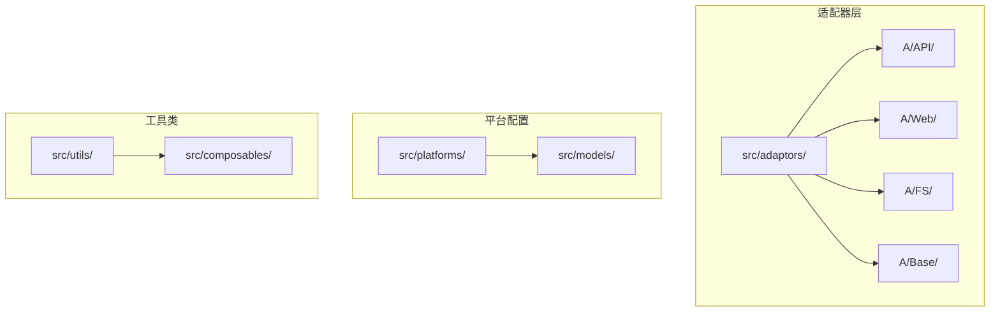

**图表来源**
- [src/adaptors/index.ts:1-573](file://src/adaptors/index.ts#L1-L573)
- [src/platforms/dynamicConfig.ts:1-534](file://src/platforms/dynamicConfig.ts#L1-L534)

**章节来源**
- [src/adaptors/index.ts:1-573](file://src/adaptors/index.ts#L1-L573)
- [src/platforms/dynamicConfig.ts:1-534](file://src/platforms/dynamicConfig.ts#L1-L534)

## 核心组件
项目的核心由三个层次构成：适配器入口、基类封装和具体实现。

### 适配器入口
统一的适配器工厂负责根据平台类型创建相应的适配器实例：

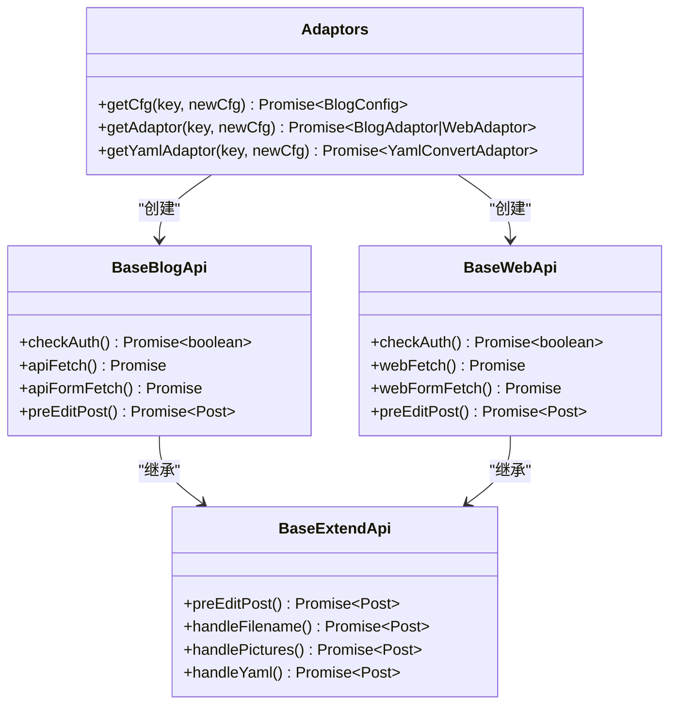

**图表来源**
- [src/adaptors/index.ts:56-573](file://src/adaptors/index.ts#L56-L573)
- [src/adaptors/api/base/baseBlogApi.ts:27-205](file://src/adaptors/api/base/baseBlogApi.ts#L27-L205)
- [src/adaptors/web/base/baseWebApi.ts:36-256](file://src/adaptors/web/base/baseWebApi.ts#L36-L256)
- [src/adaptors/base/baseExtendApi.ts:55-739](file://src/adaptors/base/baseExtendApi.ts#L55-L739)

### 平台类型系统
项目采用动态配置系统管理不同类型的平台：

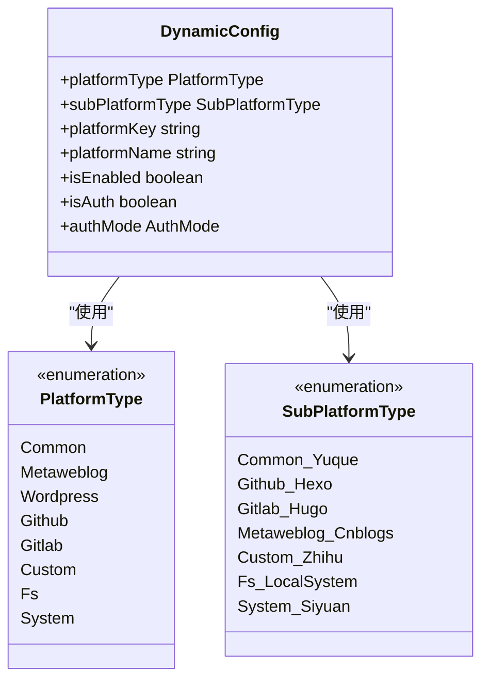

**图表来源**
- [src/platforms/dynamicConfig.ts:13-238](file://src/platforms/dynamicConfig.ts#L13-L238)

**章节来源**
- [src/adaptors/index.ts:56-573](file://src/adaptors/index.ts#L56-L573)
- [src/adaptors/base/baseExtendApi.ts:55-739](file://src/adaptors/base/baseExtendApi.ts#L55-L739)
- [src/platforms/dynamicConfig.ts:13-238](file://src/platforms/dynamicConfig.ts#L13-L238)

## 架构概览
项目采用分层架构设计，确保各层职责清晰、耦合度低：

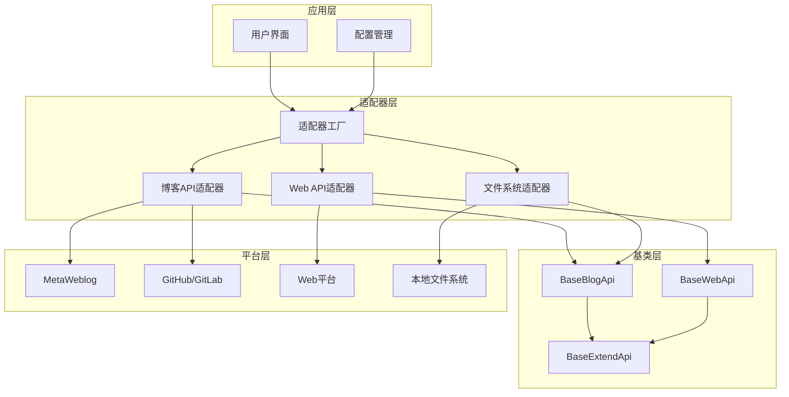

**图表来源**
- [src/adaptors/index.ts:56-573](file://src/adaptors/index.ts#L56-L573)
- [src/adaptors/api/base/baseBlogApi.ts:27-205](file://src/adaptors/api/base/baseBlogApi.ts#L27-L205)
- [src/adaptors/web/base/baseWebApi.ts:36-256](file://src/adaptors/web/base/baseWebApi.ts#L36-L256)

## 详细组件分析

### 博客平台适配器（以博客园为例）

博客平台适配器继承自 `BaseBlogApi`，实现了 MetaWeblog 协议：

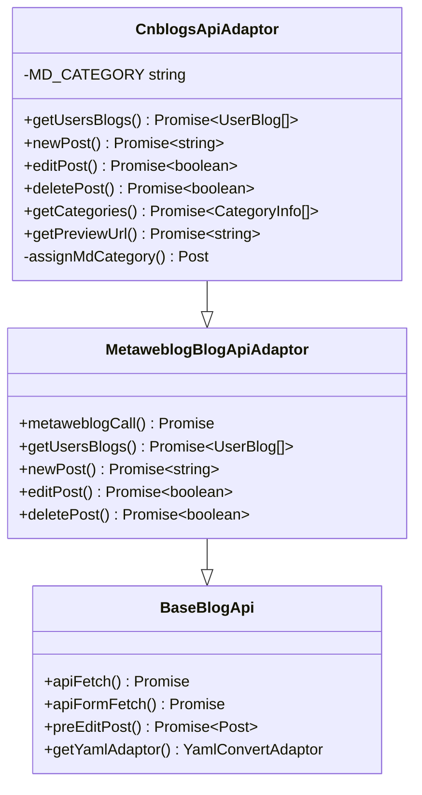

**图表来源**
- [src/adaptors/api/cnblogs/cnblogsApiAdaptor.ts:27-131](file://src/adaptors/api/cnblogs/cnblogsApiAdaptor.ts#L27-L131)

#### 配置实现
博客园适配器的配置类继承自 `MetaweblogConfig`：

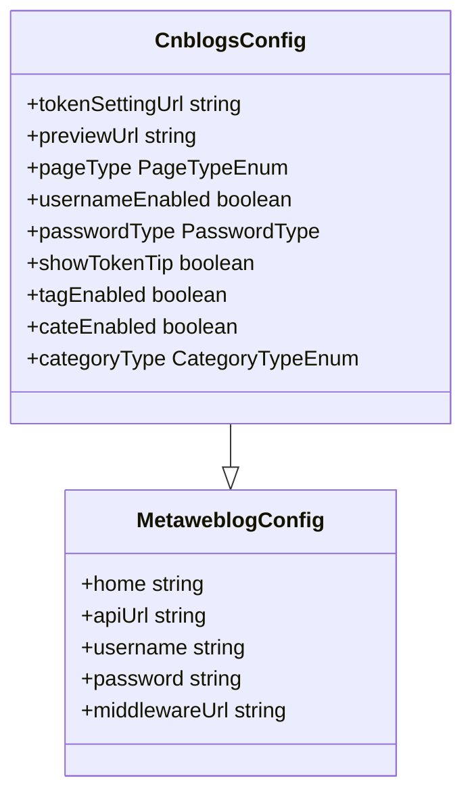

**图表来源**
- [src/adaptors/api/cnblogs/cnblogsConfig.ts:19-47](file://src/adaptors/api/cnblogs/cnblogsConfig.ts#L19-L47)

**章节来源**
- [src/adaptors/api/cnblogs/cnblogsApiAdaptor.ts:27-131](file://src/adaptors/api/cnblogs/cnblogsApiAdaptor.ts#L27-L131)
- [src/adaptors/api/cnblogs/cnblogsConfig.ts:19-47](file://src/adaptors/api/cnblogs/cnblogsConfig.ts#L19-L47)

### Web平台适配器（以知乎为例）

Web平台适配器专门处理需要浏览器环境和Cookie认证的平台：

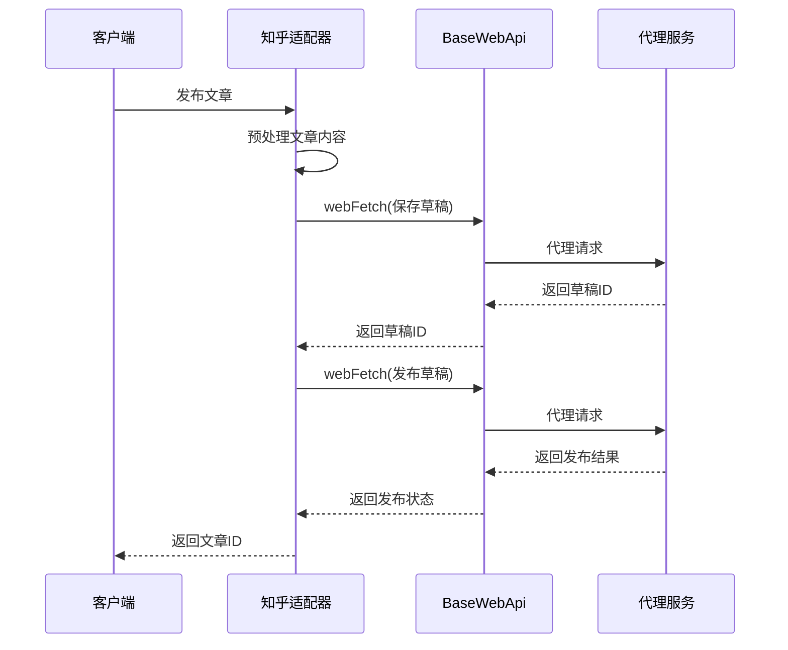

**图表来源**
- [src/adaptors/web/zhihu/zhihuWebAdaptor.ts:131-165](file://src/adaptors/web/zhihu/zhihuWebAdaptor.ts#L131-L165)
- [src/adaptors/web/base/baseWebApi.ts:150-248](file://src/adaptors/web/base/baseWebApi.ts#L150-L248)

#### 图片上传流程
Web平台的图片上传具有特殊处理逻辑：

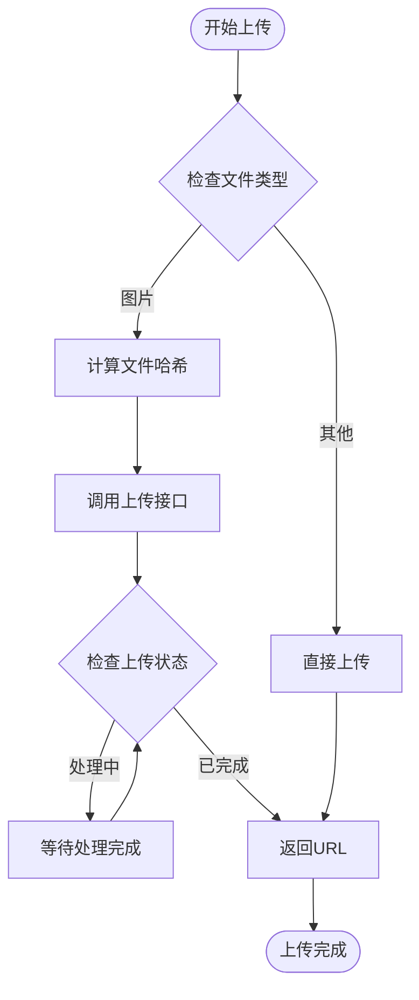

**图表来源**
- [src/adaptors/web/zhihu/zhihuWebAdaptor.ts:268-320](file://src/adaptors/web/zhihu/zhihuWebAdaptor.ts#L268-L320)

**章节来源**
- [src/adaptors/web/zhihu/zhihuWebAdaptor.ts:29-459](file://src/adaptors/web/zhihu/zhihuWebAdaptor.ts#L29-L459)
- [src/adaptors/web/base/baseWebApi.ts:36-256](file://src/adaptors/web/base/baseWebApi.ts#L36-L256)

### 文件系统适配器

文件系统适配器支持多种静态站点生成器的YAML格式：

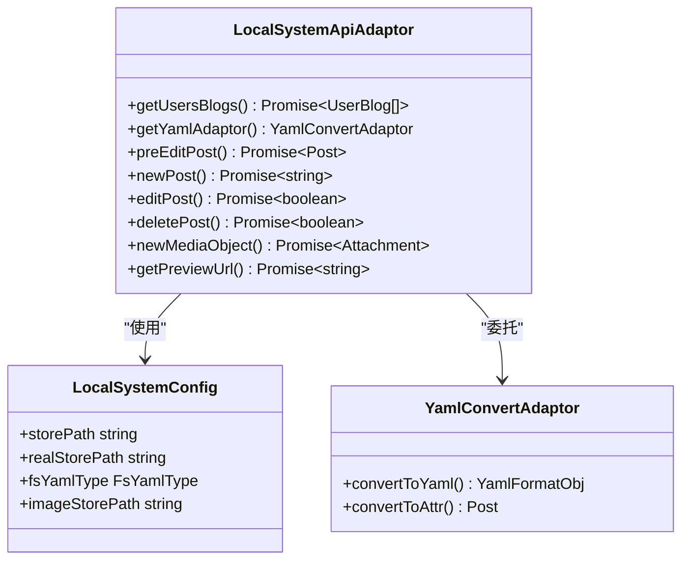

**图表来源**
- [src/adaptors/fs/LocalSystem/LocalSystemApiAdaptor.ts:42-273](file://src/adaptors/fs/LocalSystem/LocalSystemApiAdaptor.ts#L42-L273)
- [src/adaptors/fs/LocalSystem/LocalSystemConfig.ts:22-45](file://src/adaptors/fs/LocalSystem/LocalSystemConfig.ts#L22-L45)

**章节来源**
- [src/adaptors/fs/LocalSystem/LocalSystemApiAdaptor.ts:42-273](file://src/adaptors/fs/LocalSystem/LocalSystemApiAdaptor.ts#L42-L273)
- [src/adaptors/fs/LocalSystem/LocalSystemConfig.ts:22-45](file://src/adaptors/fs/LocalSystem/LocalSystemConfig.ts#L22-L45)

### 静态站点生成器适配器（以Hexo为例）

静态站点生成器适配器继承自GitHub通用适配器：

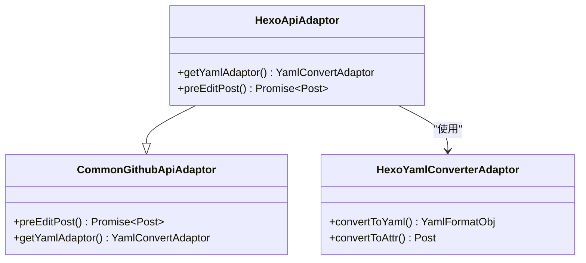

**图表来源**
- [src/adaptors/api/hexo/hexoApiAdaptor.ts:23-63](file://src/adaptors/api/hexo/hexoApiAdaptor.ts#L23-L63)

**章节来源**
- [src/adaptors/api/hexo/hexoApiAdaptor.ts:23-63](file://src/adaptors/api/hexo/hexoApiAdaptor.ts#L23-L63)

## 依赖关系分析

项目采用松耦合的设计，通过接口和抽象类实现模块间的解耦：

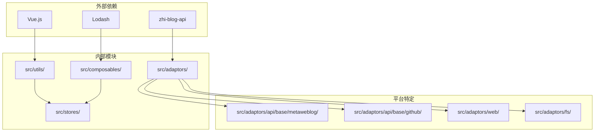

**图表来源**
- [src/adaptors/index.ts:10-18](file://src/adaptors/index.ts#L10-L18)
- [src/adaptors/base/baseExtendApi.ts:10-47](file://src/adaptors/base/baseExtendApi.ts#L10-L47)

**章节来源**
- [src/adaptors/index.ts:10-573](file://src/adaptors/index.ts#L10-L573)
- [src/adaptors/base/baseExtendApi.ts:10-739](file://src/adaptors/base/baseExtendApi.ts#L10-L739)

## 性能考虑
项目在多个层面考虑了性能优化：

### 缓存策略
- 配置缓存：通过 `Adaptors` 类缓存已创建的适配器实例
- 图片处理：使用 `PicgoBridge` 进行批量图片处理
- 日志优化：智能日志级别控制，避免过度输出

### 异步处理
- 批量操作：支持多平台同时发布
- 流式处理：文件上传采用流式处理减少内存占用
- 超时控制：网络请求设置合理的超时时间

### 资源管理
- 连接池：复用HTTP连接
- 内存管理：及时清理临时对象
- 文件系统：使用相对路径减少磁盘IO

## 故障排除指南

### 常见错误类型
项目定义了标准的错误处理机制：

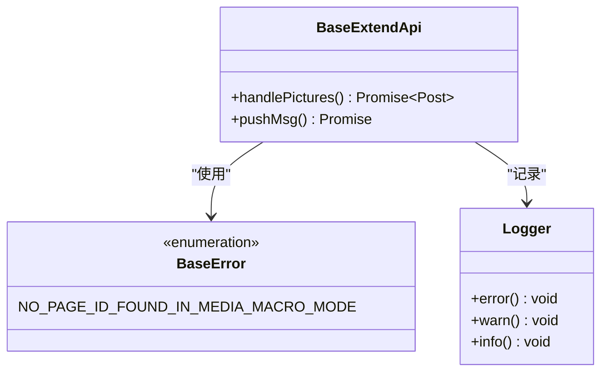

**图表来源**
- [src/utils/BaseErrors.ts:13-21](file://src/utils/BaseErrors.ts#L13-L21)
- [src/adaptors/base/baseExtendApi.ts:535-551](file://src/adaptors/base/baseExtendApi.ts#L535-L551)

### 调试技巧
1. **日志分析**：利用 `createAppLogger` 生成详细的执行日志
2. **断点调试**：在关键方法处设置断点观察变量状态
3. **网络监控**：使用浏览器开发者工具监控API请求
4. **配置验证**：通过 `checkAuth()` 方法验证配置有效性

**章节来源**
- [src/utils/BaseErrors.ts:13-21](file://src/utils/BaseErrors.ts#L13-L21)
- [src/adaptors/base/baseExtendApi.ts:535-551](file://src/adaptors/base/baseExtendApi.ts#L535-L551)

## 结论
本指南提供了完整的适配器开发框架，涵盖了从基础架构到具体实现的各个方面。通过遵循本文档的规范和最佳实践，开发者可以快速构建稳定、高效的平台适配器。项目的设计充分考虑了扩展性和维护性，为未来的功能扩展奠定了坚实基础。

## 附录

### 开发模板

#### 博客平台适配器模板
```typescript
// 1. 创建配置类
class MyBlogConfig extends MetaweblogConfig {
  constructor(/* 参数 */) {
    super(/* 基础配置 */);
    // 平台特有配置
  }
}

// 2. 创建适配器类
class MyBlogApiAdaptor extends MetaweblogBlogApiAdaptor {
  // 实现平台特定方法
  public async getUsersBlogs(): Promise<UserBlog[]> {
    // 实现逻辑
  }
  
  public async newPost(post: Post, publish?: boolean): Promise<string> {
    // 实现逻辑
  }
}
```

#### Web平台适配器模板
```typescript
// 1. 创建配置类
class MyWebConfig extends CommonWebConfig {
  constructor(/* 参数 */) {
    super(/* 基础配置 */);
    // 平台特有配置
  }
}

// 2. 创建适配器类
class MyWebApiAdaptor extends BaseWebApi {
  public async addPost(post: Post): Promise<any> {
    // 实现逻辑
  }
  
  public async uploadFile(mediaObject: MediaObject): Promise<any> {
    // 实现逻辑
  }
}
```

#### 文件系统适配器模板
```typescript
// 1. 创建配置类
class MyFileSystemConfig extends CommonBlogConfig {
  constructor(/* 参数 */) {
    super(/* 基础配置 */);
    this.storePath = /* 存储路径 */;
    this.fsYamlType = FsYamlType.Default;
  }
}

// 2. 创建适配器类
class MyFileSystemApiAdaptor extends BaseBlogApi {
  public getYamlAdaptor(): YamlConvertAdaptor {
    return new LocalSystemYamlConvertAdaptor(this.cfg);
  }
  
  public async newPost(post: Post, publish?: boolean): Promise<string> {
    // 实现逻辑
  }
}
```

### 测试策略

#### 单元测试
```typescript
// 测试适配器配置
describe('MyBlogApiAdaptor', () => {
  it('should initialize config correctly', () => {
    const config = new MyBlogConfig(/* 参数 */);
    expect(config).to.be.instanceOf(MyBlogConfig);
  });
});

// 测试适配器方法
describe('MyBlogApiAdaptor methods', () => {
  it('should handle preEditPost correctly', async () => {
    const adaptor = new MyBlogApiAdaptor(/* 参数 */);
    const result = await adaptor.preEditPost(post);
    expect(result).to.have.property('title');
  });
});
```

#### 集成测试
```typescript
// 测试适配器工厂
describe('Adaptors factory', () => {
  it('should create correct adaptor type', () => {
    const adaptor = Adaptors.getAdaptor('github_hexo-xxxx');
    expect(adaptor).to.be.instanceOf(HexoApiAdaptor);
  });
});
```

#### 端到端测试
```typescript
// 测试完整发布流程
describe('End-to-end publishing', () => {
  it('should publish article to target platform', async () => {
    const result = await publishToPlatform(post, config);
    expect(result).to.have.property('postId');
  });
});
```

### 配置文件编写规范

#### 基础配置要求
1. **必需字段**：`home`、`apiUrl`、`username`、`password`
2. **平台特性**：根据平台特点设置 `pageType`、`passwordType`
3. **功能开关**：合理设置 `tagEnabled`、`cateEnabled` 等开关

#### 高级配置选项
1. **代理设置**：配置 `middlewareUrl` 和 `corsAnywhereUrl`
2. **预览URL**：设置 `previewUrl` 格式
3. **文件命名**：配置 `mdFilenameRule` 规则
4. **图片处理**：设置 `imageStorePath` 和相关参数

### 错误处理机制

#### 标准错误类型
```typescript
enum PlatformError {
  AUTH_FAILED = 'auth_failed',
  NETWORK_ERROR = 'network_error',
  VALIDATION_ERROR = 'validation_error',
  PLATFORM_ERROR = 'platform_error'
}
```

#### 错误恢复策略
1. **重试机制**：对临时性错误实施指数退避重试
2. **降级处理**：在网络异常时使用本地缓存
3. **用户提示**：提供清晰的错误信息和解决方案
4. **日志记录**：详细记录错误上下文便于排查

### 性能优化建议

#### 内存管理
1. **及时释放**：使用完临时对象后及时释放
2. **批量处理**：对大量数据采用分批处理
3. **缓存策略**：合理使用缓存减少重复计算

#### 网络优化
1. **连接复用**：复用HTTP连接池
2. **压缩传输**：启用GZIP压缩
3. **并发控制**：限制同时进行的网络请求数量

#### 文件系统优化
1. **异步IO**：使用异步文件操作
2. **路径缓存**：缓存常用路径信息
3. **增量更新**：只更新变化的部分