# 适配器模式设计

<cite>
**本文档引用的文件**
- [src/adaptors/base/baseExtendApi.ts](file://src/adaptors/base/baseExtendApi.ts)
- [src/adaptors/index.ts](file://src/adaptors/index.ts)
- [src/platforms/dynamicConfig.ts](file://src/platforms/dynamicConfig.ts)
- [src/adaptors/api/base/baseBlogApi.ts](file://src/adaptors/api/base/baseBlogApi.ts)
- [src/adaptors/web/base/baseWebApi.ts](file://src/adaptors/web/base/baseWebApi.ts)
- [src/adaptors/api/hexo/hexoApiAdaptor.ts](file://src/adaptors/api/hexo/hexoApiAdaptor.ts)
- [src/adaptors/web/zhihu/zhihuWebAdaptor.ts](file://src/adaptors/web/zhihu/zhihuWebAdaptor.ts)
- [src/adaptors/fs/LocalSystem/LocalSystemApiAdaptor.ts](file://src/adaptors/fs/LocalSystem/LocalSystemApiAdaptor.ts)
- [src/adaptors/api/hexo/useHexoApi.ts](file://src/adaptors/api/hexo/useHexoApi.ts)
- [src/adaptors/web/zhihu/useZhihuWeb.ts](file://src/adaptors/web/zhihu/useZhihuWeb.ts)
</cite>

## 目录
1. [引言](#引言)
2. [项目结构](#项目结构)
3. [核心组件](#核心组件)
4. [架构概览](#架构概览)
5. [详细组件分析](#详细组件分析)
6. [依赖关系分析](#依赖关系分析)
7. [性能考虑](#性能考虑)
8. [故障排除指南](#故障排除指南)
9. [结论](#结论)
10. [附录](#附录)

## 引言

思源笔记发布器插件采用适配器模式设计，通过统一接口支持20+个不同平台的发布需求。该设计的核心理念是将复杂的平台差异性封装在适配器内部，为上层提供一致的发布体验。

适配器模式在此项目中的应用体现在三个关键层面：
- **统一抽象层**：BaseExtendApi提供所有平台共享的基础功能
- **平台特化层**：各平台适配器实现特定的发布逻辑
- **动态调度层**：Adaptors类负责平台识别和适配器选择

## 项目结构

项目采用模块化的适配器架构，主要分为以下几个层次：

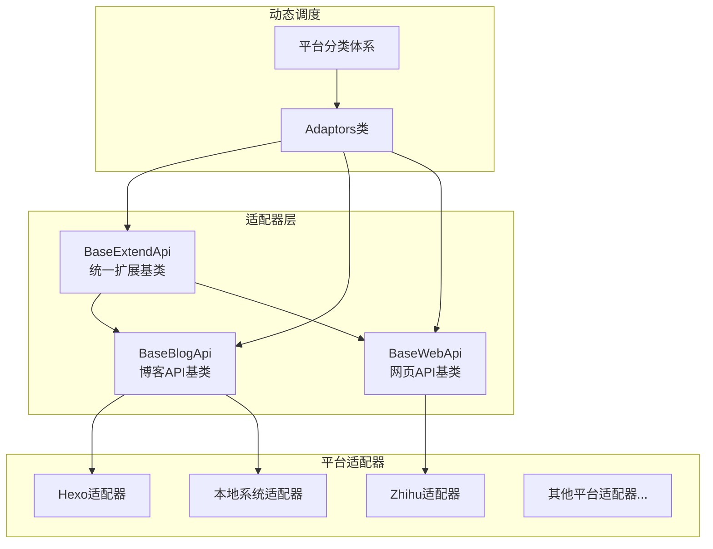

**图表来源**
- [src/adaptors/base/baseExtendApi.ts:55-80](file://src/adaptors/base/baseExtendApi.ts#L55-L80)
- [src/adaptors/index.ts:56-263](file://src/adaptors/index.ts#L56-L263)
- [src/platforms/dynamicConfig.ts:174-238](file://src/platforms/dynamicConfig.ts#L174-L238)

**章节来源**
- [src/adaptors/base/baseExtendApi.ts:1-739](file://src/adaptors/base/baseExtendApi.ts#L1-L739)
- [src/adaptors/index.ts:1-573](file://src/adaptors/index.ts#L1-L573)
- [src/platforms/dynamicConfig.ts:1-534](file://src/platforms/dynamicConfig.ts#L1-L534)

## 核心组件

### BaseExtendApi - 统一扩展基类

BaseExtendApi是整个适配器体系的核心，它继承自WebApi接口，实现了IBlogApi和IWebApi两个接口，为所有平台提供统一的基础功能。

#### 核心设计理念

1. **职责分离**：将通用的发布预处理逻辑与平台特定逻辑分离
2. **可扩展性**：通过组合模式支持YAML转换器和图片处理服务
3. **统一接口**：为所有平台提供一致的方法签名

#### 核心方法定义

BaseExtendApi提供了完整的发布预处理流程：

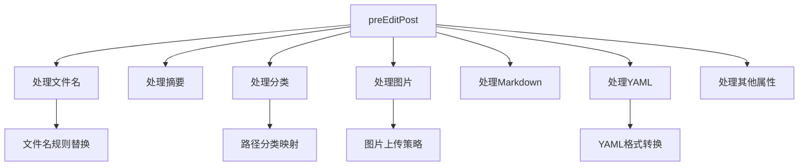

**图表来源**
- [src/adaptors/base/baseExtendApi.ts:90-106](file://src/adaptors/base/baseExtendApi.ts#L90-L106)
- [src/adaptors/base/baseExtendApi.ts:150-211](file://src/adaptors/base/baseExtendApi.ts#L150-L211)
- [src/adaptors/base/baseExtendApi.ts:240-281](file://src/adaptors/base/baseExtendApi.ts#L240-L281)
- [src/adaptors/base/baseExtendApi.ts:466-596](file://src/adaptors/base/baseExtendApi.ts#L466-L596)
- [src/adaptors/base/baseExtendApi.ts:360-456](file://src/adaptors/base/baseExtendApi.ts#L360-L456)

#### 关键特性

1. **智能文件名处理**：支持多种占位符规则（[filename]、[slug]、[yyyy]、[mm]、[dd]）
2. **分类路径映射**：自动将思源笔记层级转换为平台分类
3. **图片处理策略**：支持PicGO和平台内置两种图片上传方式
4. **YAML转换引擎**：根据平台类型动态选择合适的YAML转换器

**章节来源**
- [src/adaptors/base/baseExtendApi.ts:55-80](file://src/adaptors/base/baseExtendApi.ts#L55-L80)
- [src/adaptors/base/baseExtendApi.ts:90-106](file://src/adaptors/base/baseExtendApi.ts#L90-L106)
- [src/adaptors/base/baseExtendApi.ts:150-211](file://src/adaptors/base/baseExtendApi.ts#L150-L211)
- [src/adaptors/base/baseExtendApi.ts:240-281](file://src/adaptors/base/baseExtendApi.ts#L240-L281)
- [src/adaptors/base/baseExtendApi.ts:466-596](file://src/adaptors/base/baseExtendApi.ts#L466-L596)
- [src/adaptors/base/baseExtendApi.ts:360-456](file://src/adaptors/base/baseExtendApi.ts#L360-L456)

## 架构概览

### 平台分类体系

项目采用多层分类体系来组织20+个支持的平台：

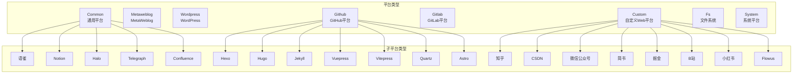

**图表来源**
- [src/platforms/dynamicConfig.ts:126-166](file://src/platforms/dynamicConfig.ts#L126-L166)
- [src/platforms/dynamicConfig.ts:174-238](file://src/platforms/dynamicConfig.ts#L174-L238)

### 适配器注册机制

Adaptors类实现了统一的适配器注册和动态加载机制：

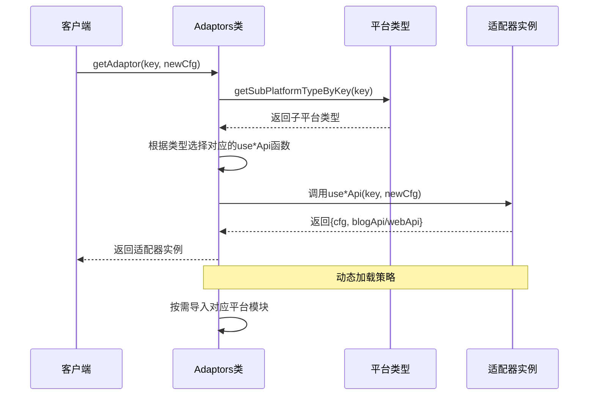

**图表来源**
- [src/adaptors/index.ts:271-467](file://src/adaptors/index.ts#L271-L467)
- [src/platforms/dynamicConfig.ts:397-418](file://src/platforms/dynamicConfig.ts#L397-L418)

**章节来源**
- [src/adaptors/index.ts:56-263](file://src/adaptors/index.ts#L56-L263)
- [src/adaptors/index.ts:271-467](file://src/adaptors/index.ts#L271-L467)
- [src/platforms/dynamicConfig.ts:397-418](file://src/platforms/dynamicConfig.ts#L397-L418)

## 详细组件分析

### API适配器基类

#### BaseBlogApi - 博客API基类

BaseBlogApi继承自BlogApi，为所有基于API的平台提供统一的基础设施：

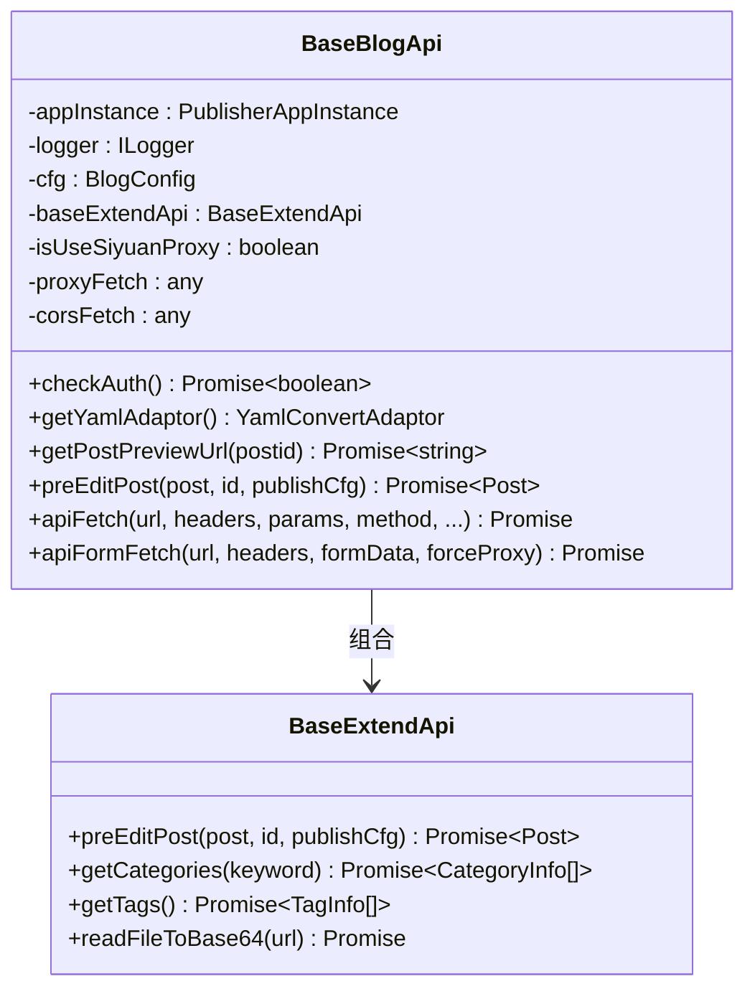

**图表来源**
- [src/adaptors/api/base/baseBlogApi.ts:27-54](file://src/adaptors/api/base/baseBlogApi.ts#L27-L54)
- [src/adaptors/base/baseExtendApi.ts:55-80](file://src/adaptors/base/baseExtendApi.ts#L55-L80)

#### BaseWebApi - 网页API基类

BaseWebApi为基于网页授权的平台提供统一的API访问能力：

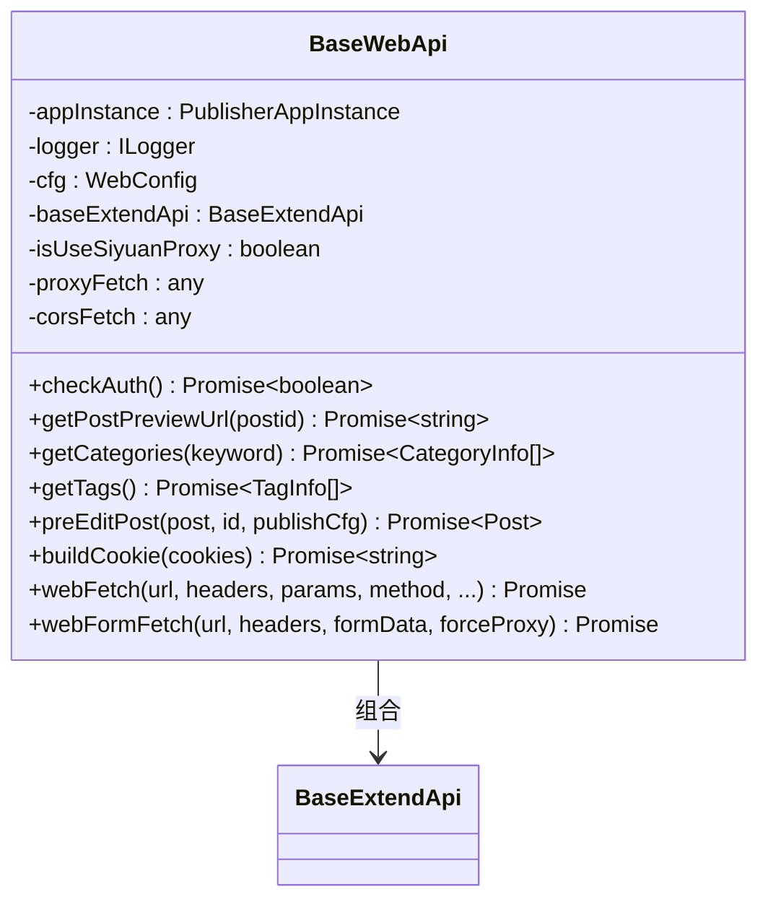

**图表来源**
- [src/adaptors/web/base/baseWebApi.ts:36-63](file://src/adaptors/web/base/baseWebApi.ts#L36-L63)
- [src/adaptors/base/baseExtendApi.ts:55-80](file://src/adaptors/base/baseExtendApi.ts#L55-L80)

**章节来源**
- [src/adaptors/api/base/baseBlogApi.ts:27-54](file://src/adaptors/api/base/baseBlogApi.ts#L27-L54)
- [src/adaptors/web/base/baseWebApi.ts:36-63](file://src/adaptors/web/base/baseWebApi.ts#L36-L63)

### 具体适配器实现

#### Hexo适配器

Hexo适配器展示了如何扩展BaseBlogApi来实现特定平台的功能：

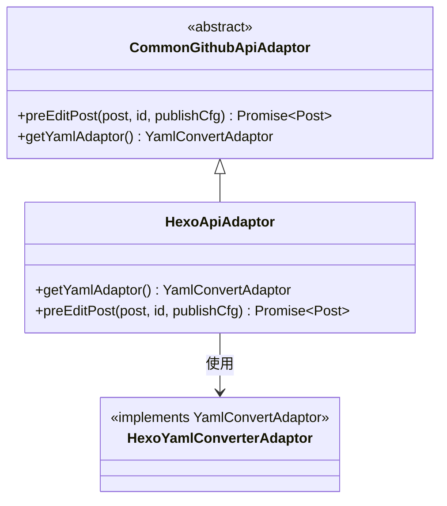

**图表来源**
- [src/adaptors/api/hexo/hexoApiAdaptor.ts:23-26](file://src/adaptors/api/hexo/hexoApiAdaptor.ts#L23-L26)

Hexo适配器的关键特性：
1. **YAML转换器集成**：使用专门的HexoYamlConverterAdaptor处理Front Matter
2. **Markdown预处理**：提取并重组Front Matter和正文内容
3. **平台特定逻辑**：在super.preEditPost基础上添加Hexo特有的处理步骤

**章节来源**
- [src/adaptors/api/hexo/hexoApiAdaptor.ts:23-60](file://src/adaptors/api/hexo/hexoApiAdaptor.ts#L23-L60)

#### 知乎网页适配器

ZhihuWebAdaptor展示了复杂网页授权场景下的适配器实现：

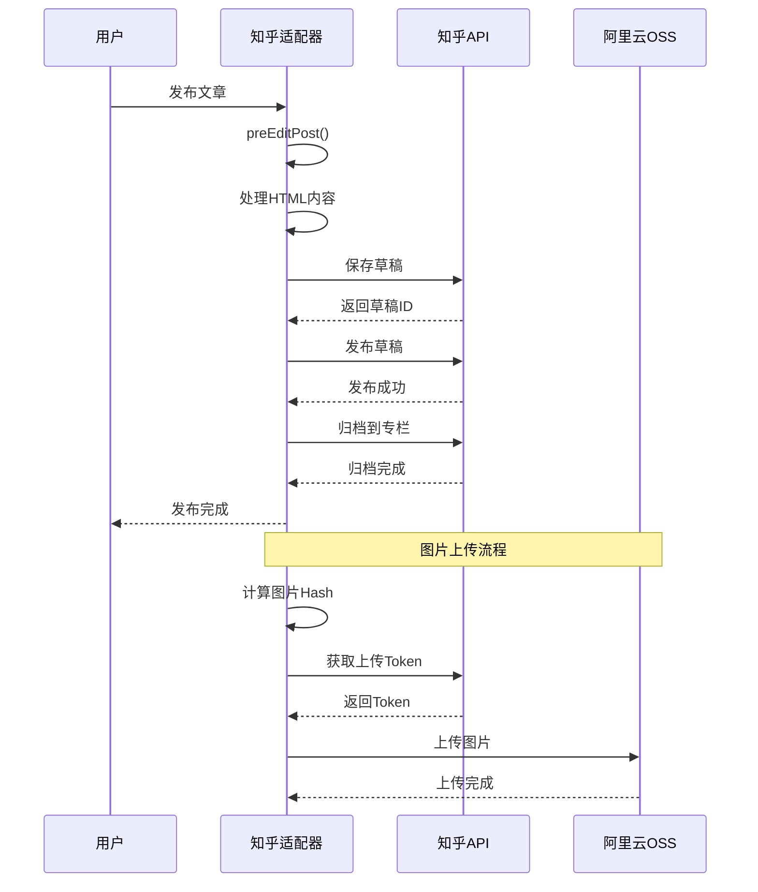

**图表来源**
- [src/adaptors/web/zhihu/zhihuWebAdaptor.ts:131-165](file://src/adaptors/web/zhihu/zhihuWebAdaptor.ts#L131-L165)
- [src/adaptors/web/zhihu/zhihuWebAdaptor.ts:268-320](file://src/adaptors/web/zhihu/zhihuWebAdaptor.ts#L268-L320)

知乎适配器的复杂特性：
1. **多步骤发布流程**：草稿保存 → 发布 → 归档到专栏
2. **图片上传策略**：支持直接上传和OSS中转两种方式
3. **Cookie管理**：通过buildCookie方法处理会话状态
4. **专栏管理**：支持文章归档到不同专栏

**章节来源**
- [src/adaptors/web/zhihu/zhihuWebAdaptor.ts:29-129](file://src/adaptors/web/zhihu/zhihuWebAdaptor.ts#L29-L129)
- [src/adaptors/web/zhihu/zhihuWebAdaptor.ts:131-220](file://src/adaptors/web/zhihu/zhihuWebAdaptor.ts#L131-L220)
- [src/adaptors/web/zhihu/zhihuWebAdaptor.ts:268-320](file://src/adaptors/web/zhihu/zhihuWebAdaptor.ts#L268-L320)

#### 本地系统适配器

LocalSystemApiAdaptor展示了文件系统平台的适配器实现：

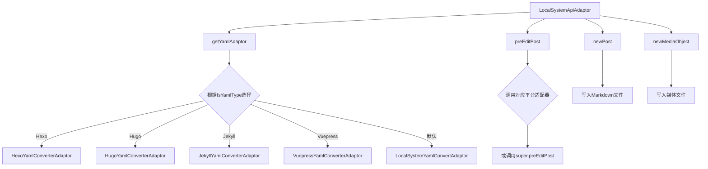

**图表来源**
- [src/adaptors/fs/LocalSystem/LocalSystemApiAdaptor.ts:70-104](file://src/adaptors/fs/LocalSystem/LocalSystemApiAdaptor.ts#L70-L104)
- [src/adaptors/fs/LocalSystem/LocalSystemApiAdaptor.ts:106-164](file://src/adaptors/fs/LocalSystem/LocalSystemApiAdaptor.ts#L106-L164)

本地系统适配器的特色功能：
1. **动态YAML适配器选择**：根据fsYamlType自动选择合适的YAML处理器
2. **平台适配器委托**：将具体平台的预处理逻辑委托给对应的平台适配器
3. **文件系统操作**：直接进行文件读写操作
4. **路径自动管理**：支持自动分类路径替换

**章节来源**
- [src/adaptors/fs/LocalSystem/LocalSystemApiAdaptor.ts:42-104](file://src/adaptors/fs/LocalSystem/LocalSystemApiAdaptor.ts#L42-L104)
- [src/adaptors/fs/LocalSystem/LocalSystemApiAdaptor.ts:106-164](file://src/adaptors/fs/LocalSystem/LocalSystemApiAdaptor.ts#L106-L164)
- [src/adaptors/fs/LocalSystem/LocalSystemApiAdaptor.ts:166-270](file://src/adaptors/fs/LocalSystem/LocalSystemApiAdaptor.ts#L166-L270)

### 配置和使用示例

#### useHexoApi - Hexo平台配置

useHexoApi展示了平台配置的最佳实践：

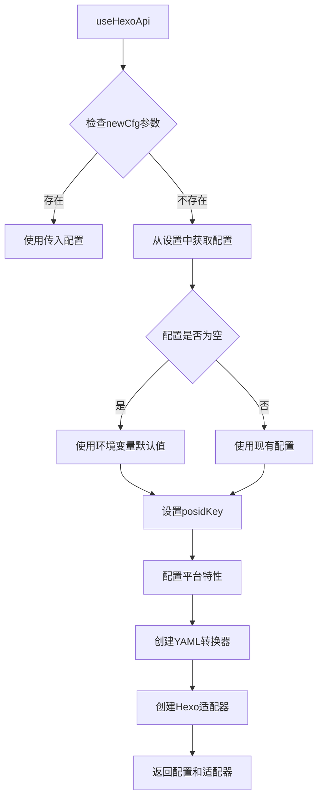

**图表来源**
- [src/adaptors/api/hexo/useHexoApi.ts:22-99](file://src/adaptors/api/hexo/useHexoApi.ts#L22-L99)

配置管理的关键点：
1. **优先级策略**：newCfg > 设置配置 > 环境变量
2. **平台特性配置**：标签、分类、知识空间等平台特定设置
3. **默认值处理**：确保必要的配置项都有合理的默认值

**章节来源**
- [src/adaptors/api/hexo/useHexoApi.ts:22-99](file://src/adaptors/api/hexo/useHexoApi.ts#L22-L99)

#### useZhihuWeb - 网页授权配置

useZhihuWeb展示了网页授权平台的配置模式：

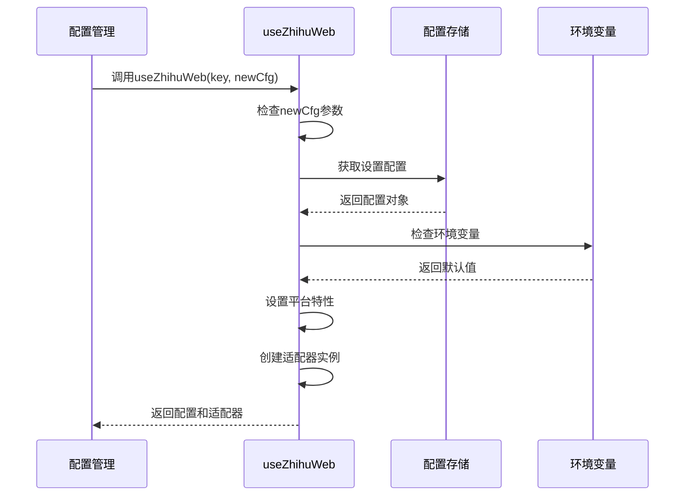

**图表来源**
- [src/adaptors/web/zhihu/useZhihuWeb.ts:25-89](file://src/adaptors/web/zhihu/useZhihuWeb.ts#L25-L89)

**章节来源**
- [src/adaptors/web/zhihu/useZhihuWeb.ts:25-89](file://src/adaptors/web/zhihu/useZhihuWeb.ts#L25-L89)

## 依赖关系分析

### 组件耦合度分析

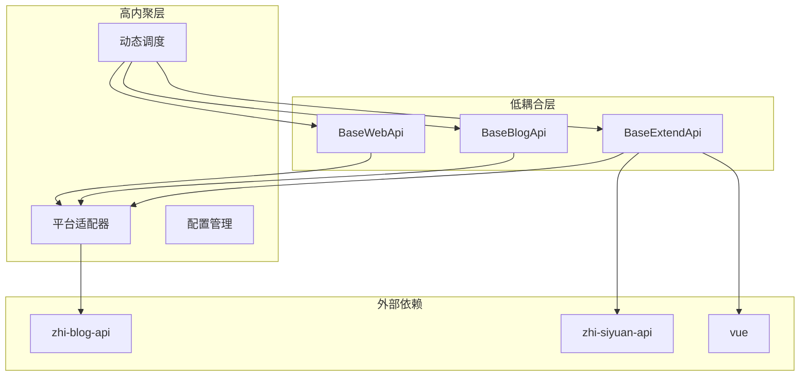

**图表来源**
- [src/adaptors/base/baseExtendApi.ts:10-47](file://src/adaptors/base/baseExtendApi.ts#L10-L47)
- [src/adaptors/index.ts:10-18](file://src/adaptors/index.ts#L10-L18)

### 依赖注入和控制反转

项目广泛使用依赖注入模式来实现松耦合：

1. **构造函数注入**：所有适配器都通过构造函数接收依赖
2. **工厂模式**：Adaptors类充当适配器工厂
3. **策略模式**：YAML转换器根据平台类型动态选择

**章节来源**
- [src/adaptors/base/baseExtendApi.ts:69-80](file://src/adaptors/base/baseExtendApi.ts#L69-L80)
- [src/adaptors/index.ts:56-263](file://src/adaptors/index.ts#L56-L263)

## 性能考虑

### 异步处理优化

1. **批量图片处理**：支持并发上传多个图片资源
2. **懒加载策略**：按需导入平台模块，减少初始加载时间
3. **缓存机制**：利用平台元数据缓存减少重复请求

### 内存管理

1. **流式处理**：大文件上传使用流式处理避免内存溢出
2. **及时释放**：异步操作完成后及时清理临时资源
3. **分页加载**：支持大数据集的分页处理

## 故障排除指南

### 常见问题及解决方案

#### 图片上传失败

**问题现象**：图片无法上传到目标平台

**排查步骤**：
1. 检查网络连接和代理设置
2. 验证平台API密钥有效性
3. 确认图片格式和大小限制
4. 查看详细的错误日志

**解决方案**：
- 切换到备用上传策略
- 调整图片压缩参数
- 检查平台配额限制

#### YAML转换错误

**问题现象**：YAML格式转换失败或内容丢失

**排查步骤**：
1. 验证原始YAML格式正确性
2. 检查平台特定的YAML语法要求
3. 确认YAML转换器版本兼容性

**解决方案**：
- 使用默认YAML转换器回退
- 手动修复YAML格式问题
- 更新平台适配器版本

**章节来源**
- [src/adaptors/base/baseExtendApi.ts:535-551](file://src/adaptors/base/baseExtendApi.ts#L535-L551)
- [src/adaptors/base/baseExtendApi.ts:443-452](file://src/adaptors/base/baseExtendApi.ts#L443-L452)

## 结论

思源笔记发布器插件的适配器模式设计成功实现了以下目标：

1. **统一抽象**：通过BaseExtendApi提供一致的发布接口
2. **灵活扩展**：支持20+个不同平台的快速集成
3. **代码复用**：大量通用逻辑在基类中实现
4. **易于维护**：清晰的层次结构和职责分离

该设计模式为未来的平台扩展奠定了坚实基础，任何新平台都可以通过继承相应的基类并实现特定逻辑来快速接入系统。

## 附录

### 开发规范和最佳实践

#### 适配器开发规范

1. **继承层次**：必须继承相应的基类（BaseBlogApi或BaseWebApi）
2. **接口实现**：至少实现preEditPost、newPost、editPost、deletePost方法
3. **配置管理**：提供use*Api函数进行配置初始化
4. **错误处理**：实现完整的异常处理和错误恢复机制

#### 配置管理最佳实践

1. **优先级策略**：newCfg > 设置配置 > 环境变量
2. **默认值设置**：为所有必需配置提供合理默认值
3. **验证机制**：在初始化时验证配置的有效性
4. **持久化存储**：使用配置存储管理用户设置

#### API调用模式

1. **代理模式**：统一使用apiFetch或webFetch进行网络请求
2. **超时处理**：为所有异步操作设置合理的超时时间
3. **重试机制**：对临时性错误实现自动重试
4. **日志记录**：详细记录API调用过程便于调试