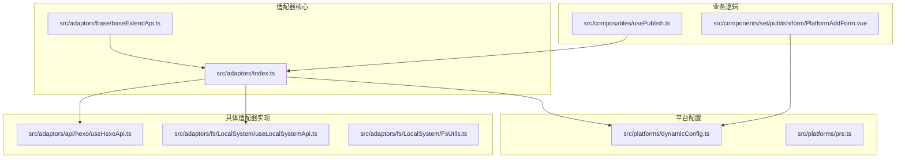
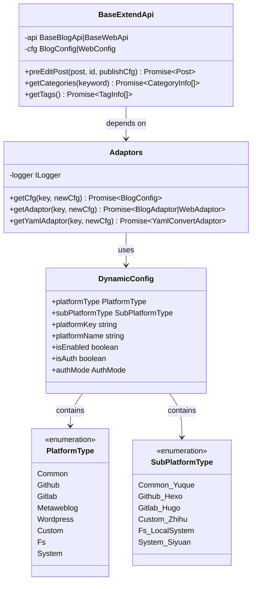
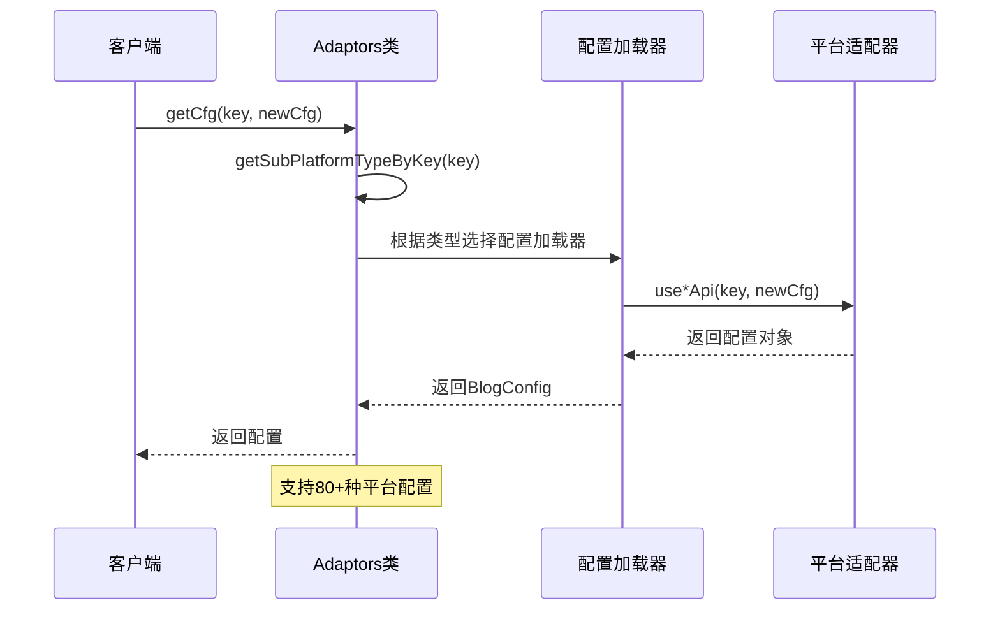
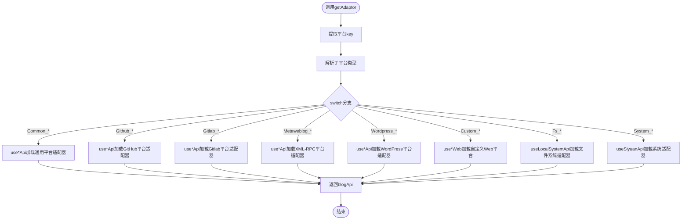
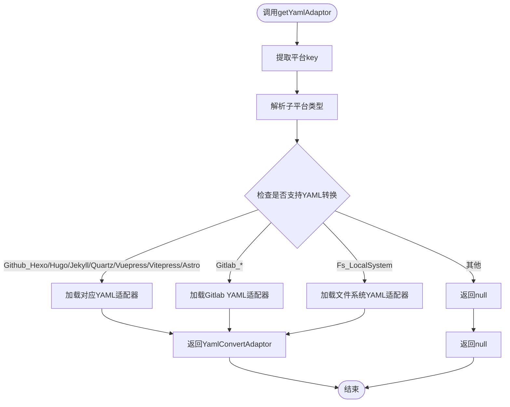
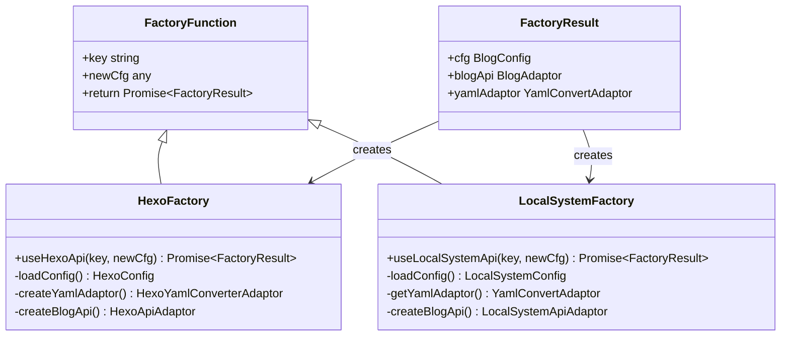
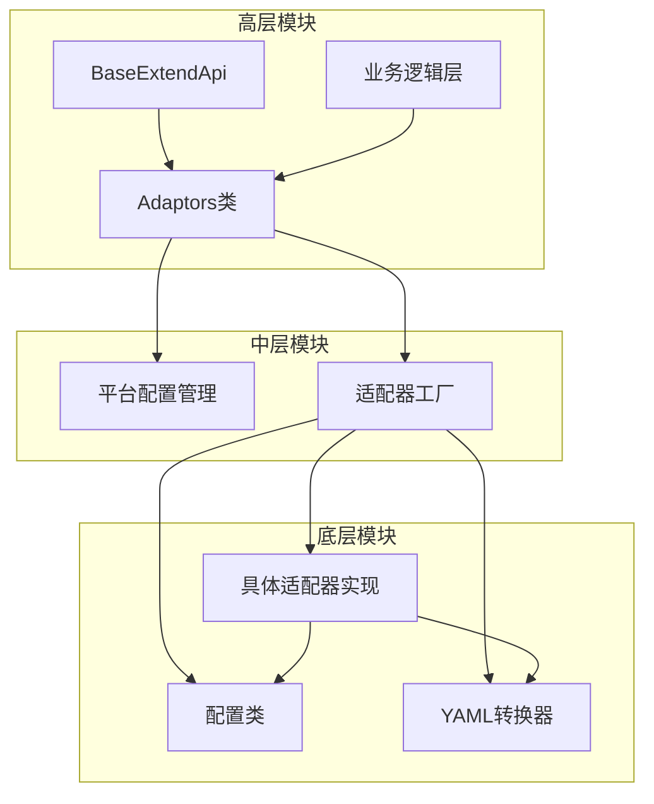

# 适配器注册机制

<cite>
**本文档引用的文件**
- [src/adaptors/index.ts](file://src/adaptors/index.ts)
- [src/platforms/dynamicConfig.ts](file://src/platforms/dynamicConfig.ts)
- [src/adaptors/base/baseExtendApi.ts](file://src/adaptors/base/baseExtendApi.ts)
- [src/adaptors/api/hexo/useHexoApi.ts](file://src/adaptors/api/hexo/useHexoApi.ts)
- [src/adaptors/fs/LocalSystem/useLocalSystemApi.ts](file://src/adaptors/fs/LocalSystem/useLocalSystemApi.ts)
- [src/adaptors/fs/LocalSystem/FsUtils.ts](file://src/adaptors/fs/LocalSystem/FsUtils.ts)
- [src/composables/usePublish.ts](file://src/composables/usePublish.ts)
- [src/platforms/pre.ts](file://src/platforms/pre.ts)
- [src/components/set/publish/form/PlatformAddForm.vue](file://src/components/set/publish/form/PlatformAddForm.vue)
- [docs/插件开发.md](file://docs/插件开发.md)
</cite>

## 目录
1. [简介](#简介)
2. [项目结构](#项目结构)
3. [核心组件](#核心组件)
4. [架构概览](#架构概览)
5. [详细组件分析](#详细组件分析)
6. [依赖关系分析](#依赖关系分析)
7. [性能考虑](#性能考虑)
8. [故障排除指南](#故障排除指南)
9. [结论](#结论)

## 简介

适配器注册机制是本项目的核心架构组件，负责统一管理和调度各种平台的适配器。该机制通过Adaptors类提供统一入口，实现了基于平台key的动态适配器选择和工厂模式的应用。

该系统支持多种平台类型，包括通用平台、GitHub平台、Gitlab平台、Metaweblog平台、WordPress平台、自定义平台和文件系统平台。每个平台都有其特定的适配器实现，通过统一的注册机制进行管理。

## 项目结构

项目采用模块化的组织方式，适配器相关的核心文件分布如下：

**图表来源**
- [src/adaptors/index.ts:55-572](file://src/adaptors/index.ts#L55-L572)
- [src/platforms/dynamicConfig.ts:13-534](file://src/platforms/dynamicConfig.ts#L13-L534)

**章节来源**
- [src/adaptors/index.ts:1-573](file://src/adaptors/index.ts#L1-L573)
- [src/platforms/dynamicConfig.ts:1-534](file://src/platforms/dynamicConfig.ts#L1-L534)

## 核心组件

### Adaptors类

Adaptors类是适配器注册机制的核心，提供了三个关键方法：

1. **getConfig**: 返回平台配置对象
2. **getAdaptor**: 返回主适配器实例
3. **getYamlAdaptor**: 返回YAML转换适配器

这些方法都采用异步实现，支持动态加载和工厂模式。

**章节来源**
- [src/adaptors/index.ts:56-572](file://src/adaptors/index.ts#L56-L572)

### 平台类型系统

系统定义了完整的平台类型枚举，包括：

- **Common**: 通用平台（语雀、Notion、Halo等）
- **Github**: GitHub托管平台（Hexo、Hugo、Jekyll等）
- **Gitlab**: Gitlab托管平台
- **Metaweblog**: XML-RPC协议平台
- **Wordpress**: WordPress平台
- **Custom**: 自定义Web平台
- **Fs**: 文件系统平台
- **System**: 系统内置平台

**章节来源**
- [src/platforms/dynamicConfig.ts:126-238](file://src/platforms/dynamicConfig.ts#L126-L238)

## 架构概览

适配器注册机制采用工厂模式和策略模式相结合的设计：

**图表来源**
- [src/adaptors/index.ts:56-572](file://src/adaptors/index.ts#L56-L572)
- [src/platforms/dynamicConfig.ts:13-113](file://src/platforms/dynamicConfig.ts#L13-L113)
- [src/adaptors/base/baseExtendApi.ts:55-80](file://src/adaptors/base/baseExtendApi.ts#L55-L80)

## 详细组件分析

### getConfig方法实现

getConfig方法实现了平台配置的动态加载：

**图表来源**
- [src/adaptors/index.ts:65-263](file://src/adaptors/index.ts#L65-L263)
- [src/platforms/dynamicConfig.ts:397-418](file://src/platforms/dynamicConfig.ts#L397-L418)

### getAdaptor方法实现

getAdaptor方法负责返回主适配器实例：

**图表来源**
- [src/adaptors/index.ts:271-467](file://src/adaptors/index.ts#L271-L467)

### getYamlAdaptor方法实现

getYamlAdaptor方法专门处理YAML转换适配器：

**图表来源**
- [src/adaptors/index.ts:475-569](file://src/adaptors/index.ts#L475-L569)

**章节来源**
- [src/adaptors/index.ts:65-569](file://src/adaptors/index.ts#L65-L569)

### 工厂模式应用

每个平台都有对应的工厂函数，如useHexoApi、useLocalSystemApi等：

**图表来源**
- [src/adaptors/api/hexo/useHexoApi.ts:22-99](file://src/adaptors/api/hexo/useHexoApi.ts#L22-L99)
- [src/adaptors/fs/LocalSystem/useLocalSystemApi.ts:27-62](file://src/adaptors/fs/LocalSystem/useLocalSystemApi.ts#L27-L62)

**章节来源**
- [src/adaptors/api/hexo/useHexoApi.ts:1-102](file://src/adaptors/api/hexo/useHexoApi.ts#L1-L102)
- [src/adaptors/fs/LocalSystem/useLocalSystemApi.ts:1-65](file://src/adaptors/fs/LocalSystem/useLocalSystemApi.ts#L1-L65)

### 动态加载策略

系统采用按需动态加载策略：

1. **延迟加载**: 仅在需要时才加载特定平台的适配器
2. **缓存机制**: 加载后的适配器实例会被缓存复用
3. **错误处理**: 加载失败时提供降级方案
4. **类型安全**: 通过TypeScript确保编译时类型检查

**章节来源**
- [src/adaptors/index.ts:67-68](file://src/adaptors/index.ts#L67-L68)
- [src/platforms/dynamicConfig.ts:397-418](file://src/platforms/dynamicConfig.ts#L397-L418)

## 依赖关系分析

### 组件耦合度

**图表来源**
- [src/adaptors/index.ts:10-49](file://src/adaptors/index.ts#L10-L49)
- [src/adaptors/base/baseExtendApi.ts:10-47](file://src/adaptors/base/baseExtendApi.ts#L10-L47)

### 关键依赖关系

1. **Adaptors → dynamicConfig**: 依赖平台类型解析
2. **Adaptors → use*Api**: 依赖具体适配器工厂
3. **BaseExtendApi → Adaptors**: 依赖适配器获取
4. **use*Api → 配置类**: 依赖配置管理
5. **use*Api → 适配器类**: 依赖具体实现

**章节来源**
- [src/adaptors/index.ts:10-49](file://src/adaptors/index.ts#L10-L49)
- [src/adaptors/base/baseExtendApi.ts:10-47](file://src/adaptors/base/baseExtendApi.ts#L10-L47)

## 性能考虑

### 加载性能优化

1. **异步加载**: 所有适配器采用异步加载，避免阻塞主线程
2. **按需加载**: 仅加载当前使用的平台适配器
3. **缓存策略**: 加载后的适配器实例缓存复用
4. **内存管理**: 及时释放不再使用的适配器实例

### 内存使用优化

- **轻量级配置**: 配置对象只包含必要信息
- **延迟初始化**: 适配器实例在首次使用时创建
- **垃圾回收**: 及时清理临时对象和闭包

## 故障排除指南

### 常见问题及解决方案

1. **平台key无效**
   - 检查平台key格式是否正确
   - 验证平台类型枚举是否存在
   - 查看动态配置是否正确

2. **适配器加载失败**
   - 检查网络连接状态
   - 验证配置参数完整性
   - 查看错误日志获取详细信息

3. **YAML转换异常**
   - 确认平台是否支持YAML转换
   - 检查YAML适配器是否正确加载
   - 验证YAML格式兼容性

**章节来源**
- [src/adaptors/index.ts:561-563](file://src/adaptors/index.ts#L561-L563)
- [src/platforms/dynamicConfig.ts:404-417](file://src/platforms/dynamicConfig.ts#L404-L417)

### 错误处理策略

系统采用多层次的错误处理机制：

1. **类型验证**: 运行前验证平台key和类型
2. **降级处理**: 适配器加载失败时返回null
3. **日志记录**: 详细的错误日志便于调试
4. **用户提示**: 友好的错误信息反馈

**章节来源**
- [src/adaptors/index.ts:560-565](file://src/adaptors/index.ts#L560-L565)

## 结论

适配器注册机制通过Adaptors类实现了高度模块化和可扩展的架构设计。该机制的主要优势包括：

1. **统一入口**: 通过静态方法提供统一的适配器访问接口
2. **动态加载**: 支持按需加载，提高系统启动性能
3. **类型安全**: 完整的TypeScript类型定义确保编译时安全
4. **易于扩展**: 新平台的添加只需实现相应的工厂函数
5. **错误处理**: 完善的错误处理和降级机制

该机制为80多个平台提供了统一的适配器管理方案，支持从简单的文件系统到复杂的云平台的各种发布需求。通过工厂模式和策略模式的结合，系统既保持了高度的灵活性，又确保了良好的性能和稳定性。

对于新平台的集成，开发者只需要遵循既定的开发规范，实现相应的配置类、适配器类和工厂函数，即可快速集成到现有的适配器注册机制中。