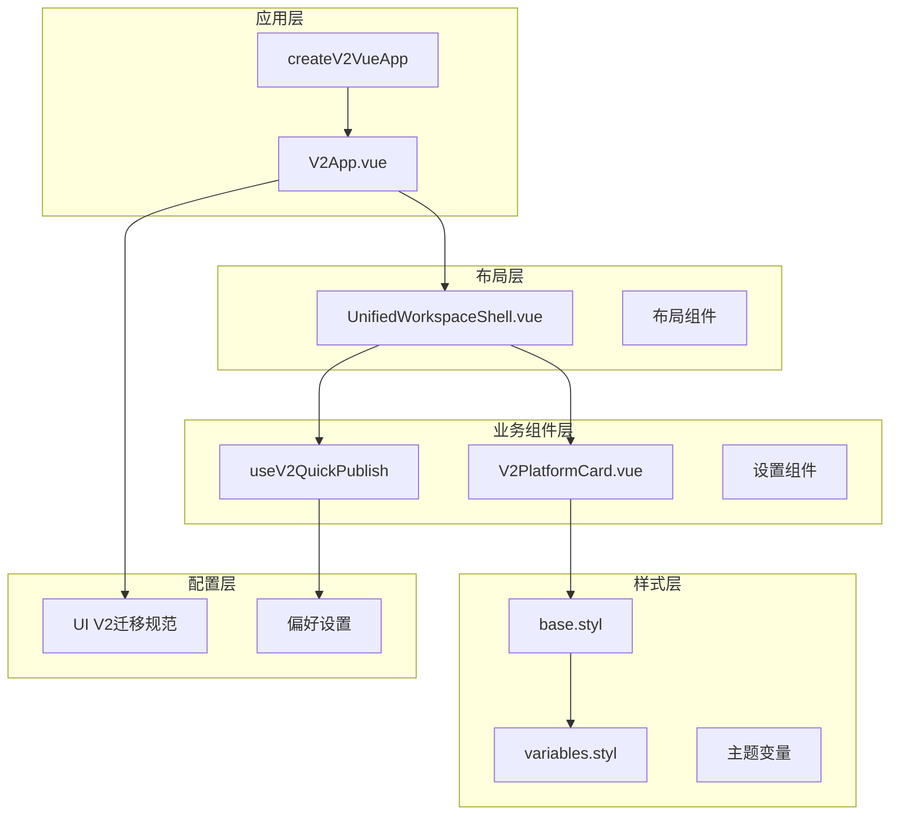
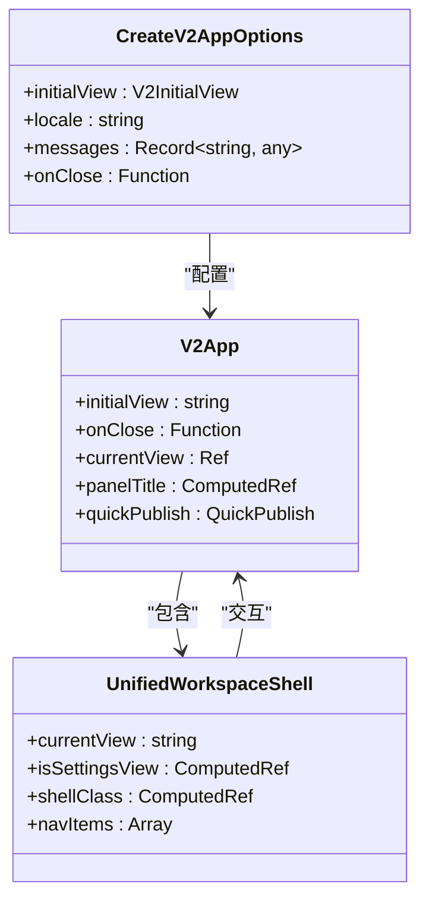
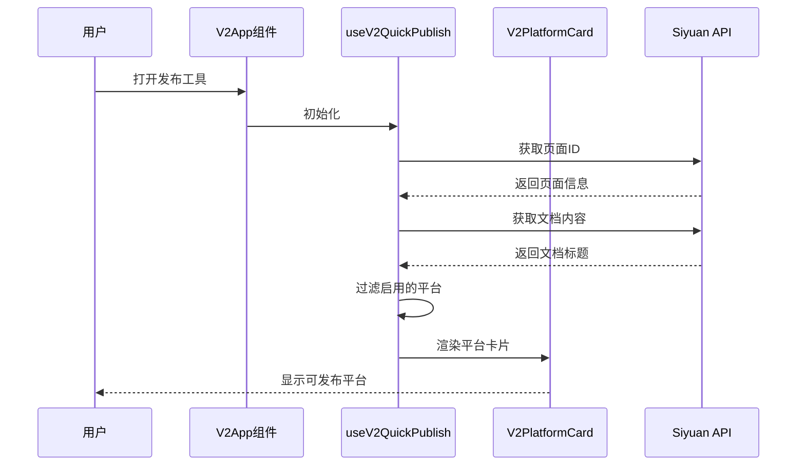
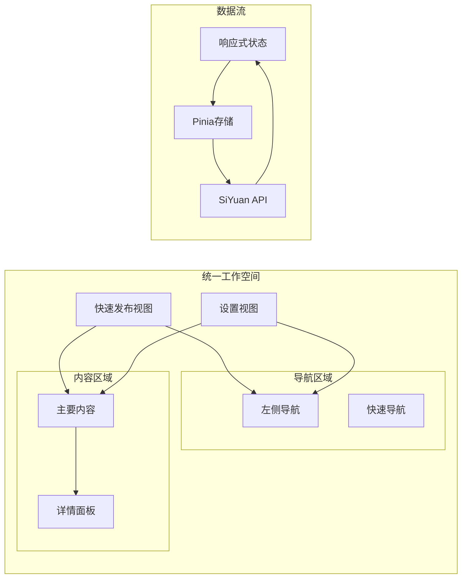
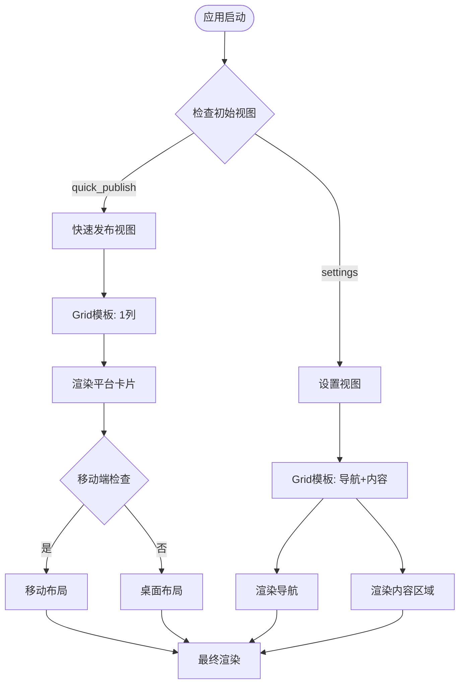
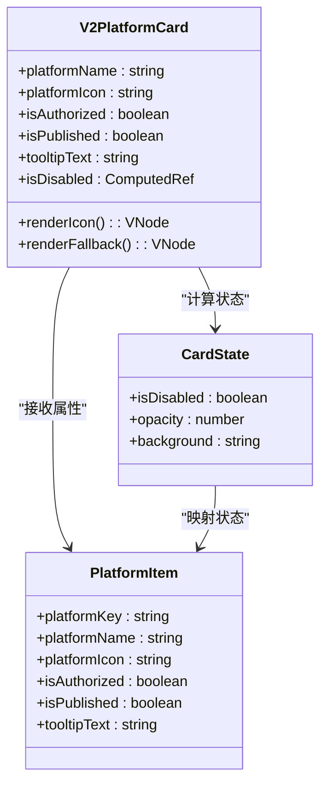
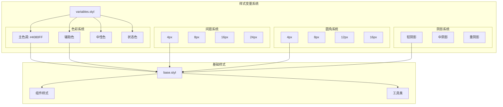
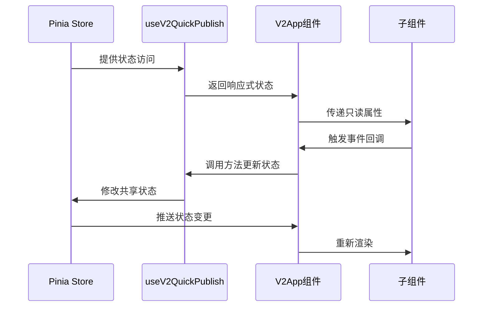
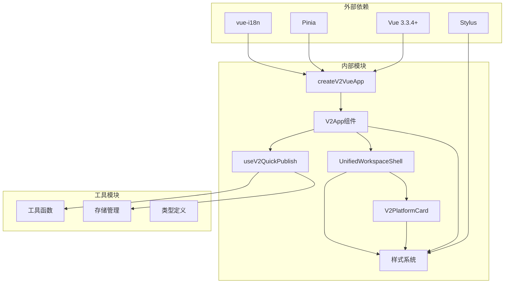

# UI V2 设计原则

<cite>
**本文档引用的文件**
- [createV2App.ts](file://src/v2/createV2App.ts)
- [V2App.vue](file://src/components/v2/V2App.vue)
- [UnifiedWorkspaceShell.vue](file://src/components/v2/layout/UnifiedWorkspaceShell.vue)
- [V2PlatformCard.vue](file://src/components/v2/publish/V2PlatformCard.vue)
- [useV2QuickPublish.ts](file://src/composables/v2/useV2QuickPublish.ts)
- [base.styl](file://src/assets/v2/base.styl)
- [variables.styl](file://src/assets/v2/variables.styl)
- [ui-v2-migration/spec.md](file://openspec/changes/refactor-ui-v2-foundation/specs/ui-v2-migration/spec.md)
- [README_zh_CN.md](file://README_zh_CN.md)
- [style.css](file://src/assets/style.css)
</cite>

## 目录
1. [引言](#引言)
2. [项目结构](#项目结构)
3. [核心组件](#核心组件)
4. [架构概览](#架构概览)
5. [详细组件分析](#详细组件分析)
6. [依赖关系分析](#依赖关系分析)
7. [性能考虑](#性能考虑)
8. [故障排除指南](#故障排除指南)
9. [结论](#结论)

## 引言

UI V2 设计原则是思源笔记发布工具插件的重要升级项目，旨在提供现代化、高效且用户友好的发布体验。该设计原则基于完整的生命周期管理理念，强调从传统iframe托管模式向真实DOM挂载的迁移，同时保持与现有系统的兼容性和回滚能力。

该项目的核心目标是通过统一的工作空间壳层实现快速发布和完整设置工作流的无缝切换，同时优先使用思源笔记原生UI和样式基元，避免引入新的通用组件层。

## 项目结构

UI V2项目的整体架构采用模块化设计，主要包含以下核心层次：

**图表来源**
- [createV2App.ts:15-36](file://src/v2/createV2App.ts#L15-L36)
- [V2App.vue:104-144](file://src/components/v2/V2App.vue#L104-L144)
- [UnifiedWorkspaceShell.vue:1-40](file://src/components/v2/layout/UnifiedWorkspaceShell.vue#L1-L40)

**章节来源**
- [createV2App.ts:1-37](file://src/v2/createV2App.ts#L1-L37)
- [V2App.vue:1-276](file://src/components/v2/V2App.vue#L1-L276)
- [UnifiedWorkspaceShell.vue:1-40](file://src/components/v2/layout/UnifiedWorkspaceShell.vue#L1-L40)

## 核心组件

### 应用初始化组件

应用初始化采用工厂模式设计，提供灵活的配置选项和国际化支持：

**图表来源**
- [createV2App.ts:8-13](file://src/v2/createV2App.ts#L8-L13)
- [V2App.vue:115-123](file://src/components/v2/V2App.vue#L115-L123)
- [UnifiedWorkspaceShell.vue:25-39](file://src/components/v2/layout/UnifiedWorkspaceShell.vue#L25-L39)

### 快速发布组件

快速发布组件通过响应式状态管理实现动态内容渲染，支持文档上下文感知和平台状态显示：

**图表来源**
- [useV2QuickPublish.ts:34-71](file://src/composables/v2/useV2QuickPublish.ts#L34-L71)
- [V2App.vue:129-131](file://src/components/v2/V2App.vue#L129-L131)
- [V2PlatformCard.vue:1-103](file://src/components/v2/publish/V2PlatformCard.vue#L1-L103)

**章节来源**
- [createV2App.ts:15-36](file://src/v2/createV2App.ts#L15-L36)
- [useV2QuickPublish.ts:19-80](file://src/composables/v2/useV2QuickPublish.ts#L19-L80)

## 架构概览

UI V2架构遵循统一工作空间设计理念，通过单一壳层实现不同视图状态的切换：

**图表来源**
- [UnifiedWorkspaceShell.vue:22-39](file://src/components/v2/layout/UnifiedWorkspaceShell.vue#L22-L39)
- [V2App.vue:44-99](file://src/components/v2/V2App.vue#L44-L99)

### 视图切换机制

系统通过CSS Grid布局实现视图状态的动态切换，支持响应式设计：

**图表来源**
- [V2App.vue:120-143](file://src/components/v2/V2App.vue#L120-L143)
- [base.styl:186-245](file://src/assets/v2/base.styl#L186-L245)

**章节来源**
- [V2App.vue:120-143](file://src/components/v2/V2App.vue#L120-L143)
- [UnifiedWorkspaceShell.vue:29-30](file://src/components/v2/layout/UnifiedWorkspaceShell.vue#L29-L30)

## 详细组件分析

### 平台卡片组件

平台卡片组件实现了统一的设计语言，支持授权状态和发布状态的视觉反馈：

**图表来源**
- [V2PlatformCard.vue:26-34](file://src/components/v2/publish/V2PlatformCard.vue#L26-L34)
- [useV2QuickPublish.ts:10-17](file://src/composables/v2/useV2QuickPublish.ts#L10-L17)

### 样式系统设计

UI V2采用基于变量的样式系统，确保设计的一致性和可维护性：

**图表来源**
- [variables.styl:8-58](file://src/assets/v2/variables.styl#L8-L58)
- [base.styl:11-245](file://src/assets/v2/base.styl#L11-L245)

**章节来源**
- [V2PlatformCard.vue:36-103](file://src/components/v2/publish/V2PlatformCard.vue#L36-L103)
- [variables.styl:1-58](file://src/assets/v2/variables.styl#L1-L58)
- [base.styl:1-245](file://src/assets/v2/base.styl#L1-L245)

### 数据流管理

组件间的数据流采用单向数据流设计，确保状态管理的可预测性：

**图表来源**
- [useV2QuickPublish.ts:19-80](file://src/composables/v2/useV2QuickPublish.ts#L19-L80)
- [V2App.vue:122-123](file://src/components/v2/V2App.vue#L122-L123)

**章节来源**
- [useV2QuickPublish.ts:24-71](file://src/composables/v2/useV2QuickPublish.ts#L24-L71)
- [V2App.vue:104-144](file://src/components/v2/V2App.vue#L104-L144)

## 依赖关系分析

UI V2组件间的依赖关系体现了清晰的关注点分离：

**图表来源**
- [createV2App.ts:1-3](file://src/v2/createV2App.ts#L1-L3)
- [V2App.vue:106-113](file://src/components/v2/V2App.vue#L106-L113)
- [UnifiedWorkspaceShell.vue:1-19](file://src/components/v2/layout/UnifiedWorkspaceShell.vue#L1-L19)

### 组件耦合度评估

系统采用松耦合设计，各组件间通过明确的接口进行通信：

- **低耦合**: 组件间通过props和events通信，避免直接依赖
- **高内聚**: 每个组件专注于单一职责，功能边界清晰
- **可测试性**: 通过组合式API实现良好的可测试性
- **可维护性**: 基于约定的目录结构和命名规范

**章节来源**
- [createV2App.ts:15-36](file://src/v2/createV2App.ts#L15-L36)
- [V2App.vue:104-144](file://src/components/v2/V2App.vue#L104-L144)

## 性能考虑

UI V2在设计时充分考虑了性能优化：

### 渲染性能
- 使用虚拟DOM减少直接DOM操作
- 采用响应式状态避免不必要的重渲染
- 图片懒加载和骨架屏提升用户体验

### 内存管理
- 合理的组件生命周期管理
- 及时清理事件监听器和定时器
- 避免内存泄漏的资源管理

### 网络优化
- 按需加载非关键资源
- 缓存策略优化API请求
- 减少HTTP请求数量

## 故障排除指南

### 常见问题诊断

1. **应用无法启动**
   - 检查Vue实例创建是否成功
   - 验证Pinia和i18n插件注册
   - 确认样式文件加载正常

2. **平台卡片不显示**
   - 检查文档上下文是否正确
   - 验证平台配置状态
   - 确认API调用权限

3. **样式异常**
   - 检查命名空间隔离
   - 验证CSS变量定义
   - 确认媒体查询适配

**章节来源**
- [createV2App.ts:15-36](file://src/v2/createV2App.ts#L15-L36)
- [useV2QuickPublish.ts:34-71](file://src/composables/v2/useV2QuickPublish.ts#L34-L71)

## 结论

UI V2设计原则体现了现代前端开发的最佳实践，通过统一的工作空间、清晰的组件架构和完善的样式系统，为用户提供了优秀的发布工具体验。该设计原则不仅关注当前的功能实现，更注重长期的可维护性和扩展性，为后续的功能迭代奠定了坚实的基础。

项目的核心价值在于：
- **用户体验**: 通过统一界面减少学习成本
- **技术先进性**: 采用最新的Vue 3技术和最佳实践
- **可扩展性**: 模块化的架构便于功能扩展
- **可维护性**: 清晰的代码结构和文档规范

这些设计原则将指导未来UI V2功能的开发，确保系统在演进过程中保持一致性和高质量。