# UI V2 设计原则

<cite>
**本文档引用的文件**
- [createV2App.ts](file://siyuan/v2/createV2App.ts)
- [v2Host.ts](file://siyuan/v2/v2Host.ts)
- [V2App.vue](file://src/components/v2/V2App.vue)
- [UnifiedWorkspaceShell.vue](file://src/components/v2/layout/UnifiedWorkspaceShell.vue)
- [V2PlatformCard.vue](file://src/components/v2/publish/V2PlatformCard.vue)
- [useV2QuickPublish.ts](file://src/composables/v2/useV2QuickPublish.ts)
- [base.styl](file://src/assets/v2/base.styl)
- [variables.styl](file://src/assets/v2/variables.styl)
- [syp-legacy-bridge.styl](file://src/assets/v2/syp-legacy-bridge.styl)
- [syp-floating.styl](file://src/assets/v2/syp-floating.styl)
- [style.dark.css](file://src/assets/style.dark.css)
- [design.md](file://openspec/changes/archive/2026-05-21-add-v2-siyuan-dark-theme/design.md)
- [spec.md](file://openspec/specs/v2-host-dark-theme/spec.md)
- [README_zh_CN.md](file://README_zh_CN.md)
- [style.css](file://src/assets/style.css)
</cite>

## 更新摘要
**变更内容**
- 新增完整的暗黑主题系统集成，基于 Siyuan 主题变量的统一主题设计原则
- Element Plus 暗黑模式支持，通过 `element-plus/theme-chalk/dark/css-vars.css` 实现
- 基于 `data-theme-mode="dark"` 的宿主主题信号同步机制
- 发布状态条的语义化主题处理，使用 `--b3-theme-*` 变量而非平行色板
- 浮层组件的暗黑主题适配，包括 Tooltip、ElMessage、ElMessageBox 等

## 目录
1. [引言](#引言)
2. [项目结构](#项目结构)
3. [核心组件](#核心组件)
4. [架构概览](#架构概览)
5. [详细组件分析](#详细组件分析)
6. [样式系统设计](#样式系统设计)
7. [暗黑主题系统](#暗黑主题系统)
8. [依赖关系分析](#依赖关系分析)
9. [性能考虑](#性能考虑)
10. [故障排除指南](#故障排除指南)
11. [结论](#结论)

## 引言

UI V2 设计原则是思源笔记发布工具插件的重要升级项目，旨在提供现代化、高效且用户友好的发布体验。该设计原则基于完整的生命周期管理理念，强调从传统iframe托管模式向真实DOM挂载的迁移，同时保持与现有系统的兼容性和回滚能力。

**更新** 本次更新重点集成了完整的暗黑主题系统，基于 Siyuan 主题变量的统一主题设计原则，确保插件在明暗模式下都能与思源编辑器完美融合。系统通过 `data-theme-mode="dark"` 信号实现与宿主主题的同步，并采用语义化颜色变量替代平行色板，提供更好的可访问性和一致性。

## 项目结构

UI V2项目的整体架构采用模块化设计，主要包含以下核心层次：

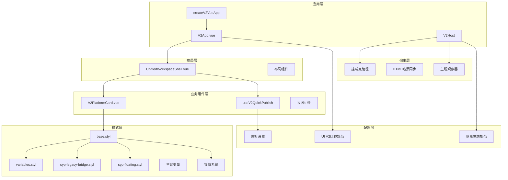
```mermaid
graph TB
subgraph "应用层"
V2App[V2App.vue]
CreateApp[createV2VueApp]
Host[V2Host]
end
subgraph "宿主层"
ThemeObserver[主题观察器]
SyncHtmlDark[HTML暗黑同步]
MountPoint[挂载点管理]
end
subgraph "布局层"
Shell[UnifiedWorkspaceShell.vue]
Layout[布局组件]
end
subgraph "业务组件层"
PlatformCard[V2PlatformCard.vue]
QuickPublish[useV2QuickPublish]
Settings[设置组件]
end
subgraph "样式层"
BaseStyle[base.styl]
Variables[variables.styl]
LegacyBridge[syp-legacy-bridge.styl]
Floating[syp-floating.styl]
Theme[主题变量]
Navigation[导航系统]
end
subgraph "配置层"
MigrationSpec[UI V2迁移规范]
Preferences[偏好设置]
DarkTheme[暗黑主题规范]
end
CreateApp --> V2App
Host --> MountPoint
Host --> ThemeObserver
V2App --> Shell
Shell --> PlatformCard
Shell --> QuickPublish
PlatformCard --> BaseStyle
BaseStyle --> Variables
BaseStyle --> LegacyBridge
BaseStyle --> Floating
BaseStyle --> Navigation
V2App --> MigrationSpec
QuickPublish --> Preferences
Host --> DarkTheme
```

**图表来源**
- [createV2App.ts:13-14](file://siyuan/v2/createV2App.ts#L13-L14)
- [v2Host.ts:53-71](file://siyuan/v2/v2Host.ts#L53-L71)
- [V2App.vue:104-144](file://src/components/v2/V2App.vue#L104-L144)
- [UnifiedWorkspaceShell.vue:1-40](file://src/components/v2/layout/UnifiedWorkspaceShell.vue#L1-L40)

**章节来源**
- [createV2App.ts:1-54](file://siyuan/v2/createV2App.ts#L1-L54)
- [v2Host.ts:1-281](file://siyuan/v2/v2Host.ts#L1-L281)
- [V2App.vue:1-795](file://src/components/v2/V2App.vue#L1-L795)
- [UnifiedWorkspaceShell.vue:1-40](file://src/components/v2/layout/UnifiedWorkspaceShell.vue#L1-L40)

## 核心组件

### 应用初始化组件

应用初始化采用工厂模式设计，提供灵活的配置选项和国际化支持：

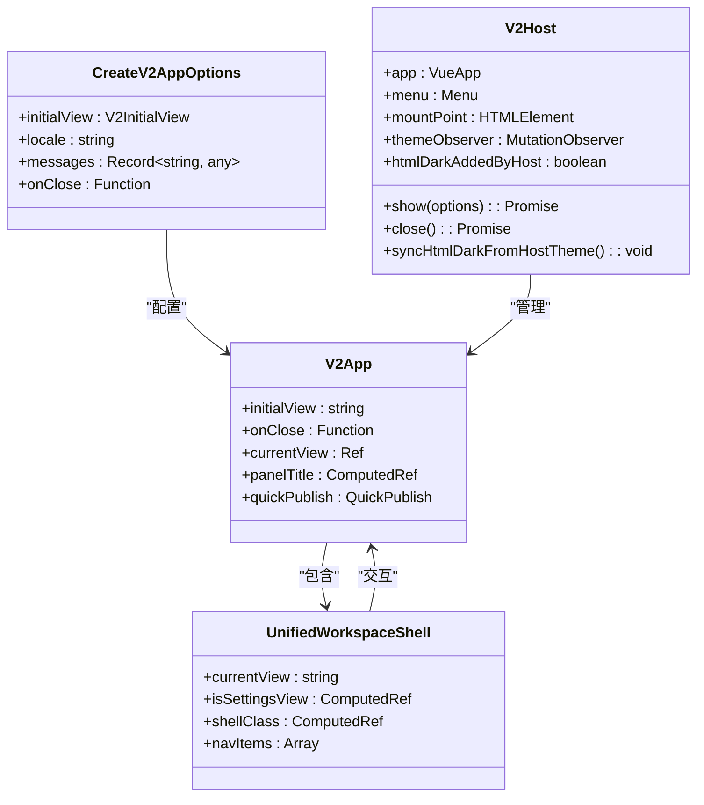
```mermaid
classDiagram
class CreateV2AppOptions {
+initialView : V2InitialView
+locale : string
+messages : Record~string, any~
+onClose : Function
}
class V2App {
+initialView : string
+onClose : Function
+currentView : Ref
+panelTitle : ComputedRef
+quickPublish : QuickPublish
}
class V2Host {
+app : VueApp
+menu : Menu
+mountPoint : HTMLElement
+themeObserver : MutationObserver
+htmlDarkAddedByHost : boolean
+show(options) : Promise
+close() : Promise
+syncHtmlDarkFromHostTheme() : void
}
class UnifiedWorkspaceShell {
+currentView : string
+isSettingsView : ComputedRef
+shellClass : ComputedRef
+navItems : Array
}
CreateV2AppOptions --> V2App : "配置"
V2Host --> V2App : "管理"
V2App --> UnifiedWorkspaceShell : "包含"
UnifiedWorkspaceShell --> V2App : "交互"
```

**图表来源**
- [createV2App.ts:21-27](file://siyuan/v2/createV2App.ts#L21-L27)
- [v2Host.ts:26-42](file://siyuan/v2/v2Host.ts#L26-L42)
- [V2App.vue:115-123](file://src/components/v2/V2App.vue#L115-L123)
- [UnifiedWorkspaceShell.vue:25-39](file://src/components/v2/layout/UnifiedWorkspaceShell.vue#L25-L39)

### 快速发布组件

快速发布组件通过响应式状态管理实现动态内容渲染，支持文档上下文感知和平台状态显示：

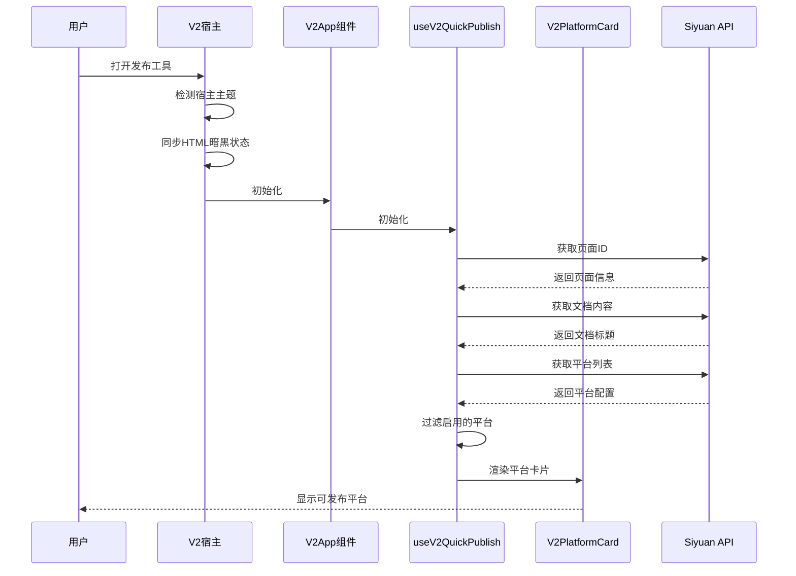
```mermaid
sequenceDiagram
participant User as 用户
participant V2Host as V2宿主
participant V2App as V2App组件
participant QuickPublish as useV2QuickPublish
participant PlatformCard as V2PlatformCard
participant API as Siyuan API
User->>V2Host : 打开发布工具
V2Host->>V2Host : 检测宿主主题
V2Host->>V2Host : 同步HTML暗黑状态
V2Host->>V2App : 初始化
V2App->>QuickPublish : 初始化
QuickPublish->>API : 获取页面ID
API-->>QuickPublish : 返回页面信息
QuickPublish->>API : 获取文档内容
API-->>QuickPublish : 返回文档标题
QuickPublish->>API : 获取平台列表
API-->>QuickPublish : 返回平台配置
QuickPublish->>QuickPublish : 过滤启用的平台
QuickPublish->>PlatformCard : 渲染平台卡片
PlatformCard-->>User : 显示可发布平台
```

**图表来源**
- [useV2QuickPublish.ts:34-71](file://src/composables/v2/useV2QuickPublish.ts#L34-L71)
- [v2Host.ts:53-71](file://siyuan/v2/v2Host.ts#L53-L71)
- [V2App.vue:129-131](file://src/components/v2/V2App.vue#L129-L131)
- [V2PlatformCard.vue:1-103](file://src/components/v2/publish/V2PlatformCard.vue#L1-L103)

**章节来源**
- [createV2App.ts:29-53](file://siyuan/v2/createV2App.ts#L29-L53)
- [v2Host.ts:118-195](file://siyuan/v2/v2Host.ts#L118-L195)
- [useV2QuickPublish.ts:19-80](file://src/composables/v2/useV2QuickPublish.ts#L19-L80)

## 架构概览

UI V2架构遵循统一工作空间设计理念，通过单一壳层实现不同视图状态的切换，**更新** 现在集成了完整的主题同步机制：

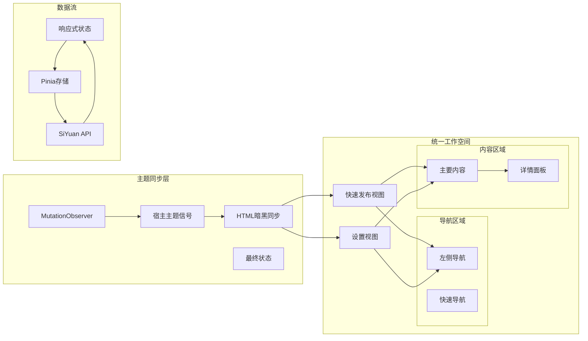
```mermaid
graph LR
subgraph "统一工作空间"
QuickPublish[快速发布视图]
Settings[设置视图]
subgraph "导航区域"
Nav[左侧导航]
QuickNav[快速导航]
end
subgraph "内容区域"
Content[主要内容]
Detail[详情面板]
end
end
subgraph "主题同步层"
ThemeObserver[MutationObserver]
HostTheme[宿主主题信号]
HtmlDark[HTML暗黑同步]
EndState[最终状态]
end
subgraph "数据流"
State[响应式状态]
Store[Pinia存储]
API[SiYuan API]
end
QuickPublish --> Nav
Settings --> Nav
QuickPublish --> Content
Settings --> Content
Content --> Detail
ThemeObserver --> HostTheme
HostTheme --> HtmlDark
HtmlDark --> QuickPublish
HtmlDark --> Settings
State --> Store
Store --> API
API --> State
```

**图表来源**
- [v2Host.ts:73-91](file://siyuan/v2/v2Host.ts#L73-L91)
- [v2Host.ts:44-47](file://siyuan/v2/v2Host.ts#L44-L47)
- [V2App.vue:44-99](file://src/components/v2/V2App.vue#L44-L99)

### 视图切换机制

系统通过CSS Grid布局实现视图状态的动态切换，支持响应式设计和主题同步：

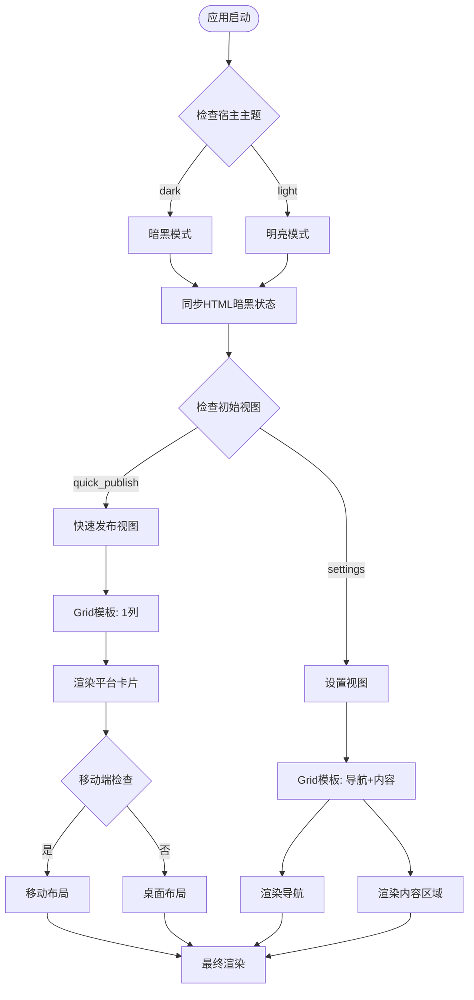
```mermaid
flowchart TD
Start([应用启动]) --> CheckTheme{检查宿主主题}
CheckTheme --> |dark| DarkMode[暗黑模式]
CheckTheme --> |light| LightMode[明亮模式]
DarkMode --> SyncHtmlDark[同步HTML暗黑状态]
LightMode --> SyncHtmlDark
SyncHtmlDark --> CheckView{检查初始视图}
CheckView --> |quick_publish| QuickView[快速发布视图]
CheckView --> |settings| SettingsView[设置视图]
QuickView --> QuickGrid[Grid模板: 1列]
SettingsView --> SettingsGrid[Grid模板: 导航+内容]
QuickGrid --> RenderCards[渲染平台卡片]
SettingsGrid --> RenderNav[渲染导航]
SettingsGrid --> RenderContent[渲染内容区域]
RenderCards --> ResponsiveCheck{移动端检查}
ResponsiveCheck --> |是| MobileLayout[移动布局]
ResponsiveCheck --> |否| DesktopLayout[桌面布局]
MobileLayout --> FinalRender[最终渲染]
DesktopLayout --> FinalRender
RenderNav --> FinalRender
RenderContent --> FinalRender
```

**图表来源**
- [v2Host.ts:53-71](file://siyuan/v2/v2Host.ts#L53-L71)
- [V2App.vue:120-143](file://src/components/v2/V2App.vue#L120-L143)
- [base.styl:186-245](file://src/assets/v2/base.styl#L186-L245)

**章节来源**
- [v2Host.ts:118-195](file://siyuan/v2/v2Host.ts#L118-L195)
- [V2App.vue:120-143](file://src/components/v2/V2App.vue#L120-L143)
- [UnifiedWorkspaceShell.vue:29-30](file://src/components/v2/layout/UnifiedWorkspaceShell.vue#L29-L30)

## 详细组件分析

### 平台卡片组件

平台卡片组件实现了统一的设计语言，支持授权状态和发布状态的视觉反馈：

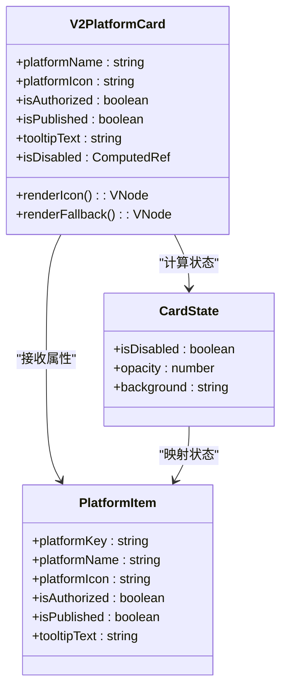
```mermaid
classDiagram
class V2PlatformCard {
+platformName : string
+platformIcon : string
+isAuthorized : boolean
+isPublished : boolean
+tooltipText : string
+isDisabled : ComputedRef
+renderIcon() : VNode
+renderFallback() : VNode
}
class PlatformItem {
+platformKey : string
+platformName : string
+platformIcon : string
+isAuthorized : boolean
+isPublished : boolean
+tooltipText : string
}
class CardState {
+isDisabled : boolean
+opacity : number
+background : string
}
V2PlatformCard --> PlatformItem : "接收属性"
V2PlatformCard --> CardState : "计算状态"
CardState --> PlatformItem : "映射状态"
```

**图表来源**
- [V2PlatformCard.vue:26-34](file://src/components/v2/publish/V2PlatformCard.vue#L26-L34)
- [useV2QuickPublish.ts:10-17](file://src/composables/v2/useV2QuickPublish.ts#L10-L17)

### 导航系统优化

**更新** 导航系统经过简化和优化，采用了更简洁的颜色方案和更快的过渡动画：

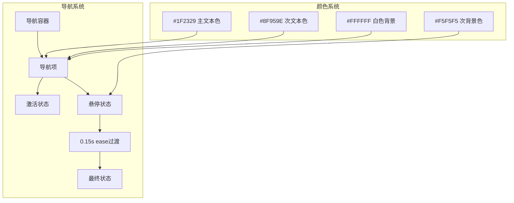
```mermaid
graph TB
subgraph "导航系统"
NavContainer[导航容器]
NavItem[导航项]
ActiveState[激活状态]
HoverState[悬停状态]
Transition[0.15s ease过渡]
EndState[最终状态]
end
subgraph "颜色系统"
TextColor1[#1F2329 主文本色]
TextColor2[#8F959E 次文本色]
BgColor1[#FFFFFF 白色背景]
BgColor2[#F5F5F5 次背景色]
end
NavContainer --> NavItem
NavItem --> ActiveState
NavItem --> HoverState
HoverState --> Transition
Transition --> EndState
TextColor1 --> NavItem
TextColor2 --> NavItem
BgColor1 --> NavItem
BgColor2 --> HoverState
```

**图表来源**
- [UnifiedWorkspaceShell.vue:47-121](file://src/components/v2/layout/UnifiedWorkspaceShell.vue#L47-L121)
- [V2App.vue:36-41](file://src/components/v2/V2App.vue#L36-L41)

**章节来源**
- [UnifiedWorkspaceShell.vue:48-121](file://src/components/v2/layout/UnifiedWorkspaceShell.vue#L48-L121)
- [V2App.vue:36-41](file://src/components/v2/V2App.vue#L36-L41)

## 样式系统设计

UI V2采用基于变量的样式系统，确保设计的一致性和可维护性。**更新** 样式系统现已包含40+个CSS自定义属性，建立了完整的视觉设计系统：

### 完整的CSS变量系统

```mermaid
graph TB
subgraph "样式变量系统"
Variables[variables.styl]
subgraph "色彩系统"
Primary[主色调: #4080FF]
Secondary[辅助色]
Neutral[中性色]
Status[状态色]
EndState[最终状态]
end
subgraph "间距系统"
SpacingXS[4px]
SpacingSM[8px]
SpacingMD[16px]
SpacingLG[24px]
SpacingXL[32px]
end
subgraph "圆角系统"
RadiusSM[4px]
RadiusMD[8px]
RadiusLG[12px]
RadiusXL[16px]
end
subgraph "阴影系统"
ShadowSM[轻阴影]
ShadowMD[中阴影]
ShadowLG[重阴影]
ShadowCardHover[卡片悬停阴影]
end
subgraph "操作色系统"
ActionPrimary[主要操作色]
ActionDanger[危险操作色]
Accent[强调色]
EndState[最终状态]
end
subgraph "状态背景系统"
StatusInfoBg[信息状态背景]
StatusSuccessBg[成功状态背景]
StatusErrorBg[错误状态背景]
StatusErrorDeepBg[深色错误背景]
EndState[最终状态]
end
subgraph "标签和徽章系统"
ChipBg[芯片背景]
ChipText[芯片文字]
BadgeReady[就绪徽章]
BadgeDisabled[禁用徽章]
EndState[最终状态]
end
subgraph "图标和卡片系统"
IconBg[图标背景]
IconColor[图标颜色]
CardBgGradient[卡片渐变背景]
EndState[最终状态]
end
end
subgraph "基础样式"
Base[base.styl]
Components[组件样式]
Utilities[工具类]
Navigation[导航样式]
EndState[最终状态]
end
Variables --> Primary
Variables --> Secondary
Variables --> Neutral
Variables --> Status
Variables --> ActionPrimary
Variables --> ActionDanger
Variables --> Accent
Variables --> StatusInfoBg
Variables --> StatusSuccessBg
Variables --> StatusErrorBg
Variables --> StatusErrorDeepBg
Variables --> ChipBg
Variables --> ChipText
Variables --> BadgeReady
Variables --> BadgeDisabled
Variables --> IconBg
Variables --> IconColor
Variables --> CardBgGradient
Primary --> Base
Secondary --> Base
SpacingXS --> Base
RadiusSM --> Base
ShadowSM --> Base
ActionPrimary --> Base
ActionDanger --> Base
Accent --> Base
StatusInfoBg --> Base
StatusSuccessBg --> Base
StatusErrorBg --> Base
StatusErrorDeepBg --> Base
ChipBg --> Base
ChipText --> Base
BadgeReady --> Base
BadgeDisabled --> Base
IconBg --> Base
IconColor --> Base
CardBgGradient --> Base
Base --> Components
Base --> Utilities
Base --> Navigation
```

**图表来源**
- [variables.styl:8-124](file://src/assets/v2/variables.styl#L8-L124)
- [base.styl:11-510](file://src/assets/v2/base.styl#L11-L510)

### 状态背景系统

**更新** 新增的状态背景系统提供了完整的状态反馈机制：

- **信息状态背景**: `#f7fbff` (状态信息背景) 和 `#d6e4f5` (状态信息边框)
- **成功状态背景**: `#f3fbf5` (状态成功背景) 和 `#d7f0df` (状态成功边框)  
- **错误状态背景**: `#fff5f5` (状态错误背景) 和 `#f2d6d6` (状态错误边框)
- **深色错误背景**: `#fff1f1` (用于错误详情的深色背景)

### 芯片和徽章系统

**更新** 新增的芯片和徽章系统提供了丰富的UI元素：

- **芯片样式**: `$syp-chip-bg = var(--b3-theme-surface-light, #f3f6fa)` 和 `$syp-chip-text = var(--b3-theme-on-surface-light, #6a7788)`
- **就绪徽章**: `$syp-badge-ready-bg = var(--b3-theme-primary-lightest, rgba(52, 199, 36, 0.12))` 和 `$syp-badge-ready-text = var(--b3-theme-primary, #2f8b24)`
- **禁用徽章**: `$syp-badge-disabled-bg = var(--b3-theme-error-lightest, rgba(245, 74, 69, 0.2))` 和 `$syp-badge-disabled-text = var(--b3-theme-error, #c62828)`

### 操作色系统

**更新** 新增的操作色系统提供了完整的交互反馈：

- **主要操作色**: `$syp-action-primary = #1677ff` 和 `$syp-action-primary-hover = #4096ff`
- **危险操作色**: `$syp-action-danger = #d92d20` 和 `$syp-action-danger-hover = #c6281d`
- **强调色**: `$syp-accent = #355d90` 和 `$syp-accent-hover-bg = rgba(53, 93, 144, 0.08)`

### 图标和卡片系统

**更新** 新增的图标和卡片系统提供了统一的视觉元素：

- **图标区域**: `$syp-icon-bg = var(--b3-theme-surface-light, #f2f5fa)` 和 `$syp-icon-color = var(--b3-theme-primary, #355d90)`
- **渐变卡片背景**: `$syp-card-bg-gradient = linear-gradient(180deg, var(--b3-theme-surface, #ffffff) 0%, var(--b3-theme-surface-light, #f8fafc) 100%)`

### 响应式布局系统

UI V2现在具备完整的响应式布局系统，支持多种设备和屏幕尺寸：

```mermaid
graph TB
subgraph "响应式断点系统"
Breakpoint960[960px断点]
Breakpoint768[768px断点]
Breakpoint480[480px断点]
end
subgraph "布局系统"
GridLayout[网格布局]
FlexLayout[弹性布局]
ShellLayout[壳层布局]
end
subgraph "媒体查询"
MediaQuery[@media(max-width: 960px)]
MobileLayout[移动布局]
DesktopLayout[桌面布局]
end
Breakpoint960 --> MediaQuery
MediaQuery --> MobileLayout
MediaQuery --> DesktopLayout
GridLayout --> ShellLayout
FlexLayout --> ShellLayout
ShellLayout --> MobileLayout
ShellLayout --> DesktopLayout
```

**图表来源**
- [base.styl:401-433](file://src/assets/v2/base.styl#L401-L433)
- [V2App.vue:538-550](file://src/components/v2/V2App.vue#L538-L550)

**章节来源**
- [variables.styl:1-124](file://src/assets/v2/variables.styl#L1-L124)
- [base.styl:1-510](file://src/assets/v2/base.styl#L1-L510)
- [V2PlatformCard.vue:119-247](file://src/components/v2/publish/V2PlatformCard.vue#L119-L247)

### 数据流管理

组件间的数据流采用单向数据流设计，确保状态管理的可预测性：

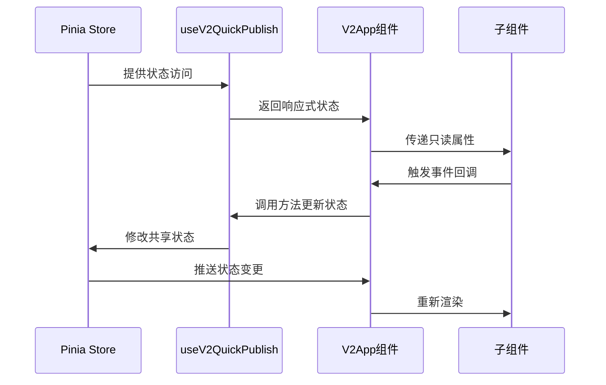
```mermaid
sequenceDiagram
participant Store as Pinia Store
participant Composable as useV2QuickPublish
participant Component as V2App组件
participant Child as 子组件
Store->>Composable : 提供状态访问
Composable->>Component : 返回响应式状态
Component->>Child : 传递只读属性
Child->>Component : 触发事件回调
Component->>Composable : 调用方法更新状态
Composable->>Store : 修改共享状态
Store->>Component : 推送状态变更
Component->>Child : 重新渲染
```

**图表来源**
- [useV2QuickPublish.ts:19-80](file://src/composables/v2/useV2QuickPublish.ts#L19-L80)
- [V2App.vue:122-123](file://src/components/v2/V2App.vue#L122-L123)

**章节来源**
- [useV2QuickPublish.ts:24-71](file://src/composables/v2/useV2QuickPublish.ts#L24-L71)
- [V2App.vue:104-144](file://src/components/v2/V2App.vue#L104-L144)

## 暗黑主题系统

**新增** UI V2现在集成了完整的暗黑主题系统，基于 Siyuan 主题变量的统一主题设计原则：

### 主题信号同步机制

系统通过 `MutationObserver` 监听宿主主题变化，实现与思源编辑器的实时同步：

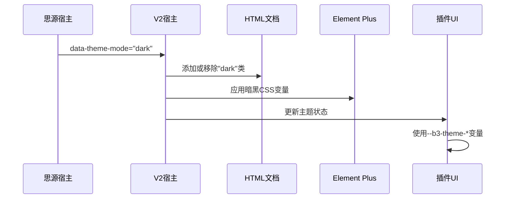
```mermaid
sequenceDiagram
participant Host as 思源宿主
participant V2Host as V2宿主
participant HTML as HTML文档
participant EP as Element Plus
participant Plugin as 插件UI
Host->>V2Host : data-theme-mode="dark"
V2Host->>HTML : 添加或移除"dark"类
V2Host->>EP : 应用暗黑CSS变量
V2Host->>Plugin : 更新主题状态
Plugin->>Plugin : 使用--b3-theme-*变量
```

**图表来源**
- [v2Host.ts:73-91](file://siyuan/v2/v2Host.ts#L73-L91)
- [v2Host.ts:53-71](file://siyuan/v2/v2Host.ts#L53-L71)
- [createV2App.ts:13-14](file://siyuan/v2/createV2App.ts#L13-L14)

### Element Plus 暗黑支持

**更新** Element Plus 通过官方暗黑CSS变量实现完整的暗黑模式支持：

- **导入顺序**: `element-plus/dist/index.css` → `element-plus/theme-chalk/dark/css-vars.css`
- **主题变量**: 使用 `--el-*` CSS变量而非硬编码颜色值
- **桥接限制**: 禁止将 `--el-*` 映射到 `--b3-*`，避免与宿主升级冲突

### 语义化主题变量

**更新** 所有 `.syp-v2` 组件现在使用语义化主题变量：

- **表面色**: `var(--b3-theme-surface, $syp-bg-primary)`
- **文本色**: `var(--b3-theme-on-surface, $syp-text-primary)` 或 `var(--b3-theme-on-background, ...)`
- **边框色**: `var(--b3-border-color, $syp-border-primary)`
- **次要表面**: `var(--b3-theme-surface-light, $syp-bg-secondary)`

### 发布状态条主题适配

**更新** 发布状态条现在使用语义化变量而非平行色板：

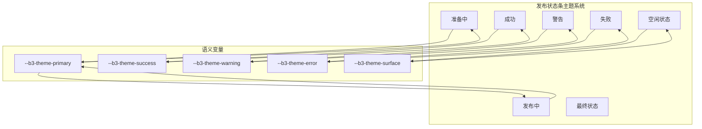
```mermaid
graph TB
subgraph "发布状态条主题系统"
Idle[空闲状态]
Preparing[准备中]
Publishing[发布中]
Success[成功]
Warning[警告]
Failed[失败]
EndState[最终状态]
end
subgraph "语义变量"
PrimaryVar[--b3-theme-primary]
SuccessVar[--b3-theme-success]
WarningVar[--b3-theme-warning]
ErrorVar[--b3-theme-error]
SurfaceVar[--b3-theme-surface]
EndState[最终状态]
end
Idle --> SurfaceVar
Preparing --> PrimaryVar
Publishing --> PrimaryVar
Success --> SuccessVar
Warning --> WarningVar
Failed --> ErrorVar
SurfaceVar --> Idle
PrimaryVar --> Preparing
PrimaryVar --> Publishing
SuccessVar --> Success
WarningVar --> Warning
ErrorVar --> Failed
```

**图表来源**
- [V2App.vue:594-721](file://src/components/v2/V2App.vue#L594-L721)
- [base.styl:61-67](file://src/assets/v2/base.styl#L61-L67)

### 浮层组件暗黑适配

**更新** 所有浮层组件都实现了暗黑主题适配：

- **Tooltip**: 强制使用思源表面色，覆盖 Element Plus 的浅色背景
- **ElMessage**: 随宿主暗黑自动调整背景和边框
- **ElMessageBox**: 使用语义化表面色和阴影变量

### 主题桥接策略

**更新** 采用"桥接区仅容器，表单交EP"的策略：

- **桥接区**: `.syp-v2 .syp-platform-bridge` 使用 `--b3-theme-*` 变量
- **表单区**: Element Plus 表单组件完全交由 `html.dark` + 官方暗黑CSS变量处理
- **禁止操作**: 禁止在桥接区使用 `:deep(.el-input__wrapper)` 等覆盖EP样式

**章节来源**
- [v2Host.ts:44-47](file://siyuan/v2/v2Host.ts#L44-L47)
- [v2Host.ts:53-71](file://siyuan/v2/v2Host.ts#L53-L71)
- [createV2App.ts:13-14](file://siyuan/v2/createV2App.ts#L13-L14)
- [V2App.vue:594-721](file://src/components/v2/V2App.vue#L594-L721)
- [syp-legacy-bridge.styl:8-10](file://src/assets/v2/syp-legacy-bridge.styl#L8-L10)
- [syp-floating.styl:6-80](file://src/assets/v2/syp-floating.styl#L6-L80)

## 依赖关系分析

UI V2组件间的依赖关系体现了清晰的关注点分离：

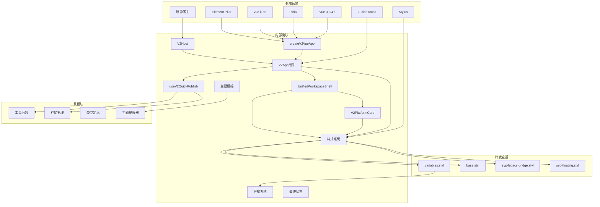
```mermaid
graph TD
subgraph "外部依赖"
Vue[Vue 3.3.4+]
Pinia[Pinia]
I18n[vue-i18n]
Stylus[Stylus]
Icons[Lucide Icons]
ElementPlus[Element Plus]
Siyuan[思源宿主]
end
subgraph "内部模块"
CreateApp[createV2VueApp]
V2Host[V2Host]
V2App[V2App组件]
Shell[UnifiedWorkspaceShell]
PlatformCard[V2PlatformCard]
QuickPublish[useV2QuickPublish]
Styles[样式系统]
Navigation[导航系统]
ThemeBridge[主题桥接]
EndState[最终状态]
end
subgraph "工具模块"
Utils[工具函数]
Stores[存储管理]
Types[类型定义]
ThemeObserver[主题观察器]
EndState[最终状态]
end
subgraph "样式变量"
Variables[variables.styl]
Base[base.styl]
LegacyBridge[syp-legacy-bridge.styl]
Floating[syp-floating.styl]
EndState[最终状态]
end
Vue --> CreateApp
Pinia --> CreateApp
I18n --> CreateApp
Stylus --> Styles
Icons --> V2App
ElementPlus --> CreateApp
Siyuan --> V2Host
CreateApp --> V2App
V2Host --> V2App
V2App --> Shell
V2App --> QuickPublish
Shell --> PlatformCard
QuickPublish --> Utils
QuickPublish --> Stores
V2App --> Styles
PlatformCard --> Styles
Shell --> Styles
Styles --> Variables
Styles --> Base
Styles --> LegacyBridge
Styles --> Floating
Variables --> Navigation
ThemeBridge --> ThemeObserver
```

**图表来源**
- [createV2App.ts:10-17](file://siyuan/v2/createV2App.ts#L10-L17)
- [v2Host.ts:10-14](file://siyuan/v2/v2Host.ts#L10-L14)
- [V2App.vue:106-113](file://src/components/v2/V2App.vue#L106-L113)
- [UnifiedWorkspaceShell.vue:1-19](file://src/components/v2/layout/UnifiedWorkspaceShell.vue#L1-L19)

### 组件耦合度评估

系统采用松耦合设计，各组件间通过明确的接口进行通信：

- **低耦合**: 组件间通过props和events通信，避免直接依赖
- **高内聚**: 每个组件专注于单一职责，功能边界清晰
- **可测试性**: 通过组合式API实现良好的可测试性
- **可维护性**: 基于约定的目录结构和命名规范
- **响应式兼容**: 全面支持移动端和桌面端的自适应布局
- **主题兼容**: 完整的主题同步机制确保跨模式一致性

**章节来源**
- [createV2App.ts:29-53](file://siyuan/v2/createV2App.ts#L29-L53)
- [v2Host.ts:118-195](file://siyuan/v2/v2Host.ts#L118-L195)
- [V2App.vue:104-144](file://src/components/v2/V2App.vue#L104-L144)

## 性能考虑

UI V2在设计时充分考虑了性能优化：

### 渲染性能
- 使用虚拟DOM减少直接DOM操作
- 采用响应式状态避免不必要的重渲染
- 图片懒加载和骨架屏提升用户体验
- **更新** 简化的导航样式减少了CSS复杂度，提升了渲染性能
- **更新** 40+个CSS变量的预定义减少了运行时计算开销
- **更新** 主题观察器采用MutationObserver，避免轮询开销

### 内存管理
- 合理的组件生命周期管理
- 及时清理事件监听器和定时器
- 避免内存泄漏的资源管理

### 网络优化
- 按需加载非关键资源
- 缓存策略优化API请求
- 减少HTTP请求数量

### 交互性能优化
- **新增** 0.15s的快速过渡动画提升了用户反馈的即时性
- **新增** 简化的颜色系统减少了样式计算的复杂度
- **新增** 更快的导航响应提升了整体交互流畅度
- **新增** CSS变量系统减少了重复样式的计算和传输
- **新增** 主题同步机制避免了重复的主题计算
- **新增** Element Plus官方暗黑CSS变量减少主题切换开销

## 故障排除指南

### 常见问题诊断

1. **应用无法启动**
   - 检查Vue实例创建是否成功
   - 验证Pinia和i18n插件注册
   - 确认样式文件加载正常

2. **平台卡片不显示**
   - 检查文档上下文是否正确
   - 验证平台配置状态
   - 确认API调用权限

3. **样式异常**
   - 检查命名空间隔离
   - 验证CSS变量定义
   - 确认媒体查询适配
   - **更新** 检查简化的导航样式变量
   - **更新** 验证40+个新CSS变量的正确应用

4. **导航交互问题**
   - **更新** 检查图标导入是否正确（LucideChevronLeft）
   - **更新** 验证颜色变量是否正确应用
   - **更新** 确认过渡动画是否正常执行
   - **更新** 检查状态背景变量的使用

5. **暗黑主题问题**
   - **新增** 检查 `data-theme-mode` 属性是否正确传递
   - **新增** 验证主题观察器是否正常工作
   - **新增** 确认HTML暗黑类是否正确同步
   - **新增** 检查Element Plus暗黑CSS变量是否加载
   - **新增** 验证语义化主题变量的使用

6. **浮层组件问题**
   - **新增** 检查浮层样式是否正确加载
   - **新增** 验证暗黑主题下的浮层颜色
   - **新增** 确认Teleport目标是否正确

**章节来源**
- [createV2App.ts:29-53](file://siyuan/v2/createV2App.ts#L29-L53)
- [v2Host.ts:73-91](file://siyuan/v2/v2Host.ts#L73-L91)
- [useV2QuickPublish.ts:34-71](file://src/composables/v2/useV2QuickPublish.ts#L34-L71)

## 结论

UI V2设计原则体现了现代前端开发的最佳实践，通过统一的工作空间、清晰的组件架构和完善的样式系统，为用户提供了优秀的发布工具体验。**更新** 本次暗黑主题系统集成显著增强了插件与思源编辑器的融合度，通过基于 `data-theme-mode="dark"` 的主题同步机制和语义化主题变量，实现了真正的跨模式一致性。

该设计原则不仅关注当前的功能实现，更注重长期的可维护性和扩展性，为后续的功能迭代奠定了坚实的基础。

项目的核心价值在于：
- **用户体验**: 通过统一界面减少学习成本，**更新** 简化的导航系统提供更直观的操作反馈，**新增** 完整的暗黑主题支持提升夜间使用体验
- **技术先进性**: 采用最新的Vue 3技术和最佳实践，**更新** 包含优化的导航交互设计和完整的CSS变量系统，**新增** 基于语义化主题变量的暗黑主题架构
- **可扩展性**: 模块化的架构便于功能扩展
- **可维护性**: 清晰的代码结构和文档规范，**更新** 完善的样式变量系统便于维护和定制，**新增** 主题同步机制确保跨模式一致性
- **可访问性**: 语义化主题变量和WCAG对比度标准确保良好的可访问性

这些设计原则将指导未来UI V2功能的开发，确保系统在演进过程中保持一致性和高质量。