# UI V2 迁移规范

<cite>
**本文档引用的文件**
- [src/v2/createV2App.ts](file://src/v2/createV2App.ts)
- [src/components/v2/V2App.vue](file://src/components/v2/V2App.vue)
- [src/components/v2/layout/UnifiedWorkspaceShell.vue](file://src/components/v2/layout/UnifiedWorkspaceShell.vue)
- [src/components/v2/publish/V2PlatformCard.vue](file://src/components/v2/publish/V2PlatformCard.vue)
- [src/components/v2/settings/V2PicBedSettings.vue](file://src/components/v2/settings/V2PicBedSettings.vue)
- [src/components/v2/settings/V2PlatformConfigBridge.vue](file://src/components/v2/settings/V2PlatformConfigBridge.vue)
- [src/components/v2/settings/V2PreferenceSettings.vue](file://src/components/v2/settings/V2PreferenceSettings.vue)
- [src/components/v2/settings/V2AccountList.vue](file://src/components/v2/settings/V2AccountList.vue)
- [src/components/v2/settings/V2PlatformSelect.vue](file://src/components/v2/settings/V2PlatformSelect.vue)
- [src/composables/v2/useV2Settings.ts](file://src/composables/v2/useV2Settings.ts)
- [src/composables/v2/useV2QuickPublish.ts](file://src/composables/v2/useV2QuickPublish.ts)
- [src/composables/v2/useV2I18n.ts](file://src/composables/v2/useV2I18n.ts)
- [src/stores/usePreferenceSettingStore.ts](file://src/stores/usePreferenceSettingStore.ts)
- [src/stores/usePublishSettingStore.ts](file://src/stores/usePublishSettingStore.ts)
- [src/assets/v2/base.styl](file://src/assets/v2/base.styl)
- [src/assets/v2/variables.styl](file://src/assets/v2/variables.styl)
- [src/components/v2/settings/bridge/bridgeRegistry.ts](file://src/components/v2/settings/bridge/bridgeRegistry.ts)
- [openspec/changes/refactor-ui-v2-foundation/specs/ui-v2-migration/spec.md](file://openspec/changes/refactor-ui-v2-foundation/specs/ui-v2-migration/spec.md)
- [openspec/changes/refactor-ui-v2-foundation/design.md](file://openspec/changes/refactor-ui-v2-foundation/design.md)
- [openspec/changes/refactor-ui-v2-foundation/tasks.md](file://openspec/changes/refactor-ui-v2-foundation/tasks.md)
- [vite.v2.config.ts](file://vite.v2.config.ts)
- [vite.config.ts](file://vite.config.ts)
- [package.json](file://package.json)
- [docs/UI2.0-从SPA到原生DOM挂载-架构接线与代码审计指南.md](file://docs/UI2.0-从SPA到原生DOM挂载-架构接线与代码审计指南.md)
- [siyuan/v2/v2Host.ts](file://siyuan/v2/v2Host.ts)
- [siyuan/topbar.ts](file://siyuan/topbar.ts)
- [siyuan/index.ts](file://siyuan/index.ts)
- [src/workers/QuickPublish.vue](file://src/workers/QuickPublish.vue)
- [src/routes/routeConfig.ts](file://src/routes/routeConfig.ts)
</cite>

## 更新摘要
**变更内容**
- 新增了详细的910行架构接线与代码审计指南，提供完整的代码审计路径和最佳实践
- 更新了里程碑进度的最新状态，包含Milestone 4和5的详细完成情况
- 完善了从SPA到原生DOM挂载的完整迁移状态说明，明确了当前的迁移成熟度
- 增强了代码退役标准框架，包含最新的SPA代码分类和退役条件
- 更新了设置系统架构，包含最新的桥接组件覆盖率和国际化适配
- 新增了详细的设计要求、架构规范和里程碑进度说明
- 强化了真实DOM挂载、统一工作壳、渐进迁移等核心概念的规范

## 目录
1. [简介](#简介)
2. [项目结构](#项目结构)
3. [核心组件](#核心组件)
4. [架构概览](#架构概览)
5. [详细组件分析](#详细组件分析)
6. [SPA代码退役标准框架](#spacode退役标准框架)
7. [V2状态层设计规范](#v2状态层设计规范)
8. [构建链复用策略](#构建链复用策略)
9. [设置系统架构](#设置系统架构)
10. [依赖关系分析](#依赖关系分析)
11. [性能考虑](#性能考虑)
12. [故障排除指南](#故障排除指南)
13. [里程碑进度与稳定发布策略](#里程碑进度与稳定发布策略)
14. [代码审计指南](#代码审计指南)
15. [结论](#结论)

## 简介

UI V2 迁移规范是思源笔记发布工具插件的一个重要升级项目，旨在将现有的 iframe SPA 架构迁移到基于真实 DOM 挂载的现代化 Vue 3 应用。该项目遵循渐进式迁移策略，通过六个里程碑逐步实现从传统 UI 到现代 UI V2 的完整转换。

### 主要目标

- **统一工作壳**：创建单一的 `UnifiedWorkspaceShell` 来承载快速发布和设置功能
- **真实 DOM 挂载**：替代 iframe SPA，直接在插件运行时中渲染
- **原生 UI 优先**：优先使用思源笔记的原生 UI 和样式系统
- **渐进式迁移**：通过里程碑管理的方式有序推进迁移工作
- **模块化设置系统**：引入专门的设置组件来管理账户、图床和偏好设置
- **代码退役标准化**：建立完整的 SPA 代码退役标准框架
- **架构审计标准化**：提供完整的代码审计指南和最佳实践

## 项目结构

UI V2 迁移涉及的核心目录结构如下：

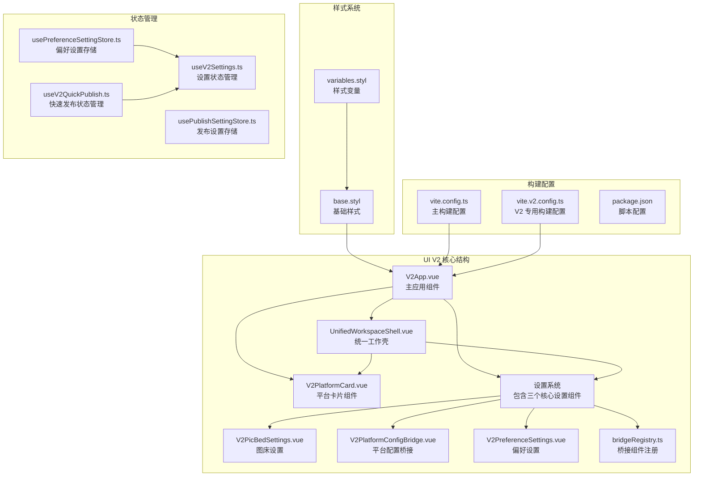

**图表来源**
- [src/components/v2/V2App.vue:142-148](file://src/components/v2/V2App.vue#L142-L148)
- [src/components/v2/layout/UnifiedWorkspaceShell.vue:1-50](file://src/components/v2/layout/UnifiedWorkspaceShell.vue#L1-L50)
- [src/assets/v2/base.styl:1-245](file://src/assets/v2/base.styl#L1-L245)

**章节来源**
- [src/v2/createV2App.ts:1-37](file://src/v2/createV2App.ts#L1-L37)
- [vite.v2.config.ts:1-137](file://vite.v2.config.ts#L1-L137)
- [vite.config.ts:1-275](file://vite.config.ts#L1-L275)

## 核心组件

### V2 应用入口

V2 应用通过 `createV2VueApp` 工厂函数创建，支持国际化配置和回调处理：

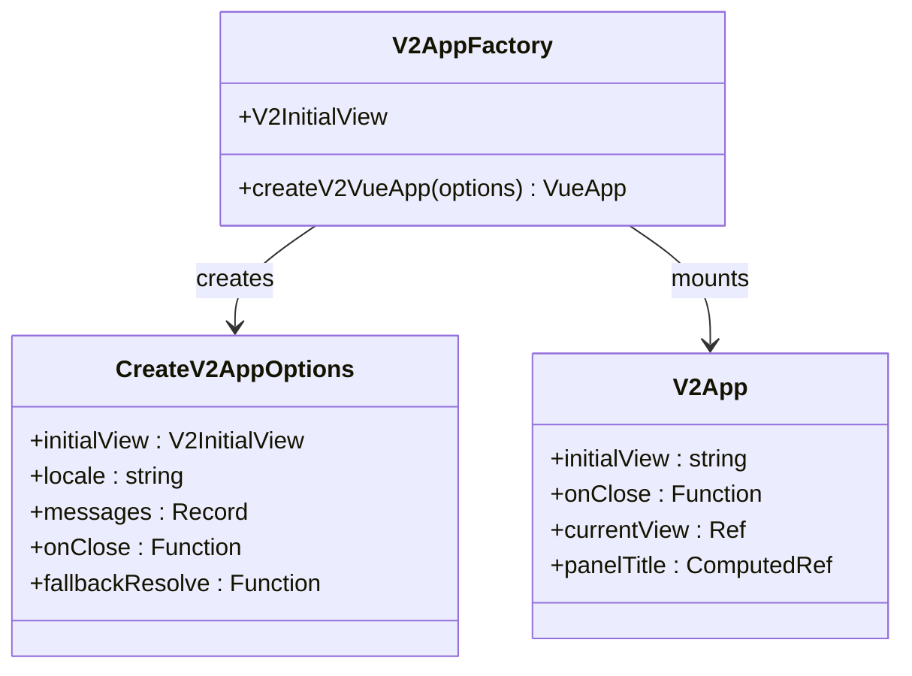

**图表来源**
- [src/v2/createV2App.ts:8-36](file://src/v2/createV2App.ts#L8-L36)
- [src/components/v2/V2App.vue:115-144](file://src/components/v2/V2App.vue#L115-L144)

### 统一工作壳

`UnifiedWorkspaceShell` 是 V2 的核心布局组件，支持快速发布和设置两种视图模式：

| 视图类型 | 网格布局 | 导航区域 | 内容区域 |
|---------|----------|----------|----------|
| 快速发布 | 1列网格 | 隐藏 | 展开 |
| 设置模式 | 196px + 1fr | 展开 | 展开 |

**章节来源**
- [src/components/v2/layout/UnifiedWorkspaceShell.vue:1-50](file://src/components/v2/layout/UnifiedWorkspaceShell.vue#L1-L50)
- [src/assets/v2/base.styl:186-245](file://src/assets/v2/base.styl#L186-L245)

## 架构概览

UI V2 迁移采用分层架构设计，确保平滑的用户体验和可维护性：

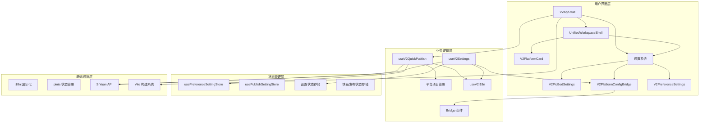

**图表来源**
- [src/components/v2/V2App.vue:104-144](file://src/components/v2/V2App.vue#L104-L144)
- [src/composables/v2/useV2QuickPublish.ts:19-80](file://src/composables/v2/useV2QuickPublish.ts#L19-L80)
- [src/composables/v2/useV2Settings.ts:43-236](file://src/composables/v2/useV2Settings.ts#L43-L236)
- [src/stores/usePreferenceSettingStore.ts:21-90](file://src/stores/usePreferenceSettingStore.ts#L21-L90)
- [src/stores/usePublishSettingStore.ts:21-90](file://src/stores/usePublishSettingStore.ts#L21-L90)

## 详细组件分析

### 快速发布系统

快速发布系统是 V2 的核心功能，负责展示当前文档的可发布平台：

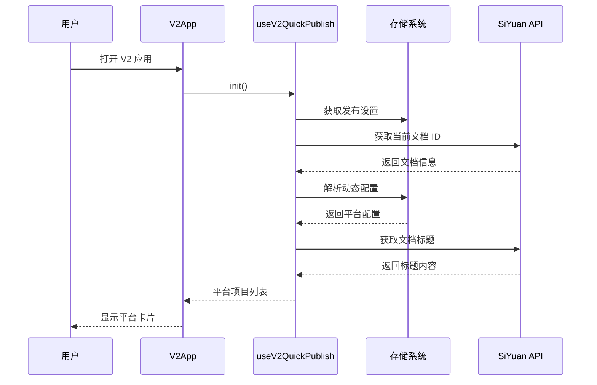

**图表来源**
- [src/components/v2/V2App.vue:129-131](file://src/components/v2/V2App.vue#L129-L131)
- [src/composables/v2/useV2QuickPublish.ts:34-71](file://src/composables/v2/useV2QuickPublish.ts#L34-L71)

### 平台卡片组件

平台卡片组件负责展示单个发布平台的状态和交互：

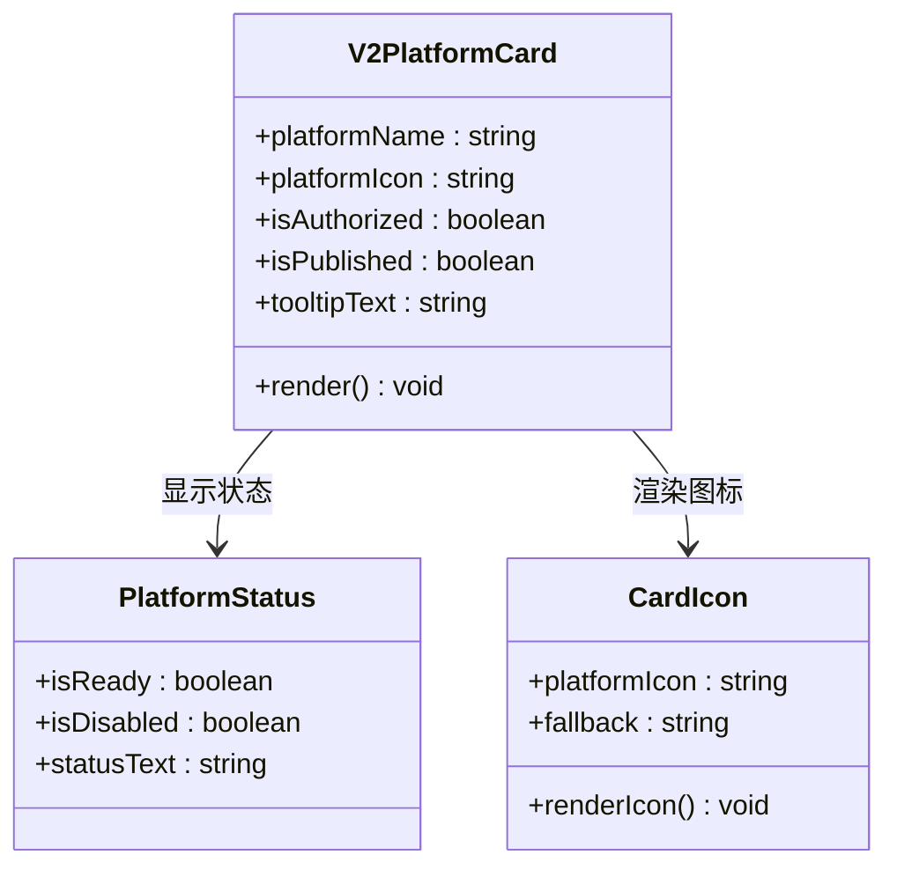

**图表来源**
- [src/components/v2/publish/V2PlatformCard.vue:26-34](file://src/components/v2/publish/V2PlatformCard.vue#L26-L34)

**章节来源**
- [src/components/v2/publish/V2PlatformCard.vue:1-103](file://src/components/v2/publish/V2PlatformCard.vue#L1-L103)

### 样式系统架构

V2 采用模块化的样式系统，确保与思源笔记的原生样式兼容：

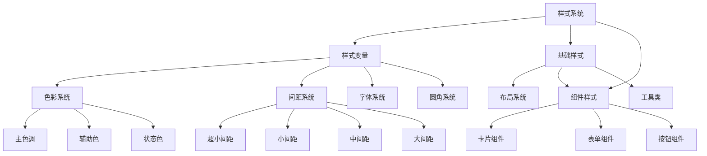

**图表来源**
- [src/assets/v2/variables.styl:1-58](file://src/assets/v2/variables.styl#L1-L58)
- [src/assets/v2/base.styl:11-245](file://src/assets/v2/base.styl#L11-L245)

**章节来源**
- [src/assets/v2/base.styl:1-245](file://src/assets/v2/base.styl#L1-L245)
- [src/assets/v2/variables.styl:1-58](file://src/assets/v2/variables.styl#L1-L58)

## SPA代码退役标准框架

### 8.1 SPA 代码退役标准

#### 8.1.1 术语定义

- **SPA 代码**：指基于 `iframeDialog.ts` + Vue Router + `src/pages/*` + `src/components/set/*` 的历史页面体系，包含路由配置、页面组件、对话框逻辑和旧设置表单
- **V2 架构**：指基于 `V2Host`（思源原生 Menu 挂载）+ `createV2VueApp`（Vue 工厂）+ `UnifiedWorkspaceShell`（统一工作壳）+ `src/components/v2/*` 的原生 DOM 挂载体系
- **桥接组件**：指 `V2PlatformConfigBridge` 通过 `bridgeRegistry.ts` 复用的旧平台配置组件（如 `WordpressSetting.vue`、`CnblogsSetting.vue` 等），这些组件被 V1 SPA 和 V2 同时引用
- **功能等价性**：V2 实现覆盖对应 SPA 页面的全部用户可见功能和交互路径，用户可以在不感知差异的情况下完成相同任务

#### 8.1.2 SPA 代码分类

按当前仓库实际状况，SPA 代码分为三类：

| 分类 | 说明 | 当前实例 |
|------|------|----------|
| **可替代核心功能** | V2 已实现等价功能，可直接替换 | 快速发布、账号列表、平台选择、图床设置、偏好设置 |
| **桥接依赖功能** | V2 已桥接，但底层仍依赖旧组件 | 26 个平台的配置表单（`V2PlatformConfigBridge`） |
| **未迁移功能** | V2 尚无等价实现，必须保留 | 常规发布、批量分发、AI 聊天、文章管理、测试页面、关于页面 |

#### 8.1.3 安全移除条件

某段 SPA 代码被认定为**可以安全移除**，必须同时满足以下全部条件：

1. **功能等价性**：V2 实现覆盖该 SPA 页面的全部用户可见功能和交互路径，不存在 V2 缺失但 SPA 存在的操作
2. **数据兼容性**：V2 实现读写与 SPA 页面相同的数据格式和存储位置（`usePublishSettingStore` / `PreferenceConfigManager`），不引入新的持久化格式
3. **调用链替换**：所有调用该 SPA 页面的入口（`topbar.ts`、`widgetInvoke.ts`、文档菜单）已切换到 V2 路径（`V2Host.show()`）
4. **稳定性验证**：该 V2 功能已在至少一个完整里程碑周期内稳定运行，无阻断性 bug
5. **回退可行性**：即使移除该 SPA 代码，关闭 `useV2UI` 开关后，用户仍能通过其他 SPA 路径或降级方案完成相同任务
6. **非插件构建目标引用检查**：该 SPA 页面/路由未被 Chrome Extension / Nginx / Vercel 等非插件构建目标引用；若仍被引用，则仅从插件运行时路径退役（隐藏入口、替换调用），代码保留

> **"退役"定义**：在本标准中，"退役"指从思源插件运行时路径中移除 SPA 依赖（隐藏 iframe 入口、替换为 `V2Host.show()` 调用），而非从代码库中删除 SPA 代码。由于 Chrome Extension / Nginx / Vercel 继续使用 SPA，代码库删除仅在所有构建目标均已迁移后方可进行（参见 7.8.5）。

#### 8.1.4 必须移除条件

某段 SPA 代码满足以下**任一条件**时，即触发移除：

1. **维护负担**：该 SPA 页面依赖的第三方库版本已停止维护，存在已知安全风险且无法升级
2. **技术债务**：该 SPA 页面阻塞了 V2 的进一步演进（如全局样式冲突、Vue Router 与 V2 状态管理冲突、构建产物体积膨胀）
3. **双系统成本**：同一功能在 SPA 和 V2 中并行维护，维护成本已超过保留价值，且 V2 路径已稳定
4. **用户覆盖率**：该功能的 V2 实现已达到 100% 用户可用状态超过一个稳定版本周期，旧路径无活跃使用

#### 8.1.5 仍需保留条件

某段 SPA 代码满足以下**任一条件**时，必须保留作为兼容层：

1. **功能缺失**：V2 尚未实现该 SPA 页面的等价功能（如常规发布、批量分发、AI 聊天）
2. **桥接未完成**：该 SPA 承载的功能被 V2 部分桥接，但桥接范围未覆盖全部子类型（如平台配置桥接目前覆盖 26 个子类型，若新增平台尚未桥接）
3. **回退依赖**：V2 功能开关（`useV2UI`）关闭后，用户必须能完整回退到旧体验，此时被回退依赖的 SPA 页面不可移除
4. **外部依赖**：其他尚未迁移的 SPA 页面通过路由跳转、组件引用或共享状态依赖该页面
5. **测试依赖**：自动化测试或手工 smoke 测试仍依赖该 SPA 路径验证旧功能
6. **非插件构建目标依赖**：该 SPA 页面/路由仍被 Chrome Extension / Nginx / Vercel 等非插件构建目标引用（此时仅从插件运行时路径退役，代码保留）

#### 8.1.6 转换边界定义

从 iframe SPA 到原生 DOM 挂载的转换边界按以下四层划分：

**边界 1 —— 入口层边界**
- SPA 侧：`widgetInvoke.ts` 中的 `showPage()` / `showTab()` 调用，`topbar.ts` 中的旧菜单调用
- V2 侧：`V2Host.show()` 调用
- **判定**：当某功能的 `widgetInvoke` / `topbar` 调用已被替换为 `V2Host.show()` 时，该功能的入口边界已转换

**边界 2 —— 视图层边界**
- SPA 侧：`src/pages/*.vue` 页面组件 + `routeConfig.ts` 中的 Vue Router 路由
- V2 侧：`src/components/v2/*.vue` 组件 + `V2App.vue` 中的条件渲染（`v-if` / `v-else-if`）
- **判定**：当某页面组件在 V2 中有等价实现且不再被 iframe 加载时，视图边界已转换

**边界 3 —— 配置层边界**
- SPA 侧：`src/stores/*` 中的旧配置读取逻辑（部分页面直接操作 `window.localStorage`）
- V2 侧：`usePublishSettingStore` / `PreferenceConfigManager` 统一读写
- **判定**：当某功能的所有配置读写都通过统一 Store 完成，不再存在双读双写时，配置边界已转换

**边界 4 —— 国际化边界**
- SPA 侧：`src/locales/*` 中的 key（`t("key")` 调用）
- V2 侧：`siyuan/i18n/*` 中的 key + `useV2I18n` fallback 机制
- **判定**：当某功能的所有用户可见文案都已镜像到 `siyuan/i18n/*`，且 V2 不再新增 `src/locales/*` key 时，国际化边界已转换

#### 8.1.7 功能完全迁移判定标准

判断某个功能已**完全**从 SPA 迁移到 V2 架构，必须通过以下检查清单：

- [ ] 该功能的所有用户交互路径在 V2 中已实现，无操作断点
- [ ] 该功能的 V2 实现不依赖 iframe 加载任何 SPA 页面（包括嵌套 iframe）
- [ ] 该功能的数据读写格式与 SPA 版本一致，共享同一持久化存储（`PreferenceConfigManager` / `usePublishSettingStore`）
- [ ] 该功能的入口调用（`topbar.ts` / `widgetInvoke.ts` / 文档菜单）已切换到 `V2Host`
- [ ] 该功能的国际化 key 已收拢到 `siyuan/i18n/*`，且 `src/locales/*` 中无新增依赖
- [ ] 该功能在至少一个发布周期内未收到 V2 路径的阻断性 bug 反馈
- [ ] 该功能的 V2 实现有明确的回退策略（关闭 `useV2UI` 后仍可回退到 SPA 或其他可用路径）
- [ ] 该功能对应的 SPA 路由在 `routeConfig.ts` 中已被标记为废弃或已移除
- [ ] 该 SPA 页面/路由未被非插件构建目标（Chrome Extension / Nginx / Vercel）引用，或仅完成插件路径退役（代码保留）

#### 8.1.8 进度衡量指标

衡量 SPA 代码退役进度的量化指标体系：

**指标 1 —— 页面退役率**
```
页面退役率 = 已移除的 SPA 页面数 / 总 SPA 页面数
```
- 当前总 SPA 页面：按 `routeConfig.ts` 统计约 20 个路由对应页面/组件
- 目标：Phase 5 达到 100%

**指标 2 —— 入口切换率**
```
入口切换率 = 已切换到 V2Host 的功能入口数 / 总功能入口数
```
- 当前总功能入口：按 `topbar.ts` + `widgetInvoke.ts` 统计约 10 个
- 当前状态：顶栏快速发布、发布设置已切换（2/10 = 20%）
- 目标：Phase 3 达到 80%+

**指标 3 —— 路由收敛率**
```
路由收敛率 = 已废弃的 routeConfig 路由数 / 总路由数
```
- 当前总路由数：`routeConfig.ts` 中约 20 条路由
- 目标：Phase 5 达到 100%

**指标 4 —— i18n 收敛率**
```
i18n 收敛率 = 已镜像到 siyuan/i18n 的 V2 key 数 / V2 总 key 数
```
- 当前状态：V2 新增 key 已 100% 在 `siyuan/i18n/*` 中
- 目标：始终保持 100%，禁止新增 `src/locales/*` key

**指标 5 —— 桥接覆盖率**
```
桥接覆盖率 = V2 已桥接的平台子类型数 / 总平台子类型数
```
- 当前状态：26 个桥接子类型 / 总平台子类型（约 30+）
- 目标：Phase 4 逐步提升到 100%，然后启动桥接替换（用 V2 原生表单替换桥接）

**指标 6 —— 版本稳定性指标**
```
版本稳定性 = 连续无阻断性 bug 的版本数
```
- 判定标准：连续 2 个次要版本或 1 个主要版本无 V2 阻断性 bug
- 目标：每个里程碑退出前必须达到

#### 8.1.9 实施路线图

**Phase 1 —— 稳定期（当前，Milestone 4 阶段）**
- 目标：V2 核心功能（快速发布 + 设置展开态）稳定运行
- SPA 状态：全部保留，无移除
- 判定条件：Milestone 4 退出条件达成（新增账号流程可用、图床设置可展示与保存、偏好设置可展示与保存）

**Phase 2 —— 核心退役（Milestone 5-6）**
- 目标：将已有 V2 等价实现的功能从 `widgetInvoke.ts` 中移除 iframe 调用
- SPA 状态：发布设置（`/setting/publish`）路由可标记为废弃；账号设置、图床设置、偏好设置的旧 iframe 入口可隐藏
- 判定条件：上述功能的 V2 路径连续两个版本无阻断性 bug，且 `useV2UI` 默认开启后无用户投诉

**Phase 3 —— 全面退役（Milestone 6 之后）**
- 目标：常规发布、批量分发、AI 聊天、文章管理等剩余功能迁移到 V2
- SPA 状态：仅保留测试页面、关于页面等低频或开发辅助功能
- 判定条件：上述功能在 V2 中实现并通过功能等价性检查清单

**Phase 4 —— 桥接替换（长期）**
- 目标：用 V2 原生平台配置表单逐步替换 `V2PlatformConfigBridge` 对旧组件的依赖
- SPA 状态：可逐步移除 `src/components/set/publish/singleplatform/*` 中已被替换的组件
- 判定条件：某平台子类型的 V2 原生表单已实现、通过测试，且该平台在 V1 中已无直接引用

**Phase 5 —— 终局清理（V2 稳定发布后）**
- 目标：移除 `iframeDialog.ts`、Vue Router（`routeConfig.ts`）、所有 SPA 页面组件（`src/pages/*`）
- SPA 状态：完全退役
- 判定条件：`useV2UI` 开关默认值设为 `true`，旧入口全部移除，连续一个主版本周期（如 3.0.0 到 4.0.0）无回退需求

**章节来源**
- [openspec/changes/refactor-ui-v2-foundation/design.md:557-775](file://openspec/changes/refactor-ui-v2-foundation/design.md#L557-L775)

## V2状态层设计规范

### 8.2 V2 状态层设计原则

V2 UI 状态层采用本地组合式函数而非全局 Pinia 存储的设计原则：

#### 8.2.1 状态生命周期管理

V2 状态本质是局部 UI 状态，生命周期跟随 V2Host 的打开/关闭：

- **临时性状态**：快速发布状态、设置界面状态、表单输入状态等
- **会话隔离**：每个 V2 实例拥有独立状态，不会泄漏到下一个会话
- **自动清理**：面板关闭后自动清理所有 UI 状态

#### 8.2.2 组合式函数模式

V2 采用 Vue Composable 模式管理状态，而非新增 Pinia Store：

**useV2QuickPublish**
- 负责：快速发布主界面的平台列表、发布状态、预览链接
- 内部使用 `reactive` 持有 UI 状态
- 复用 `usePublish()`、`usePublishConfig()` 等业务逻辑

**useV2Settings**
- 负责：设置展开态的导航、账号列表、平台选择、配置桥接上下文
- 内部使用 `reactive` 持有 UI 状态
- 复用 `usePublishSettingStore()` 读写持久化配置

#### 8.2.3 业务配置与UI状态分离

- **业务配置**：继续使用现有的共享存储（如 `usePublishSettingStore`）
- **UI状态**：使用本地组合式函数管理，不使用全局 Pinia
- **数据流向**：业务数据通过存储层，UI状态通过组合式函数

#### 8.2.4 状态管理模式

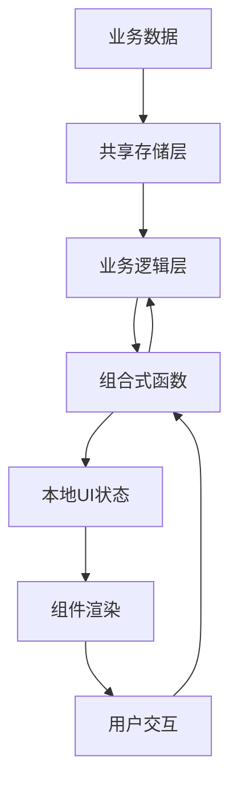

**章节来源**
- [openspec/changes/refactor-ui-v2-foundation/design.md:269-318](file://openspec/changes/refactor-ui-v2-foundation/design.md#L269-L318)
- [src/composables/v2/useV2Settings.ts:42-250](file://src/composables/v2/useV2Settings.ts#L42-L250)
- [src/composables/v2/useV2QuickPublish.ts:26-312](file://src/composables/v2/useV2QuickPublish.ts#L26-L312)

## 构建链复用策略

### 8.3 V2 构建链复用规范

V2 构建链必须复用现有 Vite 配置，不引入独立构建链：

#### 8.3.1 构建配置复用

**V2 源文件编译规则**：
- V2 源文件通过现有 `vite.config.ts` 编译
- 不需要额外的构建脚本或配置文件
- 保持与现有构建流程的一致性

**构建配置特点**：
- 支持 Vue SFC 组件编译
- 自动导入和组件解析
- Node polyfills 支持
- 热重载和开发服务器

#### 8.3.2 Vite 配置分析

现有 Vite 配置支持 V2 开发：

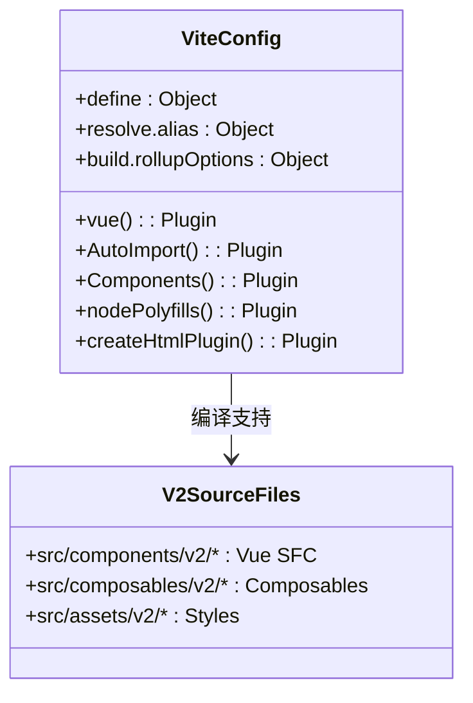

**图表来源**
- [vite.config.ts:81-275](file://vite.config.ts#L81-L275)

#### 8.3.3 V2 专用配置文件

虽然 V2 源文件复用主配置，但仍可使用独立的 V2 配置文件进行特殊处理：

**vite.v2.config.ts 功能**：
- 专门用于 V2 插件构建
- 复制静态资源到 dist-v2 目录
- 支持独立的输出目录
- 提供 V2 特定的构建选项

**章节来源**
- [openspec/changes/refactor-ui-v2-foundation/specs/ui-v2-migration/spec.md:277-287](file://openspec/changes/refactor-ui-v2-foundation/specs/ui-v2-migration/spec.md#L277-L287)
- [vite.v2.config.ts:1-137](file://vite.v2.config.ts#L1-L137)
- [vite.config.ts:1-275](file://vite.config.ts#L1-L275)

## 设置系统架构

### 设置组件体系

V2 引入了三个核心设置组件，形成完整的设置管理系统：

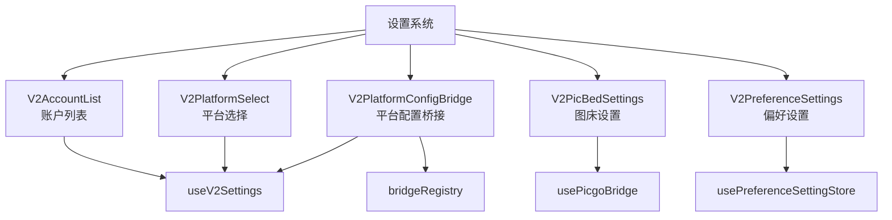

**图表来源**
- [src/components/v2/settings/V2AccountList.vue:1-200](file://src/components/v2/settings/V2AccountList.vue#L1-L200)
- [src/components/v2/settings/V2PlatformSelect.vue:1-106](file://src/components/v2/settings/V2PlatformSelect.vue#L1-L106)
- [src/components/v2/settings/V2PlatformConfigBridge.vue:1-175](file://src/components/v2/settings/V2PlatformConfigBridge.vue#L1-L175)
- [src/components/v2/settings/V2PicBedSettings.vue:1-272](file://src/components/v2/settings/V2PicBedSettings.vue#L1-L272)
- [src/components/v2/settings/V2PreferenceSettings.vue:1-238](file://src/components/v2/settings/V2PreferenceSettings.vue#L1-L238)

### 设置导航结构

统一工作壳提供了清晰的设置导航结构：

| 导航项 | 对应组件 | 功能描述 |
|--------|----------|----------|
| 账户 | V2AccountList | 显示和管理已配置的发布账户 |
| 图床 | V2PicBedSettings | 配置各平台的图床服务 |
| 偏好 | V2PreferenceSettings | 设置插件的运行偏好 |

### 平台配置桥接系统

V2PlatformConfigBridge 通过 bridgeRegistry 实现平台配置的桥接：

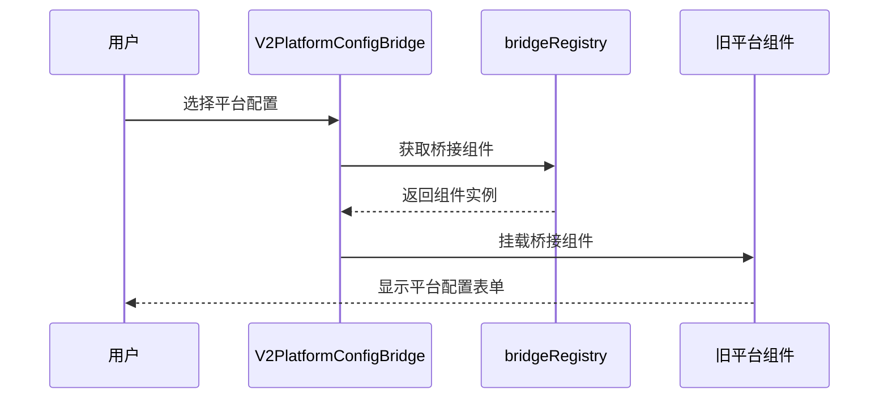

**图表来源**
- [src/components/v2/settings/V2PlatformConfigBridge.vue:46-108](file://src/components/v2/settings/V2PlatformConfigBridge.vue#L46-L108)
- [src/components/v2/settings/bridge/bridgeRegistry.ts:69-79](file://src/components/v2/settings/bridge/bridgeRegistry.ts#L69-L79)

**章节来源**
- [src/components/v2/layout/UnifiedWorkspaceShell.vue:42-48](file://src/components/v2/layout/UnifiedWorkspaceShell.vue#L42-L48)
- [src/components/v2/V2App.vue:111-133](file://src/components/v2/V2App.vue#L111-L133)

## 依赖关系分析

UI V2 迁移涉及的关键依赖关系如下：

```mermaid
graph LR
subgraph "核心依赖"
Vue[Vue 3.5.24]
Pinia[Pinia 3.0.4]
I18n[vue-i18n 11.1.12]
Router[vue-router 4.6.3]
end
subgraph "构建工具"
Vite[Vite 7.2.2]
TS[TypeScript 5.9.3]
Stylus[Stylus 0.64.0]
end
subgraph "第三方库"
ElementPlus[Element Plus 2.11.8]
Icons[@iconify/json 2.2.408]
Device[zhi-device 2.12.0]
Fetch[zhi-fetch-middleware 0.13.5]
end
subgraph "平台集成"
SiYuan[siyuan 1.1.5]
BlogAPI[zhi-blog-api 1.74.2]
XMLRPC[zhi-xmlrpc-middleware 0.6.26]
end
Vue --> Pinia
Vue --> I18n
Vue --> Router
Vite --> Vue
Vite --> TS
Vite --> Stylus
Vue --> ElementPlus
Vue --> Icons
Vue --> Device
Vue --> Fetch
Vue --> SiYuan
Vue --> BlogAPI
Vue --> XMLRPC
```

**图表来源**
- [package.json:32-69](file://package.json#L32-L69)
- [package.json:70-99](file://package.json#L70-L99)

**章节来源**
- [package.json:1-102](file://package.json#L1-L102)

## 性能考虑

### 构建优化

V2 构建系统采用了多项优化策略：

- **独立构建链路**：通过 `vite.v2.config.ts` 实现 V2 专属构建配置
- **按需加载**：使用 `unplugin-auto-import` 和 `unplugin-vue-components` 实现组件和 API 的自动导入
- **资源优化**：CSS 代码分割和静态资源处理
- **开发体验**：支持热重载和文件监听

### 运行时性能

- **状态管理**：使用 Pinia 进行轻量级状态管理
- **组件懒加载**：按需加载平台设置组件
- **内存优化**：合理清理事件监听器和定时器
- **网络请求**：使用中间件模式优化 API 调用

## 故障排除指南

### 常见问题及解决方案

| 问题类型 | 症状描述 | 可能原因 | 解决方案 |
|---------|----------|----------|----------|
| 应用启动失败 | V2 应用无法打开 | 构建配置错误 | 检查 `vite.v2.config.ts` 配置 |
| 平台列表为空 | 快速发布界面显示空状态 | 配置读取失败 | 验证 `usePreferenceSettingStore` |
| 样式冲突 | 组件样式异常 | CSS 作用域问题 | 检查 `.syp-v2` 命名空间 |
| 国际化失效 | 界面文本显示异常 | i18n 配置错误 | 验证 `createV2VueApp` 参数 |
| 平台授权失败 | 平台状态显示未授权 | API 调用异常 | 检查平台配置和网络连接 |
| 设置组件加载失败 | 设置页面空白或报错 | 组件依赖缺失 | 验证相关依赖包安装 |
| SPA 代码退役失败 | 旧代码无法移除 | 功能等价性检查未通过 | 完成 V2 等价功能实现 |

### 调试工具

- **开发模式**：使用 `npm run dev:v2` 启动 V2 开发服务器
- **构建验证**：使用 `npm run build:v2` 验证构建过程
- **链接测试**：使用 `npm run makeLink:v2` 测试 V2 插件链接

**章节来源**
- [vite.v2.config.ts:59-137](file://vite.v2.config.ts#L59-L137)
- [package.json:9-31](file://package.json#L9-L31)

## 里程碑进度与稳定发布策略

### 统一工作壳批准状态

经过团队评审，统一工作壳模型已在 **1.1** 节点获得批准，标志着 V2 迁移项目的正式启动。统一工作壳的设计原则包括：

- **单一工作壳**：快速发布和设置功能共享同一工作壳
- **动态布局**：根据当前任务状态动态调整布局
- **品牌一致性**：保持与思源笔记原生 UI 的视觉一致性

### 当前里程碑进度

项目已成功完成前五个里程碑，进入稳定发展阶段：

**Milestone 0：入口与治理基座** ✅ 已完成
- 统一顶栏主入口行为
- 统一偏好配置读取通道
- 建立 `V2Host` 和回退机制
- 新增独立构建入口

**Milestone 1：样式系统与统一工作壳骨架** ✅ 已完成
- 统一 V2 样式入口
- 建立设计令牌系统
- 实现 `UnifiedWorkspaceShell` 骨架

**Milestone 2：快速发布主界面** ✅ 已完成
- 实现主界面态
- 展示当前文档上下文
- 展示真实平台列表

**Milestone 3：发布动作闭环** ✅ 已完成
- 接入单平台发布
- 发布状态反馈
- 失败重试机制

**Milestone 4：设置展开态第一阶段** ✅ 已完成
- 账户设置列表
- 平台选择流程
- 图床设置内容区
- 偏好设置内容区
- 平台配置桥接组件
- SPA 代码退役标准框架建立

**Milestone 5：设置展开态第二阶段** 🔄 进行中
- 更多平台配置桥接
- 设置态交互打磨
- 高频设置路径稳定化
- 桥接组件的国际化适配
- SPA 代码退役标准实施

**Milestone 6：收敛与稳定发布** 🔄 未开始
- 旧 UI 收敛清单制定
- V2 稳定发布策略
- 回退路径确认
- iframe 退役计划

### 稳定发布策略

Milestone 6 专注于项目的稳定发布和长期维护策略：

#### 1. 旧 UI 收敛策略
- **统计分析**：统计仍依赖旧 UI 的功能模块
- **迁移评估**：评估各模块的迁移优先级
- **时间规划**：制定详细的废弃时间表
- **风险控制**：确保迁移过程不影响用户正常使用

#### 2. V2 稳定发布策略
- **质量标准**：建立稳定的发布质量标准
- **回归测试**：完善自动化回归测试
- **性能监控**：建立性能指标监控体系
- **用户反馈**：收集用户使用反馈

#### 3. 回退路径保障
- **兼容性检查**：确保回退路径的兼容性
- **数据迁移**：提供平滑的数据迁移方案
- **技术支持**：建立专门的技术支持渠道
- **文档完善**：更新相关技术文档

#### 4. iframe 退役计划
- **功能映射**：建立 iframe 功能到 DOM 组件的映射表
- **替代方案**：为每个 iframe 功能提供 DOM 替代方案
- **迁移清单**：制定详细的迁移时间表
- **测试验证**：确保替代方案的功能完整性

### 渐进迁移过程

从传统 UI 到 V2 的迁移采用渐进式策略，确保平滑过渡：

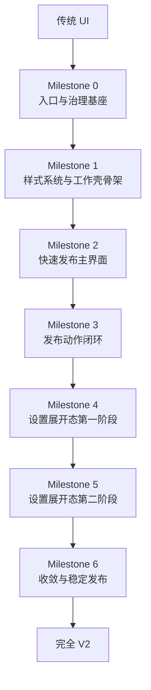

**章节来源**
- [openspec/changes/refactor-ui-v2-foundation/tasks.md:1-80](file://openspec/changes/refactor-ui-v2-foundation/tasks.md#L1-L80)
- [openspec/changes/refactor-ui-v2-foundation/specs/ui-v2-migration/spec.md:1-287](file://openspec/changes/refactor-ui-v2-foundation/specs/ui-v2-migration/spec.md#L1-L287)
- [openspec/changes/refactor-ui-v2-foundation/design.md:1-576](file://openspec/changes/refactor-ui-v2-foundation/design.md#L1-L576)

## 代码审计指南

### 9.1 架构接线审计

基于最新的910行架构接线与代码审计指南，建议按照以下顺序进行代码审计：

#### 第一轮：建立入口与壳
1. [`siyuan/index.ts`](siyuan/index.ts) - 插件宿主入口
2. [`siyuan/topbar.ts`](siyuan/topbar.ts) - 顶栏主入口与 V2/旧 UI 分流
3. [`siyuan/invoke/widgetInvoke.ts`](siyuan/invoke/widgetInvoke.ts) - 插件/挂件侧入口分流
4. [`siyuan/v2/v2Host.ts`](siyuan/v2/v2Host.ts) - V2 原生 DOM 宿主
5. [`src/v2/createV2App.ts`](src/v2/createV2App.ts) - V2 Vue 工厂
6. [`src/components/v2/V2App.vue`](src/components/v2/V2App.vue) - V2 根组件

#### 第二轮：查看 V2 状态和共享业务
7. [`src/composables/v2/useV2QuickPublish.ts`](src/composables/v2/useV2QuickPublish.ts) - V2 快速发布状态
8. [`src/composables/v2/useV2Settings.ts`](src/composables/v2/useV2Settings.ts) - V2 设置状态
9. [`src/composables/usePublish.ts`](src/composables/usePublish.ts) - 共享发布业务
10. [`src/composables/usePublishConfig.ts`](src/composables/usePublishConfig.ts) - 共享平台配置解析
11. [`src/composables/useSiyuanApi.ts`](src/composables/useSiyuanApi.ts) - 共享思源 API 封装
12. [`src/stores/usePublishSettingStore.ts`](src/stores/usePublishSettingStore.ts) - 共享发布配置存储

#### 第三轮：最后查看旧系统残留
13. [`siyuan/iframeDialog.ts`](siyuan/iframeDialog.ts) - 旧 iframe 承载
14. [`src/main.ts`](src/main.ts) - 旧 SPA 启动入口
15. [`src/bootstrap.ts`](src/bootstrap.ts) - 旧 SPA 启动入口
16. [`src/routes/routeConfig.ts`](src/routes/routeConfig.ts) - 旧 SPA 路由配置
17. [`src/workers/QuickPublish.vue`](src/workers/QuickPublish.vue) - 旧 quick publish worker
18. [`src/components/v2/settings/bridge/bridgeRegistry.ts`](src/components/v2/settings/bridge/bridgeRegistry.ts) - 桥接注册表

### 9.2 关键审计断点

在代码审计过程中，建议重点关注以下断点：

1. **入口边界审计**：`siyuan/topbar.ts` - 顶栏点击回调进入处
2. **宿主边界审计**：`siyuan/v2/v2Host.ts` - `show()` 里 `app.mount(mountPoint)` 前后
3. **组件边界审计**：`src/components/v2/V2App.vue` - `onMounted()` 和 `publishToPlatform()`
4. **状态边界审计**：`src/composables/v2/useV2QuickPublish.ts` - `init()` 和 `publishToPlatform()`
5. **业务边界审计**：`src/composables/usePublish.ts` - `doSinglePublish()`
6. **配置边界审计**：`src/composables/usePublishConfig.ts` - `getPublishCfg()` 和 `getPublishApi()`

### 9.3 当前迁移成熟度判断

根据最新的代码状态，当前迁移成熟度可以这样判断：

> **UI2.0 现在已经把"高频入口 + 工作壳"迁到了原生 DOM，但"业务内核 + 大量旧功能 + 平台表单实现"仍然处于共用/桥接/兼容期。**

当前最重要的审计工作不是"V2 有没有页面"，而是：

1. **入口是否彻底收敛** - 顶栏主入口、插件设置入口是否已切换到 V2
2. **V1/V2 是否行为等价** - 特别是快速发布行为差异（system pre-publish 行为）
3. **桥接层是否只是换壳** - 桥接组件是否真正消除了技术债务
4. **共享配置与状态刷新是否一致** - V1/V2 改同一份数据时的状态一致性

### 9.4 高风险点审计

基于当前代码分析，以下是最值得审计的高风险点：

#### 9.4.1 事件解绑问题
- **问题**：`this.eventBus.off("click-editortitleicon", () => {})` 使用匿名函数解绑
- **风险**：不是同一个函数引用，理论上解绑无效
- **审计要点**：检查事件绑定和解绑是否成对出现

#### 9.4.2 文档菜单配置缓存问题
- **问题**：`PublisherPlugin.onEvent()` 只在 `onLayoutReady()` 时读取一次配置
- **风险**：V2 设置里改了某些偏好/平台开关，文档标题菜单不一定马上同步
- **审计要点**：检查配置缓存策略和状态刷新机制

#### 9.4.3 快速发布行为差异
- **问题**：旧 quick publish worker 会先循环发布所有 `pre.systemCfg`，再发目标平台
- **风险**：V2 quick publish 直接只发当前平台，可能存在功能差异
- **审计要点**：对比新旧快速发布的行为差异和兼容性

#### 9.4.4 当前文档识别问题
- **问题**：V2 当前文档 ID 来自 DOM 推断，不是宿主显式上下文
- **风险**：分屏、多编辑器、特殊 tab 切换场景下的文档识别准确性
- **审计要点**：检查 DOM 启发式算法在各种场景下的可靠性

**章节来源**
- [docs/UI2.0-从SPA到原生DOM挂载-架构接线与代码审计指南.md:1-911](file://docs/UI2.0-从SPA到原生DOM挂载-架构接线与代码审计指南.md#L1-L911)

## 结论

UI V2 迁移规范为思源笔记发布工具提供了一个完整的现代化升级路径。通过遵循渐进式迁移策略和严格的架构设计，项目实现了：

1. **技术架构升级**：从 iframe SPA 迁移到真实 DOM 挂载
2. **用户体验优化**：统一的工作壳设计和流畅的交互体验
3. **可维护性提升**：模块化的组件结构和清晰的依赖关系
4. **扩展性增强**：为未来的功能扩展预留了充足的空间
5. **设置系统完善**：引入专门的设置组件，提供更好的配置体验
6. **代码退役标准化**：建立了完整的 SPA 代码退役标准框架
7. **状态管理规范化**：明确了 V2 状态层使用本地组合式函数的设计原则
8. **构建链复用化**：实现了 V2 构建链复用现有 Vite 配置的规范
9. **架构审计标准化**：提供了完整的代码审计指南和最佳实践

**最新进展**：
- 统一工作壳模型已获批准，为项目提供了清晰的架构指导
- 前四个里程碑已顺利完成，为后续开发奠定了坚实基础
- Milestone 4 成功引入了三个核心设置组件，大幅提升了设置功能
- Milestone 5 正在进行中，重点解决设置系统的国际化和桥接组件优化
- Milestone 6 的稳定发布策略已制定，确保项目的长期健康发展
- SPA 代码退役标准框架已建立，为后续代码清理提供了明确指导
- V2 状态层设计规范已确立，确保了状态管理的最佳实践
- V2 构建链复用策略已实施，避免了重复构建配置的开销
- 910行架构接线与代码审计指南已完整，为开发者提供了详细的审计路径

该规范不仅解决了当前的技术债务，还为插件的长期发展奠定了坚实的基础。通过六个里程碑的有序推进，项目能够在保证稳定性的同时持续演进，最终实现从传统 UI 到现代 UI V2 的完美转换。随着 Milestone 6 的推进和 SPA 代码退役标准的实施，项目将进入稳定发布阶段，为用户提供更加可靠和高效的发布工具。

**当前迁移状态总结**：
- **入口层**：已从 `iframe + SPA` 切换到 **思源原生 Menu + 真实 DOM 挂载**
- **视图层**：V2 有自己的统一工作壳 `V2App + UnifiedWorkspaceShell`
- **业务层**：V2 **没有重写核心发布业务**，而是继续复用老的 `usePublish / usePublishConfig / useSiyuanApi`
- **设置表单层**：平台配置页大部分仍然是 **V2 壳 + 旧表单组件桥接**
- **剩余功能**：常规发布、批量分发、AI、文章管理、测试页、关于页等仍然主要走 **旧 SPA/iframe**

项目正处于从"入口迁移"向"全面迁移"的过渡阶段，需要重点关注桥接组件的国际化适配和 SPA 代码的退役实施。