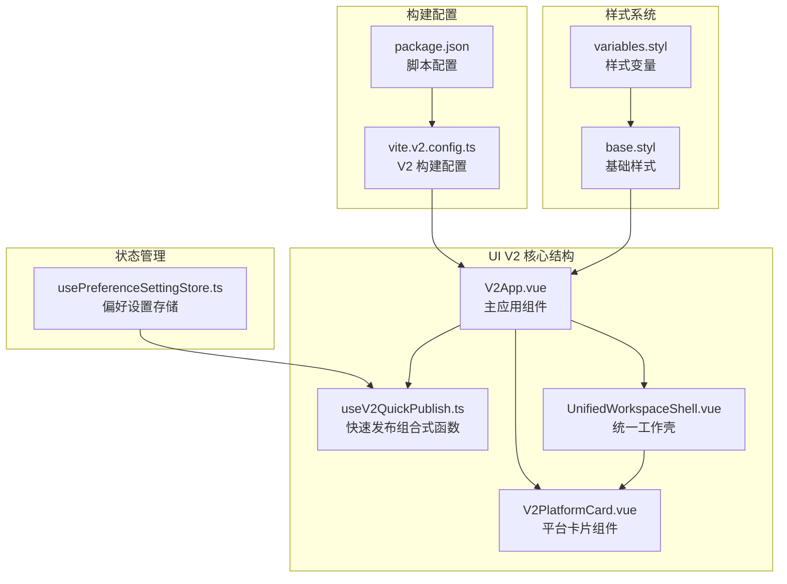
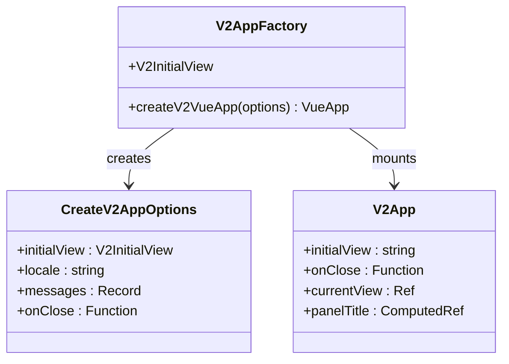
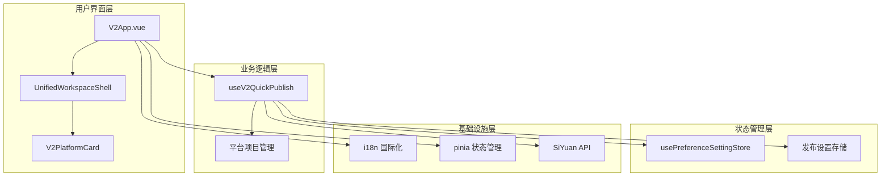
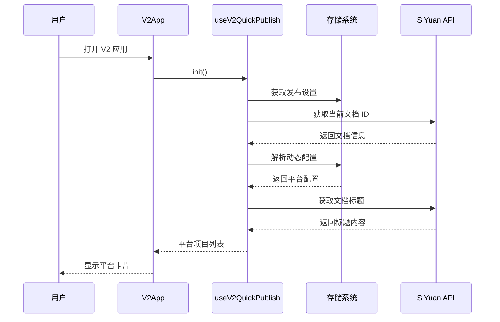
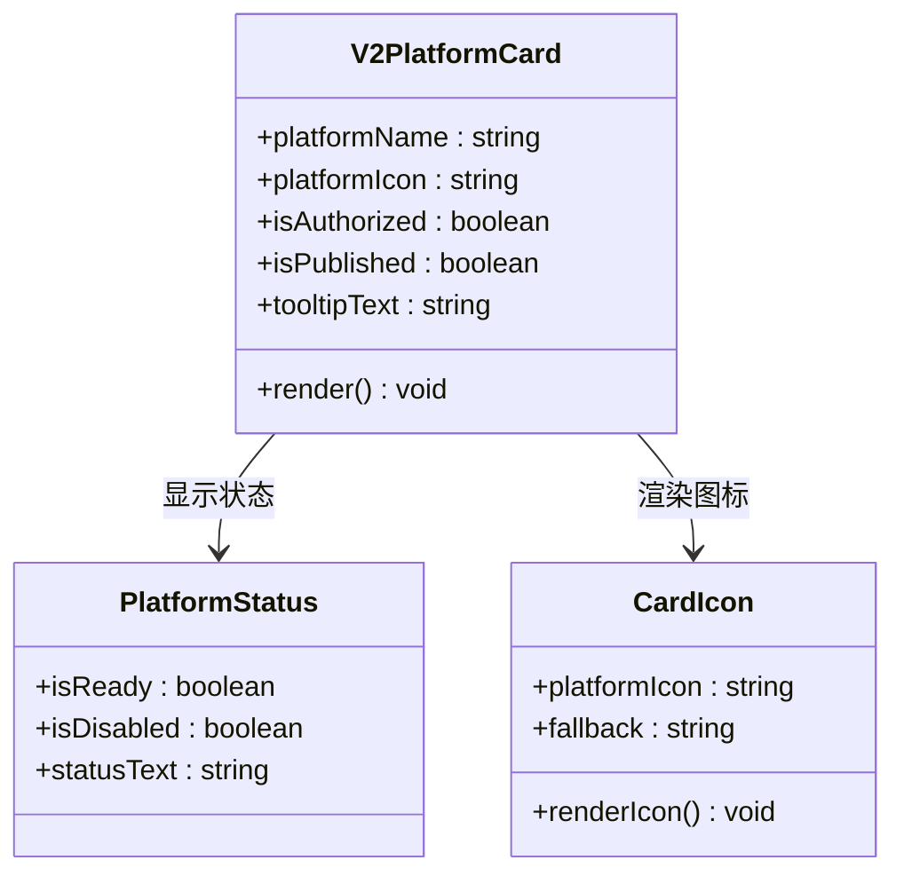
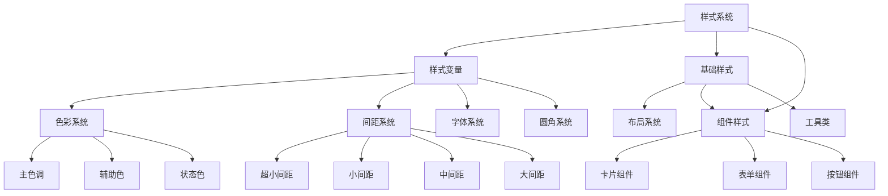
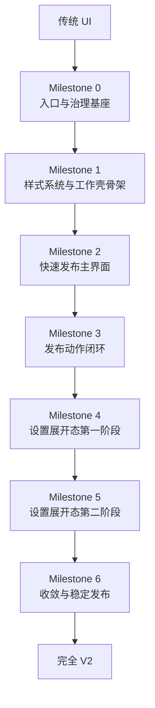

# UI V2 迁移规范

<cite>
**本文档引用的文件**
- [src/v2/createV2App.ts](file://src/v2/createV2App.ts)
- [src/components/v2/V2App.vue](file://src/components/v2/V2App.vue)
- [src/components/v2/layout/UnifiedWorkspaceShell.vue](file://src/components/v2/layout/UnifiedWorkspaceShell.vue)
- [src/components/v2/publish/V2PlatformCard.vue](file://src/components/v2/publish/V2PlatformCard.vue)
- [src/composables/v2/useV2QuickPublish.ts](file://src/composables/v2/useV2QuickPublish.ts)
- [src/assets/v2/base.styl](file://src/assets/v2/base.styl)
- [src/assets/v2/variables.styl](file://src/assets/v2/variables.styl)
- [openspec/changes/refactor-ui-v2-foundation/specs/ui-v2-migration/spec.md](file://openspec/changes/refactor-ui-v2-foundation/specs/ui-v2-migration/spec.md)
- [openspec/changes/refactor-ui-v2-foundation/design.md](file://openspec/changes/refactor-ui-v2-foundation/design.md)
- [openspec/changes/refactor-ui-v2-foundation/tasks.md](file://openspec/changes/refactor-ui-v2-foundation/tasks.md)
- [vite.v2.config.ts](file://vite.v2.config.ts)
- [src/stores/usePreferenceSettingStore.ts](file://src/stores/usePreferenceSettingStore.ts)
- [package.json](file://package.json)
</cite>

## 更新摘要
**变更内容**
- 更新了统一工作壳的批准状态和当前里程碑进度
- 新增了 Milestone 6 收敛与稳定发布的详细规划
- 完善了从传统 UI 到 V2 的渐进迁移过程说明
- 增加了稳定发布策略的具体实施要点

## 目录
1. [简介](#简介)
2. [项目结构](#项目结构)
3. [核心组件](#核心组件)
4. [架构概览](#架构概览)
5. [详细组件分析](#详细组件分析)
6. [依赖关系分析](#依赖关系分析)
7. [性能考虑](#性能考虑)
8. [故障排除指南](#故障排除指南)
9. [里程碑进度与稳定发布策略](#里程碑进度与稳定发布策略)
10. [结论](#结论)

## 简介

UI V2 迁移规范是思源笔记发布工具插件的一个重要升级项目，旨在将现有的 iframe SPA 架构迁移到基于真实 DOM 挂载的现代化 Vue 3 应用。该项目遵循渐进式迁移策略，通过六个里程碑逐步实现从传统 UI 到现代 UI V2 的完整转换。

### 主要目标

- **统一工作壳**：创建单一的 `UnifiedWorkspaceShell` 来承载快速发布和设置功能
- **真实 DOM 挂载**：替代 iframe SPA，直接在插件运行时中渲染
- **原生 UI 优先**：优先使用思源笔记的原生 UI 和样式系统
- **渐进式迁移**：通过里程碑管理的方式有序推进迁移工作

## 项目结构

UI V2 迁移涉及的核心目录结构如下：



**图表来源**
- [src/components/v2/V2App.vue:1-276](file://src/components/v2/V2App.vue#L1-L276)
- [src/components/v2/layout/UnifiedWorkspaceShell.vue:1-40](file://src/components/v2/layout/UnifiedWorkspaceShell.vue#L1-L40)
- [src/assets/v2/base.styl:1-245](file://src/assets/v2/base.styl#L1-L245)

**章节来源**
- [src/v2/createV2App.ts:1-37](file://src/v2/createV2App.ts#L1-L37)
- [vite.v2.config.ts:1-137](file://vite.v2.config.ts#L1-L137)

## 核心组件

### V2 应用入口

V2 应用通过 `createV2VueApp` 工厂函数创建，支持国际化配置和回调处理：



**图表来源**
- [src/v2/createV2App.ts:8-36](file://src/v2/createV2App.ts#L8-L36)
- [src/components/v2/V2App.vue:115-144](file://src/components/v2/V2App.vue#L115-L144)

### 统一工作壳

`UnifiedWorkspaceShell` 是 V2 的核心布局组件，支持快速发布和设置两种视图模式：

| 视图类型 | 网格布局 | 导航区域 | 内容区域 |
|---------|----------|----------|----------|
| 快速发布 | 1列网格 | 隐藏 | 展开 |
| 设置模式 | 196px + 1fr | 展开 | 展开 |

**章节来源**
- [src/components/v2/layout/UnifiedWorkspaceShell.vue:1-40](file://src/components/v2/layout/UnifiedWorkspaceShell.vue#L1-L40)
- [src/assets/v2/base.styl:186-245](file://src/assets/v2/base.styl#L186-L245)

## 架构概览

UI V2 迁移采用分层架构设计，确保平滑的用户体验和可维护性：



**图表来源**
- [src/components/v2/V2App.vue:104-144](file://src/components/v2/V2App.vue#L104-L144)
- [src/composables/v2/useV2QuickPublish.ts:19-80](file://src/composables/v2/useV2QuickPublish.ts#L19-L80)
- [src/stores/usePreferenceSettingStore.ts:21-90](file://src/stores/usePreferenceSettingStore.ts#L21-L90)

## 详细组件分析

### 快速发布系统

快速发布系统是 V2 的核心功能，负责展示当前文档的可发布平台：



**图表来源**
- [src/components/v2/V2App.vue:129-131](file://src/components/v2/V2App.vue#L129-L131)
- [src/composables/v2/useV2QuickPublish.ts:34-71](file://src/composables/v2/useV2QuickPublish.ts#L34-L71)

### 平台卡片组件

平台卡片组件负责展示单个发布平台的状态和交互：



**图表来源**
- [src/components/v2/publish/V2PlatformCard.vue:26-34](file://src/components/v2/publish/V2PlatformCard.vue#L26-L34)

**章节来源**
- [src/components/v2/publish/V2PlatformCard.vue:1-103](file://src/components/v2/publish/V2PlatformCard.vue#L1-L103)

### 样式系统架构

V2 采用模块化的样式系统，确保与思源笔记的原生样式兼容：



**图表来源**
- [src/assets/v2/variables.styl:1-58](file://src/assets/v2/variables.styl#L1-L58)
- [src/assets/v2/base.styl:11-245](file://src/assets/v2/base.styl#L11-L245)

**章节来源**
- [src/assets/v2/base.styl:1-245](file://src/assets/v2/base.styl#L1-L245)
- [src/assets/v2/variables.styl:1-58](file://src/assets/v2/variables.styl#L1-L58)

## 依赖关系分析

UI V2 迁移涉及的关键依赖关系如下：

```mermaid
graph LR
subgraph "核心依赖"
Vue[Vue 3.5.24]
Pinia[Pinia 3.0.4]
I18n[vue-i18n 11.1.12]
Router[vue-router 4.6.3]
end
subgraph "构建工具"
Vite[Vite 7.2.2]
TS[TypeScript 5.9.3]
Stylus[Stylus 0.64.0]
end
subgraph "第三方库"
ElementPlus[Element Plus 2.11.8]
Icons[@iconify/json 2.2.408]
Device[zhi-device 2.12.0]
Fetch[zhi-fetch-middleware 0.13.5]
end
subgraph "平台集成"
SiYuan[siyuan 1.1.5]
BlogAPI[zhi-blog-api 1.74.2]
XMLRPC[zhi-xmlrpc-middleware 0.6.26]
end
Vue --> Pinia
Vue --> I18n
Vue --> Router
Vite --> Vue
Vite --> TS
Vite --> Stylus
Vue --> ElementPlus
Vue --> Icons
Vue --> Device
Vue --> Fetch
Vue --> SiYuan
Vue --> BlogAPI
Vue --> XMLRPC
```

**图表来源**
- [package.json:32-69](file://package.json#L32-L69)
- [package.json:70-99](file://package.json#L70-L99)

**章节来源**
- [package.json:1-102](file://package.json#L1-L102)

## 性能考虑

### 构建优化

V2 构建系统采用了多项优化策略：

- **独立构建链路**：通过 `vite.v2.config.ts` 实现 V2 专属构建配置
- **按需加载**：使用 `unplugin-auto-import` 和 `unplugin-vue-components` 实现组件和 API 的自动导入
- **资源优化**：CSS 代码分割和静态资源处理
- **开发体验**：支持热重载和文件监听

### 运行时性能

- **状态管理**：使用 Pinia 进行轻量级状态管理
- **组件懒加载**：按需加载平台设置组件
- **内存优化**：合理清理事件监听器和定时器
- **网络请求**：使用中间件模式优化 API 调用

## 故障排除指南

### 常见问题及解决方案

| 问题类型 | 症状描述 | 可能原因 | 解决方案 |
|---------|----------|----------|----------|
| 应用启动失败 | V2 应用无法打开 | 构建配置错误 | 检查 `vite.v2.config.ts` 配置 |
| 平台列表为空 | 快速发布界面显示空状态 | 配置读取失败 | 验证 `usePreferenceSettingStore` |
| 样式冲突 | 组件样式异常 | CSS 作用域问题 | 检查 `.syp-v2` 命名空间 |
| 国际化失效 | 界面文本显示异常 | i18n 配置错误 | 验证 `createV2VueApp` 参数 |
| 平台授权失败 | 平台状态显示未授权 | API 调用异常 | 检查平台配置和网络连接 |

### 调试工具

- **开发模式**：使用 `npm run dev:v2` 启动 V2 开发服务器
- **构建验证**：使用 `npm run build:v2` 验证构建过程
- **链接测试**：使用 `npm run makeLink:v2` 测试 V2 插件链接

**章节来源**
- [vite.v2.config.ts:59-137](file://vite.v2.config.ts#L59-L137)
- [package.json:9-31](file://package.json#L9-L31)

## 里程碑进度与稳定发布策略

### 统一工作壳批准状态

经过团队评审，统一工作壳模型已在 **1.1** 节点获得批准，标志着 V2 迁移项目的正式启动。统一工作壳的设计原则包括：

- **单一工作壳**：快速发布和设置功能共享同一工作壳
- **动态布局**：根据当前任务状态动态调整布局
- **品牌一致性**：保持与思源笔记原生 UI 的视觉一致性

### 当前里程碑进度

项目已成功完成前三个里程碑，进入稳定发展阶段：

**Milestone 0：入口与治理基座** ✅ 已完成
- 统一顶栏主入口行为
- 统一偏好配置读取通道
- 建立 `V2Host` 和回退机制
- 新增独立构建入口

**Milestone 1：样式系统与统一工作壳骨架** ✅ 已完成
- 统一 V2 样式入口
- 建立设计令牌系统
- 实现 `UnifiedWorkspaceShell` 骨架

**Milestone 2：快速发布主界面** ✅ 已完成
- 实现主界面态
- 展示当前文档上下文
- 展示真实平台列表

**Milestone 3：发布动作闭环** ✅ 已完成
- 接入单平台发布
- 发布状态反馈
- 失败重试机制

**Milestone 4：设置展开态第一阶段** 🔄 进行中
- 账号设置列表
- 平台选择流程
- 图床设置内容区
- 偏好设置内容区

**Milestone 5：设置展开态第二阶段** 🔄 进行中
- 更多平台配置桥接
- 设置态交互打磨
- 高频设置路径稳定化

**Milestone 6：收敛与稳定发布** 🔄 未开始
- 旧 UI 收敛清单制定
- V2 稳定发布策略
- 回退路径确认
- iframe 退役计划

### 稳定发布策略

Milestone 6 专注于项目的稳定发布和长期维护策略：

#### 1. 旧 UI 收敛策略
- **统计分析**：统计仍依赖旧 UI 的功能模块
- **迁移评估**：评估各模块的迁移优先级
- **时间规划**：制定详细的废弃时间表
- **风险控制**：确保迁移过程不影响用户正常使用

#### 2. V2 稳定发布策略
- **质量标准**：建立稳定的发布质量标准
- **回归测试**：完善自动化回归测试
- **性能监控**：建立性能指标监控体系
- **用户反馈**：收集用户使用反馈

#### 3. 回退路径保障
- **兼容性检查**：确保回退路径的兼容性
- **数据迁移**：提供平滑的数据迁移方案
- **技术支持**：建立专门的技术支持渠道
- **文档完善**：更新相关技术文档

#### 4. iframe 退役计划
- **功能映射**：建立 iframe 功能到 DOM 组件的映射表
- **替代方案**：为每个 iframe 功能提供 DOM 替代方案
- **迁移清单**：制定详细的迁移时间表
- **测试验证**：确保替代方案的功能完整性

### 渐进迁移过程

从传统 UI 到 V2 的迁移采用渐进式策略，确保平滑过渡：



**章节来源**
- [openspec/changes/refactor-ui-v2-foundation/tasks.md:1-75](file://openspec/changes/refactor-ui-v2-foundation/tasks.md#L1-L75)
- [openspec/changes/refactor-ui-v2-foundation/specs/ui-v2-migration/spec.md:1-202](file://openspec/changes/refactor-ui-v2-foundation/specs/ui-v2-migration/spec.md#L1-L202)
- [openspec/changes/refactor-ui-v2-foundation/design.md:1-576](file://openspec/changes/refactor-ui-v2-foundation/design.md#L1-L576)

## 结论

UI V2 迁移规范为思源笔记发布工具提供了一个完整的现代化升级路径。通过遵循渐进式迁移策略和严格的架构设计，项目实现了：

1. **技术架构升级**：从 iframe SPA 迁移到真实 DOM 挂载
2. **用户体验优化**：统一的工作壳设计和流畅的交互体验
3. **可维护性提升**：模块化的组件结构和清晰的依赖关系
4. **扩展性增强**：为未来的功能扩展预留了充足的空间

**最新进展**：
- 统一工作壳模型已获批准，为项目提供了清晰的架构指导
- 前三个里程碑已顺利完成，为后续开发奠定了坚实基础
- Milestone 4 和 5 正在进行中，设置功能的迁移工作稳步推进
- Milestone 6 的稳定发布策略已制定，确保项目的长期健康发展

该规范不仅解决了当前的技术债务，还为插件的长期发展奠定了坚实的基础。通过六个里程碑的有序推进，项目能够在保证稳定性的同时持续演进，最终实现从传统 UI 到现代 UI V2 的完美转换。随着 Milestone 6 的推进，项目将进入稳定发布阶段，为用户提供更加可靠和高效的发布工具。