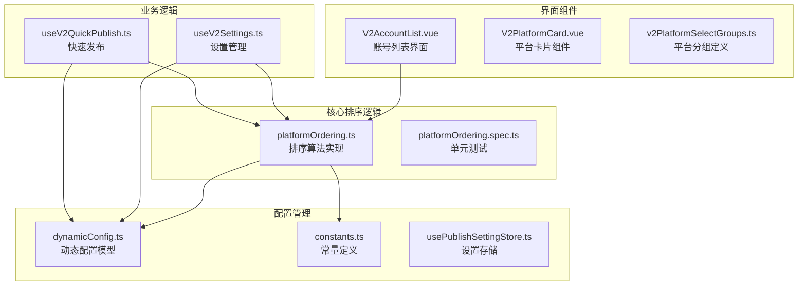
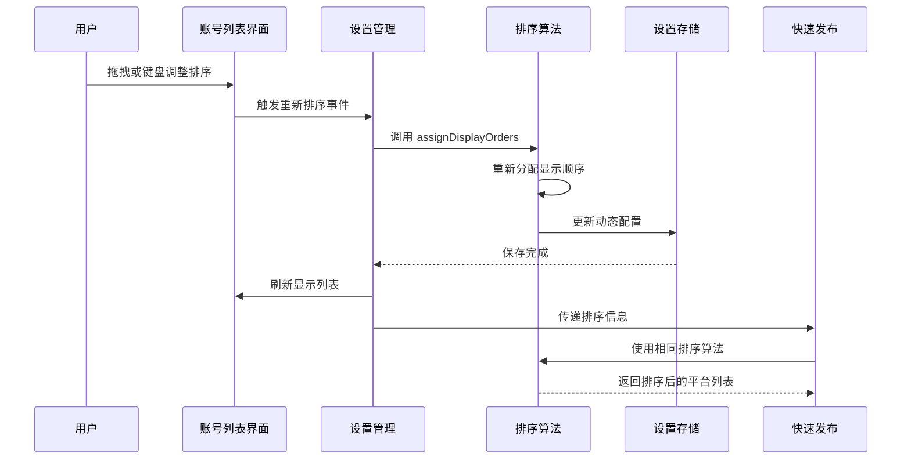
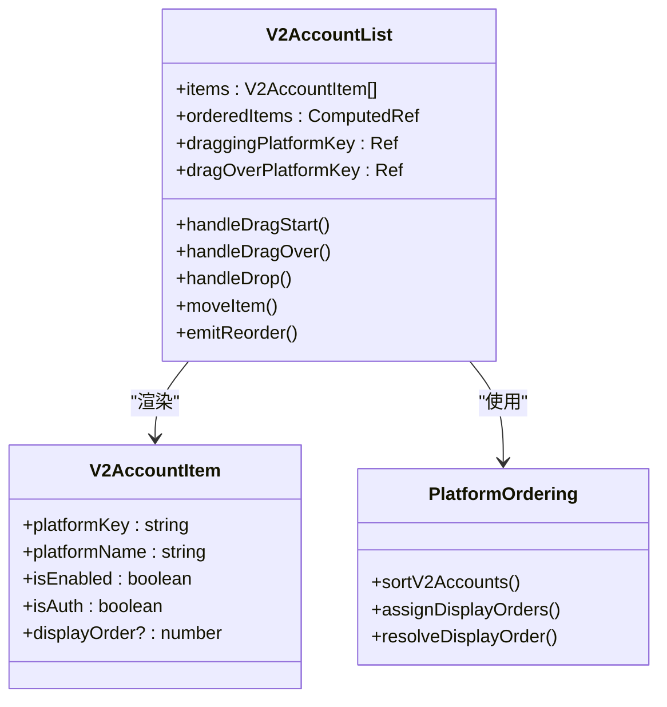
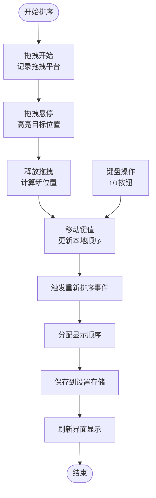
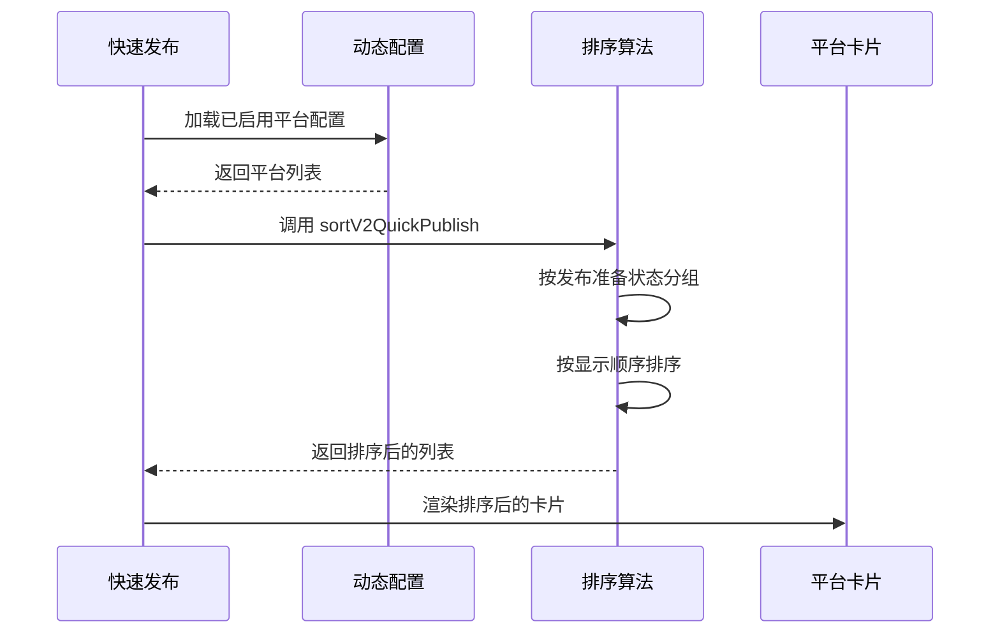
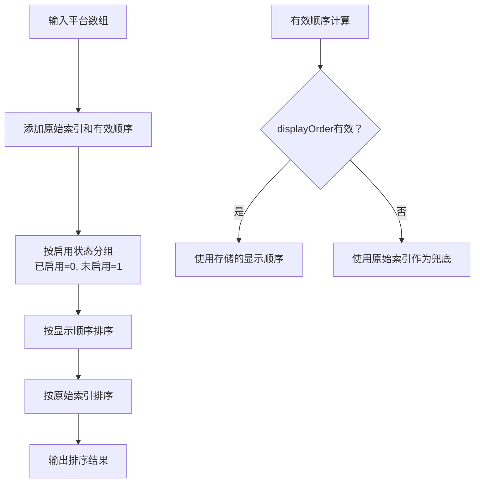
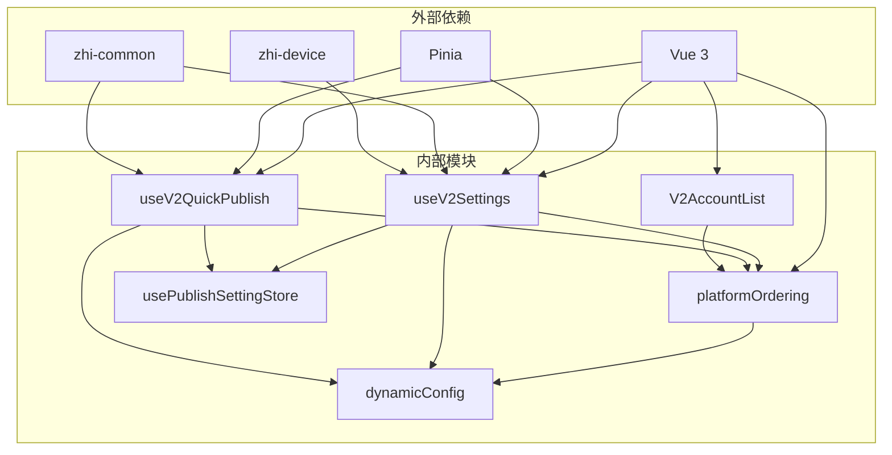

# V2 平台排序系统

<cite>
**本文档引用的文件**
- [spec.md](file://openspec/specs/v2-platform-ordering/spec.md)
- [platformOrdering.ts](file://src/composables/v2/platformOrdering.ts)
- [platformOrdering.spec.ts](file://src/composables/v2/platformOrdering.spec.ts)
- [dynamicConfig.ts](file://src/platforms/dynamicConfig.ts)
- [V2AccountList.vue](file://src/components/v2/settings/V2AccountList.vue)
- [useV2Settings.ts](file://src/composables/v2/useV2Settings.ts)
- [useV2QuickPublish.ts](file://src/composables/v2/useV2QuickPublish.ts)
- [usePublishSettingStore.ts](file://src/stores/usePublishSettingStore.ts)
- [constants.ts](file://src/utils/constants.ts)
- [V2PlatformCard.vue](file://src/components/v2/publish/V2PlatformCard.vue)
- [v2PlatformSelectGroups.ts](file://src/components/v2/settings/v2PlatformSelectGroups.ts)
</cite>

## 目录
1. [简介](#简介)
2. [项目结构](#项目结构)
3. [核心组件](#核心组件)
4. [架构概览](#架构概览)
5. [详细组件分析](#详细组件分析)
6. [依赖关系分析](#依赖关系分析)
7. [性能考虑](#性能考虑)
8. [故障排除指南](#故障排除指南)
9. [结论](#结论)

## 简介

V2 平台排序系统是思源笔记发布器插件中的一个关键功能模块，负责管理 V2 版本中平台账号的排序、拖拽调整、顺序持久化等功能。该系统确保用户可以自定义平台展示顺序，并保证排序结果在不同界面间的一致性。

系统主要包含以下核心特性：
- 账号列表排序：已启用账号优先显示，未启用账号次之
- 快速发布排序：继承账号管理中的排序设置
- 拖拽排序：支持鼠标拖拽和键盘导航
- 历史兼容：为历史配置提供兜底排序方案
- 持久化存储：排序结果保存到动态配置中

## 项目结构

V2 平台排序系统采用模块化设计，主要分布在以下几个目录：

**图表来源**
- [platformOrdering.ts:1-104](file://src/composables/v2/platformOrdering.ts#L1-L104)
- [dynamicConfig.ts:13-145](file://src/platforms/dynamicConfig.ts#L13-L145)
- [V2AccountList.vue:1-535](file://src/components/v2/settings/V2AccountList.vue#L1-L535)

**章节来源**
- [platformOrdering.ts:1-104](file://src/composables/v2/platformOrdering.ts#L1-L104)
- [dynamicConfig.ts:1-574](file://src/platforms/dynamicConfig.ts#L1-L574)

## 核心组件

### 排序算法核心

排序系统的核心是 `platformOrdering.ts` 文件中的几个关键函数：

1. **resolveDisplayOrder**: 解析显示顺序，支持历史配置兼容
2. **sortV2Accounts**: 账号排序算法
3. **sortV2QuickPublish**: 快速发布排序算法
4. **assignDisplayOrders**: 分配显示顺序
5. **getNextDisplayOrder**: 获取下一个可用顺序号

### 数据模型

系统使用 `DynamicConfig` 类作为基础数据模型，包含以下关键字段：
- `displayOrder`: 显示顺序（数字越小越靠前）
- `isEnabled`: 启用状态
- `isAuth`: 授权状态
- `platformKey`: 平台唯一标识

**章节来源**
- [platformOrdering.ts:12-104](file://src/composables/v2/platformOrdering.ts#L12-L104)
- [dynamicConfig.ts:13-145](file://src/platforms/dynamicConfig.ts#L13-L145)

## 架构概览

**图表来源**
- [useV2Settings.ts:245-253](file://src/composables/v2/useV2Settings.ts#L245-L253)
- [useV2QuickPublish.ts:131-191](file://src/composables/v2/useV2QuickPublish.ts#L131-L191)
- [platformOrdering.ts:79-103](file://src/composables/v2/platformOrdering.ts#L79-L103)

## 详细组件分析

### 账号列表排序组件

V2AccountList.vue 实现了完整的排序交互功能：

**图表来源**
- [V2AccountList.vue:159-292](file://src/components/v2/settings/V2AccountList.vue#L159-L292)
- [platformOrdering.ts:41-103](file://src/composables/v2/platformOrdering.ts#L41-L103)

#### 排序交互流程

**图表来源**
- [V2AccountList.vue:247-291](file://src/components/v2/settings/V2AccountList.vue#L247-L291)
- [useV2Settings.ts:245-253](file://src/composables/v2/useV2Settings.ts#L245-L253)

### 快速发布排序集成

useV2QuickPublish.ts 集成了排序系统，确保快速发布界面与账号管理界面保持一致的排序：

**图表来源**
- [useV2QuickPublish.ts:131-191](file://src/composables/v2/useV2QuickPublish.ts#L131-L191)
- [platformOrdering.ts:56-69](file://src/composables/v2/platformOrdering.ts#L56-L69)

**章节来源**
- [V2AccountList.vue:1-535](file://src/components/v2/settings/V2AccountList.vue#L1-L535)
- [useV2Settings.ts:1-323](file://src/composables/v2/useV2Settings.ts#L1-L323)

### 排序算法实现

排序算法采用稳定的多级排序策略：

1. **第一级排序**: 启用状态分组（已启用优先）
2. **第二级排序**: 显示顺序（displayOrder 字段）
3. **第三级排序**: 原始索引（保证稳定性）

**图表来源**
- [platformOrdering.ts:33-54](file://src/composables/v2/platformOrdering.ts#L33-L54)

**章节来源**
- [platformOrdering.ts:25-104](file://src/composables/v2/platformOrdering.ts#L25-L104)

## 依赖关系分析

**图表来源**
- [useV2Settings.ts:1-323](file://src/composables/v2/useV2Settings.ts#L1-L323)
- [useV2QuickPublish.ts:1-397](file://src/composables/v2/useV2QuickPublish.ts#L1-L397)

### 核心依赖关系

1. **platformOrdering → dynamicConfig**: 排序算法依赖动态配置模型
2. **useV2Settings → platformOrdering**: 设置管理使用排序算法
3. **useV2QuickPublish → platformOrdering**: 快速发布使用排序算法
4. **V2AccountList → platformOrdering**: 界面组件使用排序算法
5. **所有组件 → usePublishSettingStore**: 共享设置存储

**章节来源**
- [usePublishSettingStore.ts:1-95](file://src/stores/usePublishSettingStore.ts#L1-L95)
- [constants.ts:19-19](file://src/utils/constants.ts#L19-L19)

## 性能考虑

### 时间复杂度分析

- **排序算法**: O(n log n)，使用稳定排序保证相等元素的相对位置不变
- **重新分配顺序**: O(n)，遍历一次数组分配新的显示顺序
- **查找平台**: O(n)，使用数组查找方法

### 内存优化策略

1. **惰性加载**: 排序结果在需要时才计算
2. **引用传递**: 使用引用而非深拷贝减少内存占用
3. **缓存机制**: 设置存储提供缓存避免重复读取

### 用户体验优化

1. **拖拽反馈**: 实时的视觉反馈确保用户知道当前操作状态
2. **键盘导航**: 支持键盘快捷键提高效率
3. **无障碍支持**: 完整的 ARIA 标签和键盘支持

## 故障排除指南

### 常见问题及解决方案

#### 排序结果异常

**问题**: 排序结果不符合预期
**可能原因**:
- displayOrder 字段值异常
- 历史配置缺少排序字段
- 拖拽过程中断

**解决步骤**:
1. 检查动态配置中的 displayOrder 字段
2. 验证排序算法测试用例
3. 重新触发排序操作

#### 拖拽功能失效

**问题**: 拖拽操作无法正常工作
**可能原因**:
- 浏览器兼容性问题
- 事件处理冲突
- DOM 结构变化

**解决步骤**:
1. 检查浏览器控制台错误
2. 验证拖拽事件绑定
3. 确认 DOM 结构完整性

#### 排序持久化失败

**问题**: 排序更改后重启丢失
**可能原因**:
- 设置存储异常
- 异步操作竞态条件
- 权限问题

**解决步骤**:
1. 检查设置存储状态
2. 验证异步操作顺序
3. 确认文件权限

**章节来源**
- [platformOrdering.spec.ts:1-108](file://src/composables/v2/platformOrdering.spec.ts#L1-L108)
- [V2AccountList.vue:247-291](file://src/components/v2/settings/V2AccountList.vue#L247-L291)

## 结论

V2 平台排序系统通过精心设计的算法和模块化架构，实现了稳定可靠的平台排序功能。系统的主要优势包括：

1. **一致性**: 账号管理和快速发布界面共享同一套排序逻辑
2. **兼容性**: 完善的历史配置兼容机制确保平滑升级
3. **用户体验**: 丰富的交互方式满足不同用户的操作习惯
4. **可维护性**: 清晰的模块划分和完善的测试覆盖

该系统为思源笔记发布器插件提供了坚实的基础，支持用户根据个人偏好定制平台展示顺序，提升了整体的使用体验和工作效率。