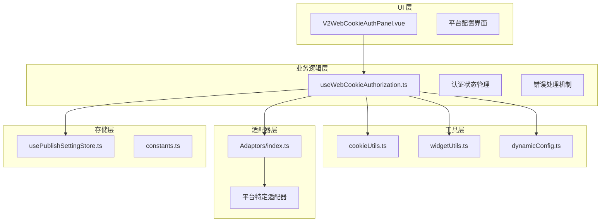
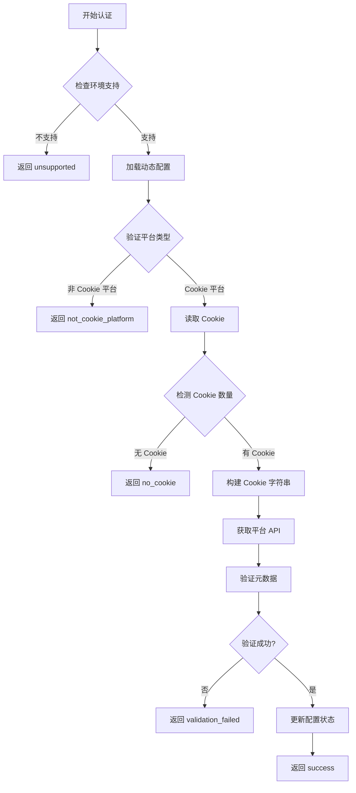
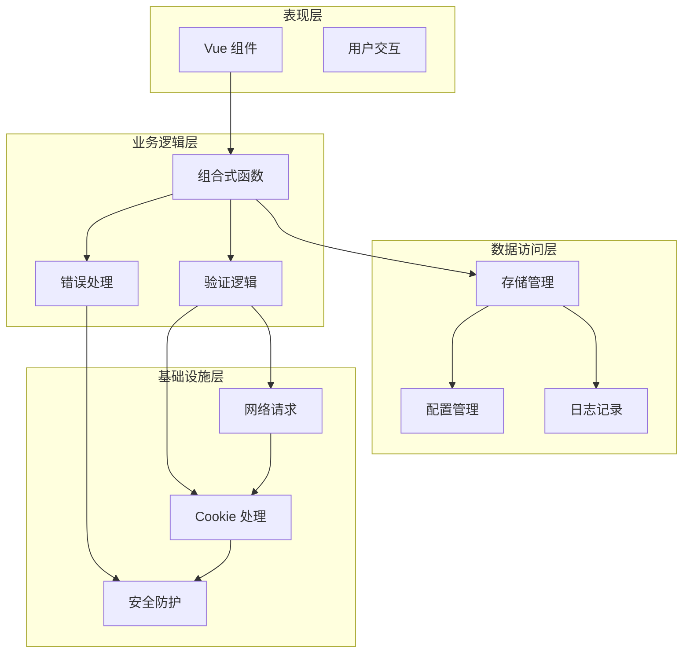
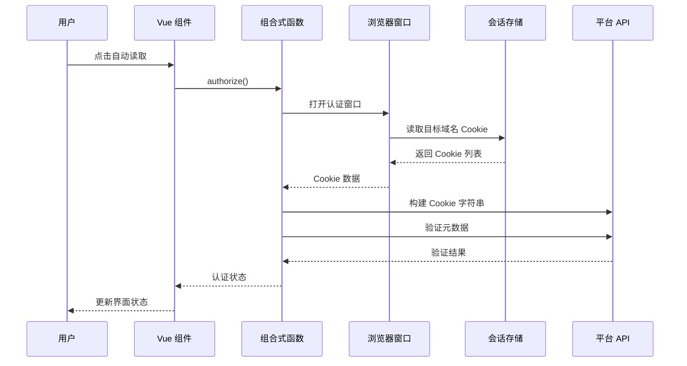
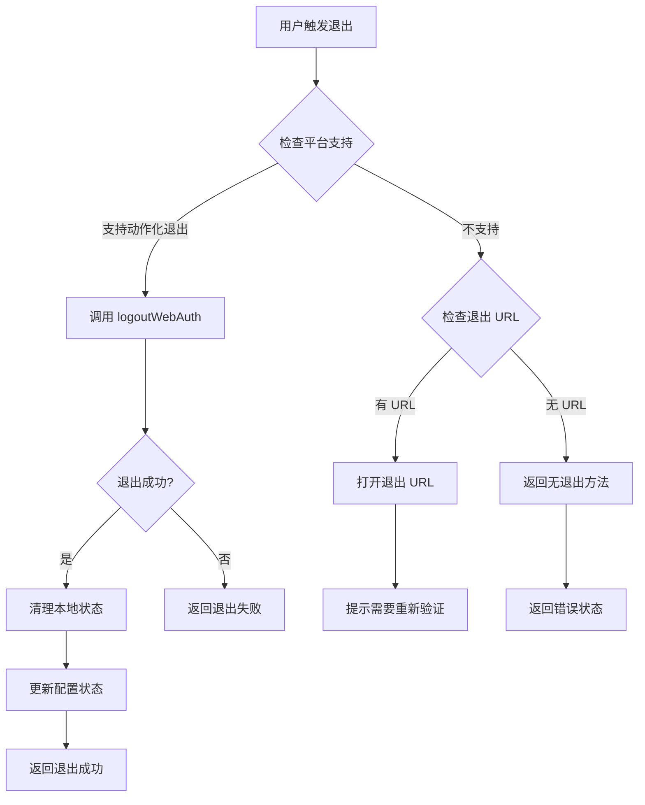
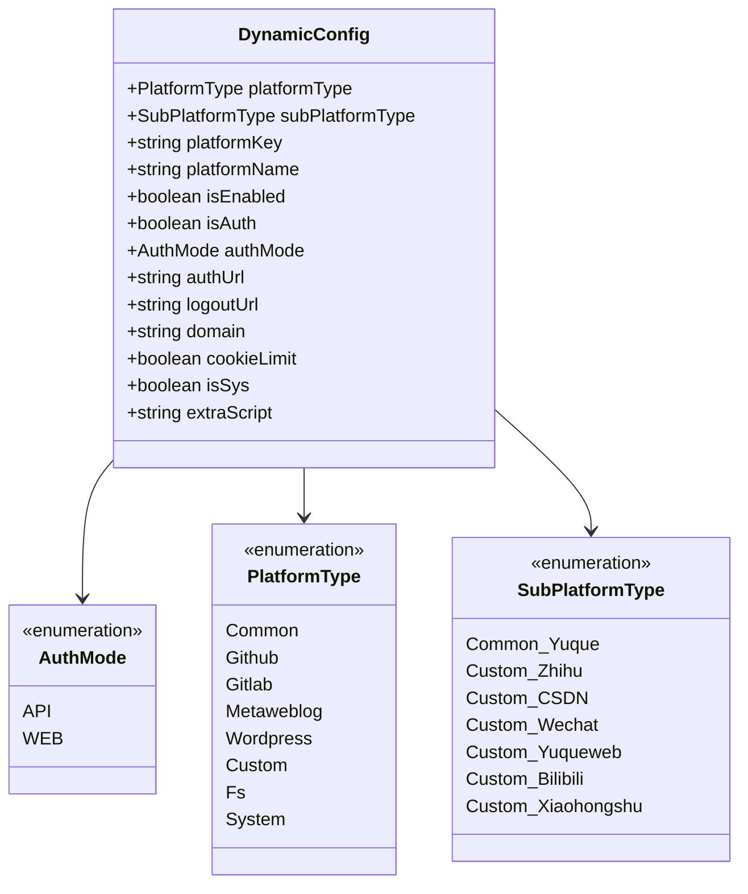
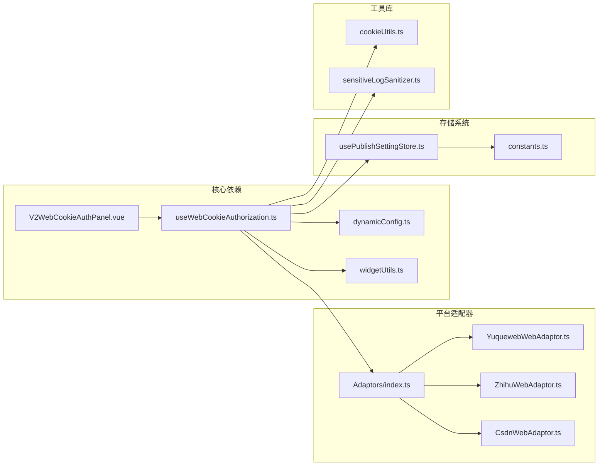

# Web Cookie 认证系统

<cite>
**本文档引用的文件**
- [useWebCookieAuthorization.ts](file://src/composables/useWebCookieAuthorization.ts)
- [V2WebCookieAuthPanel.vue](file://src/components/v2/settings/V2WebCookieAuthPanel.vue)
- [cookieUtils.ts](file://src/utils/cookieUtils.ts)
- [dynamicConfig.ts](file://src/platforms/dynamicConfig.ts)
- [widgetUtils.ts](file://src/utils/widgetUtils.ts)
- [adaptors/index.ts](file://src/adaptors/index.ts)
- [constants.ts](file://src/utils/constants.ts)
- [usePublishSettingStore.ts](file://src/stores/usePublishSettingStore.ts)
- [useYuquewebWeb.ts](file://src/adaptors/web/yuqueweb/useYuquewebWeb.ts)
- [YuquewebConfig.ts](file://src/adaptors/web/yuqueweb/YuquewebConfig.ts)
- [YuquewebWebAdaptor.ts](file://src/adaptors/web/yuqueweb/YuquewebWebAdaptor.ts)
- [v2-web-cookie-authorization/spec.md](file://openspec/specs/v2-web-cookie-authorization/spec.md)
- [web-cookie-logout/spec.md](file://openspec/specs/web-cookie-logout/spec.md)
- [yuque-web-publishing/spec.md](file://openspec/specs/yuque-web-publishing/spec.md)
</cite>

## 目录
1. [简介](#简介)
2. [项目结构](#项目结构)
3. [核心组件](#核心组件)
4. [架构概览](#架构概览)
5. [详细组件分析](#详细组件分析)
6. [依赖关系分析](#依赖关系分析)
7. [性能考虑](#性能考虑)
8. [故障排除指南](#故障排除指南)
9. [结论](#结论)

## 简介

Web Cookie 认证系统是一个专为思源笔记插件设计的现代化认证解决方案，主要用于处理基于 Cookie 的网页平台认证。该系统支持多种博客平台的自动 Cookie 读取、手动编辑、元数据验证、授权状态持久化以及统一的退出机制。

系统的核心特性包括：
- **自动化 Cookie 管理**：通过 Electron 环境自动捕获目标平台的 Cookie
- **多平台支持**：支持语雀网页版、知乎、CSDN、微信公众号等多种平台
- **安全的敏感信息保护**：完整的日志脱敏和错误信息过滤
- **统一的认证状态管理**：动态配置的持久化和状态同步
- **灵活的退出机制**：支持动作化退出和 URL 回退两种方式

## 项目结构

该系统采用模块化的架构设计，主要分为以下几个核心层次：



**图表来源**
- [useWebCookieAuthorization.ts:1-398](file://src/composables/useWebCookieAuthorization.ts#L1-L398)
- [V2WebCookieAuthPanel.vue:1-552](file://src/components/v2/settings/V2WebCookieAuthPanel.vue#L1-L552)
- [cookieUtils.ts:1-119](file://src/utils/cookieUtils.ts#L1-L119)

**章节来源**
- [useWebCookieAuthorization.ts:1-398](file://src/composables/useWebCookieAuthorization.ts#L1-L398)
- [V2WebCookieAuthPanel.vue:1-552](file://src/components/v2/settings/V2WebCookieAuthPanel.vue#L1-L552)

## 核心组件

### 认证组合式函数

`useWebCookieAuthorization` 是整个系统的核心，提供了完整的认证生命周期管理：



**图表来源**
- [useWebCookieAuthorization.ts:178-254](file://src/composables/useWebCookieAuthorization.ts#L178-L254)

### UI 面板组件

`V2WebCookieAuthPanel` 提供了直观的用户界面，包含以下功能区域：

- **认证状态指示器**：实时显示认证状态（就绪、成功、警告等）
- **自动读取入口**：在支持的环境中提供一键读取 Cookie 的按钮
- **手动编辑入口**：在不支持自动读取时提供手动粘贴 Cookie 的选项
- **退出控制**：管理已认证账户的退出操作

**章节来源**
- [V2WebCookieAuthPanel.vue:1-552](file://src/components/v2/settings/V2WebCookieAuthPanel.vue#L1-L552)

## 架构概览

系统采用分层架构设计，确保各层职责清晰分离：



**图表来源**
- [useWebCookieAuthorization.ts:381-397](file://src/composables/useWebCookieAuthorization.ts#L381-L397)
- [widgetUtils.ts:36-270](file://src/utils/widgetUtils.ts#L36-L270)

## 详细组件分析

### 认证流程组件

#### 自动 Cookie 读取机制

系统通过 Electron 环境的浏览器窗口实现自动 Cookie 读取：



**图表来源**
- [useWebCookieAuthorization.ts:178-254](file://src/composables/useWebCookieAuthorization.ts#L178-L254)
- [widgetUtils.ts:173-265](file://src/utils/widgetUtils.ts#L173-L265)

#### 退出流程管理

系统提供统一的退出机制，支持多种退出策略：



**图表来源**
- [useWebCookieAuthorization.ts:256-379](file://src/composables/useWebCookieAuthorization.ts#L256-L379)

**章节来源**
- [useWebCookieAuthorization.ts:178-379](file://src/composables/useWebCookieAuthorization.ts#L178-L379)

### 数据模型组件

#### 动态配置管理

系统使用 `DynamicConfig` 类来管理平台的动态配置：



**图表来源**
- [dynamicConfig.ts:13-275](file://src/platforms/dynamicConfig.ts#L13-L275)

**章节来源**
- [dynamicConfig.ts:13-574](file://src/platforms/dynamicConfig.ts#L13-L574)

### 工具组件

#### Cookie 处理工具

系统提供了专门的 Cookie 处理工具类：

| 方法 | 功能 | 参数 | 返回值 |
|------|------|------|--------|
| `addCookieArray` | 合并 Cookie 数组 | `originCookieArray`, `newCookieArray`, `isForce` | `{ isUpdated, cookieArray }` |
| `getCookie` | 根据键获取 Cookie | `cookieArray`, `key` | `string` |
| `getCookieFromString` | 从字符串解析 Cookie | `cookieName`, `cookieString` | `string` |
| `getCookieObject` | 获取 Cookie 对象 | `cookieArray`, `key` | `any` |

**章节来源**
- [cookieUtils.ts:18-119](file://src/utils/cookieUtils.ts#L18-L119)

## 依赖关系分析

系统的关键依赖关系如下：



**图表来源**
- [useWebCookieAuthorization.ts:10-30](file://src/composables/useWebCookieAuthorization.ts#L10-L30)
- [adaptors/index.ts:59-616](file://src/adaptors/index.ts#L59-L616)

**章节来源**
- [adaptors/index.ts:59-616](file://src/adaptors/index.ts#L59-L616)

## 性能考虑

### 环境检测优化

系统通过 `EnvUtil.isSiyuanElectron` 进行环境检测，避免在不支持的环境中执行昂贵的操作：

```typescript
const isAutoCaptureSupported = deps.isAutoCaptureSupported ?? EnvUtil.isSiyuanElectron
```

### 异步操作管理

所有网络请求和文件操作都采用异步模式，避免阻塞主线程：

- **Promise 模式**：使用现代 JavaScript Promise 处理异步操作
- **超时控制**：通过 Electron 窗口的生命周期管理避免资源泄漏
- **错误恢复**：提供完善的错误处理和降级策略

### 内存管理

系统采用渐进式的数据处理策略：

- **延迟加载**：仅在需要时加载平台配置
- **缓存机制**：使用 Pinia store 缓存配置状态
- **垃圾回收**：及时释放临时对象和事件监听器

## 故障排除指南

### 常见问题诊断

#### 环境不支持问题

**症状**：自动读取按钮不可用或返回 `unsupported` 状态

**解决方案**：
1. 确认运行环境为思源 Electron
2. 检查 `EnvUtil.isSiyuanElectron` 返回值
3. 在桌面浏览器中使用手动编辑模式

#### Cookie 读取失败

**症状**：返回 `no_cookie` 或 `validation_failed` 状态

**排查步骤**：
1. 确认目标平台的 `authUrl` 配置正确
2. 检查浏览器窗口是否成功加载登录页面
3. 验证目标域名的 Cookie 是否存在
4. 确认 `domain` 配置与目标平台一致

#### 退出失败问题

**症状**：退出操作返回 `logout_failed` 或 `persist_failed`

**处理方案**：
1. 检查平台是否实现 `logoutWebAuth` 方法
2. 验证语雀平台的 CSRF token 提取逻辑
3. 确认登录名解析的准确性
4. 检查网络连接和平台可用性

**章节来源**
- [useWebCookieAuthorization.ts:166-176](file://src/composables/useWebCookieAuthorization.ts#L166-L176)

### 调试技巧

#### 日志分析

系统提供了完整的日志记录机制，包括：

- **敏感信息脱敏**：自动过滤 Cookie、Token 等敏感数据
- **状态跟踪**：记录认证流程的每个关键步骤
- **错误诊断**：提供详细的错误上下文和堆栈信息

#### 状态监控

通过 Vue 组件的状态管理，可以实时监控认证状态变化：

```javascript
const statusType = computed(() => {
  if (lastStatus.value === "success") return "success"
  if (!canAutoCapture.value) return "neutral"
  if (["no_cookie", "validation_failed", "error"].includes(lastStatus.value)) return "warning"
  return props.dynCfg?.isAuth ? "success" : "ready"
})
```

## 结论

Web Cookie 认证系统通过模块化的设计和完善的错误处理机制，为多平台的 Cookie 认证提供了可靠的解决方案。系统的主要优势包括：

**技术优势**：
- **模块化架构**：清晰的分层设计便于维护和扩展
- **安全性保障**：完整的敏感信息保护机制
- **用户体验**：直观的 UI 设计和流畅的交互流程

**扩展性特点**：
- **平台无关**：通过适配器模式支持多种平台
- **配置灵活**：动态配置系统支持复杂的平台需求
- **错误恢复**：完善的降级策略确保系统稳定性

该系统为思源笔记插件的博客发布功能提供了坚实的技术基础，支持用户在不同平台间进行无缝的认证和发布操作。