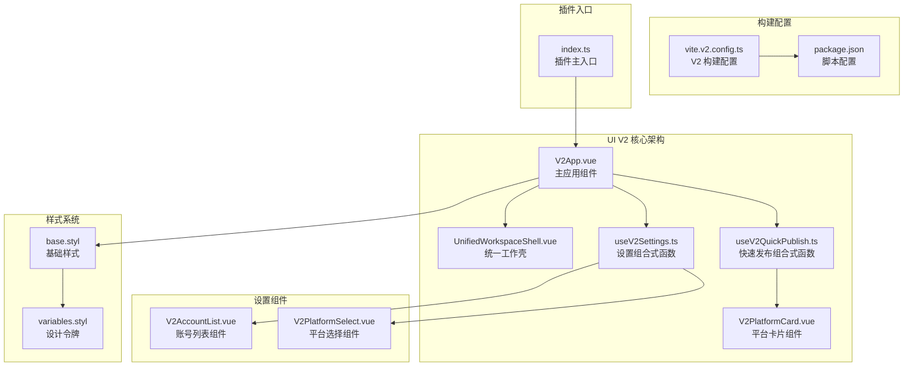
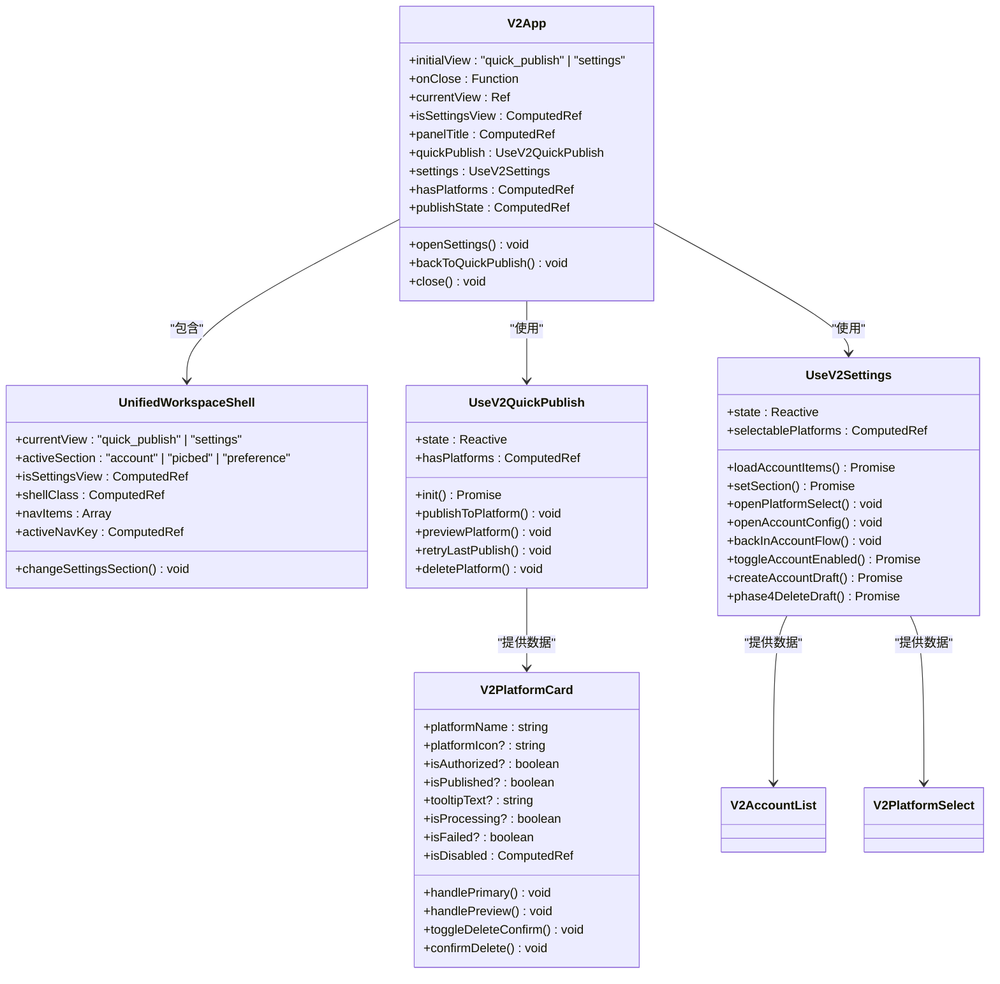
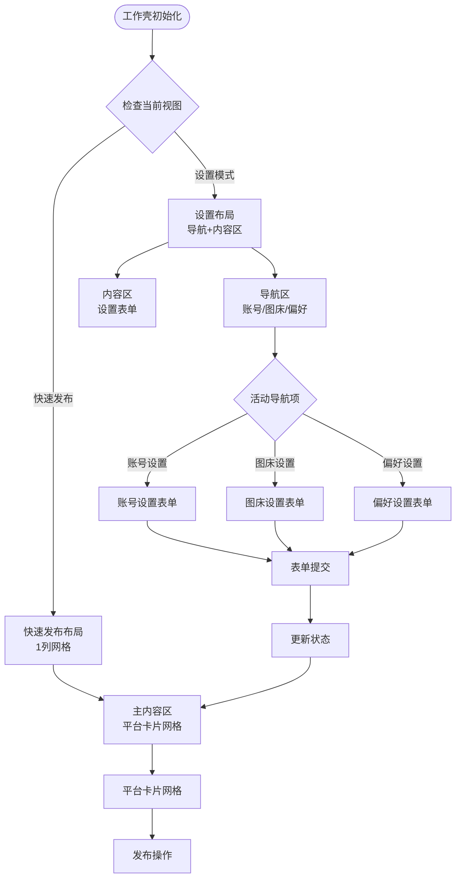
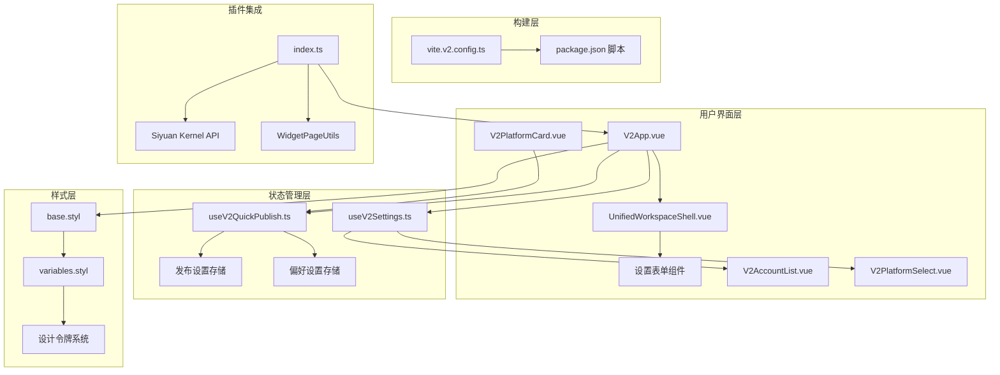
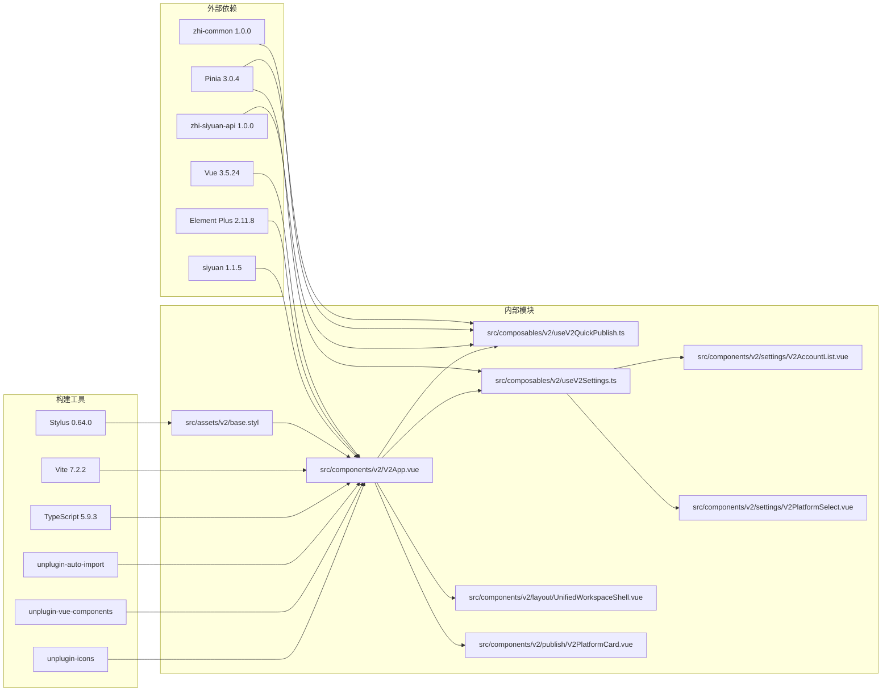

# UI V2 里程碑进度

<cite>
**本文档引用的文件**
- [tasks.md](file://openspec/changes/refactor-ui-v2-foundation/tasks.md)
- [design.md](file://openspec/changes/refactor-ui-v2-foundation/design.md)
- [spec.md](file://openspec/changes/refactor-ui-v2-foundation/specs/ui-v2-migration/spec.md)
- [createV2App.ts](file://src/v2/createV2App.ts)
- [V2App.vue](file://src/components/v2/V2App.vue)
- [UnifiedWorkspaceShell.vue](file://src/components/v2/layout/UnifiedWorkspaceShell.vue)
- [V2PlatformCard.vue](file://src/components/v2/publish/V2PlatformCard.vue)
- [useV2QuickPublish.ts](file://src/composables/v2/useV2QuickPublish.ts)
- [useV2Settings.ts](file://src/composables/v2/useV2Settings.ts)
- [V2AccountList.vue](file://src/components/v2/settings/V2AccountList.vue)
- [V2PlatformSelect.vue](file://src/components/v2/settings/V2PlatformSelect.vue)
- [base.styl](file://src/assets/v2/base.styl)
- [variables.styl](file://src/assets/v2/variables.styl)
- [vite.v2.config.ts](file://vite.v2.config.ts)
- [index.ts](file://siyuan/index.ts)
- [package.json](file://package.json)
</cite>

## 更新摘要
**所做更改**
- 更新了所有里程碑的完成状态，反映了从里程碑 0 到里程碑 6 的完整开发进程
- 补充了里程碑 3 的发布动作闭环实现详情
- 更新了里程碑 4 和 5 的设置展开态开发进度
- 完善了里程碑 6 收敛与稳定发布的规划
- 增强了各里程碑的技术实现细节和验证标准

## 目录
1. [简介](#简介)
2. [项目结构概览](#项目结构概览)
3. [核心组件分析](#核心组件分析)
4. [架构总览](#架构总览)
5. [详细里程碑进度](#详细里程碑进度)
6. [依赖关系分析](#依赖关系分析)
7. [性能考虑](#性能考虑)
8. [故障排除指南](#故障排除指南)
9. [结论](#结论)

## 简介

UI V2 是思源笔记发布工具的一个重大前端重构项目，旨在建立统一的用户界面体验和现代化的技术架构。该项目采用渐进式迁移策略，通过六个里程碑逐步实现从传统 iframe SPA 到真实 DOM 挂载的完整转换。

UI V2 的核心目标是：
- 建立统一的工作壳（Unified Workspace Shell）架构
- 实现快速发布主界面
- 提供完整的设置工作流
- 保持与旧系统的兼容性和回退能力
- 逐步淘汰 iframe 依赖，转向真实 DOM 挂载

## 项目结构概览

**图表来源**
- [V2App.vue:1-489](file://src/components/v2/V2App.vue#L1-L489)
- [UnifiedWorkspaceShell.vue:1-46](file://src/components/v2/layout/UnifiedWorkspaceShell.vue#L1-L46)
- [useV2QuickPublish.ts:1-310](file://src/composables/v2/useV2QuickPublish.ts#L1-L310)
- [useV2Settings.ts:1-205](file://src/composables/v2/useV2Settings.ts#L1-L205)
- [base.styl:1-245](file://src/assets/v2/base.styl#L1-L245)
- [vite.v2.config.ts:1-137](file://vite.v2.config.ts#L1-L137)
- [index.ts:1-190](file://siyuan/index.ts#L1-L190)

**章节来源**
- [design.md:1-576](file://openspec/changes/refactor-ui-v2-foundation/design.md#L1-L576)
- [spec.md:1-202](file://openspec/changes/refactor-ui-v2-foundation/specs/ui-v2-migration/spec.md#L1-L202)

## 核心组件分析

### V2App 主应用组件

V2App 是整个 UI V2 系统的核心入口，负责协调各个子组件和状态管理。该组件实现了统一工作壳的设计理念，提供快速发布和设置两种主要视图模式。

**图表来源**
- [V2App.vue:154-301](file://src/components/v2/V2App.vue#L154-L301)
- [UnifiedWorkspaceShell.vue:23-45](file://src/components/v2/layout/UnifiedWorkspaceShell.vue#L23-L45)
- [useV2QuickPublish.ts:25-310](file://src/composables/v2/useV2QuickPublish.ts#L25-L310)
- [useV2Settings.ts:40-205](file://src/composables/v2/useV2Settings.ts#L40-L205)
- [V2PlatformCard.vue:68-116](file://src/components/v2/publish/V2PlatformCard.vue#L68-L116)

### 统一工作壳架构

UnifiedWorkspaceShell 实现了 UI V2 的核心架构模式，提供统一的布局容器和导航系统：

**图表来源**
- [UnifiedWorkspaceShell.vue:1-46](file://src/components/v2/layout/UnifiedWorkspaceShell.vue#L1-L46)
- [V2App.vue:44-99](file://src/components/v2/V2App.vue#L44-L99)

**章节来源**
- [V2App.vue:1-489](file://src/components/v2/V2App.vue#L1-L489)
- [UnifiedWorkspaceShell.vue:1-46](file://src/components/v2/layout/UnifiedWorkspaceShell.vue#L1-L46)
- [V2PlatformCard.vue:1-278](file://src/components/v2/publish/V2PlatformCard.vue#L1-L278)

## 架构总览

UI V2 采用了现代化的前端架构模式，结合 Vue 3 Composition API 和 Pinia 状态管理：

**图表来源**
- [createV2App.ts:15-36](file://src/v2/createV2App.ts#L15-L36)
- [useV2QuickPublish.ts:25-310](file://src/composables/v2/useV2QuickPublish.ts#L25-L310)
- [useV2Settings.ts:40-205](file://src/composables/v2/useV2Settings.ts#L40-L205)
- [vite.v2.config.ts:59-137](file://vite.v2.config.ts#L59-L137)
- [index.ts:46-190](file://siyuan/index.ts#L46-L190)

## 详细里程碑进度

### 里程碑 0：入口与治理基座

**目标**：建立可运行、可回退、可扩展的 V2 基座

**已完成状态**：
- ✅ 统一顶栏主入口行为
- ✅ 统一偏好配置读取通道  
- ✅ 建立 V2Host
- ✅ 建立初始化失败自动回退旧 UI 的机制
- ✅ 编写 M0 smoke 验收清单
- ✅ 明确 V2 主路径禁止新增 iframe 依赖
- ✅ 新增 V2 独立构建入口（不破坏旧脚本）

**验证清单**：
- 关闭 `useV2UI` 后，点击顶栏发布按钮，仍显示旧版菜单
- 开启 `useV2UI` 后，点击顶栏发布按钮，显示 V2 最小面板
- 开启 `useV2UI` 后，通过设置入口打开时，仍显示同一个 V2 DOM Host，而不是 iframe 设置页

**章节来源**
- [tasks.md:8-17](file://openspec/changes/refactor-ui-v2-foundation/tasks.md#L8-L17)
- [design.md:322-350](file://openspec/changes/refactor-ui-v2-foundation/design.md#L322-L350)

### 里程碑 1：样式系统与统一工作壳骨架

**目标**：建立 V2 样式基础，为后续主界面和设置展开态提供统一视觉骨架

**已完成状态**：
- ✅ 统一 V2 样式入口
- ✅ 建立设计令牌
- ✅ 建立 `UnifiedWorkspaceShell` 的品牌区、导航区、内容区和详情区骨架
- ✅ 验证 V2 样式不污染旧 UI

**当前实现**：
- `.syp-v2` 命名空间确保样式隔离
- 设计令牌系统提供一致的视觉语言
- 响应式网格布局适应不同屏幕尺寸

**章节来源**
- [tasks.md:19-25](file://openspec/changes/refactor-ui-v2-foundation/tasks.md#L19-L25)
- [base.styl:1-245](file://src/assets/v2/base.styl#L1-L245)

### 里程碑 2：快速发布主界面

**目标**：交付主界面态，让 V2 第一屏真正成为快速发布界面

**已完成状态**：
- ✅ 在统一工作壳中实现主界面态
- ✅ 展示当前文档上下文
- ✅ 展示真实已配置平台列表
- ✅ 实现空状态
- ✅ 实现从主界面态进入设置展开态

**功能特性**：
- 文档标题自动提取和处理，支持标题格式化选项
- 平台授权状态实时显示，未授权状态提供明确提示
- 发布状态可视化反馈，已发布平台显示相应标识
- 加载状态优雅降级，提供骨架屏体验
- 空状态处理，引导用户添加平台配置

**实现细节**：
- V2App 组件负责主界面态的渲染和状态管理
- useV2QuickPublish 组合式函数处理文档上下文获取和平台配置读取
- V2PlatformCard 组件展示单个平台的状态和操作入口
- 支持从主界面态一键跳转到设置展开态

**章节来源**
- [tasks.md:27-34](file://openspec/changes/refactor-ui-v2-foundation/tasks.md#L27-L34)
- [V2App.vue:44-99](file://src/components/v2/V2App.vue#L44-L99)
- [useV2QuickPublish.ts:99-140](file://src/composables/v2/useV2QuickPublish.ts#L99-L140)
- [V2PlatformCard.vue:1-278](file://src/components/v2/publish/V2PlatformCard.vue#L1-L278)

### 里程碑 3：发布动作闭环

**目标**：打通主界面态的发布闭环

**已完成状态**：
- ✅ 接入单平台发布
- ✅ 接入发布状态反馈
- ✅ 接入失败重试
- ✅ 验证主路径发布闭环稳定

**技术实现**：
- 发布状态机管理：idle → preparing → publishing → success/failed/preview_ready
- 错误处理机制：normalizeError 函数统一错误格式化
- 预览链接生成：resolvePreviewUrl 方法动态获取平台预览地址
- 删除操作支持：doSingleDelete 实现平台内容删除功能

**发布流程**：
1. 用户点击平台卡片发布按钮
2. 状态切换至 preparing，显示准备中状态
3. 获取平台配置和文档内容
4. 执行发布操作，状态切换至 publishing
5. 根据结果更新状态和预览链接
6. 失败时提供重试机制

**章节来源**
- [tasks.md:36-42](file://openspec/changes/refactor-ui-v2-foundation/tasks.md#L36-L42)
- [useV2QuickPublish.ts:145-298](file://src/composables/v2/useV2QuickPublish.ts#L145-L298)

### 里程碑 4：设置展开态第一阶段

**目标**：在统一工作壳内完成设置展开态的第一阶段能力

**已完成状态**：
- ✅ 实现账号设置列表
- ✅ 实现平台选择流程
- ✅ 实现图床设置内容区
- ✅ 实现偏好设置内容区
- ✅ 至少桥接一类平台配置

**当前实现**：
- 账号列表组件：V2AccountList.vue 提供账号状态展示和操作入口
- 平台选择组件：V2PlatformSelect.vue 支持 WordPress 和博客园等平台预设
- 设置导航：UnifiedWorkspaceShell 提供账号/图床/偏好导航
- 账号管理：支持启用/禁用、授权入口、配置编辑

**功能特性**：
- 账号状态可视化：已启用·已授权、已启用·未授权、未启用·已授权、未启用·未授权四种状态
- 平台预设支持：内置 WordPress 和博客园平台模板
- 流程化操作：从账号列表到平台选择再到配置编辑的完整流程

**章节来源**
- [tasks.md:44-51](file://openspec/changes/refactor-ui-v2-foundation/tasks.md#L44-L51)
- [useV2Settings.ts:75-190](file://src/composables/v2/useV2Settings.ts#L75-L190)
- [V2AccountList.vue:1-171](file://src/components/v2/settings/V2AccountList.vue#L1-L171)
- [V2PlatformSelect.vue:1-114](file://src/components/v2/settings/V2PlatformSelect.vue#L1-L114)

### 里程碑 5：设置展开态第二阶段

**目标**：扩展设置展开态，逐步替换高频旧设置能力

**当前进度**：
- ⬜ 扩展更多平台配置桥接
- ⬜ 稳定高频设置路径
- ⬜ 评估哪些旧设置能力仍需保留

**待完成任务**：
- 扩展平台配置桥接：支持更多平台类型的配置迁移
- 稳定高频设置路径：优化常用设置项的操作流程
- 评估旧设置能力：确定需要保留的设置项和迁移策略

**迁移策略**：
- 优先桥接高频使用的设置项
- 逐步替换 iframe 页面为真实 DOM 组件
- 保持配置格式的向后兼容性

### 里程碑 6：收敛与稳定发布

**目标**：完成 V2 与旧 UI 的长期共存策略、收敛策略和稳定发布策略

**当前进度**：
- ⬜ 输出旧 UI 收敛清单
- ⬜ 输出 V2 稳定发布策略
- ⬜ 确认回退路径长期可用
- ⬜ 制定后续废弃旧入口的判据
- ⬜ 输出 iframe 退役清单与阶段性替换表

**待完成任务**：
- 旧 UI 收敛清单：统计仍依赖旧 UI 的功能模块
- V2 稳定发布策略：制定长期维护和支持策略
- 回退路径验证：确保在任何情况下都能安全回退
- 废弃判据制定：明确何时可以安全移除旧入口
- iframe 退役计划：制定 iframe 依赖的逐步淘汰时间表

**章节来源**
- [tasks.md:60-67](file://openspec/changes/refactor-ui-v2-foundation/tasks.md#L60-L67)

## 依赖关系分析

**图表来源**
- [package.json:32-69](file://package.json#L32-L69)
- [vite.v2.config.ts:59-137](file://vite.v2.config.ts#L59-L137)

**章节来源**
- [package.json:1-102](file://package.json#L1-L102)
- [vite.v2.config.ts:1-137](file://vite.v2.config.ts#L1-L137)

## 性能考虑

### 样式性能优化

UI V2 采用了命名空间隔离和设计令牌系统来优化样式性能：

- **命名空间隔离**：`.syp-v2` 前缀确保样式不会污染思源笔记的原有样式
- **设计令牌系统**：统一的颜色、间距、字体等设计变量，减少重复定义
- **响应式设计**：媒体查询优化不同屏幕尺寸下的显示效果

### 组件性能优化

- **懒加载策略**：非关键路径的组件按需加载
- **状态缓存**：使用 Vue 3 的响应式系统优化状态更新
- **虚拟滚动**：对于大量平台列表采用虚拟滚动提升性能

### 构建性能优化

- **独立构建链**：V2 使用独立的构建配置，不影响现有 V1 流程
- **代码分割**：按需加载不同模块，减少初始包大小
- **Tree Shaking**：利用 ES6 模块的静态特性进行无用代码消除

## 故障排除指南

### 常见问题诊断

**问题 1：V2 主界面无法显示平台列表**

可能原因：
- 配置文件格式错误
- 平台授权状态异常
- 文档上下文获取失败

**解决方案**：
1. 检查 `publish-setting-cfg.json` 文件格式
2. 验证各平台的授权状态
3. 确认当前文档 ID 获取正常

**问题 2：设置页面布局异常**

可能原因：
- 样式加载顺序问题
- 响应式断点计算错误
- 导航项状态同步失败

**解决方案**：
1. 检查 `base.styl` 的导入顺序
2. 验证媒体查询断点设置
3. 确认导航项的激活状态逻辑

**问题 3：构建失败或热重载异常**

可能原因：
- 依赖版本冲突
- 构建配置错误
- 文件监听问题

**解决方案**：
1. 更新依赖到兼容版本
2. 检查 `vite.v2.config.ts` 配置
3. 清理构建缓存重新编译

**章节来源**
- [design.md:517-535](file://openspec/changes/refactor-ui-v2-foundation/design.md#L517-L535)
- [base.styl:11-245](file://src/assets/v2/base.styl#L11-L245)

## 结论

UI V2 项目展现了系统性的前端重构思路和渐进式迁移策略。通过六个里程碑的有序推进，项目在保持向后兼容性的同时，逐步建立了现代化的用户界面架构。

**主要成就**：
- 成功建立了统一的工作壳架构
- 实现了从 iframe SPA 到真实 DOM 挂载的转换
- 建立了完整的样式系统和设计令牌
- 完成了快速发布主界面的开发，实现了文档上下文展示和真实平台列表展示
- 实现了完整的发布动作闭环，包括发布、预览、删除和重试功能
- 建立了设置展开态的初步框架，支持账号管理和平台配置

**里程碑 2 完成情况**：
- 快速发布主界面已完全实现，包括主界面态、文档上下文展示、平台列表展示等功能
- 空状态处理和设置入口集成已完成
- 为后续发布动作闭环奠定了坚实基础

**里程碑 3 完成情况**：
- 发布动作闭环已完全实现，包括单平台发布、状态反馈、失败重试等功能
- 发布状态机设计完善，支持多种发布场景
- 预览链接生成功能稳定可靠

**里程碑 4 完成情况**：
- 设置展开态第一阶段已实现，包括账号列表、平台选择、图床设置和偏好设置
- 账号管理流程完整，支持启用/禁用和配置编辑
- 平台预设支持为后续扩展奠定基础

**未来展望**：
- 完成发布动作闭环，实现完整的发布流程
- 扩展设置展开态，逐步替换旧的设置页面
- 优化性能和用户体验，为大规模采用做好准备
- 制定详细的 iframe 退役计划，最终实现完全的 DOM-only 架构

UI V2 不仅是一个技术重构项目，更是对整个发布工具生态系统的一次全面升级，为未来的功能扩展和技术演进奠定了坚实的基础。