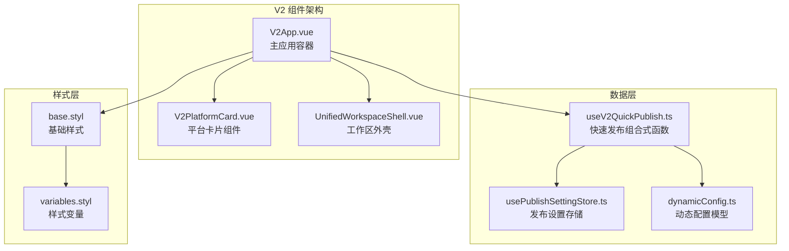
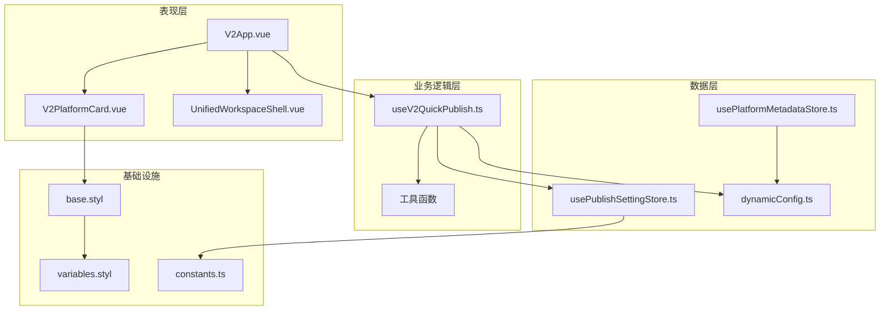
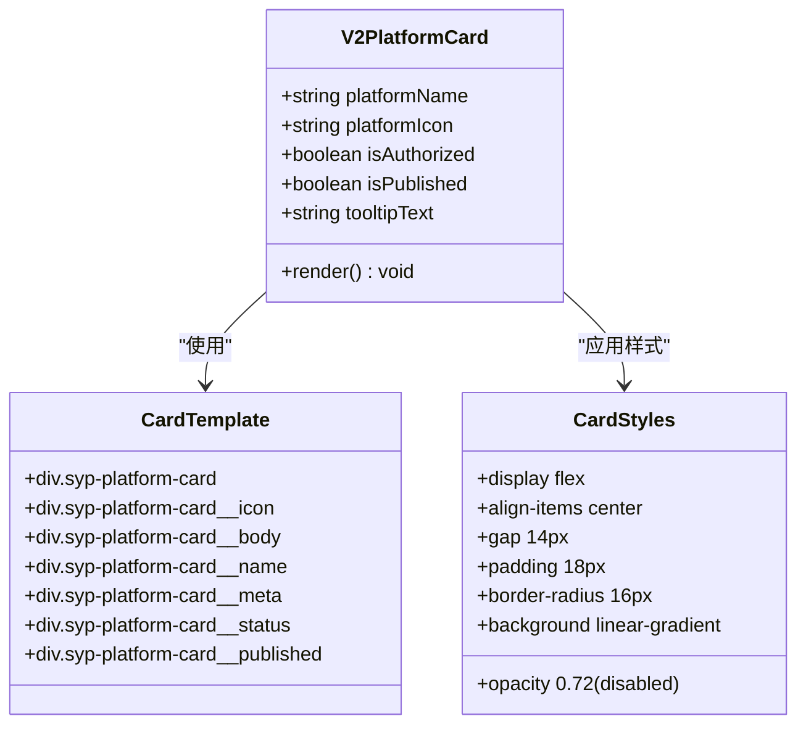
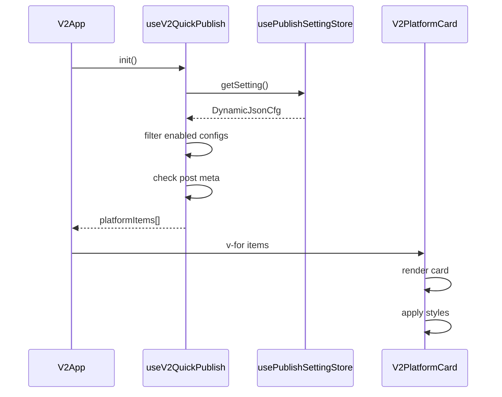
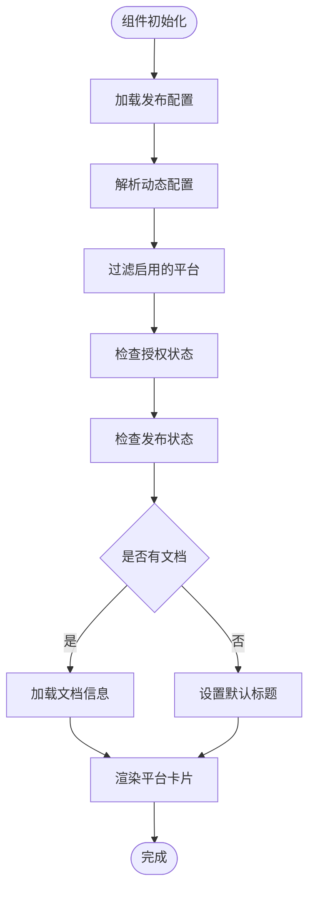
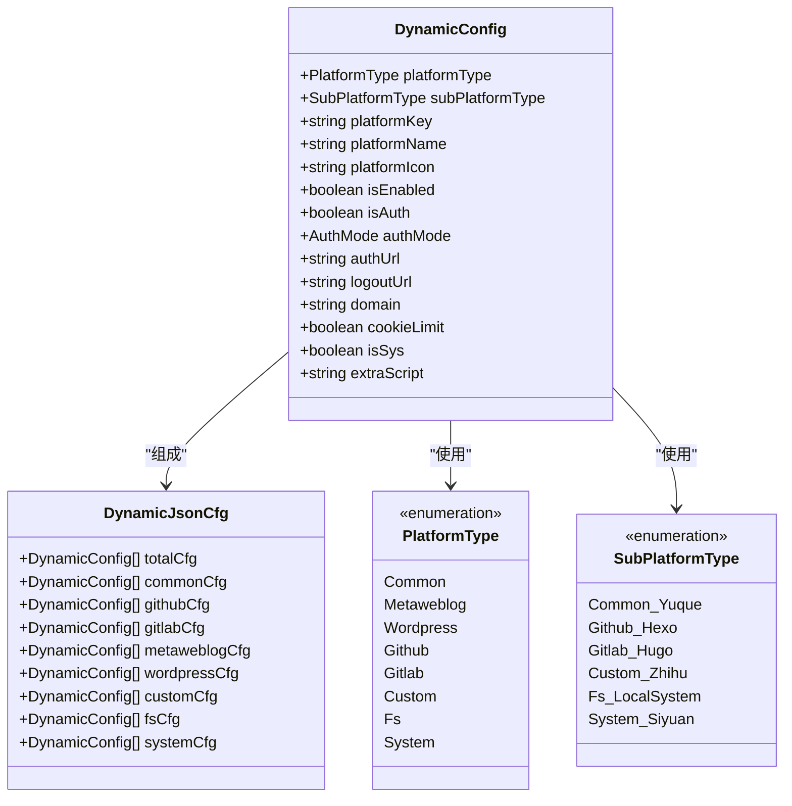
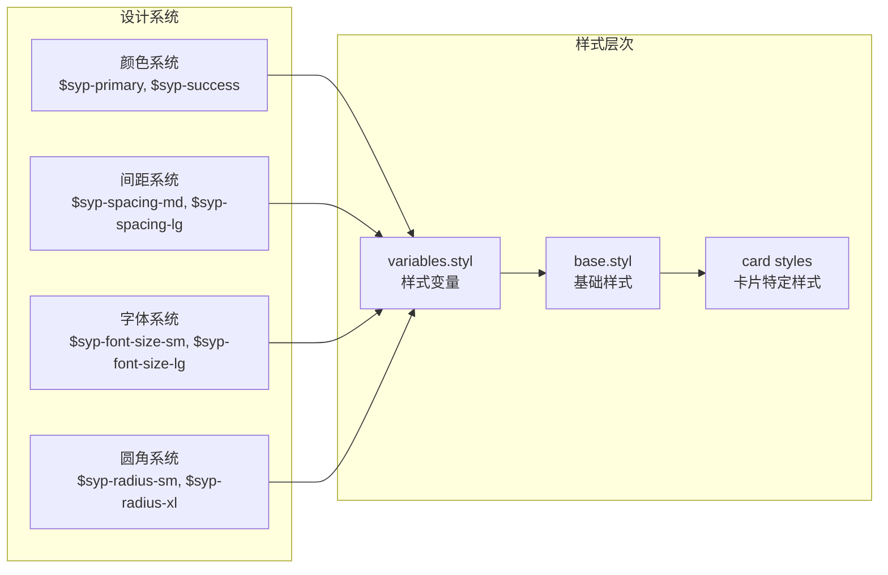
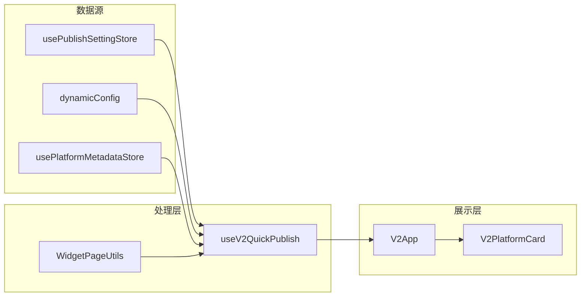

# V2 平台卡片组件

<cite>
**本文档引用的文件**
- [V2PlatformCard.vue](file://src/components/v2/publish/V2PlatformCard.vue)
- [V2App.vue](file://src/components/v2/V2App.vue)
- [useV2QuickPublish.ts](file://src/composables/v2/useV2QuickPublish.ts)
- [dynamicConfig.ts](file://src/platforms/dynamicConfig.ts)
- [usePublishSettingStore.ts](file://src/stores/usePublishSettingStore.ts)
- [UnifiedWorkspaceShell.vue](file://src/components/v2/layout/UnifiedWorkspaceShell.vue)
- [base.styl](file://src/assets/v2/base.styl)
- [variables.styl](file://src/assets/v2/variables.styl)
- [constants.ts](file://src/utils/constants.ts)
- [useCommonLocalStorage.ts](file://src/stores/common/useCommonLocalStorage.ts)
- [platformMetadata.ts](file://src/models/platformMetadata.ts)
- [usePlatformMetadataStore.ts](file://src/stores/usePlatformMetadataStore.ts)
</cite>

## 目录
1. [简介](#简介)
2. [项目结构](#项目结构)
3. [核心组件](#核心组件)
4. [架构概览](#架构概览)
5. [详细组件分析](#详细组件分析)
6. [依赖关系分析](#依赖关系分析)
7. [性能考虑](#性能考虑)
8. [故障排除指南](#故障排除指南)
9. [结论](#结论)

## 简介

V2 平台卡片组件是思源笔记发布工具插件中的核心 UI 组件，负责展示支持的发布平台信息。该组件提供了直观的卡片式界面，显示平台图标、名称、授权状态和发布状态，为用户提供快速发布功能。

该组件采用现代化的设计理念，具有响应式布局、优雅的视觉效果和良好的用户体验。组件支持多种平台类型，包括通用平台、GitHub/GitLab 生态系统、自定义平台等，并提供了完整的状态管理和数据绑定机制。

## 项目结构

V2 平台卡片组件位于插件的 V2 架构中，主要包含以下核心文件：



**图表来源**
- [V2App.vue:1-276](file://src/components/v2/V2App.vue#L1-L276)
- [V2PlatformCard.vue:1-103](file://src/components/v2/publish/V2PlatformCard.vue#L1-L103)
- [useV2QuickPublish.ts:1-81](file://src/composables/v2/useV2QuickPublish.ts#L1-L81)

**章节来源**
- [V2App.vue:1-276](file://src/components/v2/V2App.vue#L1-L276)
- [V2PlatformCard.vue:1-103](file://src/components/v2/publish/V2PlatformCard.vue#L1-L103)
- [useV2QuickPublish.ts:1-81](file://src/composables/v2/useV2QuickPublish.ts#L1-L81)

## 核心组件

### V2PlatformCard 组件

V2PlatformCard 是平台卡片的核心组件，负责渲染单个平台的信息卡片。该组件具有以下特性：

- **响应式设计**：支持不同屏幕尺寸的自适应布局
- **状态指示**：清晰显示平台的授权状态和发布状态
- **图标支持**：支持 SVG 和图片格式的平台图标
- **无障碍访问**：提供适当的 ARIA 属性和标题提示

组件的主要属性包括：
- `platformName`：平台显示名称
- `platformIcon`：平台图标（SVG 代码或图片路径）
- `isAuthorized`：授权状态标志
- `isPublished`：发布状态标志
- `tooltipText`：悬停提示文本

**章节来源**
- [V2PlatformCard.vue:26-34](file://src/components/v2/publish/V2PlatformCard.vue#L26-L34)
- [V2PlatformCard.vue:36-102](file://src/components/v2/publish/V2PlatformCard.vue#L36-L102)

### V2App 应用容器

V2App 作为主应用容器，管理整个 V2 界面的状态和布局。它集成了工作区外壳、平台卡片网格和设置界面。

关键功能：
- **视图切换**：在快速发布和设置界面之间切换
- **状态管理**：管理应用的整体状态和用户交互
- **布局控制**：根据设备类型调整布局策略
- **事件处理**：处理用户交互事件和应用生命周期

**章节来源**
- [V2App.vue:104-144](file://src/components/v2/V2App.vue#L104-L144)

## 架构概览

V2 平台卡片组件采用了清晰的分层架构设计，确保了组件间的松耦合和高内聚。



**图表来源**
- [useV2QuickPublish.ts:19-80](file://src/composables/v2/useV2QuickPublish.ts#L19-L80)
- [usePublishSettingStore.ts:21-94](file://src/stores/usePublishSettingStore.ts#L21-L94)
- [dynamicConfig.ts:13-113](file://src/platforms/dynamicConfig.ts#L13-L113)

## 详细组件分析

### V2PlatformCard 组件深度分析

#### 组件结构分析



**图表来源**
- [V2PlatformCard.vue:1-24](file://src/components/v2/publish/V2PlatformCard.vue#L1-L24)
- [V2PlatformCard.vue:36-102](file://src/components/v2/publish/V2PlatformCard.vue#L36-L102)

#### 数据流分析



**图表来源**
- [useV2QuickPublish.ts:34-71](file://src/composables/v2/useV2QuickPublish.ts#L34-L71)
- [V2App.vue:74-84](file://src/components/v2/V2App.vue#L74-L84)

#### 状态管理流程



**图表来源**
- [useV2QuickPublish.ts:34-71](file://src/composables/v2/useV2QuickPublish.ts#L34-L71)

**章节来源**
- [V2PlatformCard.vue:1-103](file://src/components/v2/publish/V2PlatformCard.vue#L1-L103)
- [useV2QuickPublish.ts:19-81](file://src/composables/v2/useV2QuickPublish.ts#L19-L81)

### 数据模型分析

#### 动态配置模型

动态配置系统支持多种平台类型和复杂的配置结构：



**图表来源**
- [dynamicConfig.ts:13-113](file://src/platforms/dynamicConfig.ts#L13-L113)
- [dynamicConfig.ts:247-257](file://src/platforms/dynamicConfig.ts#L247-L257)

**章节来源**
- [dynamicConfig.ts:13-540](file://src/platforms/dynamicConfig.ts#L13-L540)

### 样式系统分析

#### 基础样式架构

V2 组件采用了模块化的样式系统，确保了样式的可维护性和一致性：



**图表来源**
- [base.styl:11-245](file://src/assets/v2/base.styl#L11-L245)
- [variables.styl:8-58](file://src/assets/v2/variables.styl#L8-L58)

**章节来源**
- [base.styl:1-245](file://src/assets/v2/base.styl#L1-L245)
- [variables.styl:1-58](file://src/assets/v2/variables.styl#L1-L58)

## 依赖关系分析

### 组件间依赖关系

```mermaid
graph TB
subgraph "外部依赖"
Vue[Vue 3.x<br/>框架]
Stylus[Stylus<br/>CSS 预处理器]
Pinia[Pinia<br/>状态管理]
VueUse[@vueuse/core<br/>组合式工具]
end
subgraph "内部依赖"
Constants[constants.ts<br/>常量定义]
Utils[utils.ts<br/>工具函数]
Stores[stores<br/>状态存储]
Models[models<br/>数据模型]
end
V2PlatformCard --> Vue
V2PlatformCard --> Stylus
V2App --> Pinia
V2App --> VueUse
useV2QuickPublish --> Stores
useV2QuickPublish --> Models
useV2QuickPublish --> Utils
useV2QuickPublish --> Constants
```

**图表来源**
- [V2PlatformCard.vue:26-34](file://src/components/v2/publish/V2PlatformCard.vue#L26-L34)
- [V2App.vue:104-113](file://src/components/v2/V2App.vue#L104-L113)
- [useV2QuickPublish.ts:1-8](file://src/composables/v2/useV2QuickPublish.ts#L1-L8)

### 数据流依赖



**图表来源**
- [useV2QuickPublish.ts:19-81](file://src/composables/v2/useV2QuickPublish.ts#L19-L81)
- [V2App.vue:112-123](file://src/components/v2/V2App.vue#L112-L123)

**章节来源**
- [useV2QuickPublish.ts:19-81](file://src/composables/v2/useV2QuickPublish.ts#L19-L81)
- [V2App.vue:104-144](file://src/components/v2/V2App.vue#L104-L144)

## 性能考虑

### 渲染优化

V2 平台卡片组件在设计时充分考虑了性能优化：

1. **虚拟 DOM 优化**：使用 Vue 3 的 Composition API 提供更好的渲染性能
2. **条件渲染**：通过 `v-if` 和 `v-show` 控制组件的显示和隐藏
3. **懒加载**：平台图标采用延迟加载策略
4. **内存管理**：合理使用响应式数据，避免内存泄漏

### 数据缓存策略

组件采用了多层数据缓存机制：

- **设置缓存**：发布设置存储在本地，减少网络请求
- **状态缓存**：平台状态在组件实例中缓存
- **计算属性**：使用 `computed` 属性避免重复计算

### 样式性能

- **CSS 作用域**：使用 scoped CSS 避免样式冲突
- **样式复用**：共享样式变量和基础样式
- **媒体查询**：响应式设计减少不必要的重排

## 故障排除指南

### 常见问题及解决方案

#### 平台卡片不显示

**问题描述**：平台卡片无法正常显示

**可能原因**：
1. 发布配置未正确加载
2. 平台未启用
3. 文档上下文缺失

**解决步骤**：
1. 检查发布设置是否正确配置
2. 确认平台已启用
3. 验证当前文档是否有效

#### 图标显示异常

**问题描述**：平台图标无法正常显示

**可能原因**：
1. SVG 代码格式错误
2. 图片路径无效
3. 权限问题

**解决步骤**：
1. 验证 SVG 代码格式
2. 检查图片路径和权限
3. 尝试重新加载页面

#### 授权状态错误

**问题描述**：平台授权状态显示不正确

**可能原因**：
1. 授权信息过期
2. API 调用失败
3. 缓存数据问题

**解决步骤**：
1. 重新执行授权流程
2. 检查网络连接
3. 清除相关缓存

**章节来源**
- [useV2QuickPublish.ts:34-71](file://src/composables/v2/useV2QuickPublish.ts#L34-L71)
- [V2PlatformCard.vue:4-7](file://src/components/v2/publish/V2PlatformCard.vue#L4-L7)

## 结论

V2 平台卡片组件是一个设计精良、功能完善的 UI 组件，具有以下特点：

**技术优势**：
- 采用现代前端技术栈，具有良好的可维护性
- 清晰的架构设计，组件间职责明确
- 完善的数据流管理，确保状态一致性
- 优秀的性能优化，提供流畅的用户体验

**设计特色**：
- 响应式布局，适配各种设备
- 优雅的视觉设计，符合现代审美
- 完善的无障碍访问支持
- 直观的用户交互体验

**扩展性**：
- 支持多种平台类型和配置
- 模块化设计便于功能扩展
- 灵活的样式系统支持主题定制
- 完善的错误处理和调试机制

该组件为思源笔记发布工具提供了坚实的基础，为用户提供了便捷、高效的发布体验。其设计原则和实现方式可以作为其他类似组件开发的参考范例。