# 分类和知识空间组件

<cite>
**本文档引用的文件**
- [MultiCategories.vue](file://src/components/publish/form/category/MultiCategories.vue)
- [CommonCategories.vue](file://src/components/publish/form/CommonCategories.vue)
- [SingleKnowledgeSpace.vue](file://src/components/publish/form/kwspace/SingleKnowledgeSpace.vue)
- [TreeSingleKnowledgeSpace.vue](file://src/components/publish/form/kwspace/TreeSingleKnowledgeSpace.vue)
- [ICategoryConfig.ts](file://src/types/ICategoryConfig.ts)
- [constants.ts](file://src/utils/constants.ts)
- [index.ts](file://src/adaptors/index.ts)
- [usePublish.ts](file://src/composables/usePublish.ts)
- [dynamicConfig.ts](file://src/platforms/dynamicConfig.ts)
</cite>

## 目录
1. [简介](#简介)
2. [项目结构](#项目结构)
3. [核心组件](#核心组件)
4. [架构概览](#架构概览)
5. [详细组件分析](#详细组件分析)
6. [依赖关系分析](#依赖关系分析)
7. [性能考虑](#性能考虑)
8. [故障排除指南](#故障排除指南)
9. [结论](#结论)
10. [附录](#附录)

## 简介

本文档深入解析SiYuan插件Publisher中的分类和知识空间组件，涵盖以下核心功能模块：

- **MultiCategories**：多级分类选择组件，支持树形结构的多选分类
- **CommonCategories**：通用分类管理组件，提供AI驱动的分类建议和管理
- **SingleKnowledgeSpace**：单个知识空间选择组件，支持搜索和选择目标发布位置
- **TreeSingleKnowledgeSpace**：树形知识空间展示组件，提供层次化的目录选择

这些组件共同构成了完整的分类管理系统，支持从本地分类到远程平台的多种数据源，实现了灵活的分类选择和知识空间定位功能。

## 项目结构

分类和知识空间组件位于项目的组件层，采用模块化设计，每个组件都有明确的职责分工：

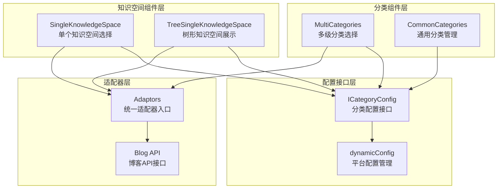

**图表来源**
- [MultiCategories.vue:1-215](file://src/components/publish/form/category/MultiCategories.vue#L1-L215)
- [CommonCategories.vue:1-198](file://src/components/publish/form/CommonCategories.vue#L1-L198)
- [SingleKnowledgeSpace.vue:1-216](file://src/components/publish/form/kwspace/SingleKnowledgeSpace.vue#L1-L216)
- [TreeSingleKnowledgeSpace.vue:1-146](file://src/components/publish/form/kwspace/TreeSingleKnowledgeSpace.vue#L1-L146)

**章节来源**
- [MultiCategories.vue:1-215](file://src/components/publish/form/category/MultiCategories.vue#L1-L215)
- [CommonCategories.vue:1-198](file://src/components/publish/form/CommonCategories.vue#L1-L198)
- [SingleKnowledgeSpace.vue:1-216](file://src/components/publish/form/kwspace/SingleKnowledgeSpace.vue#L1-L216)
- [TreeSingleKnowledgeSpace.vue:1-146](file://src/components/publish/form/kwspace/TreeSingleKnowledgeSpace.vue#L1-L146)

## 核心组件

### 分类配置接口体系

组件基于统一的配置接口体系，确保不同组件间的一致性和可扩展性：

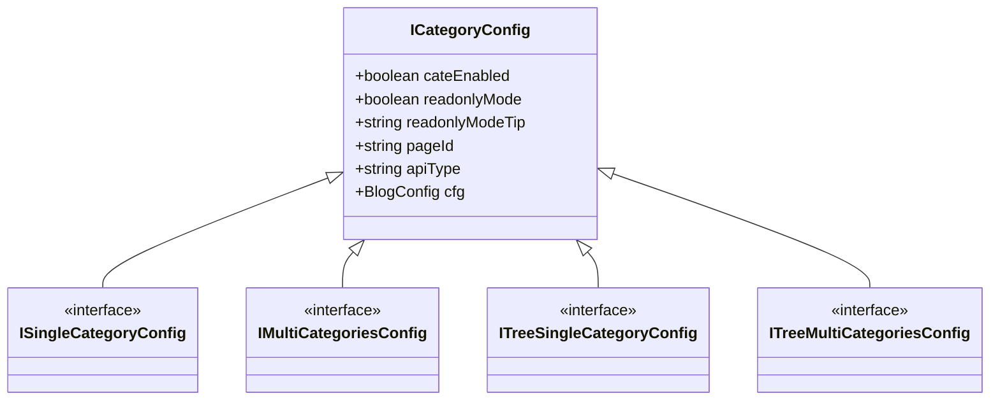

**图表来源**
- [ICategoryConfig.ts:18-87](file://src/types/ICategoryConfig.ts#L18-L87)

### 组件继承关系

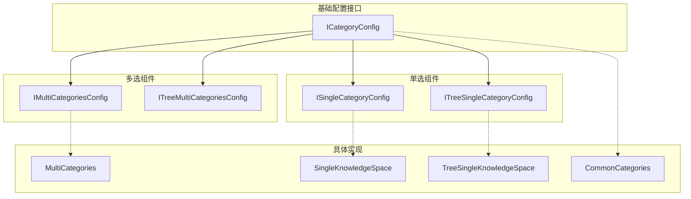

**图表来源**
- [ICategoryConfig.ts:56-87](file://src/types/ICategoryConfig.ts#L56-L87)

**章节来源**
- [ICategoryConfig.ts:1-88](file://src/types/ICategoryConfig.ts#L1-L88)

## 架构概览

### 数据流架构

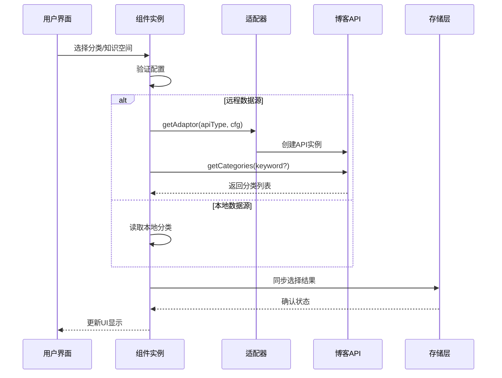

**图表来源**
- [MultiCategories.vue:92-157](file://src/components/publish/form/category/MultiCategories.vue#L92-L157)
- [SingleKnowledgeSpace.vue:88-109](file://src/components/publish/form/kwspace/SingleKnowledgeSpace.vue#L88-L109)
- [TreeSingleKnowledgeSpace.vue:54-77](file://src/components/publish/form/kwspace/TreeSingleKnowledgeSpace.vue#L54-L77)

### 异步加载机制

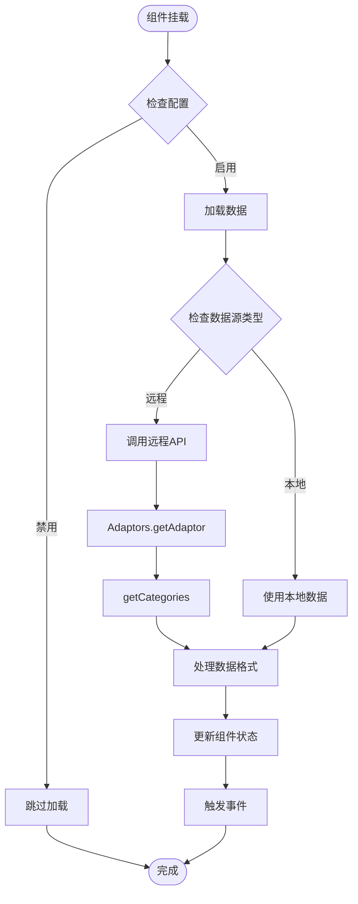

**图表来源**
- [MultiCategories.vue:92-157](file://src/components/publish/form/category/MultiCategories.vue#L92-L157)
- [index.ts:271-467](file://src/adaptors/index.ts#L271-L467)

**章节来源**
- [MultiCategories.vue:92-157](file://src/components/publish/form/category/MultiCategories.vue#L92-L157)
- [SingleKnowledgeSpace.vue:88-126](file://src/components/publish/form/kwspace/SingleKnowledgeSpace.vue#L88-L126)
- [TreeSingleKnowledgeSpace.vue:54-103](file://src/components/publish/form/kwspace/TreeSingleKnowledgeSpace.vue#L54-L103)

## 详细组件分析

### MultiCategories 多级分类选择组件

MultiCategories组件提供了强大的多级分类选择功能，支持树形结构的多选操作。

#### 核心功能特性

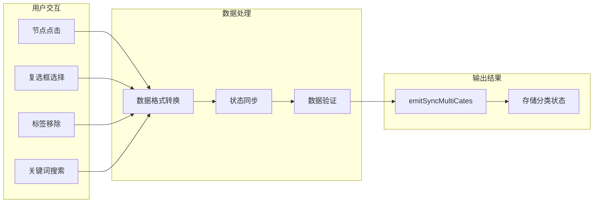

**图表来源**
- [MultiCategories.vue:47-82](file://src/components/publish/form/category/MultiCategories.vue#L47-L82)

#### 数据结构处理

组件采用响应式数据结构来管理分类状态：

| 数据属性 | 类型 | 描述 | 默认值 |
|---------|------|------|--------|
| categoryConfig | IMultiCategoriesConfig | 分类配置对象 | {} |
| categories | string[] | 已选择的分类数组 | [] |
| useRemoteData | boolean | 是否使用远程数据源 | false |
| categorySelected | string[] | 当前选中的分类值 | [] |
| categoryList | Array | 分类选项列表 | [] |

#### 异步加载流程

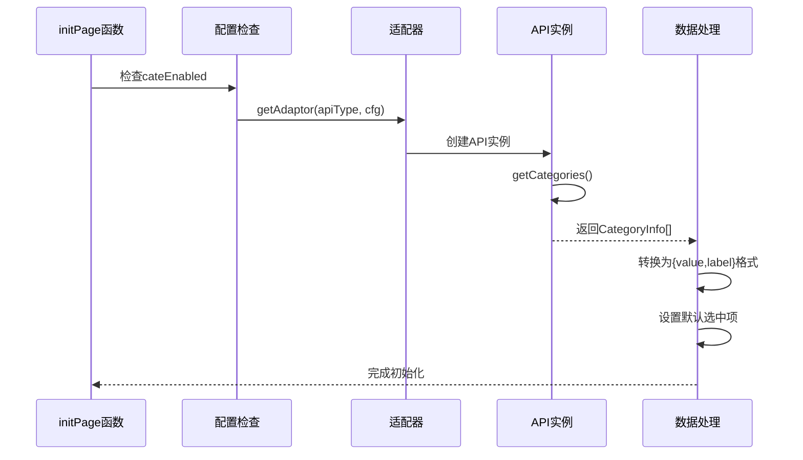

**图表来源**
- [MultiCategories.vue:92-157](file://src/components/publish/form/category/MultiCategories.vue#L92-L157)

**章节来源**
- [MultiCategories.vue:1-215](file://src/components/publish/form/category/MultiCategories.vue#L1-L215)

### CommonCategories 通用分类管理组件

CommonCategories组件专注于分类的通用管理，集成了AI驱动的分类建议功能。

#### AI分类建议工作流

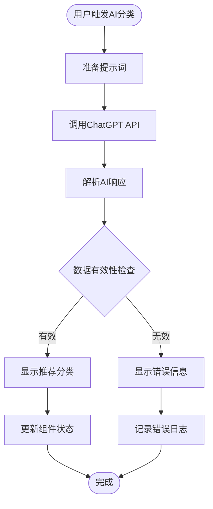

**图表来源**
- [CommonCategories.vue:93-122](file://src/components/publish/form/CommonCategories.vue#L93-L122)

#### 标签管理功能

组件支持动态标签管理，包括：

- **标签添加**：用户输入新标签并确认添加
- **标签移除**：支持一键移除不需要的标签
- **批量操作**：支持AI生成的分类建议批量应用
- **状态同步**：实时同步标签状态到父组件

**章节来源**
- [CommonCategories.vue:1-198](file://src/components/publish/form/CommonCategories.vue#L1-L198)

### SingleKnowledgeSpace 知识空间选择组件

SingleKnowledgeSpace组件提供了单个知识空间的选择功能，支持搜索和懒加载。

#### 搜索和加载机制

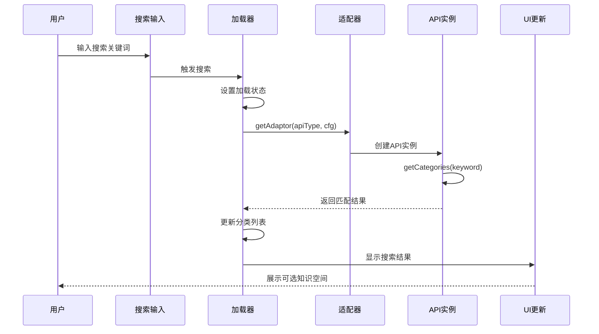

**图表来源**
- [SingleKnowledgeSpace.vue:70-86](file://src/components/publish/form/kwspace/SingleKnowledgeSpace.vue#L70-L86)

#### 自动映射模式

组件支持自动映射分类模式，通过特殊标识符实现：

- **自动映射检测**：当知识空间包含特定标识符时启用只读模式
- **只读模式提示**：向用户显示自动映射的说明信息
- **权限控制**：防止用户手动修改自动生成的分类

**章节来源**
- [SingleKnowledgeSpace.vue:1-216](file://src/components/publish/form/kwspace/SingleKnowledgeSpace.vue#L1-L216)

### TreeSingleKnowledgeSpace 树形知识空间展示组件

TreeSingleKnowledgeSpace组件提供了层次化的树形知识空间展示，支持懒加载和异步数据获取。

#### 树形结构加载

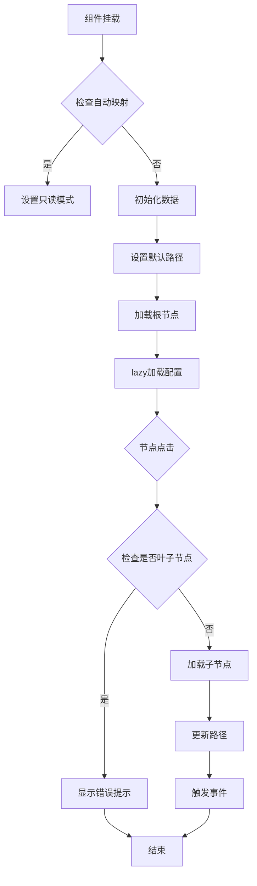

**图表来源**
- [TreeSingleKnowledgeSpace.vue:54-103](file://src/components/publish/form/kwspace/TreeSingleKnowledgeSpace.vue#L54-L103)

#### 懒加载机制

组件采用高效的懒加载策略：

- **按需加载**：只有在用户展开节点时才加载子节点
- **缓存机制**：已加载的节点数据会被缓存，避免重复请求
- **路径管理**：维护当前选择的路径状态
- **异步处理**：所有网络请求都采用异步方式处理

**章节来源**
- [TreeSingleKnowledgeSpace.vue:1-146](file://src/components/publish/form/kwspace/TreeSingleKnowledgeSpace.vue#L1-L146)

## 依赖关系分析

### 组件间依赖关系

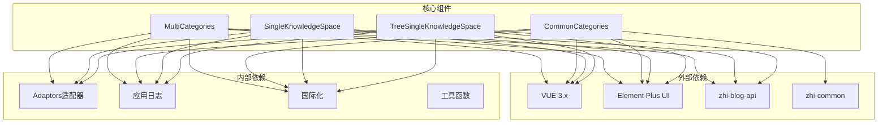

**图表来源**
- [MultiCategories.vue:10-20](file://src/components/publish/form/category/MultiCategories.vue#L10-L20)
- [CommonCategories.vue:10-20](file://src/components/publish/form/CommonCategories.vue#L10-L20)
- [SingleKnowledgeSpace.vue:10-20](file://src/components/publish/form/kwspace/SingleKnowledgeSpace.vue#L10-L20)
- [TreeSingleKnowledgeSpace.vue:10-20](file://src/components/publish/form/kwspace/TreeSingleKnowledgeSpace.vue#L10-L20)

### 适配器模式实现

组件通过统一的适配器模式实现对不同平台的支持：

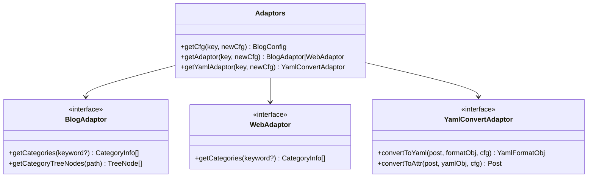

**图表来源**
- [index.ts:56-573](file://src/adaptors/index.ts#L56-L573)

**章节来源**
- [index.ts:1-573](file://src/adaptors/index.ts#L1-L573)

## 性能考虑

### 异步加载优化

组件采用了多种异步加载优化策略：

1. **懒加载机制**：TreeSingleKnowledgeSpace采用按需加载，减少初始请求
2. **缓存策略**：已加载的节点数据缓存，避免重复请求
3. **防抖处理**：搜索功能实现防抖，减少频繁请求
4. **并发控制**：合理控制同时进行的请求数量

### 内存管理

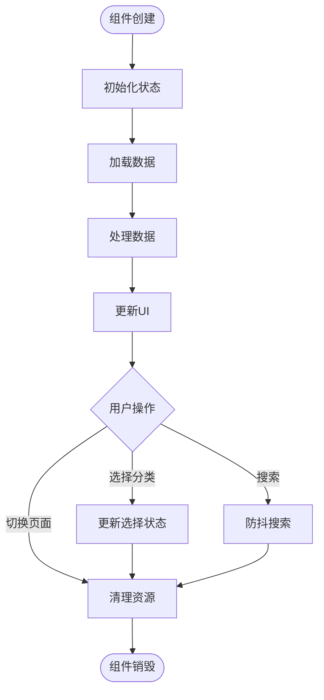

**图表来源**
- [MultiCategories.vue:92-157](file://src/components/publish/form/category/MultiCategories.vue#L92-L157)

### 大数据量处理

对于大量分类数据的场景，组件提供了以下优化：

- **虚拟滚动**：Element Plus的虚拟滚动支持大量选项
- **分页加载**：支持分页获取分类数据
- **增量更新**：只更新发生变化的数据部分
- **内存回收**：及时释放不再使用的数据引用

## 故障排除指南

### 常见问题诊断

#### 分类数据加载失败

**症状**：分类列表为空或加载超时

**可能原因**：
1. API配置错误
2. 网络连接问题
3. 权限不足
4. 平台API限制

**解决方案**：
1. 检查配置中的API类型和参数
2. 验证网络连接状态
3. 确认平台权限设置
4. 查看API响应状态码

#### 知识空间选择异常

**症状**：知识空间选择框无法正常显示或选择

**可能原因**：
1. 树形数据结构不正确
2. 懒加载配置错误
3. 节点状态冲突

**解决方案**：
1. 验证树形数据的父子关系
2. 检查lazy加载回调函数
3. 确认节点的isLeaf属性设置

#### AI分类建议失败

**症状**：AI生成的分类建议为空或报错

**可能原因**：
1. ChatGPT API配置错误
2. 文档内容过少
3. 网络请求超时

**解决方案**：
1. 检查API密钥和请求地址
2. 确保文档有足够的内容
3. 增加请求超时时间

**章节来源**
- [MultiCategories.vue:92-157](file://src/components/publish/form/category/MultiCategories.vue#L92-L157)
- [SingleKnowledgeSpace.vue:70-86](file://src/components/publish/form/kwspace/SingleKnowledgeSpace.vue#L70-L86)
- [TreeSingleKnowledgeSpace.vue:54-103](file://src/components/publish/form/kwspace/TreeSingleKnowledgeSpace.vue#L54-L103)

## 结论

分类和知识空间组件展现了现代前端应用的最佳实践：

1. **模块化设计**：每个组件职责单一，易于维护和扩展
2. **异步处理**：完善的异步加载和错误处理机制
3. **适配器模式**：统一的平台抽象，支持多种数据源
4. **用户体验**：丰富的交互反馈和状态管理
5. **性能优化**：懒加载、缓存和内存管理策略

这些组件为SiYuan插件提供了强大而灵活的分类管理能力，支持从简单的本地分类到复杂的多平台知识空间管理需求。

## 附录

### 扩展指南

#### 添加新的分类组件

1. **定义配置接口**：参考现有的ICategoryConfig接口
2. **实现组件逻辑**：遵循现有组件的设计模式
3. **集成适配器**：通过Adaptors统一接入
4. **测试验证**：确保与现有系统的兼容性

#### 自定义平台支持

1. **创建适配器**：实现BlogAdaptor接口
2. **配置平台类型**：在dynamicConfig中注册新平台
3. **测试集成**：验证分类和知识空间功能
4. **文档完善**：更新相关文档和示例

#### 性能优化建议

1. **监控指标**：添加性能监控和日志记录
2. **缓存策略**：实现更精细的缓存控制
3. **资源管理**：优化内存使用和垃圾回收
4. **用户体验**：提供更好的加载状态反馈