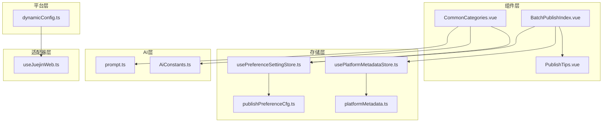
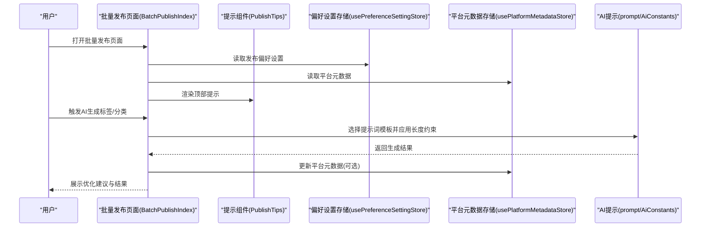
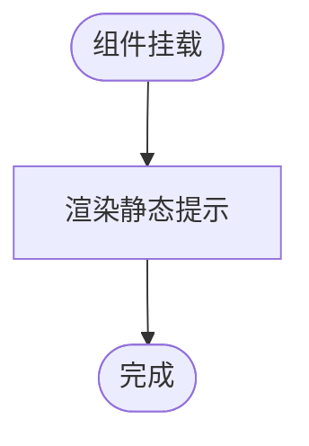
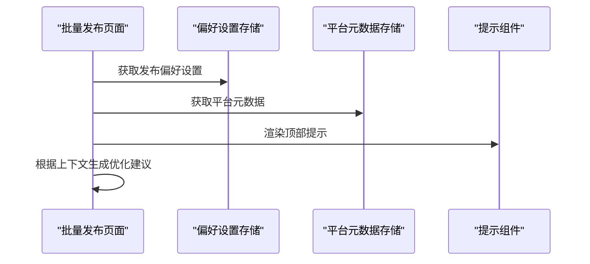
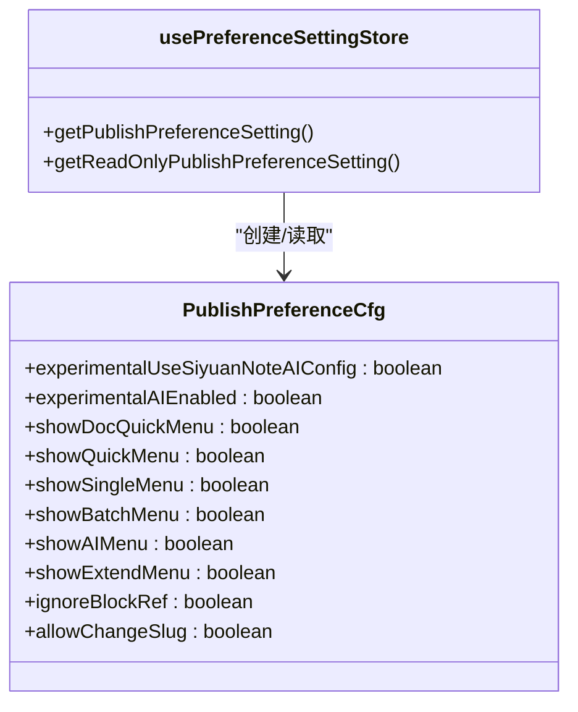
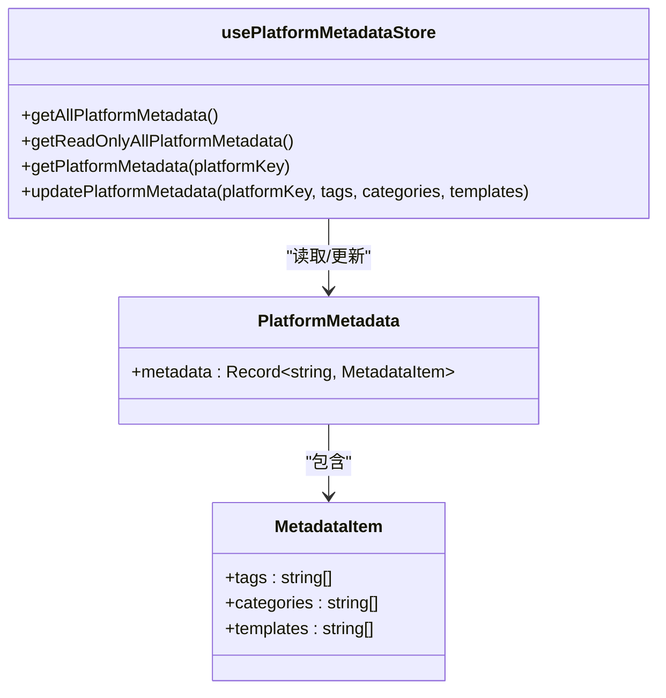
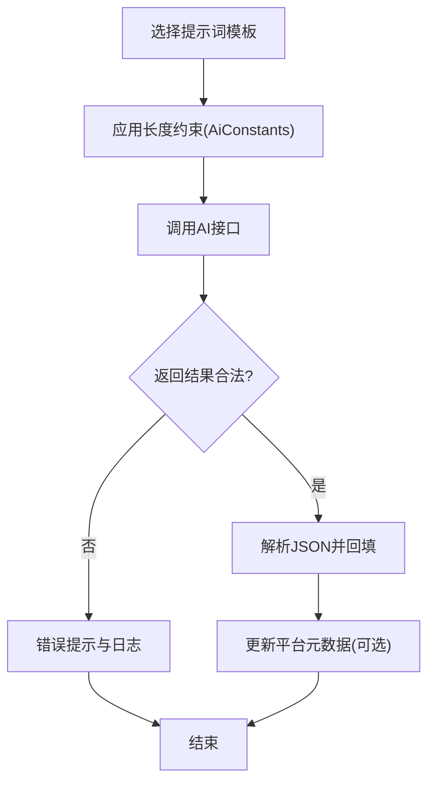
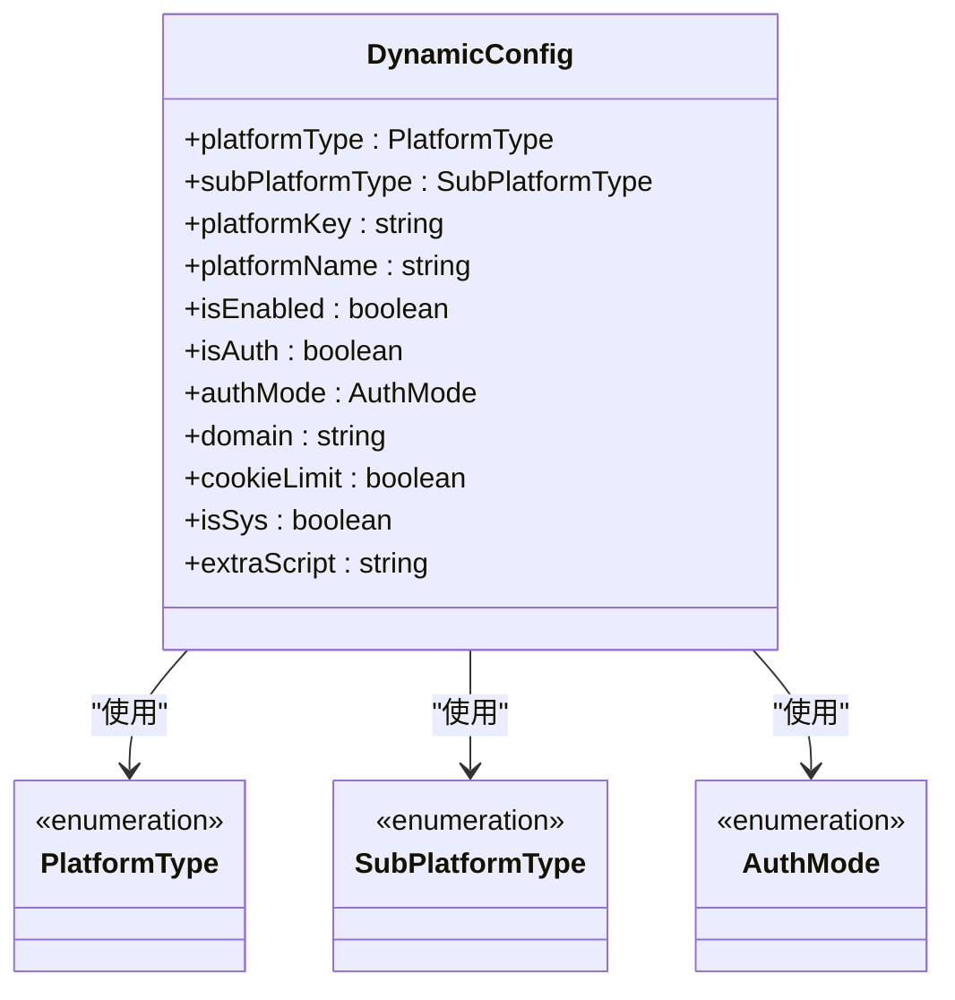
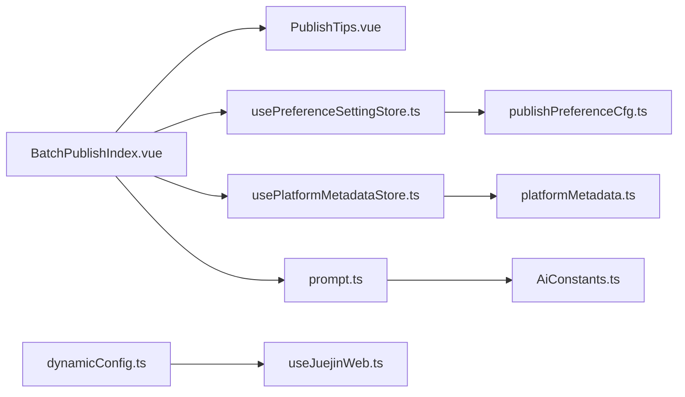

# 发布提示和辅助组件

<cite>
**本文引用的文件**
- [PublishTips.vue](file://src/components/publish/form/PublishTips.vue)
- [BatchPublishIndex.vue](file://src/components/publish/BatchPublishIndex.vue)
- [usePreferenceSettingStore.ts](file://src/stores/usePreferenceSettingStore.ts)
- [publishPreferenceCfg.ts](file://src/models/publishPreferenceCfg.ts)
- [usePlatformMetadataStore.ts](file://src/stores/usePlatformMetadataStore.ts)
- [platformMetadata.ts](file://src/models/platformMetadata.ts)
- [dynamicConfig.ts](file://src/platforms/dynamicConfig.ts)
- [prompt.ts](file://src/ai/prompt.ts)
- [AiConstants.ts](file://src/ai/AiConstants.ts)
- [CommonCategories.vue](file://src/components/publish/form/CommonCategories.vue)
- [useJuejinWeb.ts](file://src/adaptors/web/juejin/useJuejinWeb.ts)
- [policy.md](file://policy.md)
</cite>

## 目录
1. [简介](#简介)
2. [项目结构](#项目结构)
3. [核心组件](#核心组件)
4. [架构总览](#架构总览)
5. [详细组件分析](#详细组件分析)
6. [依赖关系分析](#依赖关系分析)
7. [性能考量](#性能考量)
8. [故障排查指南](#故障排查指南)
9. [结论](#结论)
10. [附录](#附录)

## 简介
本文件面向“发布提示和辅助组件”，聚焦于 PublishTips 组件的智能提示系统设计与实现，涵盖发布建议、平台特性提醒、内容优化建议、最佳实践提示；深入解释提示算法、个性化推荐、上下文感知、实时更新机制；阐述如何基于用户历史行为、平台特点、内容类型提供针对性的发布指导；同时覆盖提示组件的可配置性、用户偏好设置、隐私保护措施，并给出提示系统的扩展接口与自定义规则配置方案。

当前仓库中的 PublishTips 组件为轻量提示容器，主要负责在批量发布流程中显示基础提示信息；更丰富的提示能力（如 AI 自动生成标签/分类、平台元数据驱动的特性提醒）由其他模块协同实现，本文将系统梳理这些能力的来源与交互方式。

## 项目结构
围绕发布提示与辅助功能的关键目录与文件如下：
- 组件层：发布表单中的提示组件与批量发布入口
- 存储层：发布偏好设置与平台元数据持久化
- 平台层：动态平台配置与平台特性定义
- AI 层：提示词模板与常量约束
- 适配器层：各平台特性与限制（如掘金的分类/知识空间策略）

图表来源
- [PublishTips.vue:1-24](file://src/components/publish/form/PublishTips.vue#L1-L24)
- [BatchPublishIndex.vue:32-366](file://src/components/publish/BatchPublishIndex.vue#L32-L366)
- [usePreferenceSettingStore.ts:1-90](file://src/stores/usePreferenceSettingStore.ts#L1-L90)
- [publishPreferenceCfg.ts:1-101](file://src/models/publishPreferenceCfg.ts#L1-L101)
- [usePlatformMetadataStore.ts:1-128](file://src/stores/usePlatformMetadataStore.ts#L1-L128)
- [platformMetadata.ts:1-50](file://src/models/platformMetadata.ts#L1-L50)
- [dynamicConfig.ts:1-200](file://src/platforms/dynamicConfig.ts#L1-L200)
- [prompt.ts:60-108](file://src/ai/prompt.ts#L60-L108)
- [AiConstants.ts:1-26](file://src/ai/AiConstants.ts#L1-L26)
- [CommonCategories.vue:97-124](file://src/components/publish/form/CommonCategories.vue#L97-L124)
- [useJuejinWeb.ts:63-90](file://src/adaptors/web/juejin/useJuejinWeb.ts#L63-L90)

章节来源
- [PublishTips.vue:1-24](file://src/components/publish/form/PublishTips.vue#L1-L24)
- [BatchPublishIndex.vue:32-366](file://src/components/publish/BatchPublishIndex.vue#L32-L366)

## 核心组件
- PublishTips 组件：当前以静态提示为主，位于批量发布页面顶部，用于向用户提供平台分发的基础说明与注意事项。
- 批量发布入口：在初始化阶段读取偏好设置与平台元数据，为后续提示与自动化提供上下文。
- 发布偏好设置：集中管理用户界面可见性、AI 开关、别名变更等偏好，作为个性化提示与自动化行为的依据。
- 平台元数据：记录各平台的标签/分类/模板等能力清单，用于上下文感知的特性提醒与最佳实践提示。
- AI 提示词与常量：为标签/分类抽取提供标准化提示词模板与输入长度约束，支撑内容优化建议与自动化生成。
- 平台动态配置：统一描述平台类型、授权模式、域名、Cookie 限制等，为提示系统提供平台特性数据源。

章节来源
- [PublishTips.vue:10-18](file://src/components/publish/form/PublishTips.vue#L10-L18)
- [BatchPublishIndex.vue:32-366](file://src/components/publish/BatchPublishIndex.vue#L32-L366)
- [usePreferenceSettingStore.ts:34-66](file://src/stores/usePreferenceSettingStore.ts#L34-L66)
- [publishPreferenceCfg.ts:19-97](file://src/models/publishPreferenceCfg.ts#L19-L97)
- [usePlatformMetadataStore.ts:32-73](file://src/stores/usePlatformMetadataStore.ts#L32-L73)
- [platformMetadata.ts:16-47](file://src/models/platformMetadata.ts#L16-L47)
- [prompt.ts:60-108](file://src/ai/prompt.ts#L60-L108)
- [AiConstants.ts:18-23](file://src/ai/AiConstants.ts#L18-L23)
- [dynamicConfig.ts:13-113](file://src/platforms/dynamicConfig.ts#L13-L113)

## 架构总览
发布提示与辅助组件的整体工作流如下：
- 用户进入批量发布页面，组件初始化加载偏好设置与平台元数据。
- 根据平台动态配置与平台元数据，结合 AI 提示词与常量，生成上下文感知的提示与建议。
- 当用户触发 AI 功能（如自动生成标签/分类），系统调用 AI 接口并回填结果，同时更新平台元数据以支持后续提示。

图表来源
- [BatchPublishIndex.vue:32-366](file://src/components/publish/BatchPublishIndex.vue#L32-L366)
- [PublishTips.vue:10-18](file://src/components/publish/form/PublishTips.vue#L10-L18)
- [usePreferenceSettingStore.ts:34-66](file://src/stores/usePreferenceSettingStore.ts#L34-L66)
- [usePlatformMetadataStore.ts:32-73](file://src/stores/usePlatformMetadataStore.ts#L32-L73)
- [prompt.ts:60-108](file://src/ai/prompt.ts#L60-L108)
- [AiConstants.ts:18-23](file://src/ai/AiConstants.ts#L18-L23)

## 详细组件分析

### PublishTips 组件分析
- 角色定位：在批量发布流程中提供基础提示信息，当前为静态提示容器。
- 数据来源：直接渲染，不依赖外部状态或计算属性。
- 可扩展性：可通过引入偏好设置与平台元数据，动态切换提示文案与样式。

图表来源
- [PublishTips.vue:10-18](file://src/components/publish/form/PublishTips.vue#L10-L18)

章节来源
- [PublishTips.vue:1-24](file://src/components/publish/form/PublishTips.vue#L1-L24)

### 批量发布页面与提示集成
- 初始化流程：读取偏好设置与平台元数据，决定是否启用 AI、编辑模式等。
- 提示渲染：在页面主区域插入 PublishTips 组件，形成统一的提示入口。
- AI 生成：在分类/标签生成场景中，调用 AI 提示词模板与长度约束，回填结果并更新元数据。

图表来源
- [BatchPublishIndex.vue:32-366](file://src/components/publish/BatchPublishIndex.vue#L32-L366)
- [usePreferenceSettingStore.ts:34-66](file://src/stores/usePreferenceSettingStore.ts#L34-L66)
- [usePlatformMetadataStore.ts:32-73](file://src/stores/usePlatformMetadataStore.ts#L32-L73)
- [PublishTips.vue:10-18](file://src/components/publish/form/PublishTips.vue#L10-L18)

章节来源
- [BatchPublishIndex.vue:32-366](file://src/components/publish/BatchPublishIndex.vue#L32-L366)

### 发布偏好设置与个性化提示
- 配置模型：包含 AI 开关、菜单可见性、别名变更等字段，提供个性化提示与自动化行为的开关。
- 存储策略：基于本地存储封装，支持只读引用与默认值初始化。
- 思源笔记集成：优先读取思源笔记的 AI 配置，便于统一管理。

图表来源
- [publishPreferenceCfg.ts:19-97](file://src/models/publishPreferenceCfg.ts#L19-L97)
- [usePreferenceSettingStore.ts:34-66](file://src/stores/usePreferenceSettingStore.ts#L34-L66)

章节来源
- [publishPreferenceCfg.ts:1-101](file://src/models/publishPreferenceCfg.ts#L1-L101)
- [usePreferenceSettingStore.ts:1-90](file://src/stores/usePreferenceSettingStore.ts#L1-L90)

### 平台元数据与上下文感知
- 元数据结构：按平台 key 维度维护标签、分类、模板三类能力清单。
- 查询与更新：提供按平台查询与增量更新能力，支持去重与空值过滤。
- 上下文感知：结合平台特性（如是否支持知识空间、标签/分类限制）生成针对性提示。

图表来源
- [platformMetadata.ts:16-47](file://src/models/platformMetadata.ts#L16-L47)
- [usePlatformMetadataStore.ts:32-122](file://src/stores/usePlatformMetadataStore.ts#L32-L122)

章节来源
- [platformMetadata.ts:1-50](file://src/models/platformMetadata.ts#L1-L50)
- [usePlatformMetadataStore.ts:1-128](file://src/stores/usePlatformMetadataStore.ts#L1-L128)

### AI 提示词与内容优化建议
- 提示词模板：提供标题、简述、标签、分类等抽取模板，约束输出格式与字符数。
- 长度约束：基于最大输入长度常量，确保提示词与内容在合理范围内。
- 生成流程：在分类/标签生成场景中，调用 AI 接口并解析结果，回填到表单并记录日志。

图表来源
- [prompt.ts:60-108](file://src/ai/prompt.ts#L60-L108)
- [AiConstants.ts:18-23](file://src/ai/AiConstants.ts#L18-L23)
- [CommonCategories.vue:97-124](file://src/components/publish/form/CommonCategories.vue#L97-L124)

章节来源
- [prompt.ts:60-108](file://src/ai/prompt.ts#L60-L108)
- [AiConstants.ts:1-26](file://src/ai/AiConstants.ts#L1-L26)
- [CommonCategories.vue:97-124](file://src/components/publish/form/CommonCategories.vue#L97-L124)

### 平台特性提醒与最佳实践
- 动态配置：统一描述平台类型、授权模式、域名、Cookie 限制等，为提示系统提供平台特性数据源。
- 平台差异：不同平台对标签/分类/知识空间的支持不同，应据此生成差异化提示。
- 示例：某平台仅支持单选分类与别名标签，提示系统应避免误导用户选择不支持的选项。

图表来源
- [dynamicConfig.ts:13-113](file://src/platforms/dynamicConfig.ts#L13-L113)
- [dynamicConfig.ts:126-166](file://src/platforms/dynamicConfig.ts#L126-L166)
- [dynamicConfig.ts:174-200](file://src/platforms/dynamicConfig.ts#L174-L200)

章节来源
- [dynamicConfig.ts:1-200](file://src/platforms/dynamicConfig.ts#L1-L200)
- [useJuejinWeb.ts:63-90](file://src/adaptors/web/juejin/useJuejinWeb.ts#L63-L90)

## 依赖关系分析
- 组件耦合：PublishTips 与批量发布页面存在直接依赖；批量发布页面通过存储层与 AI 层间接耦合。
- 存储层：偏好设置与平台元数据均采用本地存储封装，降低跨组件耦合。
- 平台层：动态配置为平台特性提供统一抽象，减少平台差异带来的提示复杂度。
- AI 层：提示词与常量为内容优化提供标准化能力，避免硬编码。

图表来源
- [BatchPublishIndex.vue:32-366](file://src/components/publish/BatchPublishIndex.vue#L32-L366)
- [PublishTips.vue:10-18](file://src/components/publish/form/PublishTips.vue#L10-L18)
- [usePreferenceSettingStore.ts:34-66](file://src/stores/usePreferenceSettingStore.ts#L34-L66)
- [usePlatformMetadataStore.ts:32-73](file://src/stores/usePlatformMetadataStore.ts#L32-L73)
- [publishPreferenceCfg.ts:19-97](file://src/models/publishPreferenceCfg.ts#L19-L97)
- [platformMetadata.ts:16-47](file://src/models/platformMetadata.ts#L16-L47)
- [prompt.ts:60-108](file://src/ai/prompt.ts#L60-L108)
- [AiConstants.ts:18-23](file://src/ai/AiConstants.ts#L18-L23)
- [dynamicConfig.ts:13-113](file://src/platforms/dynamicConfig.ts#L13-L113)
- [useJuejinWeb.ts:63-90](file://src/adaptors/web/juejin/useJuejinWeb.ts#L63-L90)

章节来源
- [BatchPublishIndex.vue:32-366](file://src/components/publish/BatchPublishIndex.vue#L32-L366)
- [dynamicConfig.ts:1-200](file://src/platforms/dynamicConfig.ts#L1-L200)

## 性能考量
- 存储访问：偏好设置与平台元数据采用本地存储封装，建议在批量操作中合并读取，减少多次 IO。
- AI 调用：提示词长度约束与合理的输入截断可降低超长内容带来的延迟风险。
- 渲染优化：提示组件保持轻量，避免频繁重渲染；批量页面可按需渲染提示区域。

## 故障排查指南
- AI 请求失败：检查提示词模板与长度约束是否匹配；确认网络与鉴权配置正确。
- 平台特性不符：核对动态配置与平台适配器中的能力声明，避免误导用户。
- 元数据异常：检查元数据更新逻辑中的去重与空值过滤，确保数据一致性。
- 隐私与日志：遵循隐私政策，避免在日志中记录敏感信息；必要时关闭调试日志。

章节来源
- [CommonCategories.vue:97-124](file://src/components/publish/form/CommonCategories.vue#L97-L124)
- [usePlatformMetadataStore.ts:83-122](file://src/stores/usePlatformMetadataStore.ts#L83-L122)
- [policy.md:21-40](file://policy.md#L21-L40)

## 结论
当前 PublishTips 组件承担基础提示职责，更丰富的智能提示能力由偏好设置、平台元数据、AI 提示词与平台动态配置共同构成。通过统一的数据模型与标准化的提示词模板，系统实现了面向平台差异与内容类型的上下文感知提示，并为个性化推荐与实时更新提供了扩展空间。建议在现有基础上逐步增强提示的动态性与交互性，同时完善隐私保护与错误处理机制。

## 附录

### 可配置性与用户偏好设置
- 发布偏好设置项：AI 开关、菜单可见性、别名变更、块引用忽略等。
- 存储位置：本地存储封装，支持只读引用与默认值初始化。
- 思源笔记集成：优先读取思源笔记的 AI 配置，便于统一管理。

章节来源
- [publishPreferenceCfg.ts:19-97](file://src/models/publishPreferenceCfg.ts#L19-L97)
- [usePreferenceSettingStore.ts:34-66](file://src/stores/usePreferenceSettingStore.ts#L34-L66)

### 平台特性提醒与最佳实践
- 动态配置：统一描述平台类型、授权模式、域名、Cookie 限制等。
- 平台差异：不同平台对标签/分类/知识空间的支持不同，应据此生成差异化提示。
- 示例：某平台仅支持单选分类与别名标签，提示系统应避免误导用户选择不支持的选项。

章节来源
- [dynamicConfig.ts:13-113](file://src/platforms/dynamicConfig.ts#L13-L113)
- [useJuejinWeb.ts:63-90](file://src/adaptors/web/juejin/useJuejinWeb.ts#L63-L90)

### 提示系统的扩展接口与自定义规则
- 扩展点：可在提示词模板中增加自定义规则；在平台元数据中新增能力字段；在动态配置中扩展平台类型枚举。
- 自定义规则：结合用户历史行为与平台特点，动态选择提示词模板与提示文案。
- 实时更新：通过平台元数据的增量更新与偏好设置的只读引用，实现提示内容的实时刷新。

章节来源
- [prompt.ts:60-108](file://src/ai/prompt.ts#L60-L108)
- [usePlatformMetadataStore.ts:83-122](file://src/stores/usePlatformMetadataStore.ts#L83-L122)
- [dynamicConfig.ts:126-166](file://src/platforms/dynamicConfig.ts#L126-L166)