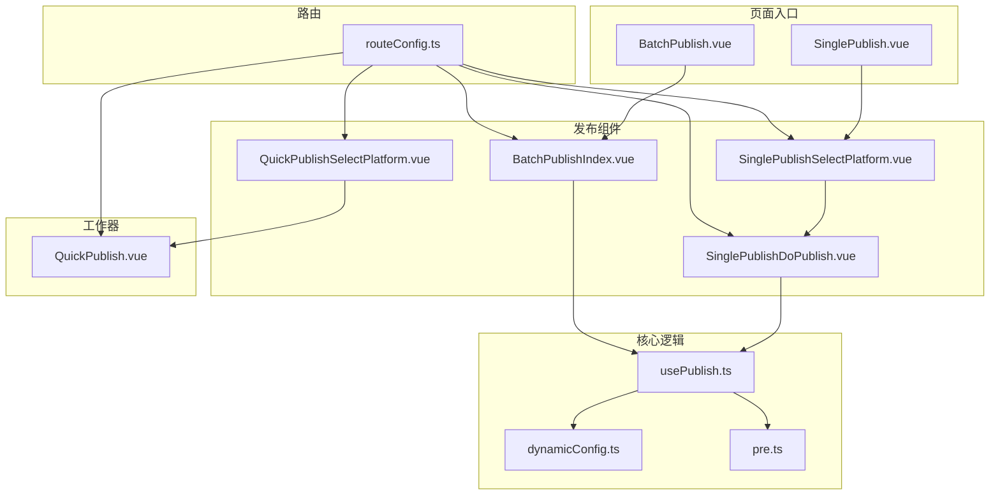
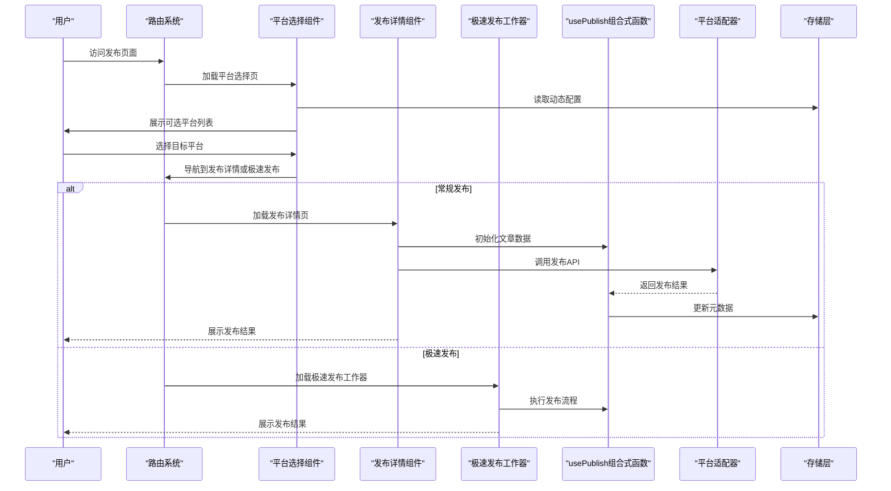
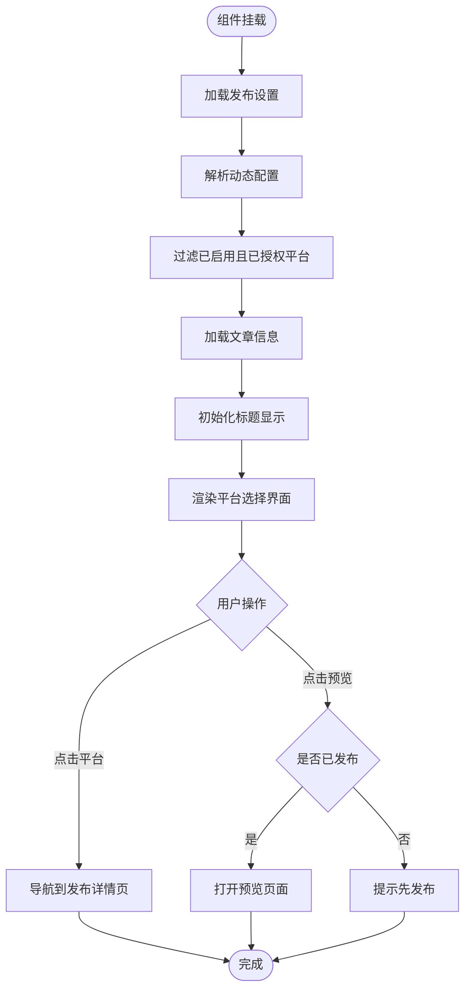
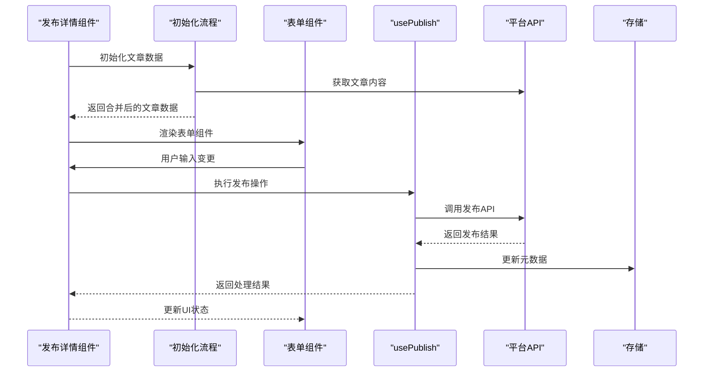
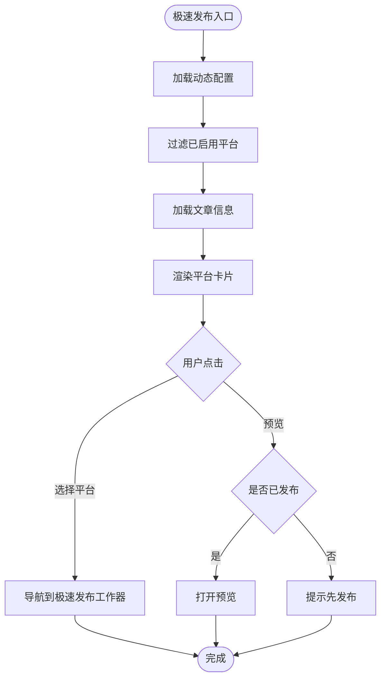
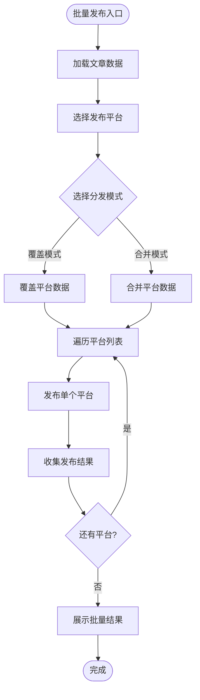
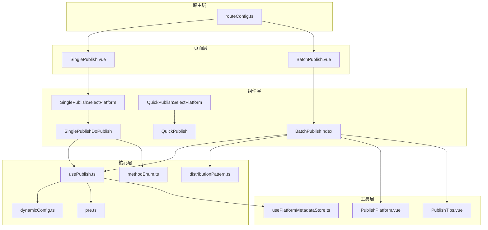

# 发布流程组件

<cite>
**本文档引用的文件**
- [SinglePublishSelectPlatform.vue](file://src/components/publish/SinglePublishSelectPlatform.vue)
- [SinglePublishDoPublish.vue](file://src/components/publish/SinglePublishDoPublish.vue)
- [QuickPublishSelectPlatform.vue](file://src/components/publish/QuickPublishSelectPlatform.vue)
- [BatchPublishIndex.vue](file://src/components/publish/BatchPublishIndex.vue)
- [usePublish.ts](file://src/composables/usePublish.ts)
- [dynamicConfig.ts](file://src/platforms/dynamicConfig.ts)
- [QuickPublish.vue](file://src/workers/QuickPublish.vue)
- [routeConfig.ts](file://src/routes/routeConfig.ts)
- [distributionPattern.ts](file://src/models/distributionPattern.ts)
- [BatchPublish.vue](file://src/pages/BatchPublish.vue)
- [SinglePublish.vue](file://src/pages/SinglePublish.vue)
- [PublishPlatform.vue](file://src/components/publish/form/PublishPlatform.vue)
- [PublishTips.vue](file://src/components/publish/form/PublishTips.vue)
- [methodEnum.ts](file://src/models/methodEnum.ts)
- [usePlatformMetadataStore.ts](file://src/stores/usePlatformMetadataStore.ts)
- [pre.ts](file://src/platforms/pre.ts)
</cite>

## 目录
1. [简介](#简介)
2. [项目结构](#项目结构)
3. [核心组件](#核心组件)
4. [架构概览](#架构概览)
5. [详细组件分析](#详细组件分析)
6. [依赖关系分析](#依赖关系分析)
7. [性能考虑](#性能考虑)
8. [故障排除指南](#故障排除指南)
9. [结论](#结论)
10. [附录](#附录)

## 简介
本文档深入解析发布流程组件，涵盖SinglePublishSelectPlatform的平台选择逻辑、SinglePublishDoPublish的发布执行流程、QuickPublishSelectPlatform的极速发布机制以及BatchPublishIndex的批量发布管理功能。文档详细说明各组件间的通信机制、状态传递、数据流转，并提供状态机设计、用户体验优化策略、错误处理方案，以及组件复用模式和扩展开发指南。

## 项目结构
发布流程相关的核心文件分布于以下模块：
- 页面入口：SinglePublish.vue、BatchPublish.vue
- 发布组件：SinglePublishSelectPlatform.vue、SinglePublishDoPublish.vue、QuickPublishSelectPlatform.vue、BatchPublishIndex.vue
- 工作器：QuickPublish.vue
- 路由配置：routeConfig.ts
- 发布组合式函数：usePublish.ts
- 平台配置：dynamicConfig.ts、pre.ts
- 批量发布模型：distributionPattern.ts
- 表单组件：PublishPlatform.vue、PublishTips.vue
- 方法枚举：methodEnum.ts
- 平台元数据存储：usePlatformMetadataStore.ts

**图表来源**
- [SinglePublish.vue:10-21](file://src/pages/SinglePublish.vue#L10-L21)
- [BatchPublish.vue:10-21](file://src/pages/BatchPublish.vue#L10-L21)
- [SinglePublishSelectPlatform.vue:10-150](file://src/components/publish/SinglePublishSelectPlatform.vue#L10-L150)
- [SinglePublishDoPublish.vue:10-462](file://src/components/publish/SinglePublishDoPublish.vue#L10-L462)
- [QuickPublishSelectPlatform.vue:10-150](file://src/components/publish/QuickPublishSelectPlatform.vue#L10-L150)
- [BatchPublishIndex.vue:10-355](file://src/components/publish/BatchPublishIndex.vue#L10-L355)
- [QuickPublish.vue:10-101](file://src/workers/QuickPublish.vue#L10-L101)
- [routeConfig.ts:42-56](file://src/routes/routeConfig.ts#L42-L56)
- [usePublish.ts:44-557](file://src/composables/usePublish.ts#L44-L557)
- [dynamicConfig.ts:13-113](file://src/platforms/dynamicConfig.ts#L13-L113)
- [pre.ts:101-462](file://src/platforms/pre.ts#L101-L462)

**章节来源**
- [routeConfig.ts:42-56](file://src/routes/routeConfig.ts#L42-L56)
- [SinglePublish.vue:10-21](file://src/pages/SinglePublish.vue#L10-L21)
- [BatchPublish.vue:10-21](file://src/pages/BatchPublish.vue#L10-L21)

## 核心组件
本节概述四个核心发布组件的功能职责：

- **SinglePublishSelectPlatform**：提供平台选择界面，过滤已启用且授权的平台，支持一键预览功能，根据文章发布状态决定按钮显示。
- **SinglePublishDoPublish**：单平台发布执行页，负责文章初始化、表单渲染、发布/更新/删除操作、属性同步到思源笔记。
- **QuickPublishSelectPlatform**：极速发布入口，提供一键发布到指定平台的能力，简化发布流程。
- **BatchPublishIndex**：批量发布管理页，支持多平台分发、覆盖/合并模式、批量删除、结果展示与错误处理。

**章节来源**
- [SinglePublishSelectPlatform.vue:50-138](file://src/components/publish/SinglePublishSelectPlatform.vue#L50-L138)
- [SinglePublishDoPublish.vue:61-102](file://src/components/publish/SinglePublishDoPublish.vue#L61-L102)
- [QuickPublishSelectPlatform.vue:52-138](file://src/components/publish/QuickPublishSelectPlatform.vue#L52-L138)
- [BatchPublishIndex.vue:60-102](file://src/components/publish/BatchPublishIndex.vue#L60-L102)

## 架构概览
发布流程采用分层架构设计，通过组合式函数统一处理发布逻辑，路由驱动页面切换，平台配置驱动功能扩展。

**图表来源**
- [routeConfig.ts:42-56](file://src/routes/routeConfig.ts#L42-L56)
- [SinglePublishSelectPlatform.vue:62-77](file://src/components/publish/SinglePublishSelectPlatform.vue#L62-L77)
- [SinglePublishDoPublish.vue:358-461](file://src/components/publish/SinglePublishDoPublish.vue#L358-L461)
- [QuickPublishSelectPlatform.vue:64-77](file://src/components/publish/QuickPublishSelectPlatform.vue#L64-L77)
- [QuickPublish.vue:62-100](file://src/workers/QuickPublish.vue#L62-L100)
- [usePublish.ts:70-212](file://src/composables/usePublish.ts#L70-L212)

## 详细组件分析

### SinglePublishSelectPlatform 组件分析
该组件负责平台选择与预览功能，核心逻辑包括：

- **平台筛选**：从动态配置中过滤出已启用且已授权的平台，确保用户只能选择可用平台。
- **发布状态判断**：通过文章元数据中的平台标识判断文章是否已发布，决定按钮显示状态。
- **一键预览**：支持对已发布平台进行预览，未发布平台提示用户先发布。
- **页面初始化**：加载文章信息、动态配置、偏好设置，支持标题修复功能。

**图表来源**
- [SinglePublishSelectPlatform.vue:124-149](file://src/components/publish/SinglePublishSelectPlatform.vue#L124-L149)
- [SinglePublishSelectPlatform.vue:62-122](file://src/components/publish/SinglePublishSelectPlatform.vue#L62-L122)

**章节来源**
- [SinglePublishSelectPlatform.vue:50-138](file://src/components/publish/SinglePublishSelectPlatform.vue#L50-L138)

### SinglePublishDoPublish 组件分析
该组件实现单平台发布的核心流程，包含以下关键功能：

- **发布状态管理**：区分新增和更新两种方法，通过MethodEnum控制。
- **文章初始化**：根据方法参数决定从思源笔记获取原始数据还是从平台获取远程数据。
- **表单渲染**：根据平台类型动态渲染不同表单组件，支持复杂模式下的标签、分类、发布时间等配置。
- **发布执行**：调用usePublish组合式函数执行发布，处理成功/失败状态并更新UI。
- **属性同步**：支持将平台属性同步回思源笔记，保持数据一致性。

**图表来源**
- [SinglePublishDoPublish.vue:358-461](file://src/components/publish/SinglePublishDoPublish.vue#L358-L461)
- [SinglePublishDoPublish.vue:104-147](file://src/components/publish/SinglePublishDoPublish.vue#L104-L147)
- [usePublish.ts:432-495](file://src/composables/usePublish.ts#L432-L495)

**章节来源**
- [SinglePublishDoPublish.vue:61-102](file://src/components/publish/SinglePublishDoPublish.vue#L61-L102)
- [SinglePublishDoPublish.vue:104-147](file://src/components/publish/SinglePublishDoPublish.vue#L104-L147)
- [SinglePublishDoPublish.vue:358-461](file://src/components/publish/SinglePublishDoPublish.vue#L358-L461)

### QuickPublishSelectPlatform 组件分析
极速发布组件提供一键发布能力，核心特点：

- **极速发布入口**：直接导航到工作器页面，减少中间步骤。
- **平台选择**：与常规发布相同的平台筛选逻辑，确保可用性。
- **预览功能**：支持一键预览已发布平台的文章。
- **页面初始化**：加载文章信息和动态配置，支持标题修复。

**图表来源**
- [QuickPublishSelectPlatform.vue:124-149](file://src/components/publish/QuickPublishSelectPlatform.vue#L124-L149)
- [QuickPublishSelectPlatform.vue:64-122](file://src/components/publish/QuickPublishSelectPlatform.vue#L64-L122)

**章节来源**
- [QuickPublishSelectPlatform.vue:52-138](file://src/components/publish/QuickPublishSelectPlatform.vue#L52-L138)

### BatchPublishIndex 组件分析
批量发布管理组件支持多平台分发，具备以下功能：

- **平台选择**：通过PublishPlatform组件选择多个目标平台。
- **分发模式**：支持覆盖模式和合并模式，影响文章数据的处理方式。
- **批量发布**：依次向选定平台发布文章，收集结果并展示。
- **批量删除**：支持批量删除已发布文章，内置平台除外。
- **结果展示**：清晰展示成功/失败结果，提供错误详情和强制解除关联功能。

**图表来源**
- [BatchPublishIndex.vue:104-177](file://src/components/publish/BatchPublishIndex.vue#L104-L177)
- [BatchPublishIndex.vue:497-546](file://src/components/publish/BatchPublishIndex.vue#L497-L546)
- [PublishPlatform.vue:49-85](file://src/components/publish/form/PublishPlatform.vue#L49-L85)

**章节来源**
- [BatchPublishIndex.vue:60-102](file://src/components/publish/BatchPublishIndex.vue#L60-L102)
- [BatchPublishIndex.vue:104-177](file://src/components/publish/BatchPublishIndex.vue#L104-L177)
- [BatchPublishIndex.vue:497-546](file://src/components/publish/BatchPublishIndex.vue#L497-L546)

## 依赖关系分析
发布流程组件间存在明确的依赖关系：

**图表来源**
- [routeConfig.ts:42-56](file://src/routes/routeConfig.ts#L42-L56)
- [SinglePublish.vue:10-21](file://src/pages/SinglePublish.vue#L10-L21)
- [BatchPublish.vue:10-21](file://src/pages/BatchPublish.vue#L10-L21)
- [usePublish.ts:44-557](file://src/composables/usePublish.ts#L44-L557)
- [dynamicConfig.ts:13-113](file://src/platforms/dynamicConfig.ts#L13-L113)
- [pre.ts:101-462](file://src/platforms/pre.ts#L101-L462)
- [distributionPattern.ts:13-23](file://src/models/distributionPattern.ts#L13-L23)
- [methodEnum.ts:13-23](file://src/models/methodEnum.ts#L13-L23)
- [usePlatformMetadataStore.ts:83-122](file://src/stores/usePlatformMetadataStore.ts#L83-L122)
- [PublishPlatform.vue:49-85](file://src/components/publish/form/PublishPlatform.vue#L49-L85)
- [PublishTips.vue:10-19](file://src/components/publish/form/PublishTips.vue#L10-L19)

**章节来源**
- [routeConfig.ts:42-56](file://src/routes/routeConfig.ts#L42-L56)
- [usePublish.ts:44-557](file://src/composables/usePublish.ts#L44-L557)

## 性能考虑
发布流程在性能方面采取了多项优化措施：

- **懒加载与骨架屏**：所有发布组件均实现了骨架屏显示，提升首屏渲染性能。
- **异步初始化**：平台配置和文章数据采用异步加载，避免阻塞主线程。
- **缓存策略**：动态配置和平台元数据采用本地存储，减少重复请求。
- **批量处理**：批量发布采用顺序处理，避免并发冲突，同时提供进度反馈。
- **条件渲染**：根据平台类型和用户权限动态渲染表单组件，减少DOM节点数量。

## 故障排除指南
发布流程的错误处理策略：

- **网络异常**：统一捕获API调用异常，显示友好提示并记录日志。
- **配置错误**：校验平台配置完整性，提供具体的配置指导。
- **权限问题**：检测授权状态，引导用户完成授权流程。
- **数据不一致**：通过元数据同步机制保持平台间数据一致性。
- **用户操作**：提供撤销、重试、强制删除等操作选项。

**章节来源**
- [usePublish.ts:195-203](file://src/composables/usePublish.ts#L195-L203)
- [usePublish.ts:265-273](file://src/composables/usePublish.ts#L265-L273)
- [SinglePublishDoPublish.vue:139-147](file://src/components/publish/SinglePublishDoPublish.vue#L139-L147)
- [BatchPublishIndex.vue:166-177](file://src/components/publish/BatchPublishIndex.vue#L166-L177)

## 结论
发布流程组件通过清晰的分层架构和标准化的接口设计，实现了灵活、可扩展的多平台发布能力。组件间通过路由和组合式函数实现松耦合，既保证了功能的独立性，又确保了数据的一致性和用户体验的连贯性。极速发布和批量发布功能进一步提升了用户的发布效率，而完善的错误处理和状态管理机制确保了系统的稳定性和可靠性。

## 附录

### 组件复用模式
- **组合式函数模式**：usePublish.ts提供统一的发布逻辑，可在多个组件中复用。
- **平台配置模式**：dynamicConfig.ts和pre.ts定义平台规范，支持新平台快速接入。
- **表单组件模式**：通过props和事件机制实现表单组件的通用化。

### 扩展开发指南
- **新增平台**：在pre.ts中添加平台配置，在dynamicConfig.ts中定义平台类型。
- **自定义发布流程**：通过继承或组合现有组件实现特定需求。
- **UI定制**：通过CSS变量和样式覆盖实现界面定制。

**章节来源**
- [pre.ts:101-462](file://src/platforms/pre.ts#L101-L462)
- [dynamicConfig.ts:13-113](file://src/platforms/dynamicConfig.ts#L13-L113)
- [usePublish.ts:44-557](file://src/composables/usePublish.ts#L44-L557)