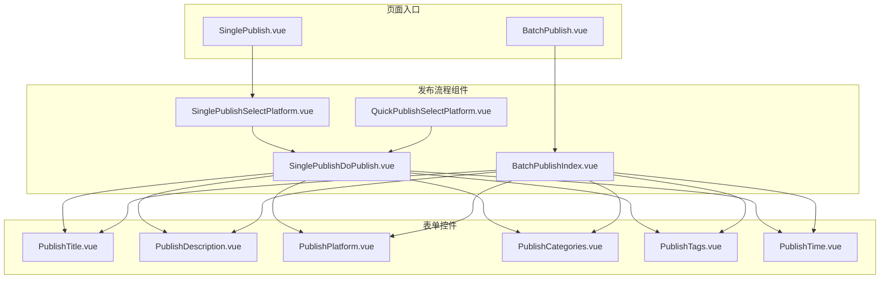
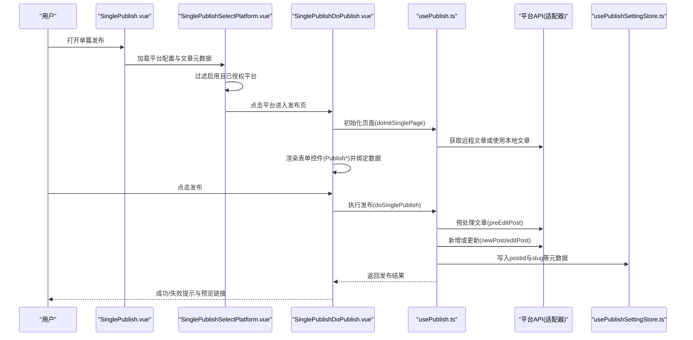
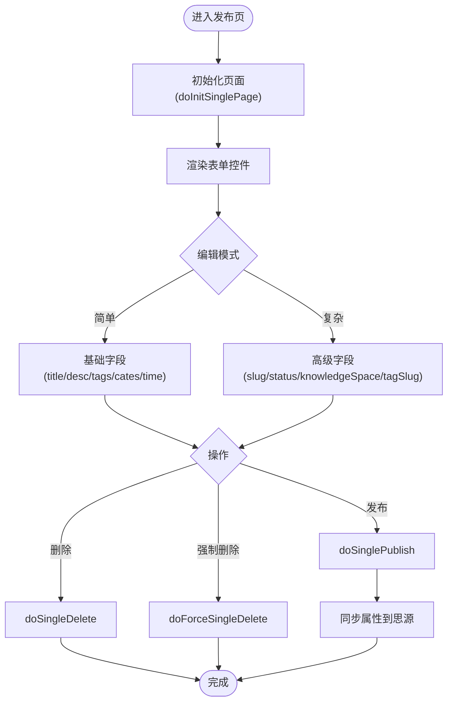
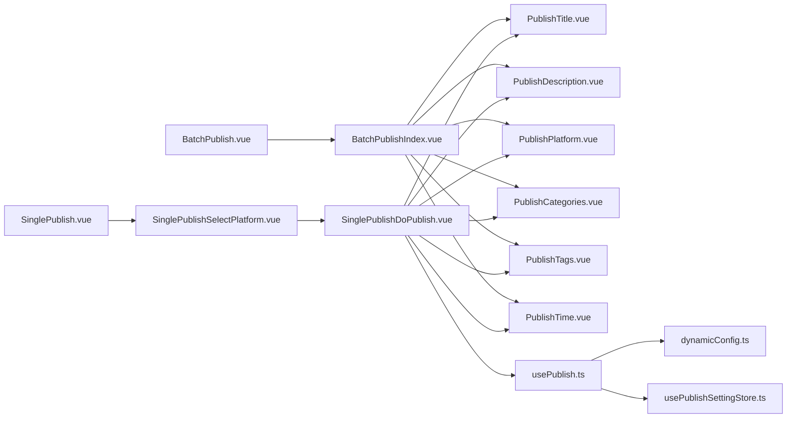

# 发布组件

<cite>
**本文引用的文件**   
- [SinglePublishSelectPlatform.vue](file://src/components/publish/SinglePublishSelectPlatform.vue)
- [SinglePublishDoPublish.vue](file://src/components/publish/SinglePublishDoPublish.vue)
- [BatchPublishIndex.vue](file://src/components/publish/BatchPublishIndex.vue)
- [QuickPublishSelectPlatform.vue](file://src/components/publish/QuickPublishSelectPlatform.vue)
- [SinglePublish.vue](file://src/pages/SinglePublish.vue)
- [BatchPublish.vue](file://src/pages/BatchPublish.vue)
- [PublishTitle.vue](file://src/components/publish/form/PublishTitle.vue)
- [PublishDescription.vue](file://src/components/publish/form/PublishDescription.vue)
- [PublishPlatform.vue](file://src/components/publish/form/PublishPlatform.vue)
- [PublishCategories.vue](file://src/components/publish/form/PublishCategories.vue)
- [PublishTags.vue](file://src/components/publish/form/PublishTags.vue)
- [PublishTime.vue](file://src/components/publish/form/PublishTime.vue)
- [usePublish.ts](file://src/composables/usePublish.ts)
- [usePublishSettingStore.ts](file://src/stores/usePublishSettingStore.ts)
- [dynamicConfig.ts](file://src/platforms/dynamicConfig.ts)
- [distributionPattern.ts](file://src/models/distributionPattern.ts)
</cite>

## 目录
1. [简介](#简介)
2. [项目结构](#项目结构)
3. [核心组件](#核心组件)
4. [架构总览](#架构总览)
5. [详细组件分析](#详细组件分析)
6. [依赖关系分析](#依赖关系分析)
7. [性能考量](#性能考量)
8. [故障排查指南](#故障排查指南)
9. [结论](#结论)
10. [附录](#附录)

## 简介
本文件面向“发布组件系统”的使用者与维护者，系统化梳理发布流程组件与发布表单组件的设计与实现，涵盖以下内容：
- 发布流程组件：SinglePublishSelectPlatform、SinglePublishDoPublish、BatchPublishIndex、QuickPublishSelectPlatform
- 发布表单组件：PublishTitle、PublishDescription、PublishPlatform、PublishCategories、PublishTags、PublishTime
- 发布状态管理、表单验证、数据绑定机制
- 用户体验设计、错误处理、进度提示
- 可复用性设计与扩展指南

## 项目结构
发布组件位于 src/components/publish 及其子目录，配合 src/components/publish/form 中的表单控件，形成完整的发布工作流。页面入口位于 src/pages 下，分别承载单篇发布与批量发布。

图表来源
- [SinglePublish.vue:10-21](file://src/pages/SinglePublish.vue#L10-L21)
- [BatchPublish.vue:10-21](file://src/pages/BatchPublish.vue#L10-L21)
- [SinglePublishSelectPlatform.vue:10-150](file://src/components/publish/SinglePublishSelectPlatform.vue#L10-L150)
- [SinglePublishDoPublish.vue:10-462](file://src/components/publish/SinglePublishDoPublish.vue#L10-L462)
- [BatchPublishIndex.vue:10-355](file://src/components/publish/BatchPublishIndex.vue#L10-L355)
- [QuickPublishSelectPlatform.vue:10-150](file://src/components/publish/QuickPublishSelectPlatform.vue#L10-L150)
- [PublishTitle.vue:10-132](file://src/components/publish/form/PublishTitle.vue#L10-L132)
- [PublishDescription.vue:10-172](file://src/components/publish/form/PublishDescription.vue#L10-L172)
- [PublishPlatform.vue:10-126](file://src/components/publish/form/PublishPlatform.vue#L10-L126)
- [PublishCategories.vue:10-167](file://src/components/publish/form/PublishCategories.vue#L10-L167)
- [PublishTags.vue:10-270](file://src/components/publish/form/PublishTags.vue#L10-L270)
- [PublishTime.vue:10-65](file://src/components/publish/form/PublishTime.vue#L10-L65)

章节来源
- [SinglePublish.vue:10-21](file://src/pages/SinglePublish.vue#L10-L21)
- [BatchPublish.vue:10-21](file://src/pages/BatchPublish.vue#L10-L21)

## 核心组件
- SinglePublishSelectPlatform：单篇发布入口，列出已启用且已授权的平台，支持一键预览与进入发布页。
- SinglePublishDoPublish：单篇发布执行页，负责表单渲染、数据绑定、发布/更新/删除、预览链接生成与属性同步。
- BatchPublishIndex：批量发布入口，支持选择多个平台、覆盖/合并两种分发策略、批量发布与删除、结果汇总。
- QuickPublishSelectPlatform：极速发布入口，一键直达各平台发布或更新。

章节来源
- [SinglePublishSelectPlatform.vue:10-150](file://src/components/publish/SinglePublishSelectPlatform.vue#L10-L150)
- [SinglePublishDoPublish.vue:10-462](file://src/components/publish/SinglePublishDoPublish.vue#L10-L462)
- [BatchPublishIndex.vue:10-355](file://src/components/publish/BatchPublishIndex.vue#L10-L355)
- [QuickPublishSelectPlatform.vue:10-150](file://src/components/publish/QuickPublishSelectPlatform.vue#L10-L150)

## 架构总览
发布系统采用“页面入口 -> 流程组件 -> 表单控件 -> 业务组合钩子(usePublish) -> 平台适配器”的分层架构。页面入口负责路由参数解析与组件挂载；流程组件负责状态管理、数据绑定、交互逻辑；表单控件负责具体字段的输入与校验；usePublish 提供统一的发布/删除/初始化方法；平台配置由 dynamicConfig.ts 管理。

图表来源
- [SinglePublish.vue:10-21](file://src/pages/SinglePublish.vue#L10-L21)
- [SinglePublishSelectPlatform.vue:10-150](file://src/components/publish/SinglePublishSelectPlatform.vue#L10-L150)
- [SinglePublishDoPublish.vue:10-462](file://src/components/publish/SinglePublishDoPublish.vue#L10-L462)
- [usePublish.ts:70-212](file://src/composables/usePublish.ts#L70-L212)
- [usePublishSettingStore.ts:21-94](file://src/stores/usePublishSettingStore.ts#L21-L94)

## 详细组件分析

### SinglePublishSelectPlatform：单篇发布入口
- 职责
  - 读取发布设置，筛选启用且已授权的平台
  - 读取文章元数据与内容，计算显示标题
  - 提供“一键预览”能力，逐个或批量打开已发布文章的预览页
  - 点击平台跳转至发布执行页
- 关键点
  - 使用 usePublishSettingStore 获取动态配置
  - 使用 dynamicConfig 的 postid/yaml key 规则判断是否已发布
  - 通过路由携带 method 参数区分新增/编辑
- 数据绑定
  - 表单数据：enabledConfigArray、postMeta、postInfo、pageTitle
  - 事件：handleSingleDoPublish、handlePreview、handlePreviewAll

章节来源
- [SinglePublishSelectPlatform.vue:10-150](file://src/components/publish/SinglePublishSelectPlatform.vue#L10-L150)
- [dynamicConfig.ts:504-515](file://src/platforms/dynamicConfig.ts#L504-L515)
- [usePublishSettingStore.ts:21-94](file://src/stores/usePublishSettingStore.ts#L21-L94)

### SinglePublishDoPublish：单篇发布执行页
- 职责
  - 初始化页面：根据 method 选择新增或远程拉取
  - 渲染复杂/简单编辑模式下的表单控件
  - 统一发布/更新/删除/强制删除
  - 同步属性到思源笔记
- 关键点
  - 使用 usePublish 的 doSinglePublish/doSingleDelete/doForceSingleDelete/initPublishMethods
  - 支持 AI 标题/摘要/分类/标签生成
  - 支持知识空间、标签别名、发布状态、发布时间等字段
- 数据绑定
  - 表单数据：mergedPost、publishCfg、tagConfig、categoryConfig、knowledgeSpaceConfig
  - 事件：sync* 系列方法将子组件数据回传父组件

图表来源
- [SinglePublishDoPublish.vue:104-225](file://src/components/publish/SinglePublishDoPublish.vue#L104-L225)
- [usePublish.ts:432-495](file://src/composables/usePublish.ts#L432-L495)

章节来源
- [SinglePublishDoPublish.vue:10-462](file://src/components/publish/SinglePublishDoPublish.vue#L10-L462)
- [usePublish.ts:70-212](file://src/composables/usePublish.ts#L70-L212)

### BatchPublishIndex：批量发布入口
- 职责
  - 选择多个平台，设置分发模式（覆盖/合并）
  - 对每个平台执行发布/删除
  - 展示批量结果与失败详情，支持“强制解除关联”
- 关键点
  - 分发模式：Override/Merge，分别覆盖或合并字段
  - 对系统内置平台与自定义平台分别处理
  - 结果汇总与错误计数
- 数据绑定
  - 表单数据：siyuanPost、publishCfg、categoryConfig、dynList、distriPattern
  - 事件：syncDynList、sync* 系列

章节来源
- [BatchPublishIndex.vue:10-355](file://src/components/publish/BatchPublishIndex.vue#L10-L355)
- [distributionPattern.ts:13-23](file://src/models/distributionPattern.ts#L13-L23)

### QuickPublishSelectPlatform：极速发布入口
- 职责
  - 快速选择平台，一键发布/更新
  - 支持一键预览
- 关键点
  - 与单篇发布入口类似，但路由指向 worker 快速发布页
  - 适合高频、低干扰的快速发布场景

章节来源
- [QuickPublishSelectPlatform.vue:10-150](file://src/components/publish/QuickPublishSelectPlatform.vue#L10-L150)

### 发布表单组件

#### PublishTitle：标题控件
- 功能
  - 输入标题
  - 在启用 AI 时，基于文档内容智能生成标题
- 数据绑定
  - v-model:useAi、v-model、v-model:md、v-model:html
  - emit: emitSyncPublishTitle

章节来源
- [PublishTitle.vue:10-132](file://src/components/publish/form/PublishTitle.vue#L10-L132)

#### PublishDescription：摘要控件
- 功能
  - 输入摘要，支持流式/非流式 AI 生成
- 数据绑定
  - v-model:useAi、v-model:pageId、v-model:desc、v-model:md、v-model:html
  - emit: emitSyncDesc

章节来源
- [PublishDescription.vue:10-172](file://src/components/publish/form/PublishDescription.vue#L10-L172)

#### PublishPlatform：平台选择控件
- 功能
  - 展示已启用且已授权的平台，支持勾选
  - 根据文章元数据预勾选已发布平台
- 数据绑定
  - v-model:id
  - emit: emitSyncDynList

章节来源
- [PublishPlatform.vue:10-126](file://src/components/publish/form/PublishPlatform.vue#L10-L126)

#### PublishCategories：分类控件
- 功能
  - 多级/树形分类选择
  - 在启用 AI 时，基于文档内容智能推荐分类
- 数据绑定
  - v-model:useAi、v-model:categoryType、v-model:categoryConfig、v-model:categories、v-model:md、v-model:html
  - emit: emitSyncCates

章节来源
- [PublishCategories.vue:10-167](file://src/components/publish/form/PublishCategories.vue#L10-L167)

#### PublishTags：标签控件
- 功能
  - 动态标签输入、平台标签树选择、AI 智能抽取标签
- 数据绑定
  - v-model:useAi、v-model:pageId、v-model:tags、v-model:tagConfig、v-model:md、v-model:html
  - emit: emitSyncTags

章节来源
- [PublishTags.vue:10-270](file://src/components/publish/form/PublishTags.vue#L10-L270)

#### PublishTime：发布时间控件
- 功能
  - 设置创建时间与更新时间
- 数据绑定
  - v-model:Post
  - emit: emitSyncPublishTime

章节来源
- [PublishTime.vue:10-65](file://src/components/publish/form/PublishTime.vue#L10-L65)

## 依赖关系分析
- 页面入口依赖流程组件
- 流程组件依赖表单控件与 usePublish
- usePublish 依赖平台配置与适配器
- 平台配置由 dynamicConfig.ts 提供
- 设置存储由 usePublishSettingStore.ts 提供

图表来源
- [SinglePublish.vue:10-21](file://src/pages/SinglePublish.vue#L10-L21)
- [BatchPublish.vue:10-21](file://src/pages/BatchPublish.vue#L10-L21)
- [SinglePublishSelectPlatform.vue:10-150](file://src/components/publish/SinglePublishSelectPlatform.vue#L10-L150)
- [SinglePublishDoPublish.vue:10-462](file://src/components/publish/SinglePublishDoPublish.vue#L10-L462)
- [BatchPublishIndex.vue:10-355](file://src/components/publish/BatchPublishIndex.vue#L10-L355)
- [PublishTitle.vue:10-132](file://src/components/publish/form/PublishTitle.vue#L10-L132)
- [PublishDescription.vue:10-172](file://src/components/publish/form/PublishDescription.vue#L10-L172)
- [PublishPlatform.vue:10-126](file://src/components/publish/form/PublishPlatform.vue#L10-L126)
- [PublishCategories.vue:10-167](file://src/components/publish/form/PublishCategories.vue#L10-L167)
- [PublishTags.vue:10-270](file://src/components/publish/form/PublishTags.vue#L10-L270)
- [PublishTime.vue:10-65](file://src/components/publish/form/PublishTime.vue#L10-L65)
- [usePublish.ts:44-557](file://src/composables/usePublish.ts#L44-L557)
- [dynamicConfig.ts:13-534](file://src/platforms/dynamicConfig.ts#L13-L534)
- [usePublishSettingStore.ts:21-94](file://src/stores/usePublishSettingStore.ts#L21-L94)

## 性能考量
- 组件懒加载与条件渲染：骨架屏与 v-if 控制首屏渲染，减少不必要的 DOM。
- 数据克隆与深拷贝：在发布前对 Post 进行 clone，避免意外污染原始数据。
- 批量发布并发控制：逐个平台顺序发布，避免平台限流与冲突；必要时可在上层增加节流/队列。
- AI 请求优化：流式输出提升交互体验；合理设置超时与重试次数。
- 存储访问：Pinia + 异步存储，避免阻塞主线程；缓存最近一次设置值。

## 故障排查指南
- 发布失败
  - 检查平台配置是否启用且已授权
  - 查看返回的错误消息，定位 API 调用问题
  - 使用“强制解除关联”清理残留元数据
- 预览链接异常
  - 确认平台返回的预览链接是否为绝对路径，否则需拼接 home
- 删除失败
  - 确认 postid 是否存在；若不存在，先在平台侧删除
- AI 生成失败
  - 检查偏好设置中的请求地址与密钥
  - 确保文档内容足够丰富以抽取有效信息
- 批量发布部分失败
  - 查看失败列表与错误计数，逐个平台重试或强制解除关联

章节来源
- [usePublish.ts:195-212](file://src/composables/usePublish.ts#L195-L212)
- [usePublish.ts:265-280](file://src/composables/usePublish.ts#L265-L280)
- [usePublish.ts:329-343](file://src/composables/usePublish.ts#L329-L343)

## 结论
该发布组件系统通过清晰的分层与职责划分，实现了从入口到执行再到表单控件的完整闭环。usePublish 提供统一的业务编排，dynamicConfig 与 Pinia 存储保障了配置与状态的一致性。表单控件围绕“数据绑定 + 事件回传”的模式，既保证了可复用性，也为扩展新字段提供了便利。建议在后续迭代中进一步完善批量并发策略、AI 生成的容错与重试、以及更丰富的可视化反馈。

## 附录

### 发布状态管理与数据绑定机制
- 状态来源
  - 页面级 reactive 数据：如 enabledConfigArray、siyuanPost、mergedPost 等
  - 组合式函数：usePublishSettingStore 提供配置读写；usePublish 提供发布/删除/初始化方法
- 绑定方式
  - v-model 双向绑定标题、摘要、标签、分类、时间等
  - emit 事件回传：emitSyncPublishTitle、emitSyncDesc、emitSyncTags、emitSyncCates、emitSyncPublishTime、emitSyncDynList 等
- 状态流转
  - 初始化：doInitSinglePage 或 assignInitAttrs
  - 发布：doSinglePublish（新增/更新），写入 postid 与 slug
  - 删除：doSingleDelete 或 doForceSingleDelete
  - 同步：handleSyncToSiyuan 将属性写回思源

章节来源
- [SinglePublishDoPublish.vue:287-344](file://src/components/publish/SinglePublishDoPublish.vue#L287-L344)
- [BatchPublishIndex.vue:264-305](file://src/components/publish/BatchPublishIndex.vue#L264-L305)
- [usePublish.ts:352-547](file://src/composables/usePublish.ts#L352-L547)

### 用户体验设计要点
- 一键预览：在入口与执行页均提供预览按钮，减少跳转成本
- 分发模式提示：覆盖/合并模式提供明确警告与提示
- AI 开关：按需启用，避免无效请求
- 成功/失败提示：统一使用 Element Plus Message，失败时提供“强制解除关联”入口
- 加载计时器：页面加载阶段显示计时器，提升感知

章节来源
- [SinglePublishSelectPlatform.vue:103-122](file://src/components/publish/SinglePublishSelectPlatform.vue#L103-L122)
- [BatchPublishIndex.vue:430-451](file://src/components/publish/BatchPublishIndex.vue#L430-L451)

### 可复用性设计与扩展指南
- 可复用性
  - 表单控件均采用 v-model + emit 的标准模式，便于在不同页面复用
  - usePublish 提供统一的发布/删除/初始化方法，降低页面耦合
- 扩展建议
  - 新增字段：在对应表单控件中添加 v-model 与 emit，父组件中添加 sync* 方法接收
  - 新增平台：在 dynamicConfig.ts 中注册平台类型与子类型，适配器层实现 API 调用
  - 新增发布模式：在 BatchPublishIndex 中扩展分发策略，或新增独立页面
  - 新增 AI 功能：在对应控件中集成 useChatGPT，注意流式与非流式的差异

章节来源
- [PublishPlatform.vue:43-62](file://src/components/publish/form/PublishPlatform.vue#L43-L62)
- [dynamicConfig.ts:126-238](file://src/platforms/dynamicConfig.ts#L126-L238)
- [usePublish.ts:549-557](file://src/composables/usePublish.ts#L549-L557)