# 发布表单组件

<cite>
**本文档引用的文件**
- [PublishTitle.vue](file://src/components/publish/form/PublishTitle.vue)
- [PublishDescription.vue](file://src/components/publish/form/PublishDescription.vue)
- [PublishPlatform.vue](file://src/components/publish/form/PublishPlatform.vue)
- [PublishCategories.vue](file://src/components/publish/form/PublishCategories.vue)
- [PublishTags.vue](file://src/components/publish/form/PublishTags.vue)
- [PublishTime.vue](file://src/components/publish/form/PublishTime.vue)
- [PublishStatus.vue](file://src/components/publish/form/PublishStatus.vue)
- [AiSwitch.vue](file://src/components/publish/form/AiSwitch.vue)
- [EditModeSelect.vue](file://src/components/publish/form/EditModeSelect.vue)
- [SourceMode.vue](file://src/components/publish/form/SourceMode.vue)
- [MultiCategories.vue](file://src/components/publish/form/category/MultiCategories.vue)
- [SingleKnowledgeSpace.vue](file://src/components/publish/form/kwspace/SingleKnowledgeSpace.vue)
- [TreeSingleKnowledgeSpace.vue](file://src/components/publish/form/kwspace/TreeSingleKnowledgeSpace.vue)
- [SingleTagSlug.vue](file://src/components/publish/form/tagslug/SingleTagSlug.vue)
- [ICategoryConfig.ts](file://src/types/ICategoryConfig.ts)
- [ITagConfig.ts](file://src/types/ITagConfig.ts)
- [sourceContentShowType.ts](file://src/models/sourceContentShowType.ts)
- [prompt.ts](file://src/ai/prompt.ts)
- [useVueI18n.ts](file://src/composables/useVueI18n.ts)
</cite>

## 目录
1. [简介](#简介)
2. [项目结构](#项目结构)
3. [核心组件](#核心组件)
4. [架构总览](#架构总览)
5. [详细组件分析](#详细组件分析)
6. [依赖分析](#依赖分析)
7. [性能考虑](#性能考虑)
8. [故障排除指南](#故障排除指南)
9. [结论](#结论)
10. [附录](#附录)

## 简介
本文件系统化梳理发布表单组件的设计与实现，覆盖标题、描述、平台、分类、标签、时间、状态等核心表单控件，以及 AI 开关、编辑模式选择、源码模式等特殊功能组件。文档重点阐述表单验证机制、数据绑定策略、动态表单生成、AI 能力集成、可配置性、样式定制与国际化支持。

## 项目结构
发布表单组件主要位于 src/components/publish/form 目录下，按功能划分为：
- 基础表单：PublishTitle、PublishDescription、PublishPlatform、PublishCategories、PublishTags、PublishTime、PublishStatus
- 特殊功能：AiSwitch、EditModeSelect、SourceMode
- 组件组合：MultiCategories（多分类）、SingleKnowledgeSpace（单知识空间）、TreeSingleKnowledgeSpace（树形单知识空间）、SingleTagSlug（单标签别名）

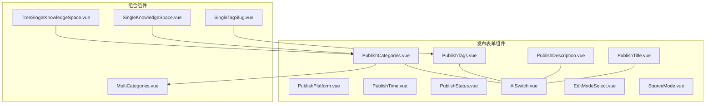

**图表来源**
- [PublishTitle.vue:1-132](file://src/components/publish/form/PublishTitle.vue#L1-L132)
- [PublishDescription.vue:1-172](file://src/components/publish/form/PublishDescription.vue#L1-L172)
- [PublishPlatform.vue:1-126](file://src/components/publish/form/PublishPlatform.vue#L1-L126)
- [PublishCategories.vue:1-167](file://src/components/publish/form/PublishCategories.vue#L1-L167)
- [PublishTags.vue:1-270](file://src/components/publish/form/PublishTags.vue#L1-L270)
- [PublishTime.vue:1-65](file://src/components/publish/form/PublishTime.vue#L1-L65)
- [PublishStatus.vue:1-67](file://src/components/publish/form/PublishStatus.vue#L1-L67)
- [AiSwitch.vue:1-76](file://src/components/publish/form/AiSwitch.vue#L1-L76)
- [EditModeSelect.vue:1-70](file://src/components/publish/form/EditModeSelect.vue#L1-L70)
- [SourceMode.vue:1-424](file://src/components/publish/form/SourceMode.vue#L1-L424)
- [MultiCategories.vue:1-215](file://src/components/publish/form/category/MultiCategories.vue#L1-L215)
- [SingleKnowledgeSpace.vue:1-216](file://src/components/publish/form/kwspace/SingleKnowledgeSpace.vue#L1-L216)
- [TreeSingleKnowledgeSpace.vue:1-146](file://src/components/publish/form/kwspace/TreeSingleKnowledgeSpace.vue#L1-L146)
- [SingleTagSlug.vue:1-151](file://src/components/publish/form/tagslug/SingleTagSlug.vue#L1-L151)

**章节来源**
- [PublishTitle.vue:1-132](file://src/components/publish/form/PublishTitle.vue#L1-L132)
- [PublishPlatform.vue:1-126](file://src/components/publish/form/PublishPlatform.vue#L1-L126)
- [PublishCategories.vue:1-167](file://src/components/publish/form/PublishCategories.vue#L1-L167)
- [PublishTags.vue:1-270](file://src/components/publish/form/PublishTags.vue#L1-L270)
- [SourceMode.vue:1-424](file://src/components/publish/form/SourceMode.vue#L1-L424)

## 核心组件
本节概述各核心表单控件的职责、数据流与交互要点。

- 标题组件（PublishTitle）
  - 功能：输入标题；在启用 AI 时，基于 Markdown/HTML 内容智能生成标题。
  - 数据绑定：v-model 绑定本地响应式字段；双向触发 emitSyncPublishTitle。
  - AI 集成：调用 useChatGPT，解析 JSON 结果，回填标题并提示。
  - 国际化：使用 useVueI18n 翻译按钮文案与提示。

- 描述组件（PublishDescription）
  - 功能：输入文章摘要；支持流式/非流式 AI 生成摘要。
  - 数据绑定：textarea v-model，@input 触发 emitSyncDesc。
  - AI 集成：prompt.shortDescPromptStream 支持进度回调；解析 JSON 或直接文本。
  - 国际化：翻译按钮文案与提示。

- 平台组件（PublishPlatform）
  - 功能：选择发布平台集合；根据动态配置与历史发布记录初始化选中状态。
  - 数据绑定：本地 selectedKeys；mounted 时读取设置并检测已发布平台。
  - 事件：emitSyncDynList 同步选中的平台键列表。

- 分类组件（PublishCategories）
  - 功能：多分类选择；可结合 AI 生成推荐分类。
  - 数据绑定：v-model:category-config 与 v-model:categories；内部维护推荐列表。
  - AI 集成：prompt.categoryPrompt 生成分类建议；支持多平台适配器。
  - 组合：根据分类类型渲染 MultiCategories。

- 标签组件（PublishTags）
  - 功能：动态标签输入、平台标签树选择、AI 生成标签。
  - 数据绑定：动态标签数组；平台标签树 data；@change/onPlatformTagChange 同步。
  - AI 集成：prompt.tagPrompt 生成标签数组；去重后追加。
  - 平台集成：通过 Adaptors 获取平台标签列表。

- 时间组件（PublishTime）
  - 功能：创建时间与更新时间选择；日期格式化与反向转换。
  - 数据绑定：el-date-picker v-model；@change 触发 emitSyncPublishTime(dt1, dt2)。

- 状态组件（PublishStatus）
  - 功能：发布状态（公开/草稿/私密）与密码输入。
  - 数据绑定：el-radio-group 与 el-input；@change/@input 触发 emitSyncPublishStatus(status, password)。

**章节来源**
- [PublishTitle.vue:1-132](file://src/components/publish/form/PublishTitle.vue#L1-L132)
- [PublishDescription.vue:1-172](file://src/components/publish/form/PublishDescription.vue#L1-L172)
- [PublishPlatform.vue:1-126](file://src/components/publish/form/PublishPlatform.vue#L1-L126)
- [PublishCategories.vue:1-167](file://src/components/publish/form/PublishCategories.vue#L1-L167)
- [PublishTags.vue:1-270](file://src/components/publish/form/PublishTags.vue#L1-L270)
- [PublishTime.vue:1-65](file://src/components/publish/form/PublishTime.vue#L1-L65)
- [PublishStatus.vue:1-67](file://src/components/publish/form/PublishStatus.vue#L1-L67)

## 架构总览
发布表单采用“基础表单 + 组合组件 + 特殊功能”的分层设计，通过 props/v-model 与 emit 实现父子组件通信，配合 AI 提示词与平台适配器实现跨平台能力扩展。

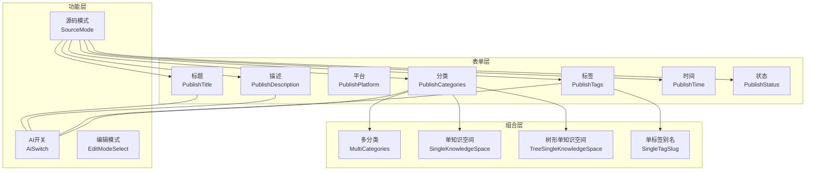

**图表来源**
- [PublishTitle.vue:1-132](file://src/components/publish/form/PublishTitle.vue#L1-L132)
- [PublishDescription.vue:1-172](file://src/components/publish/form/PublishDescription.vue#L1-L172)
- [PublishPlatform.vue:1-126](file://src/components/publish/form/PublishPlatform.vue#L1-L126)
- [PublishCategories.vue:1-167](file://src/components/publish/form/PublishCategories.vue#L1-L167)
- [PublishTags.vue:1-270](file://src/components/publish/form/PublishTags.vue#L1-L270)
- [PublishTime.vue:1-65](file://src/components/publish/form/PublishTime.vue#L1-L65)
- [PublishStatus.vue:1-67](file://src/components/publish/form/PublishStatus.vue#L1-L67)
- [AiSwitch.vue:1-76](file://src/components/publish/form/AiSwitch.vue#L1-L76)
- [EditModeSelect.vue:1-70](file://src/components/publish/form/EditModeSelect.vue#L1-L70)
- [SourceMode.vue:1-424](file://src/components/publish/form/SourceMode.vue#L1-L424)
- [MultiCategories.vue:1-215](file://src/components/publish/form/category/MultiCategories.vue#L1-L215)
- [SingleKnowledgeSpace.vue:1-216](file://src/components/publish/form/kwspace/SingleKnowledgeSpace.vue#L1-L216)
- [TreeSingleKnowledgeSpace.vue:1-146](file://src/components/publish/form/kwspace/TreeSingleKnowledgeSpace.vue#L1-L146)
- [SingleTagSlug.vue:1-151](file://src/components/publish/form/tagslug/SingleTagSlug.vue#L1-L151)

## 详细组件分析

### 标题组件（PublishTitle）
- 数据模型
  - 本地响应式字段：postTitle、isLoading、useAi、md、html
  - watch 监听外部 props 变化，保持与父组件同步
- 事件
  - emitSyncPublishTitle：标题变更时向上游同步
- AI 流程
  - 使用 prompt.titlePrompt 与 useChatGPT 获取 JSON 结果，解析 title 并回填
  - 错误处理：空响应、解析失败、消息提示
- 国际化
  - 按钮文案与提示通过 useVueI18n 翻译

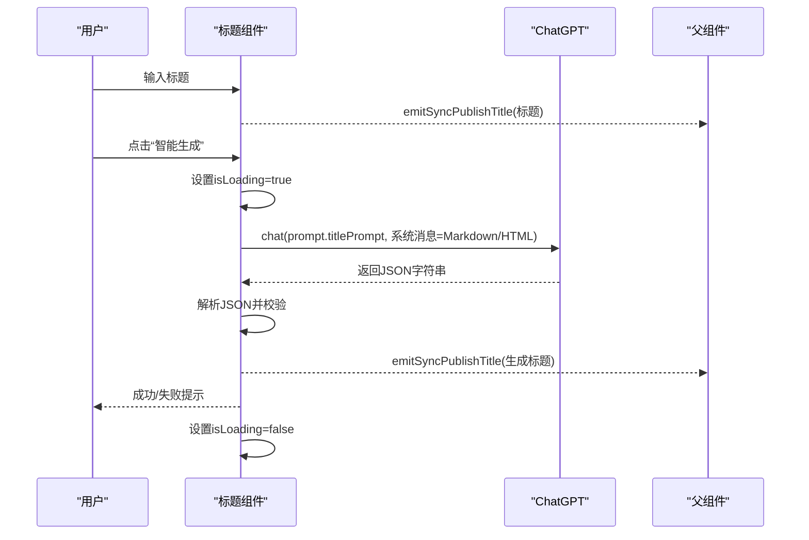

**图表来源**
- [PublishTitle.vue:77-115](file://src/components/publish/form/PublishTitle.vue#L77-L115)
- [prompt.ts:19-31](file://src/ai/prompt.ts#L19-L31)

**章节来源**
- [PublishTitle.vue:1-132](file://src/components/publish/form/PublishTitle.vue#L1-L132)
- [prompt.ts:19-31](file://src/ai/prompt.ts#L19-L31)

### 描述组件（PublishDescription）
- 数据模型
  - isDescLoading、useAi、pageId、desc、md、html
  - watch 监听 html 变化以驱动 AI 生成
- AI 流程
  - 支持流式与非流式两种模式；流式通过 onProgress 实时更新
  - 非流式解析 JSON；流式直接接收文本片段
- 事件
  - emitSyncDesc：描述变更时同步

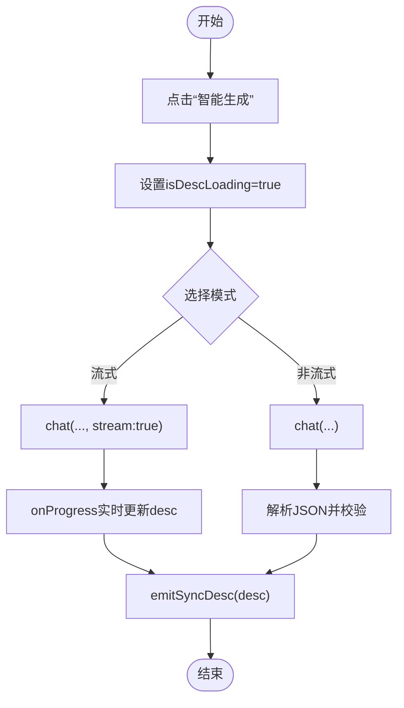

**图表来源**
- [PublishDescription.vue:77-145](file://src/components/publish/form/PublishDescription.vue#L77-L145)

**章节来源**
- [PublishDescription.vue:1-172](file://src/components/publish/form/PublishDescription.vue#L1-L172)
- [prompt.ts:36-58](file://src/ai/prompt.ts#L36-L58)

### 平台组件（PublishPlatform）
- 数据模型
  - dynamicConfigArray：启用且认证通过的平台列表
  - selectedKeys：当前选中的平台键集合
- 生命周期
  - mounted：读取设置，过滤可用平台；检测历史发布记录，初始化选中
- 交互
  - handleCheck：切换选中状态并 emitSyncDynList
- 国际化
  - 使用 PageUtils.longPlatformName 截断显示平台名

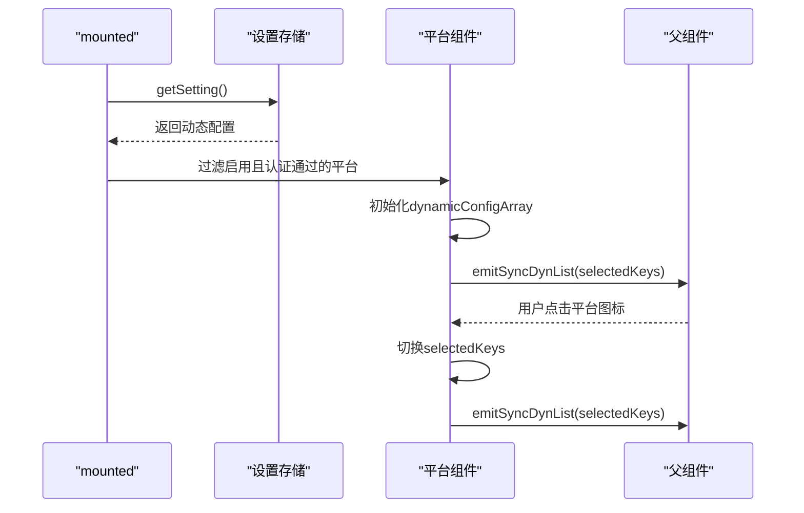

**图表来源**
- [PublishPlatform.vue:64-85](file://src/components/publish/form/PublishPlatform.vue#L64-L85)

**章节来源**
- [PublishPlatform.vue:1-126](file://src/components/publish/form/PublishPlatform.vue#L1-L126)

### 分类组件（PublishCategories）
- 数据模型
  - useAi、categoryType、categoryConfig、categories、recommCates、md、html
- 组合渲染
  - 根据 categoryType 渲染 MultiCategories
- AI 流程
  - prompt.categoryPrompt 生成推荐分类；支持多平台适配器
- 事件
  - emitSyncCates：同步分类数组

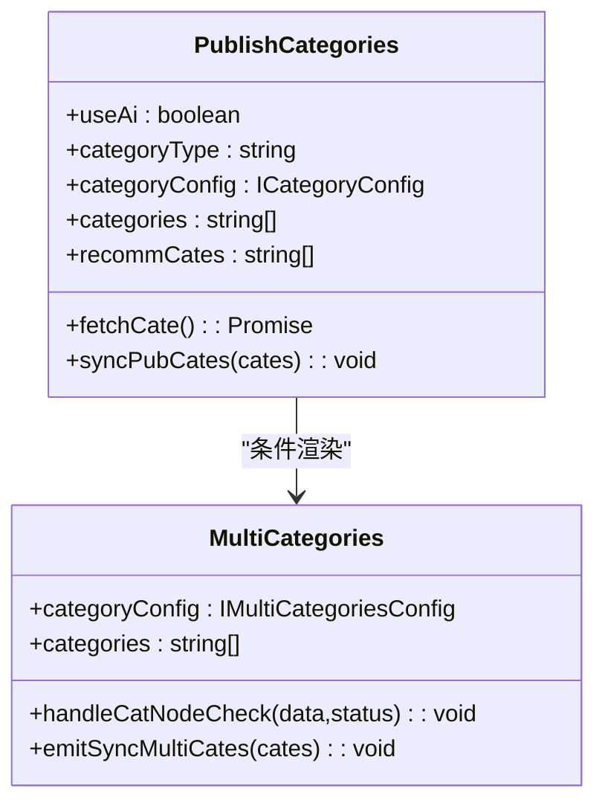

**图表来源**
- [PublishCategories.vue:51-86](file://src/components/publish/form/PublishCategories.vue#L51-L86)
- [MultiCategories.vue:33-90](file://src/components/publish/form/category/MultiCategories.vue#L33-L90)
- [ICategoryConfig.ts:56-63](file://src/types/ICategoryConfig.ts#L56-L63)

**章节来源**
- [PublishCategories.vue:1-167](file://src/components/publish/form/PublishCategories.vue#L1-L167)
- [MultiCategories.vue:1-215](file://src/components/publish/form/category/MultiCategories.vue#L1-L215)
- [ICategoryConfig.ts:1-88](file://src/types/ICategoryConfig.ts#L1-L88)
- [prompt.ts:82-95](file://src/ai/prompt.ts#L82-L95)

### 标签组件（PublishTags）
- 数据模型
  - isTagLoading、useAi、pageId、tagConfig、tag.inputValue/dynamicTags/platformTags、md、html
- 交互
  - 动态标签增删；平台标签树选择；@change/@check 同步
- AI 流程
  - prompt.tagPrompt 生成标签数组；去重后追加
- 平台集成
  - 通过 Adaptors 获取平台标签列表

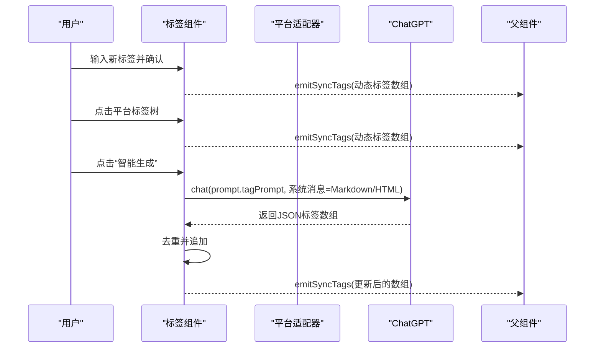

**图表来源**
- [PublishTags.vue:130-179](file://src/components/publish/form/PublishTags.vue#L130-L179)
- [prompt.ts:63-77](file://src/ai/prompt.ts#L63-L77)

**章节来源**
- [PublishTags.vue:1-270](file://src/components/publish/form/PublishTags.vue#L1-L270)
- [prompt.ts:63-77](file://src/ai/prompt.ts#L63-L77)

### 时间组件（PublishTime）
- 数据模型
  - dateCreatedString、dateUpdatedString（格式化 ISO 至本地字符串）
- 事件
  - emitSyncPublishTime(dt1, dt2)：创建时间与更新时间

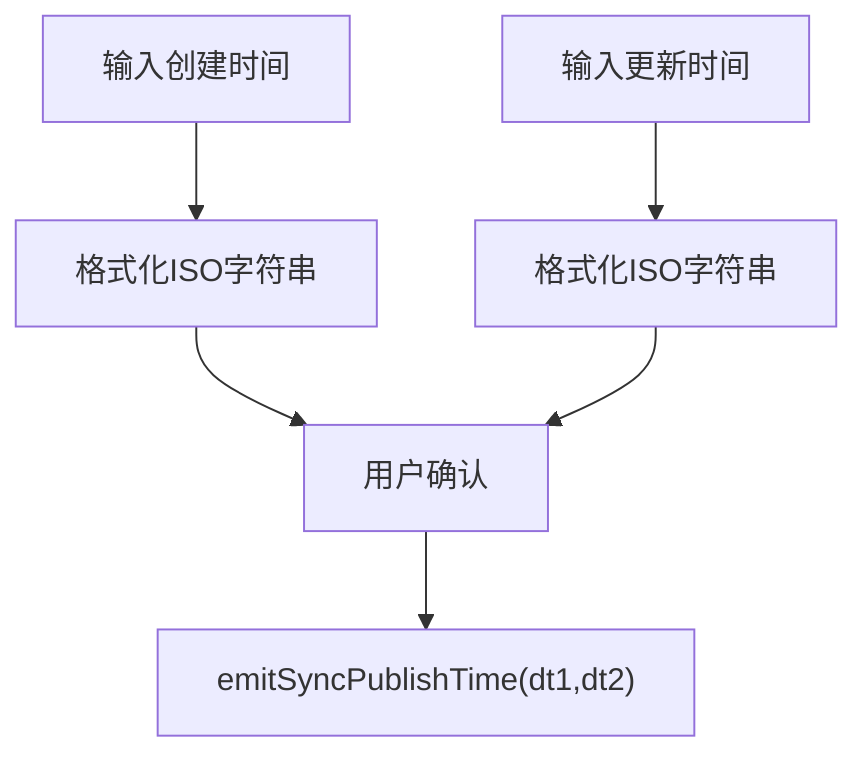

**图表来源**
- [PublishTime.vue:25-36](file://src/components/publish/form/PublishTime.vue#L25-L36)

**章节来源**
- [PublishTime.vue:1-65](file://src/components/publish/form/PublishTime.vue#L1-L65)

### 状态组件（PublishStatus）
- 数据模型
  - status（公开/草稿/私密）、password
- 事件
  - emitSyncPublishStatus(status, password)

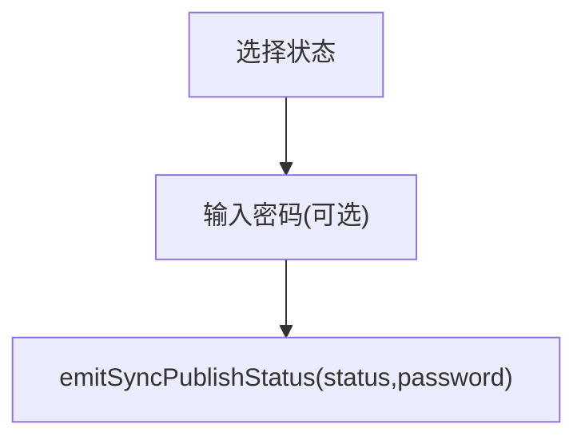

**图表来源**
- [PublishStatus.vue:25-36](file://src/components/publish/form/PublishStatus.vue#L25-L36)

**章节来源**
- [PublishStatus.vue:1-67](file://src/components/publish/form/PublishStatus.vue#L1-L67)

### AI 开关（AiSwitch）
- 功能：控制是否启用 AI 能力；弹窗确认收费提示。
- 事件
  - emitSyncAiSwitch：同步 useAi 状态

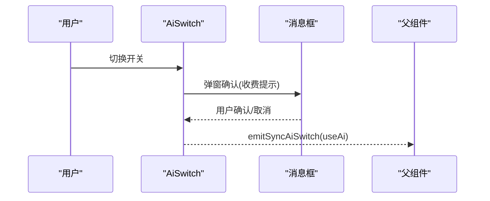

**图表来源**
- [AiSwitch.vue:31-64](file://src/components/publish/form/AiSwitch.vue#L31-L64)

**章节来源**
- [AiSwitch.vue:1-76](file://src/components/publish/form/AiSwitch.vue#L1-L76)

### 编辑模式选择（EditModeSelect）
- 功能：简单/复杂/源码三种编辑模式切换。
- 事件
  - emitSyncEditMode：同步编辑模式枚举值

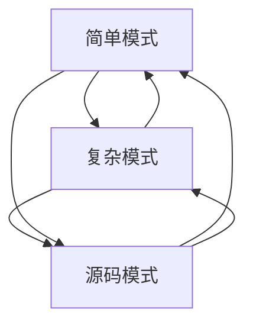

**图表来源**
- [EditModeSelect.vue:38-41](file://src/components/publish/form/EditModeSelect.vue#L38-L41)

**章节来源**
- [EditModeSelect.vue:1-70](file://src/components/publish/form/EditModeSelect.vue#L1-L70)

### 源码模式（SourceMode）
- 功能：YAML/MD/HTML 等多种源码视图；YAML 编辑与解析；与思源笔记同步。
- 数据模型
  - stype（SourceContentShowType）、yamlFormatObj、siyuanPost、yamlContent、readonlyMode
- 核心流程
  - handlePostToHoHtml：根据 yamlType 与 apiType 生成不同 YAML 格式
  - doSaveContentChange：解析 YAML 并更新 siyuanPost，emitSyncPost
  - initYaml：初始化 YAML 内容
- 事件
  - emitSyncPost、edmtSyncToSiyuan

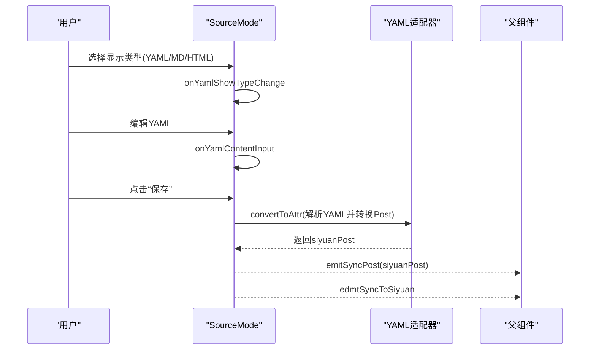

**图表来源**
- [SourceMode.vue:73-152](file://src/components/publish/form/SourceMode.vue#L73-L152)
- [SourceMode.vue:170-209](file://src/components/publish/form/SourceMode.vue#L170-L209)
- [sourceContentShowType.ts:13-18](file://src/models/sourceContentShowType.ts#L13-L18)

**章节来源**
- [SourceMode.vue:1-424](file://src/components/publish/form/SourceMode.vue#L1-L424)
- [sourceContentShowType.ts:1-19](file://src/models/sourceContentShowType.ts#L1-L19)

### 组合组件

#### 多分类（MultiCategories）
- 功能：多选分类树；支持远程分类列表与本地分类回退。
- 事件
  - emitSyncMultiCates：同步选中分类数组

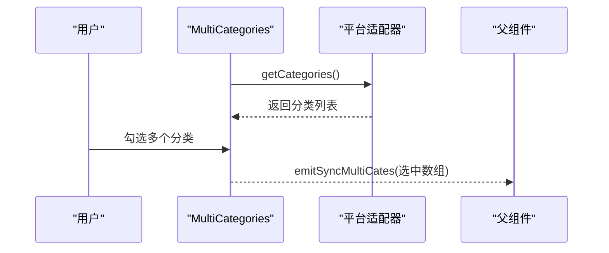

**图表来源**
- [MultiCategories.vue:92-131](file://src/components/publish/form/category/MultiCategories.vue#L92-L131)

**章节来源**
- [MultiCategories.vue:1-215](file://src/components/publish/form/category/MultiCategories.vue#L1-L215)
- [ICategoryConfig.ts:56-63](file://src/types/ICategoryConfig.ts#L56-L63)

#### 单知识空间（SingleKnowledgeSpace）
- 功能：单选知识空间；支持关键词搜索与自动映射只读模式。
- 事件
  - emitSyncSingleCateSlugs：同步选中知识空间

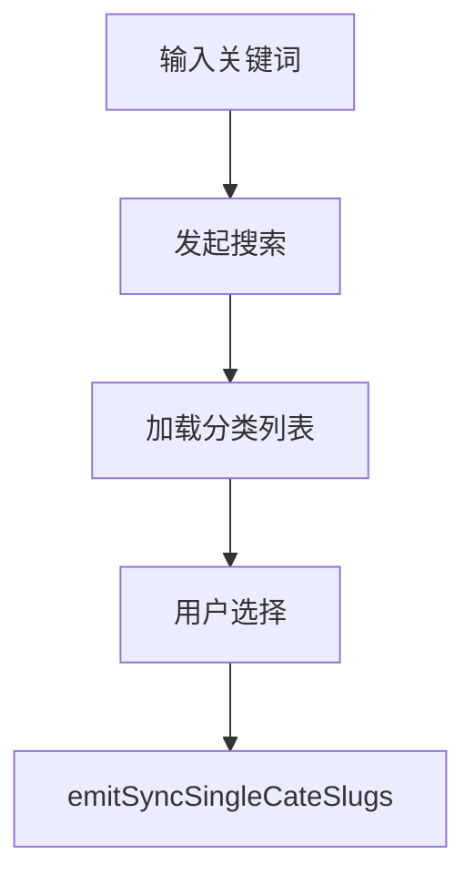

**图表来源**
- [SingleKnowledgeSpace.vue:70-86](file://src/components/publish/form/kwspace/SingleKnowledgeSpace.vue#L70-L86)

**章节来源**
- [SingleKnowledgeSpace.vue:1-216](file://src/components/publish/form/kwspace/SingleKnowledgeSpace.vue#L1-L216)

#### 树形单知识空间（TreeSingleKnowledgeSpace）
- 功能：懒加载树形知识空间；严格选择目录节点。
- 事件
  - emitSyncTreeSingleCateSlugs：同步选中路径

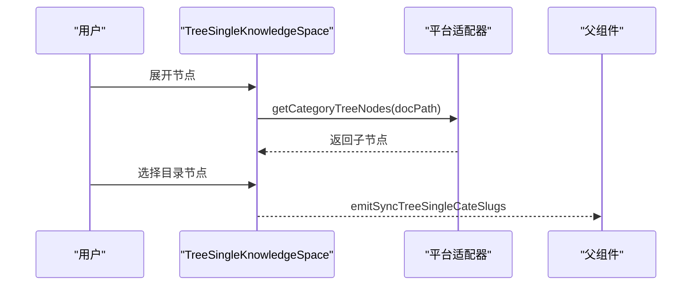

**图表来源**
- [TreeSingleKnowledgeSpace.vue:54-91](file://src/components/publish/form/kwspace/TreeSingleKnowledgeSpace.vue#L54-L91)

**章节来源**
- [TreeSingleKnowledgeSpace.vue:1-146](file://src/components/publish/form/kwspace/TreeSingleKnowledgeSpace.vue#L1-L146)

#### 单标签别名（SingleTagSlug）
- 功能：单选平台标签别名。
- 事件
  - emitSyncTagSlugs：同步选中标签别名

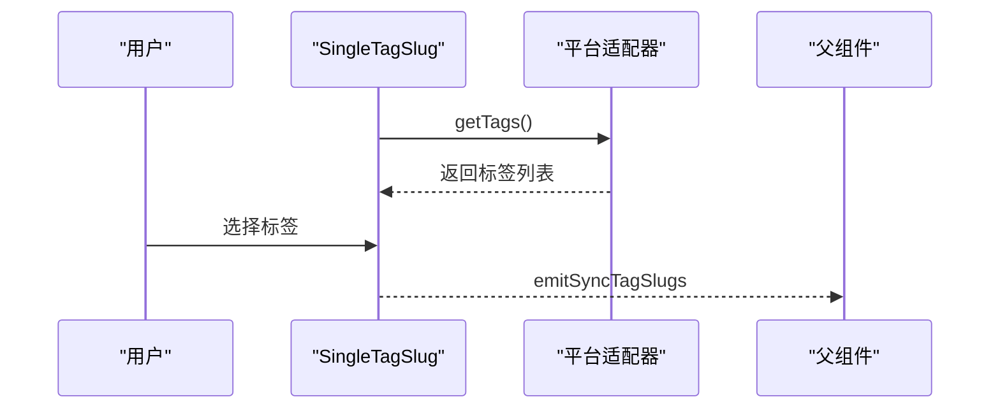

**图表来源**
- [SingleTagSlug.vue:65-84](file://src/components/publish/form/tagslug/SingleTagSlug.vue#L65-L84)

**章节来源**
- [SingleTagSlug.vue:1-151](file://src/components/publish/form/tagslug/SingleTagSlug.vue#L1-L151)

## 依赖分析
- 组件耦合
  - PublishCategories 与 MultiCategories 强耦合；与 AiSwitch 松耦合（通过 useAi 控制）
  - PublishTags 与 Adaptors 强耦合（平台标签获取）
  - SourceMode 与 YAML 适配器强耦合（convertToAttr）
- 外部依赖
  - useChatGPT：AI 提示词与对话接口
  - Element Plus：表单控件与消息提示
  - zhi-common/zhi-blog-api：工具函数与模型定义
- 循环依赖
  - 未发现循环依赖；组件间通过 props/emit 单向通信

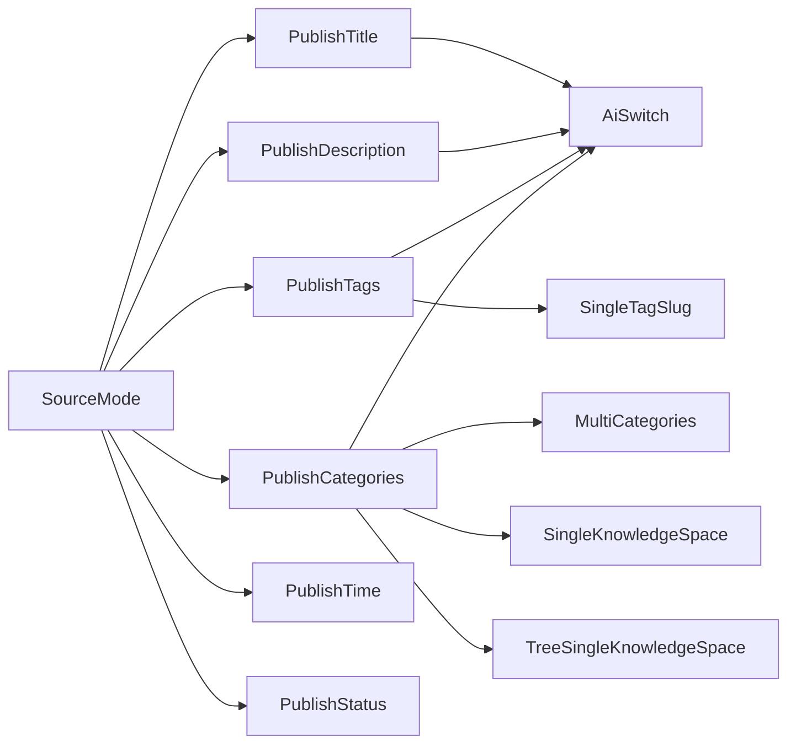

**图表来源**
- [PublishTitle.vue:1-132](file://src/components/publish/form/PublishTitle.vue#L1-L132)
- [PublishDescription.vue:1-172](file://src/components/publish/form/PublishDescription.vue#L1-L172)
- [PublishPlatform.vue:1-126](file://src/components/publish/form/PublishPlatform.vue#L1-L126)
- [PublishCategories.vue:1-167](file://src/components/publish/form/PublishCategories.vue#L1-L167)
- [PublishTags.vue:1-270](file://src/components/publish/form/PublishTags.vue#L1-L270)
- [PublishTime.vue:1-65](file://src/components/publish/form/PublishTime.vue#L1-L65)
- [PublishStatus.vue:1-67](file://src/components/publish/form/PublishStatus.vue#L1-L67)
- [AiSwitch.vue:1-76](file://src/components/publish/form/AiSwitch.vue#L1-L76)
- [SourceMode.vue:1-424](file://src/components/publish/form/SourceMode.vue#L1-L424)
- [MultiCategories.vue:1-215](file://src/components/publish/form/category/MultiCategories.vue#L1-L215)
- [SingleKnowledgeSpace.vue:1-216](file://src/components/publish/form/kwspace/SingleKnowledgeSpace.vue#L1-L216)
- [TreeSingleKnowledgeSpace.vue:1-146](file://src/components/publish/form/kwspace/TreeSingleKnowledgeSpace.vue#L1-L146)
- [SingleTagSlug.vue:1-151](file://src/components/publish/form/tagslug/SingleTagSlug.vue#L1-L151)

**章节来源**
- [PublishCategories.vue:1-167](file://src/components/publish/form/PublishCategories.vue#L1-L167)
- [PublishTags.vue:1-270](file://src/components/publish/form/PublishTags.vue#L1-L270)
- [SourceMode.vue:1-424](file://src/components/publish/form/SourceMode.vue#L1-L424)

## 性能考虑
- 组件更新策略
  - 使用 reactive + watch 监听 props，避免不必要的重渲染
  - AI 请求采用流式/非流式双模式，减少阻塞
- 渲染优化
  - SourceMode 在初始化阶段使用骨架屏占位，提升感知性能
  - 多分类树懒加载与远程数据获取，降低首屏压力
- 资源控制
  - AI 请求超时控制（如 2 分钟），防止长时间挂起
  - YAML 解析失败时及时反馈，避免无效重试

## 故障排除指南
- AI 请求失败
  - 现象：提示“请求错误，请在偏好设置配置请求地址和ChatGPT key！”
  - 处理：检查偏好设置中的 AI 服务配置；确认网络连通性
- YAML 解析失败
  - 现象：YAML 解析失败，YAML 将不可用
  - 处理：检查 YAML 格式；确保 JSON 提示词返回合法结构
- 平台标签/分类加载失败
  - 现象：分类或标签列表为空
  - 处理：确认平台认证状态；检查 apiType 与配置是否正确
- 源码模式只读
  - 现象：无法编辑 YAML
  - 处理：确认平台适配器存在；检查 apiType 与配置

**章节来源**
- [PublishTitle.vue:93-114](file://src/components/publish/form/PublishTitle.vue#L93-L114)
- [PublishDescription.vue:106-144](file://src/components/publish/form/PublishDescription.vue#L106-L144)
- [SourceMode.vue:147-151](file://src/components/publish/form/SourceMode.vue#L147-L151)

## 结论
发布表单组件通过清晰的分层设计与强大的组合能力，实现了跨平台、可配置、可扩展的发布体验。AI 能力与平台适配器的深度集成，使得标题、描述、分类、标签等关键信息能够高效生成与同步。同时，严格的国际化与样式定制支持，保证了良好的用户体验与可维护性。

## 附录
- 可配置性
  - 通过 props 传递配置（如 useAi、categoryConfig、tagConfig、apiType 等）
  - 动态平台配置与只读模式支持
- 样式定制
  - 组件内使用 scoped 样式；支持暗色主题适配
- 国际化支持
  - 统一通过 useVueI18n 提供翻译；组件内文案均支持多语言