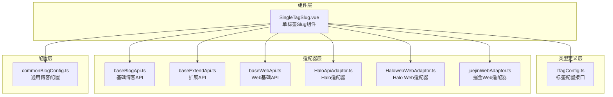
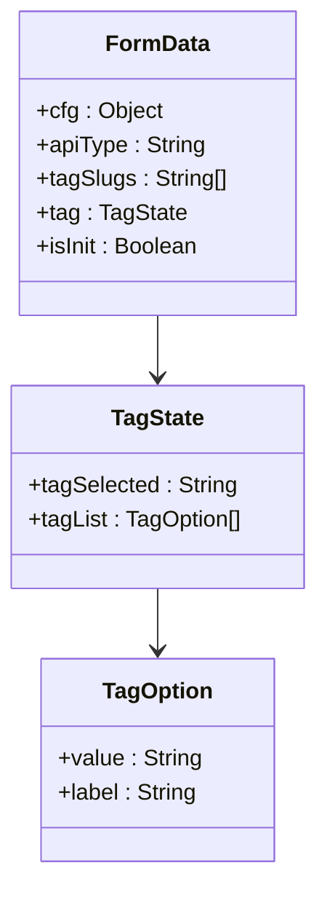
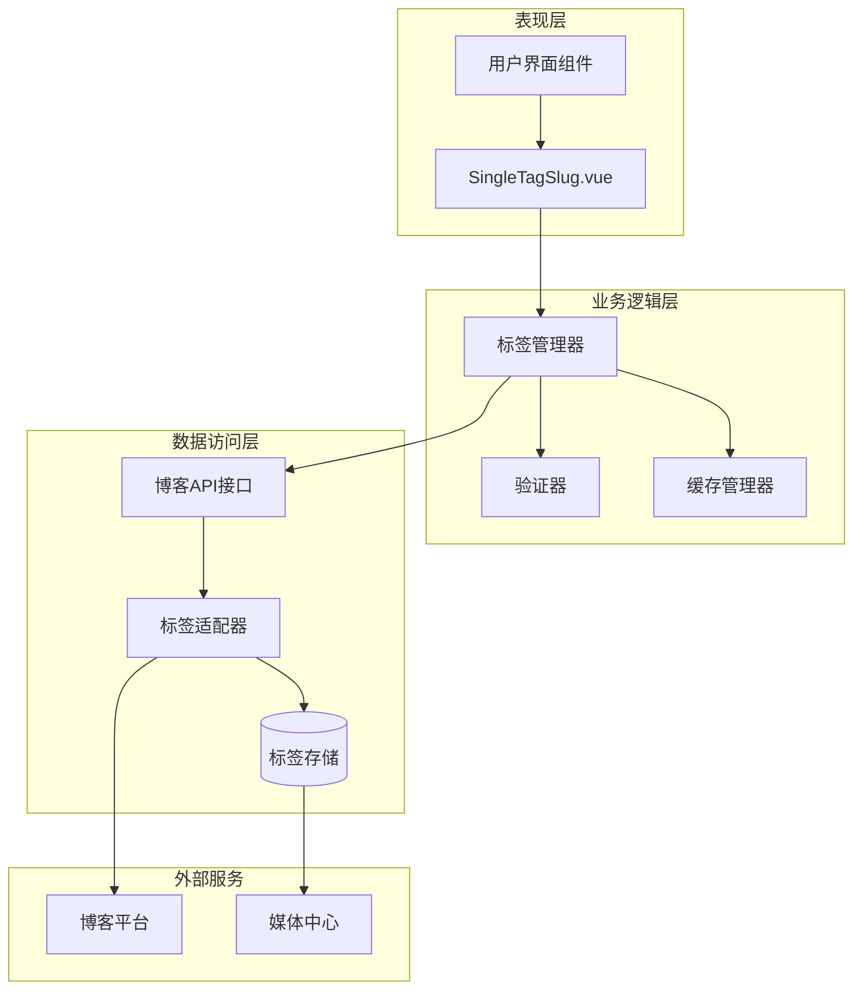
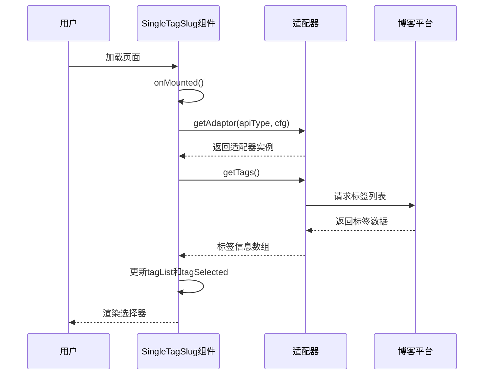
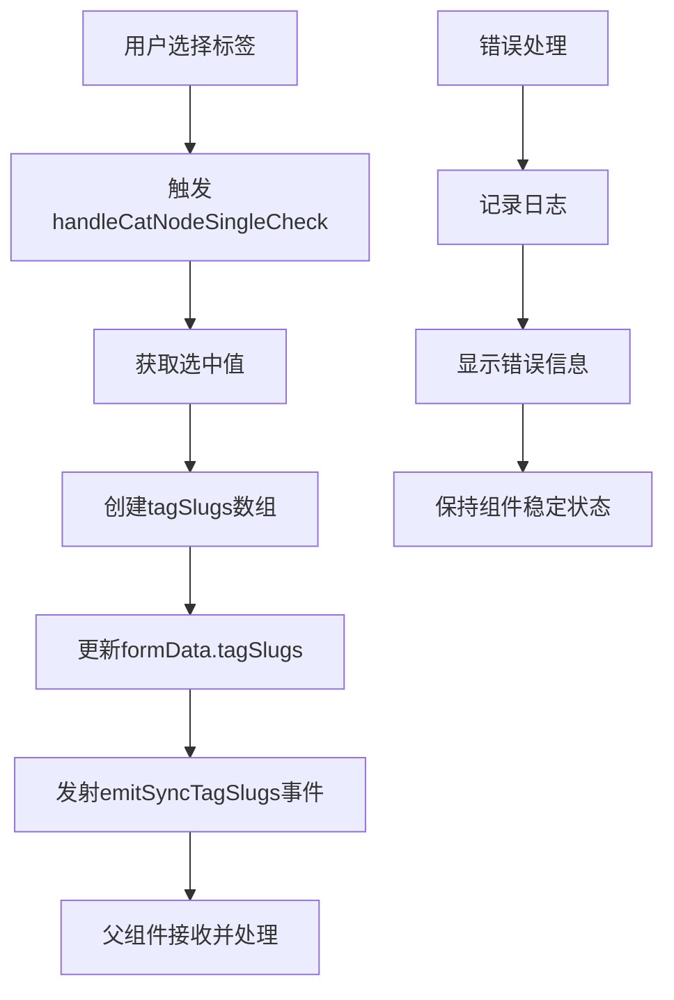
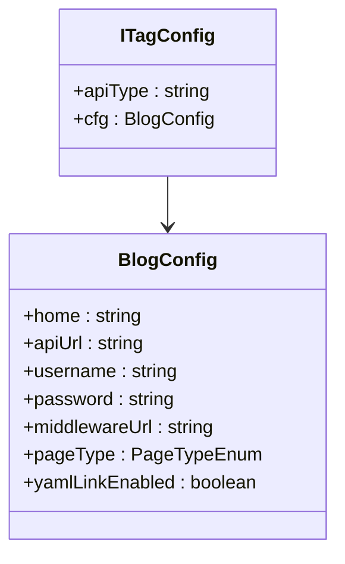
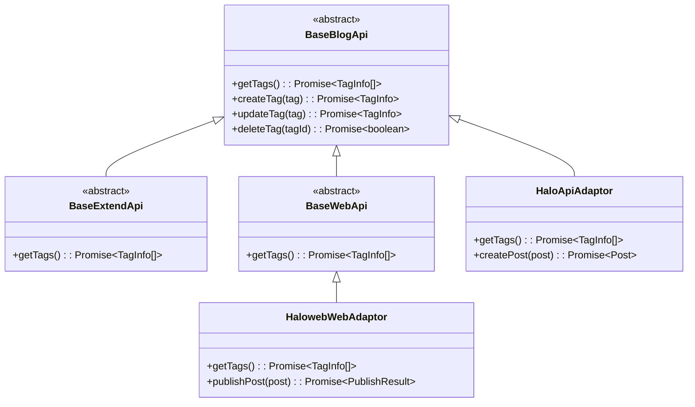
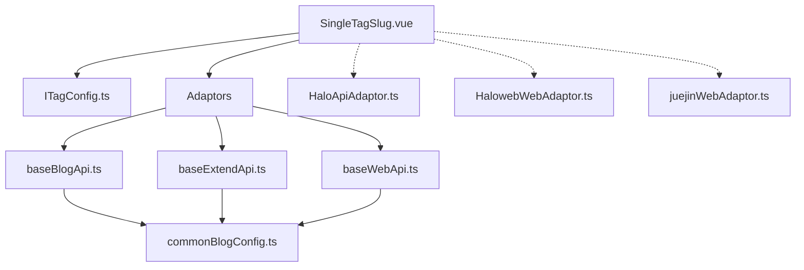
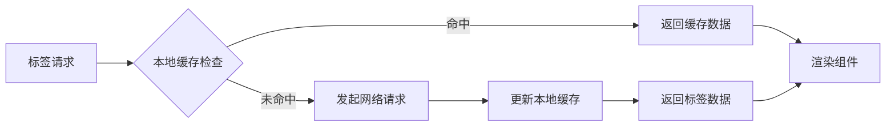

# 标签和Slug组件

<cite>
**本文档引用的文件**
- [SingleTagSlug.vue](file://src/components/publish/form/tagslug/SingleTagSlug.vue)
- [ITagConfig.ts](file://src/types/ITagConfig.ts)
- [commonBlogConfig.ts](file://src/adaptors/api/base/commonBlogConfig.ts)
- [baseBlogApi.ts](file://src/adaptors/api/base/baseBlogApi.ts)
- [baseExtendApi.ts](file://src/adaptors/base/baseExtendApi.ts)
- [baseWebApi.ts](file://src/adaptors/web/base/baseWebApi.ts)
- [HaloApiAdaptor.ts](file://src/adaptors/api/halo/HaloApiAdaptor.ts)
- [HalowebWebAdaptor.ts](file://src/adaptors/web/haloweb/HalowebWebAdaptor.ts)
- [juejinWebAdaptor.ts](file://src/adaptors/web/juejin/juejinWebAdaptor.ts)
- [package.json](file://package.json)
</cite>

## 目录
1. [简介](#简介)
2. [项目结构](#项目结构)
3. [核心组件](#核心组件)
4. [架构概览](#架构概览)
5. [详细组件分析](#详细组件分析)
6. [依赖关系分析](#依赖关系分析)
7. [性能考虑](#性能考虑)
8. [故障排除指南](#故障排除指南)
9. [结论](#结论)
10. [附录](#附录)

## 简介

本文档深入解析了 Siyuan 插件发布系统中的标签和 Slug 组件，重点分析了 SingleTagSlug 组件的标签管理功能。该组件提供了完整的标签选择、远程标签获取、标签状态管理等核心功能，支持多种博客平台的标签集成。

标签系统在内容管理中扮演着至关重要的角色，它不仅帮助用户组织和检索内容，还为搜索引擎优化（SEO）提供了重要支撑。本系统通过统一的标签接口设计，实现了跨平台的标签管理能力。

## 项目结构

标签和 Slug 组件位于插件的组件目录结构中，采用模块化设计，便于维护和扩展。



**图表来源**
- [SingleTagSlug.vue:1-151](file://src/components/publish/form/tagslug/SingleTagSlug.vue#L1-L151)
- [ITagConfig.ts:1-31](file://src/types/ITagConfig.ts#L1-L31)
- [commonBlogConfig.ts:1-42](file://src/adaptors/api/base/commonBlogConfig.ts#L1-L42)

**章节来源**
- [SingleTagSlug.vue:1-151](file://src/components/publish/form/tagslug/SingleTagSlug.vue#L1-L151)
- [ITagConfig.ts:1-31](file://src/types/ITagConfig.ts#L1-L31)

## 核心组件

### SingleTagSlug 组件

SingleTagSlug 是一个专门用于处理单个标签选择的 Vue 组件，提供了直观的用户界面和强大的后台支持。

#### 主要特性

1. **远程标签获取**: 从各种博客平台动态获取可用标签
2. **实时状态管理**: 使用响应式数据结构跟踪标签状态
3. **事件驱动架构**: 通过自定义事件与父组件通信
4. **国际化支持**: 集成 Vue I18n 进行多语言处理

#### 数据结构设计

组件使用 reactive 对象来管理复杂的状态：



**图表来源**
- [SingleTagSlug.vue:36-46](file://src/components/publish/form/tagslug/SingleTagSlug.vue#L36-L46)

**章节来源**
- [SingleTagSlug.vue:36-46](file://src/components/publish/form/tagslug/SingleTagSlug.vue#L36-L46)

## 架构概览

标签系统采用分层架构设计，确保了良好的可扩展性和维护性。



**图表来源**
- [SingleTagSlug.vue:10-19](file://src/components/publish/form/tagslug/SingleTagSlug.vue#L10-L19)
- [baseBlogApi.ts:75-80](file://src/adaptors/api/base/baseBlogApi.ts#L75-L80)

## 详细组件分析

### SingleTagSlug 组件深度解析

#### 初始化流程

组件的初始化过程遵循严格的异步模式，确保所有依赖项正确加载。



**图表来源**
- [SingleTagSlug.vue:65-94](file://src/components/publish/form/tagslug/SingleTagSlug.vue#L65-L94)
- [baseBlogApi.ts:75-80](file://src/adaptors/api/base/baseBlogApi.ts#L75-L80)

#### 标签选择处理机制

当用户选择标签时，组件执行以下处理流程：



**图表来源**
- [SingleTagSlug.vue:52-63](file://src/components/publish/form/tagslug/SingleTagSlug.vue#L52-L63)

#### 标签数据模型

组件使用标准化的 TagInfo 结构来处理标签数据：

| 字段 | 类型 | 描述 | 必需 |
|------|------|------|------|
| tagId | String | 标签唯一标识符 | 是 |
| tagName | String | 标签显示名称 | 是 |
| tagCount | Number | 标签使用次数 | 否 |
| tagSlug | String | URL友好标识符 | 否 |

**章节来源**
- [SingleTagSlug.vue:52-94](file://src/components/publish/form/tagslug/SingleTagSlug.vue#L52-L94)

### 标签配置接口

ITagConfig 接口定义了标签系统的核心配置参数：



**图表来源**
- [ITagConfig.ts:18-28](file://src/types/ITagConfig.ts#L18-L28)

**章节来源**
- [ITagConfig.ts:18-28](file://src/types/ITagConfig.ts#L18-L28)

### 适配器模式实现

系统采用适配器模式支持多种博客平台：

#### 基础适配器架构



**图表来源**
- [baseBlogApi.ts:75-80](file://src/adaptors/api/base/baseBlogApi.ts#L75-L80)
- [baseExtendApi.ts:122-129](file://src/adaptors/base/baseExtendApi.ts#L122-L129)
- [baseWebApi.ts:76-80](file://src/adaptors/web/base/baseWebApi.ts#L76-L80)

#### 平台特定实现

不同平台对标签的处理方式存在差异：

| 平台 | 标签字段 | 特殊处理 | 兼容性 |
|------|----------|----------|--------|
| Halo | spec.tags | 支持多标签 | ✅ 完全支持 |
| 掘金 | tag_ids | 数字ID转换 | ✅ 部分支持 |
| WordPress | terms | XML-RPC兼容 | ✅ 基础支持 |
| Typecho | categories | 兼容分类系统 | ⚠️ 需要映射 |

**章节来源**
- [HaloApiAdaptor.ts:269-274](file://src/adaptors/api/halo/HaloApiAdaptor.ts#L269-L274)
- [HalowebWebAdaptor.ts:280-284](file://src/adaptors/web/haloweb/HalowebWebAdaptor.ts#L280-L284)
- [juejinWebAdaptor.ts:82-111](file://src/adaptors/web/juejin/juejinWebAdaptor.ts#L82-L111)

## 依赖关系分析

### 外部依赖

系统依赖于多个核心库来实现标签功能：

```mermaid
graph LR
subgraph "核心依赖"
ZBA[zhi-blog-api<br/>博客API库]
ZC[zhi-common<br/>通用工具库]
EP[element-plus<br/>UI组件库]
end
subgraph "运行时依赖"
VN[vue@3.5.24<br/>前端框架]
VR[vue-router@4.6.3<br/>路由管理]
VI[vue-i18n@11.1.12<br/>国际化]
end
STS[SingleTagSlug.vue] --> ZBA
STS --> ZC
STS --> EP
STS --> VN
STS --> VR
STS --> VI
```

**图表来源**
- [package.json:59-95](file://package.json#L59-L95)

### 内部模块依赖

组件间的依赖关系体现了清晰的分层架构：



**图表来源**
- [SingleTagSlug.vue:14-16](file://src/components/publish/form/tagslug/SingleTagSlug.vue#L14-L16)
- [commonBlogConfig.ts:13-40](file://src/adaptors/api/base/commonBlogConfig.ts#L13-L40)

**章节来源**
- [package.json:59-95](file://package.json#L59-L95)

## 性能考虑

### 异步加载策略

组件采用异步加载模式，避免阻塞主线程：

1. **延迟初始化**: 组件挂载后才进行标签数据加载
2. **错误隔离**: 独立的错误处理机制，防止单点故障
3. **状态管理**: 使用响应式数据结构，减少不必要的重渲染

### 缓存机制

虽然当前实现主要依赖远程获取，但系统架构已为缓存机制预留了扩展空间：



### 内存管理

组件使用 Vue 的响应式系统进行状态管理，确保内存的有效利用。

## 故障排除指南

### 常见问题及解决方案

#### 标签加载失败

**症状**: 组件显示加载状态但无法获取标签列表

**可能原因**:
1. 网络连接异常
2. 认证信息错误
3. 平台API限制

**解决步骤**:
1. 检查网络连接状态
2. 验证平台配置信息
3. 查看控制台错误日志

#### 标签选择异常

**症状**: 选择标签后无法正确更新状态

**排查方法**:
1. 检查事件监听器是否正常工作
2. 验证数据绑定是否正确
3. 确认父组件是否正确处理事件

**章节来源**
- [SingleTagSlug.vue:86-94](file://src/components/publish/form/tagslug/SingleTagSlug.vue#L86-L94)

### 调试技巧

1. **启用详细日志**: 利用 createAppLogger 创建详细的调试信息
2. **检查网络请求**: 使用浏览器开发者工具监控API调用
3. **验证数据结构**: 确保返回的数据符合 TagInfo 接口规范

## 结论

标签和 Slug 组件系统展现了优秀的软件工程实践，通过模块化设计、适配器模式和清晰的分层架构，实现了高度可扩展的标签管理功能。

该系统的主要优势包括：
- **跨平台兼容性**: 支持多种博客平台的标签集成
- **可扩展性**: 易于添加新的平台支持
- **用户体验**: 提供直观的标签选择界面
- **可靠性**: 完善的错误处理和状态管理

未来可以考虑的功能增强：
- 添加标签搜索和过滤功能
- 实现标签云展示
- 增加标签批量操作支持
- 优化标签缓存机制

## 附录

### 开发者指南

#### 添加新平台支持

1. 创建新的适配器类，继承相应的基类
2. 实现 getTags 方法
3. 在适配器工厂中注册新适配器
4. 更新配置接口以支持新平台参数

#### 自定义样式

组件使用 Element Plus 的样式系统，可以通过覆盖CSS变量来自定义外观：

```css
.single-tag-slug :deep(.el-form-item) {
  margin-bottom: 0;
}

.single-tag-slug :deep(.el-tag--info) {
  --el-tag-bg-color: var(--el-color-primary-light-9);
  --el-tag-border-color: var(--el-color-primary-light-8);
  --el-tag-text-color: var(--el-color-primary);
}
```

### 最佳实践

1. **标签命名规范**: 使用简洁明了的标签名称
2. **标签粒度控制**: 避免过细或过粗的标签层次
3. **重复标签检测**: 在创建新标签前进行重复检查
4. **URL友好性**: 确保标签URL安全且易于理解