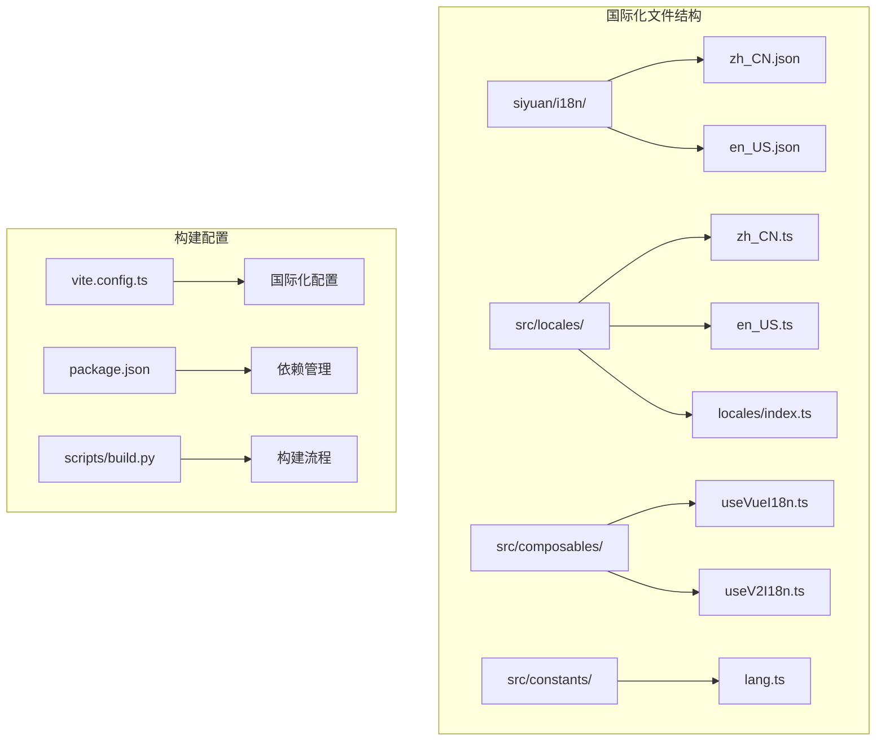
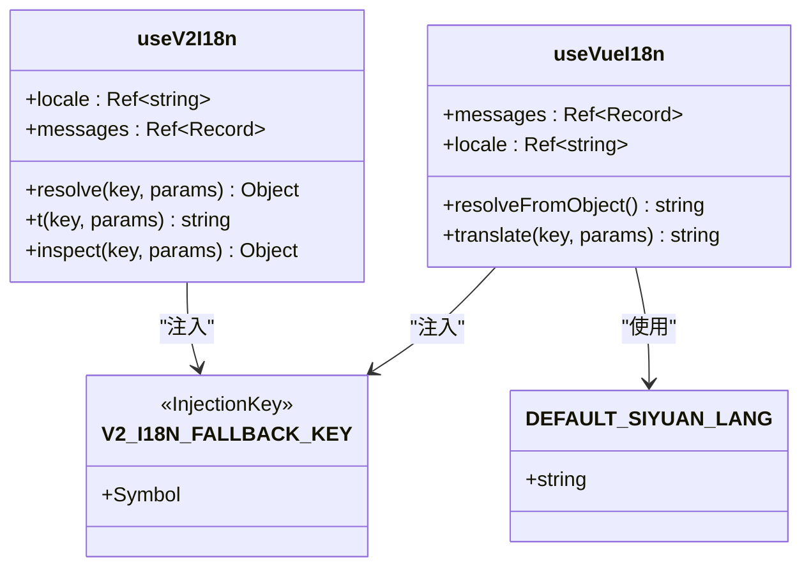
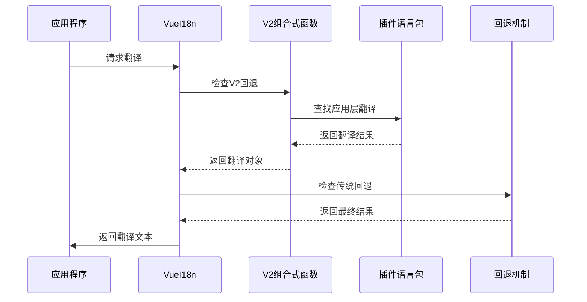
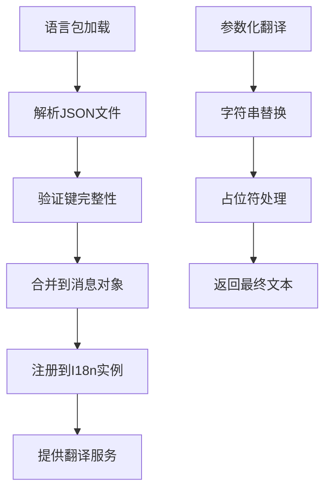
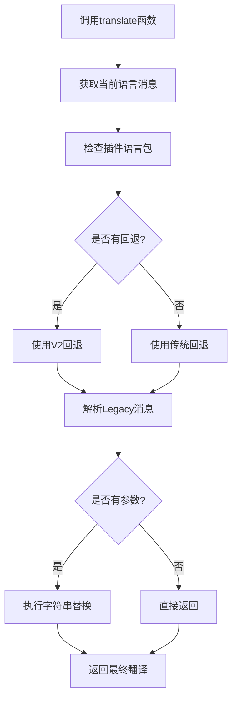
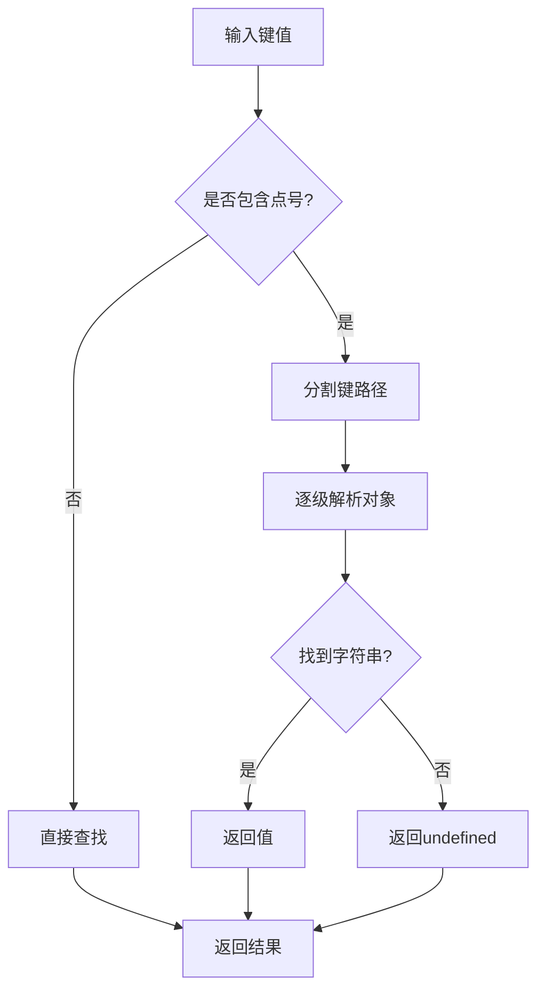
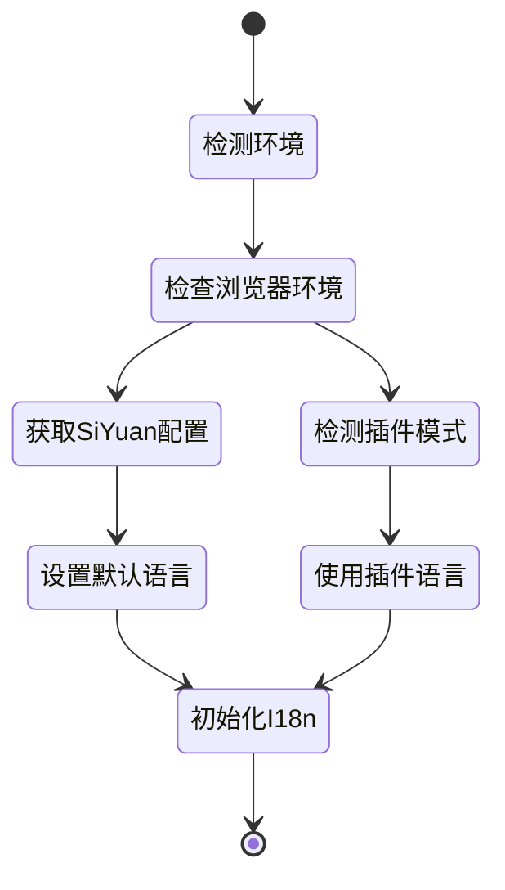
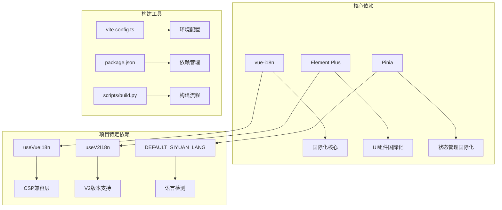

# 国际化支持

<cite>
**本文档引用的文件**
- [zh_CN.json](file://siyuan/i18n/zh_CN.json)
- [en_US.json](file://siyuan/i18n/en_US.json)
- [zh_CN.ts](file://src/locales/zh_CN.ts)
- [en_US.ts](file://src/locales/en_US.ts)
- [locales/index.ts](file://src/locales/index.ts)
- [useVueI18n.ts](file://src/composables/useVueI18n.ts)
- [useV2I18n.ts](file://src/composables/v2/useV2I18n.ts)
- [lang.ts](file://src/constants/lang.ts)
- [v2Host.ts](file://siyuan/v2/v2Host.ts)
- [build.py](file://scripts/build.py)
- [package.json](file://package.json)
- [vite.config.ts](file://vite.config.ts)
</cite>

## 更新摘要
**变更内容**
- 更新了useVueI18n.ts的嵌套键解析功能说明
- 新增了参数化文本替换机制的详细描述
- 完善了传统消息回退机制的实现细节
- 增强了多层回退机制的架构说明

## 目录
1. [简介](#简介)
2. [项目结构](#项目结构)
3. [核心组件](#核心组件)
4. [架构概览](#架构概览)
5. [详细组件分析](#详细组件分析)
6. [依赖关系分析](#依赖关系分析)
7. [性能考量](#性能考量)
8. [故障排除指南](#故障排除指南)
9. [结论](#结论)

## 简介

本项目实现了完整的国际化支持系统，支持中文（简体）和英文两种语言。国际化系统采用多层次的设计架构，既支持传统的vue-i18n框架，又提供了专门针对插件环境的CSP兼容解决方案。

国际化系统主要服务于思源笔记插件的发布工具，为用户提供多语言界面支持，涵盖发布设置、平台配置、文章管理等核心功能模块。系统现已增强支持嵌套键解析、参数化文本替换和改进的传统消息回退机制。

## 项目结构

国际化相关的文件组织结构清晰，采用了模块化的文件组织方式：



**图表来源**
- [zh_CN.json:1-282](file://siyuan/i18n/zh_CN.json#L1-L282)
- [en_US.ts:1-789](file://src/locales/en_US.ts#L1-L789)
- [locales/index.ts:1-25](file://src/locales/index.ts#L1-L25)

**章节来源**
- [zh_CN.json:1-282](file://siyuan/i18n/zh_CN.json#L1-L282)
- [en_US.json:1-282](file://siyuan/i18n/en_US.json#L1-L282)
- [zh_CN.ts:1-750](file://src/locales/zh_CN.ts#L1-L750)
- [en_US.ts:1-789](file://src/locales/en_US.ts#L1-L789)

## 核心组件

### 语言包文件

项目包含两套完整的语言包文件：

1. **Siyuan插件语言包** (`siyuan/i18n/`)
   - `zh_CN.json`: 中文语言包，包含282条翻译项
   - `en_US.json`: 英文语言包，包含282条翻译项

2. **应用层语言包** (`src/locales/`)
   - `zh_CN.ts`: 应用程序中文语言包，包含750条翻译项
   - `en_US.ts`: 应用程序英文语言包，包含789条翻译项

### 国际化组合式函数



**图表来源**
- [useVueI18n.ts:21-74](file://src/composables/useVueI18n.ts#L21-L74)
- [useV2I18n.ts:12-89](file://src/composables/v2/useV2I18n.ts#L12-L89)
- [lang.ts:1-5](file://src/constants/lang.ts#L1-L5)

**章节来源**
- [useVueI18n.ts:1-75](file://src/composables/useVueI18n.ts#L1-L75)
- [useV2I18n.ts:1-90](file://src/composables/v2/useV2I18n.ts#L1-L90)
- [lang.ts:1-5](file://src/constants/lang.ts#L1-L5)

## 架构概览

国际化系统采用分层架构设计，确保在不同环境下都能正常工作。系统现已增强支持嵌套键解析和参数化文本替换：



**图表来源**
- [useVueI18n.ts:48-71](file://src/composables/useVueI18n.ts#L48-L71)
- [useV2I18n.ts:39-82](file://src/composables/v2/useV2I18n.ts#L39-L82)
- [v2Host.ts:109-140](file://siyuan/v2/v2Host.ts#L109-L140)

## 详细组件分析

### 语言包结构分析

#### Syrup插件语言包
语言包采用JSON格式，包含完整的键值对结构：

| 字段 | 类型 | 描述 | 示例 |
|------|------|------|------|
| publishTool | string | 发布工具标题 | "发布工具" / "Publisher" |
| setting | string | 设置菜单项 | "设置" / "Setting" |
| publish | string | 发布按钮 | "发布" / "Publish" |
| preview | string | 预览功能 | "预览" / "Preview" |

#### 应用层语言包
应用层语言包采用TypeScript模块格式，提供更丰富的功能：



**图表来源**
- [zh_CN.ts:10-750](file://src/locales/zh_CN.ts#L10-L750)
- [en_US.ts:10-789](file://src/locales/en_US.ts#L10-L789)

**章节来源**
- [zh_CN.ts:1-750](file://src/locales/zh_CN.ts#L1-L750)
- [en_US.ts:1-789](file://src/locales/en_US.ts#L1-L789)

### 国际化组合式函数实现

#### useVueI18n函数
该函数提供了CSP兼容的国际化解决方案，现已增强支持嵌套键解析和参数化文本替换：



**更新** 增强功能包括：
- **嵌套键解析**：支持点号分隔的嵌套键路径
- **参数化替换**：动态参数占位符替换
- **多层回退**：应用层→V2回退→传统回退→原始键

**图表来源**
- [useVueI18n.ts:48-71](file://src/composables/useVueI18n.ts#L48-L71)

#### useV2I18n函数
专门为V2版本设计的国际化解决方案，支持完整的参数化功能：

| 功能特性 | 实现方式 | 用途 |
|----------|----------|------|
| 多层查找 | locale → fallback → legacy | 确保翻译可用性 |
| 参数化支持 | 占位符替换 | 动态内容渲染 |
| 类型安全 | TypeScript接口 | 编译时类型检查 |
| 源追踪 | source字段 | 调试和监控 |
| 完整参数化 | applyParams函数 | 参数化文本处理 |

**章节来源**
- [useVueI18n.ts:1-75](file://src/composables/useVueI18n.ts#L1-L75)
- [useV2I18n.ts:1-90](file://src/composables/v2/useV2I18n.ts#L1-L90)

### 嵌套键解析机制

系统现已支持复杂的嵌套键解析，能够处理深层对象结构：



**新增功能** 嵌套键解析支持：
- 支持任意深度的对象嵌套
- 类型安全检查确保返回字符串
- 原子性操作避免中间状态问题

**章节来源**
- [useVueI18n.ts:25-46](file://src/composables/useVueI18n.ts#L25-L46)
- [useV2I18n.ts:16-37](file://src/composables/v2/useV2I18n.ts#L16-L37)

### 参数化文本替换

系统提供强大的参数化文本替换功能，支持动态内容渲染：

```mermaid
flowchart TD
A[翻译文本] --> B[检查参数对象]
B --> |有参数| C[遍历参数键值对]
B --> |无参数| D[直接返回]
C --> E[字符串替换]
E --> F[占位符格式 {key}]
F --> G[替换所有匹配项]
G --> H[返回最终文本]
D --> H
```

**增强功能** 参数化替换机制：
- 支持任意数量的参数
- 类型安全的参数值处理
- 自动null/undefined处理
- 原子性替换操作

**章节来源**
- [useVueI18n.ts:62-70](file://src/composables/useVueI18n.ts#L62-L70)
- [useV2I18n.ts:56-74](file://src/composables/v2/useV2I18n.ts#L56-L74)

### 传统消息回退机制

系统提供完整的传统消息回退机制，确保翻译可用性：



**改进机制** 回退策略：
- 应用层语言包优先
- V2回退机制次之
- 传统语言包最后
- 原始键名作为最终回退

**章节来源**
- [lang.ts:1-5](file://src/constants/lang.ts#L1-L5)
- [useVueI18n.ts:50-51](file://src/composables/useVueI18n.ts#L50-L51)

## 依赖关系分析

### 核心依赖关系



**图表来源**
- [package.json:32-68](file://package.json#L32-L68)
- [vite.config.ts:81-181](file://vite.config.ts#L81-L181)

### 语言包依赖

| 语言包 | 依赖文件 | 功能 |
|--------|----------|------|
| zh_CN.json | siyuan/i18n/zh_CN.json | 插件界面翻译 |
| en_US.json | siyuan/i18n/en_US.json | 插件界面翻译 |
| zh_CN.ts | src/locales/zh_CN.ts | 应用程序翻译 |
| en_US.ts | src/locales/en_US.ts | 应用程序翻译 |
| index.ts | src/locales/index.ts | I18n实例配置 |

**章节来源**
- [package.json:32-68](file://package.json#L32-L68)
- [locales/index.ts:10-24](file://src/locales/index.ts#L10-L24)

## 性能考量

### 加载优化策略

1. **按需加载**: 语言包采用延迟加载策略，减少初始启动时间
2. **缓存机制**: 翻译结果在内存中缓存，避免重复查找
3. **CSP兼容**: 解决Content Security Policy限制，提高安全性
4. **类型安全**: TypeScript提供编译时检查，减少运行时错误
5. **嵌套解析优化**: 嵌套键解析采用原子性操作，避免中间状态

### 内存使用优化

- 语言包大小控制在合理范围内（约282条翻译项）
- 动态导入机制避免不必要的资源加载
- 清晰的模块边界，便于垃圾回收
- 参数化替换的高效字符串处理

## 故障排除指南

### 常见问题及解决方案

| 问题类型 | 症状 | 解决方案 |
|----------|------|----------|
| 语言包缺失 | 显示键名而非翻译文本 | 检查语言包文件完整性 |
| 翻译不生效 | 页面显示英文或中文乱码 | 验证I18n配置和加载顺序 |
| 参数化翻译错误 | 占位符未替换 | 检查参数传递和格式 |
| CSP错误 | 控制台报错 | 使用useVueI18n替代传统方法 |
| 嵌套键解析失败 | 返回undefined | 验证键路径的正确性 |
| 参数化替换异常 | 替换结果不正确 | 检查参数类型和占位符格式 |

### 调试技巧

1. **启用详细日志**: 在开发环境中启用详细的国际化日志
2. **检查消息对象**: 验证messages.value的内容结构
3. **验证键路径**: 确保翻译键的层次结构正确
4. **测试回退机制**: 验证fallback语言包的加载
5. **参数化调试**: 检查参数对象的键值对格式

**章节来源**
- [useVueI18n.ts:25-46](file://src/composables/useVueI18n.ts#L25-L46)
- [useV2I18n.ts:16-37](file://src/composables/v2/useV2I18n.ts#L16-L37)

## 结论

本项目的国际化支持系统经过增强，具有以下显著特点：

1. **多层次架构**: 同时支持传统vue-i18n和CSP兼容方案
2. **完整的语言覆盖**: 提供中文和英文双语支持
3. **嵌套键解析**: 支持复杂对象结构的键值查找
4. **参数化文本替换**: 提供动态内容渲染能力
5. **智能回退机制**: 多层回退确保翻译可用性
6. **灵活的扩展性**: 易于添加新的语言包和翻译项
7. **性能优化**: 采用多种优化策略确保良好的用户体验
8. **类型安全**: TypeScript提供完整的类型安全保障

国际化系统为思源笔记插件的发布工具提供了完善的多语言支持，用户可以根据需要选择合适的语言环境，享受流畅的国际化体验。增强的功能包括嵌套键解析、参数化文本替换和改进的回退机制，进一步提升了系统的灵活性和可靠性。