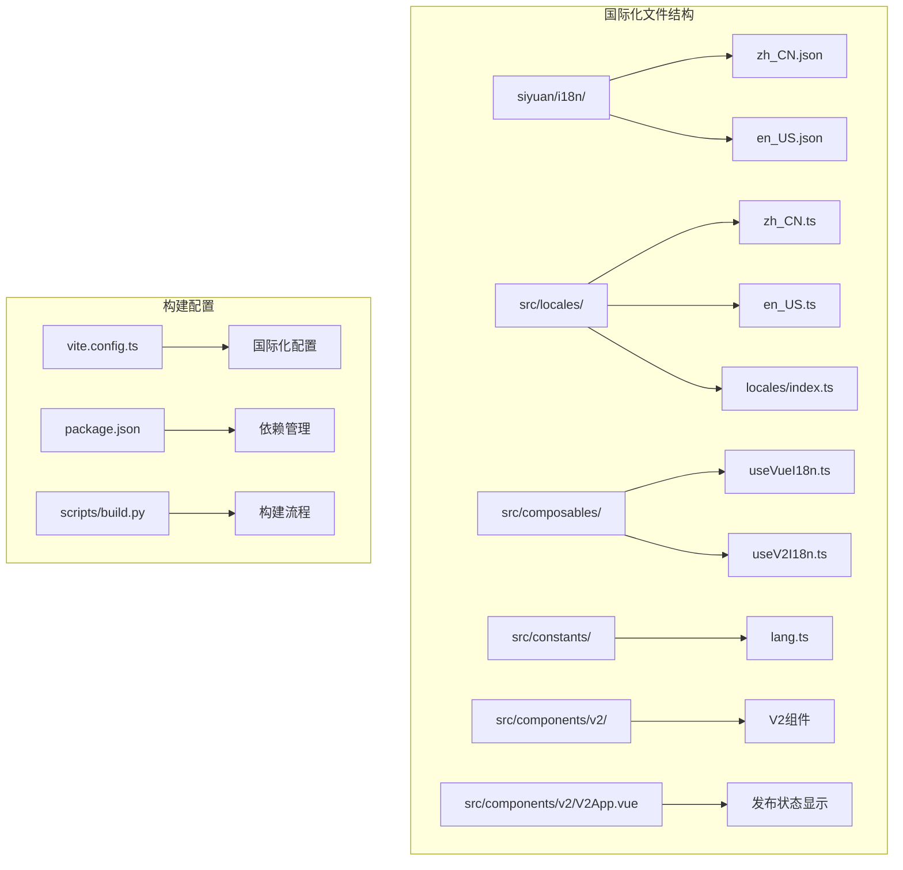
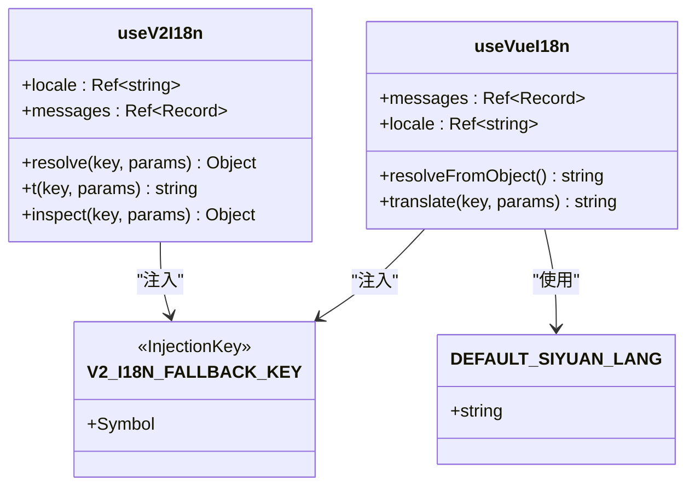
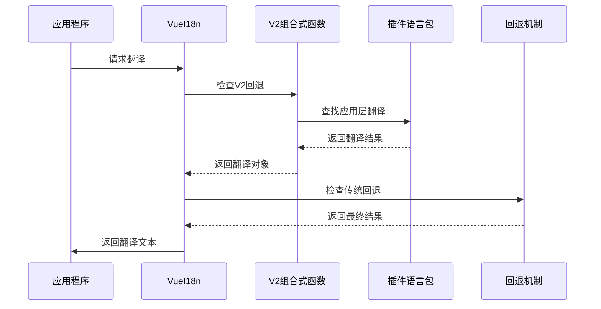
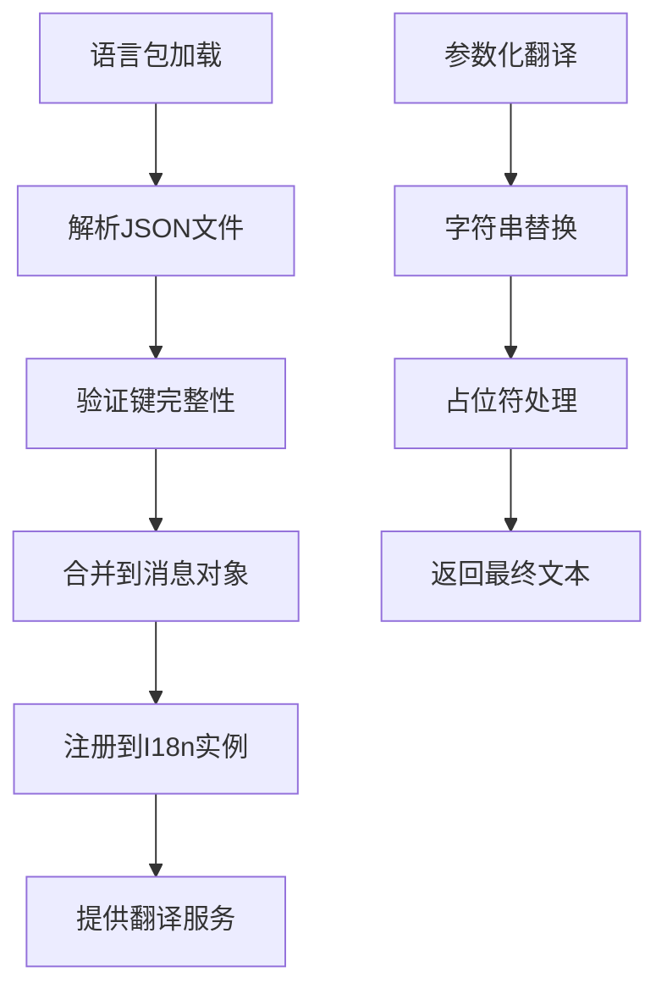
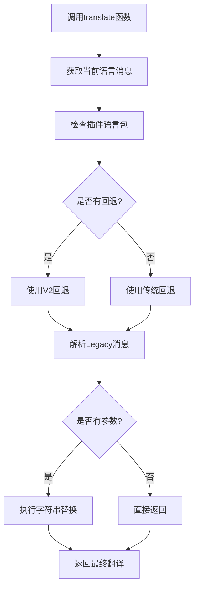
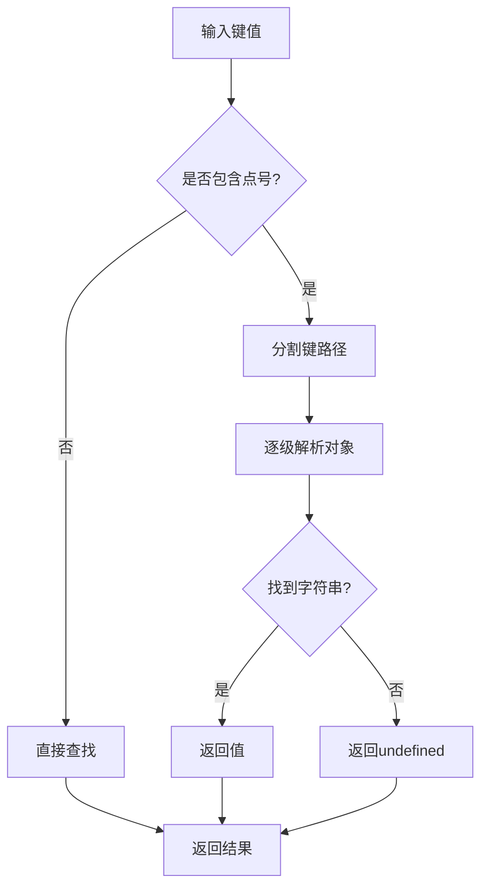
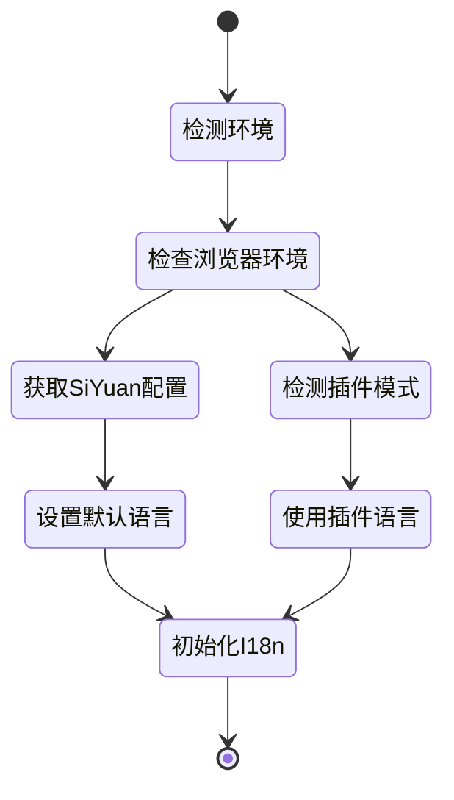
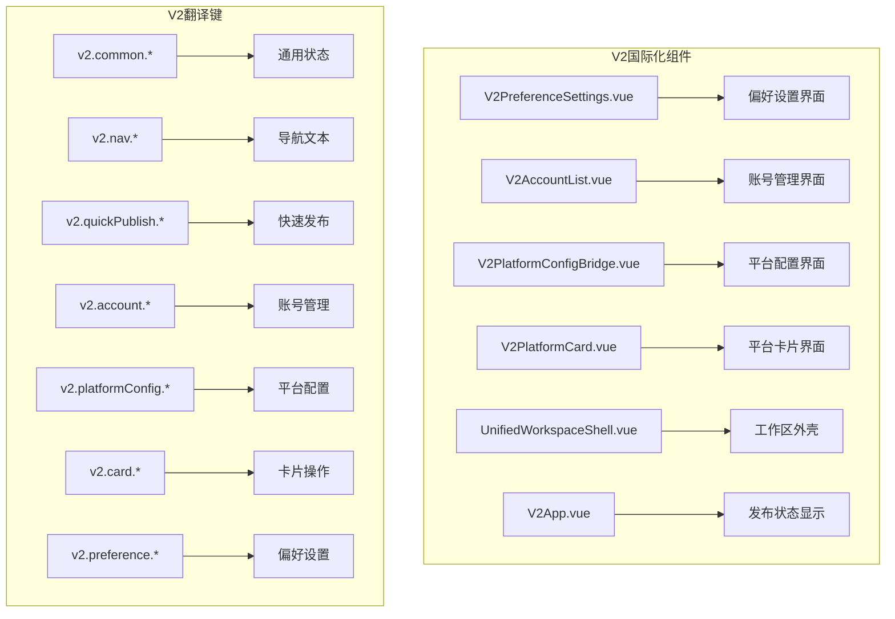
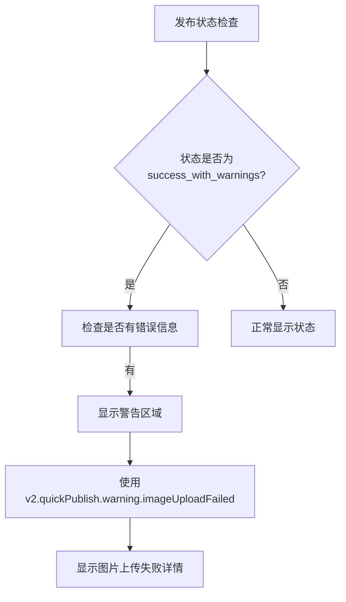
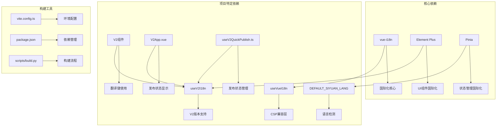

# 国际化支持

<cite>
**本文档引用的文件**
- [zh_CN.json](file://siyuan/i18n/zh_CN.json)
- [en_US.json](file://siyuan/i18n/en_US.json)
- [zh_CN.ts](file://src/locales/zh_CN.ts)
- [en_US.ts](file://src/locales/en_US.ts)
- [locales/index.ts](file://src/locales/index.ts)
- [useVueI18n.ts](file://src/composables/useVueI18n.ts)
- [useV2I18n.ts](file://src/composables/v2/useV2I18n.ts)
- [lang.ts](file://src/constants/lang.ts)
- [v2Host.ts](file://siyuan/v2/v2Host.ts)
- [build.py](file://scripts/build.py)
- [package.json](file://package.json)
- [vite.config.ts](file://vite.config.ts)
- [V2PreferenceSettings.vue](file://src/components/v2/settings/V2PreferenceSettings.vue)
- [V2AccountList.vue](file://src/components/v2/settings/V2AccountList.vue)
- [V2PlatformConfigBridge.vue](file://src/components/v2/settings/V2PlatformConfigBridge.vue)
- [V2PlatformCard.vue](file://src/components/v2/publish/V2PlatformCard.vue)
- [UnifiedWorkspaceShell.vue](file://src/components/v2/layout/UnifiedWorkspaceShell.vue)
- [V2App.vue](file://src/components/v2/V2App.vue)
- [useV2QuickPublish.ts](file://src/composables/v2/useV2QuickPublish.ts)
</cite>

## 更新摘要
**变更内容**
- 新增了5个用于图片上传警告的国际化翻译键：v2.quickPublish.warning.imageUploadFailed、v2.publish.title.updateSuccessWithWarnings、v2.publish.title.publishSuccessWithWarnings、v2.publish.desc.updateSuccessWithWarnings、v2.publish.desc.publishSuccessWithWarnings
- 增强了发布状态的多语言支持，特别是在图片上传失败时的警告显示
- 完善了发布成功但带警告状态的多语言界面

## 目录
1. [简介](#简介)
2. [项目结构](#项目结构)
3. [核心组件](#核心组件)
4. [架构概览](#架构概览)
5. [详细组件分析](#详细组件分析)
6. [V2版本国际化支持](#v2版本国际化支持)
7. [图片上传警告国际化](#图片上传警告国际化)
8. [依赖关系分析](#依赖关系分析)
9. [性能考量](#性能考量)
10. [故障排除指南](#故障排除指南)
11. [结论](#结论)

## 简介

本项目实现了完整的国际化支持系统，支持中文（简体）和英文两种语言。国际化系统采用多层次的设计架构，既支持传统的vue-i18n框架，又提供了专门针对插件环境的CSP兼容解决方案。

国际化系统主要服务于思源笔记插件的发布工具，为用户提供多语言界面支持，涵盖发布设置、平台配置、文章管理等核心功能模块。系统现已增强支持嵌套键解析、参数化文本替换和改进的传统消息回退机制。

**更新** 本次更新重点增强了V2版本的国际化支持，新增了大量V2特定功能的翻译键，包括：
- 快速发布界面的完整翻译支持
- 账号管理功能的多语言界面
- 图床设置的国际化界面
- 偏好设置的V2版本界面
- 平台配置桥接的多语言支持
- **新增图片上传警告的多语言显示支持**

## 项目结构

国际化相关的文件组织结构清晰，采用了模块化的文件组织方式：



**图表来源**
- [zh_CN.json:1-405](file://siyuan/i18n/zh_CN.json#L1-L405)
- [en_US.ts:1-789](file://src/locales/en_US.ts#L1-L789)
- [locales/index.ts:1-25](file://src/locales/index.ts#L1-L25)

**章节来源**
- [zh_CN.json:1-405](file://siyuan/i18n/zh_CN.json#L1-L405)
- [en_US.json:1-403](file://siyuan/i18n/en_US.json#L1-L403)
- [zh_CN.ts:1-750](file://src/locales/zh_CN.ts#L1-L750)
- [en_US.ts:1-789](file://src/locales/en_US.ts#L1-L789)

## 核心组件

### 语言包文件

项目包含两套完整的语言包文件：

1. **Siyuan插件语言包** (`siyuan/i18n/`)
   - `zh_CN.json`: 中文语言包，包含405条翻译项（新增5个图片上传警告相关键）
   - `en_US.json`: 英文语言包，包含403条翻译项（新增5个图片上传警告相关键）

2. **应用层语言包** (`src/locales/`)
   - `zh_CN.ts`: 应用程序中文语言包，包含750条翻译项
   - `en_US.ts`: 应用程序英文语言包，包含789条翻译项

### 国际化组合式函数



**图表来源**
- [useVueI18n.ts:21-74](file://src/composables/useVueI18n.ts#L21-L74)
- [useV2I18n.ts:12-89](file://src/composables/v2/useV2I18n.ts#L12-L89)
- [lang.ts:1-5](file://src/constants/lang.ts#L1-L5)

**章节来源**
- [useVueI18n.ts:1-75](file://src/composables/useVueI18n.ts#L1-L75)
- [useV2I18n.ts:1-90](file://src/composables/v2/useV2I18n.ts#L1-L90)
- [lang.ts:1-5](file://src/constants/lang.ts#L1-L5)

## 架构概览

国际化系统采用分层架构设计，确保在不同环境下都能正常工作。系统现已增强支持嵌套键解析和参数化文本替换：



**图表来源**
- [useVueI18n.ts:48-71](file://src/composables/useVueI18n.ts#L48-L71)
- [useV2I18n.ts:39-82](file://src/composables/v2/useV2I18n.ts#L39-L82)
- [v2Host.ts:109-140](file://siyuan/v2/v2Host.ts#L109-L140)

## 详细组件分析

### 语言包结构分析

#### Syrup插件语言包
语言包采用JSON格式，包含完整的键值对结构：

| 字段 | 类型 | 描述 | 示例 |
|------|------|------|------|
| publishTool | string | 发布工具标题 | "发布工具" / "Publisher" |
| setting | string | 设置菜单项 | "设置" / "Setting" |
| publish | string | 发布按钮 | "发布" / "Publish" |
| preview | string | 预览功能 | "预览" / "Preview" |

**更新** V2相关键值新增：
- `v2.common.*`: 通用状态文本（启用/禁用/保存中等）
- `v2.nav.*`: 导航标题和选项
- `v2.quickPublish.*`: 快速发布界面文本
- `v2.account.*`: 账号管理界面文本
- `v2.platformConfig.*`: 平台配置界面文本
- `v2.card.*`: 平台卡片操作文本
- `v2.preference.*`: 偏好设置界面文本
- **新增图片上传警告相关键值**：v2.quickPublish.warning.imageUploadFailed、v2.publish.title.updateSuccessWithWarnings、v2.publish.title.publishSuccessWithWarnings、v2.publish.desc.updateSuccessWithWarnings、v2.publish.desc.publishSuccessWithWarnings

#### 应用层语言包
应用层语言包采用TypeScript模块格式，提供更丰富的功能：



**图表来源**
- [zh_CN.ts:10-750](file://src/locales/zh_CN.ts#L10-L750)
- [en_US.ts:10-789](file://src/locales/en_US.ts#L10-L789)

**章节来源**
- [zh_CN.ts:1-750](file://src/locales/zh_CN.ts#L1-L750)
- [en_US.ts:1-789](file://src/locales/en_US.ts#L1-L789)

### 国际化组合式函数实现

#### useVueI18n函数
该函数提供了CSP兼容的国际化解决方案，现已增强支持嵌套键解析和参数化文本替换：



**更新** 增强功能包括：
- **嵌套键解析**：支持点号分隔的嵌套键路径
- **参数化替换**：动态参数占位符替换
- **多层回退**：应用层→V2回退→传统回退→原始键

**图表来源**
- [useVueI18n.ts:48-71](file://src/composables/useVueI18n.ts#L48-L71)

#### useV2I18n函数
专门为V2版本设计的国际化解决方案，支持完整的参数化功能：

| 功能特性 | 实现方式 | 用途 |
|----------|----------|------|
| 多层查找 | locale → fallback → legacy | 确保翻译可用性 |
| 参数化支持 | 占位符替换 | 动态内容渲染 |
| 类型安全 | TypeScript接口 | 编译时类型检查 |
| 源追踪 | source字段 | 调试和监控 |
| 完整参数化 | applyParams函数 | 参数化文本处理 |

**章节来源**
- [useVueI18n.ts:1-75](file://src/composables/useVueI18n.ts#L1-L75)
- [useV2I18n.ts:1-90](file://src/composables/v2/useV2I18n.ts#L1-L90)

### 嵌套键解析机制

系统现已支持复杂的嵌套键解析，能够处理深层对象结构：



**新增功能** 嵌套键解析支持：
- 支持任意深度的对象嵌套
- 类型安全检查确保返回字符串
- 原子性操作避免中间状态问题

**章节来源**
- [useVueI18n.ts:25-46](file://src/composables/useVueI18n.ts#L25-L46)
- [useV2I18n.ts:16-37](file://src/composables/v2/useV2I18n.ts#L16-L37)

### 参数化文本替换

系统提供强大的参数化文本替换功能，支持动态内容渲染：

```mermaid
flowchart TD
A[翻译文本] --> B[检查参数对象]
B --> |有参数| C[遍历参数键值对]
B --> |无参数| D[直接返回]
C --> E[字符串替换]
E --> F[占位符格式 {key}]
F --> G[替换所有匹配项]
G --> H[返回最终文本]
D --> H
```

**增强功能** 参数化替换机制：
- 支持任意数量的参数
- 类型安全的参数值处理
- 自动null/undefined处理
- 原子性替换操作

**章节来源**
- [useVueI18n.ts:62-70](file://src/composables/useVueI18n.ts#L62-L70)
- [useV2I18n.ts:56-74](file://src/composables/v2/useV2I18n.ts#L56-L74)

### 传统消息回退机制

系统提供完整的传统消息回退机制，确保翻译可用性：



**改进机制** 回退策略：
- 应用层语言包优先
- V2回退机制次之
- 传统语言包最后
- 原始键名作为最终回退

**章节来源**
- [lang.ts:1-5](file://src/constants/lang.ts#L1-L5)
- [useVueI18n.ts:50-51](file://src/composables/useVueI18n.ts#L50-L51)

## V2版本国际化支持

### V2组件国际化实现

V2版本引入了全新的界面架构，包含多个专门的国际化组件：



**图表来源**
- [V2PreferenceSettings.vue:1-239](file://src/components/v2/settings/V2PreferenceSettings.vue#L1-L239)
- [V2AccountList.vue:1-287](file://src/components/v2/settings/V2AccountList.vue#L1-L287)
- [V2PlatformConfigBridge.vue:1-206](file://src/components/v2/settings/V2PlatformConfigBridge.vue#L1-L206)
- [V2PlatformCard.vue:1-280](file://src/components/v2/publish/V2PlatformCard.vue#L1-L280)
- [UnifiedWorkspaceShell.vue:1-50](file://src/components/v2/layout/UnifiedWorkspaceShell.vue#L1-L50)
- [V2App.vue:66-77](file://src/components/v2/V2App.vue#L66-L77)

### V2翻译键分类

V2版本的翻译键按照功能模块进行分类：

#### 通用状态文本
- `v2.common.enabled`: "开启"
- `v2.common.disabled`: "关闭"  
- `v2.common.saving`: "保存中"
- `v2.common.saved`: "已保存"
- `v2.common.saveFailed`: "保存失败"
- `v2.common.unknown`: "未识别"
- `v2.common.unknownError`: "未知错误"

#### 导航系统
- `v2.nav.title`: "设置导航"
- `v2.nav.account`: "账号设置"
- `v2.nav.picbed`: "图床设置"
- `v2.nav.preference`: "偏好设置"

#### 快速发布界面
- `v2.quickPublish.currentDocument`: "当前文档"
- `v2.quickPublish.desc`: "快速发布态只保留主内容区，设置通过右上角低权重入口进入。"
- `v2.quickPublish.errorDetails`: "错误详情"
- **新增** `v2.quickPublish.warning.imageUploadFailed`: "图片未同步详情"
- `v2.quickPublish.loading.platforms`: "平台列表载入中"
- `v2.quickPublish.loading.status`: "状态载入中"

#### 发布状态界面
- `v2.publish.title.preparing`: "正在准备发布"
- `v2.publish.title.preparingDelete`: "正在准备删除"
- `v2.publish.title.updating`: "正在更新"
- `v2.publish.title.deleting`: "正在删除"
- `v2.publish.title.publishing`: "正在发布"
- `v2.publish.title.updateSuccess`: "更新成功"
- `v2.publish.title.deleteSuccess`: "删除成功"
- `v2.publish.title.publishSuccess`: "发布成功"
- **新增** `v2.publish.title.updateSuccessWithWarnings`: "更新成功，图片未同步"
- **新增** `v2.publish.title.publishSuccessWithWarnings`: "发布成功，图片未同步"
- `v2.publish.title.previewReady`: "已发布，可查看"
- `v2.publish.title.updateFailed`: "更新失败"
- `v2.publish.title.deleteFailed`: "删除失败"
- `v2.publish.title.publishFailed`: "发布失败"
- `v2.publish.title.idle`: "等待发布"

#### 发布描述界面
- `v2.publish.desc.preparing.named`: "正在准备 {name} 的发布任务。"
- `v2.publish.desc.preparing.default`: "正在准备发布任务。"
- `v2.publish.desc.updating.named`: "正在更新 {name} 的内容，请稍候。"
- `v2.publish.desc.updating.default`: "正在更新，请稍候。"
- `v2.publish.desc.deleting.named`: "正在删除 {name} 的发布记录，请稍候。"
- `v2.publish.desc.deleting.default`: "正在删除，请稍候。"
- `v2.publish.desc.publishing.named`: "正在发布到 {name}，请稍候。"
- `v2.publish.desc.publishing.default`: "正在发布，请稍候。"
- `v2.publish.desc.updateSuccess.named`: "已完成 {name} 的更新。"
- `v2.publish.desc.updateSuccess.default`: "更新完成。"
- `v2.publish.desc.deleteSuccess.named`: "已完成 {name} 的删除。"
- `v2.publish.desc.deleteSuccess.default`: "删除完成。"
- `v2.publish.desc.publishSuccess.named`: "已完成 {name} 的发布。"
- `v2.publish.desc.publishSuccess.default`: "发布完成。"
- **新增** `v2.publish.desc.updateSuccessWithWarnings.named`: "已更新到{name}，但部分图片未能同步"
- **新增** `v2.publish.desc.updateSuccessWithWarnings.default`: "文章已更新，但部分图片未能同步到目标平台"
- **新增** `v2.publish.desc.publishSuccessWithWarnings.named`: "已发布到{name}，但部分图片未能同步"
- **新增** `v2.publish.desc.publishSuccessWithWarnings.default`: "文章已发布，但部分图片未能同步到目标平台"
- `v2.publish.desc.previewReady.named`: "{name} 已有发布记录，可直接查看。"
- `v2.publish.desc.previewReady.default`: "已有发布记录，可直接查看。"
- `v2.publish.desc.updateFailed.named`: "{name} 更新失败，请查看错误详情。"
- `v2.publish.desc.updateFailed.default`: "更新失败，请查看错误详情。"
- `v2.publish.desc.deleteFailed.named`: "{name} 删除失败，请查看错误详情。"
- `v2.publish.desc.deleteFailed.default`: "删除失败，请查看错误详情。"
- `v2.publish.desc.publishFailed.named`: "{name} 发布失败，请查看错误详情。"
- `v2.publish.desc.publishFailed.default`: "发布失败，请查看错误详情。"
- `v2.publish.desc.idle`: "选择一个平台开始发布。"

#### 账号管理界面
- `v2.account.eyebrow`: "账号设置"
- `v2.account.title`: "账号列表"
- `v2.account.desc`: "查看账号状态、启停平台，并进入平台配置。"
- `v2.account.empty.title`: "暂无已配置账号"
- `v2.account.empty.desc`: "点击右上角"添加账号"开始创建平台配置。"

#### 平台配置界面
- `v2.platformConfig.eyebrow`: "账号设置"
- `v2.platformConfig.title`: "平台配置"
- `v2.platformConfig.desc`: "当前通过真实 DOM 直接桥接已有平台表单，不再依赖 iframe 设置页。"
- `v2.platformConfig.loading.title`: "正在加载平台配置"
- `v2.platformConfig.loading.desc`: "正在读取平台元数据和桥接组件。"

#### 平台卡片界面
- `v2.card.status.quickPublishReady`: "可快速发布"
- `v2.card.status.unauthorized`: "未授权"
- `v2.card.status.published`: "已发布"
- `v2.card.status.unpublished`: "未发布"
- `v2.card.action.preview`: "查看文章"
- `v2.card.action.delete`: "删除"
- `v2.card.action.retry`: "重试"
- `v2.card.action.update`: "更新"
- `v2.card.action.publish`: "发布"

#### 偏好设置界面
- `v2.preference.eyebrow`: "偏好设置"
- `v2.preference.title`: "偏好设置"
- `v2.preference.desc`: "这里的开关会直接写入当前偏好配置。除"使用新版 UI"外，其余设置会立即生效。"
- `v2.preference.group.content.title`: "内容处理"
- `v2.preference.group.menu.title`: "菜单入口"
- `v2.preference.group.experimental.title`: "实验功能"

**章节来源**
- [zh_CN.json:98-281](file://siyuan/i18n/zh_CN.json#L98-L281)
- [en_US.json:98-281](file://siyuan/i18n/en_US.json#L98-L281)
- [V2PreferenceSettings.vue:84-192](file://src/components/v2/settings/V2PreferenceSettings.vue#L84-L192)
- [V2AccountList.vue:87-119](file://src/components/v2/settings/V2AccountList.vue#L87-L119)
- [V2PlatformConfigBridge.vue:54-108](file://src/components/v2/settings/V2PlatformConfigBridge.vue#L54-L108)
- [V2PlatformCard.vue:72-117](file://src/components/v2/publish/V2PlatformCard.vue#L72-L117)

## 图片上传警告国际化

### 新增翻译键功能

本次更新新增了5个专门用于图片上传警告的国际化翻译键，用于支持图片上传失败时的多语言显示：

#### 快速发布警告键
- **v2.quickPublish.warning.imageUploadFailed**: "图片未同步详情"
  - 用途：在发布状态为success_with_warnings时显示图片上传失败的详细信息
  - 位置：V2App.vue中的发布状态警告区域

#### 发布成功警告描述键
- **v2.publish.title.updateSuccessWithWarnings**: "更新成功，图片未同步"
  - 用途：更新操作成功但存在图片上传警告时的状态标题
- **v2.publish.title.publishSuccessWithWarnings**: "发布成功，图片未同步"
  - 用途：发布操作成功但存在图片上传警告时的状态标题
- **v2.publish.desc.updateSuccessWithWarnings.named**: "已更新到{name}，但部分图片未能同步"
  - 用途：更新操作成功但存在图片上传警告时的描述信息（带平台名称）
- **v2.publish.desc.updateSuccessWithWarnings.default**: "文章已更新，但部分图片未能同步到目标平台"
  - 用途：更新操作成功但存在图片上传警告时的描述信息（默认）
- **v2.publish.desc.publishSuccessWithWarnings.named**: "已发布到{name}，但部分图片未能同步"
  - 用途：发布操作成功但存在图片上传警告时的描述信息（带平台名称）
- **v2.publish.desc.publishSuccessWithWarnings.default**: "文章已发布，但部分图片未能同步到目标平台"
  - 用途：发布操作成功但存在图片上传警告时的描述信息（默认）

### 实现机制

这些新增的翻译键通过以下机制协同工作：



**图表来源**
- [V2App.vue:66-77](file://src/components/v2/V2App.vue#L66-L77)
- [useV2QuickPublish.ts:187-194](file://src/composables/v2/useV2QuickPublish.ts#L187-L194)

### 使用场景

这些翻译键主要用于以下场景：

1. **图片上传失败警告**：当文章发布成功但部分图片未能同步到目标平台时
2. **用户反馈**：向用户清晰地说明发布状态和存在的问题
3. **多语言支持**：确保不同语言环境下的用户都能理解发布状态
4. **错误诊断**：提供具体的错误信息帮助用户诊断问题

**章节来源**
- [V2App.vue:66-77](file://src/components/v2/V2App.vue#L66-L77)
- [useV2QuickPublish.ts:187-194](file://src/composables/v2/useV2QuickPublish.ts#L187-L194)
- [zh_CN.json:123](file://siyuan/i18n/zh_CN.json#L123)
- [en_US.json:123](file://siyuan/i18n/en_US.json#L123)

## 依赖关系分析

### 核心依赖关系



**图表来源**
- [package.json:32-68](file://package.json#L32-L68)
- [vite.config.ts:81-181](file://vite.config.ts#L81-L181)

### 语言包依赖

| 语言包 | 依赖文件 | 功能 |
|--------|----------|------|
| zh_CN.json | siyuan/i18n/zh_CN.json | 插件界面翻译（含405条翻译项，新增5个图片上传警告键） |
| en_US.json | siyuan/i18n/en_US.json | 插件界面翻译（含403条翻译项，新增5个图片上传警告键） |
| zh_CN.ts | src/locales/zh_CN.ts | 应用程序翻译 |
| en_US.ts | src/locales/en_US.ts | 应用程序翻译 |
| index.ts | src/locales/index.ts | I18n实例配置 |

**章节来源**
- [package.json:32-68](file://package.json#L32-L68)
- [locales/index.ts:10-24](file://src/locales/index.ts#L10-L24)

## 性能考量

### 加载优化策略

1. **按需加载**: 语言包采用延迟加载策略，减少初始启动时间
2. **缓存机制**: 翻译结果在内存中缓存，避免重复查找
3. **CSP兼容**: 解决Content Security Policy限制，提高安全性
4. **类型安全**: TypeScript提供编译时检查，减少运行时错误
5. **嵌套解析优化**: 嵌套键解析采用原子性操作，避免中间状态
6. **V2组件优化**: V2组件使用useV2I18n，提供更好的性能表现
7. **条件渲染优化**: 图片上传警告仅在必要时显示，避免不必要的DOM操作

### 内存使用优化

- 语言包大小控制在合理范围内（中文405条，英文403条翻译项）
- 动态导入机制避免不必要的资源加载
- 清晰的模块边界，便于垃圾回收
- 参数化替换的高效字符串处理
- V2组件的懒加载机制
- **条件显示优化**：警告区域仅在有错误信息时渲染

## 故障排除指南

### 常见问题及解决方案

| 问题类型 | 症状 | 解决方案 |
|----------|------|----------|
| 语言包缺失 | 显示键名而非翻译文本 | 检查语言包文件完整性 |
| 翻译不生效 | 页面显示英文或中文乱码 | 验证I18n配置和加载顺序 |
| 参数化翻译错误 | 占位符未替换 | 检查参数传递和格式 |
| CSP错误 | 控制台报错 | 使用useVueI18n替代传统方法 |
| 嵌套键解析失败 | 返回undefined | 验证键路径的正确性 |
| V2组件翻译缺失 | V2界面显示英文 | 检查V2翻译键是否完整 |
| V2组件参数化失败 | 动态内容显示错误 | 验证参数对象的键值对格式 |
| **图片上传警告不显示** | 成功发布但无警告提示 | 检查发布状态是否为success_with_warnings且有错误信息 |
| **翻译键未生效** | 新增的图片上传警告键显示原文 | 确认翻译键已在语言包中正确添加 |

### 调试技巧

1. **启用详细日志**: 在开发环境中启用详细的国际化日志
2. **检查消息对象**: 验证messages.value的内容结构
3. **验证键路径**: 确保翻译键的层次结构正确
4. **测试回退机制**: 验证fallback语言包的加载
5. **参数化调试**: 检查参数对象的键值对格式
6. **V2组件调试**: 验证useV2I18n的t函数调用
7. **状态检查调试**: 验证发布状态和错误信息的传递
8. **条件渲染调试**: 确认警告区域的显示条件

**章节来源**
- [useVueI18n.ts:25-46](file://src/composables/useVueI18n.ts#L25-L46)
- [useV2I18n.ts:16-37](file://src/composables/v2/useV2I18n.ts#L16-L37)

## 结论

本项目的国际化支持系统经过增强，具有以下显著特点：

1. **多层次架构**: 同时支持传统vue-i18n和CSP兼容方案
2. **完整的语言覆盖**: 提供中文和英文双语支持（V2版本新增405+403个翻译键）
3. **嵌套键解析**: 支持复杂对象结构的键值查找
4. **参数化文本替换**: 提供动态内容渲染能力
5. **智能回退机制**: 多层回退确保翻译可用性
6. **V2版本完整支持**: 新增大量V2特定功能的翻译键
7. **灵活的扩展性**: 易于添加新的语言包和翻译项
8. **性能优化**: 采用多种优化策略确保良好的用户体验
9. **类型安全**: TypeScript提供完整的类型安全保障
10. **组件化设计**: V2组件提供更好的用户体验和维护性
11. ****增强的图片上传警告支持**: 新增5个专门用于图片上传警告的翻译键，提供更好的用户体验

国际化系统为思源笔记插件的发布工具提供了完善的多语言支持，特别是V2版本的完整国际化支持，用户可以根据需要选择合适的语言环境，享受流畅的国际化体验。新增的405个中文V2翻译键和403个英文V2翻译键涵盖了UI元素、导航、平台设置、快速发布、账户管理和偏好设置等V2特定功能，大大提升了V2版本的用户体验。

**更新** 本次更新特别增强了图片上传警告的国际化支持，新增的5个翻译键（v2.quickPublish.warning.imageUploadFailed、v2.publish.title.updateSuccessWithWarnings、v2.publish.title.publishSuccessWithWarnings、v2.publish.desc.updateSuccessWithWarnings、v2.publish.desc.publishSuccessWithWarnings）使得用户在遇到图片上传问题时能够获得清晰的多语言提示，提升了系统的易用性和用户体验。

增强的功能包括嵌套键解析、参数化文本替换和改进的回退机制，进一步提升了系统的灵活性和可靠性。V2版本的国际化支持不仅完善了现有功能的多语言界面，还为未来的功能扩展奠定了坚实的国际化基础。