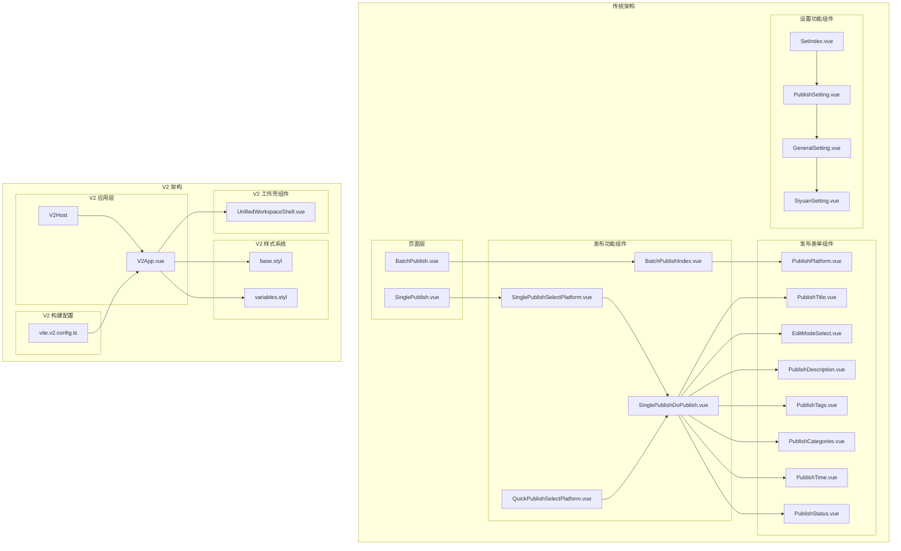
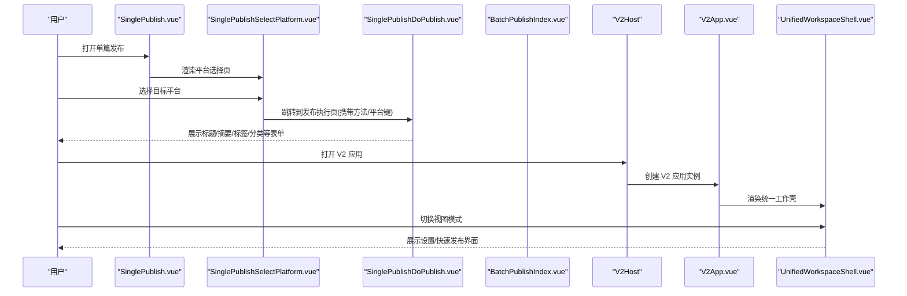
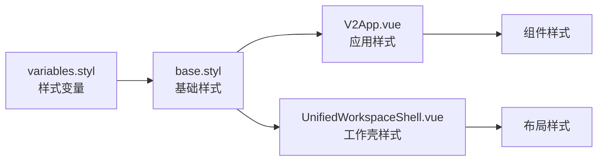
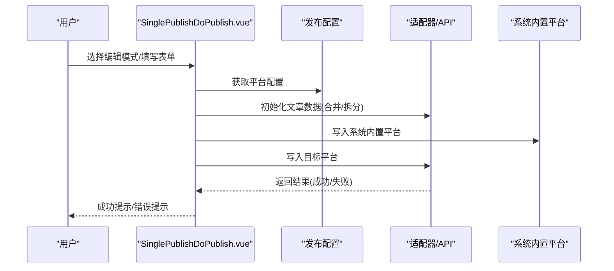
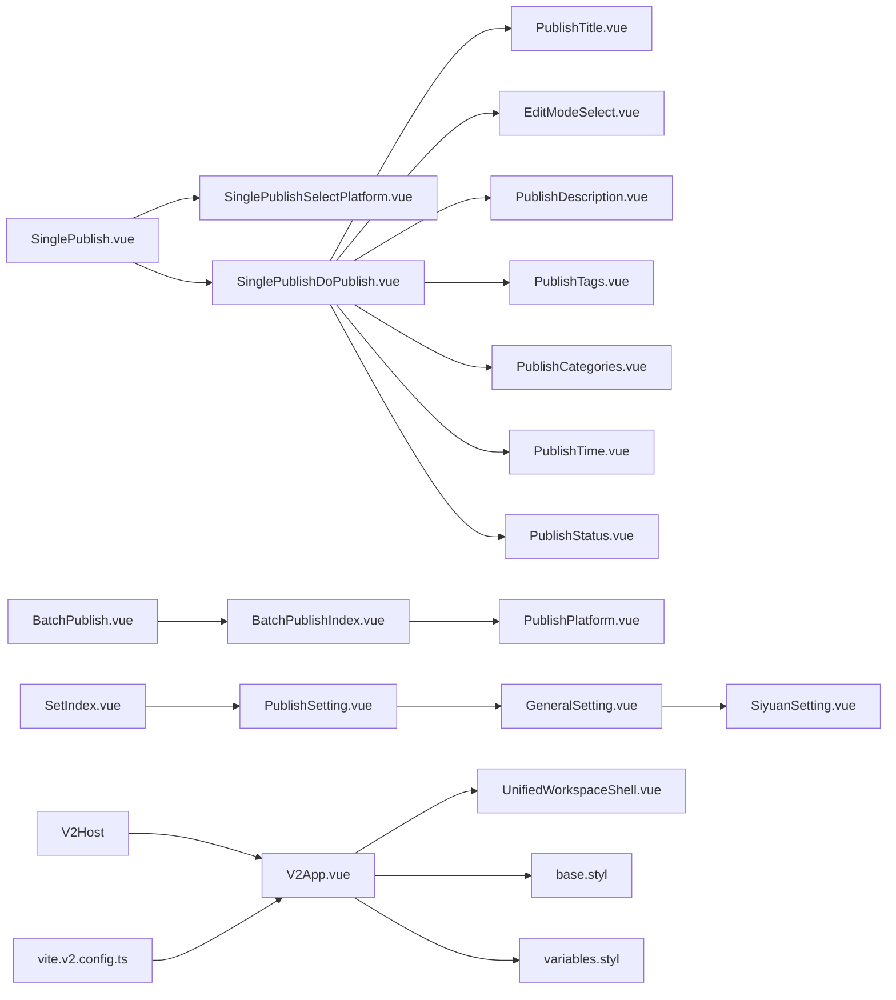

# 用户界面组件

<cite>
**本文引用的文件**
- [SinglePublishSelectPlatform.vue](file://src/components/publish/SinglePublishSelectPlatform.vue)
- [BatchPublishIndex.vue](file://src/components/publish/BatchPublishIndex.vue)
- [SinglePublishDoPublish.vue](file://src/components/publish/SinglePublishDoPublish.vue)
- [QuickPublishSelectPlatform.vue](file://src/components/publish/QuickPublishSelectPlatform.vue)
- [SinglePublish.vue](file://src/pages/SinglePublish.vue)
- [BatchPublish.vue](file://src/pages/BatchPublish.vue)
- [PublishPlatform.vue](file://src/components/publish/form/PublishPlatform.vue)
- [PublishTitle.vue](file://src/components/publish/form/PublishTitle.vue)
- [EditModeSelect.vue](file://src/components/publish/form/EditModeSelect.vue)
- [PublishDescription.vue](file://src/components/publish/form/PublishDescription.vue)
- [PublishTags.vue](file://src/components/publish/form/PublishTags.vue)
- [PublishCategories.vue](file://src/components/publish/form/PublishCategories.vue)
- [PublishTime.vue](file://src/components/publish/form/PublishTime.vue)
- [PublishStatus.vue](file://src/components/publish/form/PublishStatus.vue)
- [PublishSetting.vue](file://src/components/set/PublishSetting.vue)
- [SetIndex.vue](file://src/components/set/SetIndex.vue)
- [GeneralSetting.vue](file://src/components/set/GeneralSetting.vue)
- [SiyuanSetting.vue](file://src/components/set/SiyuanSetting.vue)
- [V2App.vue](file://src/components/v2/V2App.vue)
- [UnifiedWorkspaceShell.vue](file://src/components/v2/layout/UnifiedWorkspaceShell.vue)
- [createV2App.ts](file://src/v2/createV2App.ts)
- [base.styl](file://src/assets/v2/base.styl)
- [variables.styl](file://src/assets/v2/variables.styl)
- [vite.v2.config.ts](file://vite.v2.config.ts)
- [v2Host.ts](file://siyuan/v2/v2Host.ts)
- [App.vue](file://src/App.vue)
- [main.ts](file://src/main.ts)
</cite>

## 更新摘要
**所做更改**
- 新增 V2 应用架构章节，介绍全新的 UI V2 系统
- 添加 V2App.vue 组件和 UnifiedWorkspaceShell.vue 工作壳组件的详细分析
- 新增 V2 样式系统和设计规范章节
- 更新项目结构图以包含 V2 组件
- 添加 V2 应用创建和配置指南
- 更新架构总览以反映双架构并存的现状
- 新增 V2 Host 宿主系统和生命周期管理
- 添加 V2 UI 迁移规范和里程碑管理

## 目录
1. [简介](#简介)
2. [项目结构](#项目结构)
3. [核心组件](#核心组件)
4. [架构总览](#架构总览)
5. [V2 应用架构](#v2-应用架构)
6. [详细组件分析](#详细组件分析)
7. [依赖关系分析](#依赖关系分析)
8. [性能考量](#性能考量)
9. [故障排查指南](#故障排查指南)
10. [结论](#结论)
11. [附录](#附录)

## 简介
本文件面向用户界面组件，系统性梳理 Vue 组件架构与发布/设置两大业务域的组件化设计。内容涵盖：
- 页面组件（路由级）、功能组件、表单组件的层次结构
- 发布相关组件：单篇发布、批量发布、极速发布、发布表单组件的设计与实现
- 设置相关组件：发布设置、平台配置、偏好设置、通用设置的组件化设计
- **新增** V2 应用架构：全新的 UI V2 系统、工作壳组件、样式系统
- 组件通信机制、状态传递、事件处理最佳实践
- 样式设计规范、主题定制、响应式布局实现
- 组件使用示例与自定义扩展指南
- **新增** V2 UI 迁移规范和里程碑管理

## 项目结构
项目采用"页面组件 + 功能组件 + 表单组件"的分层组织方式，配合统一的适配器与存储层，形成清晰的职责边界。**现已新增 V2 应用架构**，提供现代化的工作壳设计和统一的样式系统，并通过 V2 Host 宿主系统实现真实的 DOM 挂载。



**图表来源**
- [SinglePublish.vue:10-21](file://src/pages/SinglePublish.vue#L10-L21)
- [BatchPublish.vue:10-21](file://src/pages/BatchPublish.vue#L10-L21)
- [V2App.vue:1-171](file://src/components/v2/V2App.vue#L1-L171)
- [UnifiedWorkspaceShell.vue:1-52](file://src/components/v2/layout/UnifiedWorkspaceShell.vue#L1-L52)
- [base.styl:1-300](file://src/assets/v2/base.styl#L1-L300)
- [variables.styl:1-58](file://src/assets/v2/variables.styl#L1-L58)
- [vite.v2.config.ts:1-137](file://vite.v2.config.ts#L1-L137)
- [v2Host.ts:1-107](file://siyuan/v2/v2Host.ts#L1-L107)

**章节来源**
- [SinglePublish.vue:10-21](file://src/pages/SinglePublish.vue#L10-L21)
- [BatchPublish.vue:10-21](file://src/pages/BatchPublish.vue#L10-L21)
- [V2App.vue:1-171](file://src/components/v2/V2App.vue#L1-L171)
- [UnifiedWorkspaceShell.vue:1-52](file://src/components/v2/layout/UnifiedWorkspaceShell.vue#L1-L52)
- [v2Host.ts:1-107](file://siyuan/v2/v2Host.ts#L1-L107)

## 核心组件
- 页面组件（路由级）
  - 单篇发布入口页：SinglePublish.vue
  - 批量发布入口页：BatchPublish.vue
- 发布功能组件
  - 单篇发布平台选择：SinglePublishSelectPlatform.vue
  - 单篇发布执行页：SinglePublishDoPublish.vue
  - 批量发布主控页：BatchPublishIndex.vue
  - 极速发布平台选择：QuickPublishSelectPlatform.vue
- 发布表单组件
  - 平台选择器：PublishPlatform.vue
  - 标题输入与AI生成：PublishTitle.vue
  - 编辑模式切换：EditModeSelect.vue
  - 摘要输入与AI生成：PublishDescription.vue
  - 标签输入与AI生成：PublishTags.vue
  - 分类输入与AI生成：PublishCategories.vue
  - 发布/更新时间：PublishTime.vue
  - 发布状态与密码：PublishStatus.vue
- 设置功能组件
  - 发布设置主面板：PublishSetting.vue
  - 设置入口聚合：SetIndex.vue
  - 通用设置：GeneralSetting.vue
  - 思源设置：SiyuanSetting.vue
- **新增** V2 应用组件
  - V2 应用根组件：V2App.vue
  - 统一工作壳：UnifiedWorkspaceShell.vue
  - V2 应用宿主：V2Host
  - V2 样式变量：variables.styl
  - V2 基础样式：base.styl
  - V2 构建配置：vite.v2.config.ts
- **新增** V2 UI 迁移规范
  - 统一工作壳要求：Requirement: UI V2 SHALL use one unified workspace shell
  - 里程碑管理：Milestone 0-4 的完整生命周期规划

**章节来源**
- [SinglePublish.vue:10-21](file://src/pages/SinglePublish.vue#L10-L21)
- [BatchPublish.vue:10-21](file://src/pages/BatchPublish.vue#L10-L21)
- [V2App.vue:1-171](file://src/components/v2/V2App.vue#L1-L171)
- [UnifiedWorkspaceShell.vue:1-52](file://src/components/v2/layout/UnifiedWorkspaceShell.vue#L1-L52)
- [v2Host.ts:1-107](file://siyuan/v2/v2Host.ts#L1-L107)
- [variables.styl:1-58](file://src/assets/v2/variables.styl#L1-L58)
- [base.styl:1-300](file://src/assets/v2/base.styl#L1-L300)
- [vite.v2.config.ts:1-137](file://vite.v2.config.ts#L1-L137)

## 架构总览
发布与设置两条主线通过路由与组件协作完成端到端流程；表单组件以"双向绑定 + emit 事件"实现与父组件的状态同步；页面组件负责参数解析与导航；功能组件负责具体业务逻辑与适配器调用。**现已支持双架构并存**，传统架构保持稳定，V2 架构提供现代化的用户体验。



**图表来源**
- [SinglePublish.vue:10-21](file://src/pages/SinglePublish.vue#L10-L21)
- [SinglePublishSelectPlatform.vue:62-122](file://src/components/publish/SinglePublishSelectPlatform.vue#L62-L122)
- [SinglePublishDoPublish.vue:104-147](file://src/components/publish/SinglePublishDoPublish.vue#L104-L147)
- [v2Host.ts:26-70](file://siyuan/v2/v2Host.ts#L26-L70)
- [V2App.vue:11-51](file://src/components/v2/V2App.vue#L11-L51)
- [UnifiedWorkspaceShell.vue:24-31](file://src/components/v2/layout/UnifiedWorkspaceShell.vue#L24-L31)

## V2 应用架构

### V2 应用概述
V2 应用架构是全新的现代化 UI 系统，采用统一工作壳设计，提供更好的用户体验和更清晰的界面结构。当前处于 Milestone 1 阶段，主要完成基础骨架搭建。该架构严格遵循 V2 UI 迁移规范，实现从 iframe 托管到真实 DOM 挂载的迁移。

### V2 应用组件结构
- **V2App.vue**：V2 应用根组件，负责应用初始化和视图切换
- **UnifiedWorkspaceShell.vue**：统一工作壳组件，提供品牌区、导航区、主内容区和详情区
- **V2Host**：V2 应用宿主系统，基于思源原生 Menu 实现真实 DOM 挂载
- **样式系统**：基于 Stylus 的完整样式体系，包含变量、混入和组件样式

### V2 样式系统
V2 样式系统采用模块化设计，所有样式都包裹在 `.syp-v2` 命名空间下，确保与思源笔记样式完全隔离：



**图表来源**
- [variables.styl:1-58](file://src/assets/v2/variables.styl#L1-L58)
- [base.styl:1-300](file://src/assets/v2/base.styl#L1-L300)
- [V2App.vue:58-171](file://src/components/v2/V2App.vue#L58-L171)
- [UnifiedWorkspaceShell.vue:186-300](file://src/components/v2/layout/UnifiedWorkspaceShell.vue#L186-L300)

### V2 应用创建与配置
V2 应用通过 `createV2App.ts` 工厂函数创建，支持国际化和状态管理：

```typescript
export const createV2VueApp = (options: CreateV2AppOptions = {}) => {
  const app = createApp(V2App, {
    initialView: options.initialView ?? "quick_publish",
    onClose: options.onClose,
  })

  app.use(createI18n({ legacy: false, locale, messages }))
  app.use(createPinia())

  return app
}
```

### V2 Host 宿主系统
V2Host 是基于思源原生 Menu 的宿主系统，实现真正的 DOM 挂载而非 iframe 托管：

```typescript
export class V2Host {
  private readonly logger
  private readonly menuId = "publisher-v2-menu"
  private app: VueApp<Element> | null = null
  private menu: Menu | null = null
  private mountPoint: HTMLElement | null = null

  public async show(options: ShowV2HostOptions = {}) {
    this.close()

    const menu = new Menu(this.menuId)
    const mountPoint = Object.assign(document.createElement("div"), {
      className: "publisher-v2-menu-content",
    })
    
    const app = createV2VueApp({
      initialView: options.initialView ?? "quick_publish",
      onClose: () => {
        this.logger.info("V2 panel closed")
        this.close()
      },
    })

    try {
      app.mount(mountPoint)
      this.app = app
      this.menu = menu
      this.mountPoint = mountPoint
      this.openMenu(menu, options.anchorElement)
      this.logger.info("V2 panel mounted")
    } catch (e) {
      this.logger.error("Failed to mount V2 panel:", e)
      this.close()
      throw e
    }
  }

  public close() {
    if (this.app) {
      this.app.unmount()
      this.app = null
    }

    if (this.mountPoint) {
      this.mountPoint.remove()
      this.mountPoint = null
    }

    if (this.menu) {
      this.menu.close()
      this.menu = null
    }
  }
}
```

**章节来源**
- [V2App.vue:1-171](file://src/components/v2/V2App.vue#L1-L171)
- [UnifiedWorkspaceShell.vue:1-52](file://src/components/v2/layout/UnifiedWorkspaceShell.vue#L1-L52)
- [createV2App.ts:1-37](file://src/v2/createV2App.ts#L1-L37)
- [v2Host.ts:1-107](file://siyuan/v2/v2Host.ts#L1-L107)
- [variables.styl:1-58](file://src/assets/v2/variables.styl#L1-L58)
- [base.styl:1-300](file://src/assets/v2/base.styl#L1-L300)

## 详细组件分析

### 页面组件
- SinglePublish.vue
  - 作用：路由入口，接收 pageId 或 widgetId，渲染单篇发布平台选择组件
  - 关键点：读取路由 query 或 widget 工具函数获取 id，透传给子组件
- BatchPublish.vue
  - 作用：路由入口，接收 pageId 或 widgetId，渲染批量发布主控组件
  - 关键点：与单篇一致，透传 id

**章节来源**
- [SinglePublish.vue:10-21](file://src/pages/SinglePublish.vue#L10-L21)
- [BatchPublish.vue:10-21](file://src/pages/BatchPublish.vue#L10-L21)

### 发布功能组件

#### 单篇发布平台选择（SinglePublishSelectPlatform.vue）
- 作用：列出已启用且已授权的平台，支持一键预览；根据是否已发布显示不同状态
- 数据流：
  - 初始化：读取动态配置、文章元数据、文章标题
  - 交互：点击平台卡片进入发布执行页；点击预览打开平台预览页
- 事件与状态：
  - 通过路由 query 传递 showBack、method 等参数
  - 使用计时器组件显示加载耗时


**图表来源**
- [SinglePublishSelectPlatform.vue:62-122](file://src/components/publish/SinglePublishSelectPlatform.vue#L62-L122)
- [SinglePublishSelectPlatform.vue:124-149](file://src/components/publish/SinglePublishSelectPlatform.vue#L124-L149)

**章节来源**
- [SinglePublishSelectPlatform.vue:10-149](file://src/components/publish/SinglePublishSelectPlatform.vue#L10-L149)

#### 单篇发布执行（SinglePublishDoPublish.vue）
- 作用：针对单个平台进行发布/更新/删除，支持系统内置平台与自定义平台
- 数据流：
  - 初始化：调用初始化方法合并/拆分文章数据，注入标签/分类/知识空间等元数据
  - 发布：先写入系统内置平台，再写入目标平台；支持强制删除与属性同步
  - 删除：弹窗确认后执行删除或强制解除关联
- 事件与状态：
  - 编辑模式切换、标题/摘要/标签/分类/时间/状态变更均通过 emit 同步父组件
  - 支持 AI 开关与标题/摘要/标签/分类的 AI 生成



**图表来源**
- [SinglePublishDoPublish.vue:104-147](file://src/components/publish/SinglePublishDoPublish.vue#L104-L147)
- [SinglePublishDoPublish.vue:358-461](file://src/components/publish/SinglePublishDoPublish.vue#L358-L461)

**章节来源**
- [SinglePublishDoPublish.vue:10-461](file://src/components/publish/SinglePublishDoPublish.vue#L10-L461)

#### 批量发布主控（BatchPublishIndex.vue）
- 作用：对一篇文章批量分发到多个平台，支持覆盖/合并两种分发模式
- 数据流：
  - 初始化：读取文章与发布配置，初始化文章元数据
  - 发布：遍历选中平台，按模式合并/覆盖属性后逐一发布
  - 删除：对非系统内置平台执行删除，支持强制解除关联
  - 结果：汇总成功/失败列表，提供刷新与强制解除关联入口
- 事件与状态：
  - 平台选择器通过 emit 同步选中列表
  - 标题/摘要/标签/分类/时间等通过 emit 同步到合并后的文章对象


**图表来源**
- [BatchPublishIndex.vue:104-177](file://src/components/publish/BatchPublishIndex.vue#L104-L177)
- [BatchPublishIndex.vue:198-251](file://src/components/publish/BatchPublishIndex.vue#L198-L251)
- [BatchPublishIndex.vue:333-354](file://src/components/publish/BatchPublishIndex.vue#L333-L354)

**章节来源**
- [BatchPublishIndex.vue:10-354](file://src/components/publish/BatchPublishIndex.vue#L10-L354)

#### 极速发布平台选择（QuickPublishSelectPlatform.vue）
- 作用：与单篇发布类似，但跳转到 Worker 极速发布流程，适合快速分发
- 数据流：同单篇平台选择，差异在于路由跳转至 workers/quickPublish

**章节来源**
- [QuickPublishSelectPlatform.vue:10-149](file://src/components/publish/QuickPublishSelectPlatform.vue#L10-L149)

### 发布表单组件

#### 平台选择器（PublishPlatform.vue）
- 作用：展示已启用且已授权的平台，支持勾选/取消，回填已发布平台
- 事件：emitSyncDynList 将选中平台列表同步给父组件
- 交互：点击图标切换选中状态，tooltip 展示平台名称

**章节来源**
- [PublishPlatform.vue:10-85](file://src/components/publish/form/PublishPlatform.vue#L10-L85)

#### 标题组件（PublishTitle.vue）
- 作用：输入文章标题，支持基于 AI 的标题生成
- 事件：emitSyncPublishTitle 同步标题变化
- AI：通过 ChatGPT 生成标题，错误时提示配置问题

**章节来源**
- [PublishTitle.vue:10-131](file://src/components/publish/form/PublishTitle.vue#L10-L131)

#### 编辑模式选择（EditModeSelect.vue）
- 作用：切换简单/复杂/源码三种编辑模式
- 事件：emitSyncEditMode 同步模式变化

**章节来源**
- [EditModeSelect.vue:10-69](file://src/components/publish/form/EditModeSelect.vue#L10-L69)

#### 摘要组件（PublishDescription.vue）
- 作用：输入文章摘要，支持基于 AI 的摘要生成（流式/非流式）
- 事件：emitSyncDesc 同步摘要变化
- AI：通过 ChatGPT 生成摘要，错误时提示配置问题

**章节来源**
- [PublishDescription.vue:10-171](file://src/components/publish/form/PublishDescription.vue#L10-L171)

#### 标签组件（PublishTags.vue）
- 作用：维护文章标签，支持输入/选择/平台标签树、AI 生成
- 事件：emitSyncTags 同步标签变化
- AI：通过 ChatGPT 生成标签，错误时提示配置问题
- 平台标签：从适配器拉取平台标签树用于选择

**章节来源**
- [PublishTags.vue:10-269](file://src/components/publish/form/PublishTags.vue#L10-L269)

#### 分类组件（PublishCategories.vue）
- 作用：维护文章分类，支持多分类与 AI 生成
- 事件：emitSyncCates 同步分类变化
- AI：通过 ChatGPT 生成分类建议，错误时提示配置问题

**章节来源**
- [PublishCategories.vue:10-166](file://src/components/publish/form/PublishCategories.vue#L10-L166)

#### 时间组件（PublishTime.vue）
- 作用：设置创建/更新时间
- 事件：emitSyncPublishTime 同步时间变化

**章节来源**
- [PublishTime.vue:10-64](file://src/components/publish/form/PublishTime.vue#L10-L64)

#### 状态组件（PublishStatus.vue）
- 作用：设置发布状态（公开/草稿/私密）与密码
- 事件：emitSyncPublishStatus 同步状态与密码

**章节来源**
- [PublishStatus.vue:10-66](file://src/components/publish/form/PublishStatus.vue#L10-L66)

### 设置功能组件

#### 发布设置主面板（PublishSetting.vue）
- 作用：发布设置主入口，包含平台列表、导入、商店三个 Tab
- 交互：通过子组件承载具体设置项

**章节来源**
- [PublishSetting.vue:10-61](file://src/components/set/PublishSetting.vue#L10-L61)

#### 设置入口聚合（SetIndex.vue）
- 作用：聚合设置入口，当前直接渲染发布设置

**章节来源**
- [SetIndex.vue:10-16](file://src/components/set/SetIndex.vue#L10-L16)

#### 通用设置（GeneralSetting.vue）
- 作用：通用设置聚合，包含偏好设置、AI 设置、思源设置、语言选择、文章绑定
- 交互：左侧标签页切换

**章节来源**
- [GeneralSetting.vue:10-42](file://src/components/set/GeneralSetting.vue#L10-L42)

#### 思源设置（SiyuanSetting.vue）
- 作用：展示与编辑思源 API 地址与密码
- 交互：表单双向绑定

**章节来源**
- [SiyuanSetting.vue:10-39](file://src/components/set/SiyuanSetting.vue#L10-L39)

### V2 应用组件

#### V2 应用根组件（V2App.vue）
- 作用：V2 应用的根组件，提供统一的应用外壳和视图管理
- 特性：
  - 支持快速发布和设置两种初始视图模式
  - 内置关闭功能
  - 集成统一工作壳组件
  - 加载 V2 样式系统
- 视图模式：
  - 快速发布模式：显示工作壳骨架，等待后续功能接入
  - 设置模式：显示完整的设置界面
- **新增**：Milestone 1 完整骨架实现，包括品牌区、导航区、详情区的占位符

**章节来源**
- [V2App.vue:1-171](file://src/components/v2/V2App.vue#L1-L171)

#### 统一工作壳组件（UnifiedWorkspaceShell.vue）
- 作用：提供统一的布局结构，包含品牌区、导航区、主内容区和详情区
- 结构特性：
  - 品牌区：显示应用标识和版本信息
  - 导航区：设置模式下的侧边导航（账号设置、图床设置、偏好设置）
  - 主内容区：主要操作区域
  - 详情区：设置模式下的详细配置面板
- 响应式设计：支持不同屏幕尺寸的自适应布局
- **新增**：基于 V2 UI 迁移规范的统一工作壳实现

**章节来源**
- [UnifiedWorkspaceShell.vue:1-52](file://src/components/v2/layout/UnifiedWorkspaceShell.vue#L1-L52)

#### V2 Host 宿主系统（v2Host.ts）
- 作用：基于思源原生 Menu 的 V2 应用宿主，实现真实 DOM 挂载
- 特性：
  - 使用 Menu 元素作为挂载容器
  - 支持移动设备全屏显示
  - 提供安全的关闭和卸载机制
  - 集成日志记录和错误处理
- 生命周期管理：完整的创建、挂载、运行、卸载生命周期

**章节来源**
- [v2Host.ts:1-107](file://siyuan/v2/v2Host.ts#L1-L107)

### V2 UI 迁移规范

#### 统一工作壳要求
根据 V2 UI 迁移规范，系统必须使用一个统一的工作壳：
- 快速发布和完整设置工作流必须是同一外壳的不同显示状态
- 不得使用分离的产品框架
- 主视图优先考虑快速发布工作流

#### 里程碑管理
V2 迁移采用里程碑式管理：
- **Milestone 0**：入口与治理基座（已完成）
- **Milestone 1**：样式系统与统一工作壳骨架（已完成）
- **Milestone 2**：快速发布主界面（进行中）
- **Milestone 3**：发布动作闭环（待开始）
- **Milestone 4**：设置展开态第一阶段（待开始）

#### 构建配置
V2 应用使用独立的构建配置：
- 独立的构建目录 `dist-v2`
- 专用的插件配置（Vue、AutoImport、Components、Icons）
- Node polyfills 支持
- 静态资源复制机制

**章节来源**
- [v2Host.ts:1-107](file://siyuan/v2/v2Host.ts#L1-L107)
- [vite.v2.config.ts:1-137](file://vite.v2.config.ts#L1-L137)
- [openspec/changes/refactor-ui-v2-foundation/specs/ui-v2-migration/spec.md:85-116](file://openspec/changes/refactor-ui-v2-foundation/specs/ui-v2-migration/spec.md#L85-L116)
- [openspec/changes/refactor-ui-v2-foundation/tasks.md:18-24](file://openspec/changes/refactor-ui-v2-foundation/tasks.md#L18-L24)

## 依赖关系分析
- 组件耦合
  - 页面组件仅负责参数透传与路由跳转，低耦合
  - 功能组件通过 emit 与表单组件解耦，便于复用
  - 表单组件通过 props 与 emit 实现单向数据流与事件上行
  - **V2 组件**：V2App.vue 作为根组件，依赖 UnifiedWorkspaceShell.vue 和样式系统
  - **V2 宿主**：V2Host 依赖 V2App.vue 和思源原生 Menu API
- 外部依赖
  - 适配器层：统一平台 API 调用（如 getTags、getPosts 等）
  - 存储层：发布设置、偏好设置、平台元数据等
  - UI 库：Element Plus 组件与图标
  - **V2 外部依赖**：Vue 3、Pinia 状态管理、vue-i18n 国际化、思源原生 Menu
- 可能的循环依赖
  - 当前结构以"页面 -> 功能 -> 表单"单向依赖为主，未见明显循环
  - **V2 架构**：采用工厂函数模式，避免循环依赖
  - **V2 宿主**：通过接口抽象避免循环依赖



**图表来源**
- [SinglePublish.vue:10-21](file://src/pages/SinglePublish.vue#L10-L21)
- [BatchPublish.vue:10-21](file://src/pages/BatchPublish.vue#L10-L21)
- [V2App.vue:58-59](file://src/components/v2/V2App.vue#L58-L59)
- [UnifiedWorkspaceShell.vue:186-300](file://src/components/v2/layout/UnifiedWorkspaceShell.vue#L186-L300)
- [v2Host.ts:1-107](file://siyuan/v2/v2Host.ts#L1-L107)

## 性能考量
- 渲染优化
  - 使用骨架屏与计时器组件提升首屏体验与感知性能
  - 表单组件按需渲染（复杂模式/源码模式），减少 DOM 体积
  - **V2 架构**：采用命名空间隔离，避免样式冲突影响性能
  - **V2 架构**：真实 DOM 挂载相比 iframe 更高效
- 异步与并发
  - 批量发布采用顺序遍历，避免平台间冲突；如需提升吞吐，可在保证幂等的前提下引入并发控制
- 网络与缓存
  - 平台标签等静态数据一次性拉取并缓存，减少重复请求
- UI 交互
  - 预览与删除等高风险操作使用二次确认，避免误操作带来的重试成本
- **V2 性能优化**
  - 样式系统采用编译时优化，减少运行时计算
  - 组件按需加载，避免不必要的资源消耗
  - 响应式布局优化，适应不同设备性能
  - **V2 架构**：V2Host 使用轻量级 Menu 容器，减少内存占用

## 故障排查指南
- 发布失败
  - 查看批量发布结果区域的错误统计与逐条错误信息，必要时使用"强制解除关联"
  - 单篇发布失败时查看顶部错误提示与日志输出
- 配置缺失
  - AI 生成失败通常提示"请在偏好设置配置请求地址和ChatGPT key"，检查通用设置中的 AI 配置
- 预览异常
  - 若一键预览无响应，检查各平台是否已发布；未发布平台不会产生预览链接
- 删除失败
  - 系统内置平台不可删除，会自动跳过；非内置平台删除失败时可使用"强制解除关联"
- **V2 架构故障排查**
  - V2 应用无法启动：检查 createV2App.ts 中的依赖注入配置
  - 样式异常：确认 base.styl 和 variables.styl 是否正确加载
  - 响应式布局问题：检查媒体查询断点设置
  - **V2 架构**：V2Host 挂载失败：检查 Menu API 可用性和权限
  - **V2 架构**：样式冲突：确认 .syp-v2 命名空间隔离是否生效
- **V2 UI 迁移故障排查**
  - **V2 架构**：Milestone 任务未按顺序执行：检查任务清单状态
  - **V2 架构**：样式污染：确认构建配置中的样式隔离机制

**章节来源**
- [BatchPublishIndex.vue:166-177](file://src/components/publish/BatchPublishIndex.vue#L166-L177)
- [BatchPublishIndex.vue:198-251](file://src/components/publish/BatchPublishIndex.vue#L198-L251)
- [SinglePublishDoPublish.vue:139-147](file://src/components/publish/SinglePublishDoPublish.vue#L139-L147)
- [PublishTags.vue:140-147](file://src/components/publish/form/PublishTags.vue#L140-L147)
- [PublishDescription.vue:106-113](file://src/components/publish/form/PublishDescription.vue#L106-L113)
- [PublishTitle.vue:93-100](file://src/components/publish/form/PublishTitle.vue#L93-L100)
- [v2Host.ts:58-69](file://siyuan/v2/v2Host.ts#L58-L69)

## 结论
该组件体系以"页面组件 + 功能组件 + 表单组件"三层结构清晰划分职责，配合统一的事件与状态管理模式，实现了发布与设置两大业务域的高内聚、低耦合。**新增的 V2 应用架构提供了现代化的用户体验和统一的样式系统**，采用命名空间隔离确保与传统架构的兼容性。通过标准化的表单组件与平台适配器，以及全新的工作壳设计，具备良好的扩展性与可维护性。

**V2 UI 迁移规范确保了架构演进的有序性**，从 Milestone 0 的入口基座到 Milestone 1 的工作壳骨架，再到后续里程碑的功能完善，形成了完整的生命周期管理体系。V2 Host 宿主系统实现了从 iframe 托管到真实 DOM 挂载的技术升级，为未来的功能扩展奠定了坚实基础。

## 附录

### 组件通信机制与最佳实践
- 父子通信
  - 使用 v-model 与 emit 实现双向绑定与事件上行，保持单向数据流
  - 对于复杂对象（如 Post），建议使用深拷贝与浅拷贝结合策略，避免意外共享引用
  - **V2 架构**：采用工厂函数模式，通过选项对象传递配置，避免全局状态污染
- 事件命名
  - 统一以 emitSyncXxx 命名，语义明确，便于调试与维护
- 参数传递
  - 页面组件仅透传 id/路由参数，功能组件内部负责业务参数组装
- 错误处理
  - 统一使用消息框与日志记录，失败时保留 actionEnable 禁用态，防止重复提交
- 性能优化
  - 对高频交互（如输入框）使用防抖/节流；对静态数据使用缓存；对大列表使用虚拟滚动（如后续扩展）
  - **V2 架构**：利用命名空间隔离减少样式计算开销
  - **V2 架构**：真实 DOM 挂载相比 iframe 减少渲染开销

### 样式设计规范与主题定制
- 设计语言
  - 使用 Element Plus 组件库，遵循其视觉规范与交互约定
  - **V2 架构**：采用全新的设计语言，基于 Stylus 的模块化样式系统
- 主题定制
  - 通过 CSS 变量覆盖 --el-color-primary 等关键变量，实现主题色统一
  - **V2 架构**：使用 variables.styl 集中管理设计变量，支持主题切换
  - Stylus 中使用变量集中管理尺寸、间距与字体大小
- 响应式布局
  - 使用 Element Plus Grid 响应式断点（xs/sm/md/lg/xl），确保移动端友好
  - **V2 架构**：采用 CSS Grid 和 Flexbox 混合布局，支持复杂的响应式需求
  - 卡片与列表在小屏设备上适当调整列数与间距
  - **V2 架构**：统一工作壳支持移动端自适应
- **V2 架构**：样式隔离
  - 所有样式都包裹在 `.syp-v2` 命名空间下
  - 确保与思源笔记样式完全隔离
  - 支持动态主题切换

### 使用示例与扩展指南
- 快速接入新平台
  - 在动态配置中新增平台项，确保 isEnabled 与 isAuth 为 true
  - 在适配器层实现必要的 API 方法（如 getTags、getPosts 等）
  - 在发布表单组件中按需扩展字段（如标签别名、知识空间等）
- 自定义表单组件
  - 遵循 v-model 与 emitSyncXxx 的约定，确保与父组件兼容
  - 对外部依赖（如 AI）做好降级与容错处理
- 扩展发布流程
  - 在功能组件中增加前置/后置钩子，实现审计、校验或通知
  - 对批量发布增加并发控制与重试策略，提升稳定性
- **V2 架构扩展**
  - 新增组件：在 src/components/v2/ 下创建新组件，继承 V2 样式系统
  - 工作壳扩展：通过 UnifiedWorkspaceShell.vue 的插槽系统扩展布局
  - 样式定制：修改 variables.styl 中的设计变量，实现主题定制
  - 国际化：通过 createV2App.ts 的 i18n 配置支持多语言
  - **V2 架构**：宿主扩展：通过 V2Host 的配置选项扩展行为
- **V2 UI 迁移扩展**
  - 里程碑管理：遵循任务清单的顺序执行原则
  - 规范遵循：严格遵守 V2 UI 迁移规范的各项要求
  - 回滚机制：确保新功能不影响现有 Legacy UI 的稳定性

### V2 应用配置与部署
- 构建配置：使用 vite.v2.config.ts 进行 V2 应用的构建和打包
- 运行时配置：通过 createV2App.ts 的选项对象配置应用行为
- 样式加载：V2App.vue 自动加载 base.styl 和 variables.styl
- 组件注册：V2 组件通过工厂函数统一创建和管理
- **V2 架构**：宿主配置：通过 V2Host 的选项对象配置菜单行为
- **V2 架构**：部署策略：独立的 dist-v2 目录，不影响传统构建产物

**章节来源**
- [vite.v2.config.ts:1-137](file://vite.v2.config.ts#L1-L137)
- [createV2App.ts:15-36](file://src/v2/createV2App.ts#L15-L36)
- [V2App.vue:58](file://src/components/v2/V2App.vue#L58)
- [UnifiedWorkspaceShell.vue:44-50](file://src/components/v2/layout/UnifiedWorkspaceShell.vue#L44-L50)
- [v2Host.ts:46-56](file://siyuan/v2/v2Host.ts#L46-L56)
- [openspec/changes/refactor-ui-v2-foundation/tasks.md:18-24](file://openspec/changes/refactor-ui-v2-foundation/tasks.md#L18-L24)