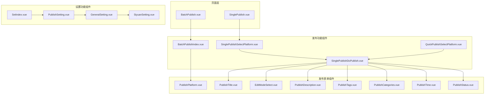
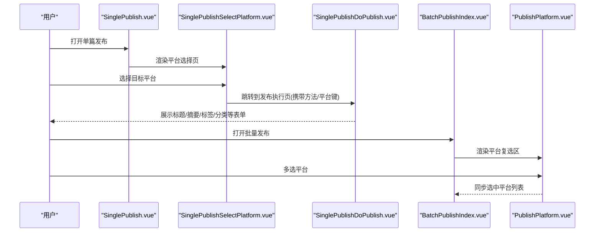
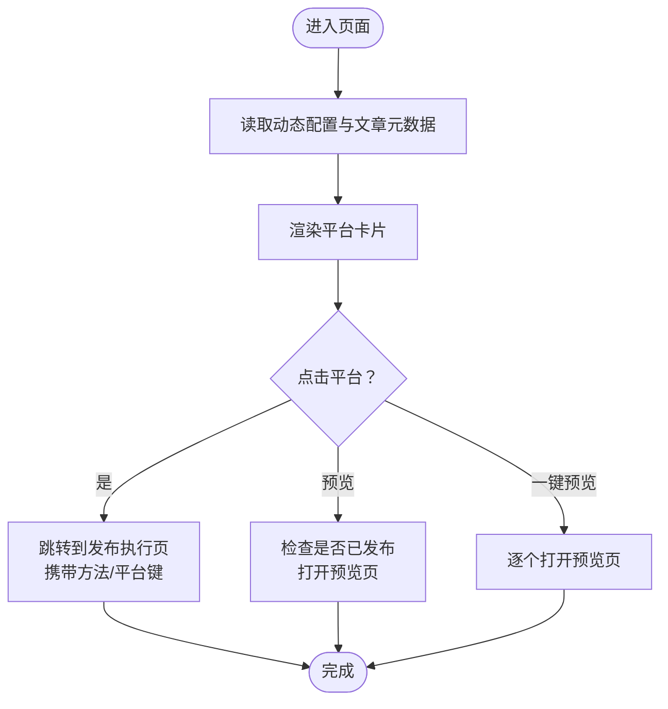
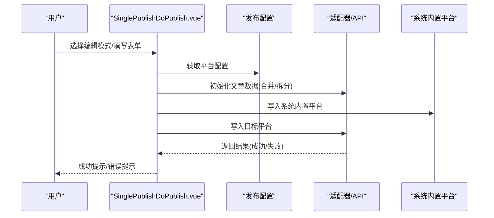
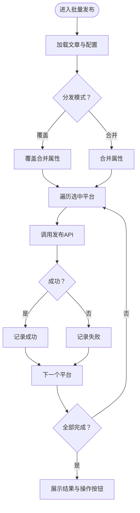
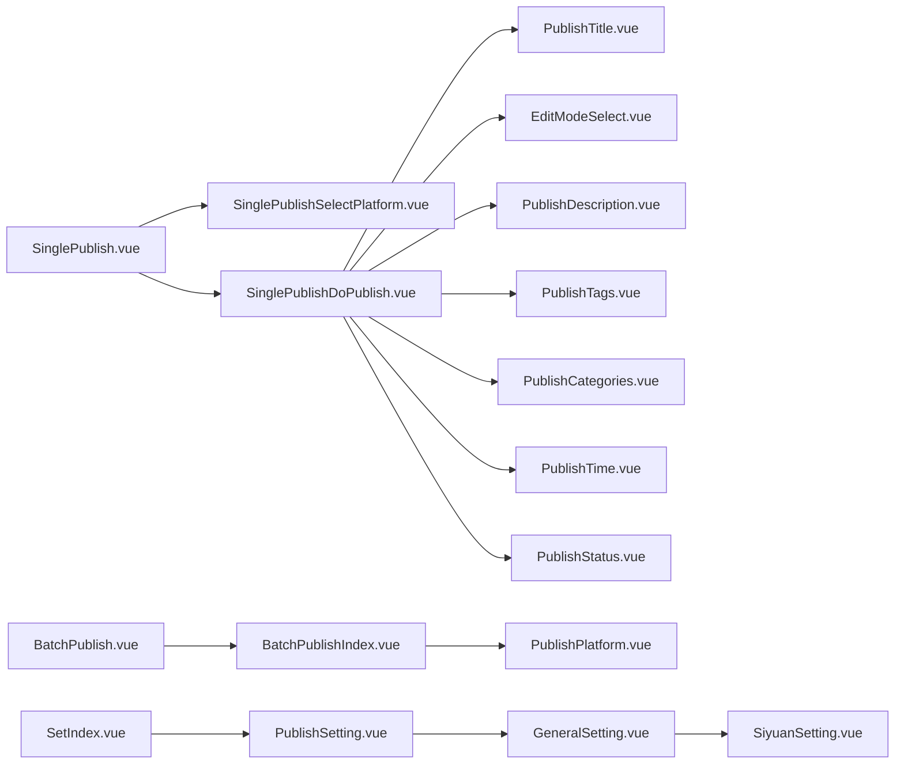

# 用户界面组件

<cite>
**本文引用的文件**
- [SinglePublishSelectPlatform.vue](file://src/components/publish/SinglePublishSelectPlatform.vue)
- [BatchPublishIndex.vue](file://src/components/publish/BatchPublishIndex.vue)
- [SinglePublishDoPublish.vue](file://src/components/publish/SinglePublishDoPublish.vue)
- [QuickPublishSelectPlatform.vue](file://src/components/publish/QuickPublishSelectPlatform.vue)
- [SinglePublish.vue](file://src/pages/SinglePublish.vue)
- [BatchPublish.vue](file://src/pages/BatchPublish.vue)
- [PublishPlatform.vue](file://src/components/publish/form/PublishPlatform.vue)
- [PublishTitle.vue](file://src/components/publish/form/PublishTitle.vue)
- [EditModeSelect.vue](file://src/components/publish/form/EditModeSelect.vue)
- [PublishDescription.vue](file://src/components/publish/form/PublishDescription.vue)
- [PublishTags.vue](file://src/components/publish/form/PublishTags.vue)
- [PublishCategories.vue](file://src/components/publish/form/PublishCategories.vue)
- [PublishTime.vue](file://src/components/publish/form/PublishTime.vue)
- [PublishStatus.vue](file://src/components/publish/form/PublishStatus.vue)
- [PublishSetting.vue](file://src/components/set/PublishSetting.vue)
- [SetIndex.vue](file://src/components/set/SetIndex.vue)
- [GeneralSetting.vue](file://src/components/set/GeneralSetting.vue)
- [SiyuanSetting.vue](file://src/components/set/SiyuanSetting.vue)
</cite>

## 目录
1. [简介](#简介)
2. [项目结构](#项目结构)
3. [核心组件](#核心组件)
4. [架构总览](#架构总览)
5. [详细组件分析](#详细组件分析)
6. [依赖关系分析](#依赖关系分析)
7. [性能考量](#性能考量)
8. [故障排查指南](#故障排查指南)
9. [结论](#结论)
10. [附录](#附录)

## 简介
本文件面向用户界面组件，系统性梳理 Vue 组件架构与发布/设置两大业务域的组件化设计。内容涵盖：
- 页面组件（路由级）、功能组件（业务流程）、表单组件（数据输入）的层次结构
- 发布相关组件：单篇发布、批量发布、极速发布、发布表单组件的设计与实现
- 设置相关组件：发布设置、平台配置、偏好设置、通用设置的组件化设计
- 组件通信机制、状态传递、事件处理最佳实践
- 样式设计规范、主题定制、响应式布局实现
- 组件使用示例与自定义扩展指南

## 项目结构
项目采用“页面组件 + 功能组件 + 表单组件”的分层组织方式，配合统一的适配器与存储层，形成清晰的职责边界。

图表来源
- [SinglePublish.vue:10-21](file://src/pages/SinglePublish.vue#L10-L21)
- [BatchPublish.vue:10-21](file://src/pages/BatchPublish.vue#L10-L21)
- [SinglePublishSelectPlatform.vue:10-149](file://src/components/publish/SinglePublishSelectPlatform.vue#L10-L149)
- [SinglePublishDoPublish.vue:10-461](file://src/components/publish/SinglePublishDoPublish.vue#L10-L461)
- [BatchPublishIndex.vue:10-354](file://src/components/publish/BatchPublishIndex.vue#L10-L354)
- [QuickPublishSelectPlatform.vue:10-149](file://src/components/publish/QuickPublishSelectPlatform.vue#L10-L149)
- [PublishPlatform.vue:10-85](file://src/components/publish/form/PublishPlatform.vue#L10-L85)
- [PublishTitle.vue:10-131](file://src/components/publish/form/PublishTitle.vue#L10-L131)
- [EditModeSelect.vue:10-69](file://src/components/publish/form/EditModeSelect.vue#L10-L69)
- [PublishDescription.vue:10-171](file://src/components/publish/form/PublishDescription.vue#L10-L171)
- [PublishTags.vue:10-269](file://src/components/publish/form/PublishTags.vue#L10-L269)
- [PublishCategories.vue:10-166](file://src/components/publish/form/PublishCategories.vue#L10-L166)
- [PublishTime.vue:10-64](file://src/components/publish/form/PublishTime.vue#L10-L64)
- [PublishStatus.vue:10-66](file://src/components/publish/form/PublishStatus.vue#L10-L66)
- [PublishSetting.vue:10-61](file://src/components/set/PublishSetting.vue#L10-L61)
- [SetIndex.vue:10-16](file://src/components/set/SetIndex.vue#L10-L16)
- [GeneralSetting.vue:10-42](file://src/components/set/GeneralSetting.vue#L10-L42)
- [SiyuanSetting.vue:10-39](file://src/components/set/SiyuanSetting.vue#L10-L39)

章节来源
- [SinglePublish.vue:10-21](file://src/pages/SinglePublish.vue#L10-L21)
- [BatchPublish.vue:10-21](file://src/pages/BatchPublish.vue#L10-L21)

## 核心组件
- 页面组件（路由级）
  - 单篇发布入口页：SinglePublish.vue
  - 批量发布入口页：BatchPublish.vue
- 发布功能组件
  - 单篇发布平台选择：SinglePublishSelectPlatform.vue
  - 单篇发布执行页：SinglePublishDoPublish.vue
  - 批量发布主控页：BatchPublishIndex.vue
  - 极速发布平台选择：QuickPublishSelectPlatform.vue
- 发布表单组件
  - 平台选择器：PublishPlatform.vue
  - 标题输入与AI生成：PublishTitle.vue
  - 编辑模式切换：EditModeSelect.vue
  - 摘要输入与AI生成：PublishDescription.vue
  - 标签输入与AI生成：PublishTags.vue
  - 分类输入与AI生成：PublishCategories.vue
  - 发布/更新时间：PublishTime.vue
  - 发布状态与密码：PublishStatus.vue
- 设置功能组件
  - 发布设置主面板：PublishSetting.vue
  - 设置入口聚合：SetIndex.vue
  - 通用设置：GeneralSetting.vue
  - 思源设置：SiyuanSetting.vue

章节来源
- [SinglePublish.vue:10-21](file://src/pages/SinglePublish.vue#L10-L21)
- [BatchPublish.vue:10-21](file://src/pages/BatchPublish.vue#L10-L21)
- [SinglePublishSelectPlatform.vue:10-149](file://src/components/publish/SinglePublishSelectPlatform.vue#L10-L149)
- [SinglePublishDoPublish.vue:10-461](file://src/components/publish/SinglePublishDoPublish.vue#L10-L461)
- [BatchPublishIndex.vue:10-354](file://src/components/publish/BatchPublishIndex.vue#L10-L354)
- [QuickPublishSelectPlatform.vue:10-149](file://src/components/publish/QuickPublishSelectPlatform.vue#L10-L149)
- [PublishPlatform.vue:10-85](file://src/components/publish/form/PublishPlatform.vue#L10-L85)
- [PublishTitle.vue:10-131](file://src/components/publish/form/PublishTitle.vue#L10-L131)
- [EditModeSelect.vue:10-69](file://src/components/publish/form/EditModeSelect.vue#L10-L69)
- [PublishDescription.vue:10-171](file://src/components/publish/form/PublishDescription.vue#L10-L171)
- [PublishTags.vue:10-269](file://src/components/publish/form/PublishTags.vue#L10-L269)
- [PublishCategories.vue:10-166](file://src/components/publish/form/PublishCategories.vue#L10-L166)
- [PublishTime.vue:10-64](file://src/components/publish/form/PublishTime.vue#L10-L64)
- [PublishStatus.vue:10-66](file://src/components/publish/form/PublishStatus.vue#L10-L66)
- [PublishSetting.vue:10-61](file://src/components/set/PublishSetting.vue#L10-L61)
- [SetIndex.vue:10-16](file://src/components/set/SetIndex.vue#L10-L16)
- [GeneralSetting.vue:10-42](file://src/components/set/GeneralSetting.vue#L10-L42)
- [SiyuanSetting.vue:10-39](file://src/components/set/SiyuanSetting.vue#L10-L39)

## 架构总览
发布与设置两条主线通过路由与组件协作完成端到端流程；表单组件以“双向绑定 + emit 事件”实现与父组件的状态同步；页面组件负责参数解析与导航；功能组件负责具体业务逻辑与适配器调用。

图表来源
- [SinglePublish.vue:10-21](file://src/pages/SinglePublish.vue#L10-L21)
- [SinglePublishSelectPlatform.vue:62-122](file://src/components/publish/SinglePublishSelectPlatform.vue#L62-L122)
- [SinglePublishDoPublish.vue:104-147](file://src/components/publish/SinglePublishDoPublish.vue#L104-L147)
- [BatchPublish.vue:10-21](file://src/pages/BatchPublish.vue#L10-L21)
- [BatchPublishIndex.vue:104-177](file://src/components/publish/BatchPublishIndex.vue#L104-L177)
- [PublishPlatform.vue:49-62](file://src/components/publish/form/PublishPlatform.vue#L49-L62)

## 详细组件分析

### 页面组件
- SinglePublish.vue
  - 作用：路由入口，接收 pageId 或 widgetId，渲染单篇发布平台选择组件
  - 关键点：读取路由 query 或 widget 工具函数获取 id，透传给子组件
- BatchPublish.vue
  - 作用：路由入口，接收 pageId 或 widgetId，渲染批量发布主控组件
  - 关键点：与单篇一致，透传 id

章节来源
- [SinglePublish.vue:10-21](file://src/pages/SinglePublish.vue#L10-L21)
- [BatchPublish.vue:10-21](file://src/pages/BatchPublish.vue#L10-L21)

### 发布功能组件

#### 单篇发布平台选择（SinglePublishSelectPlatform.vue）
- 作用：列出已启用且已授权的平台，支持一键预览；根据是否已发布显示不同状态
- 数据流：
  - 初始化：读取动态配置、文章元数据、文章标题
  - 交互：点击平台卡片进入发布执行页；点击预览打开平台预览页
- 事件与状态：
  - 通过路由 query 传递 showBack、method 等参数
  - 使用计时器组件显示加载耗时

图表来源
- [SinglePublishSelectPlatform.vue:62-122](file://src/components/publish/SinglePublishSelectPlatform.vue#L62-L122)
- [SinglePublishSelectPlatform.vue:124-149](file://src/components/publish/SinglePublishSelectPlatform.vue#L124-L149)

章节来源
- [SinglePublishSelectPlatform.vue:10-149](file://src/components/publish/SinglePublishSelectPlatform.vue#L10-L149)

#### 单篇发布执行（SinglePublishDoPublish.vue）
- 作用：针对单个平台进行发布/更新/删除，支持系统内置平台与自定义平台
- 数据流：
  - 初始化：调用初始化方法合并/拆分文章数据，注入标签/分类/知识空间等元数据
  - 发布：先写入系统内置平台，再写入目标平台；支持强制删除与属性同步
  - 删除：弹窗确认后执行删除或强制解除关联
- 事件与状态：
  - 编辑模式切换、标题/摘要/标签/分类/时间/状态变更均通过 emit 同步父组件
  - 支持 AI 开关与标题/摘要/标签/分类的 AI 生成

图表来源
- [SinglePublishDoPublish.vue:104-147](file://src/components/publish/SinglePublishDoPublish.vue#L104-L147)
- [SinglePublishDoPublish.vue:358-461](file://src/components/publish/SinglePublishDoPublish.vue#L358-L461)

章节来源
- [SinglePublishDoPublish.vue:10-461](file://src/components/publish/SinglePublishDoPublish.vue#L10-L461)

#### 批量发布主控（BatchPublishIndex.vue）
- 作用：对一篇文章批量分发到多个平台，支持覆盖/合并两种分发模式
- 数据流：
  - 初始化：读取文章与发布配置，初始化文章元数据
  - 发布：遍历选中平台，按模式合并/覆盖属性后逐一发布
  - 删除：对非系统内置平台执行删除，支持强制解除关联
  - 结果：汇总成功/失败列表，提供刷新与强制解除关联入口
- 事件与状态：
  - 平台选择器通过 emit 同步选中列表
  - 标题/摘要/标签/分类/时间等通过 emit 同步到合并后的文章对象

图表来源
- [BatchPublishIndex.vue:104-177](file://src/components/publish/BatchPublishIndex.vue#L104-L177)
- [BatchPublishIndex.vue:198-251](file://src/components/publish/BatchPublishIndex.vue#L198-L251)
- [BatchPublishIndex.vue:333-354](file://src/components/publish/BatchPublishIndex.vue#L333-L354)

章节来源
- [BatchPublishIndex.vue:10-354](file://src/components/publish/BatchPublishIndex.vue#L10-L354)

#### 极速发布平台选择（QuickPublishSelectPlatform.vue）
- 作用：与单篇发布类似，但跳转到 Worker 极速发布流程，适合快速分发
- 数据流：同单篇平台选择，差异在于路由跳转至 workers/quickPublish

章节来源
- [QuickPublishSelectPlatform.vue:10-149](file://src/components/publish/QuickPublishSelectPlatform.vue#L10-L149)

### 发布表单组件

#### 平台选择器（PublishPlatform.vue）
- 作用：展示已启用且已授权的平台，支持勾选/取消，回填已发布平台
- 事件：emitSyncDynList 将选中平台列表同步给父组件
- 交互：点击图标切换选中状态，tooltip 展示平台名称

章节来源
- [PublishPlatform.vue:10-85](file://src/components/publish/form/PublishPlatform.vue#L10-L85)

#### 标题组件（PublishTitle.vue）
- 作用：输入文章标题，支持基于 AI 的标题生成
- 事件：emitSyncPublishTitle 同步标题变化
- AI：通过 ChatGPT 生成标题，错误时提示配置问题

章节来源
- [PublishTitle.vue:10-131](file://src/components/publish/form/PublishTitle.vue#L10-L131)

#### 编辑模式选择（EditModeSelect.vue）
- 作用：切换简单/复杂/源码三种编辑模式
- 事件：emitSyncEditMode 同步模式变化

章节来源
- [EditModeSelect.vue:10-69](file://src/components/publish/form/EditModeSelect.vue#L10-L69)

#### 摘要组件（PublishDescription.vue）
- 作用：输入文章摘要，支持基于 AI 的摘要生成（流式/非流式）
- 事件：emitSyncDesc 同步摘要变化
- AI：通过 ChatGPT 生成摘要，错误时提示配置问题

章节来源
- [PublishDescription.vue:10-171](file://src/components/publish/form/PublishDescription.vue#L10-L171)

#### 标签组件（PublishTags.vue）
- 作用：维护文章标签，支持输入/选择/平台标签树、AI 生成
- 事件：emitSyncTags 同步标签变化
- AI：通过 ChatGPT 生成标签，错误时提示配置问题
- 平台标签：从适配器拉取平台标签树用于选择

章节来源
- [PublishTags.vue:10-269](file://src/components/publish/form/PublishTags.vue#L10-L269)

#### 分类组件（PublishCategories.vue）
- 作用：维护文章分类，支持多分类与 AI 生成
- 事件：emitSyncCates 同步分类变化
- AI：通过 ChatGPT 生成分类建议，错误时提示配置问题

章节来源
- [PublishCategories.vue:10-166](file://src/components/publish/form/PublishCategories.vue#L10-L166)

#### 时间组件（PublishTime.vue）
- 作用：设置创建/更新时间
- 事件：emitSyncPublishTime 同步时间变化

章节来源
- [PublishTime.vue:10-64](file://src/components/publish/form/PublishTime.vue#L10-L64)

#### 状态组件（PublishStatus.vue）
- 作用：设置发布状态（公开/草稿/私密）与密码
- 事件：emitSyncPublishStatus 同步状态与密码

章节来源
- [PublishStatus.vue:10-66](file://src/components/publish/form/PublishStatus.vue#L10-L66)

### 设置功能组件

#### 发布设置主面板（PublishSetting.vue）
- 作用：发布设置主入口，包含平台列表、导入、商店三个 Tab
- 交互：通过子组件承载具体设置项

章节来源
- [PublishSetting.vue:10-61](file://src/components/set/PublishSetting.vue#L10-L61)

#### 设置入口聚合（SetIndex.vue）
- 作用：聚合设置入口，当前直接渲染发布设置

章节来源
- [SetIndex.vue:10-16](file://src/components/set/SetIndex.vue#L10-L16)

#### 通用设置（GeneralSetting.vue）
- 作用：通用设置聚合，包含偏好设置、AI 设置、思源设置、语言选择、文章绑定
- 交互：左侧标签页切换

章节来源
- [GeneralSetting.vue:10-42](file://src/components/set/GeneralSetting.vue#L10-L42)

#### 思源设置（SiyuanSetting.vue）
- 作用：展示与编辑思源 API 地址与密码
- 交互：表单双向绑定

章节来源
- [SiyuanSetting.vue:10-39](file://src/components/set/SiyuanSetting.vue#L10-L39)

## 依赖关系分析
- 组件耦合
  - 页面组件仅负责参数透传与路由跳转，低耦合
  - 功能组件通过 emit 与表单组件解耦，便于复用
  - 表单组件通过 props 与 emit 实现单向数据流与事件上行
- 外部依赖
  - 适配器层：统一平台 API 调用（如 getTags、getPosts 等）
  - 存储层：发布设置、偏好设置、平台元数据等
  - UI 库：Element Plus 组件与图标
- 可能的循环依赖
  - 当前结构以“页面 -> 功能 -> 表单”单向依赖为主，未见明显循环

图表来源
- [SinglePublish.vue:10-21](file://src/pages/SinglePublish.vue#L10-L21)
- [BatchPublish.vue:10-21](file://src/pages/BatchPublish.vue#L10-L21)
- [SinglePublishSelectPlatform.vue:10-149](file://src/components/publish/SinglePublishSelectPlatform.vue#L10-L149)
- [SinglePublishDoPublish.vue:10-461](file://src/components/publish/SinglePublishDoPublish.vue#L10-L461)
- [BatchPublishIndex.vue:10-354](file://src/components/publish/BatchPublishIndex.vue#L10-L354)
- [PublishPlatform.vue:10-85](file://src/components/publish/form/PublishPlatform.vue#L10-L85)
- [PublishTitle.vue:10-131](file://src/components/publish/form/PublishTitle.vue#L10-L131)
- [EditModeSelect.vue:10-69](file://src/components/publish/form/EditModeSelect.vue#L10-L69)
- [PublishDescription.vue:10-171](file://src/components/publish/form/PublishDescription.vue#L10-L171)
- [PublishTags.vue:10-269](file://src/components/publish/form/PublishTags.vue#L10-L269)
- [PublishCategories.vue:10-166](file://src/components/publish/form/PublishCategories.vue#L10-L166)
- [PublishTime.vue:10-64](file://src/components/publish/form/PublishTime.vue#L10-L64)
- [PublishStatus.vue:10-66](file://src/components/publish/form/PublishStatus.vue#L10-L66)
- [SetIndex.vue:10-16](file://src/components/set/SetIndex.vue#L10-L16)
- [PublishSetting.vue:10-61](file://src/components/set/PublishSetting.vue#L10-L61)
- [GeneralSetting.vue:10-42](file://src/components/set/GeneralSetting.vue#L10-L42)
- [SiyuanSetting.vue:10-39](file://src/components/set/SiyuanSetting.vue#L10-L39)

## 性能考量
- 渲染优化
  - 使用骨架屏与计时器组件提升首屏体验与感知性能
  - 表单组件按需渲染（复杂模式/源码模式），减少 DOM 体积
- 异步与并发
  - 批量发布采用顺序遍历，避免平台间冲突；如需提升吞吐，可在保证幂等的前提下引入并发控制
- 网络与缓存
  - 平台标签等静态数据一次性拉取并缓存，减少重复请求
- UI 交互
  - 预览与删除等高风险操作使用二次确认，避免误操作带来的重试成本

## 故障排查指南
- 发布失败
  - 查看批量发布结果区域的错误统计与逐条错误信息，必要时使用“强制解除关联”
  - 单篇发布失败时查看顶部错误提示与日志输出
- 配置缺失
  - AI 生成失败通常提示“请在偏好设置配置请求地址和ChatGPT key”，检查通用设置中的 AI 配置
- 预览异常
  - 若一键预览无响应，检查各平台是否已发布；未发布平台不会产生预览链接
- 删除失败
  - 系统内置平台不可删除，会自动跳过；非内置平台删除失败时可使用“强制解除关联”

章节来源
- [BatchPublishIndex.vue:166-177](file://src/components/publish/BatchPublishIndex.vue#L166-L177)
- [BatchPublishIndex.vue:198-251](file://src/components/publish/BatchPublishIndex.vue#L198-L251)
- [SinglePublishDoPublish.vue:139-147](file://src/components/publish/SinglePublishDoPublish.vue#L139-L147)
- [PublishTags.vue:140-147](file://src/components/publish/form/PublishTags.vue#L140-L147)
- [PublishDescription.vue:106-113](file://src/components/publish/form/PublishDescription.vue#L106-L113)
- [PublishTitle.vue:93-100](file://src/components/publish/form/PublishTitle.vue#L93-L100)

## 结论
该组件体系以“页面组件 + 功能组件 + 表单组件”三层结构清晰划分职责，配合统一的事件与状态管理模式，实现了发布与设置两大业务域的高内聚、低耦合。通过标准化的表单组件与平台适配器，具备良好的扩展性与可维护性。

## 附录

### 组件通信机制与最佳实践
- 父子通信
  - 使用 v-model 与 emit 实现双向绑定与事件上行，保持单向数据流
  - 对于复杂对象（如 Post），建议使用深拷贝与浅拷贝结合策略，避免意外共享引用
- 事件命名
  - 统一以 emitSyncXxx 命名，语义明确，便于调试与维护
- 参数传递
  - 页面组件仅透传 id/路由参数，功能组件内部负责业务参数组装
- 错误处理
  - 统一使用消息框与日志记录，失败时保留 actionEnable 禁用态，防止重复提交
- 性能优化
  - 对高频交互（如输入框）使用防抖/节流；对静态数据使用缓存；对大列表使用虚拟滚动（如后续扩展）

### 样式设计规范与主题定制
- 设计语言
  - 使用 Element Plus 组件库，遵循其视觉规范与交互约定
- 主题定制
  - 通过 CSS 变量覆盖 --el-color-primary 等关键变量，实现主题色统一
  - Stylus 中使用变量集中管理尺寸、间距与字体大小
- 响应式布局
  - 使用 Element Plus Grid 响应式断点（xs/sm/md/lg/xl），确保移动端友好
  - 卡片与列表在小屏设备上适当调整列数与间距

### 使用示例与扩展指南
- 快速接入新平台
  - 在动态配置中新增平台项，确保 isEnabled 与 isAuth 为 true
  - 在适配器层实现必要的 API 方法（如 getTags、getPosts 等）
  - 在发布表单组件中按需扩展字段（如标签别名、知识空间等）
- 自定义表单组件
  - 遵循 v-model 与 emitSyncXxx 的约定，确保与父组件兼容
  - 对外部依赖（如 AI）做好降级与容错处理
- 扩展发布流程
  - 在功能组件中增加前置/后置钩子，实现审计、校验或通知
  - 对批量发布增加并发控制与重试策略，提升稳定性