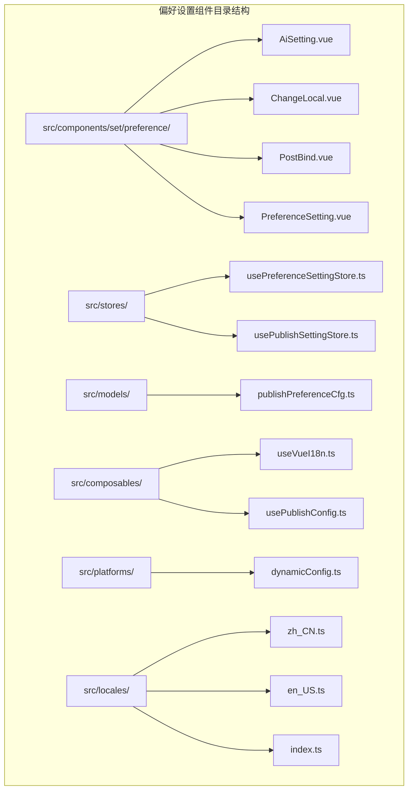
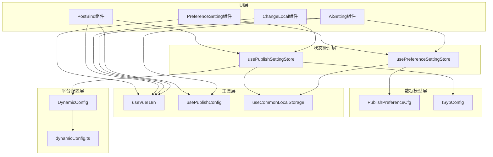
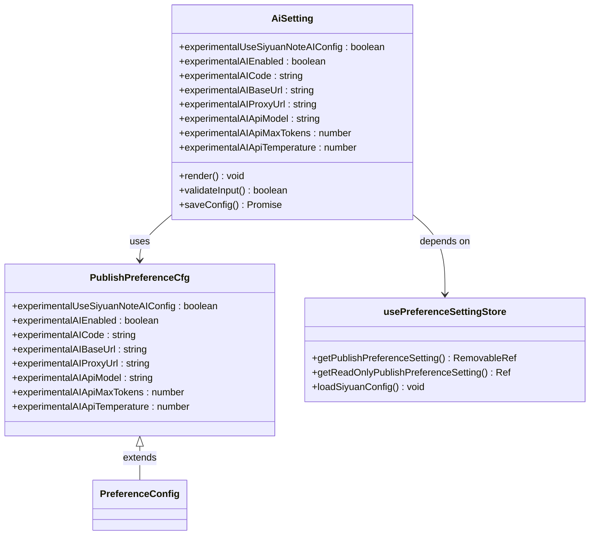
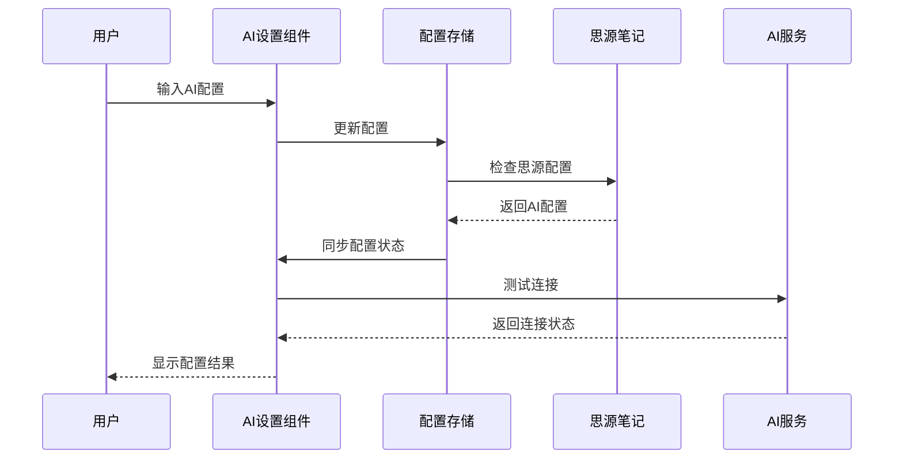
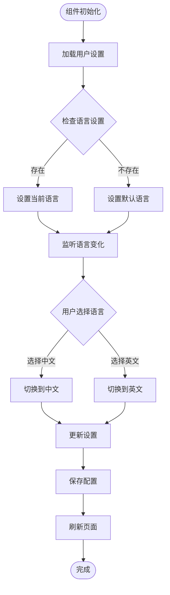
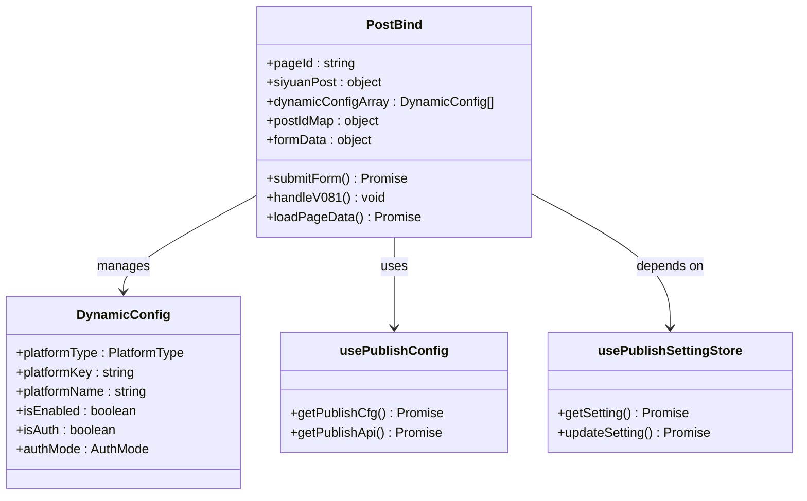
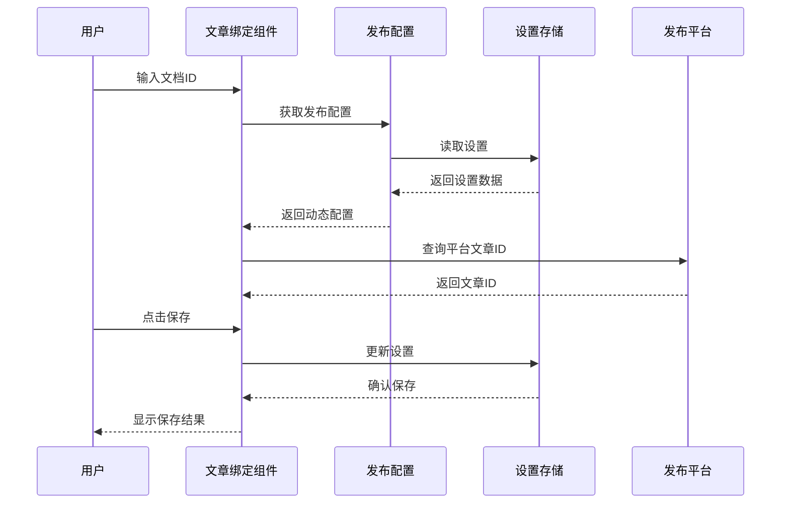
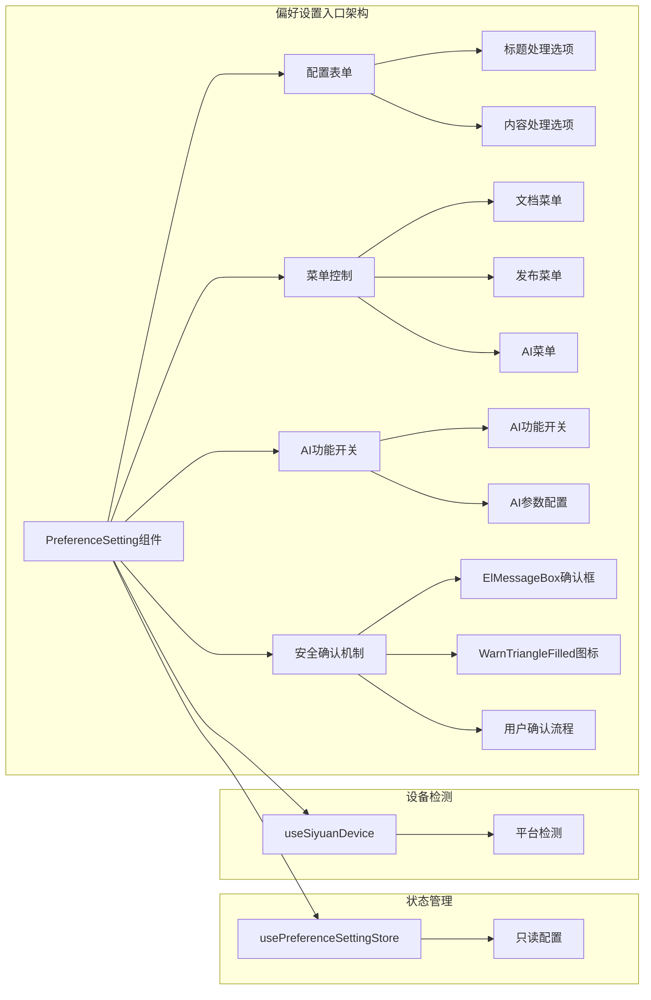
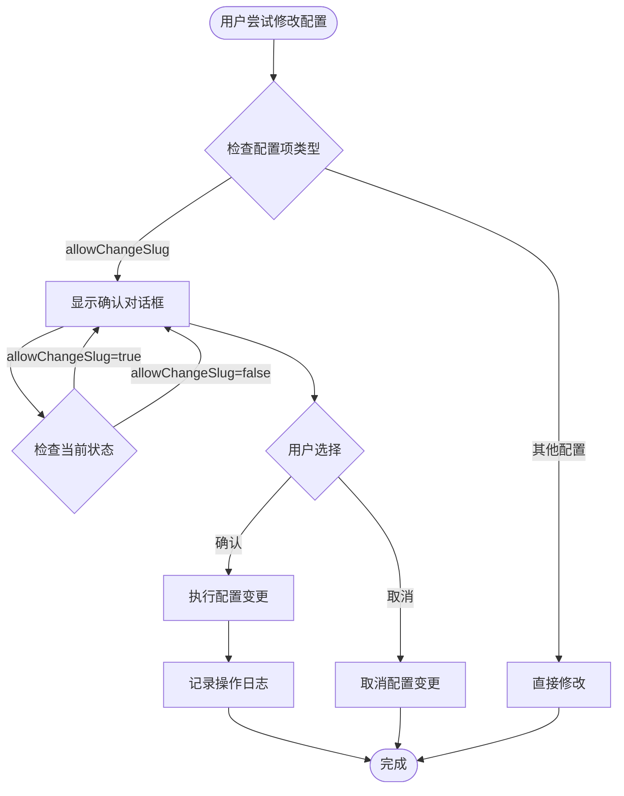

# 偏好设置组件

<cite>
**本文档引用的文件**
- [AiSetting.vue](file://src/components/set/preference/AiSetting.vue)
- [ChangeLocal.vue](file://src/components/set/preference/ChangeLocal.vue)
- [PostBind.vue](file://src/components/set/preference/PostBind.vue)
- [PreferenceSetting.vue](file://src/components/set/preference/PreferenceSetting.vue)
- [usePreferenceSettingStore.ts](file://src/stores/usePreferenceSettingStore.ts)
- [usePublishSettingStore.ts](file://src/stores/usePublishSettingStore.ts)
- [publishPreferenceCfg.ts](file://src/models/publishPreferenceCfg.ts)
- [useVueI18n.ts](file://src/composables/useVueI18n.ts)
- [useCommonLocalStorage.ts](file://src/stores/common/useCommonLocalStorage.ts)
- [usePublishConfig.ts](file://src/composables/usePublishConfig.ts)
- [dynamicConfig.ts](file://src/platforms/dynamicConfig.ts)
- [zh_CN.ts](file://src/locales/zh_CN.ts)
- [en_US.ts](file://src/locales/en_US.ts)
- [index.ts](file://src/locales/index.ts)
- [syp.config.ts](file://syp.config.ts)
</cite>

## 更新摘要
**变更内容**
- 更新了PreferenceSetting组件的安全确认功能增强
- 新增了allowChangeSlug配置项的确认提示机制
- 增强了用户操作的安全性和体验保障

## 目录
1. [简介](#简介)
2. [项目结构](#项目结构)
3. [核心组件](#核心组件)
4. [架构概览](#架构概览)
5. [详细组件分析](#详细组件分析)
6. [依赖关系分析](#依赖关系分析)
7. [性能考虑](#性能考虑)
8. [故障排除指南](#故障排除指南)
9. [结论](#结论)

## 简介

偏好设置组件是思源发布器插件中的核心配置模块，负责管理用户的各种偏好设置和系统配置。该组件集成了AI功能配置、语言切换、文章绑定等多个重要功能，为用户提供了一站式的配置管理体验。

该组件采用现代化的Vue 3 Composition API设计，结合Pinia状态管理和Element Plus UI组件库，实现了响应式的数据绑定和直观的用户界面。系统支持多语言切换、配置持久化、实时同步等功能，确保用户能够在不同环境下获得一致的使用体验。

**更新** 偏好设置组件在最近的更新中增强了安全性，特别是针对关键配置项增加了确认提示功能，提升了用户体验和操作安全性。

## 项目结构

偏好设置组件位于项目的 `src/components/set/preference/` 目录下，包含四个核心组件：



**图表来源**
- [AiSetting.vue:1-121](file://src/components/set/preference/AiSetting.vue#L1-L121)
- [ChangeLocal.vue:1-60](file://src/components/set/preference/ChangeLocal.vue#L1-L60)
- [PostBind.vue:1-168](file://src/components/set/preference/PostBind.vue#L1-L168)
- [PreferenceSetting.vue:1-123](file://src/components/set/preference/PreferenceSetting.vue#L1-L123)

**章节来源**
- [AiSetting.vue:1-121](file://src/components/set/preference/AiSetting.vue#L1-L121)
- [ChangeLocal.vue:1-60](file://src/components/set/preference/ChangeLocal.vue#L1-L60)
- [PostBind.vue:1-168](file://src/components/set/preference/PostBind.vue#L1-L168)
- [PreferenceSetting.vue:1-123](file://src/components/set/preference/PreferenceSetting.vue#L1-L123)

## 核心组件

### AI设置组件 (AiSetting)

AI设置组件提供了完整的AI功能配置界面，支持多种AI服务提供商的参数配置。该组件通过响应式数据绑定，实现了与底层配置存储的实时同步。

主要功能特性：
- API密钥安全输入（密码模式）
- API基础地址配置
- 代理服务器设置
- 模型参数配置（温度、最大Token数等）
- 思源笔记AI配置集成

### 语言切换组件 (ChangeLocal)

语言切换组件实现了多语言支持的核心功能，允许用户在简体中文和英文之间进行切换。该组件通过Vue I18n实现国际化，并将用户的选择持久化到配置存储中。

核心功能：
- 语言选项下拉选择
- 实时语言切换
- 配置持久化
- 国际化消息支持

### 文章绑定组件 (PostBind)

文章绑定组件负责管理思源文档与各发布平台之间的映射关系。该组件能够自动检测文档ID并维护平台特定的文章ID映射。

主要功能：
- 文档ID自动检测
- 平台文章ID映射
- 动态配置管理
- 数据修复功能

### 偏好设置入口 (PreferenceSetting)

偏好设置入口组件提供了系统级别的偏好设置管理界面，包含了各种影响发布行为的配置选项。

**更新** 偏好设置入口组件新增了安全确认机制，特别是针对allowChangeSlug配置项增加了确认提示功能，确保用户在进行可能产生风险的操作前得到明确的确认。

功能特点：
- 标题处理选项
- 菜单显示控制
- AI功能开关
- 快捷操作配置
- **安全确认机制** - 关键配置项变更前的用户确认

**章节来源**
- [AiSetting.vue:10-98](file://src/components/set/preference/AiSetting.vue#L10-L98)
- [ChangeLocal.vue:10-59](file://src/components/set/preference/ChangeLocal.vue#L10-L59)
- [PostBind.vue:10-157](file://src/components/set/preference/PostBind.vue#L10-L157)
- [PreferenceSetting.vue:11-123](file://src/components/set/preference/PreferenceSetting.vue#L11-L123)

## 架构概览

偏好设置系统的整体架构采用了分层设计模式，确保了组件间的松耦合和高内聚。



**图表来源**
- [usePreferenceSettingStore.ts:21-86](file://src/stores/usePreferenceSettingStore.ts#L21-L86)
- [usePublishSettingStore.ts:21-93](file://src/stores/usePublishSettingStore.ts#L21-L93)
- [publishPreferenceCfg.ts:19-97](file://src/models/publishPreferenceCfg.ts#L19-L97)
- [syp.config.ts:28-44](file://syp.config.ts#L28-L44)

### 设计模式应用

系统采用了多种设计模式来确保代码的可维护性和扩展性：

1. **组合式API模式**：使用Vue 3的Composition API实现逻辑复用
2. **存储模式**：通过Pinia实现状态管理
3. **适配器模式**：支持多种AI服务提供商
4. **工厂模式**：动态创建平台配置
5. **观察者模式**：实现配置变更的实时响应
6. ****安全确认模式** - 关键操作前的用户确认机制

**章节来源**
- [usePreferenceSettingStore.ts:1-90](file://src/stores/usePreferenceSettingStore.ts#L1-L90)
- [usePublishSettingStore.ts:1-95](file://src/stores/usePublishSettingStore.ts#L1-L95)

## 详细组件分析

### AI设置组件深度分析

AI设置组件是整个偏好设置系统中最复杂的组件之一，它提供了丰富的AI功能配置选项。



**图表来源**
- [AiSetting.vue:10-17](file://src/components/set/preference/AiSetting.vue#L10-L17)
- [publishPreferenceCfg.ts:19-97](file://src/models/publishPreferenceCfg.ts#L19-L97)
- [usePreferenceSettingStore.ts:34-66](file://src/stores/usePreferenceSettingStore.ts#L34-L66)

#### AI配置流程



**图表来源**
- [AiSetting.vue:23-94](file://src/components/set/preference/AiSetting.vue#L23-L94)
- [usePreferenceSettingStore.ts:40-57](file://src/stores/usePreferenceSettingStore.ts#L40-L57)

**章节来源**
- [AiSetting.vue:10-98](file://src/components/set/preference/AiSetting.vue#L10-L98)
- [publishPreferenceCfg.ts:19-97](file://src/models/publishPreferenceCfg.ts#L19-L97)

### 语言切换机制分析

ChangeLocal组件实现了完整的多语言切换功能，支持简体中文和英文的无缝切换。



**图表来源**
- [ChangeLocal.vue:30-37](file://src/components/set/preference/ChangeLocal.vue#L30-L37)
- [useVueI18n.ts:16-25](file://src/composables/useVueI18n.ts#L16-L25)

#### 语言切换实现细节

语言切换功能通过以下步骤实现：

1. **配置加载**：从设置存储中读取当前语言配置
2. **默认值处理**：如果没有设置，则使用默认语言
3. **实时切换**：通过Vue响应式系统实现实时语言切换
4. **持久化保存**：将用户选择的语言设置保存到配置存储中

**章节来源**
- [ChangeLocal.vue:10-59](file://src/components/set/preference/ChangeLocal.vue#L10-L59)
- [useVueI18n.ts:16-25](file://src/composables/useVueI18n.ts#L16-L25)

### 文章绑定功能分析

PostBind组件提供了强大的文章绑定功能，能够管理思源文档与各发布平台之间的映射关系。



**图表来源**
- [PostBind.vue:35-43](file://src/components/set/preference/PostBind.vue#L35-L43)
- [dynamicConfig.ts:13-113](file://src/platforms/dynamicConfig.ts#L13-L113)
- [usePublishConfig.ts:36-64](file://src/composables/usePublishConfig.ts#L36-L64)

#### 文章绑定工作流程



**图表来源**
- [PostBind.vue:54-82](file://src/components/set/preference/PostBind.vue#L54-L82)
- [usePublishConfig.ts:36-64](file://src/composables/usePublishConfig.ts#L36-L64)

**章节来源**
- [PostBind.vue:10-157](file://src/components/set/preference/PostBind.vue#L10-L157)
- [dynamicConfig.ts:13-113](file://src/platforms/dynamicConfig.ts#L13-L113)

### 偏好设置入口设计模式

PreferenceSetting组件作为偏好设置的统一入口，采用了设计模式来确保代码的可维护性和扩展性。

**更新** 偏好设置入口组件新增了安全确认机制，通过before-change钩子和ElMessageBox实现关键配置项的用户确认功能。



**图表来源**
- [PreferenceSetting.vue:27-105](file://src/components/set/preference/PreferenceSetting.vue#L27-L105)
- [usePreferenceSettingStore.ts:77-81](file://src/stores/usePreferenceSettingStore.ts#L77-L81)

#### 配置验证机制

**更新** PreferenceSetting组件实现了智能的配置验证机制，特别针对allowChangeSlug配置项增加了安全确认功能：

1. **条件验证**：某些配置变更需要用户确认
2. **状态检查**：检查当前配置状态
3. **用户确认**：通过ElMessageBox对话框获取用户同意
4. **安全变更**：只有在确认后才执行配置变更
5. **错误类型**：使用error类型的确认框和警告三角形图标

**章节来源**
- [PreferenceSetting.vue:30-48](file://src/components/set/preference/PreferenceSetting.vue#L30-L48)

### 安全确认机制详细分析

**新增** 偏好设置组件新增了全面的安全确认机制，确保用户在进行可能产生风险的操作前得到明确的确认。



**图表来源**
- [PreferenceSetting.vue:34-48](file://src/components/set/preference/PreferenceSetting.vue#L34-L48)

#### 安全确认实现细节

安全确认机制通过以下步骤实现：

1. **配置监听**：使用Element Plus的`before-change`钩子监听配置项变更
2. **状态检查**：检查目标配置项的当前状态
3. **确认对话框**：使用ElMessageBox显示确认对话框
4. **用户交互**：提供确认和取消按钮
5. **操作执行**：根据用户选择执行相应的操作
6. **日志记录**：记录确认结果用于调试和审计

**章节来源**
- [PreferenceSetting.vue:12-13](file://src/components/set/preference/PreferenceSetting.vue#L12-L13)
- [PreferenceSetting.vue:30-48](file://src/components/set/preference/PreferenceSetting.vue#L30-L48)

## 依赖关系分析

偏好设置组件的依赖关系体现了清晰的分层架构设计。

```mermaid
graph TB
subgraph "外部依赖"
A[Vue 3]
B[Element Plus]
C[Pinia]
D[Vue I18n]
E[@vueuse/core]
end
subgraph "内部模块"
F[AiSetting]
G[ChangeLocal]
H[PostBind]
I[PreferenceSetting]
J[usePreferenceSettingStore]
K[usePublishSettingStore]
L[useVueI18n]
M[usePublishConfig]
N[PublishPreferenceCfg]
O[DynamicConfig]
end
F --> A
G --> A
H --> A
I --> A
F --> B
G --> B
H --> B
I --> B
F --> C
G --> C
H --> C
I --> C
F --> D
G --> D
H --> D
I --> D
F --> E
G --> E
H --> E
I --> E
F --> J
G --> K
H --> K
I --> J
F --> L
G --> L
H --> L
I --> L
F --> M
H --> M
J --> N
K --> O
```

**图表来源**
- [AiSetting.vue:11-15](file://src/components/set/preference/AiSetting.vue#L11-L15)
- [ChangeLocal.vue:12-18](file://src/components/set/preference/ChangeLocal.vue#L12-L18)
- [PostBind.vue:13-23](file://src/components/set/preference/PostBind.vue#L13-L23)
- [PreferenceSetting.vue:12-25](file://src/components/set/preference/PreferenceSetting.vue#L12-L25)

### 数据持久化策略

系统采用了多层次的数据持久化策略：

1. **本地存储**：使用JsonStorage在思源环境中保存配置
2. **浏览器存储**：在浏览器环境中使用localStorage
3. **配置迁移**：支持旧版本配置到新版本的自动迁移
4. **数据备份**：提供配置导入导出功能

**章节来源**
- [useCommonLocalStorage.ts:27-55](file://src/stores/common/useCommonLocalStorage.ts#L27-L55)
- [usePublishSettingStore.ts:21-60](file://src/stores/usePublishSettingStore.ts#L21-L60)

## 性能考虑

偏好设置组件在设计时充分考虑了性能优化：

### 响应式优化
- 使用Vue 3的Composition API减少不必要的重渲染
- 采用懒加载策略，按需加载配置数据
- 实现防抖机制，避免频繁的配置更新

### 内存管理
- 合理使用Ref和Reactive，避免内存泄漏
- 及时清理事件监听器和定时器
- 优化大对象的深拷贝操作

### 网络优化
- 缓存配置数据，减少重复请求
- 实现配置验证的异步处理
- 优化国际化消息的加载

### **安全确认性能优化**
**新增** 安全确认机制采用了异步处理方式，确保不会阻塞用户界面：

- 使用async/await实现非阻塞的确认对话框
- 仅在用户尝试修改关键配置时触发确认
- 通过before-change钩子实现条件触发
- 使用markRaw包装图标组件避免不必要的响应式转换

## 故障排除指南

### 常见问题及解决方案

**AI配置问题**
- 检查API密钥的有效性
- 验证API基础地址的可达性
- 确认代理设置的正确性

**语言切换问题**
- 检查浏览器的Cookie设置
- 验证配置存储的可写性
- 确认i18n配置的完整性

**文章绑定问题**
- 验证文档ID的正确性
- 检查平台认证状态
- 确认网络连接的稳定性

**配置同步问题**
- 检查存储权限设置
- 验证配置格式的正确性
- 确认版本兼容性

**安全确认问题**
**新增** 处理安全确认机制相关问题：
- 检查ElMessageBox组件的导入和配置
- 验证国际化消息的正确加载
- 确认before-change钩子的正确绑定
- 检查用户确认对话框的显示和交互

**章节来源**
- [AiSetting.vue:91-94](file://src/components/set/preference/AiSetting.vue#L91-L94)
- [ChangeLocal.vue:32-37](file://src/components/set/preference/ChangeLocal.vue#L32-L37)
- [PostBind.vue:78-81](file://src/components/set/preference/PostBind.vue#L78-L81)
- [PreferenceSetting.vue:34-48](file://src/components/set/preference/PreferenceSetting.vue#L34-L48)

## 结论

偏好设置组件通过精心设计的架构和实现，为用户提供了强大而灵活的配置管理功能。该组件不仅满足了基本的配置需求，还通过智能化的设计提供了良好的用户体验。

**更新** 最新的更新显著增强了系统的安全性和用户体验，特别是通过新增的安全确认机制，确保用户在进行可能产生风险的操作前得到明确的确认。

系统的主要优势包括：

1. **模块化设计**：清晰的组件分离和职责划分
2. **响应式架构**：基于Vue 3的现代前端技术栈
3. **多语言支持**：完整的国际化解决方案
4. **配置持久化**：可靠的本地存储机制
5. **扩展性强**：易于添加新的配置选项和平台支持
6. ****安全确认机制** - 关键操作前的用户确认，提升系统安全性

未来的发展方向包括：
- 增强AI功能的配置选项
- 优化性能表现
- 扩展更多的发布平台支持
- 改善用户体验和界面设计
- **扩展安全确认机制到更多关键配置项**

通过持续的优化和改进，偏好设置组件将继续为用户提供优秀的配置管理体验，同时确保操作的安全性和可靠性。