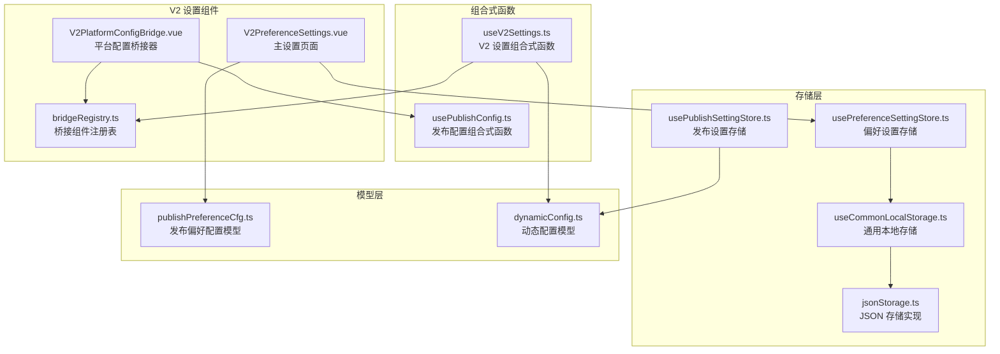
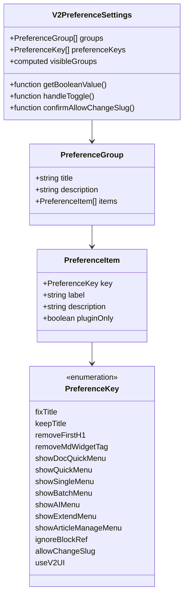
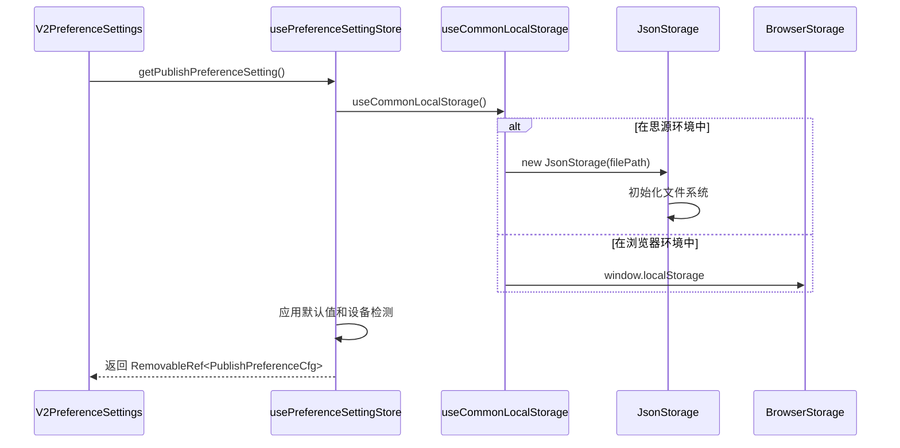
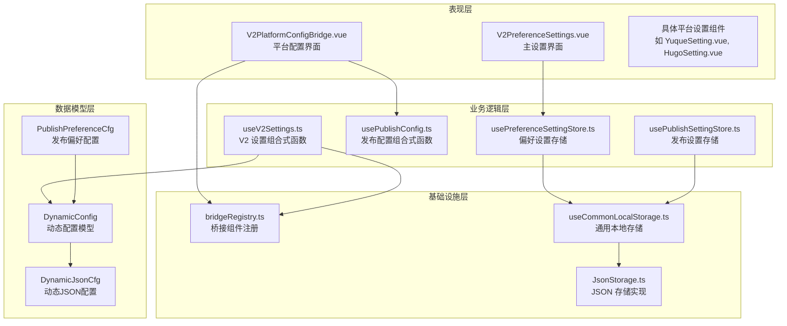
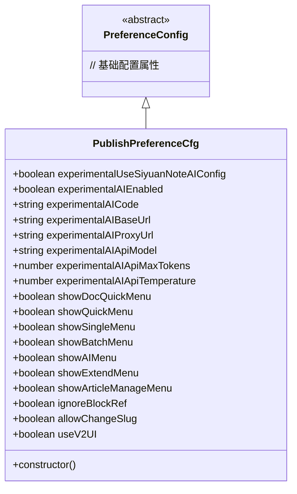
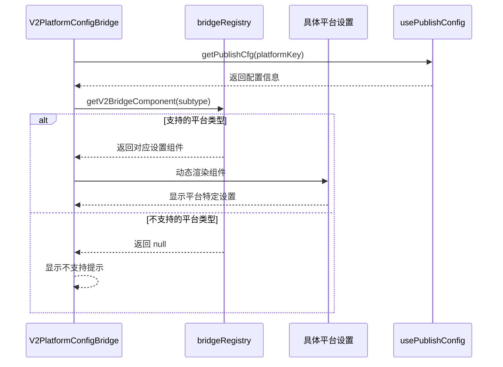
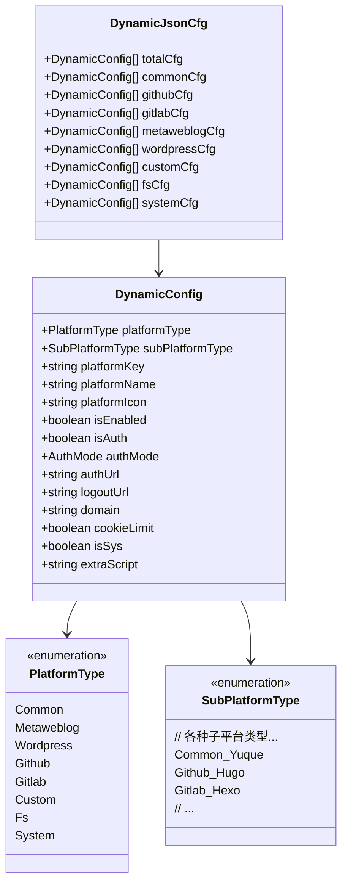

# V2 偏好设置组件

<cite>
**本文档引用的文件**
- [V2PreferenceSettings.vue](file://src/components/v2/settings/V2PreferenceSettings.vue)
- [usePreferenceSettingStore.ts](file://src/stores/usePreferenceSettingStore.ts)
- [publishPreferenceCfg.ts](file://src/models/publishPreferenceCfg.ts)
- [useV2Settings.ts](file://src/composables/v2/useV2Settings.ts)
- [V2PlatformConfigBridge.vue](file://src/components/v2/settings/V2PlatformConfigBridge.vue)
- [bridgeRegistry.ts](file://src/components/v2/settings/bridge/bridgeRegistry.ts)
- [useCommonLocalStorage.ts](file://src/stores/common/useCommonLocalStorage.ts)
- [dynamicConfig.ts](file://src/platforms/dynamicConfig.ts)
- [usePublishSettingStore.ts](file://src/stores/usePublishSettingStore.ts)
- [usePublishConfig.ts](file://src/composables/usePublishConfig.ts)
- [jsonStorage.ts](file://src/stores/common/jsonStorage.ts)
- [YuqueSetting.vue](file://src/components/set/publish/singleplatform/commonblog/YuqueSetting.vue)
- [HugoSetting.vue](file://src/components/set/publish/singleplatform/github/HugoSetting.vue)
</cite>

## 目录
1. [简介](#简介)
2. [项目结构](#项目结构)
3. [核心组件](#核心组件)
4. [架构概览](#架构概览)
5. [详细组件分析](#详细组件分析)
6. [依赖关系分析](#依赖关系分析)
7. [性能考虑](#性能考虑)
8. [故障排除指南](#故障排除指南)
9. [结论](#结论)

## 简介

V2 偏好设置组件是思源笔记发布插件中的核心配置管理系统，负责管理用户在 V2 版本中的各种偏好设置。该组件提供了直观的界面让用户可以轻松配置内容处理、菜单显示、实验性功能等各个方面。

主要功能包括：
- 内容处理偏好设置（标题修复、H1 移除、小工具标签处理等）
- 菜单显示控制（文档快捷菜单、快速菜单、批量菜单等）
- 实验性功能开关（V2 UI 界面等）
- 平台账户管理和配置桥接

## 项目结构

V2 偏好设置组件采用模块化设计，主要分布在以下目录结构中：



**图表来源**
- [V2PreferenceSettings.vue:1-239](file://src/components/v2/settings/V2PreferenceSettings.vue#L1-L239)
- [usePreferenceSettingStore.ts:1-90](file://src/stores/usePreferenceSettingStore.ts#L1-L90)
- [bridgeRegistry.ts:1-80](file://src/components/v2/settings/bridge/bridgeRegistry.ts#L1-L80)

**章节来源**
- [V2PreferenceSettings.vue:1-239](file://src/components/v2/settings/V2PreferenceSettings.vue#L1-L239)
- [usePreferenceSettingStore.ts:1-90](file://src/stores/usePreferenceSettingStore.ts#L1-L90)
- [bridgeRegistry.ts:1-80](file://src/components/v2/settings/bridge/bridgeRegistry.ts#L1-L80)

## 核心组件

### 主设置页面组件

V2PreferenceSettings.vue 是整个偏好设置系统的核心组件，提供了一个分组式的设置界面：



**图表来源**
- [V2PreferenceSettings.vue:55-82](file://src/components/v2/settings/V2PreferenceSettings.vue#L55-L82)
- [V2PreferenceSettings.vue:78-82](file://src/components/v2/settings/V2PreferenceSettings.vue#L78-L82)

### 存储管理

偏好设置采用分层存储架构，确保在不同环境中都能正确保存和加载配置：



**图表来源**
- [usePreferenceSettingStore.ts:34-67](file://src/stores/usePreferenceSettingStore.ts#L34-L67)
- [useCommonLocalStorage.ts:43-55](file://src/stores/common/useCommonLocalStorage.ts#L43-L55)
- [jsonStorage.ts:29-51](file://src/stores/common/jsonStorage.ts#L29-L51)

**章节来源**
- [V2PreferenceSettings.vue:84-239](file://src/components/v2/settings/V2PreferenceSettings.vue#L84-L239)
- [usePreferenceSettingStore.ts:18-87](file://src/stores/usePreferenceSettingStore.ts#L18-L87)
- [publishPreferenceCfg.ts:19-103](file://src/models/publishPreferenceCfg.ts#L19-L103)

## 架构概览

V2 偏好设置组件采用了清晰的分层架构，确保了良好的可维护性和扩展性：



**图表来源**
- [useV2Settings.ts:42-249](file://src/composables/v2/useV2Settings.ts#L42-L249)
- [usePublishConfig.ts:26-95](file://src/composables/usePublishConfig.ts#L26-L95)
- [bridgeRegistry.ts:31-79](file://src/components/v2/settings/bridge/bridgeRegistry.ts#L31-L79)

## 详细组件分析

### 偏好设置模型

PublishPreferenceCfg 类定义了完整的偏好设置结构，包括内容处理、菜单显示和实验性功能：



**图表来源**
- [publishPreferenceCfg.ts:19-103](file://src/models/publishPreferenceCfg.ts#L19-L103)

### 平台配置桥接系统

V2PlatformConfigBridge.vue 提供了统一的平台配置界面，支持动态加载不同的设置组件：



**图表来源**
- [V2PlatformConfigBridge.vue:68-108](file://src/components/v2/settings/V2PlatformConfigBridge.vue#L68-L108)
- [bridgeRegistry.ts:69-79](file://src/components/v2/settings/bridge/bridgeRegistry.ts#L69-L79)

### 动态配置管理

dynamicConfig.ts 提供了完整的动态配置管理系统，支持多种平台类型的配置：



**图表来源**
- [dynamicConfig.ts:13-113](file://src/platforms/dynamicConfig.ts#L13-L113)
- [dynamicConfig.ts:247-257](file://src/platforms/dynamicConfig.ts#L247-L257)

**章节来源**
- [V2PlatformConfigBridge.vue:1-206](file://src/components/v2/settings/V2PlatformConfigBridge.vue#L1-L206)
- [bridgeRegistry.ts:1-80](file://src/components/v2/settings/bridge/bridgeRegistry.ts#L1-L80)
- [dynamicConfig.ts:1-540](file://src/platforms/dynamicConfig.ts#L1-L540)

## 依赖关系分析

V2 偏好设置组件的依赖关系展现了清晰的分层架构：

```mermaid
graph TD
subgraph "外部依赖"
A[@vueuse/core<br/>响应式存储]
B[zhi-device<br/>设备检测]
C[zhi-common<br/>通用工具]
D[Element Plus<br/>UI 组件]
end
subgraph "内部模块"
E[V2PreferenceSettings.vue<br/>主设置组件]
F[usePreferenceSettingStore.ts<br/>偏好设置存储]
G[useV2Settings.ts<br/>V2 设置组合式函数]
H[bridgeRegistry.ts<br/>桥接注册表]
I[usePublishConfig.ts<br/>发布配置组合式函数]
end
subgraph "工具类"
J[useCommonLocalStorage.ts<br/>通用本地存储]
K[jsonStorage.ts<br/>JSON 存储]
L[useSiyuanDevice.ts<br/>设备检测]
M[useV2I18n.ts<br/>国际化]
end
E --> F
E --> G
E --> M
F --> J
G --> H
G --> I
J --> K
J --> L
F --> A
G --> B
E --> C
E --> D
```

**图表来源**
- [V2PreferenceSettings.vue:46-53](file://src/components/v2/settings/V2PreferenceSettings.vue#L46-L53)
- [usePreferenceSettingStore.ts:10-16](file://src/stores/usePreferenceSettingStore.ts#L10-L16)
- [useV2Settings.ts:1-17](file://src/composables/v2/useV2Settings.ts#L1-L17)

**章节来源**
- [usePreferenceSettingStore.ts:10-16](file://src/stores/usePreferenceSettingStore.ts#L10-L16)
- [useV2Settings.ts:1-17](file://src/composables/v2/useV2Settings.ts#L1-L17)
- [V2PreferenceSettings.vue:46-53](file://src/components/v2/settings/V2PreferenceSettings.vue#L46-L53)

## 性能考虑

V2 偏好设置组件在设计时充分考虑了性能优化：

### 响应式数据管理
- 使用 Vue 3 的响应式系统确保只有变更的数据才会触发重新渲染
- 采用 computed 属性缓存计算结果，避免重复计算
- 使用 RemovableRef 确保内存的有效管理

### 存储优化
- 在思源环境中使用 JSON 文件存储，避免浏览器存储的限制
- 采用增量更新策略，只更新变更的部分
- 使用异步存储操作，避免阻塞主线程

### 组件懒加载
- 平台设置组件采用动态导入，按需加载
- 桥接组件系统支持延迟初始化
- 大量设置项采用虚拟滚动或分页加载

## 故障排除指南

### 常见问题及解决方案

**设置无法保存**
1. 检查存储权限是否正常
2. 确认设备环境检测是否正确
3. 验证 JSON 文件写入权限

**平台设置组件不显示**
1. 确认平台类型是否在支持列表中
2. 检查设备兼容性（如本地系统仅支持 Electron 环境）
3. 验证平台密钥格式是否正确

**国际化文本显示异常**
1. 检查语言包是否完整加载
2. 确认翻译键值是否正确
3. 验证 i18n 配置是否正确

**章节来源**
- [useCommonLocalStorage.ts:43-55](file://src/stores/common/useCommonLocalStorage.ts#L43-L55)
- [bridgeRegistry.ts:74-76](file://src/components/v2/settings/bridge/bridgeRegistry.ts#L74-L76)
- [V2PreferenceSettings.vue:224-237](file://src/components/v2/settings/V2PreferenceSettings.vue#L224-L237)

## 结论

V2 偏好设置组件展现了现代前端应用的最佳实践，通过清晰的分层架构、完善的错误处理机制和优秀的性能优化，在提供强大功能的同时保持了良好的用户体验。组件的设计充分考虑了扩展性和维护性，为未来的功能增强奠定了坚实的基础。

该组件系统的主要优势包括：
- 模块化的架构设计，便于功能扩展
- 完善的错误处理和边界条件处理
- 优秀的性能优化策略
- 良好的国际化支持
- 灵活的存储抽象，支持多种运行环境