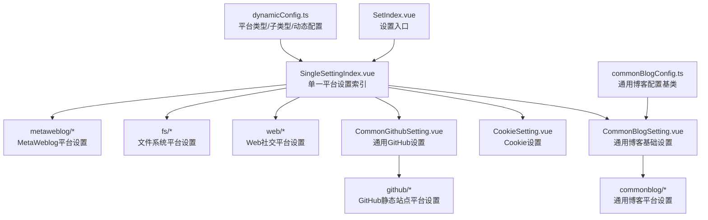
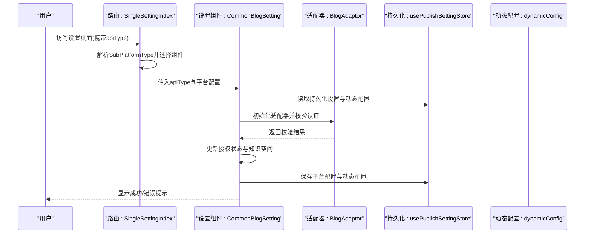
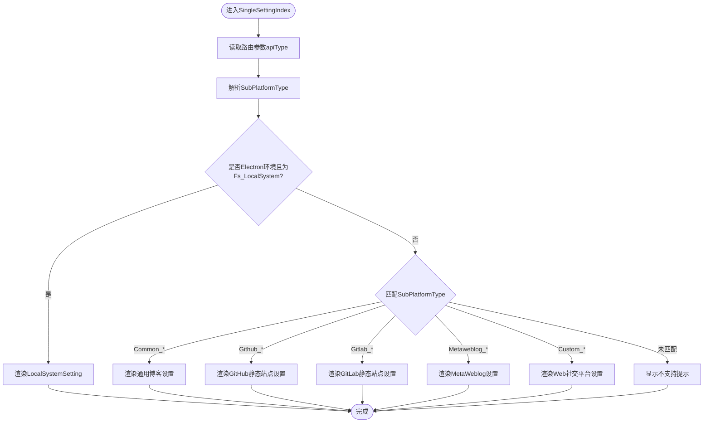
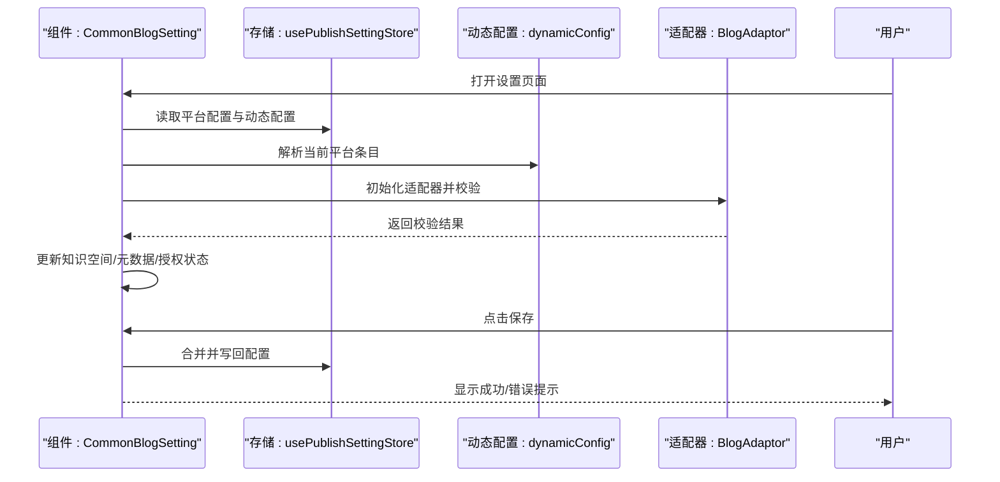
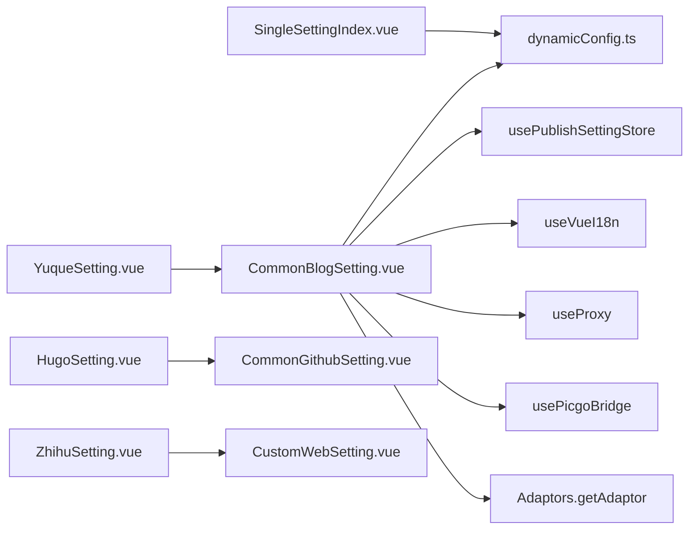

# 单一平台设置组件

<cite>
**本文引用的文件**
- [SingleSettingIndex.vue](file://src/components/set/publish/singleplatform/SingleSettingIndex.vue)
- [CommonBlogSetting.vue](file://src/components/set/publish/singleplatform/base/CommonBlogSetting.vue)
- [CookieSetting.vue](file://src/components/set/publish/singleplatform/base/CookieSetting.vue)
- [CommonGithubSetting.vue](file://src/components/set/publish/singleplatform/base/impl/CommonGithubSetting.vue)
- [dynamicConfig.ts](file://src/platforms/dynamicConfig.ts)
- [commonBlogConfig.ts](file://src/adaptors/api/base/commonBlogConfig.ts)
- [YuqueSetting.vue](file://src/components/set/publish/singleplatform/commonblog/YuqueSetting.vue)
- [HugoSetting.vue](file://src/components/set/publish/singleplatform/github/HugoSetting.vue)
- [ZhihuSetting.vue](file://src/components/set/publish/singleplatform/web/ZhihuSetting.vue)
- [SetIndex.vue](file://src/components/set/SetIndex.vue)
</cite>

## 目录
1. [简介](#简介)
2. [项目结构](#项目结构)
3. [核心组件](#核心组件)
4. [架构总览](#架构总览)
5. [详细组件分析](#详细组件分析)
6. [依赖分析](#依赖分析)
7. [性能考虑](#性能考虑)
8. [故障排除指南](#故障排除指南)
9. [结论](#结论)
10. [附录](#附录)

## 简介
本文件聚焦“单一平台设置组件”的整体设计与实现，围绕 SingleSettingIndex 单一平台设置索引组件展开，系统性阐述其路由管理、基础设置组件（如 CommonBlogSetting、CookieSetting、CommonGithubSetting 等）的设计模式与交互流程；并进一步解析各平台分类设置组件（通用博客、GitHub/GitLab 静态站点、MetaWeblog 博客协议、Web 社交平台、文件系统等）的架构原则、数据结构、验证规则与 UI 渲染策略。文档同时覆盖平台设置的继承关系、配置合并与默认值处理等核心机制，帮助读者快速理解并扩展新的平台设置。

## 项目结构
单一平台设置相关的核心目录与文件组织如下：
- 路由入口与索引
  - SetIndex.vue：设置模块入口，承载统一的设置页面布局与导航。
  - SingleSettingIndex.vue：单一平台设置索引，根据路由参数动态选择具体平台设置组件。
- 基础设置组件
  - CommonBlogSetting.vue：通用博客平台（如语雀、Notion、Halo、Telegraph、Confluence）的基础设置表单与校验逻辑。
  - CookieSetting.vue：Cookie 类平台的专用设置对话框，用于手动粘贴 Cookie 并保存。
  - CommonGithubSetting.vue：通用 GitHub 平台设置的扩展组件，提供仓库、分支、默认路径、文件规则等高级配置。
- 平台分类设置组件
  - commonblog：通用博客平台设置（示例：YuqueSetting.vue）。
  - github：GitHub 静态站点平台设置（示例：HugoSetting.vue）。
  - web：Web 社交平台设置（示例：ZhihuSetting.vue）。
- 平台元数据与配置
  - dynamicConfig.ts：平台类型与子类型的枚举、动态配置对象、平台键生成与解析、配置合并与查找等核心逻辑。
  - commonBlogConfig.ts：通用博客配置基类，定义通用字段与默认行为。

图表来源
- [SingleSettingIndex.vue:1-125](file://src/components/set/publish/singleplatform/SingleSettingIndex.vue#L1-L125)
- [CommonBlogSetting.vue:1-540](file://src/components/set/publish/singleplatform/base/CommonBlogSetting.vue#L1-L540)
- [CookieSetting.vue:1-129](file://src/components/set/publish/singleplatform/base/CookieSetting.vue#L1-L129)
- [CommonGithubSetting.vue:1-155](file://src/components/set/publish/singleplatform/base/impl/CommonGithubSetting.vue#L1-L155)
- [dynamicConfig.ts:1-534](file://src/platforms/dynamicConfig.ts#L1-L534)
- [commonBlogConfig.ts:1-42](file://src/adaptors/api/base/commonBlogConfig.ts#L1-L42)

章节来源
- [SingleSettingIndex.vue:1-125](file://src/components/set/publish/singleplatform/SingleSettingIndex.vue#L1-L125)
- [dynamicConfig.ts:1-534](file://src/platforms/dynamicConfig.ts#L1-L534)

## 核心组件
本节对关键组件进行深入剖析，涵盖职责边界、数据流、验证与保存流程、UI 渲染策略以及与平台元数据的协作方式。

- SingleSettingIndex：根据路由参数 apiType 解析子平台类型 SubPlatformType，并按类型条件渲染对应平台设置组件；在 Electron 环境下额外支持本地文件系统设置。
- CommonBlogSetting：作为通用博客平台的基础设置容器，负责：
  - 初始化配置（从持久化设置读取或回退默认值）、动态加载知识空间（当启用知识空间时）、代理与图床服务检测。
  - 表单校验（调用适配器 API 检查认证），并在校验后更新动态配置中的授权状态。
  - 保存配置（写入平台使用配置与动态 JSON 配置）。
- CookieSetting：用于 Cookie 类平台的手动粘贴与保存，强调隐私提示与本地存储承诺。
- CommonGithubSetting：在 CommonBlogSetting 基础上扩展 GitHub 平台特有字段（仓库、分支、默认路径、文件规则、提交信息、作者邮箱、站点链接、YAML 预设、图片存储路径等），并提供高级配置折叠/展开。

章节来源
- [SingleSettingIndex.vue:10-125](file://src/components/set/publish/singleplatform/SingleSettingIndex.vue#L10-L125)
- [CommonBlogSetting.vue:10-318](file://src/components/set/publish/singleplatform/base/CommonBlogSetting.vue#L10-L318)
- [CookieSetting.vue:10-81](file://src/components/set/publish/singleplatform/base/CookieSetting.vue#L10-L81)
- [CommonGithubSetting.vue:10-52](file://src/components/set/publish/singleplatform/base/impl/CommonGithubSetting.vue#L10-L52)

## 架构总览
单一平台设置的运行时架构由“路由索引 + 基础组件 + 平台适配器 + 动态配置”构成。路由层根据 apiType 决策渲染，基础组件负责表单、校验与保存，平台适配器负责与目标平台交互，动态配置负责平台元数据与键管理。

图表来源
- [SingleSettingIndex.vue:62-119](file://src/components/set/publish/singleplatform/SingleSettingIndex.vue#L62-L119)
- [CommonBlogSetting.vue:116-219](file://src/components/set/publish/singleplatform/base/CommonBlogSetting.vue#L116-L219)
- [dynamicConfig.ts:397-418](file://src/platforms/dynamicConfig.ts#L397-L418)

## 详细组件分析

### SingleSettingIndex：单一平台设置索引
- 路由参数解析：从路由 params 中提取 apiType，调用 getSubPlatformTypeByKey 解析为 SubPlatformType。
- 条件渲染：依据 SubPlatformType 的不同值，渲染对应的平台设置组件（通用博客、GitHub、GitLab、MetaWeblog、Web、文件系统等）。
- 环境判断：在 Electron 环境下才渲染本地文件系统设置组件。
- 国际化标题：结合 useVueI18n 与 SubPlatformType 生成帮助键，用于页面标题与帮助内容。

图表来源
- [SingleSettingIndex.vue:67-119](file://src/components/set/publish/singleplatform/SingleSettingIndex.vue#L67-L119)
- [dynamicConfig.ts:397-418](file://src/platforms/dynamicConfig.ts#L397-L418)

章节来源
- [SingleSettingIndex.vue:10-125](file://src/components/set/publish/singleplatform/SingleSettingIndex.vue#L10-L125)

### CommonBlogSetting：通用博客设置基础组件
- 设计模式
  - 组合优于继承：通过插槽（header/main/footer）允许子组件注入自定义表单项。
  - 数据驱动：基于 CommonBlogConfig 定义字段与默认值，配合动态配置与持久化存储。
  - 生命周期：onMounted 中完成初始化、代理与图床检测、知识空间加载。
- 关键流程
  - 初始化：从持久化设置读取平台配置，若为空则回退默认值；解析动态配置并定位当前平台条目。
  - 校验：通过适配器 API 检查认证，成功后刷新知识空间与元数据映射，失败则提示错误。
  - 保存：将平台使用配置与动态 JSON 配置合并写回持久化存储。
  - 知识空间：当启用知识空间时，支持关键词搜索并动态填充下拉选项。
  - 代理与图床：根据中间件与 CORS 配置决定是否显示相应输入项；检测图床服务类型并限制可用选项。
- 验证规则与 UI 渲染
  - 根据密码类型（密码/Token/Cookie）渲染不同的输入控件与提示。
  - 根据平台能力开关（如首页、API 地址、用户名、预览地址、页面类型）动态显示表单项。
  - 校验按钮与状态提示联动，成功/失败分别展示不同提示与消息。

图表来源
- [CommonBlogSetting.vue:116-219](file://src/components/set/publish/singleplatform/base/CommonBlogSetting.vue#L116-L219)
- [CommonBlogSetting.vue:275-317](file://src/components/set/publish/singleplatform/base/CommonBlogSetting.vue#L275-L317)
- [dynamicConfig.ts:336-392](file://src/platforms/dynamicConfig.ts#L336-L392)

章节来源
- [CommonBlogSetting.vue:10-540](file://src/components/set/publish/singleplatform/base/CommonBlogSetting.vue#L10-L540)
- [commonBlogConfig.ts:13-41](file://src/adaptors/api/base/commonBlogConfig.ts#L13-L41)

### CookieSetting：Cookie 设置组件
- 适用场景：浏览器或受限环境下无法自动获取 Cookie，需用户手动粘贴。
- 流程：表单校验（空壳规则）、保存时写回平台配置、触发列表刷新提示。
- 安全提示：强调数据仅本地存储，避免泄露。

章节来源
- [CookieSetting.vue:10-129](file://src/components/set/publish/singleplatform/base/CookieSetting.vue#L10-L129)

### CommonGithubSetting：通用 GitHub 设置组件
- 继承关系：在 CommonBlogSetting 基础上扩展 GitHub 平台特有字段（仓库、分支、默认路径、文件规则、提交信息、作者邮箱、站点链接、YAML 预设、图片存储路径等）。
- 高级配置：提供“显示更多配置”折叠/展开，便于复杂场景使用。
- 默认值处理：提供默认路径同步到 blogid 的便捷方法，减少用户输入成本。

章节来源
- [CommonGithubSetting.vue:10-155](file://src/components/set/publish/singleplatform/base/impl/CommonGithubSetting.vue#L10-L155)

### 平台分类设置组件：设计原则与实现要点
- 通用博客（commonblog）
  - 示例：YuqueSetting.vue 通过 useYuqueApi 获取平台配置，并注入占位符文案。
  - 设计原则：以 CommonBlogSetting 为基础，注入平台特定的占位符与能力开关。
- GitHub/GitLab 静态站点（github/gitlab）
  - 示例：HugoSetting.vue 通过 useHugoApi 获取配置并注入占位符。
  - 设计原则：复用 CommonGithubSetting 或在其基础上扩展静态站点特有字段。
- MetaWeblog 博客协议（metaweblog）
  - 设计原则：遵循通用博客设置的认证与知识空间加载流程，针对 MetaWeblog 平台调整占位符与能力。
- Web 社交平台（web）
  - 示例：ZhihuSetting.vue 通过 useZhihuWeb 获取配置并注入占位符。
  - 设计原则：对于自定义网站授权模式（WEBSITE），通常采用 CookieSetting 或自定义授权流程。
- 文件系统（fs）
  - 设计原则：在 Electron 环境下启用，提供本地系统、FTP、SFTP 等文件系统设置入口。

章节来源
- [YuqueSetting.vue:10-39](file://src/components/set/publish/singleplatform/commonblog/YuqueSetting.vue#L10-L39)
- [HugoSetting.vue:10-41](file://src/components/set/publish/singleplatform/github/HugoSetting.vue#L10-L41)
- [ZhihuSetting.vue:10-39](file://src/components/set/publish/singleplatform/web/ZhihuSetting.vue#L10-L39)

## 依赖分析
- 组件耦合
  - SingleSettingIndex 对 dynamicConfig 的强依赖体现在子平台类型解析与帮助键生成。
  - CommonBlogSetting 对适配器、存储、国际化、代理与图床桥接的多向依赖，体现为高内聚低耦合的组合式设计。
  - 平台设置组件（如 YuqueSetting.vue、HugoSetting.vue、ZhihuSetting.vue）对 use*Api 钩子的依赖，形成“配置注入 + 基础表单”的解耦结构。
- 外部依赖
  - zhi-blog-api：提供适配器接口、配置基类、页面类型等。
  - Element Plus：提供表单、按钮、提示等 UI 组件。
  - zhi-common：提供字符串、对象、JSON 工具方法。
- 循环依赖
  - 未发现直接循环导入；组件间通过 props 与事件通信，避免循环依赖风险。

图表来源
- [SingleSettingIndex.vue:15-119](file://src/components/set/publish/singleplatform/SingleSettingIndex.vue#L15-L119)
- [CommonBlogSetting.vue:16-27](file://src/components/set/publish/singleplatform/base/CommonBlogSetting.vue#L16-L27)
- [YuqueSetting.vue:24-34](file://src/components/set/publish/singleplatform/commonblog/YuqueSetting.vue#L24-L34)
- [HugoSetting.vue:23-33](file://src/components/set/publish/singleplatform/github/HugoSetting.vue#L23-L33)
- [ZhihuSetting.vue:24-34](file://src/components/set/publish/singleplatform/web/ZhihuSetting.vue#L24-L34)

章节来源
- [dynamicConfig.ts:1-534](file://src/platforms/dynamicConfig.ts#L1-534)
- [CommonBlogSetting.vue:10-318](file://src/components/set/publish/singleplatform/base/CommonBlogSetting.vue#L10-L318)

## 性能考虑
- 渲染优化
  - 使用骨架屏与延迟渲染（isInit 控制）提升首屏体验。
  - 下拉选择器在加载时显示加载状态，避免阻塞交互。
- 数据加载
  - 知识空间按需加载（关键词变更时触发），减少不必要的网络请求。
  - 代理与图床检测仅在初始化阶段执行一次，避免重复计算。
- 存储与合并
  - 保存时一次性合并平台使用配置与动态 JSON 配置，降低多次写入成本。
- 平台键管理
  - 通过 getNewPlatformKey 生成唯一键，避免冲突；通过 getDynCfgByKey 快速定位平台条目，提高查找效率。

## 故障排除指南
- 校验失败
  - 症状：点击校验按钮后出现错误提示。
  - 排查：确认用户名/密码/Token/Cookie 正确；检查 API 地址与代理配置；查看控制台日志。
  - 参考：CommonBlogSetting 的校验与错误提示逻辑。
- 知识空间为空
  - 症状：启用知识空间后下拉无数据。
  - 排查：检查关键词输入与网络连通性；确认平台返回的用户博客列表非空。
  - 参考：afterValid 与 initKwSpaces 的知识空间初始化流程。
- 保存失败
  - 症状：保存后未生效或提示失败。
  - 排查：确认持久化存储可用；检查配置合并逻辑；查看控制台错误信息。
  - 参考：saveConf 的配置写回流程。
- Cookie 设置无法自动获取
  - 症状：提示需手动粘贴 Cookie。
  - 排查：确认平台限制与浏览器环境；按提示在开发者工具中获取并粘贴。
  - 参考：CookieSetting 的提示与表单处理。

章节来源
- [CommonBlogSetting.vue:116-219](file://src/components/set/publish/singleplatform/base/CommonBlogSetting.vue#L116-L219)
- [CookieSetting.vue:50-81](file://src/components/set/publish/singleplatform/base/CookieSetting.vue#L50-L81)

## 结论
单一平台设置组件通过“路由索引 + 基础组件 + 平台适配器 + 动态配置”的架构实现了高度可扩展的平台设置体系。CommonBlogSetting 作为通用基础，结合插槽与平台钩子，既能满足通用博客平台的一致体验，又能灵活扩展至 GitHub/GitLab 静态站点、MetaWeblog 博客协议与 Web 社交平台等多样化场景。借助 dynamicConfig 的平台类型与键管理机制，系统在配置合并、默认值处理与授权状态维护方面具备良好的一致性与可维护性。

## 附录
- 平台类型与子类型
  - 平台类型：Common、Metaweblog、Wordpress、Github、Gitlab、Custom、Fs、System。
  - 子平台类型：涵盖各平台细分类型（如 Yuque、Hugo、Hexo、Vitepress、WordPress、Zhihu、Wechat 等）。
- 键命名规范
  - 平台与 ID 用“-”分隔，平台与子平台用“_”分隔；提供生成新键、检测重复、按键查找与替换、删除等工具函数。
- 默认值与占位符
  - 通用博客配置基类提供默认字段与占位符对象，平台设置组件通过 use*Api 注入平台特定文案，确保用户体验一致。

章节来源
- [dynamicConfig.ts:126-238](file://src/platforms/dynamicConfig.ts#L126-L238)
- [dynamicConfig.ts:428-497](file://src/platforms/dynamicConfig.ts#L428-L497)
- [commonBlogConfig.ts:13-41](file://src/adaptors/api/base/commonBlogConfig.ts#L13-L41)