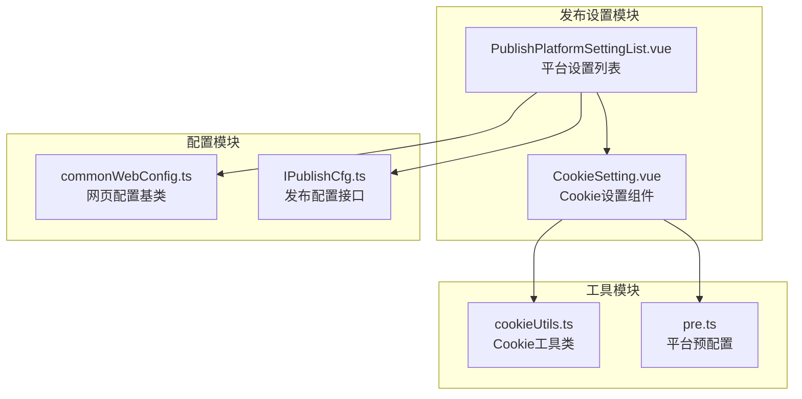
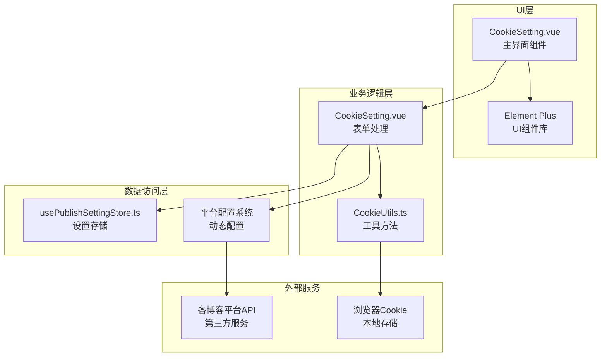
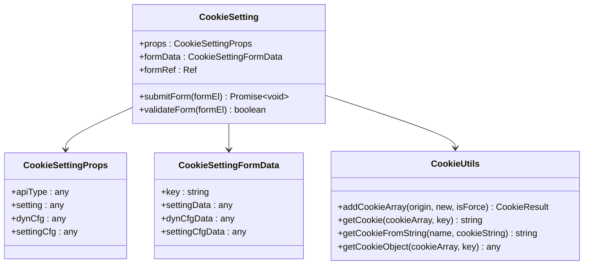
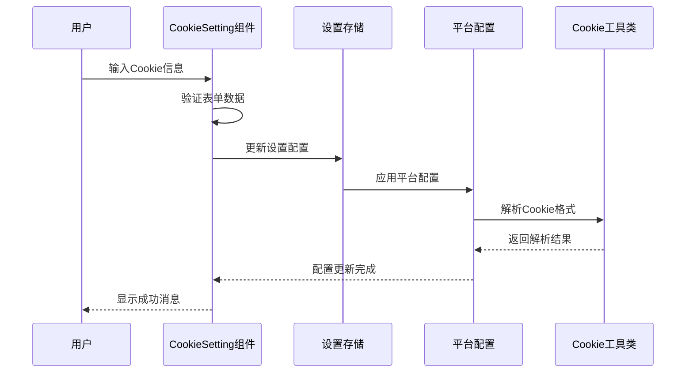
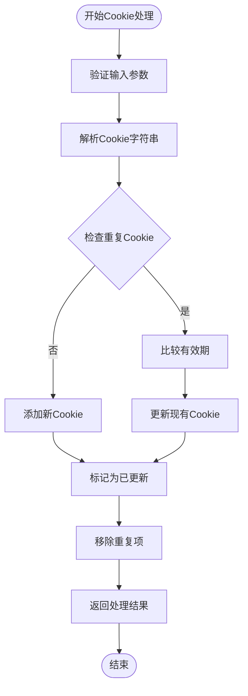
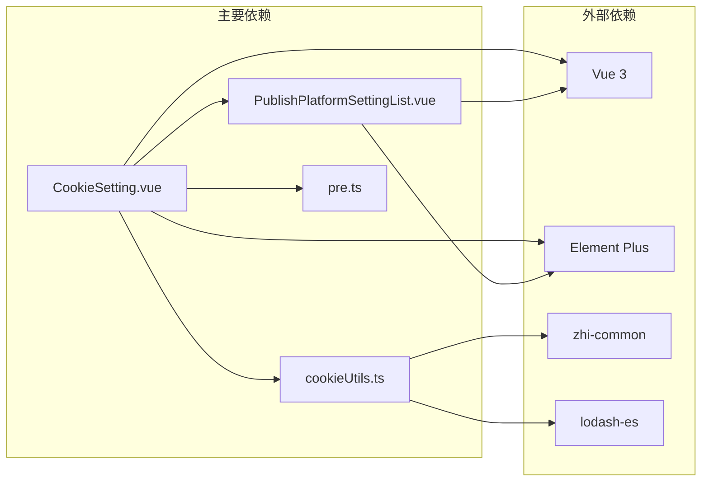
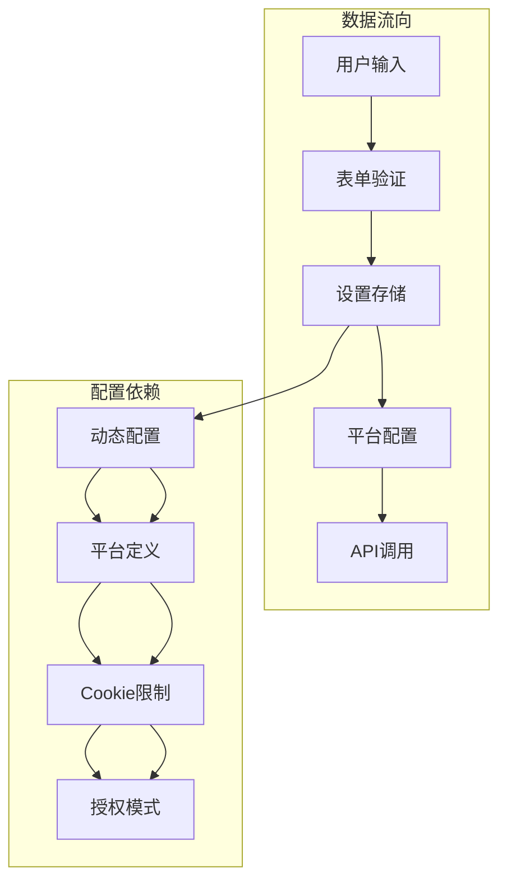

# Cookie设置组件

<cite>
**本文档引用的文件**
- [CookieSetting.vue](file://src/components/set/publish/singleplatform/base/CookieSetting.vue)
- [cookieUtils.ts](file://src/utils/cookieUtils.ts)
- [PublishPlatformSettingList.vue](file://src/components/set/publish/platform/PublishPlatformSettingList.vue)
- [pre.ts](file://src/platforms/pre.ts)
- [commonWebConfig.ts](file://src/adaptors/web/base/commonWebConfig.ts)
- [IPublishCfg.ts](file://src/types/IPublishCfg.ts)
- [cookieUtils.spec.ts](file://src/utils/cookieUtils.spec.ts)
</cite>

## 目录
1. [简介](#简介)
2. [项目结构](#项目结构)
3. [核心组件](#核心组件)
4. [架构概览](#架构概览)
5. [详细组件分析](#详细组件分析)
6. [依赖关系分析](#依赖关系分析)
7. [性能考虑](#性能考虑)
8. [故障排除指南](#故障排除指南)
9. [结论](#结论)

## 简介

Cookie设置组件是思源笔记发布器插件中的一个关键功能模块，专门用于处理各种博客平台的Cookie认证设置。该组件允许用户手动输入或粘贴平台Cookie，以实现对需要网页授权的平台进行身份验证。

该组件采用现代化的Vue 3 Composition API构建，集成了Element Plus UI框架，提供了直观的用户界面和强大的Cookie管理功能。组件支持多种Cookie格式解析、有效期比较、以及与平台配置系统的无缝集成。

## 项目结构

Cookie设置组件在整个项目架构中位于发布设置模块的单平台设置部分，主要涉及以下文件：



**图表来源**
- [PublishPlatformSettingList.vue:1-704](file://src/components/set/publish/platform/PublishPlatformSettingList.vue#L1-L704)
- [CookieSetting.vue:1-167](file://src/components/set/publish/singleplatform/base/CookieSetting.vue#L1-L167)
- [cookieUtils.ts:1-119](file://src/utils/cookieUtils.ts#L1-L119)

**章节来源**
- [PublishPlatformSettingList.vue:1-704](file://src/components/set/publish/platform/PublishPlatformSettingList.vue#L1-L704)
- [CookieSetting.vue:1-167](file://src/components/set/publish/singleplatform/base/CookieSetting.vue#L1-L167)

## 核心组件

### Cookie设置组件 (CookieSetting.vue)

Cookie设置组件是一个独立的Vue组件，提供了一个简洁而功能丰富的表单界面，用于处理平台Cookie的输入和验证。

#### 主要特性

- **表单验证**: 集成Element Plus表单验证机制
- **多平台支持**: 支持知乎、CSDN、微信公众号等平台的Cookie设置
- **用户友好**: 提供详细的使用说明和操作指导
- **数据持久化**: 自动保存到发布设置存储中

#### 组件属性

| 属性名 | 类型 | 描述 | 必需 |
|--------|------|------|------|
| apiType | any | 平台类型标识符 | 是 |
| setting | any | 完整设置对象 | 是 |
| dynCfg | any | 动态配置对象 | 是 |
| settingCfg | any | 设置配置对象 | 是 |

**章节来源**
- [CookieSetting.vue:21-26](file://src/components/set/publish/singleplatform/base/CookieSetting.vue#L21-L26)

### Cookie工具类 (cookieUtils.ts)

Cookie工具类提供了静态方法来处理各种Cookie相关的操作，包括数组合并、查找和解析等功能。

#### 核心方法

- `addCookieArray()`: 合并Cookie数组，智能处理重复项和有效期
- `getCookie()`: 根据键名获取特定Cookie
- `getCookieFromString()`: 从字符串中提取指定Cookie
- `getCookieObject()`: 获取Cookie对象表示

**章节来源**
- [cookieUtils.ts:18-116](file://src/utils/cookieUtils.ts#L18-L116)

## 架构概览

Cookie设置组件采用分层架构设计，确保了良好的可维护性和扩展性：



**图表来源**
- [CookieSetting.vue:10-34](file://src/components/set/publish/singleplatform/base/CookieSetting.vue#L10-L34)
- [cookieUtils.ts:18-116](file://src/utils/cookieUtils.ts#L18-L116)

## 详细组件分析

### Cookie设置组件架构



**图表来源**
- [CookieSetting.vue:10-42](file://src/components/set/publish/singleplatform/base/CookieSetting.vue#L10-L42)
- [cookieUtils.ts:18-116](file://src/utils/cookieUtils.ts#L18-L116)

### Cookie设置流程



**图表来源**
- [CookieSetting.vue:50-80](file://src/components/set/publish/singleplatform/base/CookieSetting.vue#L50-L80)
- [PublishPlatformSettingList.vue:258-281](file://src/components/set/publish/platform/PublishPlatformSettingList.vue#L258-L281)

### Cookie处理算法



**图表来源**
- [cookieUtils.ts:28-58](file://src/utils/cookieUtils.ts#L28-L58)

**章节来源**
- [CookieSetting.vue:50-80](file://src/components/set/publish/singleplatform/base/CookieSetting.vue#L50-L80)
- [cookieUtils.ts:28-58](file://src/utils/cookieUtils.ts#L28-L58)

## 依赖关系分析

### 组件间依赖



**图表来源**
- [CookieSetting.vue:11-17](file://src/components/set/publish/singleplatform/base/CookieSetting.vue#L11-L17)
- [cookieUtils.ts:10-13](file://src/utils/cookieUtils.ts#L10-L13)

### 数据流依赖



**图表来源**
- [PublishPlatformSettingList.vue:435-447](file://src/components/set/publish/platform/PublishPlatformSettingList.vue#L435-L447)
- [pre.ts:20-45](file://src/platforms/pre.ts#L20-L45)

**章节来源**
- [PublishPlatformSettingList.vue:435-447](file://src/components/set/publish/platform/PublishPlatformSettingList.vue#L435-L447)
- [pre.ts:20-45](file://src/platforms/pre.ts#L20-L45)

## 性能考虑

### 内存优化策略

1. **懒加载机制**: Cookie设置组件按需加载，减少初始内存占用
2. **响应式数据**: 使用Vue 3的响应式系统，避免不必要的重渲染
3. **缓存策略**: 对解析后的Cookie对象进行缓存，提高重复访问性能

### 处理效率

1. **异步处理**: 所有网络操作采用异步方式，避免阻塞主线程
2. **批量更新**: 支持批量Cookie更新，减少存储写入次数
3. **错误恢复**: 具备完善的错误处理和恢复机制

## 故障排除指南

### 常见问题及解决方案

| 问题类型 | 症状 | 可能原因 | 解决方案 |
|----------|------|----------|----------|
| Cookie格式错误 | 保存失败 | Cookie格式不正确 | 检查Cookie格式，确保包含必需字段 |
| 平台认证失败 | 验证失败 | Cookie过期或无效 | 重新登录平台获取新Cookie |
| 存储异常 | 设置未保存 | 浏览器存储问题 | 清除浏览器缓存或更换浏览器 |
| 验证超时 | 授权过程卡住 | 网络连接问题 | 检查网络连接，重试授权操作 |

### 调试工具

组件提供了完整的日志记录功能，可以通过浏览器控制台查看详细的调试信息：

```typescript
// 日志级别
logger.debug("调试信息")
logger.info("一般信息")
logger.warn("警告信息")
logger.error("错误信息")
```

**章节来源**
- [CookieSetting.vue:19](file://src/components/set/publish/singleplatform/base/CookieSetting.vue#L19)
- [cookieUtils.ts:19](file://src/utils/cookieUtils.ts#L19)

## 结论

Cookie设置组件是思源笔记发布器插件中一个精心设计的功能模块，它通过以下特点实现了优秀的用户体验：

1. **用户友好**: 提供清晰的界面和详细的使用指导
2. **功能完整**: 支持多种Cookie格式和平台认证
3. **性能优秀**: 采用现代前端技术栈，确保流畅的用户体验
4. **易于维护**: 清晰的架构设计和完善的测试覆盖

该组件的成功实施展示了如何在复杂的发布系统中实现灵活的身份验证机制，为用户提供了可靠的内容发布解决方案。通过模块化的架构设计和完善的错误处理机制，组件能够适应不断变化的平台要求和技术环境。