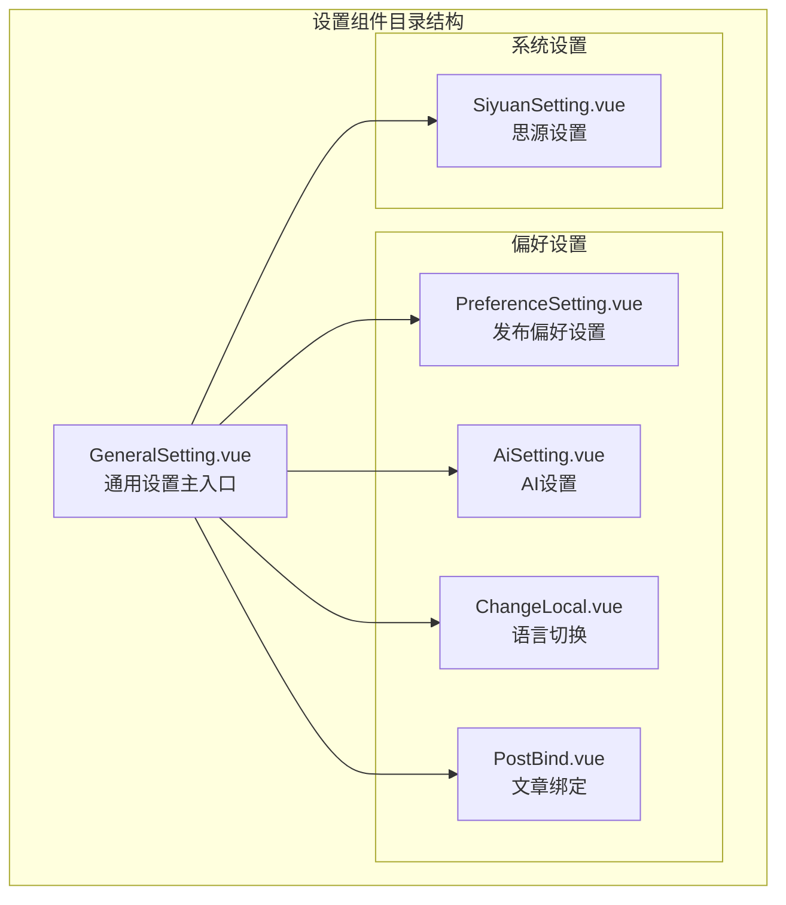
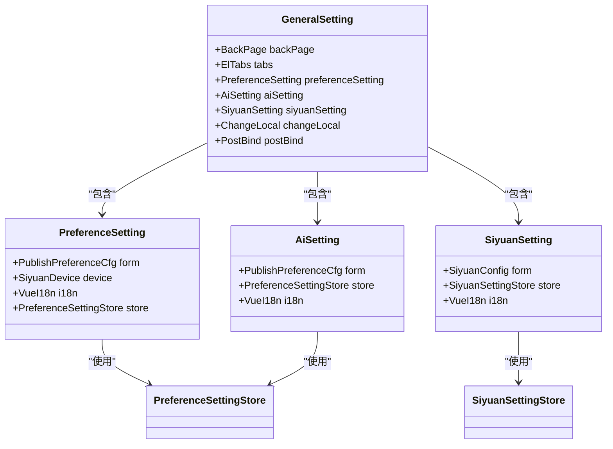
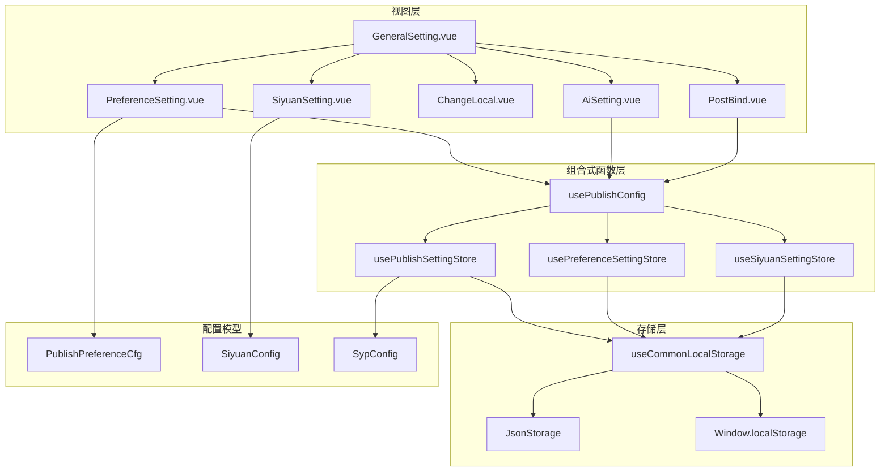
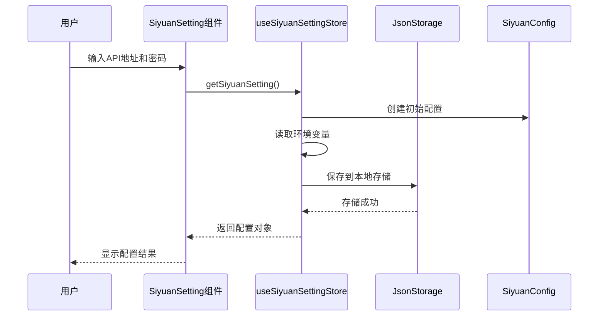
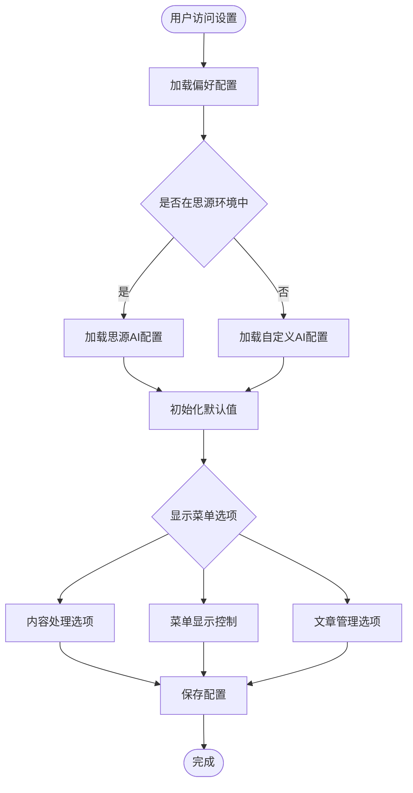
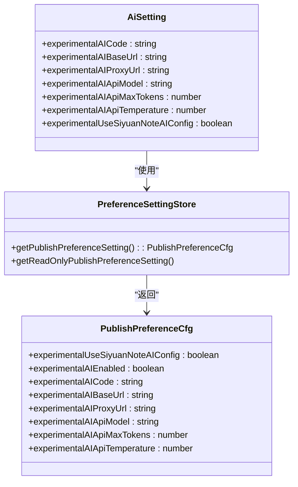
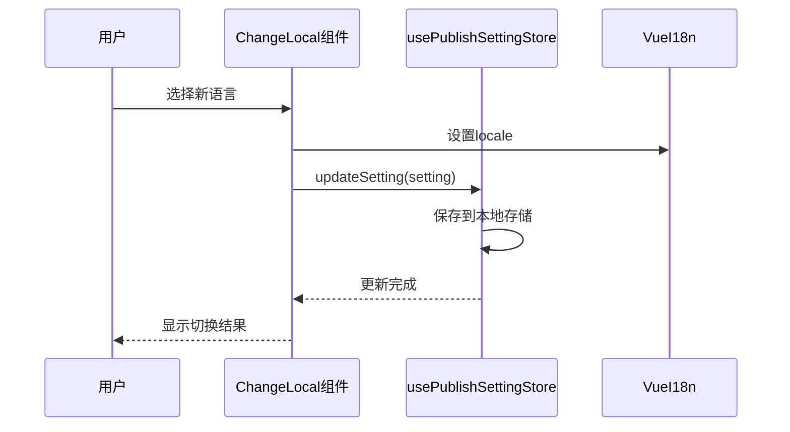
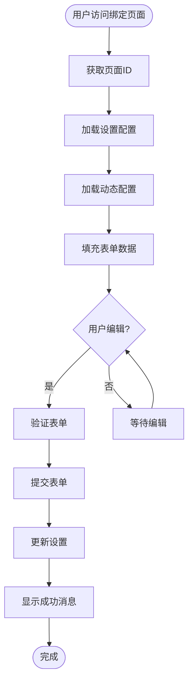
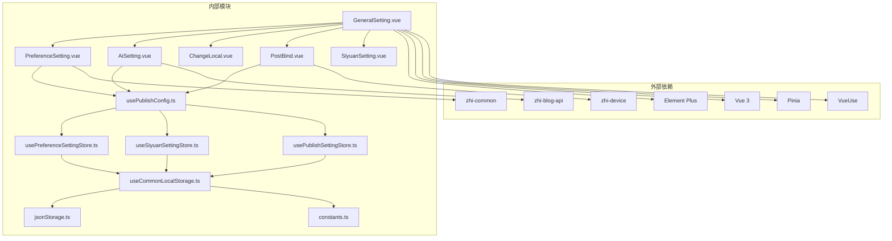

# 通用博客设置组件

<cite>
**本文档引用的文件**
- [GeneralSetting.vue](file://src/components/set/GeneralSetting.vue)
- [SiyuanSetting.vue](file://src/components/set/SiyuanSetting.vue)
- [useSiyuanSettingStore.ts](file://src/stores/useSiyuanSettingStore.ts)
- [usePreferenceSettingStore.ts](file://src/stores/usePreferenceSettingStore.ts)
- [usePublishConfig.ts](file://src/composables/usePublishConfig.ts)
- [PreferenceSetting.vue](file://src/components/set/preference/PreferenceSetting.vue)
- [AiSetting.vue](file://src/components/set/preference/AiSetting.vue)
- [publishPreferenceCfg.ts](file://src/models/publishPreferenceCfg.ts)
- [usePublishSettingStore.ts](file://src/stores/usePublishSettingStore.ts)
- [useCommonLocalStorage.ts](file://src/stores/common/useCommonLocalStorage.ts)
- [ChangeLocal.vue](file://src/components/set/preference/ChangeLocal.vue)
- [PostBind.vue](file://src/components/set/preference/PostBind.vue)
- [syp.config.ts](file://syp.config.ts)
- [jsonStorage.ts](file://src/stores/common/jsonStorage.ts)
- [constants.ts](file://src/utils/constants.ts)
</cite>

## 目录
1. [简介](#简介)
2. [项目结构](#项目结构)
3. [核心组件](#核心组件)
4. [架构概览](#架构概览)
5. [详细组件分析](#详细组件分析)
6. [依赖关系分析](#依赖关系分析)
7. [性能考虑](#性能考虑)
8. [故障排除指南](#故障排除指南)
9. [结论](#结论)

## 简介

通用博客设置组件是 SiYuan 笔记插件 Publisher 中的核心配置管理系统。该组件提供了统一的设置界面，支持多种博客平台的配置管理、AI 设置、语言切换、文章绑定等功能。通过模块化的架构设计，用户可以轻松配置和管理各种博客平台的发布设置。

该系统采用响应式状态管理，结合本地存储机制，确保设置数据在不同运行环境下的持久化存储。同时，系统支持动态配置加载，能够根据不同的博客平台提供相应的配置选项。

## 项目结构

通用博客设置组件位于 `src/components/set/` 目录下，主要包含以下核心文件：

**图表来源**
- [GeneralSetting.vue:17-37](file://src/components/set/GeneralSetting.vue#L17-L37)
- [PreferenceSetting.vue:51-116](file://src/components/set/preference/PreferenceSetting.vue#L51-L116)

**章节来源**
- [GeneralSetting.vue:1-43](file://src/components/set/GeneralSetting.vue#L1-L43)
- [PreferenceSetting.vue:1-123](file://src/components/set/preference/PreferenceSetting.vue#L1-L123)

## 核心组件

### 通用设置主入口

`GeneralSetting.vue` 作为整个设置系统的主入口，采用标签页布局组织各个设置模块：

**图表来源**
- [GeneralSetting.vue:10-15](file://src/components/set/GeneralSetting.vue#L10-L15)
- [PreferenceSetting.vue:14-25](file://src/components/set/preference/PreferenceSetting.vue#L14-L25)

### 发布偏好设置

发布偏好设置组件提供了丰富的配置选项，包括内容处理、菜单显示控制、AI 设置等：

**章节来源**
- [PreferenceSetting.vue:27-48](file://src/components/set/preference/PreferenceSetting.vue#L27-L48)
- [publishPreferenceCfg.ts:19-103](file://src/models/publishPreferenceCfg.ts#L19-L103)

## 架构概览

系统采用分层架构设计，通过 Store-View-Composable 模式实现数据流管理：

**图表来源**
- [usePublishConfig.ts:26-95](file://src/composables/usePublishConfig.ts#L26-L95)
- [useCommonLocalStorage.ts:27-55](file://src/stores/common/useCommonLocalStorage.ts#L27-L55)

## 详细组件分析

### 思源设置组件

思源设置组件负责管理与思源笔记相关的配置信息：

**图表来源**
- [SiyuanSetting.vue:17](file://src/components/set/SiyuanSetting.vue#L17)
- [useSiyuanSettingStore.ts:36-62](file://src/stores/useSiyuanSettingStore.ts#L36-L62)

**章节来源**
- [SiyuanSetting.vue:1-40](file://src/components/set/SiyuanSetting.vue#L1-L40)
- [useSiyuanSettingStore.ts:1-81](file://src/stores/useSiyuanSettingStore.ts#L1-L81)

### 发布偏好设置组件

发布偏好设置组件提供了全面的发布行为控制：

**图表来源**
- [PreferenceSetting.vue:66-114](file://src/components/set/preference/PreferenceSetting.vue#L66-L114)
- [usePreferenceSettingStore.ts:34-67](file://src/stores/usePreferenceSettingStore.ts#L34-L67)

**章节来源**
- [PreferenceSetting.vue:1-123](file://src/components/set/preference/PreferenceSetting.vue#L1-L123)
- [usePreferenceSettingStore.ts:1-90](file://src/stores/usePreferenceSettingStore.ts#L1-L90)

### AI 设置组件

AI 设置组件支持多种 AI 服务提供商的配置：

**图表来源**
- [AiSetting.vue:17](file://src/components/set/preference/AiSetting.vue#L17)
- [publishPreferenceCfg.ts:19-103](file://src/models/publishPreferenceCfg.ts#L19-L103)

**章节来源**
- [AiSetting.vue:1-121](file://src/components/set/preference/AiSetting.vue#L1-L121)
- [publishPreferenceCfg.ts:1-106](file://src/models/publishPreferenceCfg.ts#L1-L106)

### 语言切换组件

语言切换组件支持多语言环境的动态切换：

**图表来源**
- [ChangeLocal.vue:32-37](file://src/components/set/preference/ChangeLocal.vue#L32-L37)
- [usePublishSettingStore.ts:55-59](file://src/stores/usePublishSettingStore.ts#L55-L59)

**章节来源**
- [ChangeLocal.vue:1-60](file://src/components/set/preference/ChangeLocal.vue#L1-L60)

### 文章绑定组件

文章绑定组件用于管理文档与各平台文章ID的对应关系：

**图表来源**
- [PostBind.vue:54-82](file://src/components/set/preference/PostBind.vue#L54-L82)
- [PostBind.vue:89-113](file://src/components/set/preference/PostBind.vue#L89-L113)

**章节来源**
- [PostBind.vue:1-168](file://src/components/set/preference/PostBind.vue#L1-L168)

## 依赖关系分析

系统采用模块化设计，各组件之间的依赖关系清晰明确：

**图表来源**
- [GeneralSetting.vue:11-12](file://src/components/set/GeneralSetting.vue#L11-L12)
- [useCommonLocalStorage.ts:10-11](file://src/stores/common/useCommonLocalStorage.ts#L10-L11)

**章节来源**
- [usePublishConfig.ts:10-18](file://src/composables/usePublishConfig.ts#L10-L18)
- [useCommonLocalStorage.ts:9-14](file://src/stores/common/useCommonLocalStorage.ts#L9-L14)

## 性能考虑

系统在设计时充分考虑了性能优化：

### 存储策略优化
- **条件存储适配器**: 根据运行环境自动选择合适的存储方案
- **响应式数据绑定**: 使用 Vue 3 的响应式系统减少不必要的重渲染
- **缓存机制**: 设置存储采用缓存策略避免频繁的磁盘 I/O 操作

### 异步操作处理
- **异步配置加载**: 使用 async/await 处理异步配置加载
- **延迟初始化**: 配置在首次使用时才进行初始化
- **批量更新**: 支持批量更新设置以减少存储写入次数

### 内存管理
- **只读引用**: 提供只读版本的配置引用避免意外修改
- **垃圾回收**: 合理的生命周期管理确保内存及时释放

## 故障排除指南

### 常见问题及解决方案

#### 设置无法保存
1. **检查存储权限**: 确认应用具有文件系统写入权限
2. **验证配置格式**: 检查配置数据的 JSON 格式是否正确
3. **清理缓存**: 清除浏览器缓存或重新启动应用

#### 语言切换无效
1. **确认设置更新**: 检查设置是否已成功保存到存储
2. **刷新页面**: 强制刷新页面以应用新的语言设置
3. **检查环境变量**: 验证环境变量配置是否正确

#### AI 配置连接失败
1. **验证 API 密钥**: 检查 API 密钥是否正确且未过期
2. **测试网络连接**: 确认网络连接正常且可访问 API 服务器
3. **检查代理设置**: 验证代理配置是否正确

**章节来源**
- [useCommonLocalStorage.ts:43-55](file://src/stores/common/useCommonLocalStorage.ts#L43-L55)
- [jsonStorage.ts:29-51](file://src/stores/common/jsonStorage.ts#L29-L51)

## 结论

通用博客设置组件通过模块化的设计和清晰的架构，为用户提供了强大而灵活的配置管理功能。系统支持多种博客平台的配置管理，具备良好的扩展性和维护性。

主要特点包括：
- **模块化架构**: 清晰的组件分离和职责划分
- **响应式设计**: 基于 Vue 3 的现代前端技术栈
- **跨平台支持**: 支持桌面端和浏览器端运行
- **持久化存储**: 智能的存储适配器确保数据安全
- **国际化支持**: 完善的多语言支持机制

该组件为 SiYuan 笔记插件的博客发布功能提供了坚实的基础，用户可以通过直观的界面轻松配置各种发布需求。