# 通用博客设置组件

<cite>
**本文档引用的文件**
- [GeneralSetting.vue](file://src/components/set/GeneralSetting.vue)
- [SiyuanSetting.vue](file://src/components/set/SiyuanSetting.vue)
- [useSiyuanSettingStore.ts](file://src/stores/useSiyuanSettingStore.ts)
- [usePreferenceSettingStore.ts](file://src/stores/usePreferenceSettingStore.ts)
- [usePublishConfig.ts](file://src/composables/usePublishConfig.ts)
- [PreferenceSetting.vue](file://src/components/set/preference/PreferenceSetting.vue)
- [AiSetting.vue](file://src/components/set/preference/AiSetting.vue)
- [publishPreferenceCfg.ts](file://src/models/publishPreferenceCfg.ts)
- [usePublishSettingStore.ts](file://src/stores/usePublishSettingStore.ts)
- [useCommonLocalStorage.ts](file://src/stores/common/useCommonLocalStorage.ts)
- [ChangeLocal.vue](file://src/components/set/preference/ChangeLocal.vue)
- [PostBind.vue](file://src/components/set/preference/PostBind.vue)
- [syp.config.ts](file://syp.config.ts)
- [jsonStorage.ts](file://src/stores/common/jsonStorage.ts)
- [constants.ts](file://src/utils/constants.ts)
- [xmlrpcResponseUtil.ts](file://src/utils/xmlrpcResponseUtil.ts)
- [xmlrpcResponseUtil.spec.ts](file://src/utils/xmlrpcResponseUtil.spec.ts)
- [useProxy.ts](file://src/composables/useProxy.ts)
- [metaweblogBlogApiAdaptor.ts](file://src/adaptors/api/base/metaweblog/metaweblogBlogApiAdaptor.ts)
- [platformConfigActionBridge.ts](file://src/components/v2/settings/bridge/platformConfigActionBridge.ts)
- [V2PlatformConfigBridge.vue](file://src/components/v2/settings/V2PlatformConfigBridge.vue)
- [useV2ErrorDetails.ts](file://src/composables/v2/useV2ErrorDetails.ts)
- [v2ConfigValidatedFlow.spec.ts](file://src/components/v2/v2ConfigValidatedFlow.spec.ts)
</cite>

## 更新摘要
**变更内容**
- 新增博客验证修复章节，详细说明 valiConf 到适配器的连接问题修复
- 更新 XML-RPC 处理链架构，包括 normalizeXmlrpcResponseText 和 proxyXmlrpc 处理流程
- 新增 V2 平台配置验证错误展示机制
- 更新依赖关系分析，增加新的错误处理组件

## 目录
1. [简介](#简介)
2. [项目结构](#项目结构)
3. [核心组件](#核心组件)
4. [架构概览](#架构概览)
5. [详细组件分析](#详细组件分析)
6. [博客验证修复](#博客验证修复)
7. [XML-RPC 处理链](#xml-rpc-处理链)
8. [依赖关系分析](#依赖关系分析)
9. [性能考虑](#性能考虑)
10. [故障排除指南](#故障排除指南)
11. [结论](#结论)

## 简介

通用博客设置组件是 SiYuan 笔记插件 Publisher 中的核心配置管理系统。该组件提供了统一的设置界面，支持多种博客平台的配置管理、AI 设置、语言切换、文章绑定等功能。通过模块化的架构设计，用户可以轻松配置和管理各种博客平台的发布设置。

该系统采用响应式状态管理，结合本地存储机制，确保设置数据在不同运行环境下的持久化存储。同时，系统支持动态配置加载，能够根据不同的博客平台提供相应的配置选项。

**更新** 最新版本修复了博客验证过程中 valiConf 到适配器的连接问题，现在保持正常的处理层，特别是 preserve normalizeXmlrpcResponseText 和 proxyXmlrpc 处理链。

## 项目结构

通用博客设置组件位于 `src/components/set/` 目录下，主要包含以下核心文件：

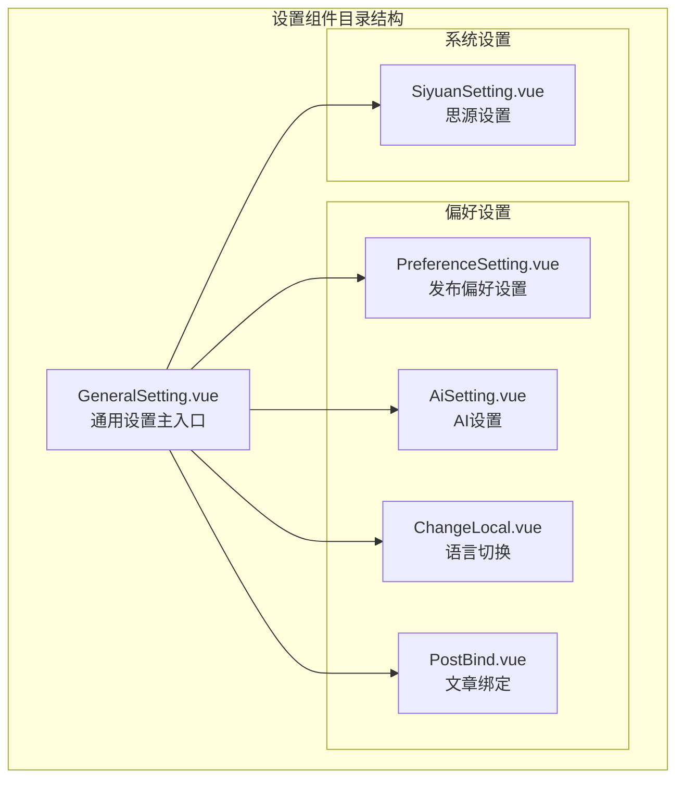
```mermaid
graph TB
subgraph "设置组件目录结构"
GS[GeneralSetting.vue<br/>通用设置主入口]
subgraph "偏好设置"
PS[PreferenceSetting.vue<br/>发布偏好设置]
AS[AiSetting.vue<br/>AI设置]
CL[ChangeLocal.vue<br/>语言切换]
PB[PostBind.vue<br/>文章绑定]
end
subgraph "系统设置"
SS[SiyuanSetting.vue<br/>思源设置]
end
end
GS --> PS
GS --> AS
GS --> CL
GS --> PB
GS --> SS
```

**图表来源**
- [GeneralSetting.vue:17-37](file://src/components/set/GeneralSetting.vue#L17-L37)
- [PreferenceSetting.vue:51-116](file://src/components/set/preference/PreferenceSetting.vue#L51-L116)

**章节来源**
- [GeneralSetting.vue:1-43](file://src/components/set/GeneralSetting.vue#L1-L43)
- [PreferenceSetting.vue:1-123](file://src/components/set/preference/PreferenceSetting.vue#L1-L123)

## 核心组件

### 通用设置主入口

`GeneralSetting.vue` 作为整个设置系统的主入口，采用标签页布局组织各个设置模块：

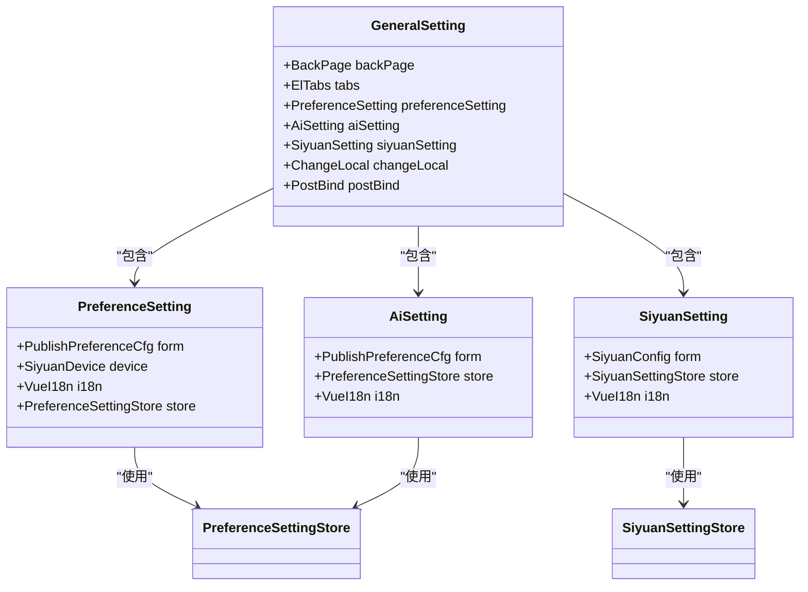
```mermaid
classDiagram
class GeneralSetting {
+BackPage backPage
+ElTabs tabs
+PreferenceSetting preferenceSetting
+AiSetting aiSetting
+SiyuanSetting siyuanSetting
+ChangeLocal changeLocal
+PostBind postBind
}
class PreferenceSetting {
+PublishPreferenceCfg form
+SiyuanDevice device
+VueI18n i18n
+PreferenceSettingStore store
}
class AiSetting {
+PublishPreferenceCfg form
+PreferenceSettingStore store
+VueI18n i18n
}
class SiyuanSetting {
+SiyuanConfig form
+SiyuanSettingStore store
+VueI18n i18n
}
GeneralSetting --> PreferenceSetting : "包含"
GeneralSetting --> AiSetting : "包含"
GeneralSetting --> SiyuanSetting : "包含"
PreferenceSetting --> PreferenceSettingStore : "使用"
AiSetting --> PreferenceSettingStore : "使用"
SiyuanSetting --> SiyuanSettingStore : "使用"
```

**图表来源**
- [GeneralSetting.vue:10-15](file://src/components/set/GeneralSetting.vue#L10-L15)
- [PreferenceSetting.vue:14-25](file://src/components/set/preference/PreferenceSetting.vue#L14-L25)

### 发布偏好设置

发布偏好设置组件提供了丰富的配置选项，包括内容处理、菜单显示控制、AI 设置等：

**章节来源**
- [PreferenceSetting.vue:27-48](file://src/components/set/preference/PreferenceSetting.vue#L27-L48)
- [publishPreferenceCfg.ts:19-103](file://src/models/publishPreferenceCfg.ts#L19-L103)

## 架构概览

系统采用分层架构设计，通过 Store-View-Composable 模式实现数据流管理：

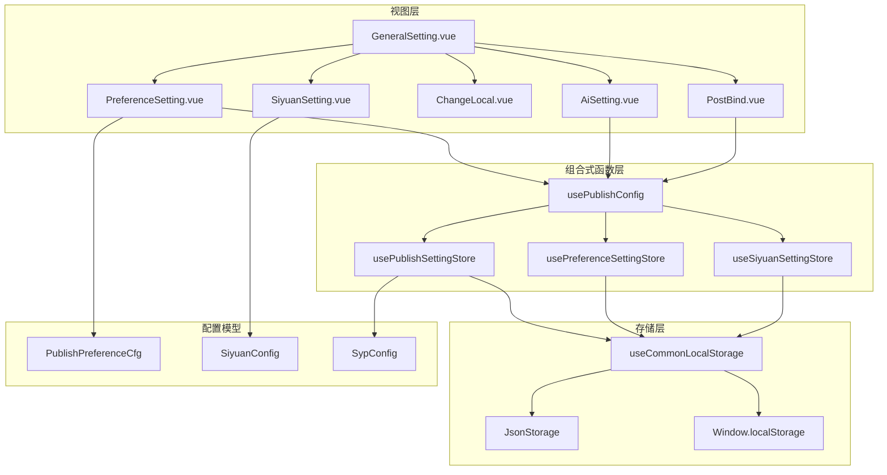
```mermaid
graph TD
subgraph "视图层"
GS[GeneralSetting.vue]
PS[PreferenceSetting.vue]
AS[AiSetting.vue]
CL[ChangeLocal.vue]
PB[PostBind.vue]
SS[SiyuanSetting.vue]
end
subgraph "组合式函数层"
UPC[usePublishConfig]
UPI[usePreferenceSettingStore]
USS[useSiyuanSettingStore]
UPS[usePublishSettingStore]
end
subgraph "存储层"
JLS[JsonStorage]
WLS[Window.localStorage]
LST[useCommonLocalStorage]
end
subgraph "配置模型"
PPC[PublishPreferenceCfg]
SC[SiyuanConfig]
SYPC[SypConfig]
end
GS --> PS
GS --> AS
GS --> CL
GS --> PB
GS --> SS
PS --> UPC
AS --> UPC
PB --> UPC
UPC --> UPS
UPC --> UPI
UPC --> USS
UPS --> LST
UPI --> LST
USS --> LST
LST --> JLS
LST --> WLS
PS --> PPC
SS --> SC
UPS --> SYPC
```

**图表来源**
- [usePublishConfig.ts:26-95](file://src/composables/usePublishConfig.ts#L26-L95)
- [useCommonLocalStorage.ts:27-55](file://src/stores/common/useCommonLocalStorage.ts#L27-L55)

## 详细组件分析

### 思源设置组件

思源设置组件负责管理与思源笔记相关的配置信息：

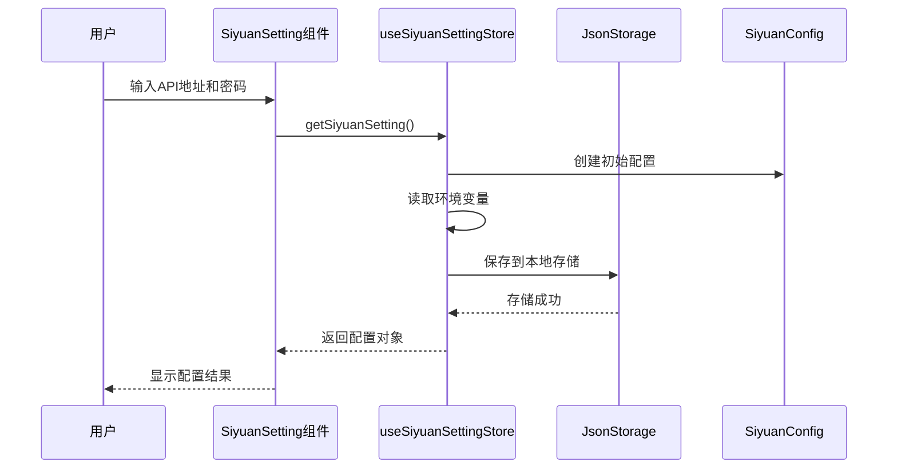
```mermaid
sequenceDiagram
participant User as 用户
participant SS as SiyuanSetting组件
participant USS as useSiyuanSettingStore
participant JLS as JsonStorage
participant SC as SiyuanConfig
User->>SS : 输入API地址和密码
SS->>USS : getSiyuanSetting()
USS->>SC : 创建初始配置
USS->>USS : 读取环境变量
USS->>JLS : 保存到本地存储
JLS-->>USS : 存储成功
USS-->>SS : 返回配置对象
SS-->>User : 显示配置结果
```

**图表来源**
- [SiyuanSetting.vue:17](file://src/components/set/SiyuanSetting.vue#L17)
- [useSiyuanSettingStore.ts:36-62](file://src/stores/useSiyuanSettingStore.ts#L36-L62)

**章节来源**
- [SiyuanSetting.vue:1-40](file://src/components/set/SiyuanSetting.vue#L1-L40)
- [useSiyuanSettingStore.ts:1-81](file://src/stores/useSiyuanSettingStore.ts#L1-L81)

### 发布偏好设置组件

发布偏好设置组件提供了全面的发布行为控制：

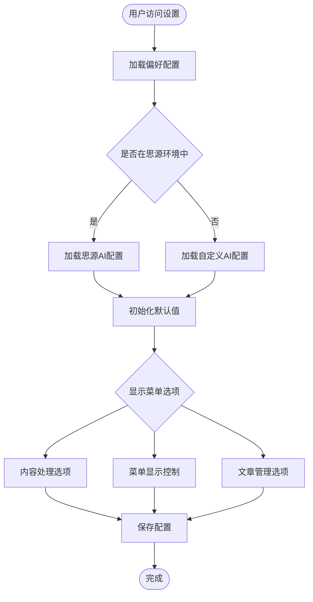
```mermaid
flowchart TD
Start([用户访问设置]) --> LoadConfig[加载偏好配置]
LoadConfig --> CheckSiyuan{是否在思源环境中}
CheckSiyuan --> |是| LoadSiyuanAI[加载思源AI配置]
CheckSiyuan --> |否| LoadCustomAI[加载自定义AI配置]
LoadSiyuanAI --> InitDefaults[初始化默认值]
LoadCustomAI --> InitDefaults
InitDefaults --> ShowMenu{显示菜单选项}
ShowMenu --> ContentOps[内容处理选项]
ShowMenu --> MenuOps[菜单显示控制]
ShowMenu --> ArticleOps[文章管理选项]
ContentOps --> SaveConfig[保存配置]
MenuOps --> SaveConfig
ArticleOps --> SaveConfig
SaveConfig --> End([完成])
```

**图表来源**
- [PreferenceSetting.vue:66-114](file://src/components/set/preference/PreferenceSetting.vue#L66-L114)
- [usePreferenceSettingStore.ts:34-67](file://src/stores/usePreferenceSettingStore.ts#L34-L67)

**章节来源**
- [PreferenceSetting.vue:1-123](file://src/components/set/preference/PreferenceSetting.vue#L1-L123)
- [usePreferenceSettingStore.ts:1-90](file://src/stores/usePreferenceSettingStore.ts#L1-L90)

### AI 设置组件

AI 设置组件支持多种 AI 服务提供商的配置：

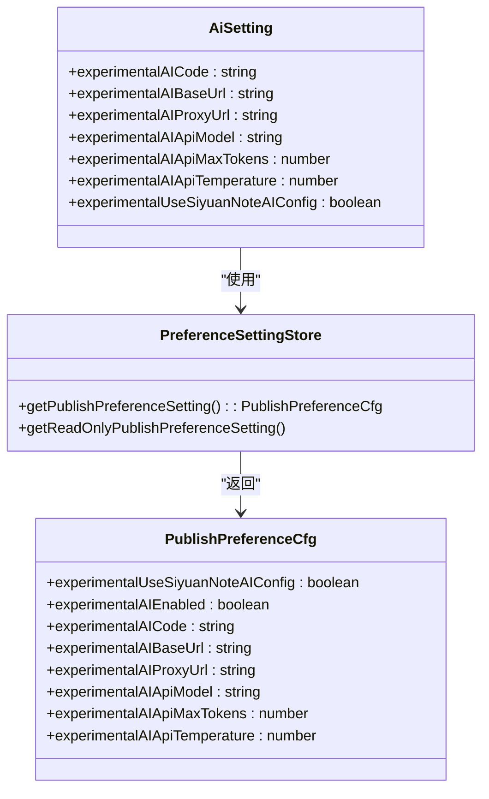
```mermaid
classDiagram
class AiSetting {
+experimentalAICode : string
+experimentalAIBaseUrl : string
+experimentalAIProxyUrl : string
+experimentalAIApiModel : string
+experimentalAIApiMaxTokens : number
+experimentalAIApiTemperature : number
+experimentalUseSiyuanNoteAIConfig : boolean
}
class PreferenceSettingStore {
+getPublishPreferenceSetting() : PublishPreferenceCfg
+getReadOnlyPublishPreferenceSetting()
}
class PublishPreferenceCfg {
+experimentalUseSiyuanNoteAIConfig : boolean
+experimentalAIEnabled : boolean
+experimentalAICode : string
+experimentalAIBaseUrl : string
+experimentalAIProxyUrl : string
+experimentalAIApiModel : string
+experimentalAIApiMaxTokens : number
+experimentalAIApiTemperature : number
}
AiSetting --> PreferenceSettingStore : "使用"
PreferenceSettingStore --> PublishPreferenceCfg : "返回"
```

**图表来源**
- [AiSetting.vue:17](file://src/components/set/preference/AiSetting.vue#L17)
- [publishPreferenceCfg.ts:19-103](file://src/models/publishPreferenceCfg.ts#L19-L103)

**章节来源**
- [AiSetting.vue:1-121](file://src/components/set/preference/AiSetting.vue#L1-L121)
- [publishPreferenceCfg.ts:1-106](file://src/models/publishPreferenceCfg.ts#L1-L106)

### 语言切换组件

语言切换组件支持多语言环境的动态切换：

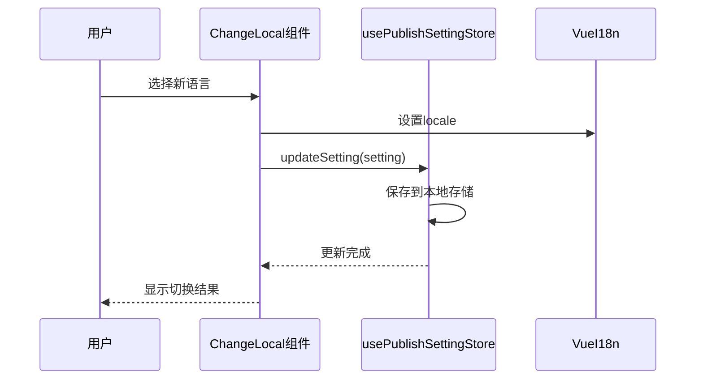
```mermaid
sequenceDiagram
participant User as 用户
participant CL as ChangeLocal组件
participant UPS as usePublishSettingStore
participant I18n as VueI18n
User->>CL : 选择新语言
CL->>I18n : 设置locale
CL->>UPS : updateSetting(setting)
UPS->>UPS : 保存到本地存储
UPS-->>CL : 更新完成
CL-->>User : 显示切换结果
```

**图表来源**
- [ChangeLocal.vue:32-37](file://src/components/set/preference/ChangeLocal.vue#L32-L37)
- [usePublishSettingStore.ts:55-59](file://src/stores/usePublishSettingStore.ts#L55-L59)

**章节来源**
- [ChangeLocal.vue:1-60](file://src/components/set/preference/ChangeLocal.vue#L1-L60)

### 文章绑定组件

文章绑定组件用于管理文档与各平台文章ID的对应关系：

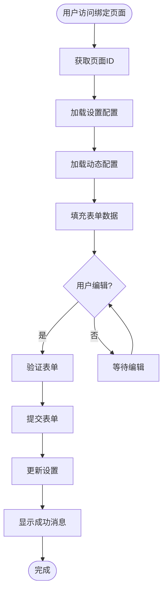
```mermaid
flowchart TD
Start([用户访问绑定页面]) --> GetPageId[获取页面ID]
GetPageId --> LoadSetting[加载设置配置]
LoadSetting --> LoadDynamicCfg[加载动态配置]
LoadDynamicCfg --> FillFormData[填充表单数据]
FillFormData --> UserEdit{用户编辑?}
UserEdit --> |是| ValidateForm[验证表单]
UserEdit --> |否| WaitEdit[等待编辑]
ValidateForm --> SubmitForm[提交表单]
WaitEdit --> UserEdit
SubmitForm --> UpdateSetting[更新设置]
UpdateSetting --> Success[显示成功消息]
Success --> End([完成])
```

**图表来源**
- [PostBind.vue:54-82](file://src/components/set/preference/PostBind.vue#L54-L82)
- [PostBind.vue:89-113](file://src/components/set/preference/PostBind.vue#L89-L113)

**章节来源**
- [PostBind.vue:1-168](file://src/components/set/preference/PostBind.vue#L1-L168)

## 博客验证修复

### V2 平台配置验证错误展示机制

最新版本修复了博客验证过程中 valiConf 到适配器的连接问题，现在保持正常的处理层。系统引入了完整的 V2 平台配置验证错误展示机制：

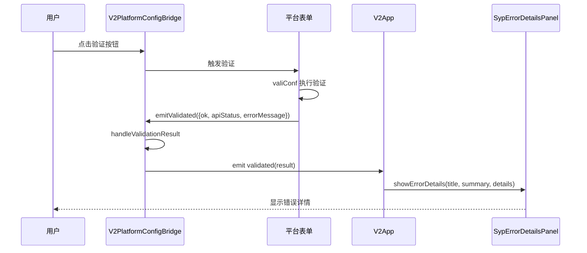
```mermaid
sequenceDiagram
participant User as 用户
participant V2Bridge as V2PlatformConfigBridge
participant Form as 平台表单
participant V2App as V2App
participant ErrorPanel as SypErrorDetailsPanel
User->>V2Bridge : 点击验证按钮
V2Bridge->>Form : 触发验证
Form->>Form : valiConf 执行验证
Form->>V2Bridge : emitValidated({ok, apiStatus, errorMessage})
V2Bridge->>V2Bridge : handleValidationResult
V2Bridge->>V2App : emit validated(result)
V2App->>ErrorPanel : showErrorDetails(title, summary, details)
ErrorPanel-->>User : 显示错误详情
```

**图表来源**
- [platformConfigActionBridge.ts:12-26](file://src/components/v2/settings/bridge/platformConfigActionBridge.ts#L12-L26)
- [V2PlatformConfigBridge.vue:167-175](file://src/components/v2/settings/V2PlatformConfigBridge.vue#L167-L175)

### 错误契约定义

系统定义了稳定的 `V2PlatformConfigValidationResult` 契约，确保验证失败时能够完整传递错误信息：

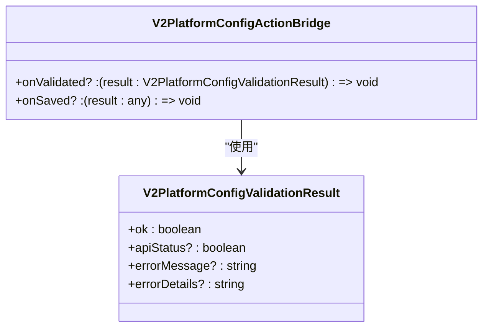
```mermaid
classDiagram
class V2PlatformConfigValidationResult {
+ok : boolean
+apiStatus? : boolean
+errorMessage? : string
+errorDetails? : string
}
class V2PlatformConfigActionBridge {
+onValidated? : (result : V2PlatformConfigValidationResult) => void
+onSaved? : (result : any) => void
}
V2PlatformConfigActionBridge --> V2PlatformConfigValidationResult : "使用"
```

**图表来源**
- [platformConfigActionBridge.ts:12-22](file://src/components/v2/settings/bridge/platformConfigActionBridge.ts#L12-L22)

**章节来源**
- [platformConfigActionBridge.ts:1-27](file://src/components/v2/settings/bridge/platformConfigActionBridge.ts#L1-L27)
- [V2PlatformConfigBridge.vue:167-175](file://src/components/v2/settings/V2PlatformConfigBridge.vue#L167-L175)

## XML-RPC 处理链

### 处理链架构更新

系统现在保持正常的处理层，特别是 preserve normalizeXmlrpcResponseText 和 proxyXmlrpc 处理链：

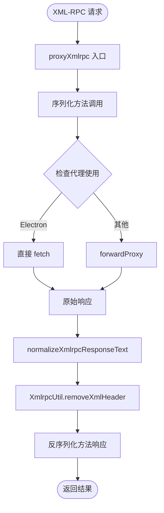
```mermaid
flowchart TD
Start([XML-RPC 请求]) --> ProxyXmlrpc[proxyXmlrpc 入口]
ProxyXmlrpc --> Serialize[序列化方法调用]
Serialize --> CheckProxy{检查代理使用}
CheckProxy --> |Electron| DirectFetch[直接 fetch]
CheckProxy --> |其他| ForwardProxy[forwardProxy]
DirectFetch --> RawResponse[原始响应]
ForwardProxy --> RawResponse
RawResponse --> Normalize[normalizeXmlrpcResponseText]
Normalize --> RemoveHeader[XmlrpcUtil.removeXmlHeader]
RemoveHeader --> Deserialize[反序列化方法响应]
Deserialize --> End([返回结果])
```

**图表来源**
- [useProxy.ts:112-134](file://src/composables/useProxy.ts#L112-L134)
- [xmlrpcResponseUtil.ts:128-157](file://src/utils/xmlrpcResponseUtil.ts#L128-L157)

### normalizeXmlrpcResponseText 处理

新的处理链确保 XML-RPC 响应的正确处理：

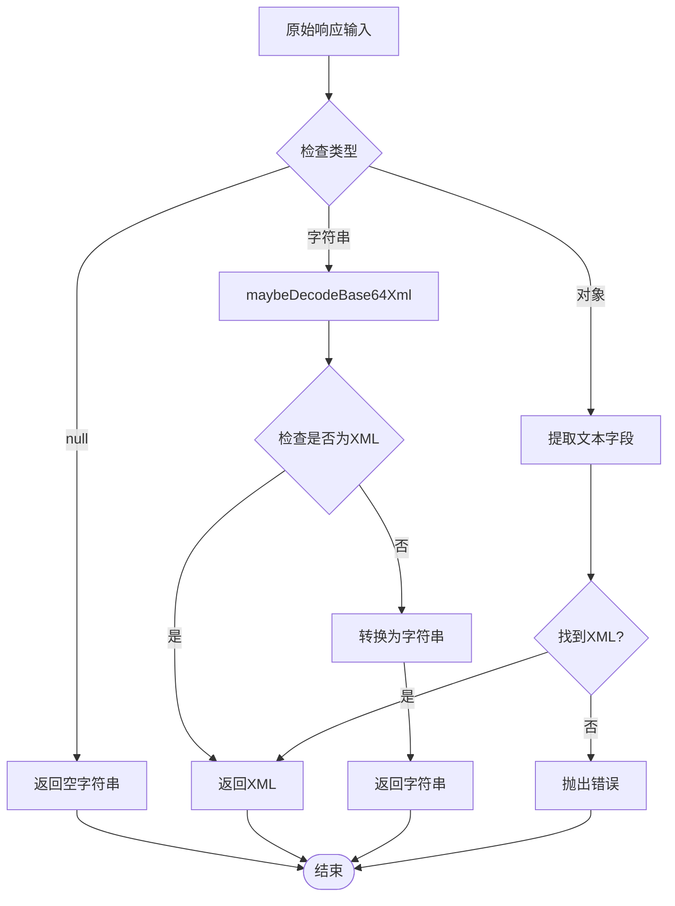
```mermaid
flowchart TD
RawInput[原始响应输入] --> CheckType{检查类型}
CheckType --> |字符串| MaybeDecode[maybeDecodeBase64Xml]
CheckType --> |对象| ExtractField[提取文本字段]
CheckType --> |null| EmptyReturn[返回空字符串]
MaybeDecode --> CheckXML{检查是否为XML}
CheckXML --> |是| ReturnXML[返回XML]
CheckXML --> |否| FallbackString[转换为字符串]
ExtractField --> FoundXML{找到XML?}
FoundXML --> |是| ReturnXML
FoundXML --> |否| ThrowError[抛出错误]
FallbackString --> ReturnString[返回字符串]
EmptyReturn --> End([结束])
ReturnXML --> End
ReturnString --> End
ThrowError --> End
```

**图表来源**
- [xmlrpcResponseUtil.ts:128-157](file://src/utils/xmlrpcResponseUtil.ts#L128-L157)

**章节来源**
- [useProxy.ts:112-134](file://src/composables/useProxy.ts#L112-L134)
- [xmlrpcResponseUtil.ts:128-157](file://src/utils/xmlrpcResponseUtil.ts#L128-L157)

## 依赖关系分析

系统采用模块化设计，各组件之间的依赖关系清晰明确：

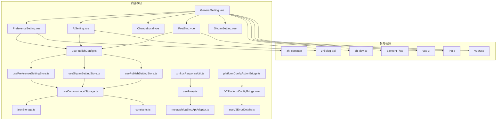
```mermaid
graph TB
subgraph "外部依赖"
Vue[Vue 3]
ElementPlus[Element Plus]
Pinia[Pinia]
VueUse[VueUse]
ZhiDevice[zhi-device]
ZhiBlogAPI[zhi-blog-api]
ZhiCommon[zhi-common]
end
subgraph "内部模块"
GeneralSetting[GeneralSetting.vue]
PreferenceSetting[PreferenceSetting.vue]
AiSetting[AiSetting.vue]
ChangeLocal[ChangeLocal.vue]
PostBind[PostBind.vue]
SiyuanSetting[SiyuanSetting.vue]
usePublishConfig[usePublishConfig.ts]
usePreferenceSettingStore[usePreferenceSettingStore.ts]
useSiyuanSettingStore[useSiyuanSettingStore.ts]
usePublishSettingStore[usePublishSettingStore.ts]
useCommonLocalStorage[useCommonLocalStorage.ts]
jsonStorage[jsonStorage.ts]
constants[constants.ts]
xmlrpcResponseUtil[xmlrpcResponseUtil.ts]
useProxy[useProxy.ts]
metaweblogBlogApiAdaptor[metaweblogBlogApiAdaptor.ts]
platformConfigActionBridge[platformConfigActionBridge.ts]
V2PlatformConfigBridge[V2PlatformConfigBridge.vue]
useV2ErrorDetails[useV2ErrorDetails.ts]
end
GeneralSetting --> PreferenceSetting
GeneralSetting --> AiSetting
GeneralSetting --> ChangeLocal
GeneralSetting --> PostBind
GeneralSetting --> SiyuanSetting
PreferenceSetting --> usePublishConfig
AiSetting --> usePublishConfig
PostBind --> usePublishConfig
usePublishConfig --> usePreferenceSettingStore
usePublishConfig --> useSiyuanSettingStore
usePublishConfig --> usePublishSettingStore
usePreferenceSettingStore --> useCommonLocalStorage
useSiyuanSettingStore --> useCommonLocalStorage
usePublishSettingStore --> useCommonLocalStorage
useCommonLocalStorage --> jsonStorage
useCommonLocalStorage --> constants
GeneralSetting --> ElementPlus
GeneralSetting --> Vue
GeneralSetting --> Pinia
GeneralSetting --> VueUse
PreferenceSetting --> ZhiCommon
AiSetting --> ZhiBlogAPI
PostBind --> ZhiDevice
xmlrpcResponseUtil --> useProxy
useProxy --> metaweblogBlogApiAdaptor
platformConfigActionBridge --> V2PlatformConfigBridge
V2PlatformConfigBridge --> useV2ErrorDetails
```

**图表来源**
- [GeneralSetting.vue:11-12](file://src/components/set/GeneralSetting.vue#L11-L12)
- [useCommonLocalStorage.ts:10-11](file://src/stores/common/useCommonLocalStorage.ts#L10-L11)

**章节来源**
- [usePublishConfig.ts:10-18](file://src/composables/usePublishConfig.ts#L10-L18)
- [useCommonLocalStorage.ts:9-14](file://src/stores/common/useCommonLocalStorage.ts#L9-L14)

## 性能考虑

系统在设计时充分考虑了性能优化：

### 存储策略优化
- **条件存储适配器**: 根据运行环境自动选择合适的存储方案
- **响应式数据绑定**: 使用 Vue 3 的响应式系统减少不必要的重渲染
- **缓存机制**: 设置存储采用缓存策略避免频繁的磁盘 I/O 操作

### 异步操作处理
- **异步配置加载**: 使用 async/await 处理异步配置加载
- **延迟初始化**: 配置在首次使用时才进行初始化
- **批量更新**: 支持批量更新设置以减少存储写入次数

### 内存管理
- **只读引用**: 提供只读版本的配置引用避免意外修改
- **垃圾回收**: 合理的生命周期管理确保内存及时释放

### 错误处理优化
- **错误详情脱敏**: 使用 `sanitizeSensitiveForLog` 对敏感信息进行脱敏处理
- **错误展示复用**: 复用 `SypErrorDetailsPanel` 组件避免重复实现
- **内联摘要显示**: 提供友好的内联错误摘要，避免全局 Toast 的重复提示

## 故障排除指南

### 常见问题及解决方案

#### 设置无法保存
1. **检查存储权限**: 确认应用具有文件系统写入权限
2. **验证配置格式**: 检查配置数据的 JSON 格式是否正确
3. **清理缓存**: 清除浏览器缓存或重新启动应用

#### 语言切换无效
1. **确认设置更新**: 检查设置是否已成功保存到存储
2. **刷新页面**: 强制刷新页面以应用新的语言设置
3. **检查环境变量**: 验证环境变量配置是否正确

#### AI 配置连接失败
1. **验证 API 密钥**: 检查 API 密钥是否正确且未过期
2. **测试网络连接**: 确认网络连接正常且可访问 API 服务器
3. **检查代理设置**: 验证代理配置是否正确

#### XML-RPC 验证失败
1. **检查代理配置**: 确认 `shouldXmlrpcUseSiyuanForwardProxy` 判断逻辑正确
2. **验证响应格式**: 检查 `normalizeXmlrpcResponseText` 是否正确处理响应
3. **查看错误详情**: 使用 `SypErrorDetailsPanel` 查看详细的错误诊断信息

#### V2 平台配置验证问题
1. **确认错误契约**: 检查 `V2PlatformConfigValidationResult` 是否包含完整的错误信息
2. **验证桥接层**: 确认 `V2PlatformConfigBridge` 是否正确转发验证结果
3. **检查错误展示**: 验证 `SypErrorDetailsPanel` 是否正确显示错误详情

**章节来源**
- [useCommonLocalStorage.ts:43-55](file://src/stores/common/useCommonLocalStorage.ts#L43-L55)
- [jsonStorage.ts:29-51](file://src/stores/common/jsonStorage.ts#L29-L51)
- [xmlrpcResponseUtil.ts:128-157](file://src/utils/xmlrpcResponseUtil.ts#L128-L157)

## 结论

通用博客设置组件通过模块化的设计和清晰的架构，为用户提供了强大而灵活的配置管理功能。系统支持多种博客平台的配置管理，具备良好的扩展性和维护性。

**更新** 最新版本修复了博客验证过程中的关键问题，包括：

- **valiConf 到适配器连接问题**: 现在保持正常的处理层，确保验证流程的完整性
- **V2 平台配置验证错误展示**: 引入完整的错误展示机制，提供友好的用户体验
- **XML-RPC 处理链优化**: 保持正常的处理层，特别是 preserve normalizeXmlrpcResponseText 和 proxyXmlrpc 处理链
- **错误详情脱敏**: 使用统一的脱敏策略确保敏感信息的安全

主要特点包括：
- **模块化架构**: 清晰的组件分离和职责划分
- **响应式设计**: 基于 Vue 3 的现代前端技术栈
- **跨平台支持**: 支持桌面端和浏览器端运行
- **持久化存储**: 智能的存储适配器确保数据安全
- **国际化支持**: 完善的多语言支持机制
- **错误处理增强**: 完善的错误展示和诊断机制
- **安全性保障**: 统一的敏感信息脱敏处理

该组件为 SiYuan 笔记插件的博客发布功能提供了坚实的基础，用户可以通过直观的界面轻松配置各种发布需求。