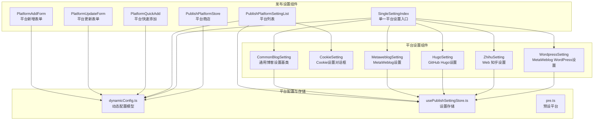
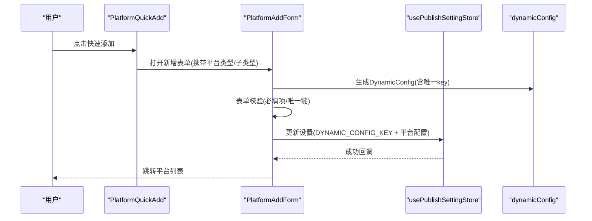
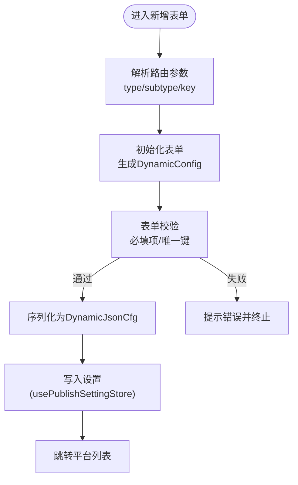
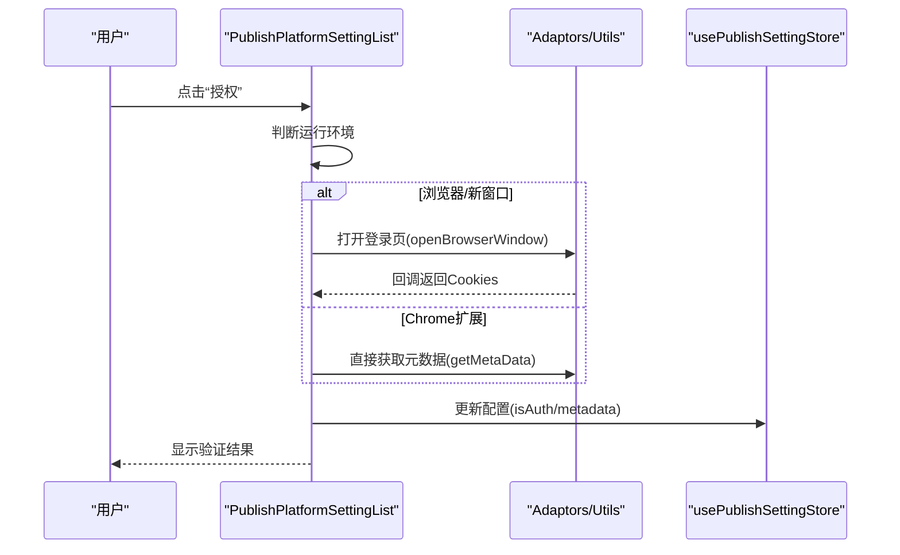
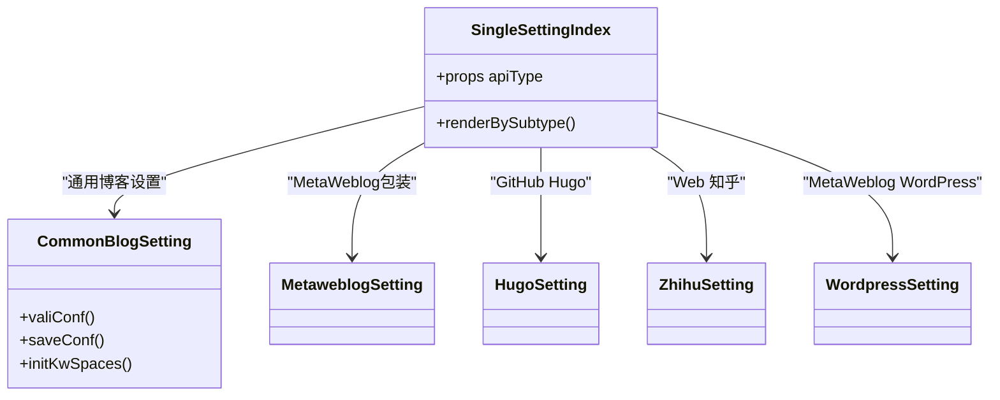
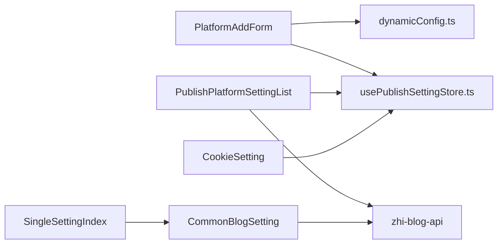

# 发布设置组件

<cite>
**本文档引用的文件**
- [PlatformAddForm.vue](file://src/components/set/publish/form/PlatformAddForm.vue)
- [PlatformUpdateForm.vue](file://src/components/set/publish/form/PlatformUpdateForm.vue)
- [PlatformQuickAdd.vue](file://src/components/set/publish/form/PlatformQuickAdd.vue)
- [PublishPlatformSettingList.vue](file://src/components/set/publish/platform/PublishPlatformSettingList.vue)
- [SingleSettingIndex.vue](file://src/components/set/publish/singleplatform/SingleSettingIndex.vue)
- [dynamicConfig.ts](file://src/platforms/dynamicConfig.ts)
- [usePublishSettingStore.ts](file://src/stores/usePublishSettingStore.ts)
- [CommonBlogSetting.vue](file://src/components/set/publish/singleplatform/base/CommonBlogSetting.vue)
- [CookieSetting.vue](file://src/components/set/publish/singleplatform/base/CookieSetting.vue)
- [MetaweblogSetting.vue](file://src/components/set/publish/singleplatform/base/impl/MetaweblogSetting.vue)
- [pre.ts](file://src/platforms/pre.ts)
- [PublishPlatformStore.vue](file://src/components/set/publish/platform/PublishPlatformStore.vue)
- [HugoSetting.vue](file://src/components/set/publish/singleplatform/github/HugoSetting.vue)
- [ZhihuSetting.vue](file://src/components/set/publish/singleplatform/web/ZhihuSetting.vue)
- [WordpressSetting.vue](file://src/components/set/publish/singleplatform/metaweblog/WordpressSetting.vue)
</cite>

## 目录
1. [简介](#简介)
2. [项目结构](#项目结构)
3. [核心组件](#核心组件)
4. [架构总览](#架构总览)
5. [详细组件分析](#详细组件分析)
6. [依赖关系分析](#依赖关系分析)
7. [性能考虑](#性能考虑)
8. [故障排除指南](#故障排除指南)
9. [结论](#结论)

## 简介
本文件面向发布设置组件的使用者与维护者，系统性梳理发布设置页面的整体架构与实现细节。重点覆盖以下方面：
- 表单组件设计模式：PlatformAddForm、PlatformUpdateForm、PlatformQuickAdd
- 平台列表组件 PublishPlatformSettingList 的增删改查与状态管理
- 单一平台设置入口 SingleSettingIndex 的路由分发与组件选择机制
- 平台特定设置组件的分类架构：GitHub、GitLab、Web、Metaweblog 等
- 数据验证、错误处理与状态管理的实现要点

## 项目结构
发布设置相关的核心目录位于 `src/components/set/publish/`，主要分为三层：
- form：平台添加/更新/快速添加的表单层
- platform：平台列表与导入的平台层
- singleplatform：单一平台设置入口与具体平台设置组件层

图表来源
- [PlatformAddForm.vue:10-200](file://src/components/set/publish/form/PlatformAddForm.vue#L10-L200)
- [PlatformUpdateForm.vue:10-125](file://src/components/set/publish/form/PlatformUpdateForm.vue#L10-L125)
- [PlatformQuickAdd.vue:10-120](file://src/components/set/publish/form/PlatformQuickAdd.vue#L10-L120)
- [PublishPlatformSettingList.vue:10-120](file://src/components/set/publish/platform/PublishPlatformSettingList.vue#L10-L120)
- [SingleSettingIndex.vue:10-75](file://src/components/set/publish/singleplatform/SingleSettingIndex.vue#L10-L75)
- [PublishPlatformStore.vue:10-57](file://src/components/set/publish/platform/PublishPlatformStore.vue#L10-L57)
- [dynamicConfig.ts:13-113](file://src/platforms/dynamicConfig.ts#L13-L113)
- [usePublishSettingStore.ts:21-94](file://src/stores/usePublishSettingStore.ts#L21-L94)
- [CommonBlogSetting.vue:10-50](file://src/components/set/publish/singleplatform/base/CommonBlogSetting.vue#L10-L50)
- [CookieSetting.vue:10-40](file://src/components/set/publish/singleplatform/base/CookieSetting.vue#L10-L40)
- [MetaweblogSetting.vue:10-27](file://src/components/set/publish/singleplatform/base/impl/MetaweblogSetting.vue#L10-L27)
- [HugoSetting.vue:10-41](file://src/components/set/publish/singleplatform/github/HugoSetting.vue#L10-L41)
- [ZhihuSetting.vue:10-39](file://src/components/set/publish/singleplatform/web/ZhihuSetting.vue#L10-L39)
- [WordpressSetting.vue:10-52](file://src/components/set/publish/singleplatform/metaweblog/WordpressSetting.vue#L10-L52)

章节来源
- [PlatformAddForm.vue:10-200](file://src/components/set/publish/form/PlatformAddForm.vue#L10-L200)
- [PlatformUpdateForm.vue:10-125](file://src/components/set/publish/form/PlatformUpdateForm.vue#L10-L125)
- [PlatformQuickAdd.vue:10-120](file://src/components/set/publish/form/PlatformQuickAdd.vue#L10-L120)
- [PublishPlatformSettingList.vue:10-120](file://src/components/set/publish/platform/PublishPlatformSettingList.vue#L10-L120)
- [SingleSettingIndex.vue:10-75](file://src/components/set/publish/singleplatform/SingleSettingIndex.vue#L10-L75)
- [PublishPlatformStore.vue:10-57](file://src/components/set/publish/platform/PublishPlatformStore.vue#L10-L57)

## 核心组件
本节聚焦于三大表单组件与平台列表组件的设计模式与职责边界。

- PlatformAddForm：负责“新增”平台的表单渲染与提交，包含子平台类型选择、动态配置生成、唯一键校验、Element Plus 表单校验与 Pinia 存储更新。
- PlatformUpdateForm：负责“更新”平台的表单渲染与提交，提供平台基础信息修改能力，授权模式不可变更以保证配置一致性。
- PlatformQuickAdd：提供“快速添加”入口，支持按平台类型或全部平台展示预设模板，通过抽屉桥接打开新增表单。
- PublishPlatformSettingList：平台列表的主控组件，负责平台启用/禁用切换、删除、网页授权、Cookie 设置、验证等操作，统一管理状态与持久化。

章节来源
- [PlatformAddForm.vue:45-130](file://src/components/set/publish/form/PlatformAddForm.vue#L45-L130)
- [PlatformUpdateForm.vue:40-112](file://src/components/set/publish/form/PlatformUpdateForm.vue#L40-L112)
- [PlatformQuickAdd.vue:53-120](file://src/components/set/publish/form/PlatformQuickAdd.vue#L53-L120)
- [PublishPlatformSettingList.vue:51-120](file://src/components/set/publish/platform/PublishPlatformSettingList.vue#L51-L120)

## 架构总览
发布设置采用“配置驱动 + 组件分层”的架构模式：
- 配置驱动：dynamicConfig.ts 定义 DynamicConfig 模型与平台类型枚举，统一描述平台元数据与行为。
- 组件分层：表单层负责输入与校验，平台层负责列表与状态，单一设置层负责路由分发与具体平台组件渲染。
- 存储层：usePublishSettingStore.ts 提供统一的设置读写接口，确保配置持久化与缓存一致性。
- 预设层：pre.ts 提供平台预设模板，支持一键导入与扩展。

图表来源
- [PlatformQuickAdd.vue:86-104](file://src/components/set/publish/form/PlatformQuickAdd.vue#L86-L104)
- [PlatformAddForm.vue:96-130](file://src/components/set/publish/form/PlatformAddForm.vue#L96-L130)
- [usePublishSettingStore.ts:38-59](file://src/stores/usePublishSettingStore.ts#L38-L59)
- [dynamicConfig.ts:428-437](file://src/platforms/dynamicConfig.ts#L428-L437)

## 详细组件分析

### 表单组件设计模式
- PlatformAddForm
  - 关键点：子平台类型选择、动态配置生成、唯一键校验、Element Plus 表单校验、Pinia 更新。
  - 数据流：路由参数 → 初始化表单 → 生成 DynamicConfig → 校验 → 序列化为 DynamicJsonCfg → 写入设置。
  - 错误处理：子类型缺失、键冲突、校验失败均通过消息提示与日志记录反馈。
- PlatformUpdateForm
  - 关键点：基于平台 key 查询现有配置，允许修改除授权模式以外的字段。
  - 数据流：根据 key 读取配置 → 渲染表单 → 校验 → 替换 DynamicConfig → 写回设置。
- PlatformQuickAdd
  - 关键点：按平台类型或全部平台展示预设模板，通过抽屉桥接打开新增表单。
  - 交互：点击图标触发新增流程，支持内部路由与外部窗口两种打开方式。

图表来源
- [PlatformAddForm.vue:132-197](file://src/components/set/publish/form/PlatformAddForm.vue#L132-L197)
- [usePublishSettingStore.ts:38-59](file://src/stores/usePublishSettingStore.ts#L38-L59)
- [dynamicConfig.ts:336-392](file://src/platforms/dynamicConfig.ts#L336-L392)

章节来源
- [PlatformAddForm.vue:82-130](file://src/components/set/publish/form/PlatformAddForm.vue#L82-L130)
- [PlatformUpdateForm.vue:74-112](file://src/components/set/publish/form/PlatformUpdateForm.vue#L74-L112)
- [PlatformQuickAdd.vue:86-120](file://src/components/set/publish/form/PlatformQuickAdd.vue#L86-L120)

### 平台列表组件 PublishPlatformSettingList
- 职责与功能
  - 展示所有动态平台配置，支持启用/禁用切换、删除、设置入口、网页授权、Cookie 设置与验证。
  - 根据运行环境（Siyuan/Electron/Chrome Extension）选择不同的授权流程。
  - 维护 webAuthLoadingMap 状态，避免并发授权导致的状态错乱。
- 数据与状态
  - 从 usePublishSettingStore 读取设置，解析 DynamicJsonCfg，按平台类型分组。
  - 通过 replacePlatformByKey/deletePlatformByKey 等工具函数更新配置数组。
- 授权流程
  - 网页授权：打开登录页，支持自动/手动获取 Cookie，验证后更新 isAuth 与元数据。
  - Cookie 设置：弹出对话框，手动粘贴 Cookie，保存后触发验证。
- 错误处理
  - 授权失败时提供登出链接引导用户重新登录。
  - 加载与验证过程中的异常通过消息提示与日志记录反馈。

图表来源
- [PublishPlatformSettingList.vue:123-427](file://src/components/set/publish/platform/PublishPlatformSettingList.vue#L123-L427)
- [usePublishSettingStore.ts:38-59](file://src/stores/usePublishSettingStore.ts#L38-L59)

章节来源
- [PublishPlatformSettingList.vue:68-120](file://src/components/set/publish/platform/PublishPlatformSettingList.vue#L68-L120)
- [PublishPlatformSettingList.vue:121-432](file://src/components/set/publish/platform/PublishPlatformSettingList.vue#L121-L432)

### 单一平台设置入口 SingleSettingIndex
- 职责与机制
  - 根据平台 key 解析子平台类型，按类型映射到具体设置组件。
  - 支持 Electron 环境下的本地系统设置组件条件渲染。
  - 提供帮助文档键值，辅助用户定位配置说明。
- 组件分发
  - 通用博客：CommonBlogSetting 基类 + 具体平台配置（如 Hugo、WordPress）。
  - MetaWeblog：MetaweblogSetting 作为通用包装。
  - Web 平台：CustomWebSetting + 具体平台配置（如 Zhihu）。
  - GitHub/GitLab：各静态站点生成器设置组件（如 Hugo、Hexo、Vitepress 等）。

图表来源
- [SingleSettingIndex.vue:10-75](file://src/components/set/publish/singleplatform/SingleSettingIndex.vue#L10-L75)
- [CommonBlogSetting.vue:10-50](file://src/components/set/publish/singleplatform/base/CommonBlogSetting.vue#L10-L50)
- [MetaweblogSetting.vue:10-27](file://src/components/set/publish/singleplatform/base/impl/MetaweblogSetting.vue#L10-L27)
- [HugoSetting.vue:10-41](file://src/components/set/publish/singleplatform/github/HugoSetting.vue#L10-L41)
- [ZhihuSetting.vue:10-39](file://src/components/set/publish/singleplatform/web/ZhihuSetting.vue#L10-L39)
- [WordpressSetting.vue:10-52](file://src/components/set/publish/singleplatform/metaweblog/WordpressSetting.vue#L10-L52)

章节来源
- [SingleSettingIndex.vue:10-125](file://src/components/set/publish/singleplatform/SingleSettingIndex.vue#L10-L125)

### 平台特定设置组件分类架构
- GitHub 类
  - 代表组件：HugoSetting、HexoSetting、VitepressSetting 等。
  - 设计模式：通过 useXxxApi 获取默认配置，结合 Placeholder 提示文案，继承 CommonGithubSetting 实现统一校验与保存。
- GitLab 类
  - 代表组件：GitlabhugoSetting、GitlabhexoSetting 等。
  - 设计模式：与 GitHub 类似，针对 GitLab 场景定制配置与提示。
- Web 类
  - 代表组件：ZhihuSetting、CsdnSetting、WechatSetting 等。
  - 设计模式：CustomWebSetting + useXxxWeb 获取配置，适用于网页授权场景。
- MetaWeblog 类
  - 代表组件：WordpressSetting、CnblogsSetting、TypechoSetting 等。
  - 设计模式：MetaweblogSetting 作为通用包装，复用 CommonBlogSetting 的校验与保存逻辑。
- 通用博客基类
  - CommonBlogSetting：提供统一的校验、保存、知识空间加载、跨域代理设置等功能，具体平台通过 props.cfg 注入差异化配置。

章节来源
- [HugoSetting.vue:10-41](file://src/components/set/publish/singleplatform/github/HugoSetting.vue#L10-L41)
- [ZhihuSetting.vue:10-39](file://src/components/set/publish/singleplatform/web/ZhihuSetting.vue#L10-L39)
- [WordpressSetting.vue:10-52](file://src/components/set/publish/singleplatform/metaweblog/WordpressSetting.vue#L10-L52)
- [CommonBlogSetting.vue:10-50](file://src/components/set/publish/singleplatform/base/CommonBlogSetting.vue#L10-L50)

### 数据验证、错误处理与状态管理
- 数据验证
  - 表单层：Element Plus FormRules + 自定义校验（如子类型必选、唯一键校验）。
  - 平台层：校验授权（API 校验、Cookie 验证），更新 isAuth 与元数据。
- 错误处理
  - 统一通过 ElMessage 输出错误信息，日志记录异常堆栈。
  - 授权失败时提供登出链接，引导用户重新登录。
- 状态管理
  - 动态配置数组：setDynamicJsonCfg 按类型分组，便于后续渲染与筛选。
  - 运行状态：webAuthLoadingMap 控制授权按钮加载态，避免重复授权。
  - 存储更新：统一通过 usePublishSettingStore.updateSetting 写入持久化存储。

章节来源
- [PlatformAddForm.vue:61-95](file://src/components/set/publish/form/PlatformAddForm.vue#L61-L95)
- [PublishPlatformSettingList.vue:121-432](file://src/components/set/publish/platform/PublishPlatformSettingList.vue#L121-L432)
- [usePublishSettingStore.ts:38-91](file://src/stores/usePublishSettingStore.ts#L38-L91)
- [dynamicConfig.ts:336-392](file://src/platforms/dynamicConfig.ts#L336-L392)

## 依赖关系分析
- 组件耦合
  - 表单组件与 dynamicConfig.ts 强耦合，依赖其模型与工具函数。
  - 平台列表组件与存储层强耦合，依赖 usePublishSettingStore 进行读写。
  - 单一设置入口与具体平台组件弱耦合，通过子平台类型映射实现解耦。
- 外部依赖
  - Element Plus：表单、对话框、消息提示等 UI 组件。
  - zhi-blog-api：平台适配器与 API 封装，提供校验与元数据获取。
  - zhi-common：JSON/字符串/对象工具，保障配置解析与序列化安全。

图表来源
- [dynamicConfig.ts:13-113](file://src/platforms/dynamicConfig.ts#L13-L113)
- [usePublishSettingStore.ts:21-94](file://src/stores/usePublishSettingStore.ts#L21-L94)
- [CommonBlogSetting.vue:10-30](file://src/components/set/publish/singleplatform/base/CommonBlogSetting.vue#L10-L30)
- [CookieSetting.vue:10-40](file://src/components/set/publish/singleplatform/base/CookieSetting.vue#L10-L40)

章节来源
- [dynamicConfig.ts:13-113](file://src/platforms/dynamicConfig.ts#L13-L113)
- [usePublishSettingStore.ts:21-94](file://src/stores/usePublishSettingStore.ts#L21-L94)

## 性能考虑
- 渲染优化
  - 平台列表采用分组与懒加载策略，减少一次性渲染压力。
  - 授权按钮使用 loading 状态，避免重复点击导致的重复请求。
- 存储优化
  - 使用 Pinia 与异步存储封装，避免频繁读写造成阻塞。
  - 配置更新采用增量合并，减少不必要的重绘。
- 网络优化
  - 跨域代理与中间件按需启用，降低网络失败概率。
  - 授权流程尽量复用已有会话，减少重复登录成本。

## 故障排除指南
- 新增平台失败
  - 检查子平台类型是否选择、平台 key 是否唯一。
  - 查看控制台日志与 ElMessage 提示，确认表单校验是否通过。
- 授权失败
  - 网页授权：确认登录页是否可访问，Cookie 是否正确。
  - 手动 Cookie：确保粘贴的 Cookie 有效且未过期。
  - 登录过期：根据提示点击登出链接，重新授权。
- 配置不生效
  - 确认平台处于启用状态，且 isAuth 为真。
  - 重新保存配置并刷新页面，确保持久化写入成功。

章节来源
- [PlatformAddForm.vue:82-95](file://src/components/set/publish/form/PlatformAddForm.vue#L82-L95)
- [PublishPlatformSettingList.vue:367-378](file://src/components/set/publish/platform/PublishPlatformSettingList.vue#L367-L378)
- [CookieSetting.vue:68-80](file://src/components/set/publish/singleplatform/base/CookieSetting.vue#L68-L80)

## 结论
发布设置组件通过清晰的分层设计与配置驱动模式，实现了平台配置的可视化管理与可扩展性。表单组件负责输入与校验，平台列表组件负责状态与持久化，单一设置入口负责路由分发与具体平台组件渲染。配合完善的错误处理与状态管理，整体具备良好的用户体验与可维护性。建议在后续迭代中进一步增强配置导入导出、批量操作与配置模板能力，以提升高级用户的使用效率。