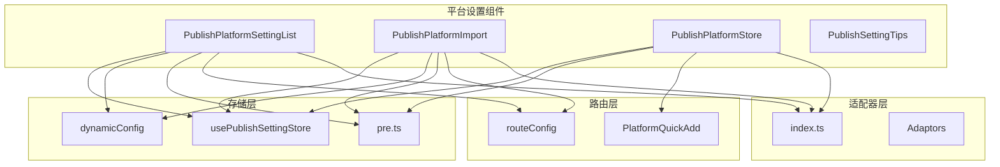
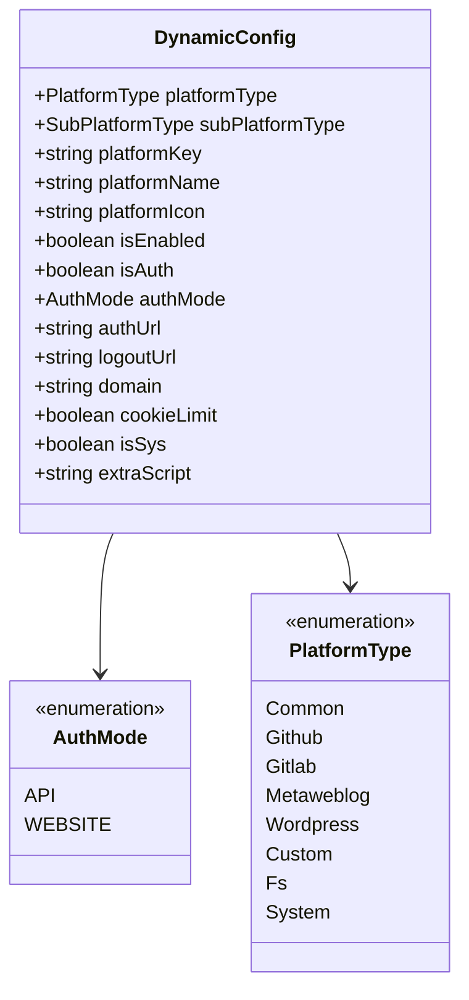
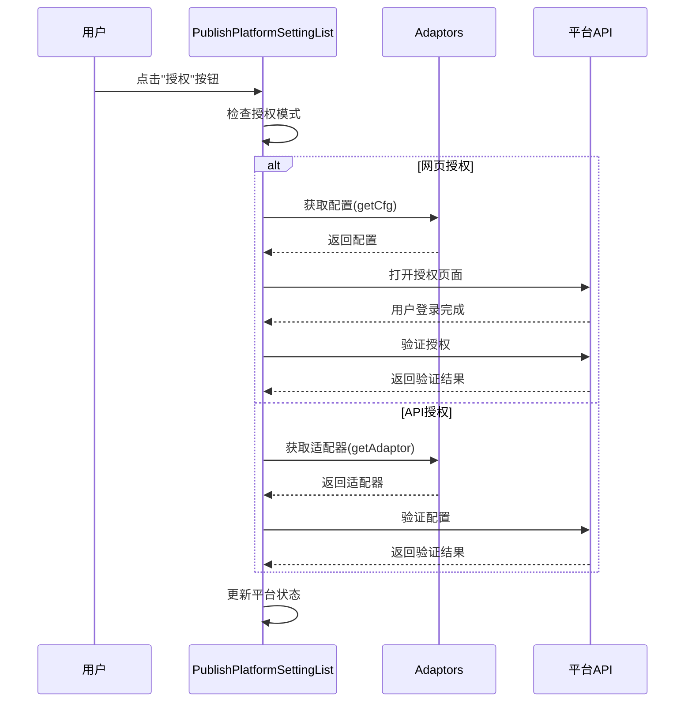
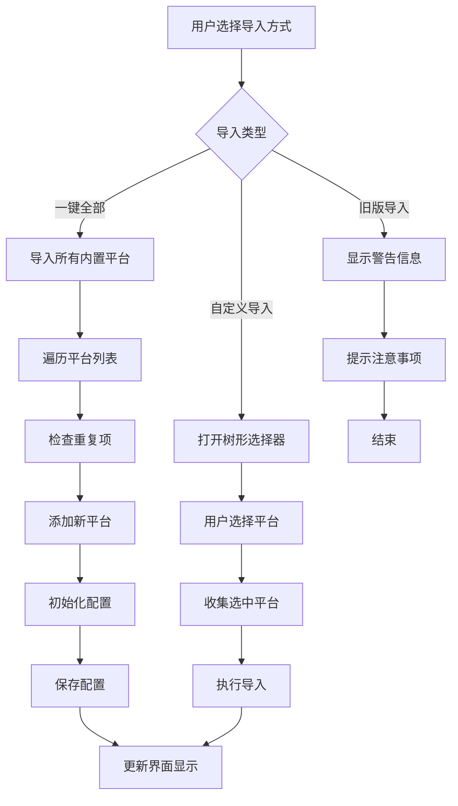
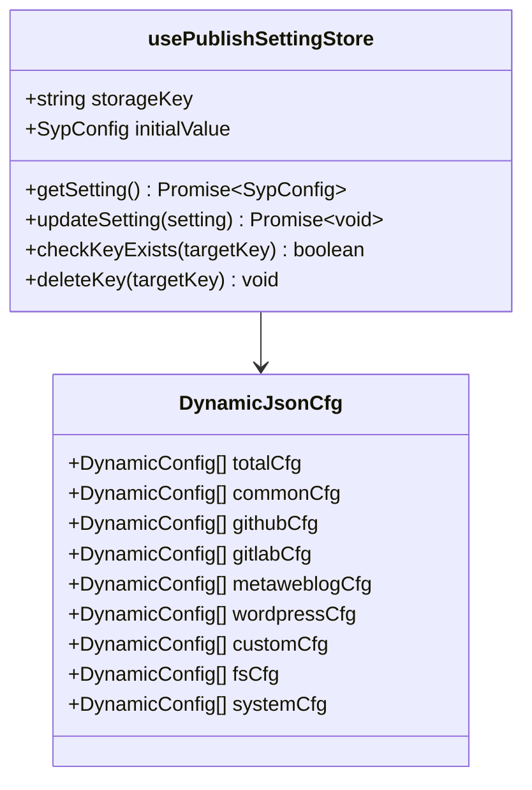
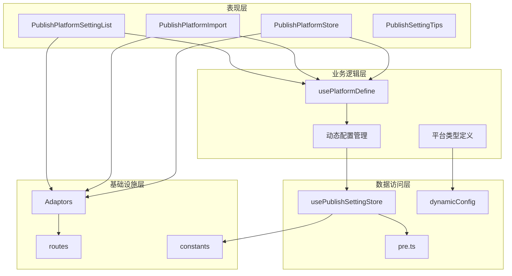
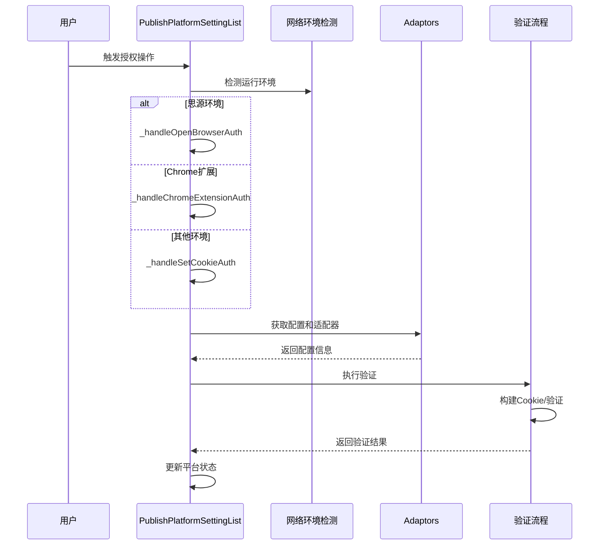
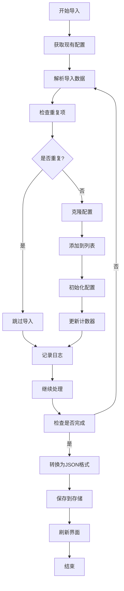
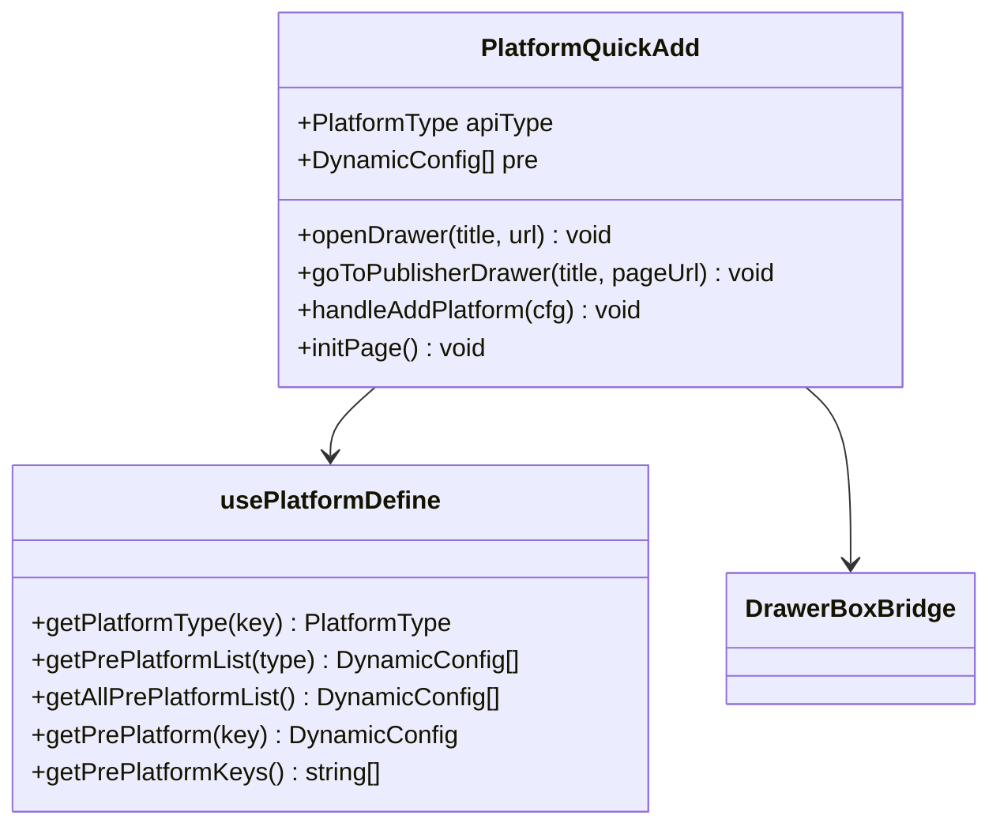
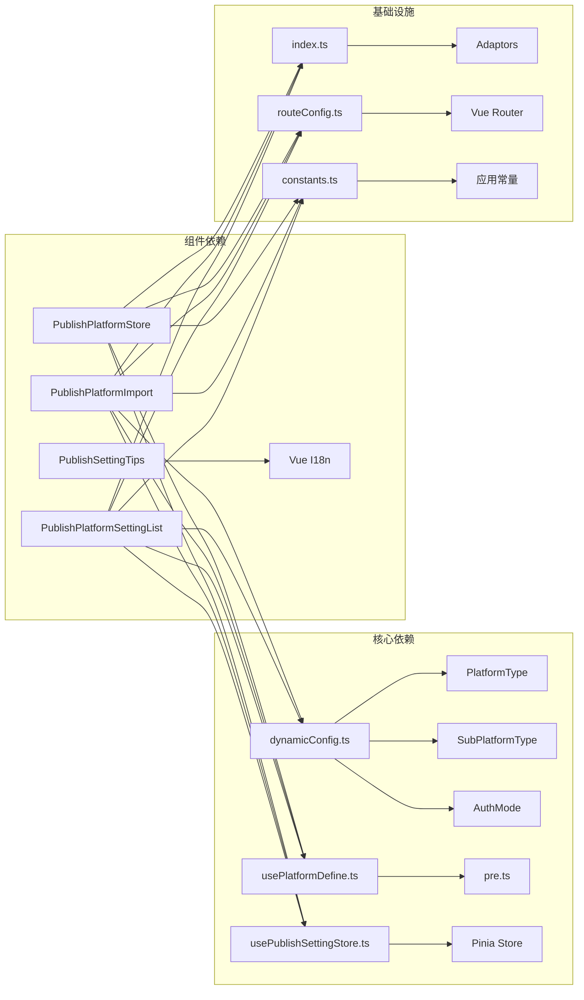

# 平台列表组件

<cite>
**本文档引用的文件**
- [PublishPlatformSettingList.vue](file://src/components/set/publish/platform/PublishPlatformSettingList.vue)
- [PublishPlatformImport.vue](file://src/components/set/publish/platform/PublishPlatformImport.vue)
- [PublishPlatformStore.vue](file://src/components/set/publish/platform/PublishPlatformStore.vue)
- [PublishSettingTips.vue](file://src/components/set/publish/platform/PublishSettingTips.vue)
- [usePublishSettingStore.ts](file://src/stores/usePublishSettingStore.ts)
- [dynamicConfig.ts](file://src/platforms/dynamicConfig.ts)
- [usePlatformDefine.ts](file://src/composables/usePlatformDefine.ts)
- [pre.ts](file://src/platforms/pre.ts)
- [constants.ts](file://src/utils/constants.ts)
- [routeConfig.ts](file://src/routes/routeConfig.ts)
- [index.ts](file://src/adaptors/index.ts)
- [PlatformQuickAdd.vue](file://src/components/set/publish/form/PlatformQuickAdd.vue)
</cite>

## 目录
1. [简介](#简介)
2. [项目结构](#项目结构)
3. [核心组件](#核心组件)
4. [架构概览](#架构概览)
5. [详细组件分析](#详细组件分析)
6. [依赖关系分析](#依赖关系分析)
7. [性能考虑](#性能考虑)
8. [故障排除指南](#故障排除指南)
9. [结论](#结论)

## 简介

本文档详细介绍了思源插件发布器项目中的平台列表组件系统，包括四个核心组件：PublishPlatformSettingList（平台设置列表）、PublishPlatformImport（平台导入组件）、PublishPlatformStore（平台存储管理）和PublishSettingTips（平台提示组件）。这些组件共同构成了平台配置管理的完整解决方案，支持平台配置的展示、排序、筛选、导入导出、CRUD操作和批量管理等功能。

## 项目结构

平台列表组件位于项目的组件系统中，采用模块化设计，每个组件都有明确的职责分工：

**图表来源**
- [PublishPlatformSettingList.vue:1-704](file://src/components/set/publish/platform/PublishPlatformSettingList.vue#L1-L704)
- [PublishPlatformImport.vue:1-371](file://src/components/set/publish/platform/PublishPlatformImport.vue#L1-L371)
- [PublishPlatformStore.vue:1-95](file://src/components/set/publish/platform/PublishPlatformStore.vue#L1-L95)
- [usePublishSettingStore.ts:1-95](file://src/stores/usePublishSettingStore.ts#L1-L95)

## 核心组件

### PublishPlatformSettingList 平台设置列表

PublishPlatformSettingList 是平台配置管理的核心界面组件，提供了完整的平台配置展示和管理功能。

#### 主要功能特性

1. **平台配置展示**：以卡片形式展示所有已配置的平台，包括平台图标、名称、授权状态等信息
2. **动态配置管理**：支持平台的启用/禁用切换、配置编辑、删除操作
3. **授权管理**：提供网页授权和API授权两种模式的支持
4. **新平台检测**：自动检测并提示新增的平台配置
5. **响应式布局**：支持不同屏幕尺寸的自适应显示

#### 数据结构设计

组件使用 `DynamicConfig` 类来管理平台配置信息，该类包含了平台的所有必要属性：

**图表来源**
- [dynamicConfig.ts:13-113](file://src/platforms/dynamicConfig.ts#L13-L113)
- [dynamicConfig.ts:118-121](file://src/platforms/dynamicConfig.ts#L118-L121)
- [dynamicConfig.ts:126-166](file://src/platforms/dynamicConfig.ts#L126-L166)

#### 授权机制实现

组件支持两种授权模式：

1. **API授权模式**：适用于需要API密钥或令牌的平台
2. **网页授权模式**：适用于需要浏览器登录的平台

**图表来源**
- [PublishPlatformSettingList.vue:123-427](file://src/components/set/publish/platform/PublishPlatformSettingList.vue#L123-L427)
- [index.ts:65-263](file://src/adaptors/index.ts#L65-L263)

### PublishPlatformImport 平台导入组件

PublishPlatformImport 提供了灵活的平台配置导入功能，支持多种导入方式。

#### 导入方式

1. **一键全部导入**：导入所有内置平台配置
2. **自定义导入**：通过树形选择器选择特定平台进行导入
3. **旧版本导入**：支持从旧版本 v0.8.1 的挂件版导入

#### 导入流程

**图表来源**
- [PublishPlatformImport.vue:94-139](file://src/components/set/publish/platform/PublishPlatformImport.vue#L94-L139)
- [PublishPlatformImport.vue:221-261](file://src/components/set/publish/platform/PublishPlatformImport.vue#L221-L261)

### PublishPlatformStore 存储管理组件

PublishPlatformStore 负责平台配置的存储管理，提供平台分类浏览和快速添加功能。

#### 存储策略

组件采用统一的存储策略，通过 `usePublishSettingStore` 实现配置数据的持久化：

**图表来源**
- [usePublishSettingStore.ts:21-94](file://src/stores/usePublishSettingStore.ts#L21-L94)
- [dynamicConfig.ts:243-253](file://src/platforms/dynamicConfig.ts#L243-L253)

### PublishSettingTips 提示组件

PublishSettingTips 提供了用户友好的帮助信息和使用指导。

#### 功能特点

1. **多语言支持**：通过国际化系统提供多语言提示
2. **FAQ集成**：包含常见问题解答和解决方案
3. **外部链接**：提供官方文档和社区支持链接
4. **反馈渠道**：为用户提供问题反馈和建议提交途径

## 架构概览

平台列表组件系统采用了清晰的分层架构设计：

**图表来源**
- [usePlatformDefine.ts:18-82](file://src/composables/usePlatformDefine.ts#L18-L82)
- [dynamicConfig.ts:1-534](file://src/platforms/dynamicConfig.ts#L1-L534)
- [routeConfig.ts:42-151](file://src/routes/routeConfig.ts#L42-L151)

## 详细组件分析

### PublishPlatformSettingList 组件深度分析

#### 核心方法实现

组件实现了完整的平台生命周期管理：

1. **平台状态管理**：通过 `handlePlatformEnabled` 方法实现平台启用/禁用切换
2. **配置更新**：使用 `replacePlatformByKey` 和 `setDynamicJsonCfg` 进行配置更新
3. **删除操作**：提供安全的删除确认机制
4. **授权流程**：支持多种授权模式的自动化处理

#### 授权流程详解

**图表来源**
- [PublishPlatformSettingList.vue:123-427](file://src/components/set/publish/platform/PublishPlatformSettingList.vue#L123-L427)

#### 数据持久化策略

组件采用以下数据持久化策略：

1. **统一存储键**：使用 `DYNAMIC_CONFIG_KEY` 作为动态配置的存储键
2. **JSON序列化**：将配置对象转换为JSON格式进行存储
3. **增量更新**：只更新变更的部分，避免全量重写
4. **缓存机制**：使用 Pinia store 提供的缓存功能

### PublishPlatformImport 组件深度分析

#### 导入算法实现

组件实现了高效的导入算法：

**图表来源**
- [PublishPlatformImport.vue:71-92](file://src/components/set/publish/platform/PublishPlatformImport.vue#L71-L92)

#### 自定义导入实现

自定义导入功能提供了灵活的选择机制：

1. **树形结构**：使用 `el-tree-select` 实现层次化的平台选择
2. **多选支持**：支持同时选择多个平台进行批量导入
3. **动态加载**：按需加载平台分类和子分类数据
4. **状态同步**：实时同步用户的选择状态

### PublishPlatformStore 组件深度分析

#### 快速添加机制

组件通过 `PlatformQuickAdd` 组件实现快速添加功能：

**图表来源**
- [PlatformQuickAdd.vue:10-120](file://src/components/set/publish/form/PlatformQuickAdd.vue#L10-L120)
- [usePlatformDefine.ts:18-82](file://src/composables/usePlatformDefine.ts#L18-L82)

#### 分类浏览功能

组件支持按平台类型进行分类浏览：

1. **类型分组**：支持通用平台、GitHub、GitLab、自定义等分类
2. **描述信息**：为每个分类提供详细的描述信息
3. **图标展示**：使用SVG图标增强视觉效果
4. **快速导航**：支持直接跳转到特定分类

### PublishSettingTips 组件深度分析

#### 用户体验设计

组件注重用户体验的优化：

1. **渐进式披露**：重要信息优先展示，次要信息可折叠
2. **多渠道支持**：提供多种联系方式和帮助渠道
3. **响应式设计**：适配不同设备和屏幕尺寸
4. **国际化支持**：完整的多语言本地化

#### 帮助信息组织

组件的信息组织遵循以下原则：

1. **层次化结构**：从一般到具体的帮助信息排列
2. **实用导向**：重点突出实际使用中的常见问题
3. **行动指引**：为每个问题提供明确的解决步骤
4. **持续更新**：定期更新FAQ和帮助内容

## 依赖关系分析

平台列表组件系统具有清晰的依赖关系：

**图表来源**
- [dynamicConfig.ts:1-534](file://src/platforms/dynamicConfig.ts#L1-L534)
- [usePlatformDefine.ts:10-82](file://src/composables/usePlatformDefine.ts#L10-L82)
- [usePublishSettingStore.ts:10-94](file://src/stores/usePublishSettingStore.ts#L10-L94)
- [index.ts:10-573](file://src/adaptors/index.ts#L10-L573)

### 组件耦合度分析

组件间的耦合度控制良好：

1. **低耦合高内聚**：每个组件都有明确的职责边界
2. **接口抽象**：通过统一的接口进行组件间通信
3. **数据流清晰**：数据流向单一，便于维护和调试
4. **可测试性**：组件设计便于单元测试和集成测试

### 外部依赖管理

系统对外部依赖进行了有效管理：

1. **版本锁定**：通过包管理器锁定依赖版本
2. **安全更新**：定期检查和更新安全补丁
3. **兼容性保证**：确保与核心框架版本的兼容性
4. **性能监控**：监控第三方库的性能影响

## 性能考虑

### 数据加载优化

1. **懒加载策略**：平台配置按需加载，减少初始加载时间
2. **缓存机制**：使用 Pinia store 缓存配置数据
3. **虚拟滚动**：对于大量平台时使用虚拟滚动优化渲染性能
4. **异步加载**：网络请求采用异步处理，避免阻塞UI

### 内存管理

1. **及时清理**：组件卸载时及时清理事件监听器和定时器
2. **引用管理**：避免循环引用导致的内存泄漏
3. **大对象处理**：对大型配置对象采用分片处理策略
4. **垃圾回收**：合理使用 WeakMap 和 WeakSet 进行弱引用管理

### 网络优化

1. **请求合并**：将多个小请求合并为批量请求
2. **缓存策略**：合理设置HTTP缓存头
3. **连接复用**：利用HTTP/2的多路复用特性
4. **错误重试**：实现智能的错误重试机制

## 故障排除指南

### 常见问题及解决方案

#### 授权失败问题

**问题现象**：平台授权后仍然显示未授权状态

**可能原因**：
1. 网络环境检测错误
2. Cookie获取失败
3. 配置验证失败

**解决方案**：
1. 检查网络连接和代理设置
2. 确认浏览器Cookie权限
3. 重新执行授权流程
4. 查看应用日志获取详细错误信息

#### 导入失败问题

**问题现象**：平台导入后无法正常工作

**可能原因**：
1. 平台配置冲突
2. 权限不足
3. 网络连接问题

**解决方案**：
1. 检查平台配置的唯一性
2. 确认平台权限设置
3. 测试网络连接
4. 重新导入平台配置

#### 性能问题

**问题现象**：平台列表加载缓慢或界面卡顿

**可能原因**：
1. 配置数据过大
2. 组件渲染过多
3. 内存泄漏

**解决方案**：
1. 优化配置数据结构
2. 实施虚拟滚动
3. 检查内存使用情况
4. 实施组件懒加载

### 调试技巧

1. **开发者工具**：使用浏览器开发者工具监控网络请求和性能
2. **日志分析**：通过应用日志定位问题根因
3. **断点调试**：在关键节点设置断点进行逐步调试
4. **单元测试**：编写单元测试验证核心功能

**章节来源**
- [PublishPlatformSettingList.vue:486-488](file://src/components/set/publish/platform/PublishPlatformSettingList.vue#L486-L488)
- [PublishPlatformImport.vue:275-277](file://src/components/set/publish/platform/PublishPlatformImport.vue#L275-L277)

## 结论

平台列表组件系统展现了现代前端应用的最佳实践：

1. **模块化设计**：清晰的组件职责划分和接口定义
2. **数据驱动**：基于动态配置的数据模型设计
3. **用户体验**：注重用户交互和反馈的设计理念
4. **可维护性**：良好的代码结构和文档支持
5. **扩展性**：支持新平台类型和功能的灵活扩展

该系统为平台配置管理提供了完整、可靠、易用的解决方案，能够满足复杂场景下的平台管理需求。通过合理的架构设计和实现策略，确保了系统的高性能、高可用性和良好的用户体验。