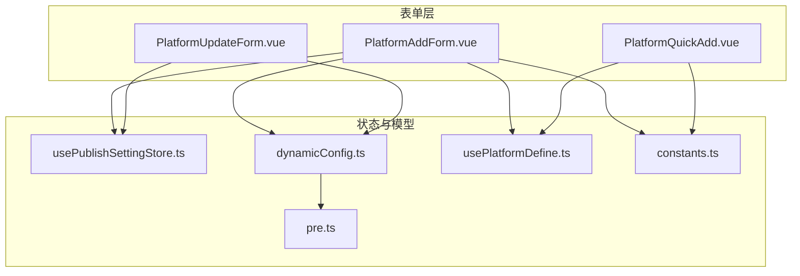
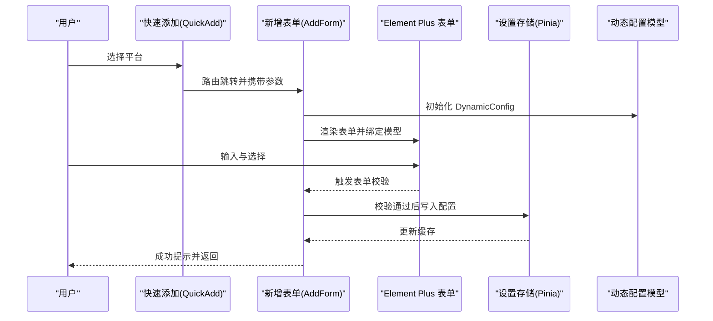
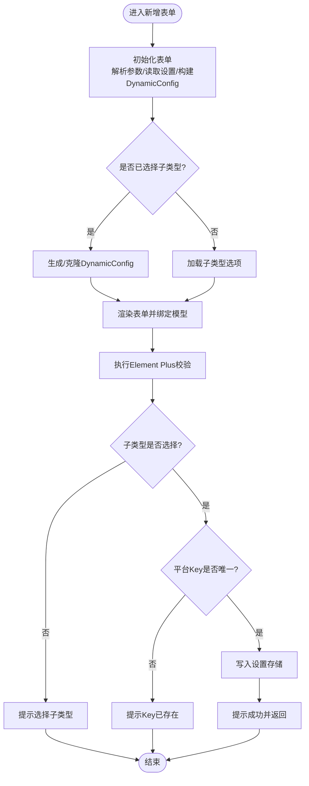
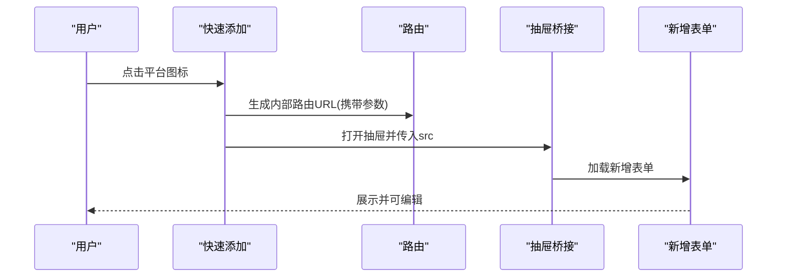
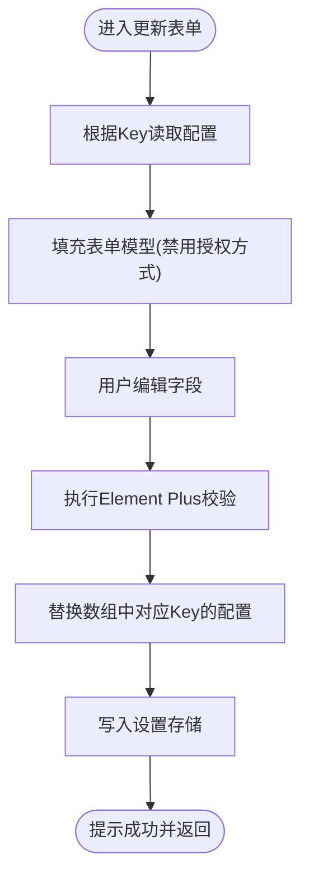
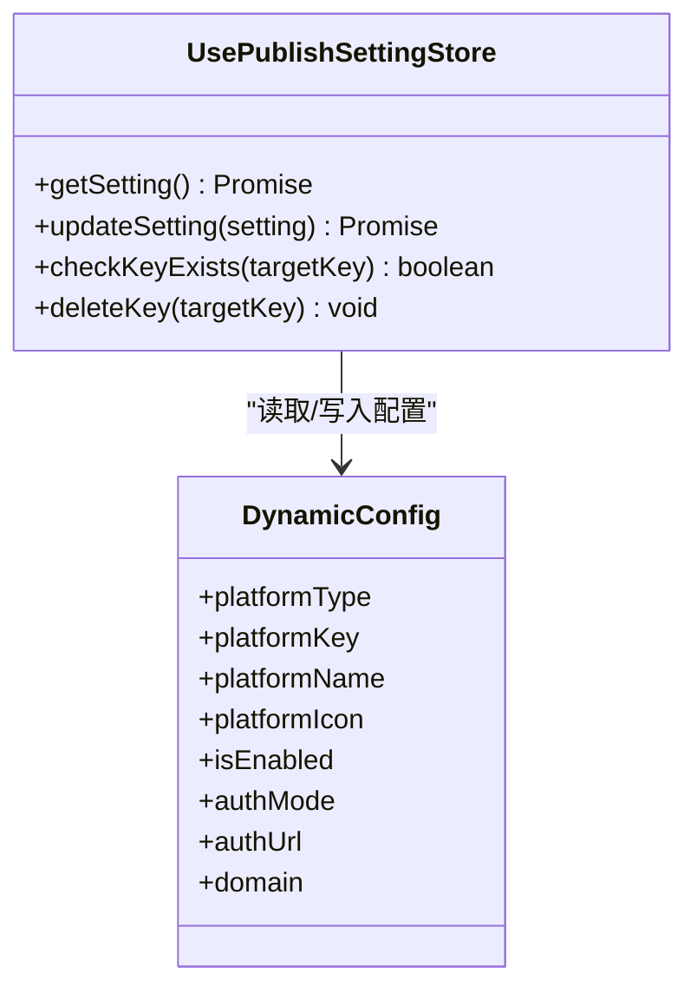
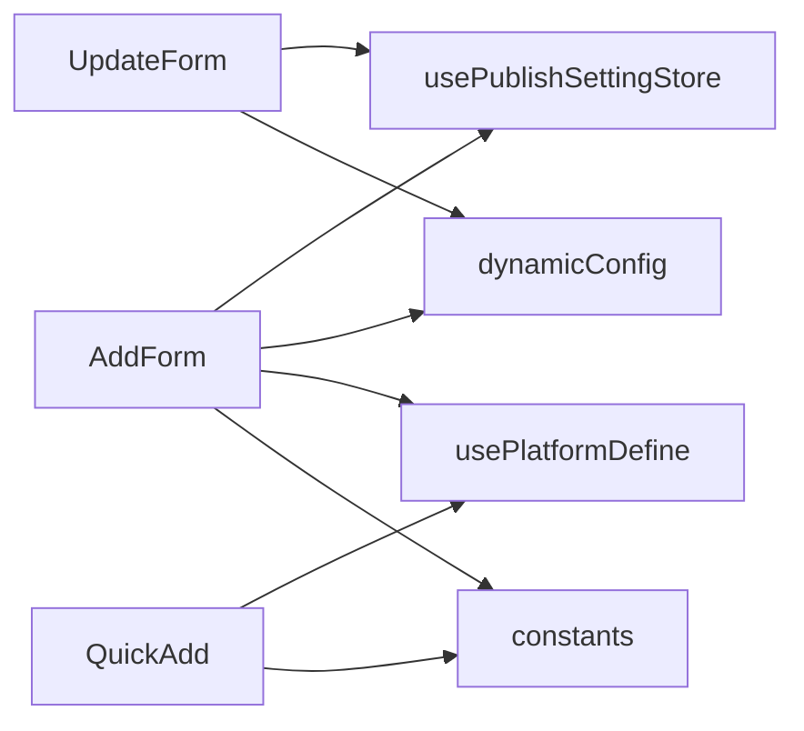

# 表单组件

<cite>
**本文引用的文件**
- [PlatformAddForm.vue](file://src/components/set/publish/form/PlatformAddForm.vue)
- [PlatformQuickAdd.vue](file://src/components/set/publish/form/PlatformQuickAdd.vue)
- [PlatformUpdateForm.vue](file://src/components/set/publish/form/PlatformUpdateForm.vue)
- [dynamicConfig.ts](file://src/platforms/dynamicConfig.ts)
- [usePublishSettingStore.ts](file://src/stores/usePublishSettingStore.ts)
- [usePlatformDefine.ts](file://src/composables/usePlatformDefine.ts)
- [constants.ts](file://src/utils/constants.ts)
- [pre.ts](file://src/platforms/pre.ts)
- [zh_CN.ts](file://src/locales/zh_CN.ts)
</cite>

## 目录
1. [简介](#简介)
2. [项目结构](#项目结构)
3. [核心组件](#核心组件)
4. [架构总览](#架构总览)
5. [组件详细分析](#组件详细分析)
6. [依赖关系分析](#依赖关系分析)
7. [性能考量](#性能考量)
8. [故障排查指南](#故障排查指南)
9. [结论](#结论)
10. [附录](#附录)

## 简介
本文件聚焦“平台配置”模块中的三类表单组件：新增平台表单、快速添加表单、更新平台表单。我们将深入解析它们的设计模式、实现细节、表单验证机制、数据绑定策略、错误处理流程，以及与状态管理的交互方式。同时阐明不同平台表单的差异化设计与可复用性设计原则。

## 项目结构
围绕表单组件的相关文件组织如下：
- 表单组件：PlatformAddForm.vue、PlatformQuickAdd.vue、PlatformUpdateForm.vue
- 平台动态配置模型与工具：dynamicConfig.ts
- 设置状态管理：usePublishSettingStore.ts
- 平台定义组合式函数：usePlatformDefine.ts
- 常量与国际化：constants.ts、zh_CN.ts
- 预定义平台数据：pre.ts

图表来源
- [PlatformAddForm.vue:10-200](file://src/components/set/publish/form/PlatformAddForm.vue#L10-L200)
- [PlatformQuickAdd.vue:10-120](file://src/components/set/publish/form/PlatformQuickAdd.vue#L10-L120)
- [PlatformUpdateForm.vue:10-125](file://src/components/set/publish/form/PlatformUpdateForm.vue#L10-L125)
- [usePublishSettingStore.ts:21-95](file://src/stores/usePublishSettingStore.ts#L21-L95)
- [dynamicConfig.ts:13-113](file://src/platforms/dynamicConfig.ts#L13-L113)
- [usePlatformDefine.ts:18-82](file://src/composables/usePlatformDefine.ts#L18-L82)
- [constants.ts:19-19](file://src/utils/constants.ts#L19-L19)
- [pre.ts:101-148](file://src/platforms/pre.ts#L101-L148)

章节来源
- [PlatformAddForm.vue:10-200](file://src/components/set/publish/form/PlatformAddForm.vue#L10-L200)
- [PlatformQuickAdd.vue:10-120](file://src/components/set/publish/form/PlatformQuickAdd.vue#L10-L120)
- [PlatformUpdateForm.vue:10-125](file://src/components/set/publish/form/PlatformUpdateForm.vue#L10-L125)
- [usePublishSettingStore.ts:21-95](file://src/stores/usePublishSettingStore.ts#L21-L95)
- [dynamicConfig.ts:13-113](file://src/platforms/dynamicConfig.ts#L13-L113)
- [usePlatformDefine.ts:18-82](file://src/composables/usePlatformDefine.ts#L18-L82)
- [constants.ts:19-19](file://src/utils/constants.ts#L19-L19)
- [pre.ts:101-148](file://src/platforms/pre.ts#L101-L148)

## 核心组件
- 新增平台表单（PlatformAddForm）：负责创建新的平台实例，支持子平台类型选择、关键字段校验、唯一键检测、提交持久化与路由跳转。
- 快速添加表单（PlatformQuickAdd）：提供抽屉式入口，列出预定义平台图标与描述，支持一键跳转到新增表单或内部页面。
- 更新平台表单（PlatformUpdateForm）：基于已有平台Key读取并编辑配置，强调不可修改授权方式等约束。

章节来源
- [PlatformAddForm.vue:45-130](file://src/components/set/publish/form/PlatformAddForm.vue#L45-L130)
- [PlatformQuickAdd.vue:53-120](file://src/components/set/publish/form/PlatformQuickAdd.vue#L53-L120)
- [PlatformUpdateForm.vue:40-125](file://src/components/set/publish/form/PlatformUpdateForm.vue#L40-L125)

## 架构总览
三类表单均采用“响应式数据 + Element Plus 表单校验”的模式，结合 Pinia 状态管理与动态配置模型完成数据持久化与跨页面交互。

图表来源
- [PlatformQuickAdd.vue:86-104](file://src/components/set/publish/form/PlatformQuickAdd.vue#L86-L104)
- [PlatformAddForm.vue:96-130](file://src/components/set/publish/form/PlatformAddForm.vue#L96-L130)
- [usePublishSettingStore.ts:38-59](file://src/stores/usePublishSettingStore.ts#L38-L59)
- [dynamicConfig.ts:336-392](file://src/platforms/dynamicConfig.ts#L336-L392)

## 组件详细分析

### 新增平台表单（PlatformAddForm）
- 设计要点
  - 子平台类型选择：根据平台类型动态生成子类型选项，初始化 DynamicConfig。
  - 关键字段校验：平台名称、授权方式、图标必填；额外校验子类型必选与平台Key唯一性。
  - 数据持久化：将 DynamicConfig 数组转换为 DynamicJsonCfg 并写入设置存储。
  - 国际化与提示：使用 i18n 键渲染提示文案，Element Plus 消息提示错误与成功。
- 数据绑定策略
  - 表单模型绑定至 reactive 的 dynCfg，字段包括平台名称、图标、授权模式、登录地址、主域名、启用状态等。
  - 通过 Element Plus 表单 ref 进行 validate 调用，统一收集校验结果。
- 错误处理流程
  - 子类型缺失与 Key 已存在时，直接弹出错误消息并阻断提交。
  - Element Plus 校验回调记录日志，失败时输出字段错误集合。
- 与状态管理交互
  - 读取设置：getSetting 获取现有配置。
  - 写入设置：updateSetting 合并写入，checkKeyExists 用于唯一性检测。
- 差异化设计
  - 支持“预定义模板导入”与“全新实例生成”，通过 isPre 标记控制渲染差异。
  - 网页授权模式下显示登录地址与主域名输入项。

图表来源
- [PlatformAddForm.vue:82-130](file://src/components/set/publish/form/PlatformAddForm.vue#L82-L130)
- [usePublishSettingStore.ts:38-76](file://src/stores/usePublishSettingStore.ts#L38-L76)
- [dynamicConfig.ts:428-451](file://src/platforms/dynamicConfig.ts#L428-L451)

章节来源
- [PlatformAddForm.vue:45-199](file://src/components/set/publish/form/PlatformAddForm.vue#L45-L199)
- [dynamicConfig.ts:13-113](file://src/platforms/dynamicConfig.ts#L13-L113)
- [usePublishSettingStore.ts:21-95](file://src/stores/usePublishSettingStore.ts#L21-L95)
- [usePlatformDefine.ts:18-82](file://src/composables/usePlatformDefine.ts#L18-L82)
- [constants.ts:19-19](file://src/utils/constants.ts#L19-L19)

### 快速添加表单（PlatformQuickAdd）
- 设计要点
  - 列表展示预定义平台图标与名称，点击后通过抽屉桥接打开内部新增页面。
  - 支持“全部平台”与“按类型筛选”，动态加载预定义列表。
  - 通过路由参数携带平台类型、Key、子类型，确保新增表单能正确初始化。
- 交互流程
  - 监听 apiType 变化，动态切换平台分组。
  - 点击平台图标 -> 组装内部路由URL -> 打开抽屉 -> 加载新增表单。
- 可复用性
  - 通过组合式函数 usePlatformDefine 提供平台类型与预定义列表，降低耦合度。

图表来源
- [PlatformQuickAdd.vue:66-104](file://src/components/set/publish/form/PlatformQuickAdd.vue#L66-L104)
- [usePlatformDefine.ts:45-72](file://src/composables/usePlatformDefine.ts#L45-L72)
- [pre.ts:101-148](file://src/platforms/pre.ts#L101-L148)

章节来源
- [PlatformQuickAdd.vue:23-120](file://src/components/set/publish/form/PlatformQuickAdd.vue#L23-L120)
- [usePlatformDefine.ts:18-82](file://src/composables/usePlatformDefine.ts#L18-L82)
- [pre.ts:101-148](file://src/platforms/pre.ts#L101-L148)

### 更新平台表单（PlatformUpdateForm）
- 设计要点
  - 通过路由参数 key 定位目标平台，读取并填充表单模型。
  - 强制禁用授权方式字段，避免破坏历史配置；允许修改名称、图标、登录地址、主域名、启用状态等。
  - 提交时替换数组中对应 Key 的配置并写回存储。
- 数据绑定与校验
  - 表单模型绑定至 dynCfg，规则包含必填字段校验。
  - 校验通过后直接替换并持久化，简化流程。
- 与状态管理交互
  - 读取设置、替换配置、写回设置，保持一致性。

图表来源
- [PlatformUpdateForm.vue:78-125](file://src/components/set/publish/form/PlatformUpdateForm.vue#L78-L125)
- [dynamicConfig.ts:456-486](file://src/platforms/dynamicConfig.ts#L456-L486)
- [usePublishSettingStore.ts:38-59](file://src/stores/usePublishSettingStore.ts#L38-L59)

章节来源
- [PlatformUpdateForm.vue:40-125](file://src/components/set/publish/form/PlatformUpdateForm.vue#L40-L125)
- [dynamicConfig.ts:456-486](file://src/platforms/dynamicConfig.ts#L456-L486)
- [usePublishSettingStore.ts:21-95](file://src/stores/usePublishSettingStore.ts#L21-L95)

### 表单验证机制与数据绑定策略
- 验证机制
  - Element Plus 表单规则：必填字段通过 FormRules 定义，国际化文案通过 t() 获取。
  - 自定义校验：子类型必选、平台Key唯一性检测、Element Plus 校验回调日志记录。
- 数据绑定策略
  - reactive + ref：表单数据与 Element Plus 表单 ref 通过 v-model 绑定至 DynamicConfig 字段。
  - 动态配置序列化：setDynamicJsonCfg 将数组按类型拆分为多个分组，便于后续使用。
- 错误处理
  - 失败提示：ElMessage.error 输出错误信息。
  - 成功提示：ElMessage.success 输出成功信息。
  - 日志记录：统一使用 createAppLogger 记录调试与错误日志。

章节来源
- [PlatformAddForm.vue:61-109](file://src/components/set/publish/form/PlatformAddForm.vue#L61-L109)
- [PlatformUpdateForm.vue:54-91](file://src/components/set/publish/form/PlatformUpdateForm.vue#L54-L91)
- [dynamicConfig.ts:336-392](file://src/platforms/dynamicConfig.ts#L336-L392)
- [usePublishSettingStore.ts:55-59](file://src/stores/usePublishSettingStore.ts#L55-L59)

### 与状态管理的交互方式
- 读取设置：getSetting 返回当前配置对象，供表单初始化使用。
- 写入设置：updateSetting 合并写入，同时更新本地缓存引用，保证视图即时更新。
- Key 检测：checkKeyExists 用于新增场景下的唯一性判断。
- 存储介质：底层通过 useCommonStorageAsync 与 JSON 文件持久化。

图表来源
- [usePublishSettingStore.ts:21-95](file://src/stores/usePublishSettingStore.ts#L21-L95)
- [dynamicConfig.ts:13-113](file://src/platforms/dynamicConfig.ts#L13-L113)

章节来源
- [usePublishSettingStore.ts:21-95](file://src/stores/usePublishSettingStore.ts#L21-L95)
- [dynamicConfig.ts:336-392](file://src/platforms/dynamicConfig.ts#L336-L392)

### 不同类型平台表单的差异化设计
- 新增表单：支持子类型选择、预定义模板导入、Key 唯一性校验、可编辑字段丰富。
- 快速添加：以图标与描述为主，轻量入口，跳转到新增表单完成深度配置。
- 更新表单：强调不可修改授权方式，避免破坏历史配置，其余字段均可编辑。

章节来源
- [PlatformAddForm.vue:132-199](file://src/components/set/publish/form/PlatformAddForm.vue#L132-L199)
- [PlatformQuickAdd.vue:86-104](file://src/components/set/publish/form/PlatformQuickAdd.vue#L86-L104)
- [PlatformUpdateForm.vue:164-170](file://src/components/set/publish/form/PlatformUpdateForm.vue#L164-L170)

### 可复用性设计原则
- 组合式函数：usePlatformDefine 提供平台类型与预定义列表，降低组件间耦合。
- 动态配置模型：DynamicConfig 统一字段结构，便于在不同表单间共享。
- 常量与国际化：DYNAMIC_CONFIG_KEY、国际化键集中管理，便于扩展与维护。
- 状态管理：Pinia Store 封装读写逻辑，组件仅关注业务交互。

章节来源
- [usePlatformDefine.ts:18-82](file://src/composables/usePlatformDefine.ts#L18-L82)
- [dynamicConfig.ts:13-113](file://src/platforms/dynamicConfig.ts#L13-L113)
- [constants.ts:19-19](file://src/utils/constants.ts#L19-L19)
- [zh_CN.ts:10-200](file://src/locales/zh_CN.ts#L10-L200)

## 依赖关系分析
- 组件依赖
  - PlatformAddForm 依赖 usePlatformDefine、usePublishSettingStore、dynamicConfig、constants。
  - PlatformQuickAdd 依赖 usePlatformDefine、路由与抽屉桥接。
  - PlatformUpdateForm 依赖 usePublishSettingStore、dynamicConfig。
- 模块内聚与耦合
  - 表单组件与状态管理通过 Store 解耦，与模型通过工具函数解耦。
  - 预定义平台数据集中于 pre.ts，便于统一维护。

图表来源
- [PlatformAddForm.vue:10-44](file://src/components/set/publish/form/PlatformAddForm.vue#L10-L44)
- [PlatformQuickAdd.vue:10-38](file://src/components/set/publish/form/PlatformQuickAdd.vue#L10-L38)
- [PlatformUpdateForm.vue:10-39](file://src/components/set/publish/form/PlatformUpdateForm.vue#L10-L39)
- [usePublishSettingStore.ts:10-30](file://src/stores/usePublishSettingStore.ts#L10-L30)
- [dynamicConfig.ts:10-30](file://src/platforms/dynamicConfig.ts#L10-L30)
- [usePlatformDefine.ts:10-20](file://src/composables/usePlatformDefine.ts#L10-L20)
- [constants.ts:10-20](file://src/utils/constants.ts#L10-L20)

章节来源
- [PlatformAddForm.vue:10-44](file://src/components/set/publish/form/PlatformAddForm.vue#L10-L44)
- [PlatformQuickAdd.vue:10-38](file://src/components/set/publish/form/PlatformQuickAdd.vue#L10-L38)
- [PlatformUpdateForm.vue:10-39](file://src/components/set/publish/form/PlatformUpdateForm.vue#L10-L39)
- [usePublishSettingStore.ts:10-30](file://src/stores/usePublishSettingStore.ts#L10-L30)
- [dynamicConfig.ts:10-30](file://src/platforms/dynamicConfig.ts#L10-L30)
- [usePlatformDefine.ts:10-20](file://src/composables/usePlatformDefine.ts#L10-L20)
- [constants.ts:10-20](file://src/utils/constants.ts#L10-L20)

## 性能考量
- 表单渲染优化
  - 使用 reactive 与 ref 精准绑定，减少不必要的重渲染。
  - 条件渲染（如 isPre）避免冗余字段渲染。
- 数据持久化
  - 批量写入：将数组整体序列化后再写入，减少多次 IO。
  - 缓存命中：getSettingRef 计算属性缓存最近一次读取结果。
- 校验策略
  - 先做业务校验（子类型、Key 唯一），再触发 Element Plus 校验，减少无效校验次数。

## 故障排查指南
- 常见问题
  - 子类型未选择：新增表单会在提交前提示并阻止继续。
  - 平台Key重复：唯一性检测失败时弹出错误提示。
  - 授权方式不可修改：更新表单禁用授权方式字段，如需变更请新建实例。
- 日志与提示
  - 校验失败：记录字段错误集合，便于定位问题。
  - 成功与失败：统一使用 ElMessage 提示，结合国际化文案提升可读性。
- 建议排查步骤
  - 检查路由参数（type、key、sub）是否正确传递。
  - 确认设置存储中是否存在目标 Key。
  - 查看控制台日志与 Element Plus 表单错误集合。

章节来源
- [PlatformAddForm.vue:82-130](file://src/components/set/publish/form/PlatformAddForm.vue#L82-L130)
- [PlatformUpdateForm.vue:74-111](file://src/components/set/publish/form/PlatformUpdateForm.vue#L74-L111)
- [usePublishSettingStore.ts:61-76](file://src/stores/usePublishSettingStore.ts#L61-L76)

## 结论
三类表单组件通过统一的动态配置模型与状态管理，实现了平台配置的新增、快速添加与更新功能。它们在数据绑定、表单验证、错误处理与国际化方面具备一致的设计风格，并通过组合式函数与常量配置提升了可复用性与可维护性。差异化设计满足不同场景需求：快速入口、深度配置与安全更新。

## 附录
- 国际化键示例：表单校验提示、操作成功/失败、平台类型描述等。
- 预定义平台：集中于 pre.ts，便于扩展新平台类型与子类型。

章节来源
- [zh_CN.ts:10-200](file://src/locales/zh_CN.ts#L10-L200)
- [pre.ts:101-148](file://src/platforms/pre.ts#L101-L148)