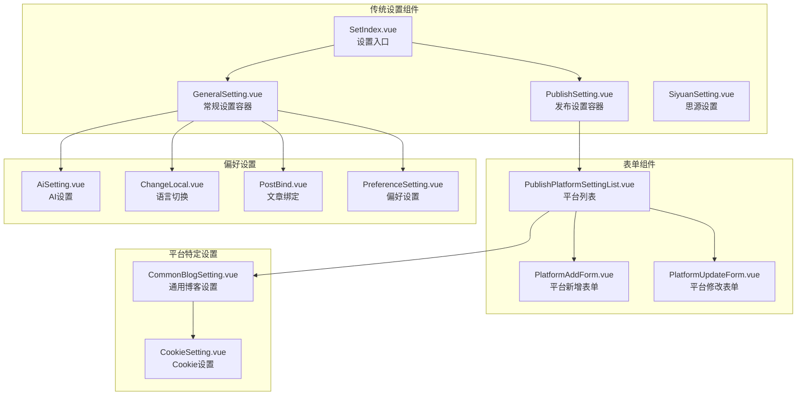
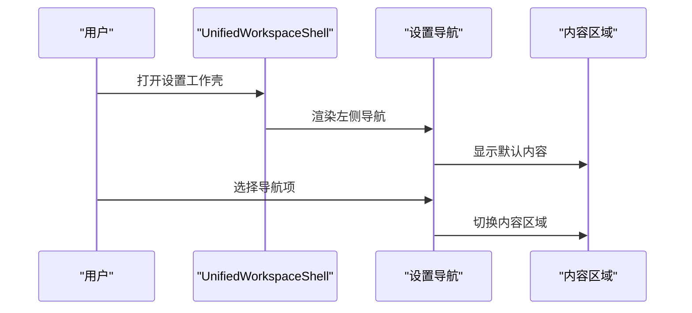
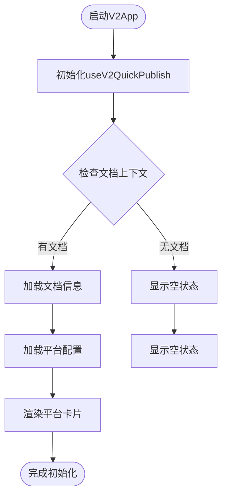
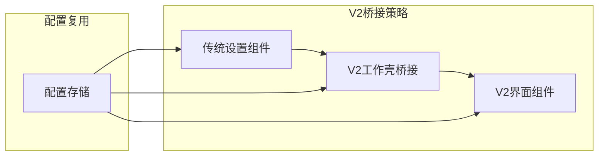
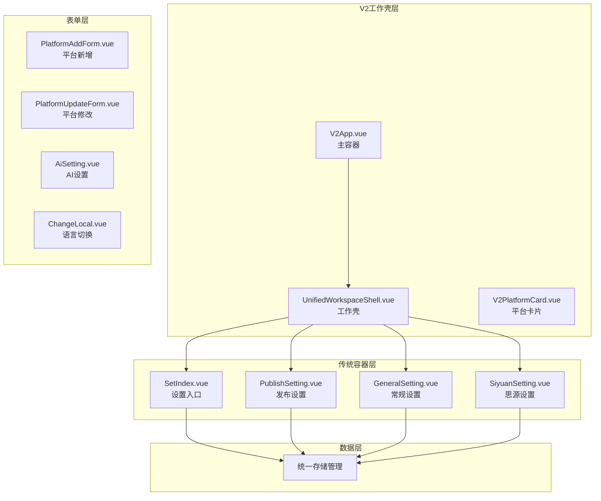

# 设置组件

<cite>
**本文档引用的文件**
- [SetIndex.vue](file://src/components/set/SetIndex.vue)
- [PublishSetting.vue](file://src/components/set/PublishSetting.vue)
- [GeneralSetting.vue](file://src/components/set/GeneralSetting.vue)
- [SiyuanSetting.vue](file://src/components/set/SiyuanSetting.vue)
- [PlatformAddForm.vue](file://src/components/set/publish/form/PlatformAddForm.vue)
- [PlatformUpdateForm.vue](file://src/components/set/publish/form/PlatformUpdateForm.vue)
- [PublishPlatformSettingList.vue](file://src/components/set/publish/platform/PublishPlatformSettingList.vue)
- [AiSetting.vue](file://src/components/set/preference/AiSetting.vue)
- [ChangeLocal.vue](file://src/components/set/preference/ChangeLocal.vue)
- [PostBind.vue](file://src/components/set/preference/PostBind.vue)
- [PreferenceSetting.vue](file://src/components/set/preference/PreferenceSetting.vue)
- [CommonBlogSetting.vue](file://src/components/set/publish/singleplatform/base/CommonBlogSetting.vue)
- [CookieSetting.vue](file://src/components/set/publish/singleplatform/base/CookieSetting.vue)
- [UnifiedWorkspaceShell.vue](file://src/components/v2/layout/UnifiedWorkspaceShell.vue)
- [V2App.vue](file://src/components/v2/V2App.vue)
- [V2PlatformCard.vue](file://src/components/v2/publish/V2PlatformCard.vue)
- [useV2QuickPublish.ts](file://src/composables/v2/useV2QuickPublish.ts)
- [base.styl](file://src/assets/v2/base.styl)
- [variables.styl](file://src/assets/v2/variables.styl)
- [design.md](file://openspec/changes/refactor-ui-v2-foundation/design.md)
- [tasks.md](file://openspec/changes/refactor-ui-v2-foundation/tasks.md)
- [spec.md](file://openspec/changes/refactor-ui-v2-foundation/specs/ui-v2-migration/spec.md)
</cite>

## 更新摘要
**变更内容**
- 新增V2 UI系统对设置组件的影响分析
- 说明传统设置组件与V2设置工作壳的关系
- 更新设置组件架构以反映V2系统的发展阶段
- 添加V2设置功能的开发进度和里程碑规划
- 更新设置组件的分层架构以体现新旧系统共存策略

## 目录
1. [简介](#简介)
2. [V2 UI系统概述](#v2-ui系统概述)
3. [传统设置组件架构](#传统设置组件架构)
4. [V2设置工作壳设计](#v2设置工作壳设计)
5. [新旧系统共存策略](#新旧系统共存策略)
6. [设置组件分层架构](#设置组件分层架构)
7. [详细组件分析](#详细组件分析)
8. [开发进度与里程碑](#开发进度与里程碑)
9. [性能考量](#性能考量)
10. [故障排除指南](#故障排除指南)
11. [结论](#结论)

## 简介
本文件系统性梳理"设置组件"体系，涵盖传统设置组件与V2 UI系统对设置组件的影响。重点解析以下内容：
- V2 UI系统对设置组件架构的重构影响
- 传统设置组件与V2设置工作壳的关系
- 设置入口与导航：SetIndex、PublishSetting、GeneralSetting、SiyuanSetting
- 发布设置表单：PlatformAddForm、PlatformUpdateForm、PublishPlatformSettingList
- 偏好设置组件：AiSetting、ChangeLocal、PostBind、PreferenceSetting
- 平台特定设置基座：CommonBlogSetting、CookieSetting
- V2设置工作壳：UnifiedWorkspaceShell、V2App、V2PlatformCard
- 数据持久化、配置验证、热更新策略

## V2 UI系统概述
V2 UI系统是一个渐进式的界面重构项目，旨在提供更好的用户体验和更高效的设置流程。该系统采用"新旧共存"的策略，在保持传统设置组件功能的同时，引入现代化的工作壳设计。

### 核心设计理念
- **渐进迁移**：分阶段推进，每个里程碑都有明确的验收标准
- **新旧共存**：V2系统与传统UI并存，支持回退机制
- **真实DOM优先**：V2新能力全部基于真实DOM挂载
- **配置格式兼容**：全程保持配置格式兼容性

### V2系统架构特点
- **统一工作壳**：提供一致的界面框架和导航体验
- **设置展开态**：在主工作区内展开设置内容，而非跳转到独立页面
- **渐进展开**：从简单的设置入口开始，逐步扩展到完整的设置功能
- **桥接策略**：优先桥接现有设置组件，而非完全重写

**章节来源**
- [design.md:54-90](file://openspec/changes/refactor-ui-v2-foundation/design.md#L54-L90)
- [design.md:253-336](file://openspec/changes/refactor-ui-v2-foundation/design.md#L253-L336)
- [spec.md:36-76](file://openspec/changes/refactor-ui-v2-foundation/specs/ui-v2-migration/spec.md#L36-L76)

## 传统设置组件架构
传统的设置组件采用经典的三层架构设计，为用户提供完整的设置管理功能。

### 核心组件层次
- **容器层**：SetIndex、PublishSetting、GeneralSetting、SiyuanSetting负责布局与路由跳转
- **表单层**：PlatformAddForm、PlatformUpdateForm、AiSetting、ChangeLocal、PostBind负责具体配置录入与校验
- **单平台设置层**：CommonBlogSetting作为通用博客适配器设置基座，CookieSetting提供Cookie手动设置弹窗
- **数据层**：usePublishSettingStore、usePreferenceSettingStore、useSiyuanSettingStore管理配置持久化与热更新

**图表来源**
- [SetIndex.vue:10-16](file://src/components/set/SetIndex.vue#L10-L16)
- [PublishSetting.vue:25-61](file://src/components/set/PublishSetting.vue#L25-L61)
- [GeneralSetting.vue:17-36](file://src/components/set/GeneralSetting.vue#L17-L36)
- [SiyuanSetting.vue:20-38](file://src/components/set/SiyuanSetting.vue#L20-L38)

**章节来源**
- [SetIndex.vue:10-16](file://src/components/set/SetIndex.vue#L10-L16)
- [PublishSetting.vue:25-61](file://src/components/set/PublishSetting.vue#L25-L61)
- [GeneralSetting.vue:17-36](file://src/components/set/GeneralSetting.vue#L17-L36)
- [SiyuanSetting.vue:20-38](file://src/components/set/SiyuanSetting.vue#L20-L38)

## V2设置工作壳设计
V2设置工作壳是V2 UI系统的核心组件，提供统一的设置界面框架和导航体验。

### UnifiedWorkspaceShell组件
UnifiedWorkspaceShell是V2设置工作壳的基础组件，提供左侧导航和右侧内容区域的布局结构。

**图表来源**
- [UnifiedWorkspaceShell.vue:32-38](file://src/components/v2/layout/UnifiedWorkspaceShell.vue#L32-L38)

### V2App组件
V2App是V2 UI系统的主要容器组件，负责管理视图切换和设置工作壳的渲染。

**图表来源**
- [V2App.vue:127-129](file://src/components/v2/V2App.vue#L127-L129)
- [useV2QuickPublish.ts:32-66](file://src/composables/v2/useV2QuickPublish.ts#L32-L66)

### V2PlatformCard组件
V2PlatformCard是平台卡片组件，用于在设置工作壳中展示平台信息和发布状态。

**章节来源**
- [UnifiedWorkspaceShell.vue:1-40](file://src/components/v2/layout/UnifiedWorkspaceShell.vue#L1-L40)
- [V2App.vue:1-274](file://src/components/v2/V2App.vue#L1-L274)
- [V2PlatformCard.vue:1-84](file://src/components/v2/publish/V2PlatformCard.vue#L1-L84)
- [useV2QuickPublish.ts:1-76](file://src/composables/v2/useV2QuickPublish.ts#L1-L76)

## 新旧系统共存策略
V2 UI系统采用渐进式的共存策略，确保用户可以在传统界面和新界面之间自由切换。

### 共存策略要点
- **配置开关**：通过useV2UI开关控制V2系统启用状态
- **回退机制**：V2初始化失败时自动回退到传统UI
- **配置兼容**：V2系统复用传统配置存储，保持配置格式兼容
- **入口分离**：提供两个独立的入口点，用户可选择使用哪种界面

### 桥接策略实施
V2系统采用"桥接优先"的策略，优先复用现有的设置组件功能：

**图表来源**
- [design.md:303-318](file://openspec/changes/refactor-ui-v2-foundation/design.md#L303-L318)

**章节来源**
- [design.md:494-506](file://openspec/changes/refactor-ui-v2-foundation/design.md#L494-L506)
- [spec.md:192-202](file://openspec/changes/refactor-ui-v2-foundation/specs/ui-v2-migration/spec.md#L192-L202)

## 设置组件分层架构
V2 UI系统对设置组件的分层架构进行了重构，形成了新的三层架构模式。

### 新的分层架构
- **工作壳层**：V2App、UnifiedWorkspaceShell提供统一的界面框架
- **容器层**：SetIndex、PublishSetting、GeneralSetting作为传统容器组件
- **表单层**：各种设置表单组件，通过桥接策略集成到V2工作壳中
- **数据层**：统一的存储管理，支持V2和传统组件共享配置

**图表来源**
- [V2App.vue:44-97](file://src/components/v2/V2App.vue#L44-L97)
- [UnifiedWorkspaceShell.vue:3-18](file://src/components/v2/layout/UnifiedWorkspaceShell.vue#L3-L18)

**章节来源**
- [V2App.vue:44-97](file://src/components/v2/V2App.vue#L44-L97)
- [UnifiedWorkspaceShell.vue:3-18](file://src/components/v2/layout/UnifiedWorkspaceShell.vue#L3-L18)

## 详细组件分析

### 发布设置容器与平台列表
- **PublishSetting**：提供"发布设置/导入/商店"三标签页，承载平台列表与导入/商店入口
- **PublishPlatformSettingList**：
  - 加载动态配置数组，渲染平台卡片（图标、名称、授权状态、启用开关）
  - 支持修改平台定义、启用/禁用、删除平台
  - 网页授权流程：打开登录页、收集Cookie、验证元数据、更新isAuth状态
  - Cookie手动设置：弹出CookieSetting弹窗，保存至平台键值
  - 新平台提示：检测预设平台与已配置平台差异，提示未导入的新平台

**图表来源**
- [PublishPlatformSettingList.vue:450-488](file://src/components/set/publish/platform/PublishPlatformSettingList.vue#L450-L488)
- [PublishPlatformSettingList.vue:121-135](file://src/components/set/publish/platform/PublishPlatformSettingList.vue#L121-L135)
- [PublishPlatformSettingList.vue:283-295](file://src/components/set/publish/platform/PublishPlatformSettingList.vue#L283-L295)

**章节来源**
- [PublishSetting.vue:25-61](file://src/components/set/PublishSetting.vue#L25-L61)
- [PublishPlatformSettingList.vue:68-119](file://src/components/set/publish/platform/PublishPlatformSettingList.vue#L68-L119)
- [PublishPlatformSettingList.vue:121-135](file://src/components/set/publish/platform/PublishPlatformSettingList.vue#L121-L135)
- [PublishPlatformSettingList.vue:283-295](file://src/components/set/publish/platform/PublishPlatformSettingList.vue#L283-L295)

### 平台新增与修改表单
- **PlatformAddForm**：
  - 根据路由参数与子平台类型初始化表单
  - 校验平台名称、授权方式、图标、唯一key
  - 将动态配置数组转换为JSON并写入DYNAMIC_CONFIG_KEY，同时初始化平台键值空配置
  - 成功后返回发布设置列表
- **PlatformUpdateForm**：
  - 通过key获取动态配置，禁用授权方式字段以保证配置一致性
  - 替换并保存，返回列表

**章节来源**
- [PlatformAddForm.vue:82-130](file://src/components/set/publish/form/PlatformAddForm.vue#L82-L130)
- [PlatformAddForm.vue:136-199](file://src/components/set/publish/form/PlatformAddForm.vue#L136-L199)
- [PlatformUpdateForm.vue:78-111](file://src/components/set/publish/form/PlatformUpdateForm.vue#L78-L111)

### 偏好设置组件
- **PreferenceSetting**：标题处理、菜单显示控制、slug变更前确认对话框
- **AiSetting**：AI相关参数（API Key、Base URL、Proxy、模型、Max Tokens、Temperature），支持使用思源笔记AI配置时禁用编辑
- **ChangeLocal**：语言切换，更新设置并持久化
- **PostBind**：根据页面ID修复各平台的postid映射，批量写回配置

**章节来源**
- [PreferenceSetting.vue:51-106](file://src/components/set/preference/PreferenceSetting.vue#L51-L106)
- [AiSetting.vue:20-97](file://src/components/set/preference/AiSetting.vue#L20-L97)
- [ChangeLocal.vue:30-37](file://src/components/set/preference/ChangeLocal.vue#L30-L37)
- [PostBind.vue:54-82](file://src/components/set/preference/PostBind.vue#L54-L82)

### 思源设置与常规设置容器
- **SiyuanSetting**：提供API地址与密码输入框，用于连接思源服务端
- **GeneralSetting**：整合偏好设置、AI设置、思源设置、语言切换、文章绑定

**章节来源**
- [SiyuanSetting.vue:20-38](file://src/components/set/SiyuanSetting.vue#L20-L38)
- [GeneralSetting.vue:17-36](file://src/components/set/GeneralSetting.vue#L17-L36)

### 平台特定设置基座与Cookie设置
- **CommonBlogSetting（基座）**：
  - 通用博客适配器设置，支持首页、API地址、用户名/密码或Token、Cookie、预览地址、页面类型、知识空间、图床服务、跨域代理等
  - 提供"校验"与"保存"流程，校验成功后同步isAuth与apiStatus
  - 自动初始化知识空间列表，监听blogid变化并更新提示
- **CookieSetting（弹窗）**：
  - 在网页授权受限场景，弹窗让用户手动粘贴Cookie
  - 保存至对应平台键值并关闭弹窗

**章节来源**
- [CommonBlogSetting.vue:116-172](file://src/components/set/publish/singleplatform/base/CommonBlogSetting.vue#L116-L172)
- [CommonBlogSetting.vue:203-219](file://src/components/set/publish/singleplatform/base/CommonBlogSetting.vue#L203-L219)
- [CommonBlogSetting.vue:302-317](file://src/components/set/publish/singleplatform/base/CommonBlogSetting.vue#L302-L317)
- [CookieSetting.vue:50-80](file://src/components/set/publish/singleplatform/base/CookieSetting.vue#L50-L80)

## 开发进度与里程碑
V2 UI系统的开发采用里程碑制，每个阶段都有明确的目标和验收标准。

### Milestone 0：入口与治理基座
- **目标**：建立能运行、能回退、能扩展的V2基座
- **范围**：统一入口定义、useV2UI开关、V2Host、单一配置源、回退机制
- **输出**：V2入口基础功能完成

### Milestone 1：快速发布主路径
- **目标**：优先交付统一入口和快速发布主路径
- **范围**：统一工作壳、快速发布界面、文档上下文读取
- **输出**：V2主界面可用

### Milestone 2：设置展开态第一阶段
- **目标**：实现设置展开态的第一阶段功能
- **范围**：账号设置列表、平台选择流程、图床设置内容区、偏好设置内容区
- **输出**：部分设置功能可使用

### Milestone 3：设置展开态第二阶段
- **目标**：扩展设置展开态，逐步替换高频旧设置能力
- **范围**：更多平台配置桥接、设置态交互打磨、高频能力稳定化
- **输出**：大多数用户高频设置场景可用

### Milestone 4：收敛与稳定发布
- **目标**：完成V2与旧UI的长期共存策略、收敛策略和稳定发布策略
- **范围**：统计仍依赖旧UI的能力、判断废弃计划、制定iframe退役清单
- **输出**：V2稳定发布策略确定

**章节来源**
- [tasks.md:44-75](file://openspec/changes/refactor-ui-v2-foundation/tasks.md#L44-L75)
- [design.md:420-490](file://openspec/changes/refactor-ui-v2-foundation/design.md#L420-L490)

## 性能考量
V2 UI系统在性能方面采用了多项优化措施：

### V2系统性能优化
- **工作壳渲染优化**：UnifiedWorkspaceShell采用CSS Grid布局，减少DOM节点数量
- **按需加载**：设置内容区域采用懒加载策略，只有在用户选择相应导航项时才加载内容
- **状态管理优化**：useV2QuickPublish使用响应式状态，避免不必要的重新渲染
- **样式隔离**：V2样式使用命名空间，避免与传统样式冲突

### 传统组件性能优化
- **列表渲染优化**：平台列表使用栅格布局与按需渲染，避免一次性渲染过多节点
- **异步加载**：知识空间列表按需加载，减少首次渲染压力
- **校验与保存**：校验过程增加loading状态，避免重复提交
- **环境适配**：根据运行环境（思源/扩展/普通浏览器）选择最优授权方式

**章节来源**
- [base.styl:186-245](file://src/assets/v2/base.styl#L186-L245)
- [variables.styl:1-58](file://src/assets/v2/variables.styl#L1-L58)

## 故障排除指南
V2 UI系统提供了完善的故障排除机制：

### V2系统故障排除
- **工作壳加载失败**：检查V2App初始化逻辑，确保useV2QuickPublish正确初始化
- **导航项不显示**：验证UnifiedWorkspaceShell的navItems配置，确保设置导航正常
- **内容区域空白**：检查当前视图状态，确认isSettingsView计算属性正确
- **样式冲突**：检查V2样式命名空间，确保与传统样式隔离

### 传统组件故障排除
- **平台授权失败**：网页授权：确认登录页可访问、Cookie有效；必要时清除旧授权并重新验证
- **配置校验失败**：检查API地址、用户名/密码或Token是否正确；必要时切换代理或更换平台
- **语言切换无效**：确认设置已保存并刷新页面生效
- **文章绑定修复**：确认页面ID正确，逐个平台核对postid映射后再保存

**章节来源**
- [V2App.vue:127-129](file://src/components/v2/V2App.vue#L127-L129)
- [UnifiedWorkspaceShell.vue:32-38](file://src/components/v2/layout/UnifiedWorkspaceShell.vue#L32-L38)
- [PublishPlatformSettingList.vue:283-295](file://src/components/set/publish/platform/PublishPlatformSettingList.vue#L283-L295)

## 结论
V2 UI系统对设置组件的影响是深远而渐进的。通过采用"新旧共存"的策略，V2系统在保持传统设置功能完整性的同时，为用户提供了更加现代化的设置体验。

### 主要成果
- **架构升级**：建立了V2工作壳与传统组件的桥接架构
- **用户体验提升**：设置功能在主工作区内展开，减少了页面跳转
- **开发效率提高**：通过桥接策略，复用了大量现有功能代码
- **稳定性保障**：完善的回退机制确保系统稳定性

### 未来发展方向
- **功能完善**：逐步将更多传统设置功能迁移到V2工作壳中
- **性能优化**：持续优化V2组件的渲染性能和交互体验
- **配置迁移**：制定详细的配置迁移计划，确保向后兼容性
- **废弃策略**：根据使用统计制定传统组件的废弃时间表

通过这种渐进式的重构方式，V2 UI系统既保证了现有功能的稳定性，又为未来的功能扩展奠定了坚实的基础。