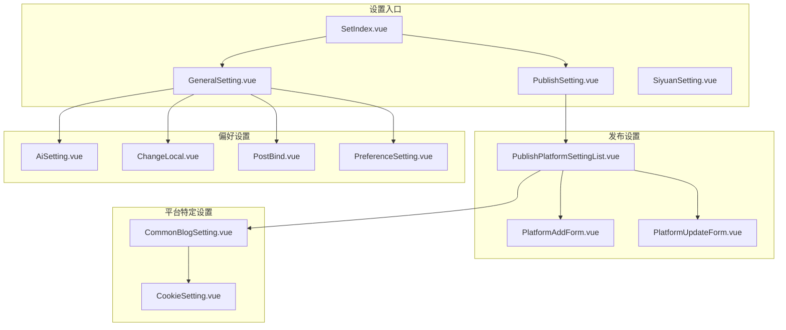
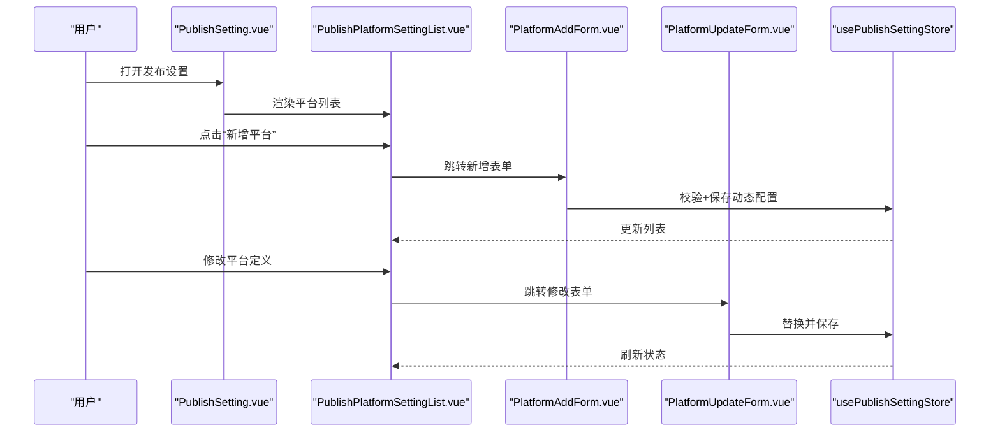
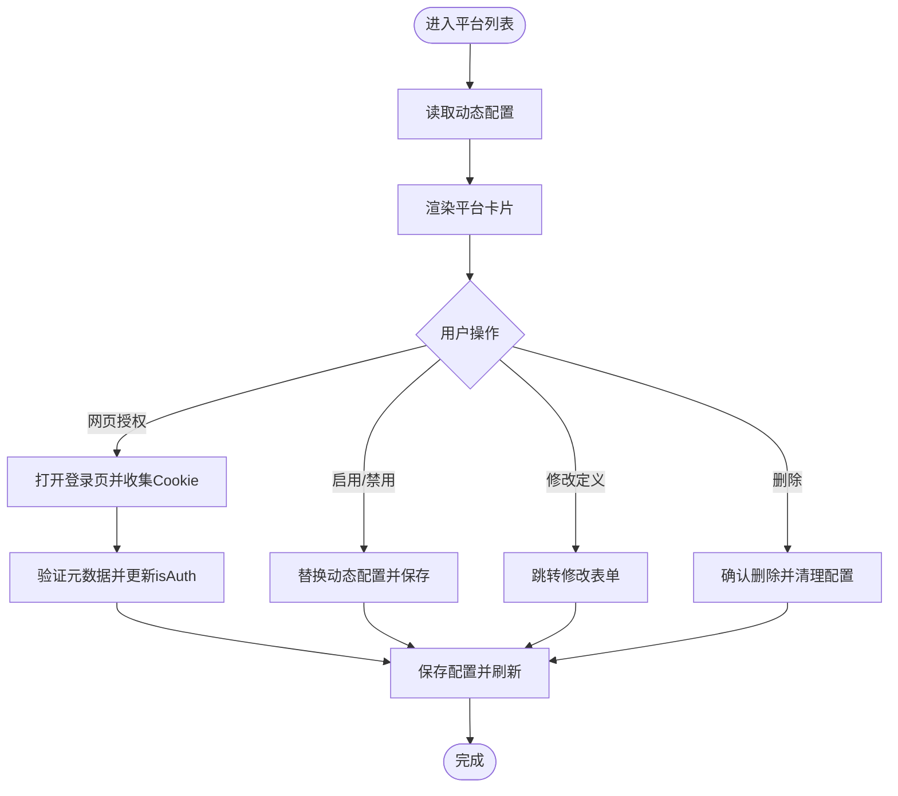
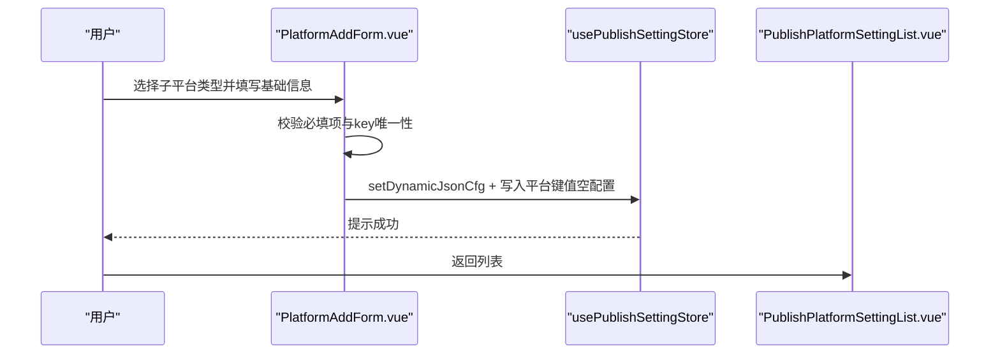
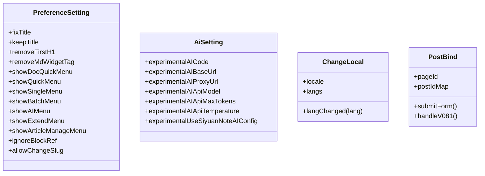
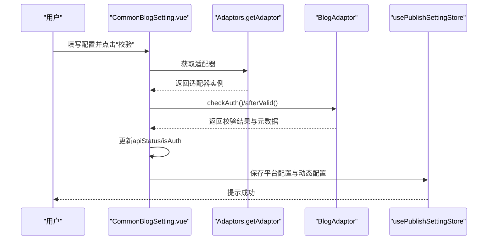
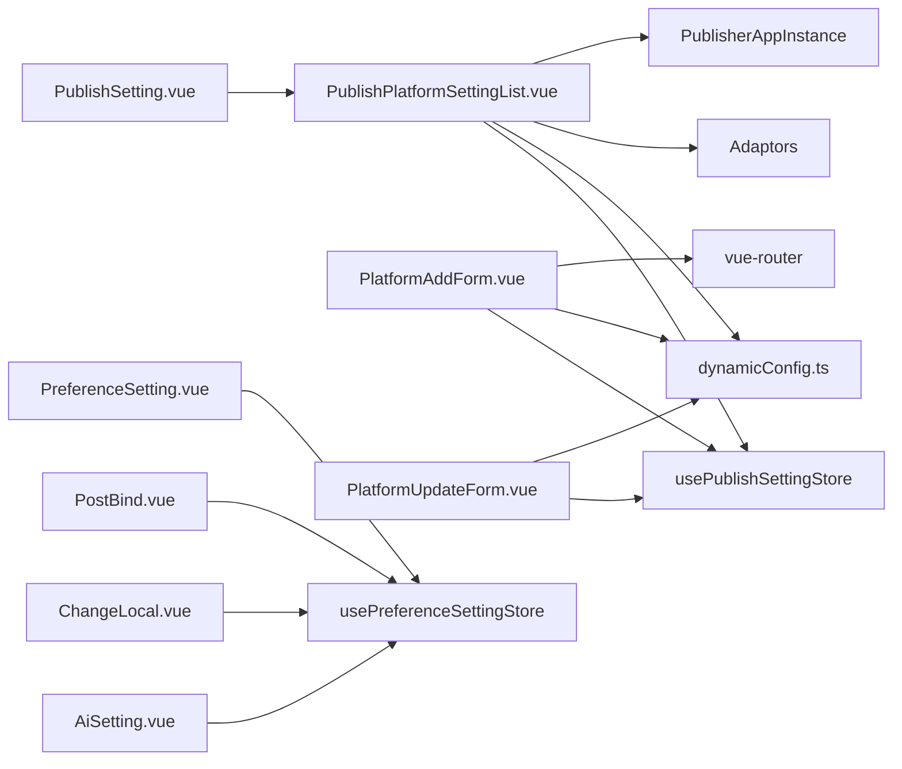

# 设置组件

<cite>
**本文档引用的文件**
- [SetIndex.vue](file://src/components/set/SetIndex.vue)
- [PublishSetting.vue](file://src/components/set/PublishSetting.vue)
- [GeneralSetting.vue](file://src/components/set/GeneralSetting.vue)
- [SiyuanSetting.vue](file://src/components/set/SiyuanSetting.vue)
- [PlatformAddForm.vue](file://src/components/set/publish/form/PlatformAddForm.vue)
- [PlatformUpdateForm.vue](file://src/components/set/publish/form/PlatformUpdateForm.vue)
- [PublishPlatformSettingList.vue](file://src/components/set/publish/platform/PublishPlatformSettingList.vue)
- [AiSetting.vue](file://src/components/set/preference/AiSetting.vue)
- [ChangeLocal.vue](file://src/components/set/preference/ChangeLocal.vue)
- [PostBind.vue](file://src/components/set/preference/PostBind.vue)
- [PreferenceSetting.vue](file://src/components/set/preference/PreferenceSetting.vue)
- [CommonBlogSetting.vue](file://src/components/set/publish/singleplatform/base/CommonBlogSetting.vue)
- [CookieSetting.vue](file://src/components/set/publish/singleplatform/base/CookieSetting.vue)
</cite>

## 目录
1. [简介](#简介)
2. [项目结构](#项目结构)
3. [核心组件](#核心组件)
4. [架构总览](#架构总览)
5. [详细组件分析](#详细组件分析)
6. [依赖关系分析](#依赖关系分析)
7. [性能考量](#性能考量)
8. [故障排除指南](#故障排除指南)
9. [结论](#结论)

## 简介
本文件系统性梳理“设置组件”体系，覆盖发布设置、常规设置与偏好设置、平台特定设置（如 GitHub、GitLab、Web 平台）以及平台动态配置的表单与持久化机制。重点解析以下组件：
- 设置入口与导航：SetIndex、PublishSetting、GeneralSetting、SiyuanSetting
- 发布设置表单：PlatformAddForm、PlatformUpdateForm、PublishPlatformSettingList
- 偏好设置组件：AiSetting、ChangeLocal、PostBind、PreferenceSetting
- 平台特定设置基座：CommonBlogSetting、CookieSetting
- 数据持久化、配置验证、热更新策略

## 项目结构
设置相关组件主要位于 src/components/set 目录，按功能划分为：
- 发布设置：publish 目录下的 form 与 platform 子目录
- 常规设置：preference 子目录
- 顶层设置容器：SetIndex、PublishSetting、GeneralSetting、SiyuanSetting

图表来源
- [SetIndex.vue:1-17](file://src/components/set/SetIndex.vue#L1-L17)
- [PublishSetting.vue:1-70](file://src/components/set/PublishSetting.vue#L1-L70)
- [GeneralSetting.vue:1-43](file://src/components/set/GeneralSetting.vue#L1-L43)
- [SiyuanSetting.vue:1-40](file://src/components/set/SiyuanSetting.vue#L1-L40)
- [PlatformAddForm.vue:1-290](file://src/components/set/publish/form/PlatformAddForm.vue#L1-L290)
- [PlatformUpdateForm.vue:1-209](file://src/components/set/publish/form/PlatformUpdateForm.vue#L1-L209)
- [PublishPlatformSettingList.vue:1-704](file://src/components/set/publish/platform/PublishPlatformSettingList.vue#L1-L704)
- [AiSetting.vue:1-121](file://src/components/set/preference/AiSetting.vue#L1-L121)
- [ChangeLocal.vue:1-60](file://src/components/set/preference/ChangeLocal.vue#L1-L60)
- [PostBind.vue:1-168](file://src/components/set/preference/PostBind.vue#L1-L168)
- [PreferenceSetting.vue:1-114](file://src/components/set/preference/PreferenceSetting.vue#L1-L114)
- [CommonBlogSetting.vue:1-540](file://src/components/set/publish/singleplatform/base/CommonBlogSetting.vue#L1-L540)
- [CookieSetting.vue:1-129](file://src/components/set/publish/singleplatform/base/CookieSetting.vue#L1-L129)

章节来源
- [SetIndex.vue:1-17](file://src/components/set/SetIndex.vue#L1-L17)
- [PublishSetting.vue:1-70](file://src/components/set/PublishSetting.vue#L1-L70)
- [GeneralSetting.vue:1-43](file://src/components/set/GeneralSetting.vue#L1-L43)
- [SiyuanSetting.vue:1-40](file://src/components/set/SiyuanSetting.vue#L1-L40)

## 核心组件
- SetIndex：设置入口页，承载发布设置主面板
- PublishSetting：发布设置主容器，包含“平台列表/导入/商店”三个标签页
- GeneralSetting：常规设置容器，包含偏好、AI、思源设置、语言、文章绑定等
- SiyuanSetting：思源服务端配置（API 地址、密码）

章节来源
- [SetIndex.vue:10-16](file://src/components/set/SetIndex.vue#L10-L16)
- [PublishSetting.vue:25-61](file://src/components/set/PublishSetting.vue#L25-L61)
- [GeneralSetting.vue:17-36](file://src/components/set/GeneralSetting.vue#L17-L36)
- [SiyuanSetting.vue:20-38](file://src/components/set/SiyuanSetting.vue#L20-L38)

## 架构总览
设置系统采用“容器 + 表单 + 单平台设置”的分层设计：
- 容器层：SetIndex、PublishSetting、GeneralSetting 负责布局与路由跳转
- 表单层：PlatformAddForm、PlatformUpdateForm、AiSetting、ChangeLocal、PostBind 负责具体配置录入与校验
- 单平台设置层：CommonBlogSetting 作为通用博客适配器设置基座，CookieSetting 提供 Cookie 手动设置弹窗
- 数据层：usePublishSettingStore、usePreferenceSettingStore、useSiyuanSettingStore 管理配置持久化与热更新

图表来源
- [PublishSetting.vue:25-61](file://src/components/set/PublishSetting.vue#L25-L61)
- [PublishPlatformSettingList.vue:68-119](file://src/components/set/publish/platform/PublishPlatformSettingList.vue#L68-L119)
- [PlatformAddForm.vue:96-130](file://src/components/set/publish/form/PlatformAddForm.vue#L96-L130)
- [PlatformUpdateForm.vue:78-111](file://src/components/set/publish/form/PlatformUpdateForm.vue#L78-L111)

## 详细组件分析

### 发布设置容器与平台列表
- PublishSetting：提供“发布设置/导入/商店”三标签页，承载平台列表与导入/商店入口
- PublishPlatformSettingList：
  - 加载动态配置数组，渲染平台卡片（图标、名称、授权状态、启用开关）
  - 支持修改平台定义、启用/禁用、删除平台
  - 网页授权流程：打开登录页、收集 Cookie、验证元数据、更新 isAuth 状态
  - Cookie 手动设置：弹出 CookieSetting 弹窗，保存至平台键值
  - 新平台提示：检测预设平台与已配置平台差异，提示未导入的新平台

图表来源
- [PublishPlatformSettingList.vue:450-488](file://src/components/set/publish/platform/PublishPlatformSettingList.vue#L450-L488)
- [PublishPlatformSettingList.vue:121-135](file://src/components/set/publish/platform/PublishPlatformSettingList.vue#L121-L135)
- [PublishPlatformSettingList.vue:283-295](file://src/components/set/publish/platform/PublishPlatformSettingList.vue#L283-L295)

章节来源
- [PublishSetting.vue:25-61](file://src/components/set/PublishSetting.vue#L25-L61)
- [PublishPlatformSettingList.vue:68-119](file://src/components/set/publish/platform/PublishPlatformSettingList.vue#L68-L119)
- [PublishPlatformSettingList.vue:121-135](file://src/components/set/publish/platform/PublishPlatformSettingList.vue#L121-L135)
- [PublishPlatformSettingList.vue:283-295](file://src/components/set/publish/platform/PublishPlatformSettingList.vue#L283-L295)

### 平台新增与修改表单
- PlatformAddForm：
  - 根据路由参数与子平台类型初始化表单
  - 校验平台名称、授权方式、图标、唯一 key
  - 将动态配置数组转换为 JSON 并写入 DYNAMIC_CONFIG_KEY，同时初始化平台键值空配置
  - 成功后返回发布设置列表
- PlatformUpdateForm：
  - 通过 key 获取动态配置，禁用授权方式字段以保证配置一致性
  - 替换并保存，返回列表

图表来源
- [PlatformAddForm.vue:82-130](file://src/components/set/publish/form/PlatformAddForm.vue#L82-L130)
- [PlatformAddForm.vue:136-199](file://src/components/set/publish/form/PlatformAddForm.vue#L136-L199)
- [PlatformUpdateForm.vue:78-111](file://src/components/set/publish/form/PlatformUpdateForm.vue#L78-L111)

章节来源
- [PlatformAddForm.vue:82-130](file://src/components/set/publish/form/PlatformAddForm.vue#L82-L130)
- [PlatformAddForm.vue:136-199](file://src/components/set/publish/form/PlatformAddForm.vue#L136-L199)
- [PlatformUpdateForm.vue:78-111](file://src/components/set/publish/form/PlatformUpdateForm.vue#L78-L111)

### 偏好设置组件
- PreferenceSetting：标题处理、菜单显示控制、slug 变更前确认对话框
- AiSetting：AI 相关参数（API Key、Base URL、Proxy、模型、Max Tokens、Temperature），支持使用思源笔记 AI 配置时禁用编辑
- ChangeLocal：语言切换，更新设置并持久化
- PostBind：根据页面 ID 修复各平台的 postid 映射，批量写回配置

图表来源
- [PreferenceSetting.vue:51-106](file://src/components/set/preference/PreferenceSetting.vue#L51-L106)
- [AiSetting.vue:20-97](file://src/components/set/preference/AiSetting.vue#L20-L97)
- [ChangeLocal.vue:30-37](file://src/components/set/preference/ChangeLocal.vue#L30-L37)
- [PostBind.vue:54-82](file://src/components/set/preference/PostBind.vue#L54-L82)

章节来源
- [PreferenceSetting.vue:51-106](file://src/components/set/preference/PreferenceSetting.vue#L51-L106)
- [AiSetting.vue:20-97](file://src/components/set/preference/AiSetting.vue#L20-L97)
- [ChangeLocal.vue:30-37](file://src/components/set/preference/ChangeLocal.vue#L30-L37)
- [PostBind.vue:54-82](file://src/components/set/preference/PostBind.vue#L54-L82)

### 思源设置与常规设置容器
- SiyuanSetting：提供 API 地址与密码输入框，用于连接思源服务端
- GeneralSetting：整合偏好设置、AI 设置、思源设置、语言切换、文章绑定

章节来源
- [SiyuanSetting.vue:20-38](file://src/components/set/SiyuanSetting.vue#L20-L38)
- [GeneralSetting.vue:17-36](file://src/components/set/GeneralSetting.vue#L17-L36)

### 平台特定设置基座与 Cookie 设置
- CommonBlogSetting（基座）：
  - 通用博客适配器设置，支持首页、API 地址、用户名/密码或 Token、Cookie、预览地址、页面类型、知识空间、图床服务、跨域代理等
  - 提供“校验”与“保存”流程，校验成功后同步 isAuth 与 apiStatus
  - 自动初始化知识空间列表，监听 blogid 变化并更新提示
- CookieSetting（弹窗）：
  - 在网页授权受限场景，弹窗让用户手动粘贴 Cookie
  - 保存至对应平台键值并关闭弹窗

图表来源
- [CommonBlogSetting.vue:116-172](file://src/components/set/publish/singleplatform/base/CommonBlogSetting.vue#L116-L172)
- [CommonBlogSetting.vue:203-219](file://src/components/set/publish/singleplatform/base/CommonBlogSetting.vue#L203-L219)
- [CommonBlogSetting.vue:302-317](file://src/components/set/publish/singleplatform/base/CommonBlogSetting.vue#L302-L317)

章节来源
- [CommonBlogSetting.vue:116-172](file://src/components/set/publish/singleplatform/base/CommonBlogSetting.vue#L116-L172)
- [CommonBlogSetting.vue:203-219](file://src/components/set/publish/singleplatform/base/CommonBlogSetting.vue#L203-L219)
- [CommonBlogSetting.vue:302-317](file://src/components/set/publish/singleplatform/base/CommonBlogSetting.vue#L302-L317)
- [CookieSetting.vue:50-80](file://src/components/set/publish/singleplatform/base/CookieSetting.vue#L50-L80)

## 依赖关系分析
- 组件耦合
  - PublishSetting 依赖 PublishPlatformSettingList
  - PublishPlatformSettingList 依赖 usePublishSettingStore、动态配置模块、Adaptors、PublisherAppInstance
  - PlatformAddForm/PlatformUpdateForm 依赖 usePublishSettingStore、动态配置模块、路由与 i18n
  - 偏好设置组件依赖 usePreferenceSettingStore、useSiyuanSettingStore、usePublishSettingStore
- 外部依赖
  - Element Plus 表单与消息提示
  - zhi-common 工具库（JSON/字符串/对象工具）
  - zhi-blog-api 适配器与 API 实例
  - 浏览器/扩展环境检测与 Cookie 收集

图表来源
- [PublishSetting.vue:25-61](file://src/components/set/PublishSetting.vue#L25-L61)
- [PublishPlatformSettingList.vue:44-49](file://src/components/set/publish/platform/PublishPlatformSettingList.vue#L44-L49)
- [PlatformAddForm.vue:31-43](file://src/components/set/publish/form/PlatformAddForm.vue#L31-L43)
- [PlatformUpdateForm.vue:28-38](file://src/components/set/publish/form/PlatformUpdateForm.vue#L28-L38)
- [AiSetting.vue:12-15](file://src/components/set/preference/AiSetting.vue#L12-L15)
- [ChangeLocal.vue:17-18](file://src/components/set/preference/ChangeLocal.vue#L17-L18)
- [PostBind.vue:29-32](file://src/components/set/preference/PostBind.vue#L29-L32)
- [PreferenceSetting.vue:24-25](file://src/components/set/preference/PreferenceSetting.vue#L24-L25)

## 性能考量
- 列表渲染优化
  - 平台列表使用栅格布局与按需渲染，避免一次性渲染过多节点
- 异步加载
  - 知识空间列表按需加载，减少首次渲染压力
- 校验与保存
  - 校验过程增加 loading 状态，避免重复提交
  - 保存采用批量写入，减少多次 IO
- 环境适配
  - 根据运行环境（思源/扩展/普通浏览器）选择最优授权方式，降低失败重试成本

## 故障排除指南
- 平台授权失败
  - 网页授权：确认登录页可访问、Cookie 有效；必要时清除旧授权并重新验证
  - Cookie 手动设置：确保粘贴的 Cookie 正确且未过期
- 配置校验失败
  - 检查 API 地址、用户名/密码或 Token 是否正确；必要时切换代理或更换平台
- 语言切换无效
  - 确认设置已保存并刷新页面生效
- 文章绑定修复
  - 确认页面 ID 正确，逐个平台核对 postid 映射后再保存

章节来源
- [PublishPlatformSettingList.vue:283-295](file://src/components/set/publish/platform/PublishPlatformSettingList.vue#L283-L295)
- [CommonBlogSetting.vue:116-172](file://src/components/set/publish/singleplatform/base/CommonBlogSetting.vue#L116-L172)
- [ChangeLocal.vue:30-37](file://src/components/set/preference/ChangeLocal.vue#L30-L37)
- [PostBind.vue:54-82](file://src/components/set/preference/PostBind.vue#L54-L82)

## 结论
设置组件系统通过清晰的分层与职责划分，实现了从发布平台配置到偏好设置的完整闭环。动态配置与统一存储机制确保了平台扩展性与配置持久化；表单校验与热更新保障了用户体验与数据一致性。后续可在以下方面持续优化：
- 增强平台授权失败的引导提示与自动重试策略
- 优化大规模平台列表的虚拟滚动与懒加载
- 提供配置导出/导入能力，提升迁移体验