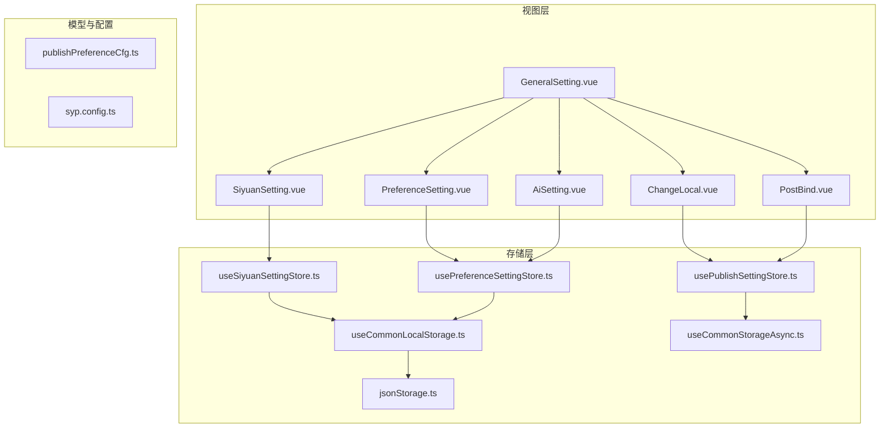
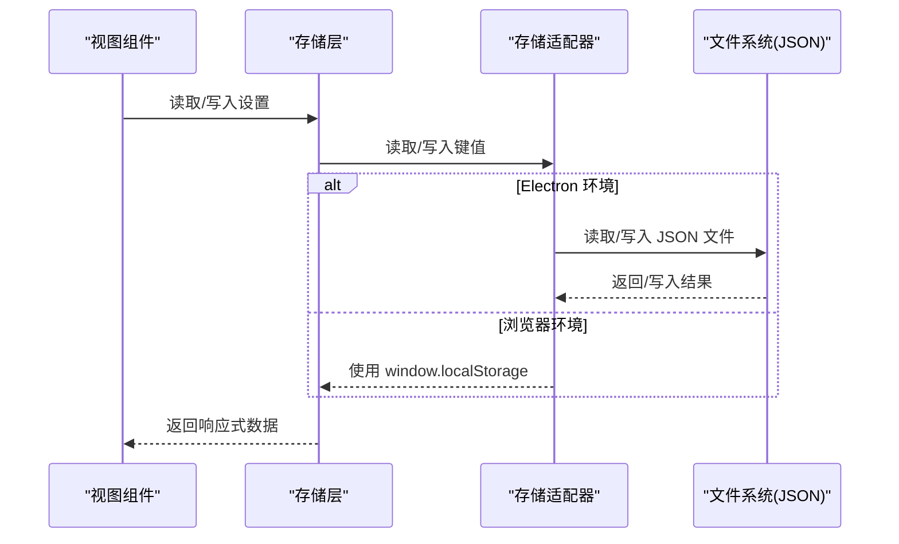
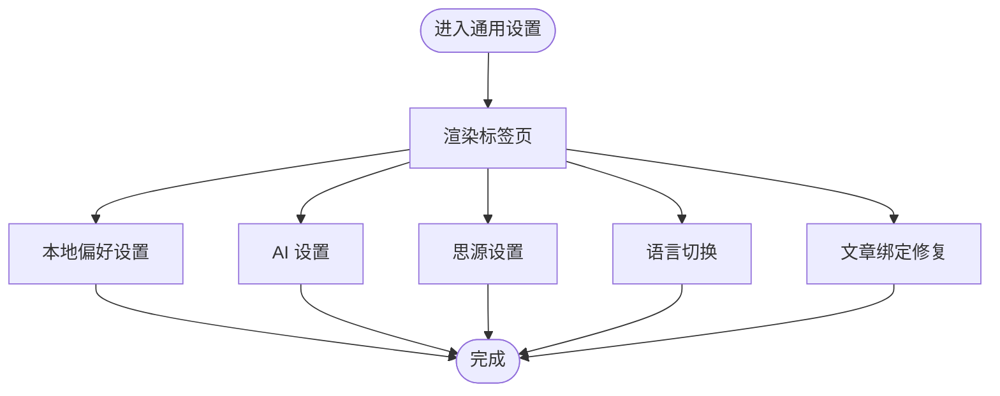
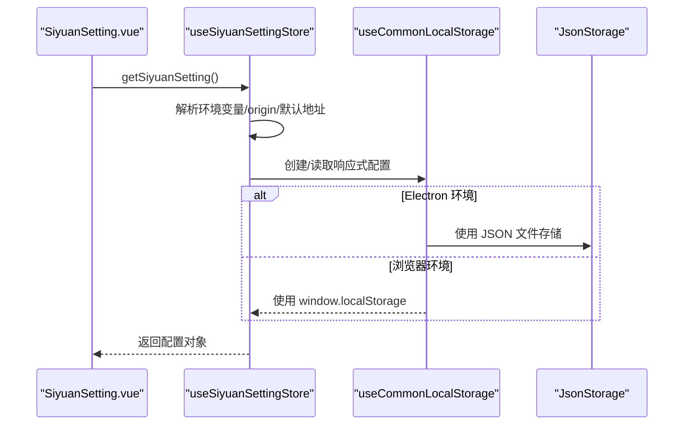
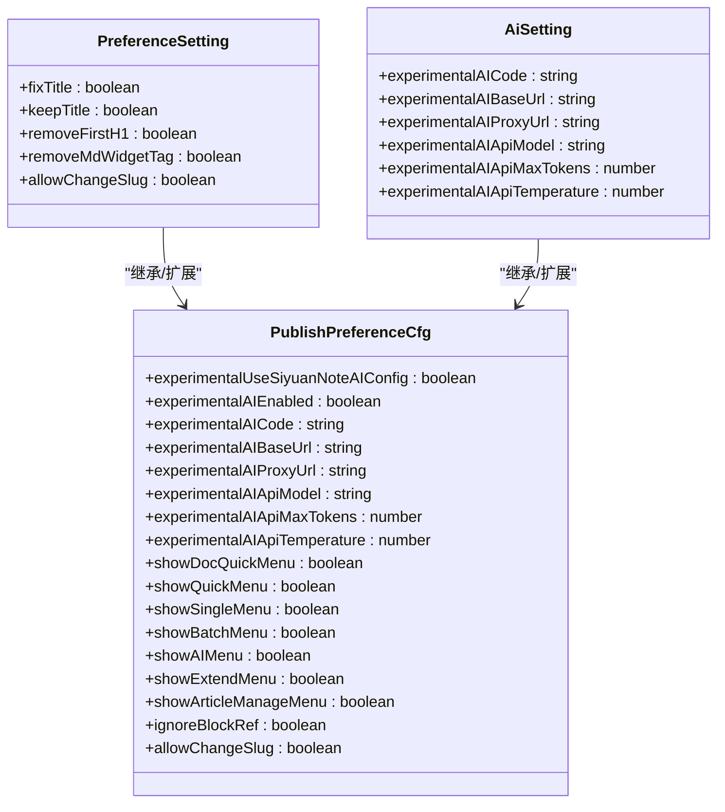
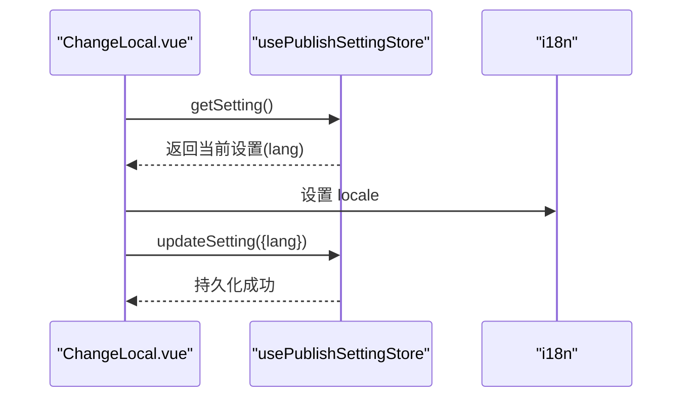
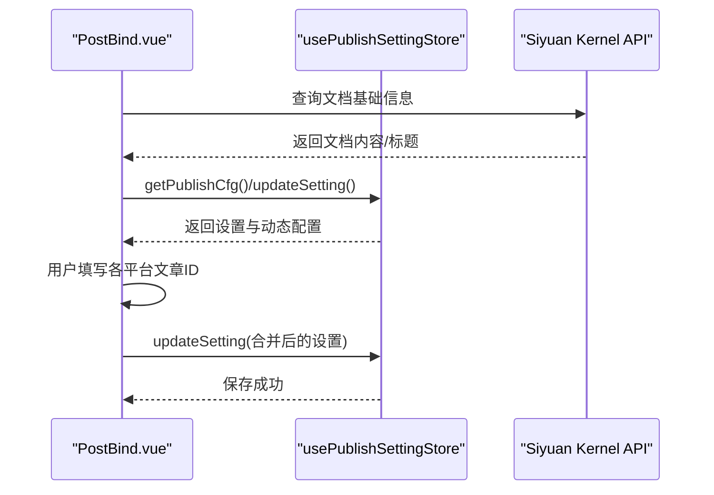
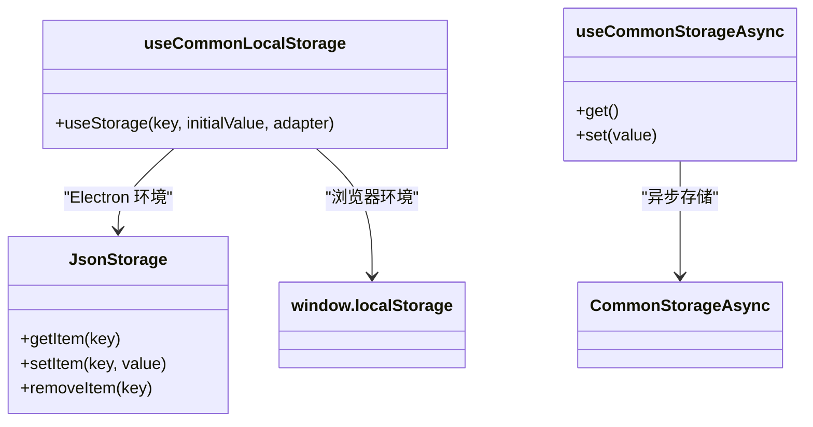
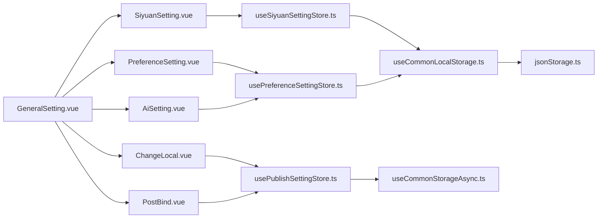

# 通用设置组件

<cite>
**本文引用的文件**
- [GeneralSetting.vue](file://src/components/set/GeneralSetting.vue)
- [SiyuanSetting.vue](file://src/components/set/SiyuanSetting.vue)
- [useSiyuanSettingStore.ts](file://src/stores/useSiyuanSettingStore.ts)
- [usePreferenceSettingStore.ts](file://src/stores/usePreferenceSettingStore.ts)
- [usePublishSettingStore.ts](file://src/stores/usePublishSettingStore.ts)
- [useCommonLocalStorage.ts](file://src/stores/common/useCommonLocalStorage.ts)
- [useCommonStorageAsync.ts](file://src/stores/common/useCommonStorageAsync.ts)
- [jsonStorage.ts](file://src/stores/common/jsonStorage.ts)
- [publishPreferenceCfg.ts](file://src/models/publishPreferenceCfg.ts)
- [PreferenceSetting.vue](file://src/components/set/preference/PreferenceSetting.vue)
- [AiSetting.vue](file://src/components/set/preference/AiSetting.vue)
- [ChangeLocal.vue](file://src/components/set/preference/ChangeLocal.vue)
- [PostBind.vue](file://src/components/set/preference/PostBind.vue)
- [syp.config.ts](file://syp.config.ts)
</cite>

## 目录
1. [简介](#简介)
2. [项目结构](#项目结构)
3. [核心组件](#核心组件)
4. [架构总览](#架构总览)
5. [详细组件分析](#详细组件分析)
6. [依赖关系分析](#依赖关系分析)
7. [性能考量](#性能考量)
8. [故障排查指南](#故障排查指南)
9. [结论](#结论)
10. [附录](#附录)

## 简介
本文件聚焦“通用设置组件”的设计与实现，系统阐述以下内容：
- GeneralSetting 作为全局设置入口的整体架构与模块划分
- SiyuanSetting 中思源笔记集成配置（API 地址、密码）的实现机制
- 通用设置与平台设置的关系与边界
- 设置项的分类管理、配置验证与错误处理
- 设置数据的存储策略、备份与恢复、版本兼容性

## 项目结构
通用设置相关代码主要分布在以下区域：
- 视图层：src/components/set 下的 GeneralSetting.vue 与 SiyuanSetting.vue，以及子模块 PreferenceSetting、AiSetting、ChangeLocal、PostBind
- 存储层：src/stores 下的 useSiyuanSettingStore.ts、usePreferenceSettingStore.ts、usePublishSettingStore.ts，以及通用存储适配 useCommonLocalStorage.ts、useCommonStorageAsync.ts、jsonStorage.ts
- 数据模型：src/models 下的 publishPreferenceCfg.ts
- 配置基线：syp.config.ts

图表来源
- [GeneralSetting.vue:17-37](file://src/components/set/GeneralSetting.vue#L17-L37)
- [SiyuanSetting.vue:10-18](file://src/components/set/SiyuanSetting.vue#L10-L18)
- [useSiyuanSettingStore.ts:26-62](file://src/stores/useSiyuanSettingStore.ts#L26-L62)
- [usePreferenceSettingStore.ts:21-67](file://src/stores/usePreferenceSettingStore.ts#L21-L67)
- [usePublishSettingStore.ts:21-59](file://src/stores/usePublishSettingStore.ts#L21-L59)
- [useCommonLocalStorage.ts:27-35](file://src/stores/common/useCommonLocalStorage.ts#L27-L35)
- [useCommonStorageAsync.ts:22-64](file://src/stores/common/useCommonStorageAsync.ts#L22-L64)
- [jsonStorage.ts:23-51](file://src/stores/common/jsonStorage.ts#L23-L51)
- [publishPreferenceCfg.ts:19-97](file://src/models/publishPreferenceCfg.ts#L19-L97)
- [syp.config.ts:28-49](file://syp.config.ts#L28-L49)

章节来源
- [GeneralSetting.vue:17-37](file://src/components/set/GeneralSetting.vue#L17-L37)
- [SiyuanSetting.vue:10-18](file://src/components/set/SiyuanSetting.vue#L10-L18)
- [useSiyuanSettingStore.ts:26-62](file://src/stores/useSiyuanSettingStore.ts#L26-L62)
- [usePreferenceSettingStore.ts:21-67](file://src/stores/usePreferenceSettingStore.ts#L21-L67)
- [usePublishSettingStore.ts:21-59](file://src/stores/usePublishSettingStore.ts#L21-L59)
- [useCommonLocalStorage.ts:27-35](file://src/stores/common/useCommonLocalStorage.ts#L27-L35)
- [useCommonStorageAsync.ts:22-64](file://src/stores/common/useCommonStorageAsync.ts#L22-L64)
- [jsonStorage.ts:23-51](file://src/stores/common/jsonStorage.ts#L23-L51)
- [publishPreferenceCfg.ts:19-97](file://src/models/publishPreferenceCfg.ts#L19-L97)
- [syp.config.ts:28-49](file://syp.config.ts#L28-L49)

## 核心组件
- GeneralSetting：全局设置入口页，提供本地偏好、AI 设置、思源设置、语言切换、文章绑定等标签页的统一入口
- SiyuanSetting：思源笔记集成配置，负责 API 地址与密码的输入与持久化
- PreferenceSetting：发布偏好设置，涵盖标题处理、菜单显示、AI 集成开关等
- AiSetting：AI 配置面板，支持 API Key、Base URL、代理、模型、最大 Token、温度等参数
- ChangeLocal：语言切换与持久化
- PostBind：文章绑定修复，用于为某篇文档补全各平台的已发布文章 ID

章节来源
- [GeneralSetting.vue:17-37](file://src/components/set/GeneralSetting.vue#L17-L37)
- [SiyuanSetting.vue:20-39](file://src/components/set/SiyuanSetting.vue#L20-L39)
- [PreferenceSetting.vue:51-107](file://src/components/set/preference/PreferenceSetting.vue#L51-L107)
- [AiSetting.vue:20-98](file://src/components/set/preference/AiSetting.vue#L20-L98)
- [ChangeLocal.vue:32-37](file://src/components/set/preference/ChangeLocal.vue#L32-L37)
- [PostBind.vue:54-82](file://src/components/set/preference/PostBind.vue#L54-L82)

## 架构总览
通用设置采用“视图组件 + 存储层 + 模型/配置”的分层架构：
- 视图组件通过组合式函数（Composables）访问 Pinia 或 VueUse 的响应式存储
- 存储层根据运行环境选择不同的存储适配器：Electron 环境使用 JSON 文件存储，浏览器环境使用浏览器本地存储
- 数据模型与配置基线提供默认值与结构约束，确保跨版本兼容与初始化一致性

图表来源
- [useCommonLocalStorage.ts:43-55](file://src/stores/common/useCommonLocalStorage.ts#L43-L55)
- [useCommonStorageAsync.ts:44-61](file://src/stores/common/useCommonStorageAsync.ts#L44-L61)
- [jsonStorage.ts:59-75](file://src/stores/common/jsonStorage.ts#L59-L75)

## 详细组件分析

### GeneralSetting 入口组件
- 负责组织多个设置标签页，包括本地偏好、AI 设置、思源设置、语言切换、文章绑定
- 使用国际化文本，保证多语言支持
- 通过子组件承载具体功能，保持职责单一

图表来源
- [GeneralSetting.vue:17-37](file://src/components/set/GeneralSetting.vue#L17-L37)

章节来源
- [GeneralSetting.vue:17-37](file://src/components/set/GeneralSetting.vue#L17-L37)

### SiyuanSetting 组件与存储
- 通过 useSiyuanSettingStore 获取或创建思源配置的响应式引用
- 支持从环境变量、当前窗口 origin、默认地址三种来源自动推断 API 地址
- 密码字段以安全方式输入与存储
- 自动兼容旧数据，确保 apiUrl 字段一致性

图表来源
- [SiyuanSetting.vue:10-18](file://src/components/set/SiyuanSetting.vue#L10-L18)
- [useSiyuanSettingStore.ts:36-62](file://src/stores/useSiyuanSettingStore.ts#L36-L62)
- [useCommonLocalStorage.ts:43-55](file://src/stores/common/useCommonLocalStorage.ts#L43-L55)
- [jsonStorage.ts:59-75](file://src/stores/common/jsonStorage.ts#L59-L75)

章节来源
- [SiyuanSetting.vue:20-39](file://src/components/set/SiyuanSetting.vue#L20-L39)
- [useSiyuanSettingStore.ts:36-62](file://src/stores/useSiyuanSettingStore.ts#L36-L62)
- [useCommonLocalStorage.ts:43-55](file://src/stores/common/useCommonLocalStorage.ts#L43-L55)
- [jsonStorage.ts:59-75](file://src/stores/common/jsonStorage.ts#L59-L75)

### PreferenceSetting 与 AiSetting
- PreferenceSetting 提供发布偏好设置，包含标题处理、菜单显示、AI 菜单开关、是否允许修改 slug 等
- AiSetting 提供 AI 配置项，包括 API Key、Base URL、代理、模型、最大 Token、温度等
- 当启用“使用思源笔记 AI 配置”时，AI 设置项会被禁用，避免冲突

图表来源
- [publishPreferenceCfg.ts:19-97](file://src/models/publishPreferenceCfg.ts#L19-L97)
- [PreferenceSetting.vue:51-107](file://src/components/set/preference/PreferenceSetting.vue#L51-L107)
- [AiSetting.vue:20-98](file://src/components/set/preference/AiSetting.vue#L20-L98)

章节来源
- [PreferenceSetting.vue:51-107](file://src/components/set/preference/PreferenceSetting.vue#L51-L107)
- [AiSetting.vue:20-98](file://src/components/set/preference/AiSetting.vue#L20-L98)
- [publishPreferenceCfg.ts:19-97](file://src/models/publishPreferenceCfg.ts#L19-L97)

### ChangeLocal 语言切换
- 从 usePublishSettingStore 读取当前设置，初始化语言
- 用户切换语言后更新设置并持久化
- 通过 i18n 的 locale 实时生效

图表来源
- [ChangeLocal.vue:30-37](file://src/components/set/preference/ChangeLocal.vue#L30-L37)
- [usePublishSettingStore.ts:38-59](file://src/stores/usePublishSettingStore.ts#L38-L59)

章节来源
- [ChangeLocal.vue:30-37](file://src/components/set/preference/ChangeLocal.vue#L30-L37)
- [usePublishSettingStore.ts:38-59](file://src/stores/usePublishSettingStore.ts#L38-L59)

### PostBind 文章绑定修复
- 通过路由参数或小部件 ID 获取文档 ID
- 读取发布配置，构建动态平台列表
- 用户填写各平台的已发布文章 ID，保存到对应文档的元信息中

图表来源
- [PostBind.vue:89-113](file://src/components/set/preference/PostBind.vue#L89-L113)
- [PostBind.vue:54-82](file://src/components/set/preference/PostBind.vue#L54-L82)
- [usePublishSettingStore.ts:38-59](file://src/stores/usePublishSettingStore.ts#L38-L59)

章节来源
- [PostBind.vue:89-113](file://src/components/set/preference/PostBind.vue#L89-L113)
- [PostBind.vue:54-82](file://src/components/set/preference/PostBind.vue#L54-L82)
- [usePublishSettingStore.ts:38-59](file://src/stores/usePublishSettingStore.ts#L38-L59)

### 存储策略与适配器
- useCommonLocalStorage：在思源环境中使用 JsonStorage 将数据写入 JSON 文件；在浏览器环境中使用 window.localStorage
- useCommonStorageAsync：基于 CommonStorageAsync 的异步存储，自动检测初始值类型并选择合适的序列化器
- jsonStorage：封装 fs 与 path，确保目录与文件存在，提供 JSON 读写能力

图表来源
- [useCommonLocalStorage.ts:27-35](file://src/stores/common/useCommonLocalStorage.ts#L27-L35)
- [useCommonLocalStorage.ts:43-55](file://src/stores/common/useCommonLocalStorage.ts#L43-L55)
- [jsonStorage.ts:23-51](file://src/stores/common/jsonStorage.ts#L23-L51)
- [useCommonStorageAsync.ts:22-64](file://src/stores/common/useCommonStorageAsync.ts#L22-L64)

章节来源
- [useCommonLocalStorage.ts:27-35](file://src/stores/common/useCommonLocalStorage.ts#L27-L35)
- [useCommonLocalStorage.ts:43-55](file://src/stores/common/useCommonLocalStorage.ts#L43-L55)
- [jsonStorage.ts:23-51](file://src/stores/common/jsonStorage.ts#L23-L51)
- [useCommonStorageAsync.ts:22-64](file://src/stores/common/useCommonStorageAsync.ts#L22-L64)

### 配置验证与错误处理
- PreferenceSetting 在用户尝试开启“允许修改 slug”前弹出确认框，防止误操作
- PostBind 在提交前校验文档 ID 是否为空，失败时提示错误消息
- 存储层在首次访问时自动写入初始值，避免空配置导致的异常

章节来源
- [PreferenceSetting.vue:30-48](file://src/components/set/preference/PreferenceSetting.vue#L30-L48)
- [PostBind.vue:54-82](file://src/components/set/preference/PostBind.vue#L54-L82)
- [useCommonStorageAsync.ts:44-61](file://src/stores/common/useCommonStorageAsync.ts#L44-L61)

### 版本兼容与默认值
- syp.config.ts 提供配置基线，包含语言与动态配置键位
- usePreferenceSettingStore 在加载时检测思源笔记的 AI 配置，自动填充 AI 参数
- useSiyuanSettingStore 在读取时自动兼容旧数据，确保 apiUrl 一致性

章节来源
- [syp.config.ts:28-49](file://syp.config.ts#L28-L49)
- [usePreferenceSettingStore.ts:40-57](file://src/stores/usePreferenceSettingStore.ts#L40-L57)
- [useSiyuanSettingStore.ts:57-61](file://src/stores/useSiyuanSettingStore.ts#L57-L61)

## 依赖关系分析
- 视图组件依赖存储层提供的响应式引用
- 存储层依赖通用适配器，适配不同运行环境
- 数据模型与配置基线为视图组件提供默认值与结构保障

图表来源
- [GeneralSetting.vue:17-37](file://src/components/set/GeneralSetting.vue#L17-L37)
- [SiyuanSetting.vue:10-18](file://src/components/set/SiyuanSetting.vue#L10-L18)
- [PreferenceSetting.vue:24-28](file://src/components/set/preference/PreferenceSetting.vue#L24-L28)
- [AiSetting.vue:15-18](file://src/components/set/preference/AiSetting.vue#L15-L18)
- [ChangeLocal.vue:17-18](file://src/components/set/preference/ChangeLocal.vue#L17-L18)
- [PostBind.vue:31-32](file://src/components/set/preference/PostBind.vue#L31-L32)
- [useSiyuanSettingStore.ts:12-15](file://src/stores/useSiyuanSettingStore.ts#L12-L15)
- [usePreferenceSettingStore.ts:13-16](file://src/stores/usePreferenceSettingStore.ts#L13-L16)
- [usePublishSettingStore.ts:10-14](file://src/stores/usePublishSettingStore.ts#L10-L14)
- [useCommonLocalStorage.ts:10-14](file://src/stores/common/useCommonLocalStorage.ts#L10-L14)
- [useCommonStorageAsync.ts:10-14](file://src/stores/common/useCommonStorageAsync.ts#L10-L14)
- [jsonStorage.ts:10-14](file://src/stores/common/jsonStorage.ts#L10-L14)

章节来源
- [GeneralSetting.vue:17-37](file://src/components/set/GeneralSetting.vue#L17-L37)
- [SiyuanSetting.vue:10-18](file://src/components/set/SiyuanSetting.vue#L10-L18)
- [PreferenceSetting.vue:24-28](file://src/components/set/preference/PreferenceSetting.vue#L24-L28)
- [AiSetting.vue:15-18](file://src/components/set/preference/AiSetting.vue#L15-L18)
- [ChangeLocal.vue:17-18](file://src/components/set/preference/ChangeLocal.vue#L17-L18)
- [PostBind.vue:31-32](file://src/components/set/preference/PostBind.vue#L31-L32)
- [useSiyuanSettingStore.ts:12-15](file://src/stores/useSiyuanSettingStore.ts#L12-L15)
- [usePreferenceSettingStore.ts:13-16](file://src/stores/usePreferenceSettingStore.ts#L13-L16)
- [usePublishSettingStore.ts:10-14](file://src/stores/usePublishSettingStore.ts#L10-L14)
- [useCommonLocalStorage.ts:10-14](file://src/stores/common/useCommonLocalStorage.ts#L10-L14)
- [useCommonStorageAsync.ts:10-14](file://src/stores/common/useCommonStorageAsync.ts#L10-L14)
- [jsonStorage.ts:10-14](file://src/stores/common/jsonStorage.ts#L10-L14)

## 性能考量
- 响应式存储：通过 VueUse 的 useStorage/useStorageAsync 提供响应式访问，减少不必要的重渲染
- 环境适配：在思源环境中使用 JSON 文件存储，避免跨进程通信开销；浏览器环境直接使用 localStorage
- 初始值检测：首次访问自动写入初始值，避免后续读取空配置带来的异常与重复初始化

## 故障排查指南
- 思源 API 地址无法连接
  - 检查环境变量与当前窗口 origin 是否正确
  - 确认中间件地址配置
- AI 配置未生效
  - 若启用“使用思源笔记 AI 配置”，外部 AI 设置会被禁用
  - 检查思源笔记的 AI 配置是否正确
- 语言切换无效
  - 确认设置项已持久化，且 i18n 的 locale 已更新
- 文章绑定修复失败
  - 确认文档 ID 正确
  - 检查各平台的 posidKey 是否配置正确

章节来源
- [useSiyuanSettingStore.ts:49-51](file://src/stores/useSiyuanSettingStore.ts#L49-L51)
- [AiSetting.vue:29-72](file://src/components/set/preference/AiSetting.vue#L29-L72)
- [ChangeLocal.vue:32-37](file://src/components/set/preference/ChangeLocal.vue#L32-L37)
- [PostBind.vue:54-82](file://src/components/set/preference/PostBind.vue#L54-L82)

## 结论
通用设置组件通过清晰的分层架构与环境适配，实现了在不同运行环境下的一致配置体验。SiyuanSetting 专注于思源笔记集成，PreferenceSetting 与 AiSetting 提供发布偏好与 AI 参数管理，ChangeLocal 与 PostBind 则分别负责语言切换与文章绑定修复。存储层通过通用适配器与 JSON 文件存储，兼顾了易用性与可靠性。

## 附录
- 通用设置与平台设置的区别与联系
  - 通用设置：面向全局与通用场景的配置（如语言、偏好、AI、思源集成）
  - 平台设置：面向特定发布平台的配置（如 GitHub、WordPress 等），由平台设置组件承载
  - 关系：二者共同构成完整的发布生态配置体系，通用设置为平台设置提供基础支撑