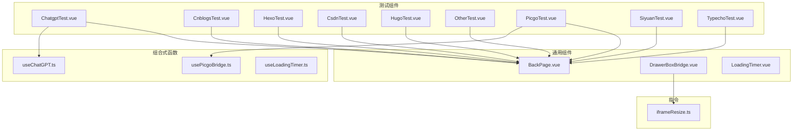
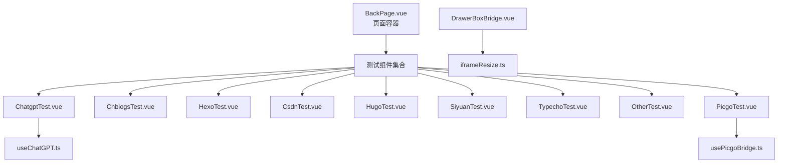
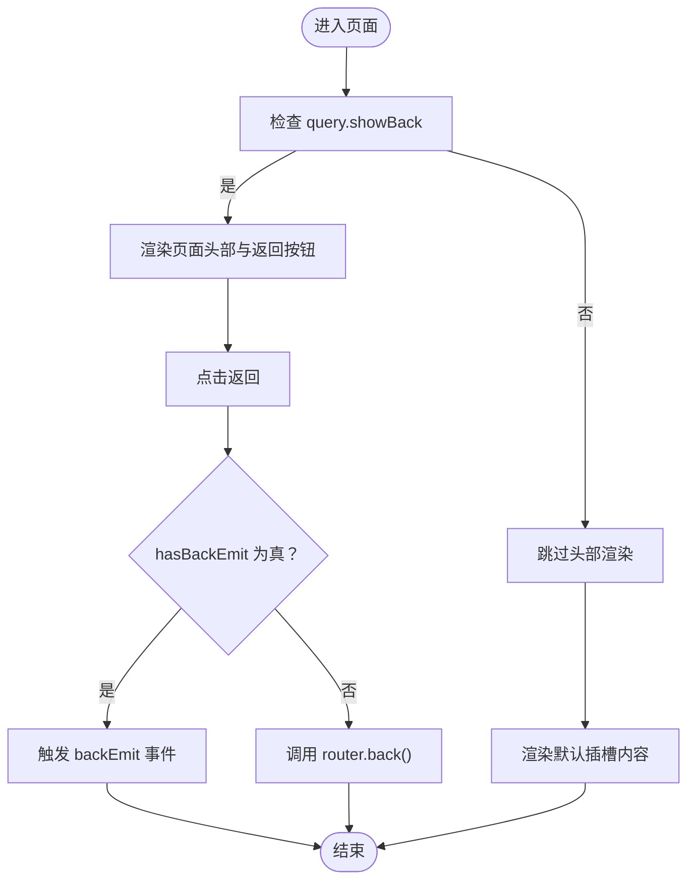
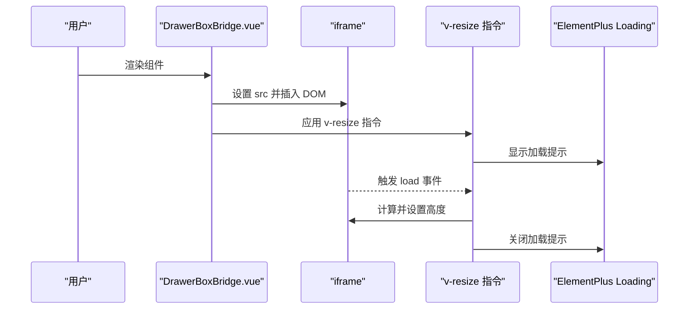
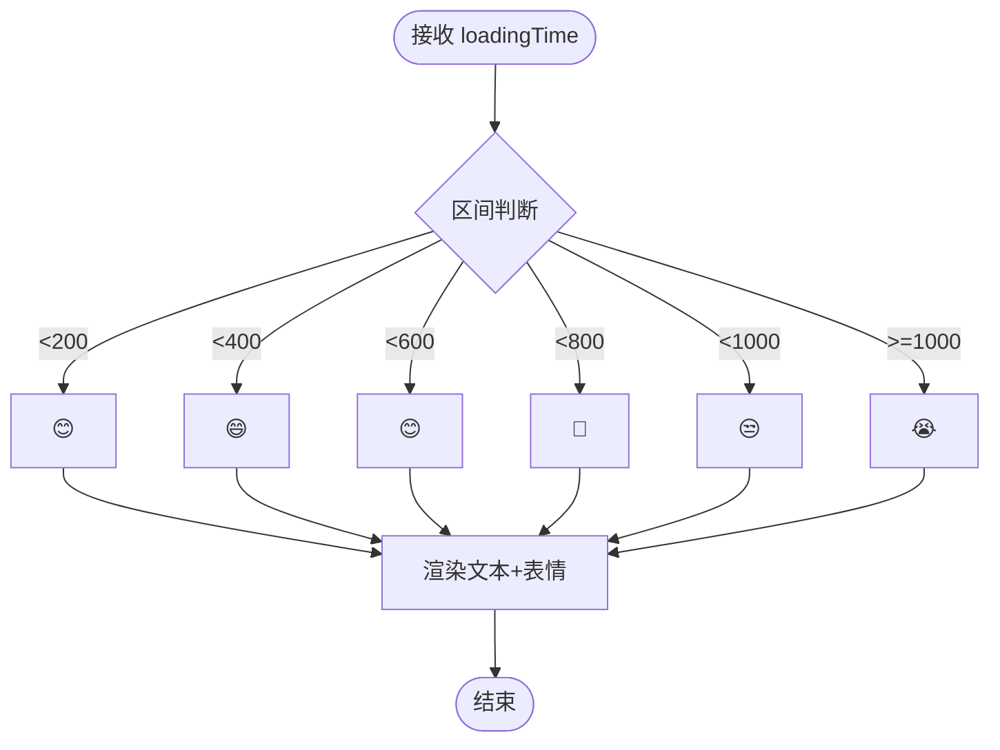
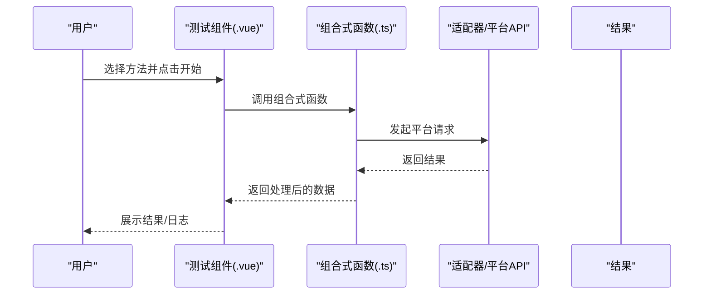
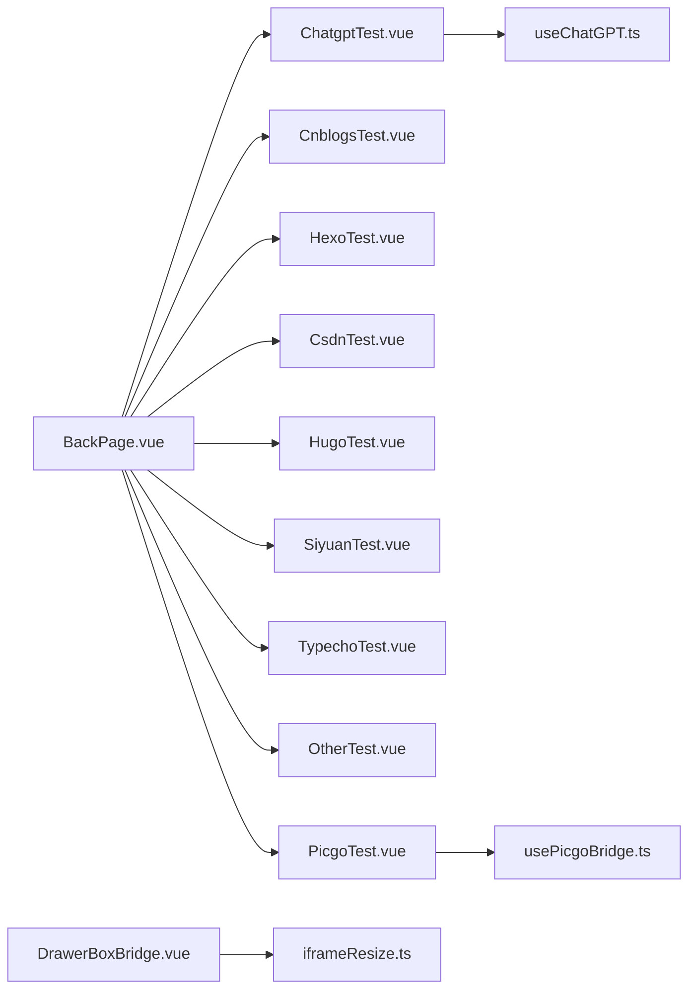

# 通用组件

<cite>
**本文引用的文件**
- [BackPage.vue](file://src/components/common/BackPage.vue)
- [DrawerBoxBridge.vue](file://src/components/common/DrawerBoxBridge.vue)
- [LoadingTimer.vue](file://src/components/common/LoadingTimer.vue)
- [ChatgptTest.vue](file://src/components/test/ChatgptTest.vue)
- [CnblogsTest.vue](file://src/components/test/CnblogsTest.vue)
- [HexoTest.vue](file://src/components/test/HexoTest.vue)
- [CsdnTest.vue](file://src/components/test/CsdnTest.vue)
- [HugoTest.vue](file://src/components/test/HugoTest.vue)
- [OtherTest.vue](file://src/components/test/OtherTest.vue)
- [PicgoTest.vue](file://src/components/test/PicgoTest.vue)
- [SiyuanTest.vue](file://src/components/test/SiyuanTest.vue)
- [TypechoTest.vue](file://src/components/test/TypechoTest.vue)
- [useChatGPT.ts](file://src/composables/useChatGPT.ts)
- [usePicgoBridge.ts](file://src/composables/usePicgoBridge.ts)
- [useLoadingTimer.ts](file://src/composables/useLoadingTimer.ts)
- [iframeResize.ts](file://src/utils/directives/iframeResize.ts)
</cite>

## 目录
1. [简介](#简介)
2. [项目结构](#项目结构)
3. [核心组件](#核心组件)
4. [架构总览](#架构总览)
5. [组件详解](#组件详解)
6. [依赖关系分析](#依赖关系分析)
7. [性能考量](#性能考量)
8. [故障排查指南](#故障排查指南)
9. [结论](#结论)
10. [附录](#附录)

## 简介
本文件聚焦于通用组件与测试组件系统，系统性梳理以下内容：
- 基础通用组件：BackPage、DrawerBoxBridge、LoadingTimer 的设计与实现要点
- 测试组件系统：ChatgptTest、CnblogsTest、HexoTest、CsdnTest、HugoTest、OtherTest、PicgoTest、SiyuanTest、TypechoTest 的功能与使用方式
- 组件可复用性设计：props 设计、事件与插槽传递、样式封装
- 组合式函数与指令：useChatGPT、usePicgoBridge、useLoadingTimer、iframeResize 指令
- 单元测试策略、调试技巧与性能优化建议

## 项目结构
通用组件位于 src/components/common，测试组件位于 src/components/test；组合式函数位于 src/composables；指令位于 src/utils/directives。

图表来源
- [BackPage.vue:1-114](file://src/components/common/BackPage.vue#L1-L114)
- [DrawerBoxBridge.vue:1-35](file://src/components/common/DrawerBoxBridge.vue#L1-L35)
- [LoadingTimer.vue:1-35](file://src/components/common/LoadingTimer.vue#L1-L35)
- [ChatgptTest.vue:1-89](file://src/components/test/ChatgptTest.vue#L1-L89)
- [CnblogsTest.vue:1-425](file://src/components/test/CnblogsTest.vue#L1-L425)
- [HexoTest.vue:1-276](file://src/components/test/HexoTest.vue#L1-L276)
- [CsdnTest.vue:1-146](file://src/components/test/CsdnTest.vue#L1-L146)
- [HugoTest.vue:1-276](file://src/components/test/HugoTest.vue#L1-L276)
- [OtherTest.vue:1-59](file://src/components/test/OtherTest.vue#L1-L59)
- [PicgoTest.vue:1-49](file://src/components/test/PicgoTest.vue#L1-L49)
- [SiyuanTest.vue:1-351](file://src/components/test/SiyuanTest.vue#L1-L351)
- [TypechoTest.vue:1-317](file://src/components/test/TypechoTest.vue#L1-L317)
- [useChatGPT.ts:1-130](file://src/composables/useChatGPT.ts#L1-L130)
- [usePicgoBridge.ts:1-153](file://src/composables/usePicgoBridge.ts#L1-L153)
- [useLoadingTimer.ts:1-56](file://src/composables/useLoadingTimer.ts#L1-L56)
- [iframeResize.ts:1-71](file://src/utils/directives/iframeResize.ts#L1-L71)

章节来源
- [BackPage.vue:1-114](file://src/components/common/BackPage.vue#L1-L114)
- [DrawerBoxBridge.vue:1-35](file://src/components/common/DrawerBoxBridge.vue#L1-L35)
- [LoadingTimer.vue:1-35](file://src/components/common/LoadingTimer.vue#L1-L35)
- [ChatgptTest.vue:1-89](file://src/components/test/ChatgptTest.vue#L1-L89)
- [CnblogsTest.vue:1-425](file://src/components/test/CnblogsTest.vue#L1-L425)
- [HexoTest.vue:1-276](file://src/components/test/HexoTest.vue#L1-L276)
- [CsdnTest.vue:1-146](file://src/components/test/CsdnTest.vue#L1-L146)
- [HugoTest.vue:1-276](file://src/components/test/HugoTest.vue#L1-L276)
- [OtherTest.vue:1-59](file://src/components/test/OtherTest.vue#L1-L59)
- [PicgoTest.vue:1-49](file://src/components/test/PicgoTest.vue#L1-L49)
- [SiyuanTest.vue:1-351](file://src/components/test/SiyuanTest.vue#L1-L351)
- [TypechoTest.vue:1-317](file://src/components/test/TypechoTest.vue#L1-L317)
- [useChatGPT.ts:1-130](file://src/composables/useChatGPT.ts#L1-L130)
- [usePicgoBridge.ts:1-153](file://src/composables/usePicgoBridge.ts#L1-L153)
- [useLoadingTimer.ts:1-56](file://src/composables/useLoadingTimer.ts#L1-L56)
- [iframeResize.ts:1-71](file://src/utils/directives/iframeResize.ts#L1-L71)

## 核心组件
- BackPage：提供统一的页面头部返回与帮助入口，支持通过 query 控制显示返回按钮，支持回退事件或路由回退两种回退策略，并内置帮助文案国际化与外部帮助链接打开能力。
- DrawerBoxBridge：轻量桥接组件，基于 iframe 动态加载外部页面，内置自适应高度与加载提示，通过 v-resize 指令实现自动高度调整与加载状态提示。
- LoadingTimer：展示页面加载耗时，根据耗时区间显示不同表情符号，便于直观感知性能表现。

章节来源
- [BackPage.vue:27-70](file://src/components/common/BackPage.vue#L27-L70)
- [DrawerBoxBridge.vue:14-34](file://src/components/common/DrawerBoxBridge.vue#L14-L34)
- [LoadingTimer.vue:14-34](file://src/components/common/LoadingTimer.vue#L14-L34)

## 架构总览
通用组件与测试组件通过统一的页面容器 BackPage 进行组织，测试组件内部通过组合式函数与适配器层对接具体平台 API 或服务，形成“页面容器 + 业务逻辑 + 平台适配”的分层架构。

图表来源
- [BackPage.vue:73-99](file://src/components/common/BackPage.vue#L73-L99)
- [ChatgptTest.vue:10-58](file://src/components/test/ChatgptTest.vue#L10-L58)
- [PicgoTest.vue:10-34](file://src/components/test/PicgoTest.vue#L10-L34)
- [DrawerBoxBridge.vue:24-34](file://src/components/common/DrawerBoxBridge.vue#L24-L34)
- [iframeResize.ts:22-68](file://src/utils/directives/iframeResize.ts#L22-L68)
- [useChatGPT.ts:26-127](file://src/composables/useChatGPT.ts#L26-L127)
- [usePicgoBridge.ts:25-149](file://src/composables/usePicgoBridge.ts#L25-L149)

## 组件详解

### BackPage 组件
- 设计要点
  - 属性：title（标题）、hasBackEmit（是否启用 backEmit 回调）、helpKey（帮助键）
  - 事件：backEmit（当 hasBackEmit 为真时触发）
  - 插槽：默认插槽承载页面主体内容
  - 行为：根据 query.showBack 决定是否显示返回区域；点击返回优先触发 backEmit，否则回退到上一页
  - 帮助：根据 helpKey 打开对应帮助链接，未配置时回退到默认帮助页
- 可复用性
  - 通过 props 与事件解耦页面行为，适合多页面复用
  - 支持国际化帮助文案
- 样式封装
  - 采用 scoped 样式，局部作用域避免污染

图表来源
- [BackPage.vue:48-70](file://src/components/common/BackPage.vue#L48-L70)

章节来源
- [BackPage.vue:27-70](file://src/components/common/BackPage.vue#L27-L70)
- [BackPage.vue:73-99](file://src/components/common/BackPage.vue#L73-L99)

### DrawerBoxBridge 组件
- 设计要点
  - 属性：src（目标 iframe 地址）
  - 指令：v-resize（自动计算宽度并设置 iframe 高度，加载完成关闭全局加载提示）
- 可复用性
  - 仅负责桥接 iframe，职责单一，易于在多处复用
- 样式封装
  - scoped 样式确保组件内样式隔离

图表来源
- [DrawerBoxBridge.vue:24-34](file://src/components/common/DrawerBoxBridge.vue#L24-L34)
- [iframeResize.ts:22-68](file://src/utils/directives/iframeResize.ts#L22-L68)

章节来源
- [DrawerBoxBridge.vue:14-34](file://src/components/common/DrawerBoxBridge.vue#L14-L34)
- [iframeResize.ts:22-68](file://src/utils/directives/iframeResize.ts#L22-L68)

### LoadingTimer 组件
- 设计要点
  - 属性：loadingTime（毫秒数）
  - 行为：按区间显示不同表情，直观反馈加载时长
- 可复用性
  - 无副作用，纯展示组件，可在任意需要展示耗时的场景复用

图表来源
- [LoadingTimer.vue:22-34](file://src/components/common/LoadingTimer.vue#L22-L34)

章节来源
- [LoadingTimer.vue:14-34](file://src/components/common/LoadingTimer.vue#L14-L34)

### 测试组件系统
- ChatgptTest
  - 用途：测试 ChatGPT 对话能力
  - 机制：通过 useChatGPT 提供的 chat 方法发起对话，错误时弹出消息提示
  - 交互：输入框、发送按钮、清屏按钮、输出区域
- CnblogsTest
  - 用途：测试博客园平台接口
  - 机制：根据方法选项动态生成参数，调用适配器层 API，打印结果
  - 支持：媒体对象上传（远程图片转 base64 后构造 MediaObject）
- HexoTest / HugoTest
  - 用途：测试静态站点平台的媒体上传流程
  - 机制：读取本地文件转换为二进制，构造 MediaObject，调用 XML-RPC 客户端上传
- CsdnTest
  - 用途：测试 CSDN 平台元数据与博客信息
  - 机制：通过 web 适配器获取元数据与博客列表
- OtherTest
  - 用途：测试 Notion 转换
  - 机制：将 Markdown 转换为 Notion 对象并输出
- PicgoTest
  - 用途：测试图片上传与替换
  - 机制：通过 usePicgoBridge 将文档中的图片上传至图床并替换链接
- SiyuanTest
  - 用途：测试思源笔记平台的博文 CRUD 与媒体上传
  - 机制：构建 SiyuanConfig 与 SiYuanApiAdaptor，调用 blogApi 执行操作
- TypechoTest
  - 用途：测试 Typecho 平台媒体上传
  - 机制：远程图片转 base64，构造 MediaObject，调用适配器层 newMediaObject

图表来源
- [ChatgptTest.vue:30-57](file://src/components/test/ChatgptTest.vue#L30-L57)
- [CnblogsTest.vue:168-388](file://src/components/test/CnblogsTest.vue#L168-L388)
- [HexoTest.vue:168-241](file://src/components/test/HexoTest.vue#L168-L241)
- [CsdnTest.vue:71-109](file://src/components/test/CsdnTest.vue#L71-L109)
- [OtherTest.vue:33-37](file://src/components/test/OtherTest.vue#L33-L37)
- [PicgoTest.vue:30-34](file://src/components/test/PicgoTest.vue#L30-L34)
- [SiyuanTest.vue:169-314](file://src/components/test/SiyuanTest.vue#L169-L314)
- [TypechoTest.vue:165-280](file://src/components/test/TypechoTest.vue#L165-L280)
- [useChatGPT.ts:81-109](file://src/composables/useChatGPT.ts#L81-L109)
- [usePicgoBridge.ts:35-77](file://src/composables/usePicgoBridge.ts#L35-L77)

章节来源
- [ChatgptTest.vue:10-58](file://src/components/test/ChatgptTest.vue#L10-L58)
- [CnblogsTest.vue:86-388](file://src/components/test/CnblogsTest.vue#L86-L388)
- [HexoTest.vue:86-241](file://src/components/test/HexoTest.vue#L86-L241)
- [CsdnTest.vue:45-109](file://src/components/test/CsdnTest.vue#L45-L109)
- [OtherTest.vue:29-37](file://src/components/test/OtherTest.vue#L29-L37)
- [PicgoTest.vue:21-34](file://src/components/test/PicgoTest.vue#L21-L34)
- [SiyuanTest.vue:87-314](file://src/components/test/SiyuanTest.vue#L87-L314)
- [TypechoTest.vue:83-280](file://src/components/test/TypechoTest.vue#L83-L280)
- [useChatGPT.ts:26-127](file://src/composables/useChatGPT.ts#L26-L127)
- [usePicgoBridge.ts:25-149](file://src/composables/usePicgoBridge.ts#L25-L149)

## 依赖关系分析
- 组件间依赖
  - 测试组件均依赖 BackPage 作为页面容器
  - ChatgptTest 依赖 useChatGPT
  - PicgoTest 依赖 usePicgoBridge
  - DrawerBoxBridge 依赖 iframeResize 指令
- 组合式函数依赖
  - useChatGPT 依赖偏好设置存储与环境变量
  - usePicgoBridge 依赖思源 API 与图床服务类型判断
- 指令依赖
  - iframeResize 依赖 iframe-resizer 与 ElementPlus Loading

图表来源
- [BackPage.vue:73-99](file://src/components/common/BackPage.vue#L73-L99)
- [ChatgptTest.vue:12-21](file://src/components/test/ChatgptTest.vue#L12-L21)
- [PicgoTest.vue:11-18](file://src/components/test/PicgoTest.vue#L11-L18)
- [DrawerBoxBridge.vue:26-33](file://src/components/common/DrawerBoxBridge.vue#L26-L33)
- [iframeResize.ts:10-14](file://src/utils/directives/iframeResize.ts#L10-L14)
- [useChatGPT.ts:10-16](file://src/composables/useChatGPT.ts#L10-L16)
- [usePicgoBridge.ts:10-17](file://src/composables/usePicgoBridge.ts#L10-L17)

章节来源
- [BackPage.vue:73-99](file://src/components/common/BackPage.vue#L73-L99)
- [ChatgptTest.vue:12-21](file://src/components/test/ChatgptTest.vue#L12-L21)
- [PicgoTest.vue:11-18](file://src/components/test/PicgoTest.vue#L11-L18)
- [DrawerBoxBridge.vue:26-33](file://src/components/common/DrawerBoxBridge.vue#L26-L33)
- [iframeResize.ts:10-14](file://src/utils/directives/iframeResize.ts#L10-L14)
- [useChatGPT.ts:10-16](file://src/composables/useChatGPT.ts#L10-L16)
- [usePicgoBridge.ts:10-17](file://src/composables/usePicgoBridge.ts#L10-L17)

## 性能考量
- LoadingTimer
  - 通过 useLoadingTimer 在组件挂载与状态切换时记录时间差，便于监控页面加载耗时
- DrawerBoxBridge + iframeResize
  - 自动计算 iframe 最大宽度并设置高度，减少手动布局成本；加载阶段显示全局提示，提升用户体验
- 组合式函数
  - useChatGPT 与 usePicgoBridge 采用懒初始化与单例模式，降低重复初始化开销
- 建议
  - 对频繁切换的测试组件，考虑缓存中间结果与配置
  - 图片上传类操作建议异步化并在 UI 上提供进度反馈

章节来源
- [useLoadingTimer.ts:20-55](file://src/composables/useLoadingTimer.ts#L20-L55)
- [iframeResize.ts:22-68](file://src/utils/directives/iframeResize.ts#L22-L68)
- [useChatGPT.ts:33-67](file://src/composables/useChatGPT.ts#L33-L67)
- [usePicgoBridge.ts:52-77](file://src/composables/usePicgoBridge.ts#L52-L77)

## 故障排查指南
- BackPage
  - 若返回按钮无效：确认 query.showBack 是否为 "true"；确认 hasBackEmit 为 true 时是否正确绑定事件
  - 帮助链接异常：确认 helpKey 对应的帮助键是否存在，不存在则回退到默认帮助页
- DrawerBoxBridge
  - iframe 无法自适应：检查 v-resize 指令参数与目标页面是否正确响应尺寸变化
  - 加载长时间不结束：检查 warningTimeout 配置与网络状况
- ChatgptTest
  - 请求失败：检查 OPENAI 相关环境变量与代理配置；查看错误消息提示
- CnblogsTest / HexoTest / HugoTest / SiyuanTest / TypechoTest
  - 参数格式错误：核对方法选项与参数 JSON；注意 postid、numOfPosts 等字段
  - 上传失败：检查媒体文件二进制转换与 MIME 类型；确认平台 API 地址与鉴权信息
- PicgoTest
  - 图片未上传：确认图床服务类型与 PicGo 插件安装状态；查看警告/错误消息

章节来源
- [BackPage.vue:48-70](file://src/components/common/BackPage.vue#L48-L70)
- [DrawerBoxBridge.vue:24-34](file://src/components/common/DrawerBoxBridge.vue#L24-L34)
- [iframeResize.ts:30-38](file://src/utils/directives/iframeResize.ts#L30-L38)
- [ChatgptTest.vue:30-57](file://src/components/test/ChatgptTest.vue#L30-L57)
- [CnblogsTest.vue:168-388](file://src/components/test/CnblogsTest.vue#L168-L388)
- [HexoTest.vue:168-241](file://src/components/test/HexoTest.vue#L168-L241)
- [SiyuanTest.vue:169-314](file://src/components/test/SiyuanTest.vue#L169-L314)
- [TypechoTest.vue:165-280](file://src/components/test/TypechoTest.vue#L165-L280)
- [PicgoTest.vue:30-34](file://src/components/test/PicgoTest.vue#L30-L34)
- [useChatGPT.ts:60-67](file://src/composables/useChatGPT.ts#L60-L67)
- [usePicgoBridge.ts:138-142](file://src/composables/usePicgoBridge.ts#L138-L142)

## 结论
本通用组件与测试组件系统以 BackPage 为页面容器，结合 DrawerBoxBridge 与 LoadingTimer 提供一致的交互体验；测试组件通过 useChatGPT、usePicgoBridge 等组合式函数与平台适配器对接，形成清晰的分层架构。该设计具备良好的可复用性、可维护性与扩展性，适合在多平台发布场景中快速落地与迭代。

## 附录

### 组件开发最佳实践
- 命名规范
  - 组件文件名采用帕斯卡命名（如 BackPage.vue），便于识别与导入
- Props 设计
  - 明确默认值与类型约束；区分只读与可变 props，必要时提供校验
- 事件与插槽
  - 事件命名采用动词短语，遵循“onXxx”约定；插槽按需暴露，避免过度耦合
- 样式封装
  - 使用 scoped 样式；避免全局污染；必要时提供主题变量
- 组合式函数
  - 单一职责、可测试性强；对外暴露稳定 API；内部使用懒初始化与缓存
- 指令
  - 保持幂等与可卸载；在 unmounted 中清理监听与资源

### 单元测试策略
- 组件测试
  - 使用渲染快照与交互模拟（如点击、输入）验证行为
  - 对 props 与事件进行边界条件测试
- 组合式函数测试
  - 对异步函数进行超时与错误分支测试；对懒初始化进行多次调用验证
- 指令测试
  - 验证挂载/卸载生命周期与 DOM 事件绑定；模拟 iframe load 事件

### 调试技巧
- 利用日志模块输出关键路径参数与返回值
- 在开发模式下开启指令日志与 API 调试开关
- 对网络请求进行拦截与断点调试，定位平台适配问题

### 性能优化建议
- 减少不必要的重渲染：合理使用 computed 与 watch；避免在模板中直接调用复杂函数
- 异步操作并发控制：对批量上传与请求进行节流/防抖
- 缓存策略：对配置与静态资源进行缓存，减少重复初始化