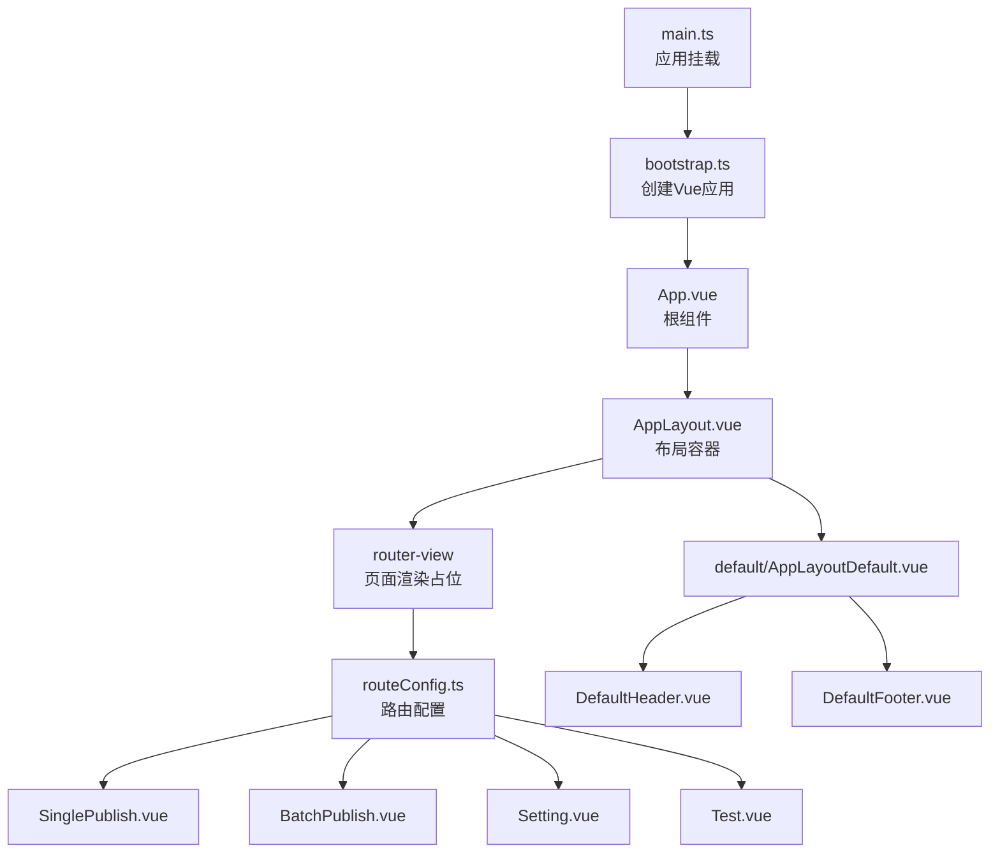
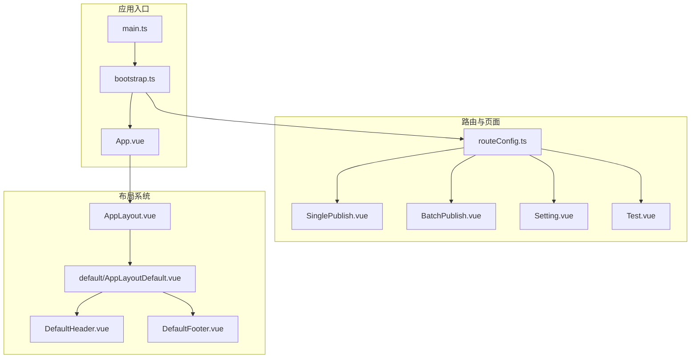
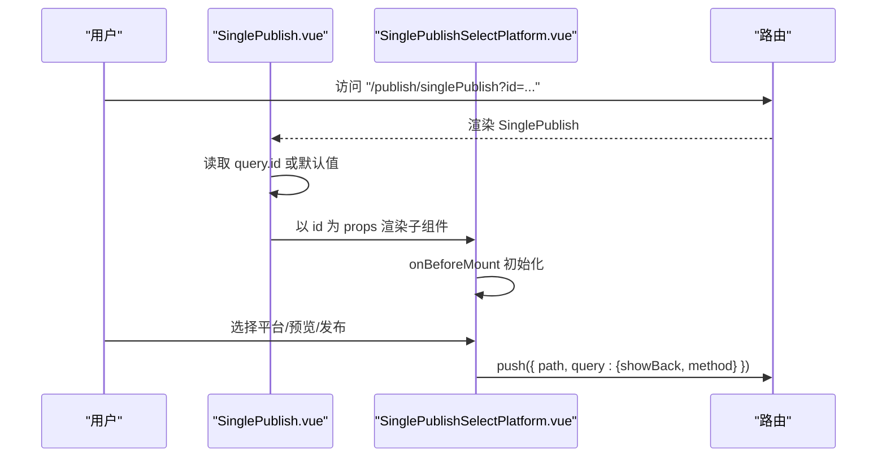
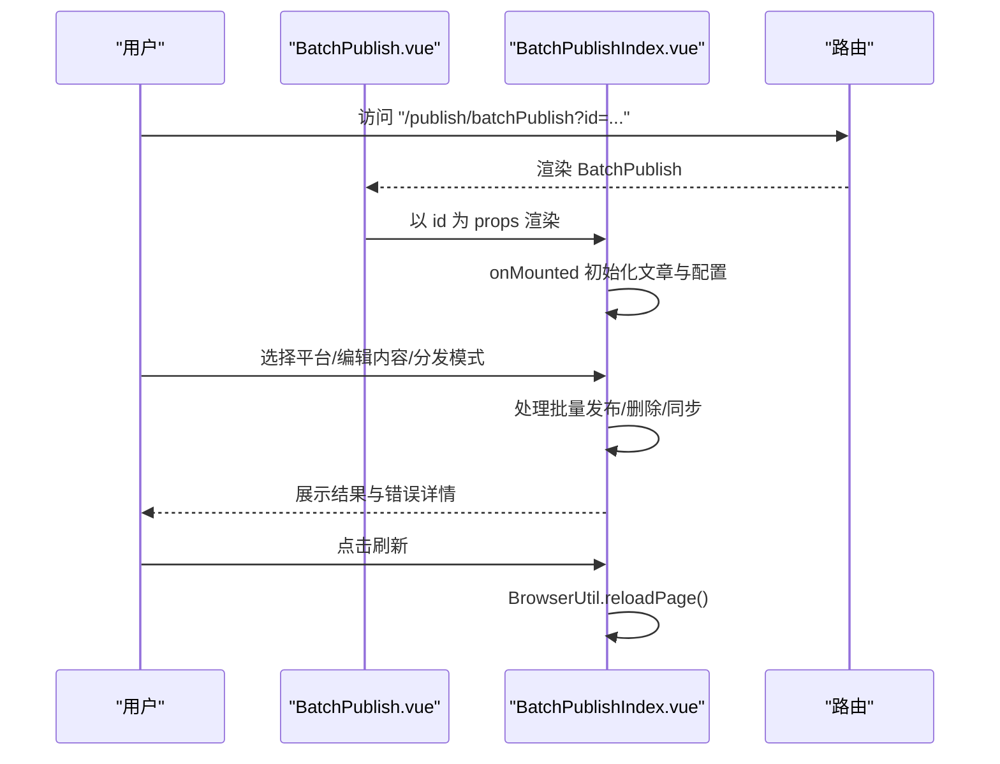
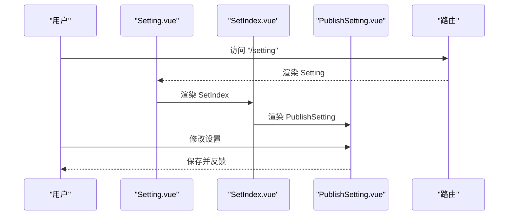
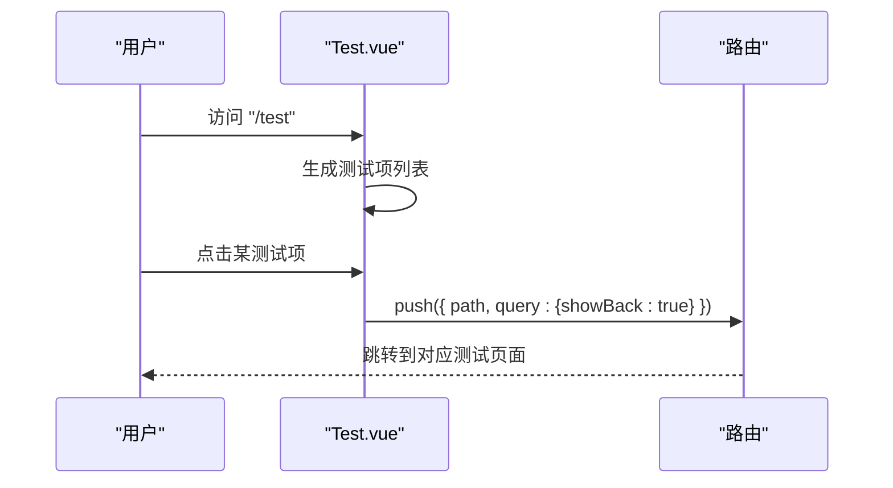
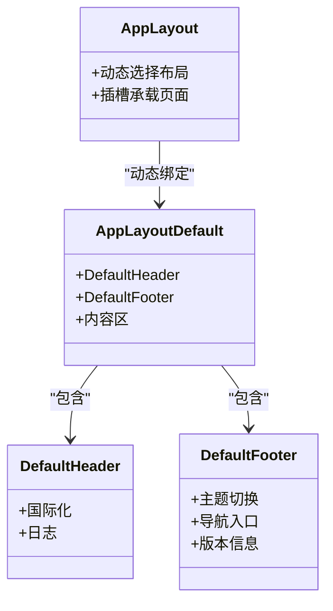
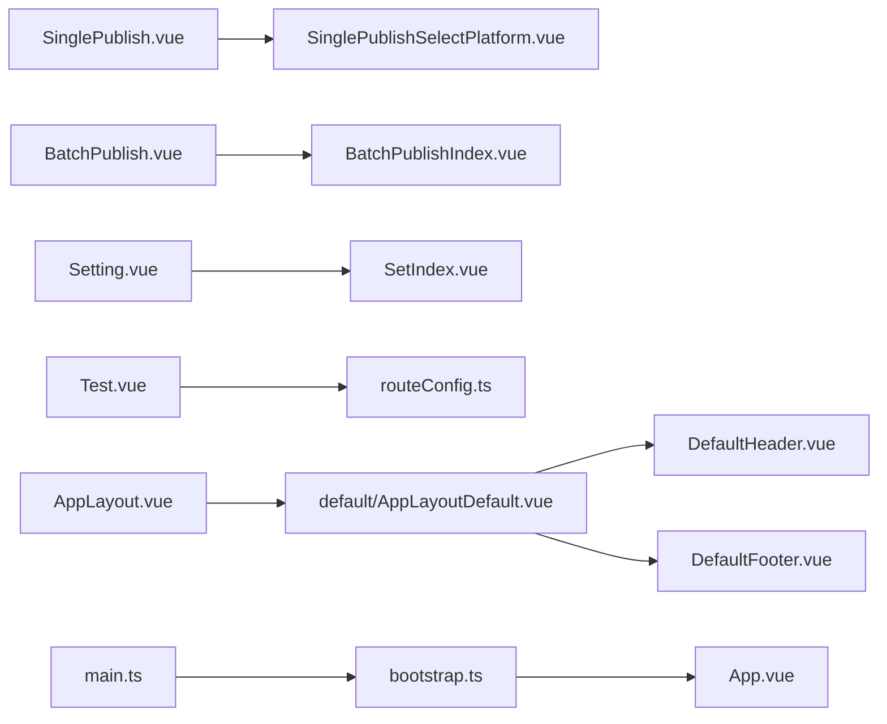

# 页面组件

<cite>
**本文引用的文件**
- [src/pages/SinglePublish.vue](file://src/pages/SinglePublish.vue)
- [src/pages/BatchPublish.vue](file://src/pages/BatchPublish.vue)
- [src/pages/Setting.vue](file://src/pages/Setting.vue)
- [src/pages/Test.vue](file://src/pages/Test.vue)
- [src/routes/routeConfig.ts](file://src/routes/routeConfig.ts)
- [src/layouts/AppLayout.vue](file://src/layouts/AppLayout.vue)
- [src/layouts/default/AppLayoutDefault.vue](file://src/layouts/default/AppLayoutDefault.vue)
- [src/layouts/default/DefaultHeader.vue](file://src/layouts/default/DefaultHeader.vue)
- [src/layouts/default/DefaultFooter.vue](file://src/layouts/default/DefaultFooter.vue)
- [src/components/publish/SinglePublishSelectPlatform.vue](file://src/components/publish/SinglePublishSelectPlatform.vue)
- [src/components/publish/BatchPublishIndex.vue](file://src/components/publish/BatchPublishIndex.vue)
- [src/components/set/SetIndex.vue](file://src/components/set/SetIndex.vue)
- [src/bootstrap.ts](file://src/bootstrap.ts)
- [src/main.ts](file://src/main.ts)
- [src/App.vue](file://src/App.vue)
</cite>

## 目录
1. [简介](#简介)
2. [项目结构](#项目结构)
3. [核心组件](#核心组件)
4. [架构总览](#架构总览)
5. [详细组件分析](#详细组件分析)
6. [依赖分析](#依赖分析)
7. [性能考虑](#性能考虑)
8. [故障排查指南](#故障排查指南)
9. [结论](#结论)
10. [附录](#附录)

## 简介
本文件聚焦“页面组件”与“路由系统”的设计与实现，围绕 SinglePublish、BatchPublish、Setting、Test 等页面组件展开，同时梳理布局组件系统（AppLayout、default 布局、头部与底部）、导航机制、路由配置、页面间数据传递与状态管理、生命周期管理与性能优化策略，并给出响应式设计与移动端适配、主题切换的实践路径。

## 项目结构
- 页面层：SinglePublish、BatchPublish、Setting、Test 等页面组件负责入口与导航承载。
- 路由层：集中定义在 routeConfig.ts，统一声明各页面路径与组件映射。
- 布局层：AppLayout 作为顶层布局容器，default 布局包含 Header 与 Footer，形成统一的页头页脚体验。
- 组件层：具体业务组件如 SinglePublishSelectPlatform、BatchPublishIndex 等承载实际交互逻辑。
- 应用入口：main.ts 创建应用实例，bootstrap.ts 注入 i18n、Pinia、Router 等；App.vue 将路由视图包裹在 AppLayout 中。

图表来源
- [src/main.ts:15-21](file://src/main.ts#L15-L21)
- [src/bootstrap.ts:25-50](file://src/bootstrap.ts#L25-L50)
- [src/App.vue:18-22](file://src/App.vue#L18-L22)
- [src/layouts/AppLayout.vue:10-16](file://src/layouts/AppLayout.vue#L10-L16)
- [src/layouts/default/AppLayoutDefault.vue:10-17](file://src/layouts/default/AppLayoutDefault.vue#L10-L17)
- [src/routes/routeConfig.ts:42-151](file://src/routes/routeConfig.ts#L42-L151)

章节来源
- [src/main.ts:1-22](file://src/main.ts#L1-L22)
- [src/bootstrap.ts:1-53](file://src/bootstrap.ts#L1-L53)
- [src/App.vue:1-25](file://src/App.vue#L1-L25)
- [src/layouts/AppLayout.vue:1-24](file://src/layouts/AppLayout.vue#L1-L24)
- [src/layouts/default/AppLayoutDefault.vue:1-33](file://src/layouts/default/AppLayoutDefault.vue#L1-L33)
- [src/layouts/default/DefaultHeader.vue:1-23](file://src/layouts/default/DefaultHeader.vue#L1-L23)
- [src/layouts/default/DefaultFooter.vue:1-149](file://src/layouts/default/DefaultFooter.vue#L1-L149)
- [src/routes/routeConfig.ts:1-151](file://src/routes/routeConfig.ts#L1-L151)

## 核心组件
- SinglePublish 页面：接收路由参数 id 或通过工具函数获取，默认传给子组件进行平台选择与发布流程。
- BatchPublish 页面：接收 id 参数，承载批量分发主表单与结果展示。
- Setting 页面：承载设置入口，内部使用 SetIndex 作为容器。
- Test 页面：提供测试入口列表，支持跳转到各平台测试组件，携带 showBack 查询参数。
- 路由配置：集中声明页面路径、组件映射与嵌套路由，便于统一维护与扩展。
- 布局系统：AppLayout 动态选择 default 布局，default 布局组合 Header 与 Footer，形成一致的页头页脚体验。

章节来源
- [src/pages/SinglePublish.vue:10-21](file://src/pages/SinglePublish.vue#L10-L21)
- [src/pages/BatchPublish.vue:10-21](file://src/pages/BatchPublish.vue#L10-L21)
- [src/pages/Setting.vue:10-16](file://src/pages/Setting.vue#L10-L16)
- [src/pages/Test.vue:10-90](file://src/pages/Test.vue#L10-L90)
- [src/routes/routeConfig.ts:42-151](file://src/routes/routeConfig.ts#L42-L151)
- [src/layouts/AppLayout.vue:18-23](file://src/layouts/AppLayout.vue#L18-L23)
- [src/layouts/default/AppLayoutDefault.vue:10-17](file://src/layouts/default/AppLayoutDefault.vue#L10-L17)

## 架构总览
整体采用“页面组件 + 路由 + 布局 + 组件”的分层设计：
- 页面组件仅负责参数接收与简单渲染，复杂逻辑下沉至业务组件。
- 路由集中配置，便于统一管理导航与参数传递。
- 布局系统提供统一的页头页脚与内容区域，保证视觉一致性。
- 应用入口注入 i18n、Pinia、Router，确保全局可用性。

图表来源
- [src/main.ts:15-21](file://src/main.ts#L15-L21)
- [src/bootstrap.ts:25-50](file://src/bootstrap.ts#L25-L50)
- [src/App.vue:18-22](file://src/App.vue#L18-L22)
- [src/layouts/AppLayout.vue:10-16](file://src/layouts/AppLayout.vue#L10-L16)
- [src/layouts/default/AppLayoutDefault.vue:10-17](file://src/layouts/default/AppLayoutDefault.vue#L10-L17)
- [src/layouts/default/DefaultHeader.vue:10-12](file://src/layouts/default/DefaultHeader.vue#L10-L12)
- [src/layouts/default/DefaultFooter.vue:10-11](file://src/layouts/default/DefaultFooter.vue#L10-L11)
- [src/routes/routeConfig.ts:42-151](file://src/routes/routeConfig.ts#L42-L151)

## 详细组件分析

### SinglePublish 页面组件
- 设计要点
  - 从路由 query 或工具函数获取 id，作为 props 传给子组件 SinglePublishSelectPlatform。
  - 子组件负责平台选择、预览、跳转到具体发布流程等。
- 数据流
  - 页面层只做参数透传，业务逻辑集中在子组件中。
- 生命周期
  - 子组件在 onBeforeMount 中完成初始化与数据装载。
- 导航与参数
  - 支持通过 query.id 或默认 id 进入，便于外部调用或嵌入场景。

图表来源
- [src/pages/SinglePublish.vue:10-21](file://src/pages/SinglePublish.vue#L10-L21)
- [src/components/publish/SinglePublishSelectPlatform.vue:144-149](file://src/components/publish/SinglePublishSelectPlatform.vue#L144-L149)
- [src/routes/routeConfig.ts:48-49](file://src/routes/routeConfig.ts#L48-L49)

章节来源
- [src/pages/SinglePublish.vue:10-21](file://src/pages/SinglePublish.vue#L10-L21)
- [src/components/publish/SinglePublishSelectPlatform.vue:62-77](file://src/components/publish/SinglePublishSelectPlatform.vue#L62-L77)
- [src/components/publish/SinglePublishSelectPlatform.vue:124-149](file://src/components/publish/SinglePublishSelectPlatform.vue#L124-L149)
- [src/routes/routeConfig.ts:48-49](file://src/routes/routeConfig.ts#L48-L49)

### BatchPublish 页面组件
- 设计要点
  - 接收 id 参数，渲染 BatchPublishIndex 主表单，支持批量分发、删除、结果汇总与刷新。
- 数据流
  - 子组件在 onMounted 中拉取文章数据、初始化配置，支持编辑模式切换与分发模式（覆盖/合并）。
- 导航与参数
  - 通过 query.id 或开发环境默认 id 进入，便于调试与集成。
- 结果反馈
  - 成功/失败列表、错误计数、刷新按钮，提升可观测性与可恢复性。

图表来源
- [src/pages/BatchPublish.vue:10-21](file://src/pages/BatchPublish.vue#L10-L21)
- [src/components/publish/BatchPublishIndex.vue:333-354](file://src/components/publish/BatchPublishIndex.vue#L333-L354)
- [src/components/publish/BatchPublishIndex.vue:104-177](file://src/components/publish/BatchPublishIndex.vue#L104-L177)
- [src/components/publish/BatchPublishIndex.vue:198-241](file://src/components/publish/BatchPublishIndex.vue#L198-L241)
- [src/components/publish/BatchPublishIndex.vue:307-309](file://src/components/publish/BatchPublishIndex.vue#L307-L309)

章节来源
- [src/pages/BatchPublish.vue:10-21](file://src/pages/BatchPublish.vue#L10-L21)
- [src/components/publish/BatchPublishIndex.vue:104-177](file://src/components/publish/BatchPublishIndex.vue#L104-L177)
- [src/components/publish/BatchPublishIndex.vue:198-241](file://src/components/publish/BatchPublishIndex.vue#L198-L241)
- [src/components/publish/BatchPublishIndex.vue:307-309](file://src/components/publish/BatchPublishIndex.vue#L307-L309)
- [src/components/publish/BatchPublishIndex.vue:333-354](file://src/components/publish/BatchPublishIndex.vue#L333-L354)

### Setting 页面组件
- 设计要点
  - Setting.vue 作为入口，内部直接渲染 SetIndex，SetIndex 再渲染 PublishSetting。
- 导航与参数
  - 路由配置中存在多个设置子页面（发布设置、平台设置、通用设置、思源设置），均通过 query.showBack 控制返回按钮显示。

图表来源
- [src/pages/Setting.vue:10-16](file://src/pages/Setting.vue#L10-L16)
- [src/components/set/SetIndex.vue:10-16](file://src/components/set/SetIndex.vue#L10-L16)
- [src/routes/routeConfig.ts:110-143](file://src/routes/routeConfig.ts#L110-L143)

章节来源
- [src/pages/Setting.vue:10-16](file://src/pages/Setting.vue#L10-L16)
- [src/components/set/SetIndex.vue:10-16](file://src/components/set/SetIndex.vue#L10-L16)
- [src/routes/routeConfig.ts:110-143](file://src/routes/routeConfig.ts#L110-L143)

### Test 页面组件
- 设计要点
  - 提供测试入口列表，点击后通过 router.push 跳转到对应测试页面，并携带 query.showBack。
- 导航与参数
  - 统一的测试入口与参数传递，便于快速验证各平台适配情况。

图表来源
- [src/pages/Test.vue:10-90](file://src/pages/Test.vue#L10-L90)
- [src/routes/routeConfig.ts:63-107](file://src/routes/routeConfig.ts#L63-L107)

章节来源
- [src/pages/Test.vue:10-90](file://src/pages/Test.vue#L10-L90)
- [src/routes/routeConfig.ts:63-107](file://src/routes/routeConfig.ts#L63-L107)

### 布局组件系统
- AppLayout
  - 使用浅响应式组件动态选择 default 布局，通过 slot 插槽承载页面内容。
- default 布局
  - 组合 DefaultHeader 与 DefaultFooter，提供统一的页头与页脚区域。
- DefaultHeader
  - 负责国际化文案与日志初始化等基础能力。
- DefaultFooter
  - 提供导航入口（首页、关于、发布设置、偏好设置、组件测试、新窗口打开等），并集成主题切换与版本信息展示。

图表来源
- [src/layouts/AppLayout.vue:18-23](file://src/layouts/AppLayout.vue#L18-L23)
- [src/layouts/default/AppLayoutDefault.vue:10-17](file://src/layouts/default/AppLayoutDefault.vue#L10-L17)
- [src/layouts/default/DefaultHeader.vue:14-20](file://src/layouts/default/DefaultHeader.vue#L14-L20)
- [src/layouts/default/DefaultFooter.vue:53-126](file://src/layouts/default/DefaultFooter.vue#L53-L126)

章节来源
- [src/layouts/AppLayout.vue:10-23](file://src/layouts/AppLayout.vue#L10-L23)
- [src/layouts/default/AppLayoutDefault.vue:10-33](file://src/layouts/default/AppLayoutDefault.vue#L10-L33)
- [src/layouts/default/DefaultHeader.vue:10-23](file://src/layouts/default/DefaultHeader.vue#L10-L23)
- [src/layouts/default/DefaultFooter.vue:53-149](file://src/layouts/default/DefaultFooter.vue#L53-L149)

### 页面导航机制与路由配置
- 路由配置集中于 routeConfig.ts，涵盖：
  - 极速发布、常规发布、批量分发、AI聊天、测试、设置、关于等页面。
  - 测试页面包含多平台测试子路由，便于专项验证。
  - 设置页面包含发布设置、平台增删改查、通用设置、思源设置等子路由。
- 页面间数据传递
  - 通过 query 参数传递 id、showBack 等，实现轻量数据传递与返回控制。
- 嵌套路由与命名路由
  - 设置页面使用命名路由（name 字段），便于程序化跳转与高亮。

章节来源
- [src/routes/routeConfig.ts:42-151](file://src/routes/routeConfig.ts#L42-L151)

### 页面间数据传递与状态管理
- 轻量参数：通过 query 传递 id、showBack 等，适合一次性参数与返回控制。
- 全局状态：应用入口注入 Pinia，业务组件可通过 store 管理跨页面共享状态（如发布偏好、平台配置等）。
- 组件内状态：页面组件保持最小状态，复杂状态下沉至业务组件，降低耦合度。

章节来源
- [src/bootstrap.ts:34-36](file://src/bootstrap.ts#L34-L36)
- [src/pages/SinglePublish.vue:15-16](file://src/pages/SinglePublish.vue#L15-L16)
- [src/pages/BatchPublish.vue:15-16](file://src/pages/BatchPublish.vue#L15-L16)

### 生命周期管理与性能优化策略
- 生命周期
  - SinglePublishSelectPlatform 在 onBeforeMount 完成初始化与数据装载。
  - BatchPublishIndex 在 onMounted 完成初始化与数据装载。
- 性能优化
  - 使用骨架屏与计时器组件减少首屏等待感与提升感知性能。
  - 批量操作中禁用重复提交、分步处理、结果聚合，避免阻塞 UI。
  - 使用浅响应式组件动态选择布局，减少不必要的响应式开销。

章节来源
- [src/components/publish/SinglePublishSelectPlatform.vue:144-149](file://src/components/publish/SinglePublishSelectPlatform.vue#L144-L149)
- [src/components/publish/BatchPublishIndex.vue:333-354](file://src/components/publish/BatchPublishIndex.vue#L333-L354)
- [src/components/publish/SinglePublishSelectPlatform.vue:154-155](file://src/components/publish/SinglePublishSelectPlatform.vue#L154-L155)
- [src/components/publish/BatchPublishIndex.vue:360-361](file://src/components/publish/BatchPublishIndex.vue#L360-L361)

### 响应式设计与移动端适配
- 布局响应式
  - default 布局中的卡片与栅格采用响应式断点（如 :sm、:xs、:md、:lg、:xl），在不同屏幕尺寸下自动调整列宽与间距。
- 移动端适配建议
  - 在业务组件中结合断点与弹性布局，确保按钮、输入框、列表在小屏设备上具备良好的可触达性与可读性。
  - 对于图片与富文本内容，建议配合缩放与滚动策略，避免横向滚动。

章节来源
- [src/components/publish/SinglePublishSelectPlatform.vue:173-202](file://src/components/publish/SinglePublishSelectPlatform.vue#L173-L202)
- [src/components/publish/BatchPublishIndex.vue:413-500](file://src/components/publish/BatchPublishIndex.vue#L413-L500)

### 主题切换
- 主题切换
  - Footer 集成 @vueuse/core 的 useDark/useToggle，支持明暗主题切换。
  - 应用入口引入 Element Plus 暗色样式变量，确保组件在暗色模式下的视觉一致性。
- 实践建议
  - 在业务组件中遵循 CSS 变量与 Element Plus 的暗色规范，避免硬编码颜色。

章节来源
- [src/layouts/default/DefaultFooter.vue:67-68](file://src/layouts/default/DefaultFooter.vue#L67-L68)
- [src/main.ts:12-13](file://src/main.ts#L12-L13)

## 依赖分析
- 页面组件依赖
  - SinglePublish/BatchPublish 依赖路由参数与工具函数获取 id。
  - Setting/Test 依赖路由配置与 router.push 进行页面跳转。
- 布局依赖
  - AppLayout 依赖 default 布局组件，default 布局依赖 Header/Footer。
- 路由依赖
  - routeConfig.ts 统一声明页面与子页面映射，支撑导航与参数传递。
- 应用依赖
  - bootstrap.ts 注入 i18n、Pinia、Router，main.ts 挂载应用。

图表来源
- [src/pages/SinglePublish.vue:10-21](file://src/pages/SinglePublish.vue#L10-L21)
- [src/pages/BatchPublish.vue:10-21](file://src/pages/BatchPublish.vue#L10-L21)
- [src/pages/Setting.vue:10-16](file://src/pages/Setting.vue#L10-L16)
- [src/pages/Test.vue:10-90](file://src/pages/Test.vue#L10-L90)
- [src/layouts/AppLayout.vue:18-23](file://src/layouts/AppLayout.vue#L18-L23)
- [src/layouts/default/AppLayoutDefault.vue:10-17](file://src/layouts/default/AppLayoutDefault.vue#L10-L17)
- [src/layouts/default/DefaultHeader.vue:14-20](file://src/layouts/default/DefaultHeader.vue#L14-L20)
- [src/layouts/default/DefaultFooter.vue:53-126](file://src/layouts/default/DefaultFooter.vue#L53-L126)
- [src/routes/routeConfig.ts:42-151](file://src/routes/routeConfig.ts#L42-L151)
- [src/bootstrap.ts:25-50](file://src/bootstrap.ts#L25-L50)
- [src/main.ts:15-21](file://src/main.ts#L15-L21)

章节来源
- [src/pages/SinglePublish.vue:10-21](file://src/pages/SinglePublish.vue#L10-L21)
- [src/pages/BatchPublish.vue:10-21](file://src/pages/BatchPublish.vue#L10-L21)
- [src/pages/Setting.vue:10-16](file://src/pages/Setting.vue#L10-L16)
- [src/pages/Test.vue:10-90](file://src/pages/Test.vue#L10-L90)
- [src/layouts/AppLayout.vue:18-23](file://src/layouts/AppLayout.vue#L18-L23)
- [src/layouts/default/AppLayoutDefault.vue:10-17](file://src/layouts/default/AppLayoutDefault.vue#L10-L17)
- [src/layouts/default/DefaultHeader.vue:14-20](file://src/layouts/default/DefaultHeader.vue#L14-L20)
- [src/layouts/default/DefaultFooter.vue:53-126](file://src/layouts/default/DefaultFooter.vue#L53-L126)
- [src/routes/routeConfig.ts:42-151](file://src/routes/routeConfig.ts#L42-L151)
- [src/bootstrap.ts:25-50](file://src/bootstrap.ts#L25-L50)
- [src/main.ts:15-21](file://src/main.ts#L15-L21)

## 性能考虑
- 骨架屏与加载计时器
  - 在页面初始化阶段使用骨架屏与计时器组件，改善首屏体验与感知性能。
- 异步与并发控制
  - 批量分发过程中禁用重复提交、分步处理与结果聚合，避免 UI 阻塞。
- 布局与渲染
  - 使用浅响应式组件动态选择布局，减少不必要的响应式开销。
- 样式与资源
  - 按需引入 Element Plus 样式，避免包体过大影响加载性能。

章节来源
- [src/components/publish/SinglePublishSelectPlatform.vue:154-155](file://src/components/publish/SinglePublishSelectPlatform.vue#L154-L155)
- [src/components/publish/BatchPublishIndex.vue:360-361](file://src/components/publish/BatchPublishIndex.vue#L360-L361)
- [src/components/publish/BatchPublishIndex.vue:104-177](file://src/components/publish/BatchPublishIndex.vue#L104-L177)
- [src/main.ts:12-13](file://src/main.ts#L12-L13)

## 故障排查指南
- 页面无法接收参数
  - 检查路由配置与页面参数读取逻辑，确认 query.id 是否正确传递。
- 批量分发失败
  - 查看结果面板中的错误计数与失败详情，必要时执行“强制解除关联”清理异常状态。
- 主题切换无效
  - 确认 Footer 中的主题切换逻辑与 Element Plus 暗色样式变量是否正确引入。
- 路由跳转异常
  - 检查路由配置与命名路由，确保 push 的路径与 query 参数正确。

章节来源
- [src/pages/SinglePublish.vue:15-16](file://src/pages/SinglePublish.vue#L15-L16)
- [src/pages/BatchPublish.vue:15-16](file://src/pages/BatchPublish.vue#L15-L16)
- [src/components/publish/BatchPublishIndex.vue:372-393](file://src/components/publish/BatchPublishIndex.vue#L372-L393)
- [src/layouts/default/DefaultFooter.vue:67-68](file://src/layouts/default/DefaultFooter.vue#L67-L68)
- [src/routes/routeConfig.ts:131-134](file://src/routes/routeConfig.ts#L131-L134)

## 结论
该页面组件与路由系统采用清晰的分层设计：页面组件承担参数接收与简单渲染，业务组件承载复杂逻辑，路由集中配置统一导航，布局系统提供一致的页头页脚体验。通过 query 参数与 Pinia 共享状态实现页面间数据传递，结合骨架屏、计时器与批量操作的并发控制策略，有效提升了用户体验与性能表现。主题切换与响应式布局进一步增强了跨设备的可用性。

## 附录
- 路由配置清单（节选）
  - 极速发布：/publish/quickSelect、/workers/quickPublish/:key/:id
  - 常规发布：/publish/singlePublish、/publish/singlePublish/doPublish/:key/:id
  - 批量分发：/publish/batchPublish
  - AI：/ai/chat
  - 测试：/test、/test/siyuan、/test/cnblogs、/test/wordpress、/test/typecho、/test/yuque、/test/zhihu、/test/csdn、/test/picgo、/test/other、/test/chat
  - 设置：/setting、/setting/publish、/setting/platform/quickadd/:type、/setting/platform/add/:type、/setting/platform/update/:key、/setting/platform/single/:key、/setting/general、/setting/siyuan
  - 关于：/about

章节来源
- [src/routes/routeConfig.ts:42-151](file://src/routes/routeConfig.ts#L42-L151)