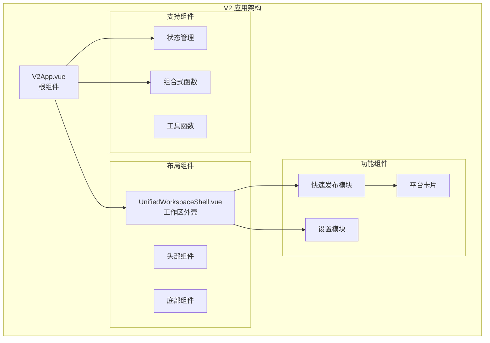
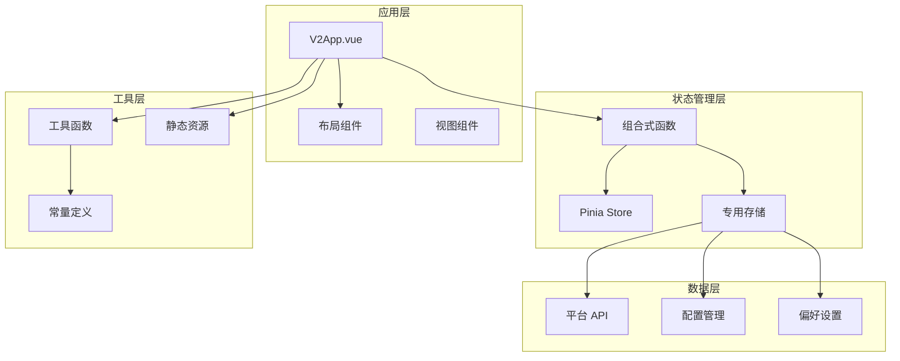
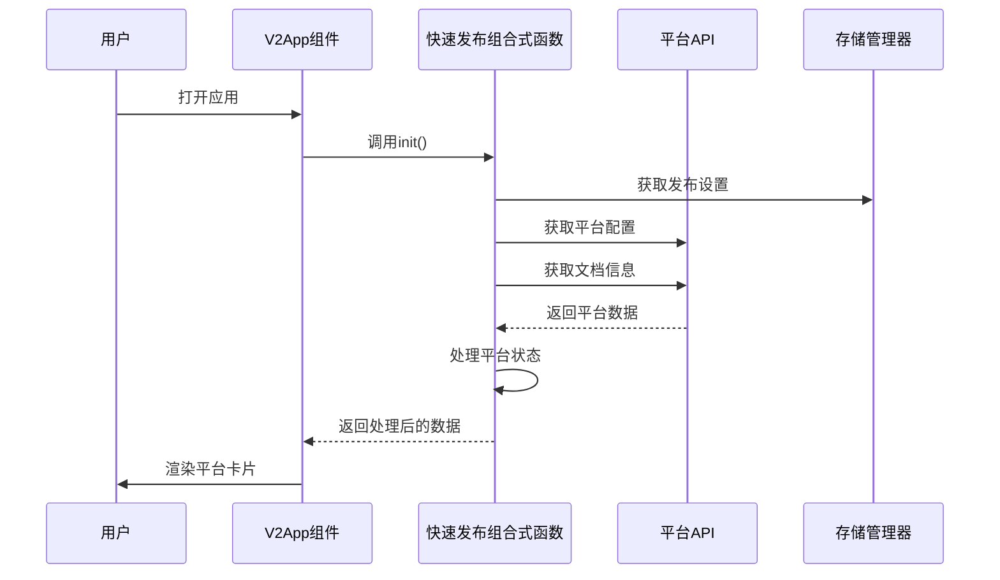
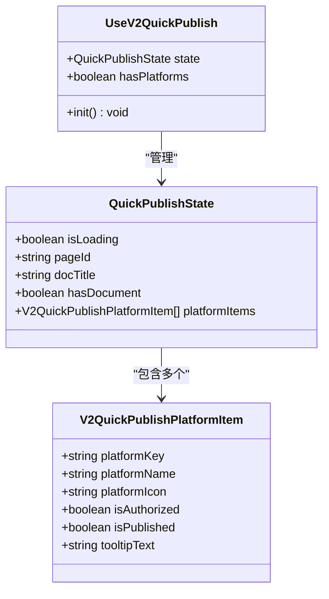
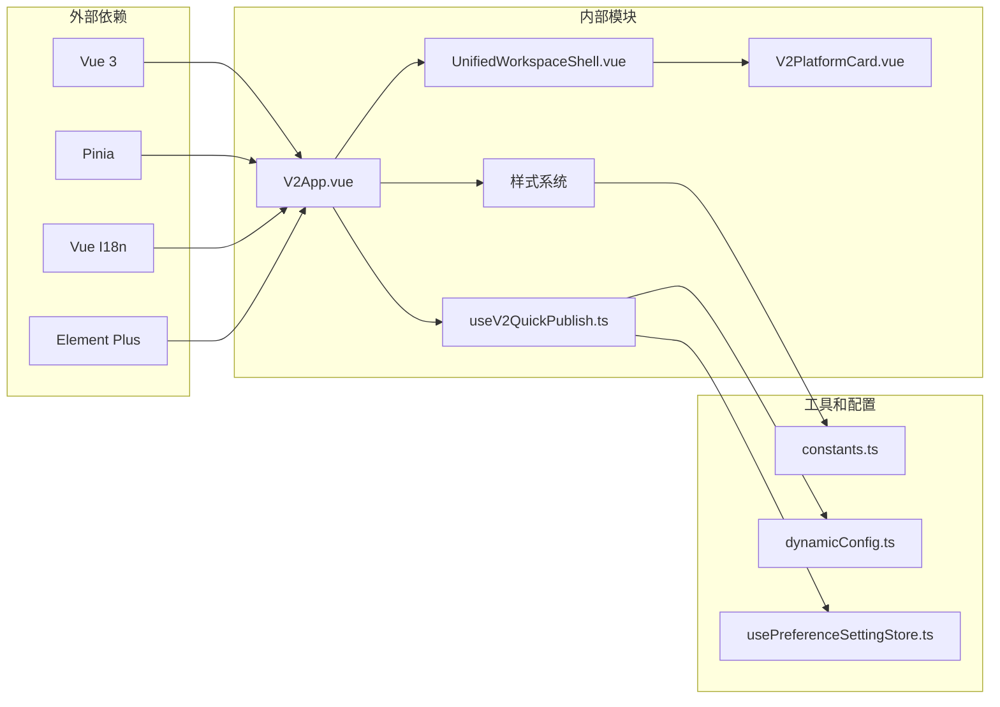

# V2 应用根组件

<cite>
**本文档引用的文件**
- [createV2App.ts](file://src/v2/createV2App.ts)
- [V2App.vue](file://src/components/v2/V2App.vue)
- [UnifiedWorkspaceShell.vue](file://src/components/v2/layout/UnifiedWorkspaceShell.vue)
- [useV2QuickPublish.ts](file://src/composables/v2/useV2QuickPublish.ts)
- [V2PlatformCard.vue](file://src/components/v2/publish/V2PlatformCard.vue)
- [base.styl](file://src/assets/v2/base.styl)
- [variables.styl](file://src/assets/v2/variables.styl)
- [constants.ts](file://src/utils/constants.ts)
- [dynamicConfig.ts](file://src/platforms/dynamicConfig.ts)
- [usePreferenceSettingStore.ts](file://src/stores/usePreferenceSettingStore.ts)
- [main.ts](file://src/main.ts)
- [bootstrap.ts](file://src/bootstrap.ts)
- [App.vue](file://src/App.vue)
</cite>

## 目录
1. [简介](#简介)
2. [项目结构](#项目结构)
3. [核心组件](#核心组件)
4. [架构概览](#架构概览)
5. [详细组件分析](#详细组件分析)
6. [依赖关系分析](#依赖关系分析)
7. [性能考虑](#性能考虑)
8. [故障排除指南](#故障排除指南)
9. [结论](#结论)

## 简介

V2 应用根组件是思源笔记发布工具插件中的新一代用户界面架构，专为快速发布和设置管理而设计。该组件采用现代化的 Vue 3 Composition API 构建，提供了响应式的用户界面和灵活的组件化架构。

该组件的主要目标是：
- 提供直观的快速发布界面
- 支持多平台内容发布
- 实现简洁的设置管理模式
- 确保与思源笔记生态系统的无缝集成

## 项目结构

V2 应用根组件位于插件的前端架构中，采用模块化的文件组织方式：



**图表来源**
- [V2App.vue:1-276](file://src/components/v2/V2App.vue#L1-L276)
- [UnifiedWorkspaceShell.vue:1-40](file://src/components/v2/layout/UnifiedWorkspaceShell.vue#L1-L40)

**章节来源**
- [V2App.vue:1-276](file://src/components/v2/V2App.vue#L1-L276)
- [createV2App.ts:1-37](file://src/v2/createV2App.ts#L1-L37)

## 核心组件

### V2 应用根组件

V2App.vue 是整个 V2 架构的根组件，负责协调各个子组件的工作流程。该组件实现了双视图模式：快速发布视图和设置视图。

#### 主要特性

1. **双视图切换机制**：通过 `currentView` 状态在快速发布和设置之间切换
2. **响应式布局**：根据视图类型动态调整布局结构
3. **国际化支持**：集成了 Vue I18n 进行多语言支持
4. **状态管理**：使用 Pinia 进行全局状态管理

#### 组件属性

| 属性名 | 类型 | 默认值 | 描述 |
|--------|------|--------|------|
| initialView | "quick_publish" \| "settings" | "quick_publish" | 初始显示的视图类型 |
| onClose | Function | undefined | 关闭组件时的回调函数 |

**章节来源**
- [V2App.vue:115-144](file://src/components/v2/V2App.vue#L115-L144)
- [createV2App.ts:8-13](file://src/v2/createV2App.ts#L8-L13)

### 统一工作区外壳

UnifiedWorkspaceShell.vue 提供了统一的工作区布局框架，支持两种不同的布局模式：

1. **快速发布模式**：单列布局，专注于内容展示
2. **设置模式**：左右分栏布局，左侧导航 + 右侧内容

**章节来源**
- [UnifiedWorkspaceShell.vue:1-40](file://src/components/v2/layout/UnifiedWorkspaceShell.vue#L1-L40)

## 架构概览

V2 应用根组件采用了现代化的前端架构模式，结合了多种设计原则：



**图表来源**
- [createV2App.ts:15-36](file://src/v2/createV2App.ts#L15-L36)
- [useV2QuickPublish.ts:19-80](file://src/composables/v2/useV2QuickPublish.ts#L19-L80)

## 详细组件分析

### 快速发布模块

快速发布模块是 V2 架构的核心功能，提供了直观的内容发布界面。

#### 数据流分析



**图表来源**
- [useV2QuickPublish.ts:34-71](file://src/composables/v2/useV2QuickPublish.ts#L34-L71)
- [V2App.vue:129-131](file://src/components/v2/V2App.vue#L129-L131)

#### 平台状态管理

平台状态通过 `V2QuickPublishPlatformItem` 接口进行管理：



**图表来源**
- [useV2QuickPublish.ts:10-30](file://src/composables/v2/useV2QuickPublish.ts#L10-L30)
- [useV2QuickPublish.ts:75-80](file://src/composables/v2/useV2QuickPublish.ts#L75-L80)

**章节来源**
- [useV2QuickPublish.ts:10-81](file://src/composables/v2/useV2QuickPublish.ts#L10-L81)

### 设置模块

设置模块采用左侧导航 + 右侧内容的布局模式，提供了完整的配置管理界面。

#### 导航结构

| 导航项 | 键值 | 描述 |
|--------|------|------|
| 账号设置 | account | 用户账户相关配置 |
| 图床设置 | image-hosting | 图片托管服务配置 |
| 偏好设置 | preference | 应用行为偏好设置 |

**章节来源**
- [UnifiedWorkspaceShell.vue:32-38](file://src/components/v2/layout/UnifiedWorkspaceShell.vue#L32-L38)

### 平台卡片组件

V2PlatformCard.vue 提供了统一的平台展示界面，支持多种状态显示：

```mermaid
flowchart TD
Start([渲染平台卡片]) --> CheckAuth{检查授权状态}
CheckAuth --> |已授权| ShowReady[显示"可快速发布"状态]
CheckAuth --> |未授权| ShowDisabled[显示"未授权"状态]
ShowReady --> CheckPublish{检查发布状态}
ShowDisabled --> ShowTooltip[显示工具提示]
CheckPublish --> |已发布| ShowPublished[显示"已发布"]
CheckPublish --> |未发布| ShowUnpublished[显示"未发布"]
ShowPublished --> End([完成渲染])
ShowUnpublished --> End
ShowTooltip --> End
```

**图表来源**
- [V2PlatformCard.vue:1-103](file://src/components/v2/publish/V2PlatformCard.vue#L1-L103)

**章节来源**
- [V2PlatformCard.vue:1-103](file://src/components/v2/publish/V2PlatformCard.vue#L1-L103)

## 依赖关系分析

V2 应用根组件的依赖关系体现了清晰的关注点分离：



**图表来源**
- [createV2App.ts:1-37](file://src/v2/createV2App.ts#L1-L37)
- [V2App.vue:111-113](file://src/components/v2/V2App.vue#L111-L113)

**章节来源**
- [createV2App.ts:1-37](file://src/v2/createV2App.ts#L1-L37)
- [V2App.vue:105-113](file://src/components/v2/V2App.vue#L105-L113)

## 性能考虑

### 渲染优化

1. **条件渲染**：使用 `v-if` 和 `v-else` 实现按需渲染
2. **懒加载**：平台卡片组件支持延迟加载
3. **虚拟滚动**：对于大量平台的情况，可考虑实现虚拟滚动

### 状态管理优化

1. **响应式数据**：使用 `reactive` 和 `computed` 优化状态更新
2. **缓存策略**：对 API 请求结果实施缓存机制
3. **异步加载**：平台数据采用异步加载，避免阻塞主线程

### 样式优化

1. **命名空间隔离**：所有样式都在 `.syp-v2` 命名空间下
2. **CSS 变量**：使用 Stylus 变量系统统一管理样式参数
3. **媒体查询**：针对不同屏幕尺寸优化布局

## 故障排除指南

### 常见问题及解决方案

#### 1. 平台列表为空

**症状**：快速发布界面显示"暂无已启用的平台"

**可能原因**：
- 发布设置中没有启用任何平台
- 动态配置加载失败
- 网络连接问题

**解决步骤**：
1. 检查设置界面的平台配置
2. 验证动态配置的 JSON 格式
3. 确认网络连接正常

#### 2. 文档上下文缺失

**症状**：界面显示"请先打开一个文档"

**可能原因**：
- 当前没有打开的思源笔记文档
- 页面 ID 获取失败
- 权限问题

**解决步骤**：
1. 在思源笔记中打开一个文档
2. 检查插件权限设置
3. 重新加载页面

#### 3. 授权状态异常

**症状**：平台显示为"未授权"状态

**可能原因**：
- 平台认证信息过期
- API 密钥配置错误
- 网络请求失败

**解决步骤**：
1. 进入设置界面重新配置平台
2. 检查 API 密钥的有效性
3. 验证网络连接

**章节来源**
- [V2App.vue:64-72](file://src/components/v2/V2App.vue#L64-L72)
- [useV2QuickPublish.ts:34-71](file://src/composables/v2/useV2QuickPublish.ts#L34-L71)

## 结论

V2 应用根组件代表了现代前端架构的最佳实践，通过以下关键特性实现了优秀的用户体验：

### 设计优势

1. **模块化架构**：清晰的组件分离和职责划分
2. **响应式设计**：适应不同设备和屏幕尺寸
3. **状态管理**：合理的数据流和状态管理策略
4. **扩展性**：易于添加新平台和功能

### 技术亮点

1. **Composition API**：充分利用 Vue 3 的现代化特性
2. **TypeScript 集成**：提供完整的类型安全保证
3. **样式系统**：基于 Stylus 的模块化样式管理
4. **国际化支持**：完整的多语言解决方案

### 未来发展方向

1. **性能优化**：实现更高效的渲染和状态更新
2. **功能扩展**：支持更多内容发布平台
3. **用户体验**：进一步优化交互和视觉效果
4. **集成能力**：增强与其他思源笔记功能的协作

该组件为思源笔记发布工具奠定了坚实的技术基础，为用户提供了一个强大而易用的内容发布解决方案。