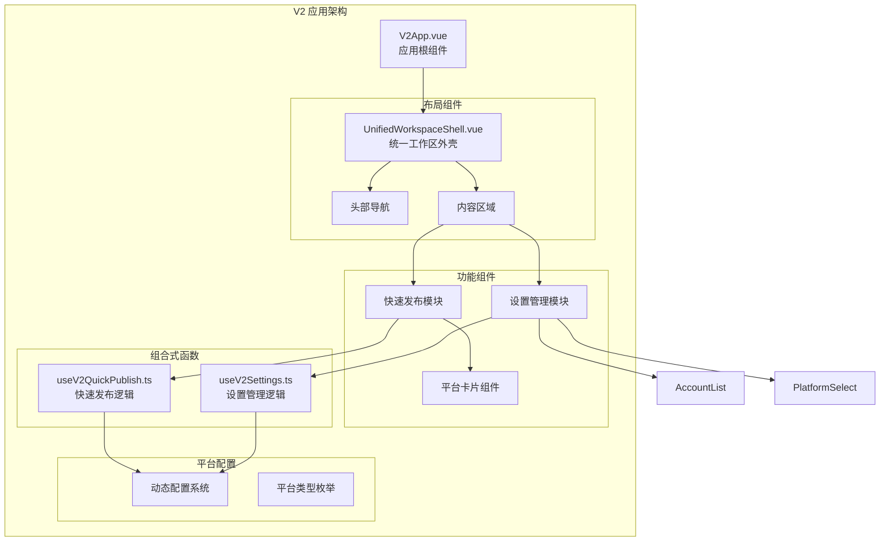
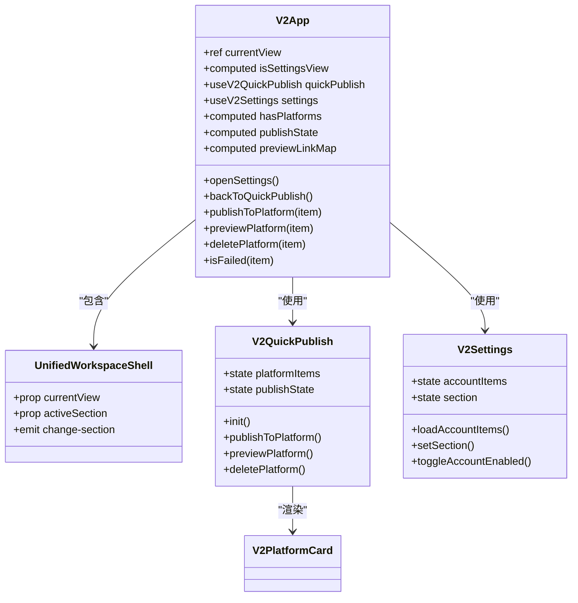
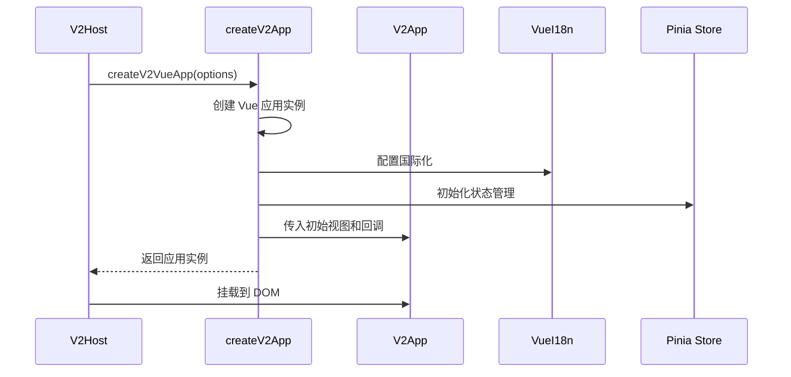
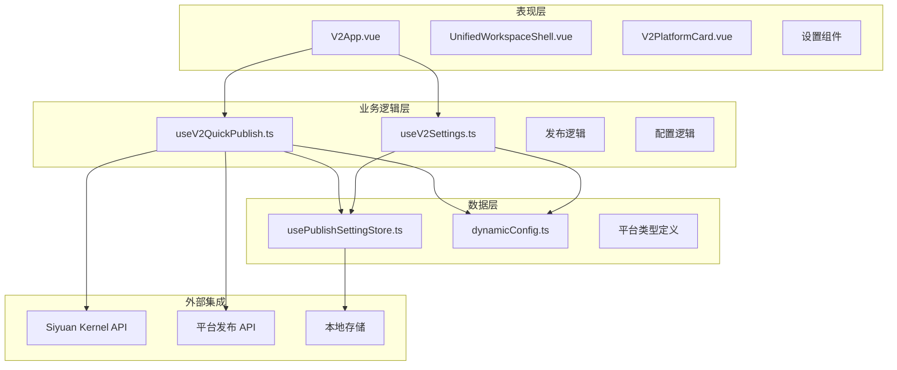
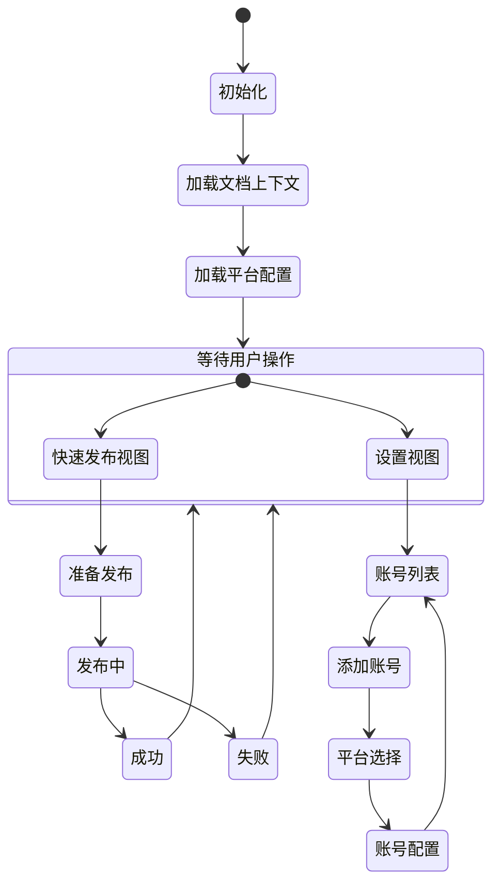
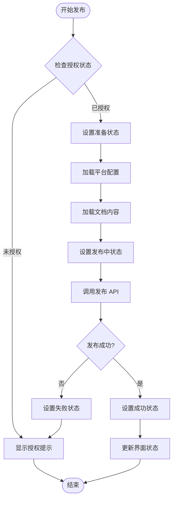
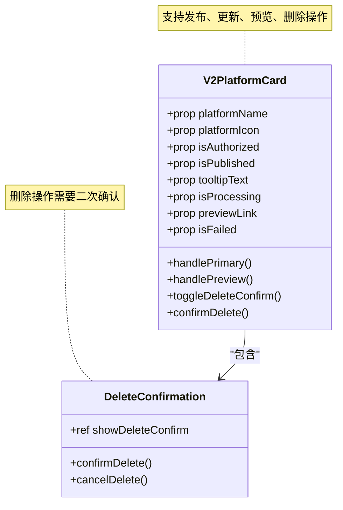
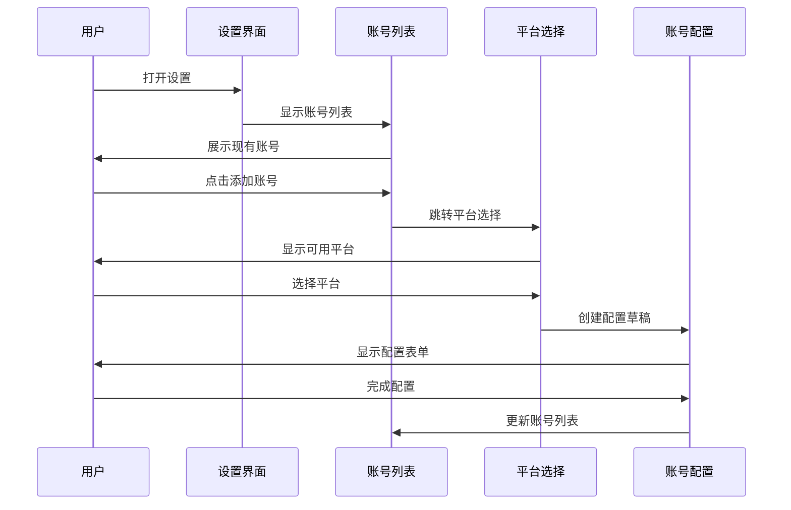
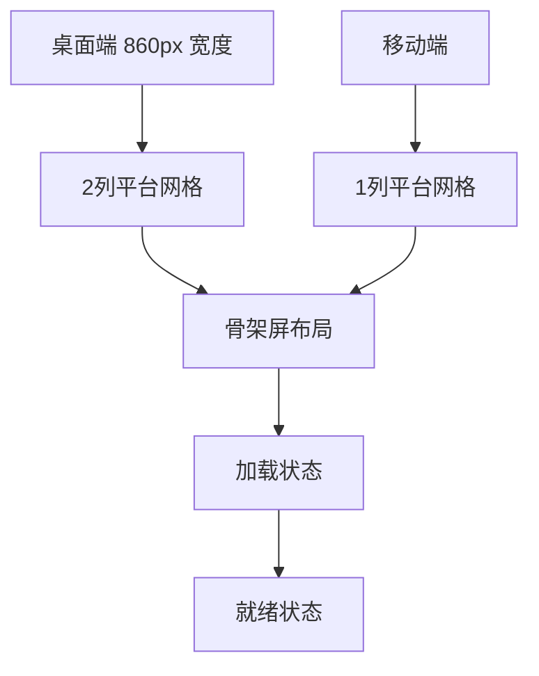
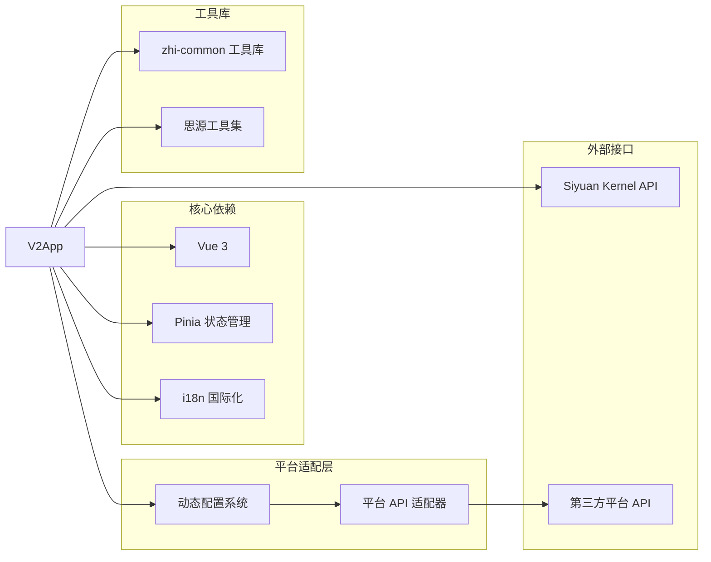

# V2 应用根组件

<cite>
**本文档引用的文件**
- [createV2App.ts](file://src/v2/createV2App.ts)
- [V2App.vue](file://src/components/v2/V2App.vue)
- [UnifiedWorkspaceShell.vue](file://src/components/v2/layout/UnifiedWorkspaceShell.vue)
- [V2PlatformCard.vue](file://src/components/v2/publish/V2PlatformCard.vue)
- [useV2QuickPublish.ts](file://src/composables/v2/useV2QuickPublish.ts)
- [useV2Settings.ts](file://src/composables/v2/useV2Settings.ts)
- [V2AccountList.vue](file://src/components/v2/settings/V2AccountList.vue)
- [V2PlatformSelect.vue](file://src/components/v2/settings/V2PlatformSelect.vue)
- [v2Host.ts](file://siyuan/v2/v2Host.ts)
- [base.styl](file://src/assets/v2/base.styl)
- [dynamicConfig.ts](file://src/platforms/dynamicConfig.ts)
- [usePublishSettingStore.ts](file://src/stores/usePublishSettingStore.ts)
</cite>

## 目录
1. [简介](#简介)
2. [项目结构](#项目结构)
3. [核心组件](#核心组件)
4. [架构概览](#架构概览)
5. [详细组件分析](#详细组件分析)
6. [依赖关系分析](#依赖关系分析)
7. [性能考虑](#性能考虑)
8. [故障排除指南](#故障排除指南)
9. [结论](#结论)

## 简介

V2 应用根组件是 Siyuan 发布器插件中的新一代用户界面系统，专为思源笔记设计的多平台内容发布解决方案。该组件采用现代化的 Vue 3 Composition API 架构，提供了直观的快速发布界面和灵活的设置管理系统。

V2 系统的核心目标是：
- 提供统一的多平台发布体验
- 支持多种内容发布平台（WordPress、博客园、语雀等）
- 实现响应式设计以适配不同设备
- 提供完整的发布生命周期管理

## 项目结构

V2 应用根组件位于插件的 `src/v2` 目录下，采用模块化的组件架构设计：

**图表来源**
- [V2App.vue:1-152](file://src/components/v2/V2App.vue#L1-L152)
- [UnifiedWorkspaceShell.vue:1-46](file://src/components/v2/layout/UnifiedWorkspaceShell.vue#L1-L46)

**章节来源**
- [createV2App.ts:1-37](file://src/v2/createV2App.ts#L1-L37)
- [v2Host.ts:1-107](file://siyuan/v2/v2Host.ts#L1-L107)

## 核心组件

### V2 应用根组件

V2App.vue 是整个应用的根组件，负责协调各个子组件的工作流程：

**图表来源**
- [V2App.vue:154-301](file://src/components/v2/V2App.vue#L154-L301)
- [UnifiedWorkspaceShell.vue:23-45](file://src/components/v2/layout/UnifiedWorkspaceShell.vue#L23-L45)

### 创建 V2 应用实例

createV2App.ts 提供了创建 V2 应用实例的标准方法：

**图表来源**
- [createV2App.ts:15-36](file://src/v2/createV2App.ts#L15-L36)
- [v2Host.ts:46-69](file://siyuan/v2/v2Host.ts#L46-L69)

**章节来源**
- [V2App.vue:154-301](file://src/components/v2/V2App.vue#L154-L301)
- [createV2App.ts:8-36](file://src/v2/createV2App.ts#L8-L36)

## 架构概览

V2 应用采用了清晰的分层架构设计，实现了关注点分离：

**图表来源**
- [useV2QuickPublish.ts:25-310](file://src/composables/v2/useV2QuickPublish.ts#L25-L310)
- [useV2Settings.ts:40-205](file://src/composables/v2/useV2Settings.ts#L40-L205)

### 状态管理架构

V2 应用的状态管理采用 Pinia 进行集中管理：

**图表来源**
- [useV2QuickPublish.ts:99-140](file://src/composables/v2/useV2QuickPublish.ts#L99-L140)
- [useV2Settings.ts:75-96](file://src/composables/v2/useV2Settings.ts#L75-L96)

**章节来源**
- [useV2QuickPublish.ts:25-310](file://src/composables/v2/useV2QuickPublish.ts#L25-L310)
- [useV2Settings.ts:40-205](file://src/composables/v2/useV2Settings.ts#L40-L205)

## 详细组件分析

### 快速发布模块

快速发布模块是 V2 应用的核心功能，提供了直观的内容发布体验：

#### 发布状态管理

**图表来源**
- [useV2QuickPublish.ts:145-198](file://src/composables/v2/useV2QuickPublish.ts#L145-L198)

#### 平台卡片组件

V2PlatformCard.vue 提供了统一的平台交互界面：

**图表来源**
- [V2PlatformCard.vue:68-116](file://src/components/v2/publish/V2PlatformCard.vue#L68-L116)

**章节来源**
- [useV2QuickPublish.ts:145-298](file://src/composables/v2/useV2QuickPublish.ts#L145-L298)
- [V2PlatformCard.vue:1-278](file://src/components/v2/publish/V2PlatformCard.vue#L1-L278)

### 设置管理模块

设置管理模块提供了灵活的平台配置和账户管理功能：

#### 账号管理流程

**图表来源**
- [useV2Settings.ts:107-179](file://src/composables/v2/useV2Settings.ts#L107-L179)

#### 设置导航系统

UnifiedWorkspaceShell.vue 提供了统一的设置导航：

| 导航项 | 功能描述 | 当前状态 |
|--------|----------|----------|
| 账号设置 | 管理已配置的发布平台账号 | ✅ 已实现 |
| 图床设置 | 配置图片托管服务 | ⏳ 开发中 |
| 偏好设置 | 个性化发布行为配置 | ⏳ 开发中 |

**章节来源**
- [useV2Settings.ts:75-190](file://src/composables/v2/useV2Settings.ts#L75-L190)
- [UnifiedWorkspaceShell.vue:38-45](file://src/components/v2/layout/UnifiedWorkspaceShell.vue#L38-L45)

### 样式系统

V2 应用采用了完整的样式系统，确保与思源笔记的完美集成：

#### 响应式设计

**图表来源**
- [base.styl:477-488](file://src/assets/v2/base.styl#L477-L488)

**章节来源**
- [base.styl:118-245](file://src/assets/v2/base.styl#L118-L245)

## 依赖关系分析

V2 应用的依赖关系体现了清晰的模块化设计：

**图表来源**
- [createV2App.ts:1-4](file://src/v2/createV2App.ts#L1-L4)
- [dynamicConfig.ts:10-12](file://src/platforms/dynamicConfig.ts#L10-L12)

### 平台类型系统

V2 应用支持多种平台类型，每种类型都有特定的功能特性：

| 平台类型 | 子类型示例 | 特性 |
|----------|------------|------|
| Common | 语雀、Notion、Halo | 通用 API 接口 |
| Metaweblog | 博客园、Typecho | 标准 XML-RPC 接口 |
| WordPress | WordPress | 原生 REST API |
| GitHub | Hugo、Hexo、Jekyll | 静态站点生成器 |
| GitLab | GitLab 平台变体 | CI/CD 集成 |
| Custom | 自定义平台 | 高度可定制 |

**章节来源**
- [dynamicConfig.ts:126-200](file://src/platforms/dynamicConfig.ts#L126-L200)

## 性能考虑

V2 应用在设计时充分考虑了性能优化：

### 渲染优化策略

1. **懒加载机制**：平台列表和设置页面采用按需加载
2. **虚拟滚动**：大量平台时使用虚拟滚动提升性能
3. **状态缓存**：频繁访问的数据进行内存缓存
4. **异步渲染**：长耗时操作使用异步处理避免阻塞

### 内存管理

- 组件卸载时自动清理事件监听器
- 定时器在组件销毁时自动清除
- 大对象引用及时释放

### 网络优化

- 请求超时和重试机制
- 缓存策略减少重复请求
- 错误处理和降级方案

## 故障排除指南

### 常见问题及解决方案

#### 发布失败问题

**症状**：发布过程中出现错误提示

**可能原因**：
1. 平台授权失效
2. 网络连接异常
3. 平台 API 限流
4. 文档内容格式不兼容

**解决步骤**：
1. 检查平台授权状态
2. 验证网络连接
3. 查看错误日志
4. 重试发布操作

#### 平台不可用问题

**症状**：平台卡片显示为灰色且无法点击

**解决方法**：
1. 点击平台卡片查看具体错误信息
2. 检查平台配置是否正确
3. 确认平台 API 可用性
4. 重新授权平台账号

#### 设置页面加载缓慢

**症状**：设置页面打开速度慢

**优化建议**：
1. 清理浏览器缓存
2. 检查插件版本更新
3. 减少同时启用的平台数量
4. 重启思源笔记应用

**章节来源**
- [useV2QuickPublish.ts:55-60](file://src/composables/v2/useV2QuickPublish.ts#L55-L60)
- [useV2Settings.ts:181-190](file://src/composables/v2/useV2Settings.ts#L181-L190)

## 结论

V2 应用根组件代表了 Siyuan 发布器插件的现代化发展方向，通过采用 Vue 3 Composition API 和模块化架构设计，实现了：

1. **用户体验优化**：直观的界面设计和流畅的操作体验
2. **功能完整性**：支持多种发布平台和灵活的配置选项
3. **技术先进性**：采用最新的前端技术和最佳实践
4. **可扩展性**：清晰的架构设计便于功能扩展和维护

V2 系统不仅满足了当前的发布需求，还为未来的功能扩展奠定了坚实的技术基础。通过持续的迭代优化，V2 应用将成为思源笔记生态中最优秀的第三方发布工具之一。