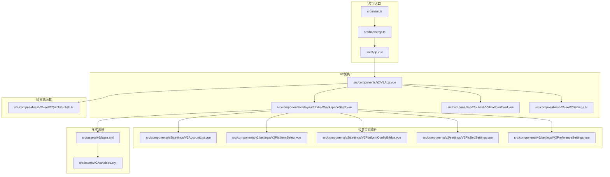
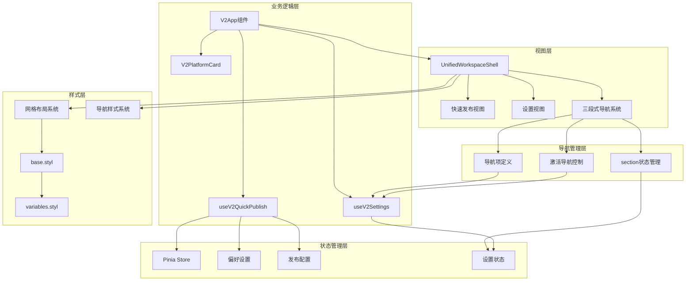
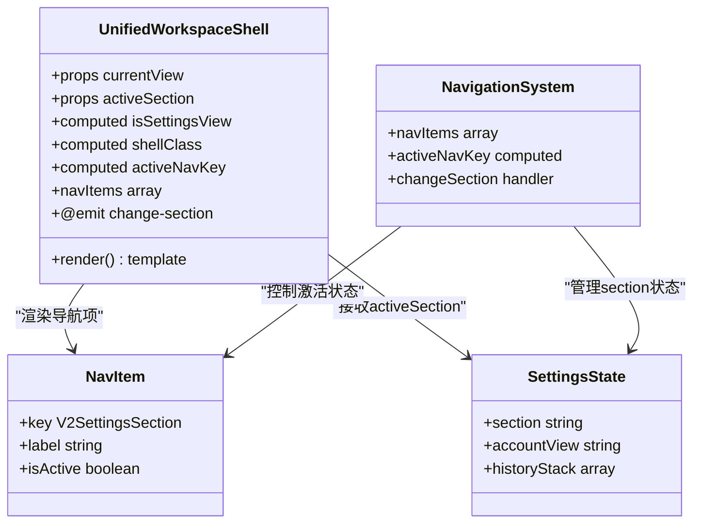
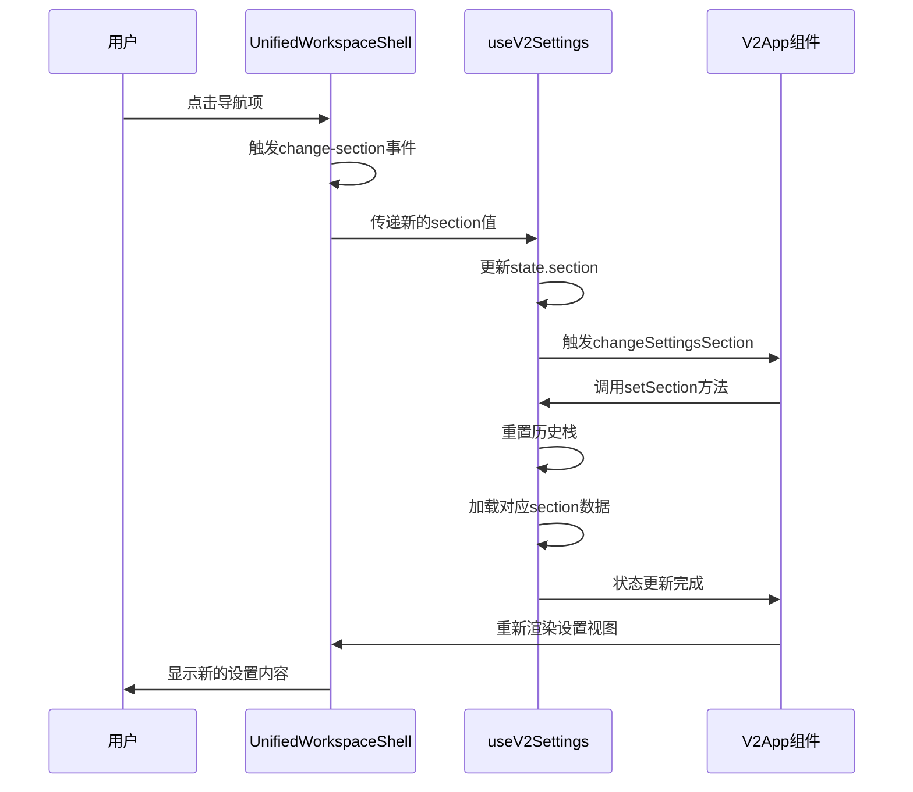
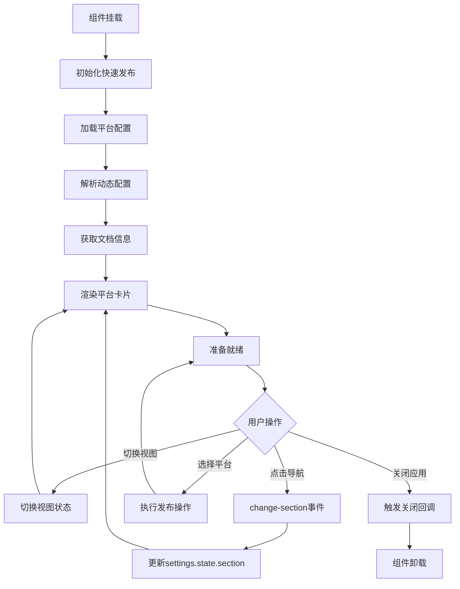
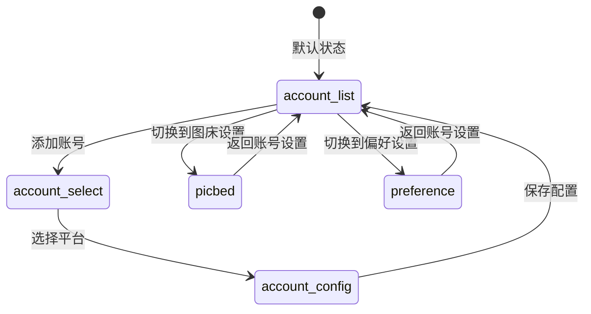
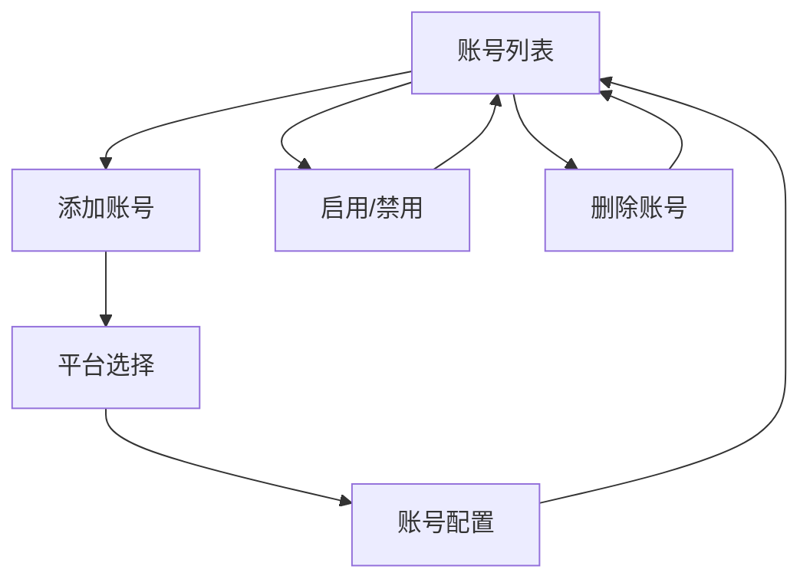
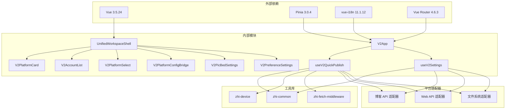

# 统一工作壳组件

<cite>
**本文档引用的文件**
- [UnifiedWorkspaceShell.vue](file://src/components/v2/layout/UnifiedWorkspaceShell.vue)
- [V2App.vue](file://src/components/v2/V2App.vue)
- [useV2Settings.ts](file://src/composables/v2/useV2Settings.ts)
- [V2AccountList.vue](file://src/components/v2/settings/V2AccountList.vue)
- [V2PlatformSelect.vue](file://src/components/v2/settings/V2PlatformSelect.vue)
- [V2PlatformConfigBridge.vue](file://src/components/v2/settings/V2PlatformConfigBridge.vue)
- [V2PicBedSettings.vue](file://src/components/v2/settings/V2PicBedSettings.vue)
- [V2PreferenceSettings.vue](file://src/components/v2/settings/V2PreferenceSettings.vue)
- [V2PlatformCard.vue](file://src/components/v2/publish/V2PlatformCard.vue)
- [useV2QuickPublish.ts](file://src/composables/v2/useV2QuickPublish.ts)
- [base.styl](file://src/assets/v2/base.styl)
- [variables.styl](file://src/assets/v2/variables.styl)
- [App.vue](file://src/App.vue)
- [main.ts](file://src/main.ts)
- [bootstrap.ts](file://src/bootstrap.ts)
- [AppLayout.vue](file://src/layouts/AppLayout.vue)
- [AppLayoutDefault.vue](file://src/layouts/default/AppLayoutDefault.vue)
- [dynamicConfig.ts](file://src/platforms/dynamicConfig.ts)
- [routeConfig.ts](file://src/routes/routeConfig.ts)
- [package.json](file://package.json)
</cite>

## 更新摘要
**变更内容**
- 简化了导航系统架构，移除了超过 70 行的 Stylus 样式代码
- 采用更简洁的导航结构和类型定义
- 统一了工作壳组件的样式系统，使用基础样式变量和网格布局
- 优化了响应式设计，支持移动端和桌面端的自适应显示

## 目录
1. [简介](#简介)
2. [项目结构](#项目结构)
3. [核心组件](#核心组件)
4. [架构概览](#架构概览)
5. [详细组件分析](#详细组件分析)
6. [依赖关系分析](#依赖关系分析)
7. [性能考虑](#性能考虑)
8. [故障排除指南](#故障排除指南)
9. [结论](#结论)

## 简介

统一工作壳组件是思源笔记发布插件中的核心UI架构组件，负责提供统一的工作界面外壳和视图切换功能。该组件实现了快速发布和设置两种主要视图模式，通过网格布局系统和响应式设计为用户提供一致的交互体验。

**更新** 新版本显著简化了导航系统架构，移除了超过 70 行的 Stylus 样式代码，采用更简洁的导航结构和类型定义。组件现在使用基础样式变量系统，通过 CSS Grid 实现响应式布局，支持 1 列和 2 列布局模式，能够根据屏幕尺寸自动调整导航栏的显示和隐藏。

该组件的设计目标是在保持功能完整性的同时，提供简洁直观的用户界面，支持多种发布平台的快速访问和配置管理，并通过简化的导航系统提升设置页面的可用性和维护性。

## 项目结构

项目采用模块化的 Vue 3 单页应用架构，统一工作壳组件位于 v2 版本的组件体系中：



**图表来源**
- [main.ts:1-22](file://src/main.ts#L1-L22)
- [bootstrap.ts:1-53](file://src/bootstrap.ts#L1-L53)
- [V2App.vue:1-492](file://src/components/v2/V2App.vue#L1-L492)

**章节来源**
- [main.ts:1-22](file://src/main.ts#L1-L22)
- [bootstrap.ts:1-53](file://src/bootstrap.ts#L1-L53)
- [App.vue:1-25](file://src/App.vue#L1-L25)

## 核心组件

统一工作壳组件由五个主要部分组成：

### 1. 工作壳容器 (UnifiedWorkspaceShell)
- **职责**: 提供基础的网格布局框架和简化的导航系统
- **特性**: 支持快速发布和设置两种视图模式，内置三段式导航
- **布局**: CSS Grid 布局，支持 1 列和 2 列布局
- **新增功能**: 简化的导航激活状态管理和类型安全的导航项定义
- **导航系统**: 包含"账号设置"、"图床设置"、"偏好设置"三个导航项

### 2. 应用容器 (V2App)
- **职责**: 整合工作壳和业务逻辑，管理视图状态和设置导航
- **特性**: 集成平台卡片组件、快速发布功能和设置页面导航
- **状态管理**: 通过组合式函数管理发布状态和设置 section 状态
- **导航控制**: 通过 change-section 事件处理导航切换

### 3. 设置状态管理 (useV2Settings)
- **职责**: 管理设置页面的 section 状态和视图切换
- **特性**: 支持 account、picbed、preference 三个 section 的切换
- **导航控制**: 提供 setSection 方法和历史栈管理
- **视图管理**: 支持 list、select、config 三种视图模式

### 4. 平台卡片 (V2PlatformCard)
- **职责**: 展示单个发布平台的状态信息
- **特性**: 支持授权状态和发布状态的可视化展示

### 5. 设置页面组件集合
- **V2AccountList**: 账号列表管理组件
- **V2PlatformSelect**: 平台选择组件
- **V2PlatformConfigBridge**: 平台配置桥接组件
- **V2PicBedSettings**: 图床设置组件
- **V2PreferenceSettings**: 偏好设置组件

**章节来源**
- [UnifiedWorkspaceShell.vue:1-50](file://src/components/v2/layout/UnifiedWorkspaceShell.vue#L1-L50)
- [V2App.vue:1-492](file://src/components/v2/V2App.vue#L1-L492)
- [useV2Settings.ts:1-236](file://src/composables/v2/useV2Settings.ts#L1-L236)
- [V2PlatformCard.vue:1-280](file://src/components/v2/publish/V2PlatformCard.vue#L1-L280)

## 架构概览

统一工作壳组件采用了清晰的分层架构设计，新增了简化的导航系统：



**图表来源**
- [V2App.vue:49-134](file://src/components/v2/V2App.vue#L49-L134)
- [useV2Settings.ts:126-134](file://src/composables/v2/useV2Settings.ts#L126-L134)
- [base.styl:192-246](file://src/assets/v2/base.styl#L192-L246)

## 详细组件分析

### 统一工作壳组件 (UnifiedWorkspaceShell)

该组件是整个 V2 架构的基础框架，提供了灵活的布局系统和简化的导航功能：

#### 核心功能特性

| 功能特性 | 实现方式 | 视图表现 |
|---------|----------|----------|
| 视图切换 | `currentView` 属性控制 | 快速发布/设置两种模式 |
| 导航系统 | 条件渲染设置导航 | 账号设置、图床设置、偏好设置 |
| 动态 section 切换 | `activeSection` 属性管理 | 精确的导航激活状态控制 |
| 响应式布局 | CSS Grid 动态列数 | 移动端 1 列，桌面端 2 列 |
| 类型安全 | TypeScript 类型定义 | 安全的导航项和状态管理 |

#### 简化后的导航系统架构



**图表来源**
- [UnifiedWorkspaceShell.vue:27-48](file://src/components/v2/layout/UnifiedWorkspaceShell.vue#L27-L48)

#### 动态 section 切换流程



**图表来源**
- [UnifiedWorkspaceShell.vue:35-37](file://src/components/v2/layout/UnifiedWorkspaceShell.vue#L35-L37)
- [V2App.vue:279-281](file://src/components/v2/V2App.vue#L279-L281)
- [useV2Settings.ts:126-134](file://src/composables/v2/useV2Settings.ts#L126-L134)

#### 响应式布局系统

```mermaid
flowchart TD
Desktop[桌面端 > 960px] --> DesktopLayout[2列布局]
Mobile[移动端 ≤ 960px] --> MobileLayout[1列布局]
DesktopLayout --> NavVisible[导航栏可见]
MobileLayout --> NavHidden[导航栏隐藏]
NavVisible --> GridTemplate2Col[grid-template-columns: 196px minmax(0, 1fr)]
NavHidden --> GridTemplate1Col[grid-template-columns: 1fr]
GridTemplate2Col --> Responsive[响应式导航]
GridTemplate1Col --> Responsive
Responsive --> AutoLayout[自动布局]
```

**图表来源**
- [base.styl:201-202](file://src/assets/v2/base.styl#L201-L202)
- [base.styl:408-414](file://src/assets/v2/base.styl#L408-L414)

**章节来源**
- [UnifiedWorkspaceShell.vue:1-50](file://src/components/v2/layout/UnifiedWorkspaceShell.vue#L1-L50)

### V2 应用容器 (V2App)

V2App 组件作为统一工作壳的应用层封装，集成了完整的业务逻辑和简化的导航功能：

#### 状态管理架构

| 状态类型 | 数据源 | 更新机制 | 用途 |
|---------|--------|----------|------|
| 视图状态 | `currentView` | 用户交互 | 控制视图切换 |
| 设置 section | `settings.state.section` | change-section 事件 | 管理导航激活状态 |
| 发布状态 | `quickPublish.state` | 异步初始化 | 管理平台列表 |
| 平台数据 | `platformItems` | 配置解析 | 展示可用平台 |
| 文档信息 | `docTitle/pageId` | 思源 API 调用 | 获取当前文档 |

#### 简化后的导航处理机制



**图表来源**
- [V2App.vue:264-267](file://src/components/v2/V2App.vue#L264-L267)
- [useV2Settings.ts:126-134](file://src/composables/v2/useV2Settings.ts#L126-L134)

**章节来源**
- [V2App.vue:1-492](file://src/components/v2/V2App.vue#L1-L492)
- [useV2Settings.ts:1-236](file://src/composables/v2/useV2Settings.ts#L1-L236)

### 设置状态管理 (useV2Settings)

简化的设置状态管理模块提供了完整的 section 切换和导航控制功能：

#### Section 状态管理

| Section 类型 | 视图状态 | 功能特性 | 数据加载 |
|------------|----------|----------|----------|
| account | list/select/config | 账号列表、平台选择、配置编辑 | 账号数据加载 |
| picbed | 单一视图 | 图床设置占位 | 预留接口 |
| preference | 单一视图 | 偏好设置占位 | 预留接口 |

#### 导航控制机制



**图表来源**
- [useV2Settings.ts:17-18](file://src/composables/v2/useV2Settings.ts#L17-L18)
- [useV2Settings.ts:126-134](file://src/composables/v2/useV2Settings.ts#L126-L134)

#### 账号管理流程



**图表来源**
- [useV2Settings.ts:136-140](file://src/composables/v2/useV2Settings.ts#L136-L140)
- [useV2Settings.ts:158-171](file://src/composables/v2/useV2Settings.ts#L158-L171)

**章节来源**
- [useV2Settings.ts:1-236](file://src/composables/v2/useV2Settings.ts#L1-L236)

### 样式系统架构

统一工作壳组件采用了简化的模块化样式架构，确保主题一致性和可维护性：

#### 简化后的样式层次结构

```mermaid
graph TB
subgraph "样式变量层"
Variables[variables.styl]
Colors[颜色系统]
Spacing[间距系统]
Typography[字体系统]
end
subgraph "基础样式层"
BaseStyle[base.styl]
Components[组件样式]
Layout[布局系统]
NavStyle[导航样式系统]
end
subgraph "组件样式层"
ShellStyle[syp-shell 样式]
CardStyle[syp-platform-card 样式]
HeaderStyle[syp-header 样式]
NavStyle[syp-shell__nav 样式]
NavItemStyle[syp-shell__nav-item 样式]
End
Variables --> BaseStyle
BaseStyle --> ShellStyle
BaseStyle --> CardStyle
BaseStyle --> HeaderStyle
BaseStyle --> NavStyle
BaseStyle --> NavItemStyle
Components --> ShellStyle
Components --> CardStyle
Components --> HeaderStyle
Components --> NavStyle
Components --> NavItemStyle
```

**图表来源**
- [base.styl:11-435](file://src/assets/v2/base.styl#L11-L435)
- [variables.styl:1-58](file://src/assets/v2/variables.styl#L1-L58)

#### 简化的响应式设计策略

| 断点 | 屏幕宽度 | 布局策略 | 组件调整 |
|------|----------|----------|----------|
| 移动端 | ≤960px | 单列布局 | 导航隐藏，内容全宽 |
| 平板端 | 961px-1200px | 自适应布局 | 导航半宽，内容自适应 |
| 桌面端 | ≥1200px | 标准布局 | 导航 200px，内容自适应 |

**章节来源**
- [base.styl:192-246](file://src/assets/v2/base.styl#L192-L246)
- [variables.styl:1-58](file://src/assets/v2/variables.styl#L1-L58)

## 依赖关系分析

统一工作壳组件的依赖关系体现了清晰的关注点分离和简化的导航系统：



**图表来源**
- [package.json:32-68](file://package.json#L32-L68)
- [createV2App.ts:1-37](file://src/v2/createV2App.ts#L1-L37)

### 关键依赖特性

| 依赖类型 | 版本 | 用途 | 重要性 |
|---------|------|------|--------|
| Vue | ^3.5.24 | 核心框架 | 核心 |
| Pinia | ^3.0.4 | 状态管理 | 核心 |
| vue-i18n | ^11.1.12 | 国际化支持 | 重要 |
| element-plus | ^2.11.8 | UI 组件库 | 重要 |
| zhi-common | ^1.35.0 | 通用工具库 | 核心 |
| zhi-siyuan-api | ^2.29.3 | 思源 API 集成 | 核心 |

**章节来源**
- [package.json:32-68](file://package.json#L32-L68)
- [createV2App.ts:1-37](file://src/v2/createV2App.ts#L1-L37)

## 性能考虑

统一工作壳组件在设计时充分考虑了性能优化，简化的导航系统也注重性能表现：

### 渲染性能优化

1. **条件渲染**: 使用 `v-if` 和 `v-show` 进行智能渲染
2. **计算属性缓存**: 利用 Vue 的响应式系统缓存计算结果
3. **懒加载**: 组件按需加载，减少初始包大小
4. **导航状态缓存**: activeSection 状态通过计算属性缓存

### 内存管理

1. **组件卸载**: 正确的生命周期管理
2. **事件清理**: 避免内存泄漏
3. **状态重置**: 组件销毁时重置状态
4. **导航历史栈管理**: 合理的栈操作避免内存泄漏

### 网络性能

1. **异步加载**: 平台配置异步获取
2. **缓存策略**: 合理使用浏览器缓存
3. **请求合并**: 减少不必要的 API 调用
4. **导航状态持久化**: 避免重复的数据加载

## 故障排除指南

### 常见问题及解决方案

| 问题类型 | 症状 | 可能原因 | 解决方案 |
|---------|------|----------|----------|
| 视图切换失败 | 界面不更新 | 状态管理错误 | 检查 `currentView` 属性绑定 |
| 导航不显示 | 设置视图异常 | 条件渲染问题 | 检查 `isSettingsView` 计算属性 |
| 导航激活状态错误 | 导航项不高亮 | activeSection 未正确传递 | 验证 change-section 事件处理 |
| section 切换失效 | 设置页面不更新 | 状态更新未触发 | 检查 setSection 方法调用 |
| 平台列表为空 | 显示空状态 | 配置加载失败 | 验证发布设置配置 |
| 响应式布局异常 | 导航栏显示问题 | CSS Grid 配置错误 | 检查 base.styl 中的 grid-template-columns |

### 调试技巧

1. **开发者工具**: 使用 Vue DevTools 检查组件状态
2. **日志输出**: 在关键节点添加调试信息
3. **网络监控**: 检查 API 请求和响应
4. **导航跟踪**: 监控 change-section 事件的触发和处理
5. **状态检查**: 验证 settings.state.section 的值变化
6. **媒体查询测试**: 在不同断点下测试响应式行为

**章节来源**
- [V2App.vue:279-281](file://src/components/v2/V2App.vue#L279-L281)
- [useV2Settings.ts:126-134](file://src/composables/v2/useV2Settings.ts#L126-L134)

## 结论

统一工作壳组件成功实现了以下目标：

1. **架构清晰**: 采用分层设计，职责明确
2. **用户体验**: 提供一致且直观的界面
3. **可扩展性**: 支持新的发布平台和功能
4. **性能优化**: 注重渲染效率和资源管理
5. **可维护性**: 模块化设计便于长期维护
6. **导航简化**: 新增简化的导航系统，提升设置页面的可用性
7. **响应式设计**: 支持移动端和桌面端的自适应显示
8. **代码精简**: 移除了超过 70 行的 Stylus 样式代码，提高了代码质量

**更新** 新版本通过简化的导航系统和样式架构，实现了更精细的设置页面组织和更直观的用户交互体验。动态 section 切换功能使得用户可以在不同的设置模块间快速切换，同时保持界面的一致性和流畅性。CSS Grid 布局系统提供了更好的响应式支持，能够在不同设备上提供最佳的用户体验。

该组件为思源笔记发布插件提供了坚实的技术基础，通过统一的工作壳设计和简化的导航系统，确保了不同功能模块之间的一致性和协调性。未来可以进一步优化导航动画效果和国际化支持，以提升用户体验。