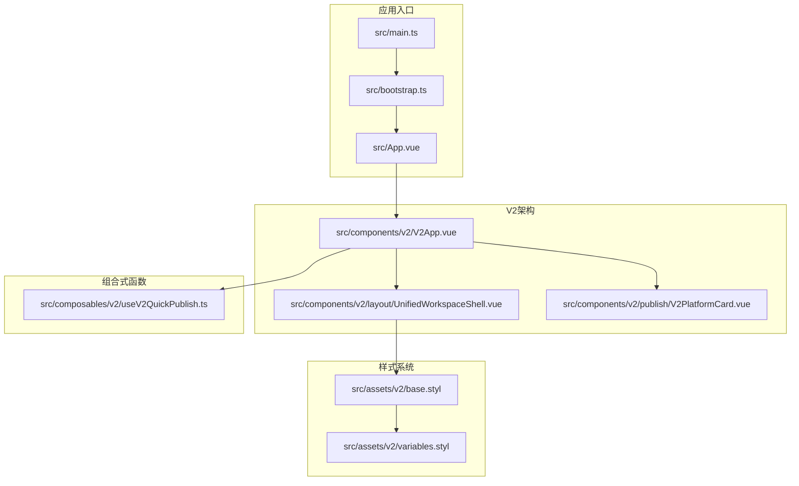
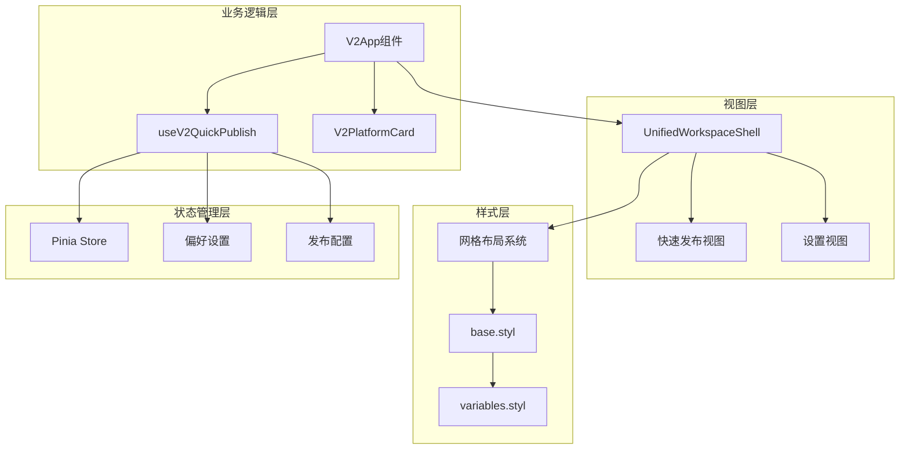
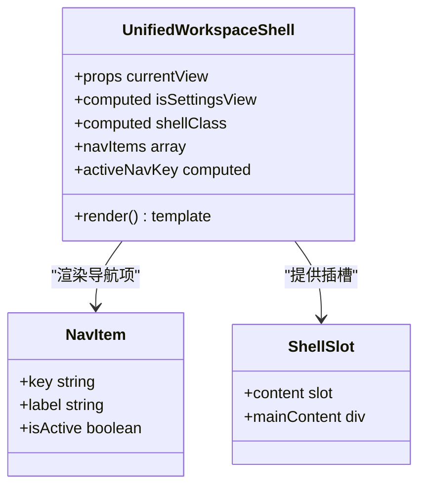
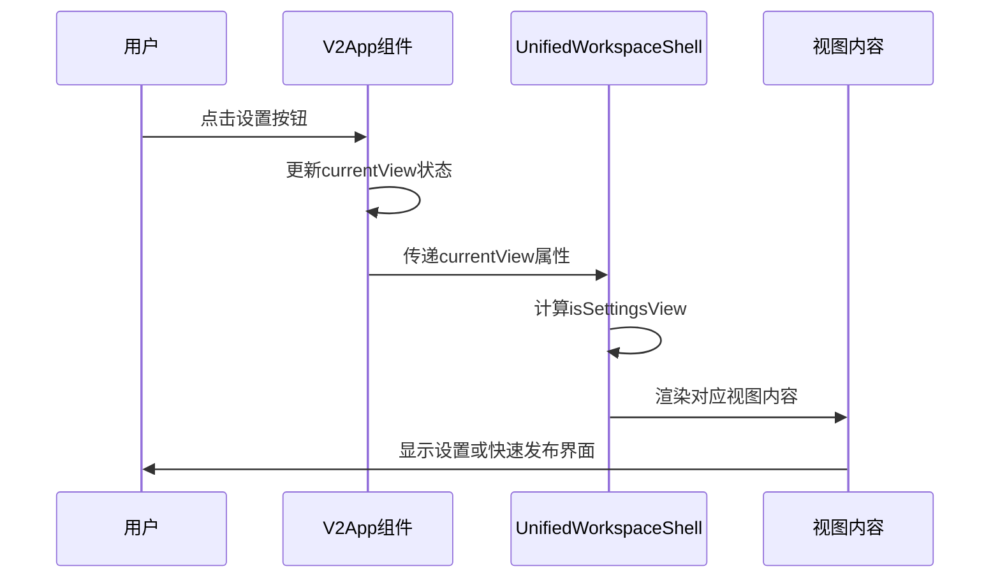
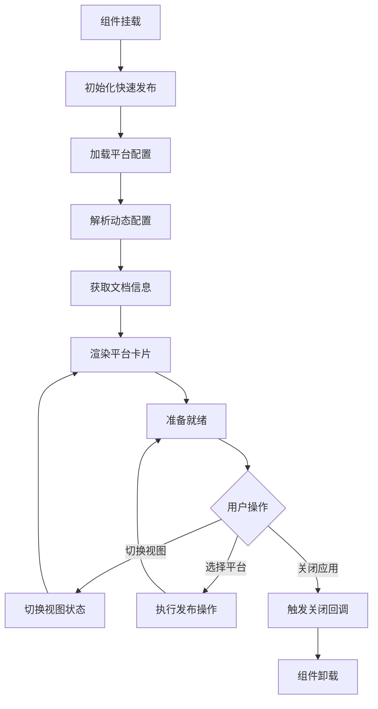
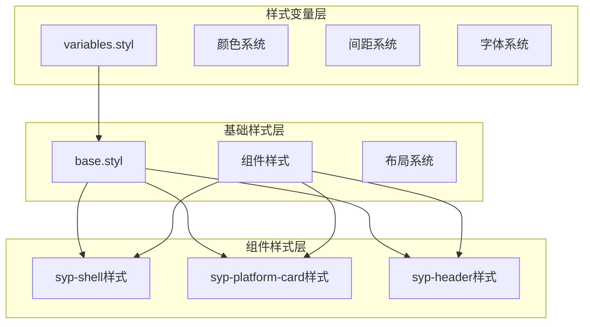
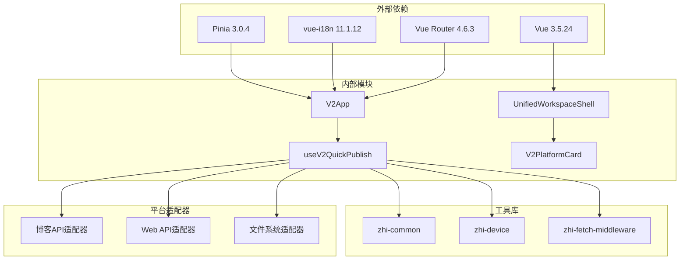

# 统一工作壳组件

<cite>
**本文档引用的文件**
- [UnifiedWorkspaceShell.vue](file://src/components/v2/layout/UnifiedWorkspaceShell.vue)
- [V2App.vue](file://src/components/v2/V2App.vue)
- [createV2App.ts](file://src/v2/createV2App.ts)
- [useV2QuickPublish.ts](file://src/composables/v2/useV2QuickPublish.ts)
- [base.styl](file://src/assets/v2/base.styl)
- [variables.styl](file://src/assets/v2/variables.styl)
- [App.vue](file://src/App.vue)
- [main.ts](file://src/main.ts)
- [bootstrap.ts](file://src/bootstrap.ts)
- [AppLayout.vue](file://src/layouts/AppLayout.vue)
- [AppLayoutDefault.vue](file://src/layouts/default/AppLayoutDefault.vue)
- [V2PlatformCard.vue](file://src/components/v2/publish/V2PlatformCard.vue)
- [package.json](file://package.json)
</cite>

## 目录
1. [简介](#简介)
2. [项目结构](#项目结构)
3. [核心组件](#核心组件)
4. [架构概览](#架构概览)
5. [详细组件分析](#详细组件分析)
6. [依赖关系分析](#依赖关系分析)
7. [性能考虑](#性能考虑)
8. [故障排除指南](#故障排除指南)
9. [结论](#结论)

## 简介

统一工作壳组件是思源笔记发布插件中的核心UI架构组件，负责提供统一的工作界面外壳和视图切换功能。该组件实现了快速发布和设置两种主要视图模式，通过网格布局系统和响应式设计为用户提供一致的交互体验。

该组件的设计目标是在保持功能完整性的同时，提供简洁直观的用户界面，支持多种发布平台的快速访问和配置管理。

## 项目结构

项目采用模块化的Vue 3单页应用架构，统一工作壳组件位于v2版本的组件体系中：

**图表来源**
- [main.ts:1-22](file://src/main.ts#L1-L22)
- [bootstrap.ts:1-53](file://src/bootstrap.ts#L1-L53)
- [V2App.vue:1-276](file://src/components/v2/V2App.vue#L1-L276)

**章节来源**
- [main.ts:1-22](file://src/main.ts#L1-L22)
- [bootstrap.ts:1-53](file://src/bootstrap.ts#L1-L53)
- [App.vue:1-25](file://src/App.vue#L1-L25)

## 核心组件

统一工作壳组件由三个主要部分组成：

### 1. 工作壳容器 (UnifiedWorkspaceShell)
- **职责**: 提供基础的网格布局框架和视图切换逻辑
- **特性**: 支持快速发布和设置两种视图模式
- **布局**: 响应式网格布局，支持1列和2列布局

### 2. 应用容器 (V2App)
- **职责**: 整合工作壳和业务逻辑，管理视图状态
- **特性**: 集成平台卡片组件和快速发布功能
- **状态管理**: 通过组合式函数管理发布状态

### 3. 平台卡片 (V2PlatformCard)
- **职责**: 展示单个发布平台的状态信息
- **特性**: 支持授权状态和发布状态的可视化展示

**章节来源**
- [UnifiedWorkspaceShell.vue:1-40](file://src/components/v2/layout/UnifiedWorkspaceShell.vue#L1-L40)
- [V2App.vue:1-276](file://src/components/v2/V2App.vue#L1-L276)
- [V2PlatformCard.vue:1-47](file://src/components/v2/publish/V2PlatformCard.vue#L1-L47)

## 架构概览

统一工作壳组件采用了清晰的分层架构设计：

**图表来源**
- [V2App.vue:44-99](file://src/components/v2/V2App.vue#L44-L99)
- [useV2QuickPublish.ts:19-81](file://src/composables/v2/useV2QuickPublish.ts#L19-L81)
- [base.styl:186-196](file://src/assets/v2/base.styl#L186-L196)

## 详细组件分析

### 统一工作壳组件 (UnifiedWorkspaceShell)

该组件是整个V2架构的基础框架，提供了灵活的布局系统：

#### 核心功能特性

| 功能特性 | 实现方式 | 视图表现 |
|---------|----------|----------|
| 视图切换 | `currentView`属性控制 | 快速发布/设置两种模式 |
| 导航系统 | 条件渲染设置导航 | 账号设置、图床设置、偏好设置 |
| 响应式布局 | CSS Grid动态列数 | 移动端1列，桌面端2列 |
| 状态管理 | Vue计算属性 | 自动响应视图变化 |

#### 组件结构图

**图表来源**
- [UnifiedWorkspaceShell.vue:22-39](file://src/components/v2/layout/UnifiedWorkspaceShell.vue#L22-L39)

#### 视图切换流程

**图表来源**
- [V2App.vue:133-143](file://src/components/v2/V2App.vue#L133-L143)
- [UnifiedWorkspaceShell.vue:29-30](file://src/components/v2/layout/UnifiedWorkspaceShell.vue#L29-L30)

**章节来源**
- [UnifiedWorkspaceShell.vue:1-40](file://src/components/v2/layout/UnifiedWorkspaceShell.vue#L1-L40)

### V2应用容器 (V2App)

V2App组件作为统一工作壳的应用层封装，集成了完整的业务逻辑：

#### 状态管理架构

| 状态类型 | 数据源 | 更新机制 | 用途 |
|---------|--------|----------|------|
| 视图状态 | `currentView` | 用户交互 | 控制视图切换 |
| 发布状态 | `quickPublish.state` | 异步初始化 | 管理平台列表 |
| 平台数据 | `platformItems` | 配置解析 | 展示可用平台 |
| 文档信息 | `docTitle/pageId` | 思源API调用 | 获取当前文档 |

#### 组件生命周期

**图表来源**
- [V2App.vue:129-131](file://src/components/v2/V2App.vue#L129-L131)
- [useV2QuickPublish.ts:34-71](file://src/composables/v2/useV2QuickPublish.ts#L34-L71)

**章节来源**
- [V2App.vue:1-276](file://src/components/v2/V2App.vue#L1-L276)
- [useV2QuickPublish.ts:1-81](file://src/composables/v2/useV2QuickPublish.ts#L1-L81)

### 样式系统架构

统一工作壳组件采用了模块化的样式架构，确保主题一致性和可维护性：

#### 样式层次结构

**图表来源**
- [base.styl:11-245](file://src/assets/v2/base.styl#L11-L245)
- [variables.styl:1-58](file://src/assets/v2/variables.styl#L1-L58)

#### 响应式设计策略

| 断点 | 屏幕宽度 | 布局策略 | 组件调整 |
|------|----------|----------|----------|
| 移动端 | ≤960px | 单列布局 | 导航隐藏，内容全宽 |
| 平板端 | 961px-1200px | 自适应布局 | 导航半宽，内容自适应 |
| 桌面端 | ≥1200px | 标准布局 | 导航200px，内容自适应 |

**章节来源**
- [base.styl:186-244](file://src/assets/v2/base.styl#L186-L244)
- [variables.styl:1-58](file://src/assets/v2/variables.styl#L1-L58)

## 依赖关系分析

统一工作壳组件的依赖关系体现了清晰的关注点分离：

**图表来源**
- [package.json:32-68](file://package.json#L32-L68)
- [createV2App.ts:1-37](file://src/v2/createV2App.ts#L1-L37)

### 关键依赖特性

| 依赖类型 | 版本 | 用途 | 重要性 |
|---------|------|------|--------|
| Vue | ^3.5.24 | 核心框架 | 核心 |
| Pinia | ^3.0.4 | 状态管理 | 核心 |
| vue-i18n | ^11.1.12 | 国际化支持 | 重要 |
| element-plus | ^2.11.8 | UI组件库 | 重要 |
| zhi-common | ^1.35.0 | 通用工具库 | 核心 |
| zhi-siyuan-api | ^2.29.3 | 思源API集成 | 核心 |

**章节来源**
- [package.json:32-68](file://package.json#L32-L68)
- [createV2App.ts:1-37](file://src/v2/createV2App.ts#L1-L37)

## 性能考虑

统一工作壳组件在设计时充分考虑了性能优化：

### 渲染性能优化

1. **条件渲染**: 使用`v-if`和`v-show`进行智能渲染
2. **计算属性缓存**: 利用Vue的响应式系统缓存计算结果
3. **懒加载**: 组件按需加载，减少初始包大小

### 内存管理

1. **组件卸载**: 正确的生命周期管理
2. **事件清理**: 避免内存泄漏
3. **状态重置**: 组件销毁时重置状态

### 网络性能

1. **异步加载**: 平台配置异步获取
2. **缓存策略**: 合理使用浏览器缓存
3. **请求合并**: 减少不必要的API调用

## 故障排除指南

### 常见问题及解决方案

| 问题类型 | 症状 | 可能原因 | 解决方案 |
|---------|------|----------|----------|
| 视图切换失败 | 界面不更新 | 状态管理错误 | 检查`currentView`属性绑定 |
| 平台列表为空 | 显示空状态 | 配置加载失败 | 验证发布设置配置 |
| 导航不显示 | 设置视图异常 | 条件渲染问题 | 检查`isSettingsView`计算属性 |
| 样式冲突 | 界面错位 | CSS作用域问题 | 检查命名空间隔离 |

### 调试技巧

1. **开发者工具**: 使用Vue DevTools检查组件状态
2. **日志输出**: 在关键节点添加调试信息
3. **网络监控**: 检查API请求和响应
4. **性能分析**: 监控组件渲染性能

**章节来源**
- [V2App.vue:133-143](file://src/components/v2/V2App.vue#L133-L143)
- [useV2QuickPublish.ts:34-71](file://src/composables/v2/useV2QuickPublish.ts#L34-L71)

## 结论

统一工作壳组件成功实现了以下目标：

1. **架构清晰**: 采用分层设计，职责明确
2. **用户体验**: 提供一致且直观的界面
3. **可扩展性**: 支持新的发布平台和功能
4. **性能优化**: 注重渲染效率和资源管理
5. **可维护性**: 模块化设计便于长期维护

该组件为思源笔记发布插件提供了坚实的技术基础，通过统一的工作壳设计，确保了不同功能模块之间的一致性和协调性。未来可以进一步优化响应式布局和国际化支持，以提升用户体验。