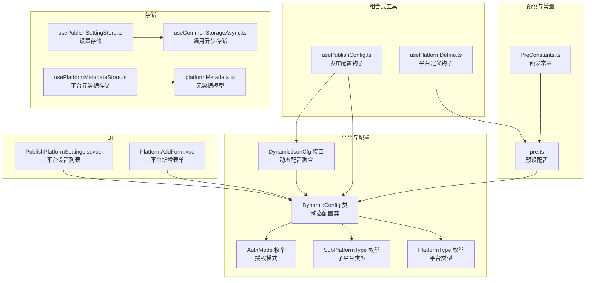
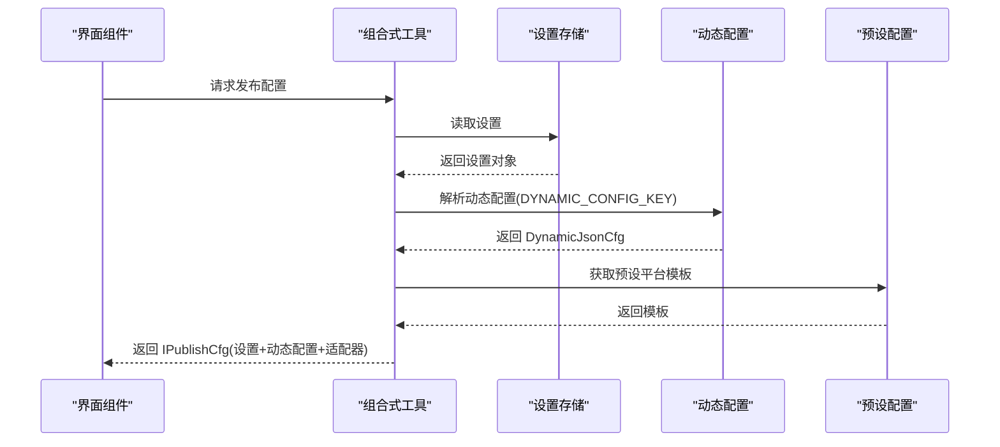
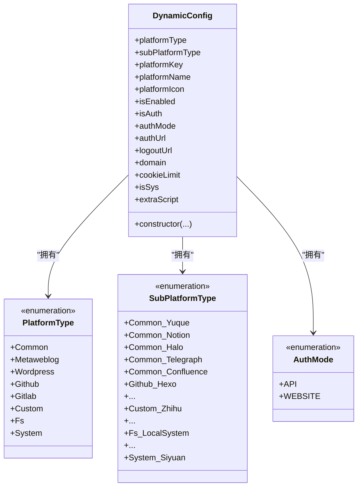
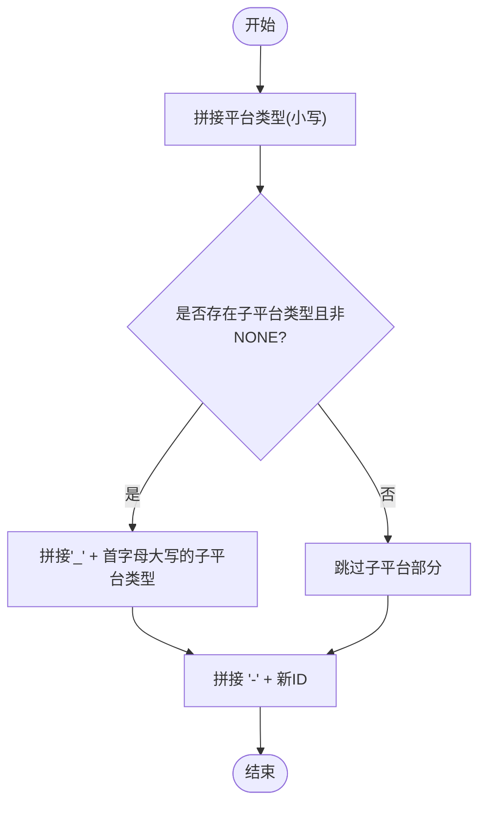
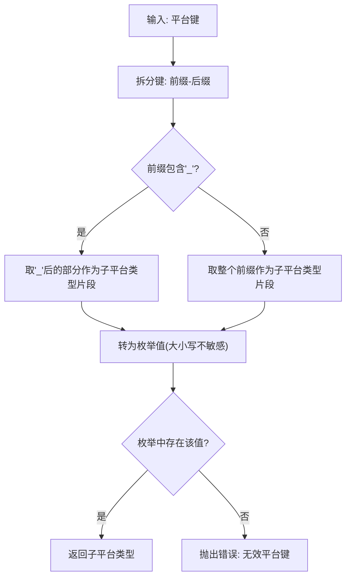
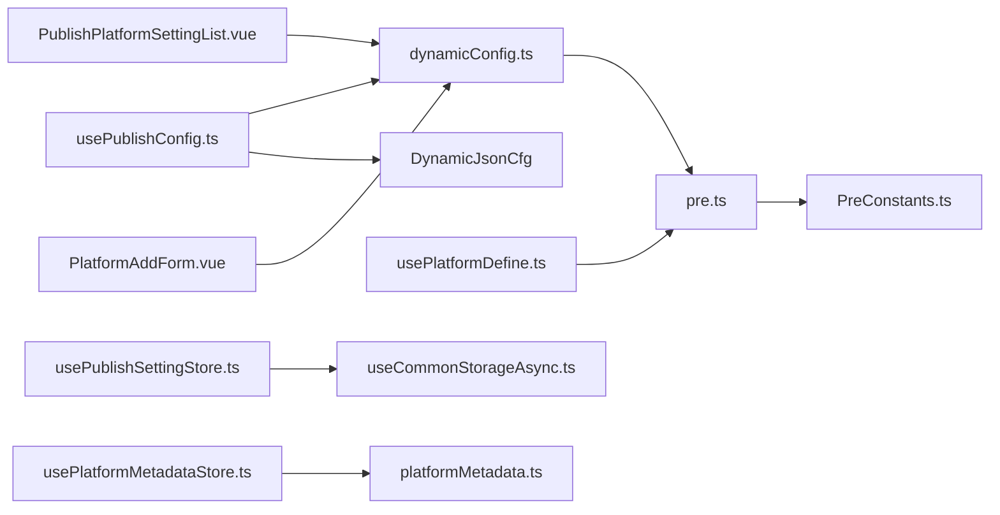

# 动态配置机制

<cite>
**本文档引用的文件**
- [dynamicConfig.ts](file://src/platforms/dynamicConfig.ts)
- [dynamicConfig.spec.ts](file://src/platforms/dynamicConfig.spec.ts)
- [pre.ts](file://src/platforms/pre.ts)
- [PreConstants.ts](file://src/platforms/PreConstants.ts)
- [usePublishConfig.ts](file://src/composables/usePublishConfig.ts)
- [usePublishSettingStore.ts](file://src/stores/usePublishSettingStore.ts)
- [usePlatformDefine.ts](file://src/composables/usePlatformDefine.ts)
- [IPublishCfg.ts](file://src/types/IPublishCfg.ts)
- [constants.ts](file://src/utils/constants.ts)
- [usePlatformMetadataStore.ts](file://src/stores/usePlatformMetadataStore.ts)
- [platformMetadata.ts](file://src/models/platformMetadata.ts)
- [PublishPlatformSettingList.vue](file://src/components/set/publish/platform/PublishPlatformSettingList.vue)
- [PlatformAddForm.vue](file://src/components/set/publish/form/PlatformAddForm.vue)
</cite>

## 目录
1. [简介](#简介)
2. [项目结构](#项目结构)
3. [核心组件](#核心组件)
4. [架构总览](#架构总览)
5. [详细组件分析](#详细组件分析)
6. [依赖关系分析](#依赖关系分析)
7. [性能考量](#性能考量)
8. [故障排查指南](#故障排查指南)
9. [结论](#结论)
10. [附录](#附录)

## 简介
本文件系统性阐述“动态配置机制”的设计与实现，重点围绕 DynamicConfig 类及其配套工具函数，解释平台类型枚举、子平台类型系统、授权模式管理等核心概念；详解动态配置的数据结构设计、平台标识符生成规则、配置验证机制、配置查找与替换算法；梳理配置分类体系（Common、Github、Gitlab、Metaweblog、Wordpress、Custom、Fs、System）；并提供配置操作 API 的使用方法（添加、删除、修改、查询），以及配置键值规则、平台标识符生成、配置冲突检测等关键技术点。

## 项目结构
动态配置机制主要分布在以下模块：
- 平台定义与动态配置：src/platforms/dynamicConfig.ts、src/platforms/pre.ts、src/platforms/PreConstants.ts
- 配置访问与组合式工具：src/composables/usePublishConfig.ts、src/composables/usePlatformDefine.ts
- 配置存储与持久化：src/stores/usePublishSettingStore.ts、src/stores/common/useCommonStorageAsync.ts
- 类型与常量：src/types/IPublishCfg.ts、src/utils/constants.ts
- 元数据模型与存储：src/models/platformMetadata.ts、src/stores/usePlatformMetadataStore.ts
- UI 展示与操作：src/components/set/publish/platform/PublishPlatformSettingList.vue、src/components/set/publish/form/PlatformAddForm.vue

图表来源
- [dynamicConfig.ts:13-113](file://src/platforms/dynamicConfig.ts#L13-L113)
- [pre.ts:101-462](file://src/platforms/pre.ts#L101-L462)
- [usePublishConfig.ts:26-99](file://src/composables/usePublishConfig.ts#L26-L99)
- [usePlatformDefine.ts:18-82](file://src/composables/usePlatformDefine.ts#L18-L82)
- [usePublishSettingStore.ts:21-95](file://src/stores/usePublishSettingStore.ts#L21-L95)
- [usePlatformMetadataStore.ts:21-128](file://src/stores/usePlatformMetadataStore.ts#L21-L128)

章节来源
- [dynamicConfig.ts:13-113](file://src/platforms/dynamicConfig.ts#L13-L113)
- [pre.ts:101-462](file://src/platforms/pre.ts#L101-L462)
- [usePublishConfig.ts:26-99](file://src/composables/usePublishConfig.ts#L26-L99)
- [usePlatformDefine.ts:18-82](file://src/composables/usePlatformDefine.ts#L18-L82)
- [usePublishSettingStore.ts:21-95](file://src/stores/usePublishSettingStore.ts#L21-L95)
- [usePlatformMetadataStore.ts:21-128](file://src/stores/usePlatformMetadataStore.ts#L21-L128)

## 核心组件
- DynamicConfig 类：承载单个平台的动态配置，包含平台类型、子平台类型、平台键、名称、图标、启用状态、授权状态、授权模式、登录/登出地址、域名、Cookie 限制、是否内置、额外脚本等字段，并在构造时根据平台键自动推断授权模式。
- 平台类型枚举（PlatformType）：定义通用平台（Common）、Metaweblog、Wordpress、GitHub、Gitlab、自定义（Custom）、文件系统（Fs）、系统（System）等八类。
- 子平台类型枚举（SubPlatformType）：按平台类型细分，如 Common 下的语雀、Notion、Halo、Telegraph、Confluence；Github/Gitlab 下的 Hexo、Hugo、Jekyll、Quartz、Vuepress、Vitepress、Astro；Metaweblog 下的博客园、Typecho、Jvue；Wordpress 下的官方与 dotcom；Custom 下的知乎、CSDN、微信公众号、简书、掘金、Halo网页版、哔哩哔哩等；Fs 下的本地系统及多家网盘；System 下的思源笔记。
- 授权模式（AuthMode）：API 与 WEBSITE 两种模式，用于区分接口授权与网页授权。
- 动态配置聚合（DynamicJsonCfg）：将动态配置按类型拆分为 totalCfg、commonCfg、githubCfg、gitlabCfg、metaweblogCfg、wordpressCfg、customCfg、fsCfg、systemCfg 等集合，便于按需检索与渲染。
- 预设配置（pre.ts）：提供各平台的默认配置模板，包含平台图标、授权模式、登录地址、域名等信息。
- 预设常量（PreConstants.ts）：集中管理预设平台键，避免硬编码。
- 组合式工具（usePublishConfig、usePlatformDefine）：提供获取发布配置、解析动态配置、获取预设平台等能力。
- 存储（usePublishSettingStore、useCommonStorageAsync）：统一管理配置的读写与缓存。
- 元数据模型（platformMetadata.ts、usePlatformMetadataStore）：为平台维护标签、分类、模板等元数据，支持去重合并更新。

章节来源
- [dynamicConfig.ts:13-113](file://src/platforms/dynamicConfig.ts#L13-L113)
- [dynamicConfig.ts:126-238](file://src/platforms/dynamicConfig.ts#L126-L238)
- [pre.ts:101-462](file://src/platforms/pre.ts#L101-L462)
- [PreConstants.ts:10-19](file://src/platforms/PreConstants.ts#L10-L19)
- [usePublishConfig.ts:26-99](file://src/composables/usePublishConfig.ts#L26-L99)
- [usePlatformDefine.ts:18-82](file://src/composables/usePlatformDefine.ts#L18-L82)
- [usePublishSettingStore.ts:21-95](file://src/stores/usePublishSettingStore.ts#L21-L95)
- [platformMetadata.ts:16-47](file://src/models/platformMetadata.ts#L16-L47)
- [usePlatformMetadataStore.ts:21-128](file://src/stores/usePlatformMetadataStore.ts#L21-L128)

## 架构总览
动态配置机制以 DynamicConfig 为核心，通过预设配置模板与运行时动态配置结合，形成“预设模板 + 用户自定义”的双轨配置体系。配置通过组合式工具加载到内存，再由存储层持久化到本地。UI 层负责展示与交互，提供平台增删改查与授权流程入口。

图表来源
- [usePublishConfig.ts:36-64](file://src/composables/usePublishConfig.ts#L36-L64)
- [usePublishSettingStore.ts:38-48](file://src/stores/usePublishSettingStore.ts#L38-L48)
- [constants.ts:19](file://src/utils/constants.ts#L19)
- [pre.ts:101-462](file://src/platforms/pre.ts#L101-L462)

## 详细组件分析

### DynamicConfig 类与枚举体系
- 设计要点
  - 构造函数根据平台键是否包含“Custom”自动将授权模式切换为 WEBSITE，其余默认 API。
  - 支持平台图标、启用状态、授权状态、Cookie 限制、是否内置、额外脚本等扩展字段。
  - 子平台类型与平台类型一一对应，保证配置的可分类性与可扩展性。
- 数据结构复杂度
  - 字段访问 O(1)，构造与初始化 O(1)。
  - 子平台类型枚举规模固定，不影响运行时性能。
- 错误处理
  - 子平台类型解析失败时抛出错误，确保配置一致性。
- 性能影响
  - 该类为轻量数据载体，对整体性能影响可忽略。

图表来源
- [dynamicConfig.ts:13-113](file://src/platforms/dynamicConfig.ts#L13-L113)
- [dynamicConfig.ts:126-238](file://src/platforms/dynamicConfig.ts#L126-L238)

章节来源
- [dynamicConfig.ts:13-113](file://src/platforms/dynamicConfig.ts#L13-L113)
- [dynamicConfig.ts:126-238](file://src/platforms/dynamicConfig.ts#L126-L238)

### 配置分类系统（八种平台类型）
- Common：通用平台，如语雀、Notion、Halo、Telegraph、Confluence。
- Github：静态站点托管平台，如 Hexo、Hugo、Jekyll、Quartz、Vuepress、Vitepress、Astro。
- Gitlab：Gitlab CI/CD 驱动的静态站点，如 Gitlabhexo、Gitlabhugo、Gitlabjekyll、Gitlabvuepress、Gitlabvuepress2、Gitlabvitepress、Gitlabastro。
- Metaweblog：XML-RPC 协议平台，如博客园、Typecho、Jvue。
- Wordpress：WordPress 生态，如官方与 dotcom。
- Custom：网页授权平台，如知乎、CSDN、微信公众号、简书、掘金、Halo网页版、哔哩哔哩。
- Fs：文件系统与网盘平台，如本地系统、FTP/SFTP、百度网盘、阿里云盘、微云、豆包、OneDrive、Google Drive、夸克。
- System：系统内置平台，如思源笔记。

章节来源
- [pre.ts:101-462](file://src/platforms/pre.ts#L101-L462)
- [dynamicConfig.ts:126-166](file://src/platforms/dynamicConfig.ts#L126-L166)

### 授权模式管理
- API 模式：通过接口进行授权与数据交互，适用于大多数博客与静态站点平台。
- WEBSITE 模式：通过网页授权流程完成登录与 Cookie 管理，适用于需要浏览器环境或特定域名策略的平台（如 Custom 下的部分站点）。
- 授权模式推断：当平台键包含“Custom”时，自动切换为 WEBSITE 模式；否则默认 API 模式。

章节来源
- [dynamicConfig.ts:91-112](file://src/platforms/dynamicConfig.ts#L91-L112)
- [dynamicConfig.ts:118-121](file://src/platforms/dynamicConfig.ts#L118-L121)
- [pre.ts:337-438](file://src/platforms/pre.ts#L337-L438)

### 平台标识符生成规则
- 规则
  - 平台与子平台之间使用下划线连接，平台与 ID 之间使用短横线连接。
  - 子平台类型为 NONE 时不附加子平台部分。
  - ID 采用统一的 ID 工具生成，保证全局唯一性。
- 示例
  - 通用平台 + 语雀：common_Yuque-<ID>
  - Github + Hugo：github_Hugo-<ID>
  - Custom + 知乎：custom_Zhihu-<ID>
- 用途
  - 作为配置键、文章 ID 键、YAML 键等的基础，确保跨模块一致识别。

图表来源
- [dynamicConfig.ts:428-437](file://src/platforms/dynamicConfig.ts#L428-L437)

章节来源
- [dynamicConfig.ts:428-437](file://src/platforms/dynamicConfig.ts#L428-L437)

### 配置验证机制与冲突检测
- 平台键冲突检测
  - isDynamicKeyExists：遍历动态配置数组，判断给定键是否已存在，时间复杂度 O(n)。
- 子平台类型解析
  - getSubPlatformTypeByKey：从平台键中提取子平台类型部分，转为枚举值，若不匹配则抛错。
- 配置查找
  - getDynCfgByKey：按平台键线性查找，返回对应 DynamicConfig；未找到返回空。
- 配置替换
  - replacePlatformByKey：复制原数组，定位并替换指定键的配置，返回新数组。
- 删除
  - deletePlatformByKey：过滤掉匹配键的元素，返回新数组。

图表来源
- [dynamicConfig.ts:397-418](file://src/platforms/dynamicConfig.ts#L397-L418)

章节来源
- [dynamicConfig.ts:442-451](file://src/platforms/dynamicConfig.ts#L442-L451)
- [dynamicConfig.ts:456-463](file://src/platforms/dynamicConfig.ts#L456-L463)
- [dynamicConfig.ts:473-486](file://src/platforms/dynamicConfig.ts#L473-L486)
- [dynamicConfig.ts:495-497](file://src/platforms/dynamicConfig.ts#L495-L497)
- [dynamicConfig.ts:397-418](file://src/platforms/dynamicConfig.ts#L397-L418)

### 配置聚合与分类
- setDynamicJsonCfg：将一维动态配置数组按平台类型拆分为多个集合，便于 UI 渲染与业务逻辑按类处理。
- getSubtypeList：根据平台类型返回其子平台类型列表，用于表单选择与初始化。

章节来源
- [dynamicConfig.ts:336-392](file://src/platforms/dynamicConfig.ts#L336-L392)
- [dynamicConfig.ts:258-329](file://src/platforms/dynamicConfig.ts#L258-L329)

### 配置操作 API 使用方法
- 添加平台
  - 通过表单初始化 DynamicConfig，生成唯一平台键，校验键是否已存在，若不存在则加入动态配置数组，重新聚合并持久化。
  - 参考：[PlatformAddForm.vue:155-190](file://src/components/set/publish/form/PlatformAddForm.vue#L155-L190)
- 删除平台
  - 使用 deletePlatformByKey 过滤掉目标键，更新聚合配置并保存。
  - 参考：[PublishPlatformSettingList.vue:78-85](file://src/components/set/publish/platform/PublishPlatformSettingList.vue#L78-L85)
- 修改平台
  - 使用 replacePlatformByKey 替换指定键的配置，更新聚合配置并保存。
  - 参考：[PublishPlatformSettingList.vue:78-85](file://src/components/set/publish/platform/PublishPlatformSettingList.vue#L78-L85)
- 查询平台
  - 通过 getDynCfgByKey 按键查询，或通过 getSubPlatformTypeByKey 解析子平台类型。
  - 参考：[dynamicConfig.ts:456-463](file://src/platforms/dynamicConfig.ts#L456-L463)、[dynamicConfig.ts:397-418](file://src/platforms/dynamicConfig.ts#L397-L418)

章节来源
- [PlatformAddForm.vue:155-190](file://src/components/set/publish/form/PlatformAddForm.vue#L155-L190)
- [PublishPlatformSettingList.vue:78-85](file://src/components/set/publish/platform/PublishPlatformSettingList.vue#L78-L85)
- [dynamicConfig.ts:456-463](file://src/platforms/dynamicConfig.ts#L456-L463)
- [dynamicConfig.ts:397-418](file://src/platforms/dynamicConfig.ts#L397-L418)

### 配置键值规则与元数据键生成
- 动态文章 ID 键：custom-<platformKey>-post-id
- 动态 YAML 键：custom-<platformKey替换下划线为短横线>-yaml
- 元数据键反向解析：从 post-id 键中提取 platformKey，格式不合法时抛错。
- 用途：用于存储每篇文章在各平台的 ID 与 YAML 配置，实现跨平台发布与回溯。

章节来源
- [dynamicConfig.ts:504-515](file://src/platforms/dynamicConfig.ts#L504-L515)
- [dynamicConfig.ts:522-533](file://src/platforms/dynamicConfig.ts#L522-L533)

### 预设配置与常量
- 预设配置（pre.ts）：集中定义各平台的默认图标、授权模式、登录地址、域名等，作为初始化模板。
- 预设常量（PreConstants.ts）：集中管理预设平台键，避免硬编码，便于统一维护。
- 预设白名单与限制：extraPreCfg 中包含 Cookie 白名单、UA 白名单、黑名单与提示信息，用于处理特定平台的策略限制。

章节来源
- [pre.ts:101-462](file://src/platforms/pre.ts#L101-L462)
- [PreConstants.ts:10-19](file://src/platforms/PreConstants.ts#L10-L19)
- [pre.ts:20-45](file://src/platforms/pre.ts#L20-L45)

### 发布配置获取与适配器初始化
- usePublishConfig：从设置存储中读取动态配置，解析 DynamicJsonCfg，按需加载具体平台配置与适配器，返回 IPublishCfg 结构供上层使用。
- IPublishCfg：统一承载设置、动态配置数组、平台配置与动态配置对象，便于组件复用。

章节来源
- [usePublishConfig.ts:36-64](file://src/composables/usePublishConfig.ts#L36-L64)
- [IPublishCfg.ts:21-47](file://src/types/IPublishCfg.ts#L21-L47)
- [constants.ts:19](file://src/utils/constants.ts#L19)

### 平台元数据管理
- 元数据模型：PlatformMetadata 与 MetadataItem，分别表示平台元数据集合与单项（标签、分类、模板）。
- 存储与更新：usePlatformMetadataStore 提供获取与只读包装、按平台键读取、合并更新（去重、去空串、trim）等能力，确保元数据一致性与性能。

章节来源
- [platformMetadata.ts:16-47](file://src/models/platformMetadata.ts#L16-L47)
- [usePlatformMetadataStore.ts:51-122](file://src/stores/usePlatformMetadataStore.ts#L51-L122)

## 依赖关系分析
- 组件耦合
  - DynamicConfig 与枚举强耦合，但无外部副作用，内聚性高。
  - 预设配置与常量解耦，便于独立演进。
  - 组合式工具依赖存储与动态配置，UI 组件依赖组合式工具与存储。
- 外部依赖
  - 适配器（Adaptors）在运行时按子平台类型动态加载，与动态配置解耦。
- 循环依赖
  - 未发现循环依赖迹象，模块边界清晰。

图表来源
- [dynamicConfig.ts:13-113](file://src/platforms/dynamicConfig.ts#L13-L113)
- [pre.ts:101-462](file://src/platforms/pre.ts#L101-L462)
- [usePublishConfig.ts:26-99](file://src/composables/usePublishConfig.ts#L26-L99)
- [usePlatformDefine.ts:18-82](file://src/composables/usePlatformDefine.ts#L18-L82)
- [usePublishSettingStore.ts:21-95](file://src/stores/usePublishSettingStore.ts#L21-L95)
- [PublishPlatformSettingList.vue:78-85](file://src/components/set/publish/platform/PublishPlatformSettingList.vue#L78-L85)
- [PlatformAddForm.vue:155-190](file://src/components/set/publish/form/PlatformAddForm.vue#L155-L190)
- [usePlatformMetadataStore.ts:21-128](file://src/stores/usePlatformMetadataStore.ts#L21-L128)

章节来源
- [dynamicConfig.ts:13-113](file://src/platforms/dynamicConfig.ts#L13-L113)
- [pre.ts:101-462](file://src/platforms/pre.ts#L101-L462)
- [usePublishConfig.ts:26-99](file://src/composables/usePublishConfig.ts#L26-L99)
- [usePlatformDefine.ts:18-82](file://src/composables/usePlatformDefine.ts#L18-L82)
- [usePublishSettingStore.ts:21-95](file://src/stores/usePublishSettingStore.ts#L21-L95)
- [PublishPlatformSettingList.vue:78-85](file://src/components/set/publish/platform/PublishPlatformSettingList.vue#L78-L85)
- [PlatformAddForm.vue:155-190](file://src/components/set/publish/form/PlatformAddForm.vue#L155-L190)
- [usePlatformMetadataStore.ts:21-128](file://src/stores/usePlatformMetadataStore.ts#L21-L128)

## 性能考量
- 查找与替换
  - getDynCfgByKey、replacePlatformByKey、deletePlatformByKey 均为线性扫描，适合小型配置集（通常数百以内）。
  - 若配置规模增长，建议引入 Map 以降低查找复杂度至 O(1)。
- 序列化与存储
  - 动态配置聚合与 JSON 序列化开销较小，但应避免频繁写入；批量更新后再持久化更优。
- 图标与预设
  - 预设配置在初始化阶段一次性加载，后续仅做映射，成本低。
- 元数据更新
  - 去重与过滤操作为线性，建议控制每次更新的数据量，避免大量小更新。

## 故障排查指南
- 子平台类型解析失败
  - 现象：解析平台键时报“无效平台键”。
  - 排查：确认平台键格式是否符合“平台_子平台-ID”，子平台部分是否与枚举值一致（大小写不敏感）。
  - 参考：[dynamicConfig.ts:397-418](file://src/platforms/dynamicConfig.ts#L397-L418)
- 平台键重复
  - 现象：添加平台时报重复。
  - 排查：使用 isDynamicKeyExists 检查，必要时重新生成平台键。
  - 参考：[dynamicConfig.ts:442-451](file://src/platforms/dynamicConfig.ts#L442-L451)
- 配置未生效
  - 现象：修改后未保存或未刷新。
  - 排查：确认 replacePlatformByKey 后是否重新 setDynamicJsonCfg 并 updateSetting。
  - 参考：[PublishPlatformSettingList.vue:78-85](file://src/components/set/publish/platform/PublishPlatformSettingList.vue#L78-L85)
- 网页授权异常
  - 现象：Custom 平台登录失败或 Cookie 限制。
  - 排查：检查 authUrl、domain、UA 白名单与 headersMap；必要时参考 extraPreCfg 的策略。
  - 参考：[pre.ts:20-45](file://src/platforms/pre.ts#L20-L45)、[pre.ts:337-438](file://src/platforms/pre.ts#L337-L438)

章节来源
- [dynamicConfig.ts:397-418](file://src/platforms/dynamicConfig.ts#L397-L418)
- [dynamicConfig.ts:442-451](file://src/platforms/dynamicConfig.ts#L442-L451)
- [PublishPlatformSettingList.vue:78-85](file://src/components/set/publish/platform/PublishPlatformSettingList.vue#L78-L85)
- [pre.ts:20-45](file://src/platforms/pre.ts#L20-L45)
- [pre.ts:337-438](file://src/platforms/pre.ts#L337-L438)

## 结论
动态配置机制通过 DynamicConfig 与枚举体系实现了对多平台、多子平台的统一建模，配合预设模板与运行时配置，既保证了灵活性，又维持了可维护性。平台标识符生成规则与键值规范确保了跨模块一致性；查找、替换、删除等操作 API 明确，易于扩展。未来可在大规模场景下引入索引优化与批量更新策略，进一步提升性能与用户体验。

## 附录
- 测试用例参考：[dynamicConfig.spec.ts:18-34](file://src/platforms/dynamicConfig.spec.ts#L18-L34)
- 常量定义：[constants.ts:19](file://src/utils/constants.ts#L19)