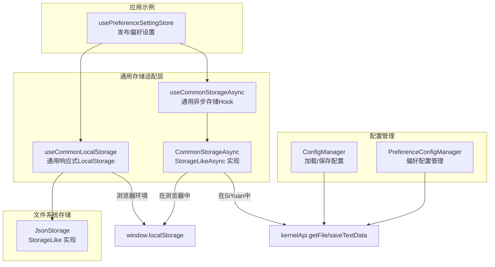
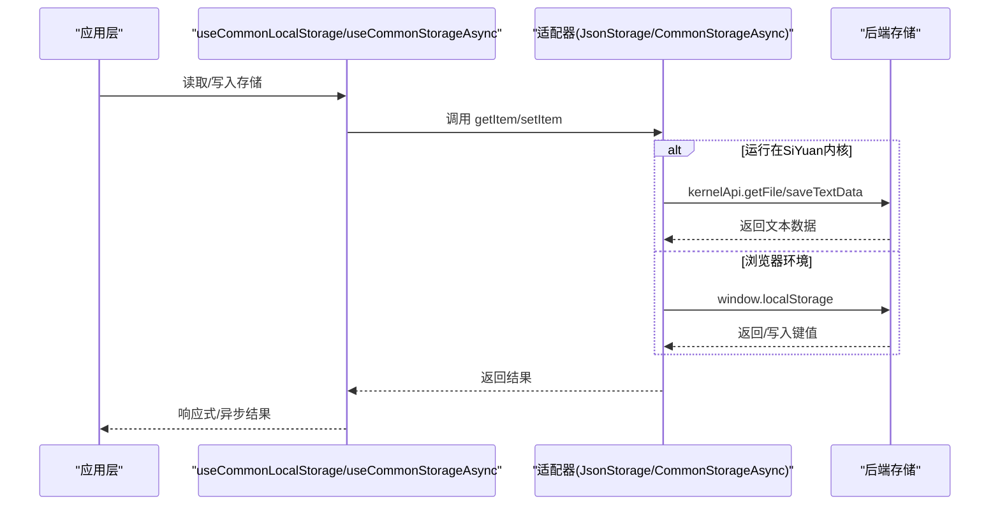
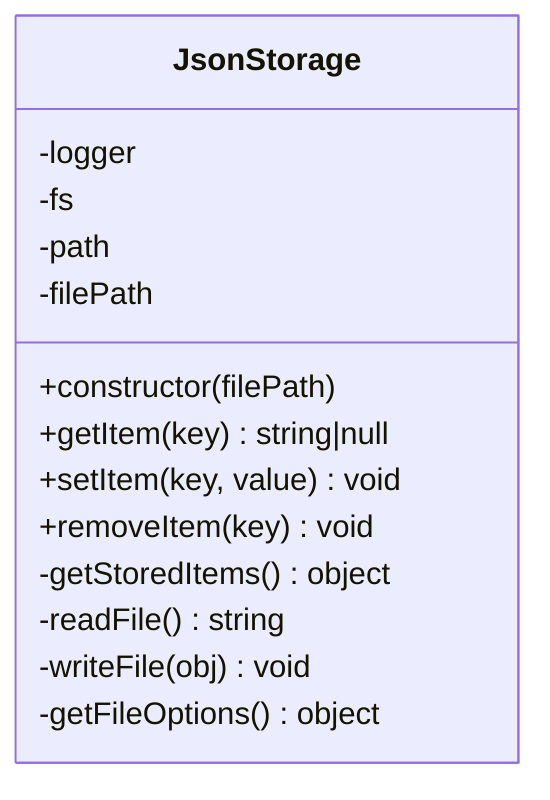
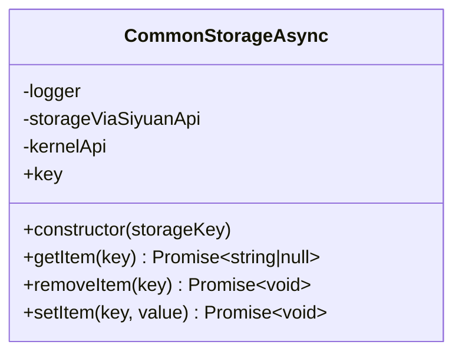
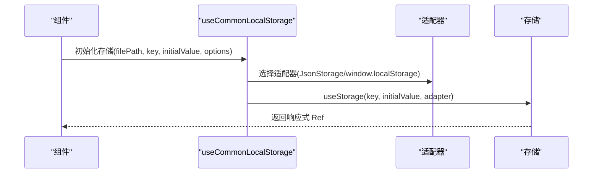
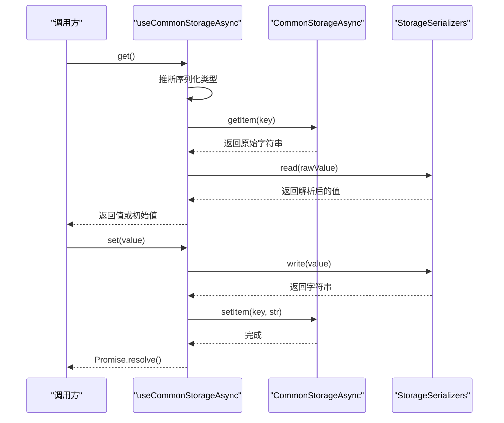
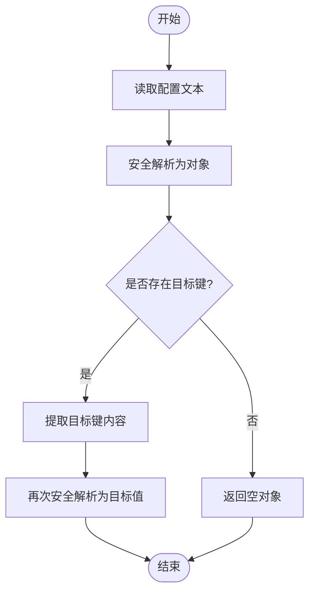
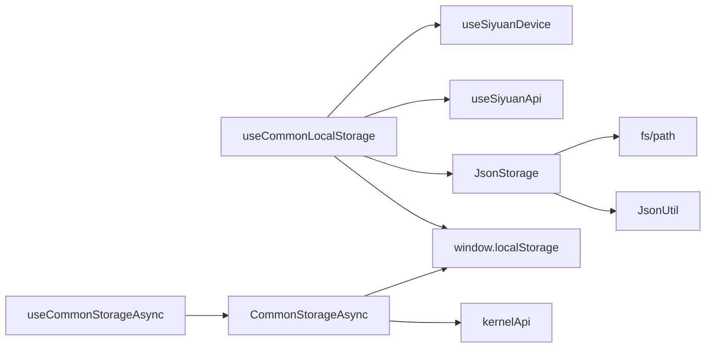

# 存储和持久化

<cite>
**本文档引用的文件**
- [jsonStorage.ts](file://src/stores/common/jsonStorage.ts)
- [commonStorageAsync.ts](file://src/stores/common/commonStorageAsync.ts)
- [useCommonStorageAsync.ts](file://src/stores/common/useCommonStorageAsync.ts)
- [useCommonLocalStorage.ts](file://src/stores/common/useCommonLocalStorage.ts)
- [usePreferenceSettingStore.ts](file://src/stores/usePreferenceSettingStore.ts)
- [config.ts](file://siyuan/store/config.ts)
- [preferenceConfigManager.ts](file://siyuan/store/preferenceConfigManager.ts)
</cite>

## 目录
1. [简介](#简介)
2. [项目结构](#项目结构)
3. [核心组件](#核心组件)
4. [架构总览](#架构总览)
5. [详细组件分析](#详细组件分析)
6. [依赖关系分析](#依赖关系分析)
7. [性能考量](#性能考量)
8. [故障排查指南](#故障排查指南)
9. [结论](#结论)
10. [附录](#附录)

## 简介
本文件系统性梳理了该 SiYuan 插件项目的存储与持久化体系，重点覆盖以下方面：
- 本地存储机制：localStorage 与 sessionStorage 的使用策略、数据序列化与反序列化流程
- 异步存储管理：useCommonStorageAsync 的实现模式、Promise 包装机制、错误处理策略
- JSON 存储系统：架构设计、数据格式标准化、版本兼容性处理、存储容量限制与优化策略
- 存储配置最佳实践：敏感数据保护、存储性能优化、数据备份与恢复机制
- 存储迁移工具、数据清理策略、存储监控与调试方法

## 项目结构
围绕存储与持久化的代码主要分布在以下模块：
- 通用存储适配层：useCommonLocalStorage、useCommonStorageAsync、CommonStorageAsync
- 文件系统存储：JsonStorage（Electron/桌面端）
- 配置管理：ConfigManager、PreferenceConfigManager（基于 Kernel API 的文本存储）
- 应用示例：usePreferenceSettingStore 展示如何在业务层使用上述存储能力

**图表来源**
- [useCommonLocalStorage.ts:18-55](file://src/stores/common/useCommonLocalStorage.ts#L18-L55)
- [useCommonStorageAsync.ts:16-64](file://src/stores/common/useCommonStorageAsync.ts#L16-L64)
- [commonStorageAsync.ts:16-113](file://src/stores/common/commonStorageAsync.ts#L16-L113)
- [jsonStorage.ts:15-106](file://src/stores/common/jsonStorage.ts#L15-L106)
- [usePreferenceSettingStore.ts:18-67](file://src/stores/usePreferenceSettingStore.ts#L18-L67)
- [config.ts:33-46](file://siyuan/store/config.ts#L33-L46)
- [preferenceConfigManager.ts:33-51](file://siyuan/store/preferenceConfigManager.ts#L33-L51)

**章节来源**
- [useCommonLocalStorage.ts:18-55](file://src/stores/common/useCommonLocalStorage.ts#L18-L55)
- [useCommonStorageAsync.ts:16-64](file://src/stores/common/useCommonStorageAsync.ts#L16-L64)
- [commonStorageAsync.ts:16-113](file://src/stores/common/commonStorageAsync.ts#L16-L113)
- [jsonStorage.ts:15-106](file://src/stores/common/jsonStorage.ts#L15-L106)
- [usePreferenceSettingStore.ts:18-67](file://src/stores/usePreferenceSettingStore.ts#L18-L67)
- [config.ts:33-46](file://siyuan/store/config.ts#L33-L46)
- [preferenceConfigManager.ts:33-51](file://siyuan/store/preferenceConfigManager.ts#L33-L51)

## 核心组件
本节对关键存储组件进行深入剖析，涵盖职责、接口契约、数据流与错误处理。

- JsonStorage（文件系统存储）
  - 职责：在桌面/嵌入式环境中以 JSON 文件形式持久化键值对
  - 关键点：动态导入 fs/path、确保目录与文件存在、UTF-8 读写、JSON 解析容错
  - 复杂度：O(1) 读写，文件 IO 开销取决于磁盘性能
  - 错误处理：读写失败时记录日志，不抛出异常阻断流程

- CommonStorageAsync（通用异步存储）
  - 职责：统一在 SiYuan 内核与浏览器环境下的存储访问
  - 关键点：根据运行环境选择 kernelApi 或 window.localStorage；键名映射策略
  - 复杂度：内核 API 访问为网络/IPC 调用，浏览器为内存操作
  - 错误处理：捕获异常并记录，保证返回安全默认值

- useCommonLocalStorage（通用响应式 LocalStorage）
  - 职责：在不同运行环境下自动选择适配器（JsonStorage 或 window.localStorage），并结合 @vueuse/core 的 useStorage 提供响应式存储
  - 关键点：设备检测、适配器选择、序列化器传递

- useCommonStorageAsync（通用异步存储 Hook）
  - 职责：基于 CommonStorageAsync 提供 get/set 异步 API，自动推断序列化类型并处理初始值
  - 关键点：类型推断、序列化器选择、初始值回填、空值兜底

**章节来源**
- [jsonStorage.ts:23-106](file://src/stores/common/jsonStorage.ts#L23-L106)
- [commonStorageAsync.ts:24-113](file://src/stores/common/commonStorageAsync.ts#L24-L113)
- [useCommonLocalStorage.ts:27-55](file://src/stores/common/useCommonLocalStorage.ts#L27-L55)
- [useCommonStorageAsync.ts:22-84](file://src/stores/common/useCommonStorageAsync.ts#L22-L84)

## 架构总览
下图展示了从应用层到存储后端的整体调用链路与数据流向：

**图表来源**
- [useCommonLocalStorage.ts:33-34](file://src/stores/common/useCommonLocalStorage.ts#L33-L34)
- [useCommonStorageAsync.ts:27-27](file://src/stores/common/useCommonStorageAsync.ts#L27-L27)
- [commonStorageAsync.ts:51-112](file://src/stores/common/commonStorageAsync.ts#L51-L112)
- [jsonStorage.ts:59-87](file://src/stores/common/jsonStorage.ts#L59-L87)

## 详细组件分析

### JsonStorage 组件分析
- 设计要点
  - 通过动态导入 fs/path 实现跨平台文件系统访问
  - 自动创建存储目录与初始化空 JSON 文件，避免首次写入失败
  - 采用 UTF-8 编码读写，确保多语言字符正确性
  - 使用安全解析（safeParse）避免 JSON 解析异常导致应用崩溃

- 数据结构与复杂度
  - 存储结构：单文件 JSON 对象，键为字符串，值为字符串（经序列化）
  - 读写复杂度：O(1)，整体受文件大小影响，建议控制单文件体积

- 依赖关系
  - 依赖 zhi-device 获取窗口对象与 require
  - 依赖 zhi-common 的 JsonUtil 进行安全解析

**图表来源**
- [jsonStorage.ts:23-106](file://src/stores/common/jsonStorage.ts#L23-L106)

**章节来源**
- [jsonStorage.ts:29-51](file://src/stores/common/jsonStorage.ts#L29-L51)
- [jsonStorage.ts:59-106](file://src/stores/common/jsonStorage.ts#L59-L106)

### CommonStorageAsync 组件分析
- 设计要点
  - 实现 StorageLikeAsync 接口，统一异步存取行为
  - 运行时判断：在 SiYuan 内核中使用 kernelApi 的文本读写；在浏览器中使用 window.localStorage
  - 键名策略：内核模式直接使用传入 key；浏览器模式从路径中提取文件名并去除扩展名作为 key
  - 空值兜底：当读取为空时返回空对象字符串，避免上层逻辑异常

- 错误处理
  - 捕获内核 API 与 localStorage 访问异常，记录错误日志但不中断流程
  - setItem 在内核模式下仅记录日志，不抛出异常

**图表来源**
- [commonStorageAsync.ts:24-113](file://src/stores/common/commonStorageAsync.ts#L24-L113)

**章节来源**
- [commonStorageAsync.ts:30-43](file://src/stores/common/commonStorageAsync.ts#L30-L43)
- [commonStorageAsync.ts:51-79](file://src/stores/common/commonStorageAsync.ts#L51-L79)
- [commonStorageAsync.ts:98-113](file://src/stores/common/commonStorageAsync.ts#L98-L113)

### useCommonLocalStorage 组件分析
- 设计要点
  - 根据设备检测自动选择适配器：桌面/嵌入式使用 JsonStorage；浏览器使用 window.localStorage
  - 通过 @vueuse/core 的 useStorage 提供响应式存储能力
  - 支持传递序列化器（如 StorageSerializers.object）

- 典型使用场景
  - 发布偏好设置：通过 filePath 指定 JSON 文件路径，storageKey 作为内部键名
  - 与 SiYuan 配置联动：读取内置 AI 配置并注入到偏好设置中

**图表来源**
- [useCommonLocalStorage.ts:27-35](file://src/stores/common/useCommonLocalStorage.ts#L27-L35)
- [usePreferenceSettingStore.ts:34-38](file://src/stores/usePreferenceSettingStore.ts#L34-L38)

**章节来源**
- [useCommonLocalStorage.ts:43-55](file://src/stores/common/useCommonLocalStorage.ts#L43-L55)
- [usePreferenceSettingStore.ts:34-67](file://src/stores/usePreferenceSettingStore.ts#L34-L67)

### useCommonStorageAsync 组件分析
- 设计要点
  - 基于 CommonStorageAsync 封装异步 get/set
  - 类型推断：根据 initialValue 自动选择合适的序列化器
  - 初始值回填：若读取为空，自动写入初始值并返回
  - 空值兜底：读取到空字符串时转换为空对象字符串

- Promise 包装与错误处理
  - 所有读写操作均返回 Promise
  - 内部 try/catch 捕获异常并记录日志，避免影响上层调用

**图表来源**
- [useCommonStorageAsync.ts:22-64](file://src/stores/common/useCommonStorageAsync.ts#L22-L64)
- [commonStorageAsync.ts:51-112](file://src/stores/common/commonStorageAsync.ts#L51-L112)

**章节来源**
- [useCommonStorageAsync.ts:29-64](file://src/stores/common/useCommonStorageAsync.ts#L29-L64)
- [useCommonStorageAsync.ts:66-84](file://src/stores/common/useCommonStorageAsync.ts#L66-L84)

### 配置管理组件分析
- ConfigManager
  - 负责加载全局配置，使用 kernelApi 读取指定路径的文本并安全解析为对象
- PreferenceConfigManager
  - 从全局配置中提取特定键的偏好设置，支持嵌套结构与默认值处理

**图表来源**
- [config.ts:42-45](file://siyuan/store/config.ts#L42-L45)
- [preferenceConfigManager.ts:43-50](file://siyuan/store/preferenceConfigManager.ts#L43-L50)

**章节来源**
- [config.ts:42-45](file://siyuan/store/config.ts#L42-L45)
- [preferenceConfigManager.ts:43-50](file://siyuan/store/preferenceConfigManager.ts#L43-L50)

## 依赖关系分析
- 组件耦合
  - useCommonLocalStorage 依赖 useSiyuanDevice 与 useSiyuanApi，用于运行环境判断与内核 API 访问
  - JsonStorage 依赖 zhi-device 的窗口对象与 fs/path，以及 zhi-common 的 JsonUtil
  - useCommonStorageAsync 依赖 @vueuse/core 的 StorageSerializers 与 toRaw
- 外部依赖
  - SiYuan 内核 API：kernelApi.getFile/saveTextData
  - 浏览器：window.localStorage
  - 文件系统：fs、path（仅桌面/嵌入式）

**图表来源**
- [useCommonLocalStorage.ts:10-14](file://src/stores/common/useCommonLocalStorage.ts#L10-L14)
- [useCommonLocalStorage.ts:45-54](file://src/stores/common/useCommonLocalStorage.ts#L45-L54)
- [jsonStorage.ts:10-13](file://src/stores/common/jsonStorage.ts#L10-L13)
- [useCommonStorageAsync.ts:10-14](file://src/stores/common/useCommonStorageAsync.ts#L10-L14)
- [commonStorageAsync.ts:10-14](file://src/stores/common/commonStorageAsync.ts#L10-L14)

**章节来源**
- [useCommonLocalStorage.ts:10-14](file://src/stores/common/useCommonLocalStorage.ts#L10-L14)
- [jsonStorage.ts:10-13](file://src/stores/common/jsonStorage.ts#L10-L13)
- [useCommonStorageAsync.ts:10-14](file://src/stores/common/useCommonStorageAsync.ts#L10-L14)
- [commonStorageAsync.ts:10-14](file://src/stores/common/commonStorageAsync.ts#L10-L14)

## 性能考量
- 读写复杂度
  - JsonStorage：文件系统读写，O(1) 键访问，整体受磁盘性能与文件大小影响
  - CommonStorageAsync：内核模式为 IPC/网络调用，浏览器模式为内存操作
- 序列化开销
  - 大对象频繁序列化/反序列化会带来 CPU 开销，建议在业务层合并更新
- 存储容量与碎片
  - 单文件过大可能导致读写变慢，建议拆分或定期归档
- 缓存策略
  - 在应用层对热点数据进行内存缓存，减少重复读取

## 故障排查指南
- 常见问题与定位
  - 读取为空：检查空值兜底逻辑与初始值回填流程
  - 写入失败：确认运行环境（SiYuan 内核 vs 浏览器）、权限与路径
  - JSON 解析异常：确认文件完整性与编码一致性
- 日志与调试
  - 各组件均内置日志记录，可通过日志定位具体环节
  - 在浏览器开发者工具中观察 localStorage 变化
  - 在 SiYuan 中通过内核 API 调试查看文件内容

**章节来源**
- [commonStorageAsync.ts:54-71](file://src/stores/common/commonStorageAsync.ts#L54-L71)
- [commonStorageAsync.ts:100-112](file://src/stores/common/commonStorageAsync.ts#L100-L112)
- [jsonStorage.ts:92-98](file://src/stores/common/jsonStorage.ts#L92-L98)

## 结论
该存储体系通过统一的适配器模式与异步封装，实现了在不同运行环境（SiYuan 内核、浏览器、桌面/嵌入式）下的一致存储体验。JsonStorage 与 CommonStorageAsync 分别承担文件系统与通用异步存储职责，配合 useCommonLocalStorage 与 useCommonStorageAsync 提供响应式与异步两种使用方式。通过安全解析、空值兜底与完善的日志记录，系统具备良好的健壮性与可观测性。建议在生产环境中结合业务特点制定数据分片、缓存与备份策略，持续优化存储性能与可靠性。

## 附录
- 最佳实践清单
  - 敏感数据保护：避免将密钥等敏感信息明文存储；必要时使用内核侧专用存储或加密存储
  - 存储性能优化：合并小更新、控制单文件大小、使用内存缓存热点数据
  - 数据备份与恢复：定期导出关键配置文件；提供导入/恢复接口
  - 存储迁移工具：提供版本升级脚本，自动迁移旧格式到新格式
  - 数据清理策略：定期清理过期或无效键；提供一键清理功能
  - 存储监控与调试：启用详细日志；在开发阶段增加可视化调试面板